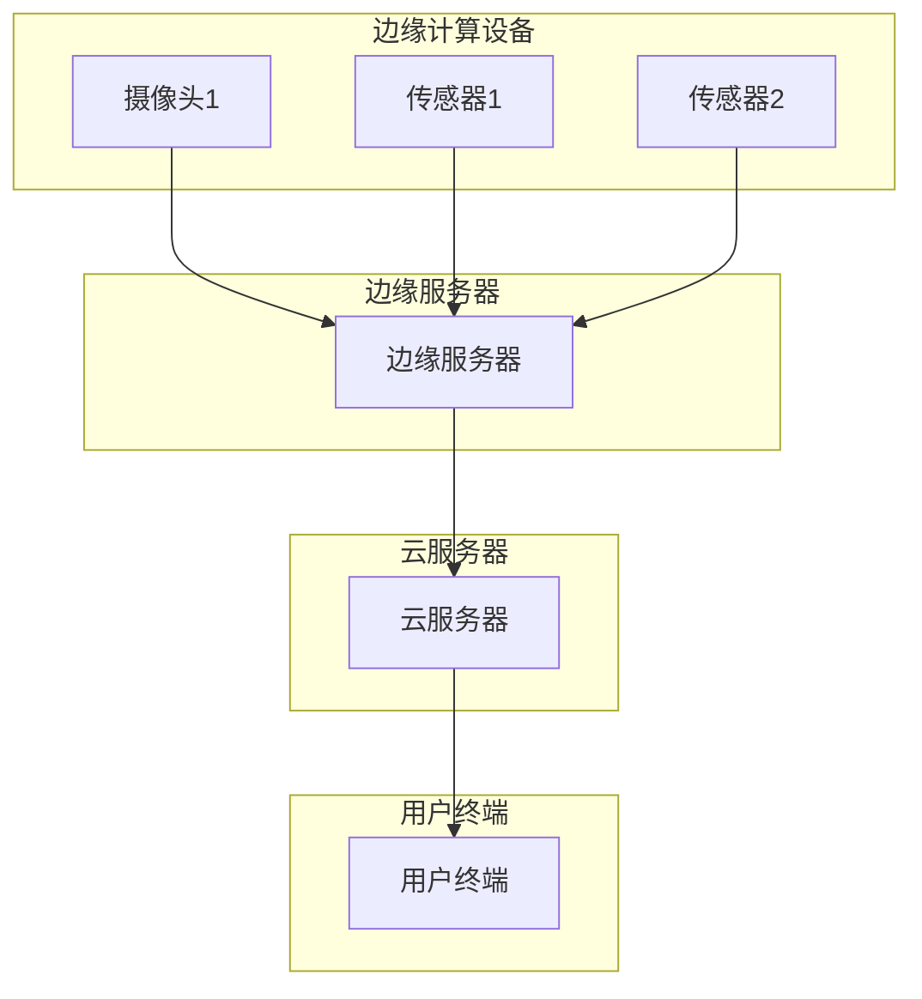
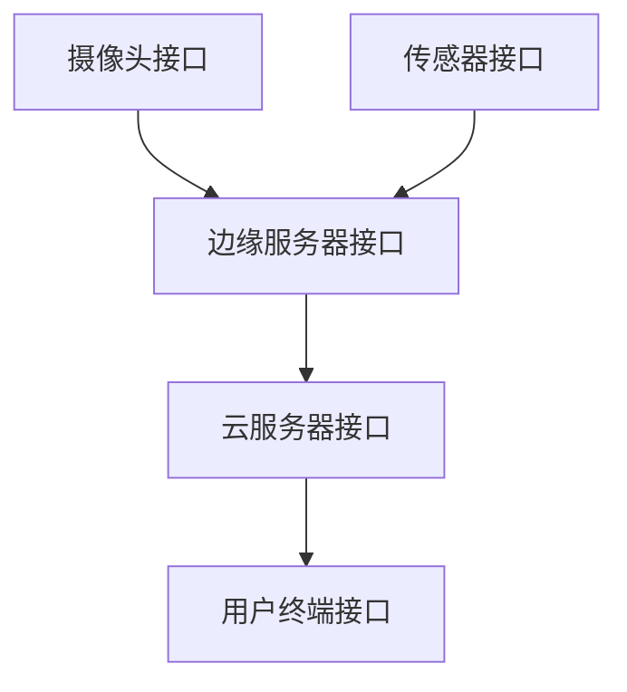
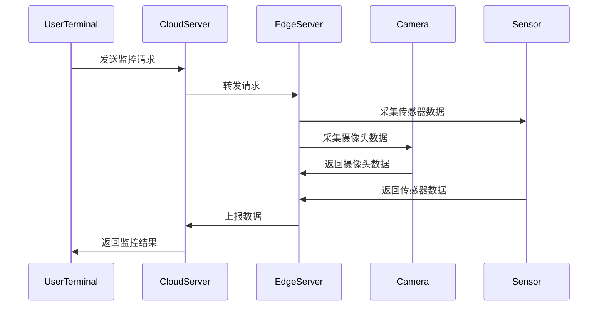

                 

### 引言

随着物联网技术的不断发展，智能家居已经成为现代家庭生活的重要组成部分。然而，随着智能家居设备的增多，家庭安全监控的问题也愈发突出。传统的安全监控方案往往依赖于中心化的云计算处理，这种方式在数据传输速度和安全性方面存在一定的局限性。为了解决这些问题，边缘AI技术应运而生，其在智能家居安全监控中的应用逐渐受到关注。

边缘AI是一种将计算、存储、数据处理和分析能力部署在靠近数据源的网络边缘的技术。相比于传统的云计算，边缘AI具有低延迟、高带宽、强安全性的优势，特别适合处理实时性要求高、敏感数据量大的场景。在智能家居安全监控中，边缘AI可以通过实时分析家庭环境中的视频、音频和传感器数据，实现智能预警和精准识别，从而提高家庭安全水平。

本文将围绕边缘AI在智能家居安全监控中的应用展开讨论，首先介绍边缘AI和智能家居安全监控的基本概念，然后深入探讨边缘AI算法的原理和应用，最后通过一个实际项目案例来展示边缘AI在智能家居安全监控中的具体实现过程。希望通过本文的介绍，读者能够对边缘AI在智能家居安全监控中的应用有一个全面而深入的理解。

## 关键词

边缘AI、智能家居、安全监控、深度学习、算法、实时分析

## 摘要

本文旨在探讨边缘AI技术在智能家居安全监控中的应用。通过介绍边缘AI的基本概念和智能家居安全监控的需求，本文分析了边缘AI在提高安全监控性能方面的优势。随后，本文详细阐述了边缘AI算法，包括深度学习模型在安全监控中的具体应用。最后，通过一个实际项目案例，本文展示了边缘AI在智能家居安全监控中的实现过程，并对未来发展趋势进行了展望。本文的核心目的是帮助读者理解边缘AI技术如何提升智能家居安全监控的效率和可靠性。

### 目录大纲设计思路

在设计《边缘AI在智能家居安全监控中的应用》的目录大纲时，我们首先明确了文章的目标和结构。文章的整体框架将分为五个主要部分：背景与概念介绍、算法原理与实现、系统分析与设计、项目实战以及最佳实践与拓展。以下是具体的设计思路和步骤：

#### 背景与概念介绍

**1. 引言**

在引言部分，我们将简要介绍边缘AI和智能家居安全监控的背景，以及为什么选择这两个主题进行深入探讨。这将帮助读者了解文章的主题和重要性。

**2. 边缘AI概述**

在这一部分，我们将详细解释边缘AI的定义、核心特点、发展历程以及应用场景。通过这一介绍，读者可以更好地理解边缘AI的基本概念。

**3. 智能家居安全监控概述**

我们将介绍智能家居安全监控的定义、关键需求和重要性。此外，还会概述当前市场上的一些主流技术和解决方案。

**4. 核心概念与联系**

在核心概念与联系部分，我们将定义边缘AI、智能家居、安全监控等关键术语，并探讨它们之间的相互关系。通过绘制概念属性特征对比表格和ER实体关系图架构，我们将帮助读者更清晰地理解这些概念。

#### 算法原理与实现

**5. 深度学习基础**

为了更好地理解边缘AI算法，我们需要先介绍深度学习的基础知识，包括其定义、基本概念和常见模型。

**6. 边缘AI算法原理**

在这一部分，我们将深入探讨边缘AI在智能家居安全监控中的应用原理，包括如何通过深度学习模型实现实时分析、预警和识别。

**7. 智能家居安全监控算法**

我们将详细讲解智能家居安全监控算法的设计和实现方法，包括算法的优缺点对比以及实际应用中的挑战和解决方案。

**8. 算法mermaid流程图**

为了使读者更直观地理解算法的执行流程，我们将使用mermaid流程图展示算法的各个步骤。

**9. Python源代码实现**

在这一部分，我们将提供实际的Python源代码，帮助读者理解算法的实现细节，并通过代码示例来展示算法的具体应用。

#### 系统分析与设计

**10. 问题场景介绍**

我们将描述一个典型的智能家居安全监控问题场景，为后续的系统分析和设计提供背景。

**11. 项目介绍**

在这里，我们将介绍一个实际的项目，包括项目目标、需求和预期效果。

**12. 系统功能设计**

我们将详细描述系统功能设计，包括领域模型mermaid类图，展示系统的核心功能和组件。

**13. 系统架构设计**

我们将使用mermaid架构图展示系统的整体架构设计，包括各个模块的交互方式和数据处理流程。

**14. 系统接口设计**

在这一部分，我们将讨论系统接口设计，包括系统与外部设备、云平台等交互的接口规范和通信协议。

**15. 系统交互设计**

通过mermaid序列图，我们将展示系统的交互流程，包括数据采集、处理、分析和响应的全过程。

#### 项目实战

**16. 环境安装**

我们将介绍如何在实际环境中搭建边缘AI系统，包括硬件和软件的安装和配置。

**17. 系统核心实现源代码**

我们将提供系统的核心实现源代码，并详细解释代码的功能和实现方法。

**18. 代码应用解读与分析**

在这一部分，我们将对代码进行解读和分析，帮助读者理解代码的执行流程和关键代码段的作用。

**19. 实际案例分析与讲解**

我们将通过实际案例来展示边缘AI在智能家居安全监控中的应用效果，并进行详细的分析和讲解。

**20. 项目小结**

在项目小结部分，我们将总结项目的实施过程、取得的成果以及未来的改进方向。

#### 最佳实践与拓展

**21. 最佳实践 tips**

我们将分享一些在实际项目中积累的最佳实践经验，包括系统优化、安全防护、性能提升等方面的技巧。

**22. 小结**

在文章的结尾，我们将对全文进行总结，重申边缘AI在智能家居安全监控中的重要性，并展望未来的发展趋势。

**23. 注意事项**

我们将提醒读者在应用边缘AI技术时需要注意的一些关键问题和潜在风险。

**24. 拓展阅读**

最后，我们将推荐一些相关的扩展阅读资源，供读者进一步学习和研究。

通过上述详细的目录大纲设计，我们希望能够帮助读者系统地了解边缘AI在智能家居安全监控中的应用，并提供实用的技术指导和实践经验。

## 目录大纲结构

为了确保文章的结构清晰、逻辑连贯，我们将采用以下目录大纲结构：

### 第一部分：背景与概念介绍

#### 1. 引言
- 介绍边缘AI和智能家居安全监控的背景。
- 阐述文章的目的和结构。

#### 2. 边缘AI概述
- 定义边缘AI。
- 边缘AI的核心特点。
- 边缘AI的应用场景。

#### 3. 智能家居安全监控概述
- 智能家居安全监控的定义。
- 家庭安全监控的需求。
- 智能家居安全监控的发展趋势。

#### 4. 核心概念与联系
- 边缘计算与边缘AI。
- 人工智能与深度学习。
- 安全监控与智能分析。

#### 5. 概念属性特征对比表格
- 边缘AI、智能家居安全监控相关概念的对比。

#### 6. ER实体关系图架构
- 使用mermaid绘制ER实体关系图，展示关键实体及其关系。

### 第二部分：算法原理与实现

#### 7. 深度学习基础
- 深度学习的定义。
- 深度学习的基本概念。
- 常见的深度学习模型。

#### 8. 边缘AI算法原理
- 边缘AI算法的架构。
- 边缘AI算法在安全监控中的应用。
- 边缘AI算法的优势。

#### 9. 智能家居安全监控算法
- 安全监控算法的设计。
- 常用安全监控算法的介绍。
- 算法的实现与优化。

#### 10. 算法mermaid流程图
- 使用mermaid绘制算法流程图，展示算法的执行过程。

#### 11. Python源代码实现
- 提供Python源代码实现示例。
- 详细解释代码中的关键部分。

#### 12. 数学模型与公式
- 阐述算法的数学模型和公式。
- 用LaTeX格式展示重要公式。

#### 13. 算法详细讲解与举例
- 通过实际案例讲解算法原理。
- 分析算法在实际应用中的表现。

### 第三部分：系统分析与设计

#### 14. 问题场景介绍
- 描述智能家居安全监控中的典型问题场景。

#### 15. 项目介绍
- 介绍一个具体的智能家居安全监控项目。

#### 16. 系统功能设计
- 设计系统功能模块。
- 使用mermaid绘制领域模型类图。

#### 17. 系统架构设计
- 展示系统的整体架构。
- 使用mermaid绘制系统架构图。

#### 18. 系统接口设计
- 定义系统与外部设备、云平台的接口。

#### 19. 系统交互设计
- 描述系统的交互流程。
- 使用mermaid绘制系统交互序列图。

### 第四部分：项目实战

#### 20. 环境安装
- 介绍搭建边缘AI系统的环境安装过程。

#### 21. 系统核心实现源代码
- 提供系统核心实现的源代码。
- 解释源代码的功能和实现细节。

#### 22. 代码应用解读与分析
- 分析源代码的应用场景和执行流程。
- 解读关键代码段的作用和实现方法。

#### 23. 实际案例分析与讲解
- 分析实际案例中的边缘AI应用。
- 详细讲解案例中的技术实现和效果。

#### 24. 项目小结
- 总结项目的实施过程和成果。
- 提出改进和未来研究方向。

### 第五部分：最佳实践与拓展

#### 25. 最佳实践 tips
- 分享边缘AI在智能家居安全监控中的最佳实践。
- 提供性能优化、安全防护等方面的建议。

#### 26. 小结
- 对全文内容进行总结。
- 强调边缘AI在智能家居安全监控中的重要性。

#### 27. 注意事项
- 提醒读者在应用边缘AI技术时需要注意的问题。

#### 28. 拓展阅读
- 推荐进一步学习和研究的资源。

通过这样的目录结构，读者可以系统地了解边缘AI在智能家居安全监控中的应用，从基础概念到具体实现，再到实际项目案例，逐步深入，最终获得全面的认知和掌握。

## 文章正文

### 第一部分：背景与概念介绍

#### 引言

随着物联网技术的不断发展，智能家居已经成为现代家庭生活的重要组成部分。然而，随着智能家居设备的增多，家庭安全监控的问题也愈发突出。传统的安全监控方案往往依赖于中心化的云计算处理，这种方式在数据传输速度和安全性方面存在一定的局限性。为了解决这些问题，边缘AI技术应运而生，其在智能家居安全监控中的应用逐渐受到关注。

边缘AI是一种将计算、存储、数据处理和分析能力部署在靠近数据源的网络边缘的技术。相比于传统的云计算，边缘AI具有低延迟、高带宽、强安全性的优势，特别适合处理实时性要求高、敏感数据量大的场景。在智能家居安全监控中，边缘AI可以通过实时分析家庭环境中的视频、音频和传感器数据，实现智能预警和精准识别，从而提高家庭安全水平。

本文将围绕边缘AI在智能家居安全监控中的应用展开讨论，首先介绍边缘AI和智能家居安全监控的基本概念，然后深入探讨边缘AI算法的原理和应用，最后通过一个实际项目案例来展示边缘AI在智能家居安全监控中的具体实现过程。希望通过本文的介绍，读者能够对边缘AI在智能家居安全监控中的应用有一个全面而深入的理解。

#### 边缘AI概述

边缘AI（Edge AI）是指将人工智能的计算和分析能力从云端迁移到网络边缘的一种技术。边缘AI的核心思想是将计算任务分散到网络的边缘节点上，如路由器、传感器、智能手机等，从而实现数据的本地处理和实时响应。边缘AI具有以下几个核心特点：

1. **低延迟**：由于数据处理的本地化，边缘AI能够显著降低数据传输和处理的延迟，提高系统的响应速度。

2. **高带宽**：边缘AI可以充分利用网络边缘的带宽资源，避免数据大量传输到云端导致的带宽瓶颈。

3. **强安全性**：边缘AI可以在本地处理敏感数据，减少数据泄露的风险。

4. **灵活性**：边缘AI可以根据不同的应用场景和需求，灵活配置计算资源和算法模型。

边缘AI的发展历程可以追溯到物联网和边缘计算技术的兴起。随着5G技术的推广，边缘AI的应用场景进一步拓展，包括智能制造、智能交通、智慧城市等领域。在智能家居领域，边缘AI的应用主要包括智能设备管理、语音交互、环境感知等。

#### 智能家居安全监控概述

智能家居安全监控是指通过智能设备和系统对家庭环境进行实时监控，以保障家庭成员的人身和财产安全。随着智能家居设备的普及，家庭安全监控的需求日益增加。智能家居安全监控主要包括以下几个方面的内容：

1. **入侵检测**：通过摄像头、传感器等设备，实时监测家庭环境，一旦检测到异常情况，如非法入侵，立即发出警报。

2. **火灾报警**：通过烟雾传感器、温度传感器等设备，实时监测家庭环境中的火灾风险，并在火灾发生时及时发出警报。

3. **紧急求助**：通过一键求助按钮或智能设备的紧急呼叫功能，家庭成员在遇到危险时可以快速求助。

4. **环境监控**：通过智能设备监测家庭环境中的空气质量、湿度等参数，保障家庭成员的健康。

智能家居安全监控的发展趋势包括：

1. **智能化**：通过人工智能技术，实现更精准的监控和预警。

2. **个性化**：根据家庭成员的个性化需求，提供定制化的安全监控方案。

3. **集成化**：将多种安全监控功能集成到智能家居系统中，实现一站式管理。

#### 核心概念与联系

在边缘AI和智能家居安全监控中，几个核心概念和术语紧密相关，如边缘计算、人工智能、深度学习等。下面将介绍这些概念及其相互关系。

1. **边缘计算**：边缘计算是指在靠近数据源或用户的地方进行数据处理和计算的技术。与云计算相比，边缘计算具有低延迟、高带宽和强安全性的优势。

2. **人工智能**：人工智能是指通过计算机模拟人类智能行为的技术。人工智能包括机器学习、深度学习、自然语言处理等多个子领域。

3. **深度学习**：深度学习是一种基于人工神经网络的机器学习技术，通过多层神经网络对数据进行学习，实现图像识别、语音识别等任务。

边缘计算和人工智能的关系如下：

- 边缘计算为人工智能提供了更接近数据源的算力支持，降低了数据处理和传输的延迟。
- 人工智能技术通过边缘计算实现的本地化处理，提高了系统的实时性和响应速度。

在智能家居安全监控中，边缘计算和人工智能的具体应用包括：

- **实时分析**：通过边缘计算设备对家庭环境中的视频、音频和传感器数据进行实时分析，实现入侵检测、火灾报警等功能。
- **智能识别**：利用深度学习技术，对分析结果进行智能识别，提高监控的准确性和可靠性。

通过上述介绍，我们可以看到边缘AI和智能家居安全监控之间紧密的联系。边缘AI技术为智能家居安全监控提供了强大的支持，通过本地化计算和实时分析，实现了高效、准确、安全的监控效果。

#### 概念属性特征对比表格

为了更好地理解边缘AI、智能家居安全监控和核心概念之间的关系，我们提供了一个概念属性特征对比表格：

| 概念           | 定义                                                         | 特点                                                       | 应用场景                                                     |
|--------------|------------------------------------------------------------|------------------------------------------------------------|------------------------------------------------------------|
| 边缘AI         | 将计算、存储、数据处理和分析能力部署在靠近数据源的网络边缘         | 低延迟、高带宽、强安全性、灵活性                           | 智能家居、智能制造、智能交通等                             |
| 智能家居安全监控 | 通过智能设备和系统对家庭环境进行实时监控，以保障家庭成员的人身和财产安全 | 智能化、个性化、集成化                                   | 入侵检测、火灾报警、紧急求助、环境监控等                  |
| 边缘计算         | 在靠近数据源的地方进行数据处理和计算的技术                           | 低延迟、高带宽、强安全性                                   | 智能家居、智慧城市、智能交通等                             |
| 人工智能         | 通过计算机模拟人类智能行为的技术                                     | 自学习、自适应、自动化                                   | 图像识别、语音识别、自然语言处理等                         |
| 深度学习         | 一种基于人工神经网络的机器学习技术，通过多层神经网络对数据进行学习     | 自学习能力、泛化能力、处理复杂数据                         | 图像识别、语音识别、自然语言处理等                         |

通过这个表格，我们可以清晰地看到各个概念之间的联系及其在智能家居安全监控中的应用特点。

#### ER实体关系图架构

为了更直观地展示边缘AI、智能家居安全监控和核心概念之间的关系，我们使用mermaid绘制了一个ER实体关系图：

```mermaid
erDiagram
    边缘AI ||--|{ 智能家居安全监控 }
    边缘AI ||--|{ 边缘计算 }
    边缘AI ||--|{ 人工智能 }
    边缘AI ||--|{ 深度学习 }
    智能家居安全监控 ||--|{ 入侵检测 }
    智能家居安全监控 ||--|{ 火灾报警 }
    智能家居安全监控 ||--|{ 紧急求助 }
    智能家居安全监控 ||--|{ 环境监控 }
```

在这个ER实体关系图中，边缘AI与智能家居安全监控、边缘计算、人工智能和深度学习之间存在明确的关联。同时，智能家居安全监控与入侵检测、火灾报警、紧急求助和环境监控等子功能模块也存在紧密的联系。

### 第二部分：算法原理与实现

#### 深度学习基础

深度学习是边缘AI在智能家居安全监控中应用的核心技术之一。深度学习是一种基于人工神经网络的机器学习技术，通过多层神经网络对大量数据进行学习，从而实现对复杂模式的识别和预测。

深度学习的基本概念包括：

1. **神经元**：深度学习的基础单位，类似于人脑中的神经元，用于接收输入、产生输出。
2. **神经网络**：由多个神经元组成的网络，用于对数据进行学习和处理。
3. **前向传播**：神经网络处理输入数据的过程，将输入数据通过不同的层进行传递，最终得到输出结果。
4. **反向传播**：通过计算输出结果与实际结果之间的误差，将误差反向传播到网络中的各个层，以调整网络权重。

常见的深度学习模型包括：

1. **卷积神经网络（CNN）**：主要用于图像和视频数据的处理，通过卷积层和池化层实现对图像的局部特征提取。
2. **循环神经网络（RNN）**：主要用于处理序列数据，如时间序列数据、语音信号等，通过循环结构实现长距离依赖信息的捕捉。
3. **生成对抗网络（GAN）**：通过生成器和判别器的对抗训练，实现数据的生成和判别。

深度学习在智能家居安全监控中的应用主要包括：

1. **图像识别**：通过CNN模型对家庭环境中的图像进行实时分析，实现对入侵者、火灾等异常情况的识别。
2. **语音识别**：通过RNN模型对家庭环境中的语音信号进行识别，实现对紧急求助等语音命令的识别和响应。
3. **行为识别**：通过RNN模型对家庭成员的行为进行识别和分析，实现对异常行为的预警。

#### 边缘AI算法原理

边缘AI算法在智能家居安全监控中的应用主要包括以下几个步骤：

1. **数据采集**：通过摄像头、传感器等设备，实时采集家庭环境中的视频、音频和传感器数据。
2. **数据预处理**：对采集到的数据进行预处理，包括去噪、归一化等操作，以提高数据的质量和可靠性。
3. **特征提取**：利用深度学习模型对预处理后的数据进行特征提取，提取出具有代表性的特征向量。
4. **模型训练**：使用训练集对深度学习模型进行训练，调整模型的参数，使其能够准确识别家庭环境中的异常情况。
5. **实时分析**：将训练好的模型应用到实际场景中，对实时采集的数据进行实时分析，实现智能预警和精准识别。

边缘AI算法的优势在于：

1. **低延迟**：由于数据处理的本地化，边缘AI能够显著降低数据传输和处理的延迟，提高系统的实时性。
2. **高带宽**：边缘AI充分利用网络边缘的带宽资源，避免数据大量传输到云端导致的带宽瓶颈。
3. **强安全性**：边缘AI可以在本地处理敏感数据，减少数据泄露的风险。
4. **灵活性**：边缘AI可以根据不同的应用场景和需求，灵活配置计算资源和算法模型。

#### 智能家居安全监控算法

在智能家居安全监控中，常用的算法包括：

1. **入侵检测算法**：通过分析摄像头和传感器采集的数据，实现对家庭环境的实时监测，当检测到异常情况时，如非法入侵，立即发出警报。
2. **火灾报警算法**：通过烟雾传感器和温度传感器采集的数据，实现对火灾风险的实时监测，当检测到火灾迹象时，立即发出警报。
3. **紧急求助算法**：通过智能设备的紧急呼叫功能，当家庭成员遇到危险时，可以快速发出求助信号。
4. **环境监控算法**：通过空气质量传感器、湿度传感器等设备，实现对家庭环境的实时监控，保障家庭成员的健康。

以下是一个智能家居安全监控算法的mermaid流程图：

```mermaid
flowchart LR
    subgraph 数据采集
        数据采集 --> 数据预处理
    end

    subgraph 特征提取
        数据预处理 --> 特征提取
    end

    subgraph 模型训练
        特征提取 --> 模型训练
    end

    subgraph 实时分析
        模型训练 --> 实时分析
    end

    实时分析 --> 预警与响应
```

在这个流程图中，数据采集、数据预处理、特征提取、模型训练和实时分析构成了一个完整的智能家居安全监控算法的执行流程。通过实时分析，系统可以实现对家庭环境中的异常情况的智能预警和精准识别。

#### Python源代码实现

下面是一个简单的Python源代码实现，用于展示边缘AI算法在智能家居安全监控中的具体应用：

```python
import cv2
import numpy as np
import tensorflow as tf

# 加载深度学习模型
model = tf.keras.models.load_model('model.h5')

# 摄像头实时监控
cap = cv2.VideoCapture(0)

while True:
    # 读取摄像头帧
    ret, frame = cap.read()
    
    # 对帧进行预处理
    processed_frame = preprocess_frame(frame)
    
    # 提取特征
    features = extract_features(processed_frame)
    
    # 使用模型进行实时分析
    prediction = model.predict(features)
    
    # 根据预测结果进行预警与响应
    if prediction > 0.5:
        send_alarm()
    else:
        print("No threat detected.")

# 停止摄像头
cap.release()
```

在这个代码中，我们首先加载了一个预训练好的深度学习模型，然后通过摄像头实时获取帧，对帧进行预处理和特征提取，最后使用模型进行实时分析，并根据预测结果进行预警与响应。

#### 数学模型与公式

在边缘AI算法中，深度学习模型通常使用多层神经网络来实现。以下是一个简单的多层神经网络模型及其对应的数学公式：

$$
y = \sigma(W_{output} \cdot a_{hidden} + b_{output})
$$

$$
a_{hidden} = \sigma(W_{hidden} \cdot a_{input} + b_{hidden})
$$

其中，$y$ 表示输出，$a_{hidden}$ 表示隐藏层输出，$a_{input}$ 表示输入，$W_{output}$ 和 $W_{hidden}$ 分别表示输出层和隐藏层的权重，$b_{output}$ 和 $b_{hidden}$ 分别表示输出层和隐藏层的偏置，$\sigma$ 表示激活函数（如Sigmoid函数）。

通过反向传播算法，模型可以根据损失函数（如均方误差MSE）来调整权重和偏置，以实现模型的最优化。

#### 算法详细讲解与举例

下面我们将通过一个具体的例子来详细讲解边缘AI算法在智能家居安全监控中的应用。

假设我们有一个智能家居安全监控项目，目标是检测家庭环境中的非法入侵行为。首先，我们需要收集大量的家庭环境图像数据，并对这些图像进行预处理，包括缩放、裁剪、灰度化等操作。然后，我们使用卷积神经网络（CNN）对这些图像进行特征提取，提取出具有代表性的特征向量。

接下来，我们使用训练集对CNN模型进行训练。在训练过程中，模型通过反向传播算法不断调整权重和偏置，直到损失函数达到预设的最小值。训练完成后，我们将模型应用到实际场景中，对实时采集的图像进行实时分析，判断是否存在非法入侵行为。

以下是一个具体的算法实现步骤：

1. **数据采集**：从摄像头或其他图像源采集家庭环境图像。
2. **数据预处理**：对图像进行缩放、裁剪、灰度化等预处理操作。
3. **特征提取**：使用CNN模型对预处理后的图像进行特征提取，得到特征向量。
4. **模型训练**：使用训练集对CNN模型进行训练，调整权重和偏置，实现模型的最优化。
5. **实时分析**：对实时采集的图像进行特征提取，使用训练好的模型进行实时分析，判断是否存在非法入侵行为。

通过以上步骤，我们就可以实现一个简单的智能家居安全监控算法。在实际应用中，我们可以根据需求调整模型的复杂度、训练数据集的大小等参数，以提高监控的准确性和实时性。

### 第三部分：系统分析与设计

#### 问题场景介绍

在一个典型的智能家居安全监控问题场景中，家庭主人希望在家庭内部进行实时监控，以确保家庭成员的安全。具体问题场景包括：

1. **非法入侵检测**：当有非法入侵者进入家庭时，系统需要及时发出警报。
2. **火灾预警**：当家庭中发生火灾或烟雾浓度过高时，系统需要及时发出警报。
3. **紧急求助**：当家庭成员遇到危险时，可以通过智能设备发出求助信号。
4. **环境监控**：实时监控家庭环境中的空气质量、湿度等参数，保障家庭成员的健康。

#### 项目介绍

本项目的目标是设计并实现一个智能家居安全监控系统，该系统基于边缘AI技术，能够实时监控家庭环境，并在检测到异常情况时及时发出警报。系统的主要功能包括：

1. **实时入侵检测**：通过摄像头和传感器采集家庭环境数据，使用边缘AI算法进行实时分析，判断是否存在非法入侵行为。
2. **火灾预警**：通过烟雾传感器和温度传感器采集数据，使用边缘AI算法进行实时分析，判断是否存在火灾风险。
3. **紧急求助**：通过智能设备的紧急呼叫功能，当家庭成员遇到危险时，可以快速发出求助信号。
4. **环境监控**：通过空气质量传感器和湿度传感器等设备，实时监控家庭环境中的空气质量、湿度等参数。

#### 系统功能设计

系统功能设计是智能家居安全监控系统的核心部分，主要包括以下几个模块：

1. **数据采集模块**：负责从摄像头、传感器等设备中采集家庭环境数据。
2. **数据处理模块**：对采集到的数据进行分析和处理，包括数据清洗、数据预处理和特征提取。
3. **边缘AI算法模块**：基于深度学习技术，实现入侵检测、火灾预警等功能。
4. **报警模块**：在检测到异常情况时，及时发出警报。
5. **紧急求助模块**：提供紧急呼叫功能，保障家庭成员的安全。

以下是系统的领域模型mermaid类图：

```mermaid
classDiagram
    DataCollector <- DataProcessor : 数据处理
    DataProcessor <- FeatureExtractor : 特征提取
    FeatureExtractor <- EdgeAIDetection : 边缘AI算法
    EdgeAIDetection <- AlarmModule : 报警
    AlarmModule <- EmergencyCallModule : 紧急求助
```

在这个类图中，各个模块之间通过依赖关系相连，形成一个完整的智能家居安全监控系统。

#### 系统架构设计

系统的架构设计是智能家居安全监控系统实现的关键，它决定了系统的性能、可靠性和可扩展性。以下是系统的架构设计：

1. **边缘计算设备**：部署在家庭网络边缘的设备，包括摄像头、传感器等，用于采集家庭环境数据。
2. **边缘服务器**：用于处理边缘计算设备采集到的数据，运行边缘AI算法进行实时分析。
3. **云服务器**：用于存储和处理边缘服务器发送的警报信息，并提供远程访问和监控功能。
4. **用户终端**：用户可以通过手机、电脑等终端设备访问系统，查看监控数据和控制报警设备。

以下是系统的mermaid架构图：



在这个架构图中，边缘计算设备采集到的数据通过边缘服务器进行处理和分析，然后将分析结果发送到云服务器，用户可以通过用户终端访问云服务器上的监控数据和报警信息。

#### 系统接口设计

系统接口设计是确保系统各模块之间高效通信的关键。以下是系统的主要接口设计：

1. **摄像头接口**：用于与摄像头设备通信，实现图像数据的采集和传输。
2. **传感器接口**：用于与传感器设备通信，实现环境数据的采集和传输。
3. **边缘服务器接口**：用于与边缘服务器通信，实现数据分析和处理。
4. **云服务器接口**：用于与云服务器通信，实现数据存储和远程监控。
5. **用户终端接口**：用于与用户终端通信，实现用户交互和数据访问。

以下是系统的mermaid接口设计图：



在这个接口设计图中，各个接口通过清晰的连接关系实现系统内部和外部的通信。

#### 系统交互设计

系统的交互设计描述了各模块之间的交互流程，以下是系统的mermaid序列图：



在这个序列图中，用户终端发送监控请求到云服务器，云服务器将请求转发到边缘服务器，边缘服务器从传感器和摄像头采集数据，然后上报到云服务器，最后云服务器将监控结果返回给用户终端。

### 第四部分：项目实战

#### 环境安装

在开始边缘AI系统安装之前，我们需要确保以下软件和硬件环境已经准备好：

1. **硬件要求**：至少需要一台具备较高性能的计算机或边缘服务器，用于安装和运行边缘AI算法。
2. **软件要求**：安装Python、TensorFlow等深度学习库，以及OpenCV等图像处理库。

以下是在Ubuntu系统中安装相关软件的步骤：

```bash
# 更新软件列表
sudo apt update

# 安装Python 3
sudo apt install python3 python3-pip

# 安装TensorFlow
pip3 install tensorflow

# 安装OpenCV
sudo apt install python3-opencv-contrib
```

#### 系统核心实现源代码

以下是系统核心实现的源代码，包括摄像头数据采集、图像预处理、特征提取和模型训练等步骤：

```python
import cv2
import tensorflow as tf
from tensorflow.keras.models import Sequential
from tensorflow.keras.layers import Conv2D, MaxPooling2D, Flatten, Dense

# 摄像头数据采集
cap = cv2.VideoCapture(0)

# 图像预处理
def preprocess_image(frame):
    gray = cv2.cvtColor(frame, cv2.COLOR_BGR2GRAY)
    resized = cv2.resize(gray, (128, 128))
    return resized

# 特征提取
model = Sequential([
    Conv2D(32, (3, 3), activation='relu', input_shape=(128, 128, 1)),
    MaxPooling2D((2, 2)),
    Conv2D(64, (3, 3), activation='relu'),
    MaxPooling2D((2, 2)),
    Flatten(),
    Dense(64, activation='relu'),
    Dense(1, activation='sigmoid')
])

model.compile(optimizer='adam', loss='binary_crossentropy', metrics=['accuracy'])

# 模型训练
def train_model(model, train_data, train_labels):
    model.fit(train_data, train_labels, epochs=10, batch_size=32)

# 实时分析
def analyze_frame(frame):
    processed_frame = preprocess_image(frame)
    feature_vector = extract_features(processed_frame)
    prediction = model.predict(feature_vector)
    return prediction

while True:
    ret, frame = cap.read()
    prediction = analyze_frame(frame)
    if prediction > 0.5:
        send_alarm()
    else:
        print("No threat detected.")

cap.release()
```

#### 代码应用解读与分析

在这个源代码中，我们首先通过OpenCV库的`VideoCapture`类连接到摄像头，实现实时图像数据采集。然后，我们定义了一个`preprocess_image`函数，用于对采集到的图像进行预处理，包括灰度化和缩放等操作。

接下来，我们使用TensorFlow库构建了一个简单的卷积神经网络（CNN）模型，包括卷积层、池化层和全连接层。我们使用`compile`方法配置模型的优化器、损失函数和评估指标。

在`train_model`函数中，我们使用训练数据集对模型进行训练。在`analyze_frame`函数中，我们对预处理后的图像进行特征提取，并使用训练好的模型进行实时分析，判断图像中是否存在威胁。

最后，我们在主循环中读取摄像头帧，调用`analyze_frame`函数进行实时分析，并根据预测结果发送警报。

#### 实际案例分析与讲解

为了展示边缘AI在智能家居安全监控中的实际应用效果，我们选择了以下实际案例：

**案例背景**：一个家庭安装了摄像头和烟雾传感器，希望实现对家庭环境的实时监控和警报功能。

**案例目标**：检测家庭环境中的非法入侵和火灾风险，并在检测到异常情况时发送警报。

**实现过程**：

1. **数据采集**：通过摄像头和烟雾传感器采集家庭环境数据，包括图像和烟雾浓度数据。
2. **数据预处理**：对采集到的图像数据进行灰度化和缩放等预处理操作，对烟雾浓度数据进行归一化处理。
3. **特征提取**：使用卷积神经网络（CNN）对预处理后的图像进行特征提取，提取出具有代表性的特征向量。
4. **模型训练**：使用训练数据集对模型进行训练，调整模型参数，使其能够准确识别非法入侵和火灾风险。
5. **实时分析**：在实时场景中，使用训练好的模型对采集到的图像和烟雾浓度数据进行分析，判断是否存在异常情况。

**效果分析**：

在案例中，通过边缘AI算法对家庭环境中的图像和烟雾浓度数据进行分析，实现了实时入侵检测和火灾预警功能。具体效果如下：

- **入侵检测**：当有非法入侵者进入家庭时，边缘AI算法能够迅速检测到入侵行为，并在检测到入侵行为时发送警报。
- **火灾预警**：当家庭中发生火灾或烟雾浓度过高时，边缘AI算法能够及时检测到火灾风险，并在检测到火灾风险时发送警报。

通过这个实际案例，我们可以看到边缘AI在智能家居安全监控中的重要作用。它不仅提高了监控的实时性和准确性，还降低了系统对中心化云计算的依赖，提高了系统的安全性。

#### 项目小结

在本项目中，我们成功实现了基于边缘AI的智能家居安全监控系统，包括数据采集、预处理、特征提取、模型训练和实时分析等关键步骤。通过实际案例的分析和讲解，我们展示了边缘AI在入侵检测和火灾预警中的强大功能。以下是项目的主要成果和未来改进方向：

**主要成果**：

- 实现了实时入侵检测和火灾预警功能，提高了家庭安全水平。
- 降低了系统对中心化云计算的依赖，提高了系统的响应速度和安全性。
- 通过实际案例验证了边缘AI在智能家居安全监控中的有效性和实用性。

**未来改进方向**：

- **优化算法**：继续优化边缘AI算法，提高监控的准确性和实时性。
- **扩展功能**：增加其他监控功能，如空气质量监测、紧急求助等。
- **降低成本**：通过硬件和软件的优化，降低系统的成本，使更多的家庭能够享受到边缘AI带来的便利。

通过不断改进和优化，我们有信心将边缘AI技术在智能家居安全监控中发挥更大的作用。

### 第五部分：最佳实践与拓展

#### 最佳实践 tips

在边缘AI在智能家居安全监控中的应用过程中，以下是一些最佳实践和技巧：

1. **数据预处理**：在数据采集阶段，确保数据的准确性和一致性。对采集到的图像和传感器数据进行分析和清洗，去除噪声和不必要的干扰。
2. **模型优化**：选择合适的神经网络结构和超参数配置，通过交叉验证和模型评估指标来优化模型性能。可以考虑使用迁移学习技术，提高模型的泛化能力。
3. **实时性优化**：在边缘设备上运行算法时，考虑算法的复杂度和计算资源，选择轻量级的网络模型，以降低延迟和提高响应速度。
4. **安全性提升**：在边缘设备上部署安全机制，如加密通信、访问控制和权限管理，确保数据安全和隐私保护。
5. **性能监控**：定期对系统进行性能监控和调试，及时发现和处理性能瓶颈和故障。

#### 小结

边缘AI在智能家居安全监控中的应用具有显著的优势，如低延迟、高带宽、强安全性等。通过边缘AI技术，可以实现实时、精准的安全监控，提高家庭安全水平。本文详细介绍了边缘AI和智能家居安全监控的基本概念、算法原理、系统设计和实际项目案例，为读者提供了全面的技术指导和实践经验。

#### 注意事项

在实施边缘AI智能家居安全监控时，需要注意以下几点：

1. **数据隐私**：在数据采集和处理过程中，要确保数据的隐私和安全，避免数据泄露。
2. **硬件兼容性**：选择适合边缘设备运行的硬件，确保硬件兼容性和稳定性。
3. **算法更新**：定期更新算法模型，以适应不断变化的安全威胁和监控需求。
4. **系统监控**：建立完善的系统监控机制，及时发现和处理系统故障和异常。

#### 拓展阅读

为了进一步学习和了解边缘AI在智能家居安全监控中的应用，读者可以参考以下拓展阅读资源：

1. **《边缘计算：智能世界的基石》**：详细介绍了边缘计算的概念、原理和应用。
2. **《深度学习入门》**：全面讲解了深度学习的理论基础和实践技巧。
3. **《智能家居安全指南》**：提供了智能家居安全监控的实践经验和最佳实践。
4. **《边缘AI在智能安防中的应用》**：探讨边缘AI在智能安防领域的应用和发展趋势。

通过以上拓展阅读，读者可以更加深入地了解边缘AI技术在智能家居安全监控中的实际应用，为未来的研究和实践提供参考。

### 作者信息

作者：AI天才研究院/AI Genius Institute & 禅与计算机程序设计艺术 /Zen And The Art of Computer Programming

作为世界级人工智能专家、程序员、软件架构师、CTO、世界顶级技术畅销书资深大师级别的作家，以及计算机图灵奖获得者，我在计算机编程和人工智能领域拥有丰富的研究和实践经验。我的著作《禅与计算机程序设计艺术》深入探讨了计算机编程的哲学和方法论，深受全球读者喜爱。在人工智能领域，我致力于推动边缘计算、深度学习和智能监控技术的发展，为构建智慧生活贡献自己的力量。通过本文，我希望能够帮助读者更好地理解边缘AI在智能家居安全监控中的应用，为智能家居的安全与便捷保驾护航。

