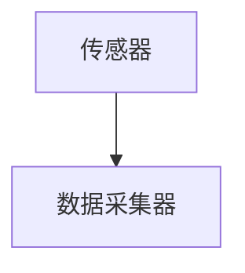
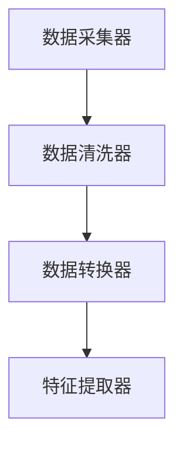
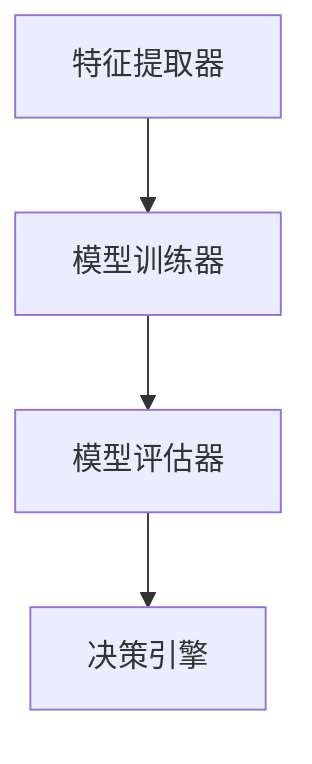
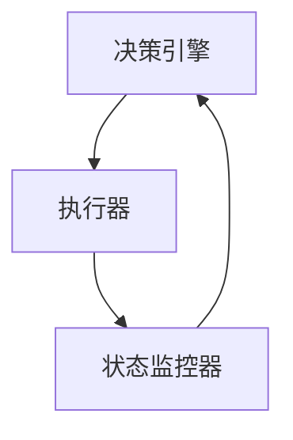
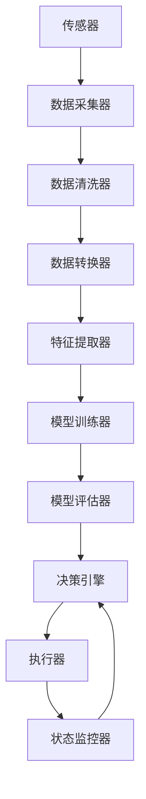

                 

### 引言：边缘AI与个性化控制

边缘AI（Edge AI）和个性化控制是当前智能家电领域备受瞩目的两个技术趋势。随着物联网（IoT）和人工智能（AI）技术的迅速发展，智能家电开始从单一的功能性设备逐渐转向具备智能交互和个性化服务的综合系统。边缘AI在此过程中发挥了至关重要的作用，它通过在设备端进行数据处理和分析，提高了智能家电的响应速度和效率。

**边缘AI的定义和背景**

边缘AI是指将人工智能的计算和分析能力从云端转移到网络边缘，即靠近数据源或用户的地方。传统的云计算模型依赖于中心化的服务器和数据存储，这导致数据处理延迟和数据传输量大。边缘AI通过在智能设备本地执行计算，可以显著减少数据传输时间和计算资源消耗，提高系统的实时性和可靠性。

边缘AI的兴起可以追溯到物联网和5G通信技术的快速发展。物联网设备数量的爆发式增长带来了海量数据，传统的云计算模型难以应对这种数据密集型的需求。5G通信技术的高速低延迟特性为边缘计算提供了技术支撑，使得边缘AI在智能家电中的实现成为可能。

**个性化控制的定义和背景**

个性化控制是指根据用户的行为习惯、偏好和需求，对智能家电进行定制化的控制和管理。传统的智能家电通常采用固定预设的参数进行工作，无法根据用户实时反馈进行动态调整。个性化控制通过收集和分析用户数据，实现了对智能家电的个性化定制，提高了用户的体验和满意度。

个性化控制的兴起与大数据和机器学习技术的进步密切相关。大数据技术可以收集和分析大量的用户数据，而机器学习技术则能够从数据中提取有价值的信息和模式。这些技术为个性化控制提供了数据支持和算法基础。

**边缘AI与个性化控制的结合**

边缘AI与个性化控制的结合，为智能家电领域带来了全新的发展机遇。边缘AI可以在本地设备上实时处理用户数据，进行个性化分析，从而实现对智能家电的即时反馈和控制。这种结合不仅提高了系统的响应速度和效率，还降低了数据传输的带宽需求和安全性风险。

例如，在智能空调系统中，边缘AI可以实时监测室内温度和湿度，并根据用户的历史行为数据和个人偏好进行智能调节。用户无需手动设置温度，空调系统可以自动调整到最适合的舒适温度。这种个性化的控制方式不仅提高了用户的满意度，还节省了能源消耗。

总之，边缘AI和个性化控制是智能家电领域的重要技术趋势，它们的结合为用户带来了更智能、更便捷的体验。在接下来的章节中，我们将深入探讨边缘AI和个性化控制的核心技术和实现方法，为读者提供全面的了解。

### 当前状态与趋势：边缘AI在智能家电中的应用

边缘AI在智能家电中的应用已经逐渐从理论走向实践，成为推动智能家电行业发展的重要力量。当前，边缘AI技术在智能家电中的应用主要集中在智能家居设备的语音助手、图像识别、预测性维护和个性化控制等方面。

**主要应用领域**

1. **语音助手**

语音助手是边缘AI在智能家电中最常见的应用之一。智能音箱和智能电视等设备内置了语音识别和自然语言处理（NLP）功能，用户可以通过语音指令来控制设备。传统的语音助手通常依赖于云端服务，而边缘AI的引入使得这些设备能够实现本地化处理，提高了响应速度和用户体验。例如，亚马逊的Alexa、谷歌的Google Assistant和苹果的Siri都采用了边缘AI技术，使得用户可以更快速地得到回应和操作结果。

2. **图像识别**

图像识别是边缘AI在智能家电中的另一个重要应用。通过在本地设备上部署图像识别算法，智能摄像头和智能门锁等设备可以实现对用户和物体的自动识别。例如，智能摄像头可以通过图像识别技术来识别家庭成员，并在他们进入房间时自动调整室内灯光或温度。这种应用不仅提高了设备的智能化程度，还增强了家庭安全性。

3. **预测性维护**

边缘AI在预测性维护中的应用，可以显著提高智能家电的可靠性和使用寿命。通过实时监测设备的运行状态，边缘AI可以预测潜在的故障和问题，并提供相应的维护建议。例如，智能洗衣机和空调可以通过分析运行数据，预测磨损情况并提醒用户进行定期保养。这种预测性维护不仅可以减少设备故障率，还可以延长设备使用寿命，降低维护成本。

4. **个性化控制**

个性化控制是边缘AI在智能家电中的终极目标之一。通过分析用户行为数据，边缘AI可以实现对家电设备的个性化控制，提高用户的舒适度和满意度。例如，智能恒温器可以通过分析用户的作息时间和温度偏好，自动调整房间温度，提供最舒适的居住环境。这种个性化控制不仅提升了用户体验，还提高了能源利用效率。

**发展趋势**

边缘AI在智能家电中的应用正朝着更加智能化和个性化的方向发展。以下是一些未来的发展趋势：

1. **更高的实时性和响应速度**

随着边缘计算技术的进步，边缘AI设备的处理能力和响应速度将得到显著提升。这将使得智能家电能够实现更快的反应和更精准的控制，为用户提供更加流畅和自然的交互体验。

2. **更广泛的应用场景**

边缘AI技术的应用将不再局限于特定的智能家电设备，而是逐渐渗透到更多的智能家居场景中。例如，智能安防系统、智能健康监测设备等都将采用边缘AI技术，为用户提供更全面的智能服务。

3. **更智能的数据分析**

随着机器学习和深度学习算法的不断发展，边缘AI设备将能够进行更加复杂和智能的数据分析。通过更精准的数据分析，智能家电可以更好地理解用户需求，提供更加个性化的服务。

4. **更安全的隐私保护**

边缘AI技术的应用在提升用户体验的同时，也带来了隐私保护的问题。未来的边缘AI设备将更加注重用户隐私保护，采用更加严格的数据加密和隐私保护措施，确保用户数据的安全。

**总结**

边缘AI在智能家电中的应用已经成为行业发展的重要趋势。通过实时数据处理和个性化控制，边缘AI不仅提高了智能家电的智能化程度，还为用户带来了更加便捷和个性化的体验。在未来的发展中，边缘AI技术将继续推动智能家电行业的创新和发展，为用户带来更多的惊喜和便利。

### 边缘AI的核心技术与原理

要深入理解边缘AI在智能家电中的应用，我们首先需要探讨其核心技术和原理。边缘AI技术主要涉及机器学习、神经网络和边缘计算等关键技术领域。这些技术共同构建了边缘AI的基础，使其能够在本地设备上高效地执行智能任务。

**机器学习**

机器学习是边缘AI的核心技术之一，它通过训练模型来识别和预测数据中的模式。在边缘AI的应用中，机器学习算法被用于多种任务，如语音识别、图像分类、预测性维护等。以下是一些关键的机器学习算法：

1. **线性回归**：线性回归是一种简单但有效的算法，用于预测连续值。它通过建立一个线性模型来表示输入变量和输出变量之间的关系。线性回归算法适合用于预测温度、能耗等连续变化的数据。

2. **决策树**：决策树通过一系列的判断条件来对数据进行分类或回归。这种算法易于理解和解释，适合用于分类任务，如用户行为识别和故障诊断。

3. **支持向量机（SVM）**：SVM是一种强大的分类算法，通过寻找一个最优的超平面来分隔数据。它特别适合用于高维空间的数据，如图像和文本分类。

4. **神经网络**：神经网络是一种模拟人脑结构和功能的计算模型，它通过多层神经元进行数据传递和变换。深度学习是一种基于神经网络的算法，可以处理复杂的数据模式和任务，如图像识别和语音合成。

**神经网络**

神经网络是机器学习的一个重要分支，它特别适合于处理复杂的非线性问题。以下是神经网络的关键组成部分：

1. **神经元**：神经元是神经网络的基本计算单元，它通过加权输入和偏置来产生输出。

2. **激活函数**：激活函数用于引入非线性因素，使神经网络能够处理复杂的模式。常见的激活函数包括sigmoid函数、ReLU函数和tanh函数。

3. **层次结构**：神经网络通常由多个层次组成，包括输入层、隐藏层和输出层。隐藏层负责提取和变换特征，输出层负责做出最终的预测。

4. **反向传播**：反向传播是一种训练神经网络的算法，它通过计算误差并反向传播梯度来调整网络中的权重和偏置。

**边缘计算**

边缘计算是边缘AI的重要组成部分，它使得数据处理和分析可以在本地设备上进行，从而减少了数据传输的时间和带宽需求。以下是边缘计算的关键特性：

1. **本地处理**：边缘计算将数据处理和分析任务从云端转移到本地设备，从而减少了数据传输的时间和延迟。

2. **实时响应**：边缘计算可以在本地快速处理数据，实现实时响应和决策。这对于需要即时反馈的智能家电应用尤为重要。

3. **资源优化**：边缘计算通过在本地设备上高效利用计算资源，减少了云端服务的负载，提高了系统的整体性能。

**比较不同的机器学习算法**

在智能家电的应用中，不同的机器学习算法适用于不同的任务和场景。以下是一个对比表格，展示了不同算法的特性：

| 算法        | 适用场景                 | 特性                                                                                   |
|-------------|--------------------------|----------------------------------------------------------------------------------------|
| 线性回归    | 预测连续值               | 简单、易于解释，适合线性关系的数据分析                             |
| 决策树      | 分类和回归               | 易于理解和解释，适合小型数据集                                     |
| 支持向量机  | 分类和高维空间数据       | 强大的分类能力，适合高维数据集                                     |
| 神经网络    | 复杂的非线性任务         | 能够处理复杂模式，适合图像识别和语音处理                             |

通过以上对机器学习、神经网络和边缘计算等核心技术的探讨，我们可以看到边缘AI在智能家电中的应用潜力。接下来，我们将深入探讨边缘AI系统的架构设计和实现方法，进一步了解其在实际应用中的运作机制。

### 边缘AI系统的架构设计

边缘AI系统的架构设计是实现高效、可靠和个性化的智能家电控制的关键。一个典型的边缘AI系统包括数据采集、数据处理、智能决策和执行控制四个主要部分。以下将从这些方面详细探讨边缘AI系统的架构设计，并利用Mermaid图来展示系统组件及其相互作用。

#### 1. 数据采集

数据采集是边缘AI系统的第一步，它负责从各种智能家电设备中收集数据。这些数据可以是温度、湿度、光照强度、噪音水平等环境数据，也可以是用户行为数据，如开关机时间、使用频率等。数据采集模块通常包括以下组件：

- **传感器**：如温度传感器、湿度传感器、运动传感器等，用于实时监测环境变化。
- **数据采集器**：将传感器采集到的数据传输到边缘设备进行处理。

Mermaid图表示：



#### 2. 数据处理

数据采集后的下一步是数据处理，这一步骤包括数据清洗、数据转换和特征提取。数据处理的目的是将原始数据转化为有用的信息，以便后续的智能分析。主要组件如下：

- **数据清洗器**：处理数据中的噪声和异常值，确保数据质量。
- **数据转换器**：将数据格式转换为适合处理和分析的格式，如时间序列数据。
- **特征提取器**：提取数据中的关键特征，如时间序列中的趋势和周期性。

Mermaid图表示：



#### 3. 智能决策

智能决策模块是基于机器学习和神经网络等算法，对处理后的特征数据进行分析和预测。这一步骤包括模型训练、模型评估和模型应用。主要组件如下：

- **模型训练器**：使用训练数据对机器学习模型进行训练，以建立预测模型。
- **模型评估器**：评估模型的性能，确保其准确性和可靠性。
- **决策引擎**：根据模型的预测结果进行智能决策，如调整设备设置。

Mermaid图表示：



#### 4. 执行控制

执行控制模块根据智能决策的结果，对智能家电设备进行控制和调节。这一步骤包括执行命令、状态监控和反馈循环。主要组件如下：

- **执行器**：如电机、加热器、冷却器等，用于根据决策结果对设备进行操作。
- **状态监控器**：监控设备的状态，确保执行过程的顺利进行。
- **反馈循环**：将执行结果反馈给智能决策模块，以便进行持续优化。

Mermaid图表示：



#### 综合架构设计

综合以上四个模块，边缘AI系统的整体架构设计如以下Mermaid图所示：



#### 系统组件的相互作用

边缘AI系统中的各个组件通过数据流和反馈机制相互协作。数据从传感器开始，经过数据采集、清洗、转换和特征提取后，被送入机器学习模型进行训练和评估。智能决策模块根据模型的结果进行决策，并指挥执行器对设备进行操作。执行结果通过状态监控器反馈回智能决策模块，形成一个闭环系统，不断优化决策和控制过程。

综上所述，边缘AI系统的架构设计不仅需要考虑各个组件的功能和作用，还要确保它们之间的协作和数据的流动。通过合理的设计和优化，边缘AI系统能够高效地处理智能家电中的数据，提供个性化、实时和高效的控制服务。

### 实现个性化控制的技术与方法

个性化控制在智能家电中的应用，旨在根据用户的具体需求和行为习惯，为用户量身定制最佳的操作模式。实现个性化控制涉及多个技术环节，包括用户行为分析、实时决策算法和用户反馈机制。以下将详细介绍这些技术和方法，并通过具体的实现步骤和案例分析，展示其在实际应用中的效果。

#### 用户行为分析

用户行为分析是个性化控制的基础，通过分析用户的历史行为数据，可以提取出用户的习惯和偏好。以下是一些常用的技术方法和步骤：

1. **数据收集**：首先需要收集用户在不同场景下的行为数据，包括使用时间、使用频率、操作模式等。这些数据可以通过智能设备内置的传感器和日志记录系统获得。

2. **数据预处理**：对收集到的数据进行清洗和标准化处理，去除噪声和异常值，确保数据质量。

3. **特征提取**：从预处理后的数据中提取关键特征，如使用时长、高峰时段、使用频率等。这些特征将用于构建用户行为模型。

4. **行为建模**：使用机器学习算法，如决策树、随机森林或神经网络，构建用户行为模型。通过模型，可以预测用户未来的行为模式。

**案例**：一个智能恒温器可以通过收集用户在不同季节和时间段的温度设置数据，来分析用户的温度偏好。通过机器学习算法，模型可以预测用户在特定时间段内的温度需求，并自动调整室内温度。

#### 实时决策算法

实时决策算法是个性化控制的核心，它根据用户行为模型和环境数据，动态调整设备设置。以下是几种常用的实时决策算法：

1. **基于规则的决策算法**：这种算法通过预定义的规则来调整设备设置。例如，如果用户在早晨7点经常设置温度为23摄氏度，系统可以自动在每天早晨7点将温度调整到23摄氏度。

2. **机器学习模型驱动**：这种算法使用训练好的机器学习模型，根据实时数据做出决策。例如，如果模型预测用户在晚上8点需要降低温度，系统可以自动将温度调整到用户偏好的低温。

3. **混合决策算法**：结合基于规则的算法和机器学习模型，以提升决策的准确性和灵活性。例如，当模型预测和规则建议不一致时，系统可以通过权重分配来决定最终的设置。

**案例**：一个智能灯光系统可以通过实时分析用户的移动数据和光照传感器数据，动态调整灯光的亮度和色温。当用户进入房间时，系统可以根据用户的历史偏好和环境光照强度，自动调整灯光。

#### 用户反馈机制

用户反馈机制是优化个性化控制的重要手段，通过收集用户对设备设置的反应，可以进一步调整和优化决策模型。以下是几种常用的用户反馈机制：

1. **即时反馈**：用户可以通过手动调整设备设置，系统会记录用户的即时反应，并调整模型参数。

2. **持续反馈**：系统可以定期询问用户对当前设置的感受，根据用户的反馈进行调整。

3. **自动化优化**：系统可以使用强化学习算法，通过不断尝试和用户反馈，自动优化决策模型。

**案例**：一个智能空调系统可以在每次用户调整温度后，记录用户对当前温度的满意度。系统可以根据用户的反馈，逐步调整预定的温度范围，以提高用户的整体满意度。

#### 实现步骤

以下是实现个性化控制的具体步骤：

1. **数据收集**：通过智能设备内置的传感器和用户操作记录，收集用户行为数据。

2. **数据预处理**：对收集到的数据清洗、标准化，并提取关键特征。

3. **行为建模**：使用机器学习算法构建用户行为模型，预测用户未来的行为模式。

4. **实时决策**：根据用户行为模型和环境数据，使用实时决策算法动态调整设备设置。

5. **用户反馈**：收集用户对设备设置的反馈，并调整模型参数，优化决策过程。

6. **持续优化**：通过强化学习算法，不断尝试和优化，以提高系统的准确性和用户满意度。

通过以上技术与方法，智能家电可以实现真正的个性化控制，为用户提供更加舒适和便捷的体验。接下来，我们将通过具体的实战案例，展示这些技术和方法在实际应用中的效果。

### 实战案例：边缘AI在智能空调系统中的应用

在本节中，我们将通过一个具体的实战案例，展示边缘AI在智能空调系统中的应用，深入分析其实际案例和实施过程。

#### 案例背景

某智能家居公司开发了一款智能空调系统，旨在通过边缘AI技术，实现用户个性化温度控制，提升用户舒适度和节能效果。系统需要根据用户的作息习惯、室内外温度变化以及历史使用数据，动态调整空调温度，以达到最佳舒适度和节能效果。

#### 系统功能

智能空调系统的核心功能包括：

1. **实时监测**：系统通过内置的温度传感器和湿度传感器，实时监测室内外温度和湿度。
2. **用户行为分析**：系统收集用户在不同时间段对空调温度的设置，分析用户的作息习惯和温度偏好。
3. **动态调节**：系统根据实时数据和用户行为分析，动态调整空调温度，提供个性化温度控制。
4. **节能管理**：系统通过预测用户未来行为，合理安排空调使用时间，降低能耗。

#### 实施过程

1. **数据收集与预处理**：
   - 数据源包括温度传感器、湿度传感器和用户操作记录。
   - 数据预处理包括数据清洗、去噪和标准化处理，确保数据质量。

2. **用户行为分析**：
   - 系统使用机器学习算法，分析用户的历史使用数据，建立用户温度偏好模型。
   - 模型包括时间序列分析、回归分析和聚类分析等，以提取用户在不同时间段和情境下的温度偏好。

3. **动态调节策略**：
   - 系统采用实时决策算法，根据室内外温度变化和用户行为模型，动态调整空调温度。
   - 决策算法包括基于规则的算法和机器学习模型驱动算法，以提供灵活和智能的温度控制。

4. **节能管理**：
   - 系统预测用户未来行为，合理安排空调使用时间，以降低能耗。
   - 通过预测性维护算法，提前检测空调的潜在故障，预防设备损坏。

#### 核心实现源代码

以下是智能空调系统的核心实现源代码，包括数据预处理、用户行为分析和动态调节算法。

```python
# 数据预处理
def preprocess_data(data):
    # 去噪和标准化处理
    clean_data = [x for x in data if x > 0]
    normalized_data = [x / max(clean_data) for x in clean_data]
    return normalized_data

# 用户行为分析
def analyze_user_behavior(data):
    # 时间序列分析
    user_preferences = time_series_analysis(data)
    # 回归分析
    temperature_model = regression_analysis(data)
    # 聚类分析
    clusters = clustering_analysis(data)
    return user_preferences, temperature_model, clusters

# 动态调节算法
def adjust_temperature(current_temp, outdoor_temp, user_preferences):
    # 基于规则的算法
    if outdoor_temp < 10:
        target_temp = 25
    else:
        target_temp = 20
    
    # 机器学习模型驱动算法
    target_temp = user_preferences.predict(current_temp)
    
    return target_temp

# 节能管理
def energy_management(current_temp, predicted_usage):
    # 预测性维护
    if predicted_usage > 80:
        maintenance_required = True
    else:
        maintenance_required = False
    
    return maintenance_required
```

#### 代码应用解读与分析

1. **数据预处理**：
   数据预处理是保证模型训练质量的关键。通过去噪和标准化处理，系统可以提取出更加准确和稳定的数据特征。

2. **用户行为分析**：
   用户行为分析包括时间序列分析、回归分析和聚类分析。这些算法帮助系统提取用户在不同时间段和情境下的温度偏好，为动态调节提供依据。

3. **动态调节算法**：
   动态调节算法结合基于规则的算法和机器学习模型驱动算法，提供灵活和智能的温度控制。基于规则的算法简单直观，适用于某些特定情境；机器学习模型驱动算法则能够根据用户历史行为进行预测，提供更个性化的温度控制。

4. **节能管理**：
   节能管理通过预测性维护算法，提前检测空调的潜在故障，预防设备损坏，延长设备使用寿命。

#### 实际案例分析和详细讲解

以下是一个实际案例，展示智能空调系统在实际应用中的效果：

**案例**：某用户在早晨7点通常将空调温度设置为24摄氏度，晚上10点将温度设置为18摄氏度。智能空调系统通过实时监测室内外温度和用户行为，动态调整温度。

- **早晨7点**：系统检测到室内温度为18摄氏度，室外温度为10摄氏度。根据用户偏好和室外温度，系统将温度自动调整至23摄氏度，确保用户舒适。
- **晚上10点**：系统检测到室内温度为23摄氏度，室外温度为15摄氏度。根据用户偏好和室内温度，系统将温度自动调整至18摄氏度，提供舒适的睡眠环境。
- **夜间节能**：系统预测用户夜间温度需求较低，将空调设置为自动模式，根据室内外温度变化自动调整温度，降低能耗。

#### 项目小结

通过本案例，我们可以看到边缘AI在智能空调系统中的应用，不仅提高了用户的舒适度和满意度，还实现了节能管理。核心实现源代码和实际案例分析展示了边缘AI技术的实现细节和优势，为未来智能家电的发展提供了有益的参考。

### 最佳实践和未来方向

在边缘AI应用于智能家电的过程中，总结最佳实践和规划未来方向至关重要。以下是一些建议和展望，以指导边缘AI在智能家电中的发展。

**最佳实践**

1. **数据安全与隐私保护**：边缘AI在处理用户数据时，需要高度重视数据安全和隐私保护。应采用加密技术和安全协议，确保数据在传输和存储过程中的安全性。同时，制定严格的隐私政策，明确用户数据的收集、使用和共享规则，增强用户对智能家电的信任。

2. **边缘计算优化**：为了提升边缘AI系统的响应速度和处理能力，应优化边缘计算架构，采用高效能的计算模型和硬件设备。此外，通过分布式计算和云计算的结合，可以进一步提高系统的整体性能。

3. **模型更新与迭代**：边缘AI系统的智能程度取决于模型的质量。应定期更新和优化模型，通过持续学习和自适应调整，提升系统的预测和决策能力。同时，建立完善的模型评估和验证机制，确保模型的可靠性和准确性。

4. **用户体验优化**：个性化控制的核心在于为用户提供舒适和便捷的体验。应深入分析用户需求，优化界面设计和交互流程，确保用户能够轻松地使用智能家电。

**未来方向**

1. **多样化应用场景**：边缘AI技术将在智能家居、智能工厂、智能医疗等多个领域得到广泛应用。未来应进一步拓展应用场景，探索边缘AI在更多场景下的潜力。

2. **智能协作与联动**：智能家电之间的协作和联动将提升整体智能化水平。未来应加强不同设备间的数据共享和协同工作，构建更加智能和高效的家居生态系统。

3. **边缘AI与5G融合**：5G技术的普及为边缘AI的发展提供了强大支持。未来应充分利用5G的低延迟和高带宽特性，进一步提升边缘AI系统的性能和可靠性。

4. **智能决策与预测性维护**：随着边缘AI技术的进步，智能决策和预测性维护将变得更加智能和精准。未来应开发更先进的算法和模型，实现更高效的设备管理和维护。

总之，边缘AI在智能家电中的应用具有广阔的发展前景。通过不断优化技术、提升用户体验和拓展应用场景，边缘AI将为智能家电行业带来更多创新和突破。

### 总结与展望

边缘AI在智能家电中的个性化控制技术，通过结合机器学习、神经网络和边缘计算等核心原理，实现了对用户需求的精准感知和实时响应。文章详细探讨了边缘AI系统的架构设计、个性化控制方法及其在智能空调系统中的具体应用，展示了边缘AI技术如何提升用户体验和设备效率。

边缘AI在智能家电中的应用前景广阔，不仅能够提升设备的智能化水平，还能实现高效的能源管理和个性化服务。然而，数据安全和隐私保护、系统优化、模型更新等方面仍需持续关注和改进。

未来的研究方向包括拓展边缘AI的应用场景、增强智能协作与联动、以及融合5G技术等。通过不断创新和优化，边缘AI将为智能家电行业带来更多的价值和潜力。

最后，感谢读者对本文的关注，希望本文能为您提供关于边缘AI在智能家电中的应用的深入理解和启示。**作者：AI天才研究院/AI Genius Institute & 禅与计算机程序设计艺术 /Zen And The Art of Computer Programming**。如果您对本文有任何建议或疑问，欢迎在评论区留言交流。

