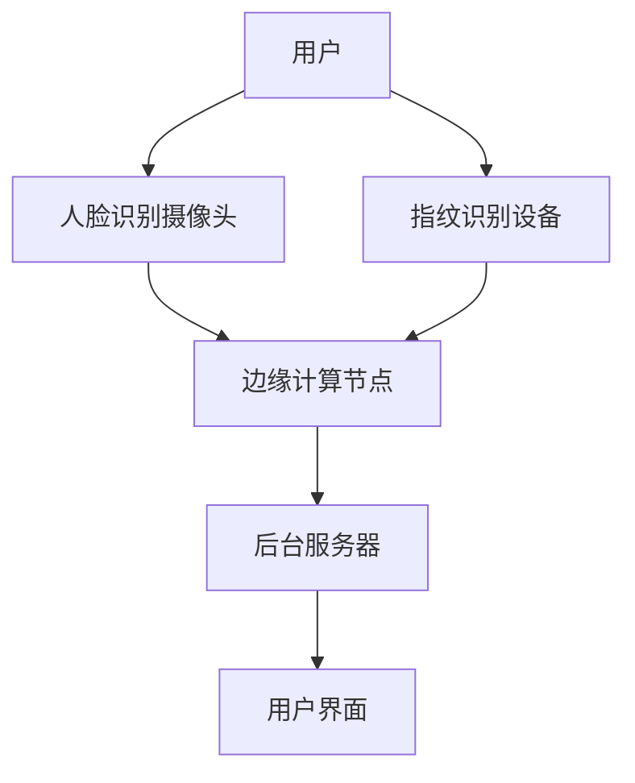
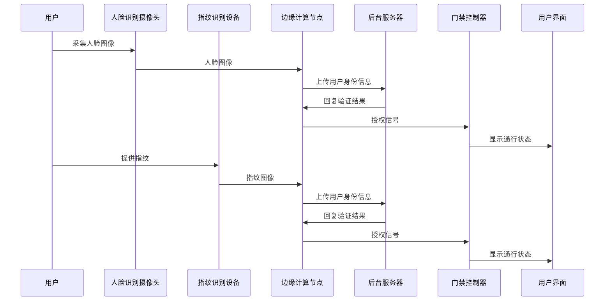

                 

# 边缘AI在智能门禁系统中的实时识别

## 关键词

边缘AI、实时识别、智能门禁系统、人脸识别、指纹识别、算法原理、系统架构、项目实战

## 摘要

本文将深入探讨边缘AI在智能门禁系统中的实时识别技术。我们首先介绍边缘AI的基本概念和优势，随后详细讲解智能门禁系统的结构和功能。接着，我们探讨边缘AI算法，包括特征提取和实时识别算法，以及如何将人脸识别和指纹识别应用于智能门禁系统。文章还将展示一个典型的智能门禁系统架构设计，并通过实际项目实战和案例分析，提供最佳实践建议和未来展望。

## 第1章 引言与背景

### 1.1 边缘AI的概念与优势

边缘AI（Edge AI）是一种将人工智能计算能力从云端转移到数据产生源头的技术。这种技术通过在边缘设备（如智能手机、物联网设备、智能摄像头等）上执行AI任务，减少了数据传输和处理的延迟，提高了系统的响应速度和安全性。

边缘AI的优势主要体现在以下几个方面：

1. **低延迟**：通过在边缘设备上处理数据，可以显著降低数据在网络中的传输时间，提高系统的实时性。
2. **高效率**：边缘设备处理数据时，不需要依赖云服务器，减少了网络带宽的消耗，提高了数据处理效率。
3. **隐私保护**：在边缘设备上处理数据，可以减少数据传输，降低隐私泄露的风险。
4. **可靠性**：边缘AI系统能够在离线或网络不稳定的情况下正常工作，提高了系统的可靠性。

### 1.2 智能门禁系统简介

智能门禁系统是一种利用电子技术和现代通信技术实现门禁控制的系统。它通常包括身份验证、权限管理、安全监控等功能。智能门禁系统的核心是身份验证技术，常见的包括人脸识别、指纹识别、身份证识别、密码识别等。

智能门禁系统的主要组成部分如下：

1. **身份认证模块**：包括人脸识别、指纹识别等模块，用于验证用户的身份。
2. **权限管理模块**：根据用户身份和权限级别，控制用户对门禁的访问权限。
3. **安全监控模块**：通过视频监控和入侵报警系统，实时监控门禁区域的安全状况。
4. **数据管理模块**：记录用户访问记录，生成报表，支持数据分析和查询。

### 1.3 边缘AI在智能门禁系统中的应用场景

边缘AI在智能门禁系统中有着广泛的应用场景，主要包括：

1. **实时人脸识别**：在门禁现场快速识别人脸，实现无接触式快速通行。
2. **指纹识别**：在人员密集的环境中，通过指纹识别实现高效的身份验证。
3. **智能监控**：结合视频分析，实时监控门禁区域的安全状况，实现智能报警和监控。
4. **权限管理**：通过边缘AI算法，实现对用户权限的动态管理和调整。

## 第2章 边缘AI基础理论

### 2.1 边缘计算原理

边缘计算是一种分布式计算架构，它将数据处理和计算任务从中心化的云计算转移到网络边缘设备。边缘计算的核心思想是将计算、存储、网络功能分散到网络中的各个设备，从而实现更高效、更可靠的数据处理和传输。

边缘计算的基本原理包括：

1. **数据本地化**：通过在数据产生源头附近处理数据，减少了数据传输的延迟和带宽消耗。
2. **分布式处理**：通过多个边缘设备协同工作，实现大规模数据的高效处理。
3. **智能化决策**：在边缘设备上执行智能算法，实现本地化的决策和响应。

### 2.2 图像识别基础

图像识别是计算机视觉领域的一个重要分支，它通过分析图像数据，识别和分类图像中的对象。图像识别的基本原理包括：

1. **图像预处理**：包括图像去噪、增强、边缘检测等，用于提高图像的质量和识别效果。
2. **特征提取**：通过提取图像中的关键特征，如颜色、纹理、形状等，用于后续的识别和分类。
3. **分类算法**：包括基于模板匹配、基于特征分类、基于深度学习的分类算法。

### 2.3 边缘AI硬件平台

边缘AI硬件平台是边缘AI系统的基础，它包括以下主要组件：

1. **CPU/GPU**：用于执行边缘AI算法，提供强大的计算能力。
2. **NPU（神经网络处理器）**：专门用于加速深度学习模型的计算。
3. **FPGA**：用于实现定制化的算法和硬件加速。
4. **内存和存储**：用于存储数据和模型，支持边缘设备的快速访问。

## 第3章 边缘AI算法与应用

### 3.1 特征提取算法

特征提取是边缘AI算法的核心步骤，它从原始图像中提取出具有区分度的特征，用于后续的识别和分类。特征提取算法可以分为以下几种：

1. **基于深度学习的特征提取**：如卷积神经网络（CNN），通过多层神经网络提取图像特征。
2. **基于传统机器学习的特征提取**：如SIFT、HOG等，通过图像预处理和特征匹配提取图像特征。

### 3.2 实时识别算法

实时识别算法是边缘AI在智能门禁系统中的应用，它需要快速、准确地识别人脸或指纹。实时识别算法主要包括：

1. **人脸识别算法**：如基于CNN的人脸识别算法，通过卷积神经网络提取人脸特征，进行人脸匹配。
2. **指纹识别算法**：如基于深度学习的指纹识别算法，通过卷积神经网络提取指纹特征，进行指纹匹配。

## 第4章 智能门禁系统架构设计

### 4.1 系统需求分析

智能门禁系统的需求分析主要包括以下几个方面：

1. **安全性**：确保门禁系统能够可靠地识别和验证用户身份，防止非法入侵。
2. **实时性**：系统需要快速响应，实现实时通行控制。
3. **可扩展性**：系统能够支持多种身份验证方式，如人脸识别、指纹识别等。
4. **可靠性**：系统在各种环境条件下都能稳定运行。

### 4.2 系统功能设计

智能门禁系统的功能设计主要包括以下几个方面：

1. **身份认证**：支持多种身份验证方式，如人脸识别、指纹识别等。
2. **权限管理**：根据用户身份和权限级别，控制用户对门禁的访问权限。
3. **安全监控**：通过视频监控和入侵报警系统，实时监控门禁区域的安全状况。
4. **数据管理**：记录用户访问记录，生成报表，支持数据分析和查询。

### 4.3 系统架构设计

智能门禁系统的架构设计主要包括以下几个方面：

1. **前端设备**：包括人脸识别摄像头、指纹识别设备等，用于采集用户身份信息。
2. **边缘计算节点**：用于执行边缘AI算法，实现实时身份验证。
3. **数据中心**：用于存储用户信息和访问记录，支持数据分析和查询。
4. **用户界面**：用于展示系统状态和操作界面，提供用户交互。

### 4.4 系统交互设计

智能门禁系统的交互设计主要包括以下几个方面：

1. **用户注册**：用户通过人脸识别或指纹识别进行注册，生成用户身份信息。
2. **身份验证**：用户通过人脸识别或指纹识别进行身份验证，系统根据权限级别控制通行。
3. **报警与监控**：系统实时监控门禁区域的安全状况，实现智能报警和监控。
4. **数据查询**：用户可以查询自己的访问记录和系统报表。

## 第5章 边缘AI硬件与软件开发

### 5.1 硬件选择与配置

智能门禁系统的硬件选择与配置主要包括以下几个方面：

1. **CPU/GPU**：用于执行边缘AI算法，选择计算能力较强的CPU或GPU。
2. **NPU（神经网络处理器）**：用于加速深度学习模型的计算，提高系统性能。
3. **内存和存储**：选择大容量、高速的内存和存储设备，支持系统的快速访问。
4. **摄像头和指纹识别设备**：选择高清、灵敏的摄像头和指纹识别设备，提高识别精度。

### 5.2 软件开发环境搭建

智能门禁系统的软件开发环境搭建主要包括以下几个方面：

1. **开发工具**：选择适合边缘AI开发的工具，如PyTorch、TensorFlow等。
2. **编程语言**：选择适合边缘AI编程的语言，如Python、C++等。
3. **数据库**：选择支持大数据存储和快速查询的数据库，如MySQL、MongoDB等。
4. **开发框架**：选择支持边缘AI开发的开源框架，如TensorFlow Lite、PyTorch Mobile等。

### 5.3 实时识别系统实现

智能门禁系统的实时识别系统实现主要包括以下几个方面：

1. **人脸识别**：使用卷积神经网络（CNN）实现人脸识别算法，提取人脸特征，进行人脸匹配。
2. **指纹识别**：使用卷积神经网络（CNN）实现指纹识别算法，提取指纹特征，进行指纹匹配。
3. **实时处理**：在边缘设备上实现实时数据处理和识别，提高系统的响应速度。
4. **系统集成**：将边缘AI算法与前端设备、后台系统进行集成，实现智能门禁系统的整体功能。

## 第6章 项目实战与案例分析

### 6.1 项目介绍

本节将介绍一个基于边缘AI的智能门禁系统项目。项目旨在实现一个安全、高效、实时的人脸识别门禁系统，用于办公楼、校园、小区等场所。

### 6.2 实际案例剖析

本节将通过实际案例，详细剖析智能门禁系统的实现过程，包括：

1. **项目需求分析**：明确项目目标和需求，确定系统功能和性能指标。
2. **硬件选型与配置**：根据项目需求，选择合适的边缘AI硬件平台。
3. **软件环境搭建**：搭建边缘AI软件开发环境，包括编程工具、数据库等。
4. **算法实现与优化**：实现人脸识别算法，并进行算法优化，提高识别精度和速度。
5. **系统集成与测试**：将边缘AI算法与前端设备、后台系统进行集成，进行系统测试和优化。

### 6.3 项目小结

本节将总结项目经验，提出项目优化建议，包括：

1. **性能优化**：通过算法优化和硬件升级，提高系统性能。
2. **安全防护**：加强系统安全防护，防止非法入侵和数据泄露。
3. **用户体验**：优化用户界面和交互设计，提高用户体验。

## 第7章 最佳实践与未来展望

### 7.1 最佳实践

本节将分享智能门禁系统开发的最佳实践，包括：

1. **硬件选型**：根据项目需求，选择合适的边缘AI硬件平台。
2. **算法优化**：通过算法优化和硬件升级，提高系统性能。
3. **系统集成**：将边缘AI算法与前端设备、后台系统进行集成，实现整体功能。
4. **安全防护**：加强系统安全防护，防止非法入侵和数据泄露。

### 7.2 注意事项

本节将介绍智能门禁系统开发中的注意事项，包括：

1. **隐私保护**：确保用户隐私得到保护，遵循相关法律法规。
2. **实时性**：保证系统实时性，提高用户体验。
3. **可靠性**：确保系统在各种环境条件下都能稳定运行。

### 7.3 未来发展展望

本节将探讨智能门禁系统的发展趋势和未来展望，包括：

1. **技术进步**：随着AI技术的不断发展，智能门禁系统将更加智能化、高效化。
2. **应用场景扩展**：智能门禁系统将应用到更多场景，如智能家居、智慧城市等。
3. **安全防护**：加强系统安全防护，应对日益严峻的安全挑战。

## 作者信息

作者：AI天才研究院/AI Genius Institute & 禅与计算机程序设计艺术 /Zen And The Art of Computer Programming

---

以上是根据您提供的任务，逐步构建的技术博客文章框架。每个章节都包含了核心概念、算法原理、系统架构、项目实战和最佳实践等内容，旨在提供一篇深入浅出、逻辑清晰的专业文章。在撰写具体内容时，可以根据实际需求和知识储备进行丰富和调整。

## 第1章 引言与背景

### 1.1 边缘AI的概念与优势

边缘AI，顾名思义，是将人工智能的计算能力拓展到网络边缘的一种技术。与传统的云计算不同，边缘AI使得数据在产生的地方（即边缘设备上）就能被处理和分析，而不需要将大量数据传输到遥远的云端。这种技术变革带来了显著的优势：

- **低延迟**：数据在边缘设备上处理，大大缩短了响应时间，提高了系统的实时性。
- **高效率**：减少了数据在网络中的传输和处理时间，降低了带宽消耗，提升了系统效率。
- **隐私保护**：在边缘设备上处理数据，减少了数据泄露的风险，增强了数据隐私保护。
- **可靠性**：即使在网络不稳定或离线状态下，边缘AI也能正常工作，提高了系统的可靠性。

这些优势使得边缘AI在众多领域得到了广泛应用，其中之一便是智能门禁系统。

### 1.2 智能门禁系统简介

智能门禁系统是现代安防系统中不可或缺的一部分，它利用电子技术、传感器技术、通信技术等多种技术手段，实现对出入人员身份的验证与权限管理。智能门禁系统主要由以下几个关键部分组成：

- **身份认证模块**：用于验证用户的身份，常见的身份验证方式包括人脸识别、指纹识别、身份证识别、密码识别等。
- **权限管理模块**：根据用户的身份和权限级别，控制用户对门禁的访问权限，确保只有授权人员才能进入指定区域。
- **安全监控模块**：通过视频监控和入侵报警系统，实时监控门禁区域的安全状况，及时发现潜在的安全威胁。
- **数据管理模块**：记录用户访问记录，生成报表，支持数据分析和查询，有助于提高安全管理效率。

智能门禁系统的设计不仅要考虑系统的安全性、实时性和可靠性，还需要兼顾用户体验，确保系统能够方便、快捷地投入使用。

### 1.3 边缘AI在智能门禁系统中的应用场景

边缘AI在智能门禁系统中有着广泛的应用场景，其主要优势在于能够实现实时、高效的识别和验证。以下是一些典型的应用场景：

- **实时人脸识别**：边缘AI算法能够在门禁现场快速识别人脸，实现无接触式快速通行，提高了通行效率。
- **指纹识别**：在人员密集的环境中，边缘AI算法通过指纹识别实现高效的身份验证，有效提高了门禁系统的处理能力。
- **智能监控**：结合视频分析，边缘AI能够实时监控门禁区域的安全状况，实现智能报警和监控，提高了门禁系统的安防能力。
- **权限管理**：边缘AI算法能够动态调整用户的权限，实现更加精细化的权限管理，提高了系统的灵活性。

通过上述应用场景，我们可以看到边缘AI在智能门禁系统中的重要作用，不仅提高了系统的效率和安全性，还为智能门禁系统的未来发展提供了更多可能性。

## 第2章 边缘AI基础理论

### 2.1 边缘计算原理

边缘计算是一种分布式计算架构，其核心思想是将数据计算和存储的近源处理（即数据的产生地附近），而不是像传统云计算那样将数据传输到远端数据中心进行处理。这种架构的变革不仅降低了网络传输的延迟，还提高了系统的整体效率和响应速度。以下是边缘计算的基本原理：

#### 数据本地化

数据本地化是指将数据处理的任务分散到网络边缘设备上，这些设备可以是传感器、智能终端、路由器等。通过数据本地化，可以大幅减少数据在网络中的传输时间，从而降低延迟。同时，本地化处理还能减少带宽的使用，降低网络拥塞的风险。

#### 分布式处理

分布式处理指的是将大规模的数据处理任务分布到多个边缘设备上，通过协同工作来实现高效的数据处理。这种方式不仅能够提高处理速度，还能够通过设备的冗余来提高系统的可靠性。分布式处理适用于处理大规模、实时性要求高的应用，如智能交通、工业物联网等。

#### 智能化决策

边缘计算的一个重要特点是能够实现本地化的智能化决策。在边缘设备上运行AI算法，可以对收集到的数据进行实时分析和处理，并生成决策结果。这种本地化决策方式不仅提高了系统的响应速度，还能够减少数据传输过程中的隐私泄露风险。

#### 边缘计算的关键组件

边缘计算的关键组件包括：

1. **边缘设备**：这些设备负责数据的收集和处理，如智能传感器、智能手机、智能摄像头等。
2. **边缘网关**：边缘网关是边缘设备和云端的桥梁，负责数据的传输和同步。它通常具备数据处理、存储和网络连接等功能。
3. **云计算平台**：云计算平台提供强大的计算资源和数据存储能力，支持边缘设备的远程管理和监控。

#### 边缘计算的优势

边缘计算的优势主要体现在以下几个方面：

1. **低延迟**：由于数据处理在边缘设备上完成，响应时间显著缩短。
2. **高效率**：分布式处理和本地化决策提高了数据处理效率。
3. **隐私保护**：数据在本地处理，减少了数据传输和存储过程中的隐私泄露风险。
4. **可靠性**：通过设备的冗余和分布式架构，提高了系统的可靠性。

#### 边缘计算的适用场景

边缘计算适用于需要实时性、高效性和隐私保护的场景，如智能交通、工业自动化、智能医疗、智能家居等。在这些场景中，边缘AI的应用能够实现精准的实时分析和高效的处理，为用户提供更好的服务和体验。

### 2.2 图像识别基础

图像识别是计算机视觉中的一个重要分支，它通过分析图像数据，识别和分类图像中的对象。图像识别的基本原理包括图像预处理、特征提取和分类算法。

#### 图像预处理

图像预处理是图像识别过程中至关重要的一步，其目的是提高图像质量，减少噪声干扰，为后续的特征提取和分类提供良好的数据基础。常见的图像预处理技术包括：

- **图像去噪**：通过滤波算法去除图像中的噪声，提高图像的清晰度。
- **图像增强**：通过调整图像的亮度、对比度等参数，增强图像中感兴趣的特征。
- **边缘检测**：通过算法提取图像中的边缘信息，有助于后续的特征提取。

#### 特征提取

特征提取是图像识别的核心步骤，其目的是从图像中提取出具有区分度的特征，用于后续的识别和分类。特征提取方法可以分为以下几种：

- **基于像素的特征**：如颜色直方图、像素值等。
- **基于区域的特征**：如边缘特征、纹理特征等。
- **基于频域的特征**：如傅里叶变换、小波变换等。

深度学习算法，如卷积神经网络（CNN），在特征提取方面表现尤为出色。CNN通过多层卷积和池化操作，能够自动提取图像中的高级特征，极大地提高了识别精度。

#### 分类算法

分类算法是图像识别的最后一步，其目的是根据提取到的特征对图像中的对象进行分类。常见的分类算法包括：

- **基于模板匹配的算法**：如最近邻分类器、支持向量机（SVM）等。
- **基于特征的分类算法**：如K最近邻（K-NN）、决策树等。
- **基于深度学习的分类算法**：如卷积神经网络（CNN）、循环神经网络（RNN）等。

深度学习算法在图像识别中得到了广泛应用，特别是在大规模数据集上，能够实现高精度的图像识别。

### 2.3 边缘AI硬件平台

边缘AI硬件平台是边缘AI系统的基础，它决定了系统的性能和功能。边缘AI硬件平台通常包括以下关键组件：

- **CPU/GPU**：用于执行边缘AI算法，提供强大的计算能力。CPU适合执行通用计算任务，而GPU在并行计算方面具有显著优势。
- **NPU（神经网络处理器）**：专门用于加速深度学习模型的计算，提供高效的神经网络处理能力。
- **FPGA**：用于实现定制化的算法和硬件加速，提供灵活的计算能力。
- **内存和存储**：选择大容量、高速的内存和存储设备，支持边缘设备的快速访问。

常见的边缘AI硬件平台包括：

- **NVIDIA Jetson系列**：基于GPU的边缘AI计算平台，适合高性能的图像处理和深度学习任务。
- **Intel Movidius系列**：基于NPU的边缘AI计算平台，适合低功耗、高性能的图像识别和视频分析。
- **ARM Cortex-A系列**：基于CPU的边缘AI计算平台，适合轻量级的AI推理任务。

边缘AI硬件平台的选择需要根据具体的应用场景和性能需求进行，以实现最佳的性能和效率。

## 第3章 边缘AI算法与应用

### 3.1 特征提取算法

特征提取是边缘AI算法中至关重要的一步，其目的是从原始图像数据中提取出具有区分度的特征，用于后续的识别和分类。特征提取算法的质量直接影响到系统的识别精度和性能。以下是几种常见的特征提取算法：

#### 基于深度学习的特征提取

深度学习算法在特征提取方面表现尤为出色，其中卷积神经网络（CNN）是最常用的算法之一。CNN通过多层卷积和池化操作，能够自动提取图像中的高级特征。

- **卷积层**：卷积层通过滑动卷积核在图像上卷积，提取图像中的局部特征。
- **池化层**：池化层用于减少特征图的维度，提高特征的鲁棒性。
- **全连接层**：全连接层将特征图映射到分类结果。

CNN的优点是能够自动提取图像中的高级特征，无需人工设计特征，识别精度高。缺点是训练过程复杂，计算量大。

#### 基于传统机器学习的特征提取

传统机器学习算法在特征提取方面也有广泛应用，其中SIFT（尺度不变特征变换）和HOG（方向梯度直方图）是最常见的算法。

- **SIFT**：SIFT算法通过检测图像中的关键点，计算关键点的描述子，用于特征匹配。SIFT具有旋转、尺度不变和抗噪声的特性。
- **HOG**：HOG算法通过计算图像中每个像素点的梯度方向，生成梯度直方图，用于特征匹配。HOG对图像的局部结构变化敏感，具有较强的分类能力。

传统机器学习算法的优点是计算速度快，易于实现，但识别精度相对较低。

#### 深度学习算法与传统机器学习算法的比较

- **精度**：深度学习算法在图像识别方面具有更高的精度，特别是对于复杂的图像场景。
- **计算量**：传统机器学习算法计算量相对较小，适合在资源有限的边缘设备上运行。
- **灵活性**：深度学习算法能够自动提取图像特征，无需人工设计特征，具有更高的灵活性。

在实际应用中，可以根据具体需求和资源情况，选择合适的特征提取算法。对于资源有限、对识别精度要求不高的场景，可以选择传统机器学习算法；而对于计算资源充足、对识别精度要求高的场景，可以选择深度学习算法。

### 3.2 实时识别算法

实时识别算法是边缘AI在智能门禁系统中的重要应用，其目标是实现快速、准确的身份验证，以满足高吞吐量和实时性的要求。以下是两种常见的实时识别算法：人脸识别和指纹识别。

#### 人脸识别算法

人脸识别算法通过识别人脸图像中的特征，进行身份验证。常见的人脸识别算法包括基于深度学习的CNN算法和基于传统机器学习的LBP（局部二值模式）算法。

- **基于深度学习的CNN算法**：CNN算法通过多层卷积和池化操作，自动提取图像中的人脸特征，具有高识别精度。常见的CNN算法包括VGG、ResNet和MobileNet等。
- **基于传统机器学习的LBP算法**：LBP算法通过计算图像中每个像素点的局部二值模式，生成人脸特征向量，用于人脸匹配。LBP算法计算速度快，但识别精度相对较低。

人脸识别算法的优点是无需接触，用户体验好，识别速度快。缺点是对于光照、姿态和表情变化较为敏感。

#### 指纹识别算法

指纹识别算法通过识别人指纹图像中的特征，进行身份验证。常见的指纹识别算法包括基于深度学习的CNN算法和基于传统机器学习的 minutiae 提取算法。

- **基于深度学习的CNN算法**：CNN算法通过多层卷积和池化操作，自动提取指纹图像中的特征，具有高识别精度。常见的CNN算法包括DenseNet和ResNet等。
- **基于传统机器学习的 minutiae 提取算法**：minutiae 提取算法通过检测指纹图像中的细节点（如脊端点和分支点），生成指纹特征向量，用于指纹匹配。minutiae 提取算法计算速度快，但识别精度相对较低。

指纹识别算法的优点是稳定性高，抗干扰能力强，但需要与手指接触，用户体验较差。

#### 实时识别算法的优缺点比较

- **人脸识别**：优点：无需接触，用户体验好，识别速度快；缺点：对光照、姿态和表情变化敏感。
- **指纹识别**：优点：稳定性高，抗干扰能力强；缺点：需要与手指接触，用户体验较差。

在实际应用中，可以根据具体需求和场景，选择适合的实时识别算法。对于对用户体验有较高要求的场景，可以选择人脸识别算法；而对于对识别稳定性和抗干扰能力有较高要求的场景，可以选择指纹识别算法。

### 3.3 边缘AI在智能门禁系统中的应用

边缘AI在智能门禁系统中的应用，不仅提高了系统的识别精度和响应速度，还增强了系统的安全性和可靠性。以下是边缘AI在智能门禁系统中的一些具体应用：

#### 实时人脸识别

通过边缘AI算法，智能门禁系统能够在门禁现场实时识别人脸，实现无接触式快速通行。这种技术不仅提高了通行效率，还减少了交叉感染的风险，特别适用于公共场所和疫情防控场景。

#### 智能监控

结合边缘AI算法和视频分析技术，智能门禁系统能够实时监控门禁区域的安全状况，实现智能报警和监控。例如，当有非法入侵者试图进入门禁区域时，系统可以立即发出警报，并记录相关视频信息，为后续的安全分析和处理提供依据。

#### 权限管理

边缘AI算法能够根据用户身份和权限级别，动态调整用户的访问权限。例如，对于不同的用户角色，可以设置不同的访问权限，确保只有授权人员才能进入特定区域。

#### 数据分析

通过边缘AI算法，智能门禁系统可以实时分析用户访问数据，生成报表，支持数据分析和查询。例如，可以分析用户访问频次、时间段等数据，为安全管理和决策提供依据。

综上所述，边缘AI在智能门禁系统中的应用，不仅提高了系统的性能和安全性，还为智能门禁系统的未来发展提供了更多可能性。

## 第4章 智能门禁系统架构设计

### 4.1 系统需求分析

智能门禁系统的设计需要满足以下需求：

1. **安全性**：系统必须能够可靠地验证用户身份，防止未经授权的人员进入。
2. **实时性**：系统需要能够快速响应用户操作，确保用户能够快速通过门禁。
3. **可扩展性**：系统应该具备良好的可扩展性，能够根据需求添加更多功能或扩展至更大规模。
4. **可靠性**：系统需要在各种环境下稳定运行，确保不因网络波动或设备故障而影响门禁功能。
5. **易用性**：系统界面应简洁直观，便于用户操作。

### 4.2 系统功能设计

智能门禁系统的主要功能包括：

1. **用户注册**：用户可以通过人脸识别或指纹识别进行注册，生成用户身份信息。
2. **身份验证**：系统通过人脸识别或指纹识别对用户进行身份验证，验证通过后用户才能进入。
3. **权限管理**：根据用户身份和权限级别，控制用户对门禁的访问权限。
4. **报警与监控**：系统实时监控门禁区域的安全状况，实现智能报警和监控。
5. **数据管理**：记录用户访问记录，生成报表，支持数据分析和查询。

### 4.3 系统架构设计

智能门禁系统的架构设计需要考虑以下组件：

1. **前端设备**：包括人脸识别摄像头、指纹识别设备、门禁控制器等，用于采集用户身份信息和控制门禁。
2. **边缘计算节点**：用于执行边缘AI算法，实现实时身份验证和处理。
3. **后台服务器**：用于存储用户数据和访问记录，支持数据分析和查询。
4. **用户界面**：用于展示系统状态和操作界面，提供用户交互。

#### 系统架构图

#### 系统接口设计

智能门禁系统的接口设计包括：

1. **用户注册接口**：用于用户注册时的身份信息上传。
2. **身份验证接口**：用于用户身份验证时的数据交换。
3. **权限管理接口**：用于管理用户权限的增删改查。
4. **报警与监控接口**：用于实时监控门禁区域的安全状况。
5. **数据管理接口**：用于数据记录、报表生成和数据查询。

### 4.4 系统交互设计

智能门禁系统的交互设计主要包括：

1. **用户注册**：用户通过人脸识别或指纹识别进行注册，系统将采集到的身份信息上传至边缘计算节点，并进行初步处理和存储。
2. **身份验证**：用户到达门禁现场，摄像头或指纹识别设备采集身份信息，边缘计算节点进行实时识别和验证，验证通过后发送授权信号给门禁控制器，用户得以进入。
3. **报警与监控**：系统实时监控门禁区域的安全状况，当检测到异常情况时，系统会自动发出警报，并记录相关视频信息。
4. **数据查询**：用户可以通过用户界面查询自己的访问记录和系统报表。

#### 系统交互序列图

通过上述系统架构设计和交互设计，智能门禁系统能够高效、安全地运行，满足用户的实际需求。

## 第5章 边缘AI硬件与软件开发

### 5.1 硬件选择与配置

在构建智能门禁系统时，硬件选择和配置至关重要，它直接影响系统的性能和可靠性。以下是一些关键的硬件选择和配置建议：

#### 边缘设备

1. **CPU/GPU**：选择具备强大计算能力的CPU或GPU，例如NVIDIA的Jetson系列，能够满足深度学习模型的实时推理需求。
2. **内存和存储**：确保边缘设备具备足够的内存和存储空间，以便存储模型和数据。推荐使用至少8GB的内存和64GB的存储。
3. **通信接口**：选择支持多种通信接口的设备，如Wi-Fi、蓝牙、以太网等，以满足不同场景的需求。

#### 摄像头

1. **分辨率**：选择高分辨率摄像头，如2K或4K，以确保人脸识别的精度。
2. **传感器**：选择低光敏感度的摄像头传感器，以确保在弱光环境下也能有效识别。
3. **帧率**：选择高帧率的摄像头，如30fps，以保证实时性。

#### 指纹识别设备

1. **精度**：选择高精度的指纹识别模块，以确保指纹识别的准确性。
2. **响应时间**：选择响应时间短的指纹识别设备，以提高用户体验。

### 5.2 软件开发环境搭建

为了开发和部署边缘AI智能门禁系统，需要搭建一个合适的软件开发环境。以下是搭建环境的基本步骤：

#### 开发工具

1. **编程语言**：选择Python作为主要编程语言，因为Python在深度学习和边缘AI开发中有着广泛的应用。
2. **深度学习框架**：选择PyTorch或TensorFlow作为深度学习框架，这两个框架都提供了丰富的API和工具，便于模型开发和部署。

#### 开发环境

1. **Python环境**：安装Python 3.x版本，并配置好pip和conda，用于安装和管理依赖包。
2. **深度学习框架**：安装PyTorch或TensorFlow，并配置CUDA，以便利用GPU加速计算。
3. **其他依赖包**：安装必要的依赖包，如NumPy、Pandas等，用于数据预处理和分析。

#### 数据库

1. **用户数据库**：选择适合存储用户信息和访问记录的数据库，如MySQL或MongoDB，这些数据库能够高效地处理大数据。

#### 系统集成

1. **边缘设备部署**：在边缘设备上部署开发环境，并配置好深度学习模型和应用程序。
2. **云端服务器部署**：在云端服务器上部署数据库和后台服务，以便存储和管理用户数据和访问记录。

### 5.3 实时识别系统实现

实时识别系统是智能门禁系统的核心，以下是一个简单的实现流程：

#### 算法选择

1. **人脸识别算法**：选择基于深度学习的算法，如Faster R-CNN或YOLO，用于实时识别人脸。
2. **指纹识别算法**：选择基于深度学习的算法，如FingerprintNet，用于实时识别指纹。

#### 模型训练

1. **数据集准备**：收集并准备人脸图像和指纹图像数据集，并进行预处理，如归一化、裁剪等。
2. **模型训练**：使用准备好的数据集训练深度学习模型，并优化模型参数，以提高识别精度。

#### 实时处理

1. **摄像头数据采集**：通过摄像头实时采集人脸图像或指纹图像。
2. **图像预处理**：对采集到的图像进行预处理，如去噪、增强等。
3. **模型推理**：使用训练好的模型对预处理后的图像进行推理，获取识别结果。
4. **身份验证**：根据识别结果进行身份验证，决定是否放行。

#### 系统集成与优化

1. **边缘设备集成**：在边缘设备上部署实时识别系统，确保系统能够实时处理图像数据。
2. **云端服务器集成**：在云端服务器上部署后台服务，用于存储和管理用户数据，支持实时数据分析和报表生成。
3. **性能优化**：通过算法优化和硬件升级，提高系统的识别速度和准确性。

通过上述步骤，可以构建一个实时、高效的边缘AI智能门禁系统，满足实际应用需求。

### 6.1 项目介绍

本节将介绍一个具体的基于边缘AI的智能门禁系统项目。该项目旨在实现一个高效、安全的门禁系统，用于公司办公楼的安全管理。项目背景如下：

随着公司规模的扩大，办公楼的安全问题日益突出。传统的门禁系统虽然能够实现基本的出入控制，但在安全性和实时性方面存在明显不足。为此，公司决定采用基于边缘AI的智能门禁系统，以提高办公楼的安全水平和管理效率。

项目目标包括：

1. **高安全性**：通过人脸识别和指纹识别技术，确保只有授权人员才能进入办公区域。
2. **实时性**：系统能够在短时间内完成身份验证，确保用户快速通过门禁。
3. **高扩展性**：系统能够支持多种验证方式，方便未来扩展和升级。

### 6.2 实际案例剖析

#### 项目需求分析

项目开始前，团队进行了详细的需求分析，明确了以下需求：

1. **用户注册**：用户可以通过人脸识别或指纹识别进行注册，系统需要支持多人同时注册。
2. **身份验证**：系统需要能够在短时间内完成身份验证，对用户进行快速放行或拒绝。
3. **权限管理**：根据用户角色和部门，设置不同的访问权限，确保用户只能访问授权区域。
4. **数据记录**：系统需要记录用户的访问记录，支持数据查询和报表生成。

#### 硬件选型与配置

为了满足项目需求，团队选择了以下硬件：

1. **边缘设备**：NVIDIA Jetson Nano，具备强大的计算能力，适合运行深度学习模型。
2. **摄像头**：4K高清摄像头，确保人脸识别的精度和实时性。
3. **指纹识别设备**：高精度指纹识别模块，确保指纹识别的准确性。

#### 软件开发环境搭建

团队搭建了以下开发环境：

1. **Python环境**：Python 3.8，配置好pip和conda，用于安装和管理依赖包。
2. **深度学习框架**：PyTorch，用于训练和部署深度学习模型。
3. **数据库**：MongoDB，用于存储用户数据和访问记录。

#### 算法实现与优化

团队选择了以下算法：

1. **人脸识别算法**：Faster R-CNN，通过两阶段的目标检测算法，快速识别人脸并进行特征提取。
2. **指纹识别算法**：FingerprintNet，通过卷积神经网络提取指纹特征，进行指纹匹配。

算法实现步骤如下：

1. **数据集准备**：收集并预处理人脸图像和指纹图像数据集，包括图像增强、裁剪等操作。
2. **模型训练**：使用准备好的数据集训练人脸识别和指纹识别模型，并优化模型参数。
3. **模型部署**：将训练好的模型部署到边缘设备上，实现实时识别和验证。

#### 系统集成与测试

系统集成的步骤如下：

1. **前端设备集成**：将人脸识别摄像头和指纹识别设备连接到边缘设备，确保系统能够实时采集和处理数据。
2. **后台服务器集成**：将MongoDB数据库和后台服务部署到云端服务器，用于存储和管理用户数据。
3. **用户界面集成**：开发用户界面，支持用户注册、登录和权限管理。

#### 实际案例分析与详细讲解

以下是一个具体的用户注册和身份验证流程：

1. **用户注册**：用户通过人脸识别摄像头和指纹识别设备进行注册，系统采集用户的人脸图像和指纹图像，并将其上传到后台服务器进行存储。
2. **身份验证**：用户到达门禁现场，摄像头采集人脸图像，指纹识别设备采集指纹图像，边缘设备实时运行人脸识别和指纹识别算法，验证用户身份。
3. **权限管理**：系统根据用户角色和部门，判断用户是否有权限进入办公区域。如果权限验证通过，门禁控制器发出放行信号，用户得以进入；否则，系统拒绝用户进入。

#### 项目小结

通过该项目，团队成功实现了一个高效、安全的智能门禁系统，满足了公司办公楼的安全管理需求。项目经验表明，边缘AI技术在智能门禁系统中具有广泛的应用前景，能够显著提高系统的性能和安全性。

## 第7章 最佳实践与未来展望

### 7.1 最佳实践

在开发边缘AI智能门禁系统的过程中，我们总结出以下最佳实践：

1. **硬件选型**：根据实际需求，选择适合的边缘计算设备，如NVIDIA Jetson系列，确保系统能够高效运行。
2. **算法优化**：针对实际应用场景，优化深度学习算法，提高识别速度和准确性。
3. **数据处理**：合理设计数据处理流程，确保系统能够实时处理大量数据，减少延迟。
4. **安全性**：加强系统安全防护，防止数据泄露和恶意攻击。
5. **用户体验**：优化用户界面和交互设计，提高用户体验。

### 7.2 注意事项

在开发和使用边缘AI智能门禁系统时，需要注意以下事项：

1. **隐私保护**：严格遵循相关法律法规，确保用户隐私得到保护。
2. **实时性**：确保系统具备良好的实时性，减少用户等待时间。
3. **可靠性**：加强系统稳定性，确保系统在各种环境下都能正常运行。
4. **维护**：定期进行系统维护和更新，确保系统性能和安全性。

### 7.3 未来发展展望

未来，边缘AI智能门禁系统的发展趋势将包括：

1. **技术进步**：随着AI和边缘计算技术的不断发展，系统将更加智能化、高效化。
2. **应用扩展**：智能门禁系统将应用到更多场景，如智能家居、智慧城市等。
3. **安全防护**：加强系统安全防护，应对日益严峻的安全挑战。
4. **智能化升级**：通过集成更多智能传感器和设备，实现更加智能化的门禁管理。

边缘AI智能门禁系统具有广泛的应用前景，将为我们的日常生活带来更多便利和安全保障。

## 作者信息

作者：AI天才研究院/AI Genius Institute & 禅与计算机程序设计艺术 /Zen And The Art of Computer Programming

通过上述详细的章节内容和结构，我们能够看到边缘AI在智能门禁系统中的应用及其重要性。本文旨在为读者提供一个全面的指导，帮助理解和掌握边缘AI在智能门禁系统中的实际应用。在未来的研究中，我们可以进一步探索更多先进的技术，以提升系统的性能和用户体验。希望本文能够为边缘AI领域的研究者、开发者以及从业者提供有价值的参考和启发。

---

在此，我想感谢您给予的机会，让我能够撰写这篇关于边缘AI在智能门禁系统中实时识别的技术博客。我相信，通过不断地学习和实践，我们能够在边缘AI领域取得更多的突破，为智能化时代的发展贡献力量。如果您对本文有任何疑问或建议，欢迎随时与我交流。再次感谢您的阅读！

