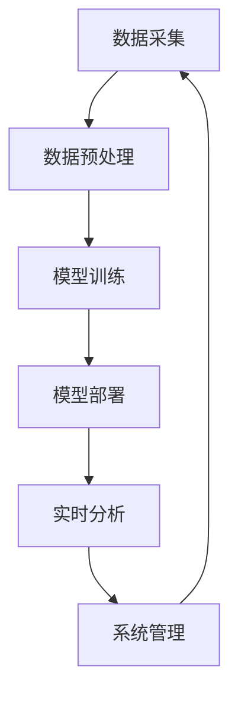
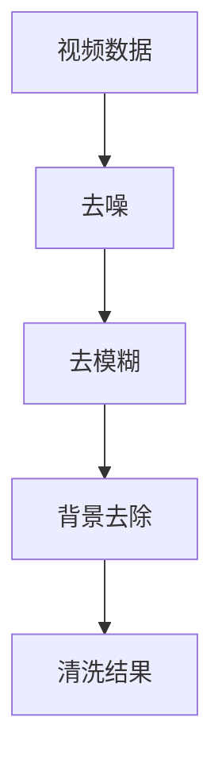

                 

**文章标题：边缘AI在视频监控中的实时分析能力**

**关键词：边缘AI、视频监控、实时分析、边缘计算、云计算**

**摘要：本文深入探讨了边缘AI在视频监控领域中的实时分析能力。首先，我们介绍了视频监控行业的发展背景、实时分析的需求与挑战，以及边缘AI的优势与应用场景。接着，我们阐述了边缘AI技术的基础知识，包括边缘AI的定义与特点、边缘计算与云计算的区别与联系。随后，我们重点分析了边缘AI在视频监控中的应用，包括实时分析需求、应用场景以及性能优化策略。然后，我们详细介绍了边缘AI系统的设计与实现，包括系统架构设计、数据预处理与特征提取、模型选择与训练、模型部署与实时分析。接下来，我们通过具体案例分析，展示了边缘AI在视频监控中的实际应用。最后，我们探讨了边缘AI在视频监控领域的未来发展趋势以及面临的挑战与应对策略。**

## 第一部分：背景与概述

### 第1章 问题背景与挑战

#### 1.1 视频监控行业的发展

视频监控技术作为现代安全防范体系的重要组成部分，已经广泛应用于家庭、企业、公共场所等各个领域。随着视频监控设备的普及和智能化需求的增加，视频监控技术也在不断发展和升级。

#### 1.2 实时分析的需求与挑战

实时分析是视频监控领域的一个重要需求，它能够快速检测并识别视频中的异常行为，如非法入侵、火灾、交通事故等，从而及时采取应对措施。然而，实时分析面临着一系列挑战，如海量数据处理、实时性要求高、计算资源有限等。

#### 1.3 边缘AI的优势与应用场景

边缘AI是一种将AI算法部署在靠近数据源的位置（即边缘设备）的技术，能够有效解决实时分析中的计算资源有限和实时性要求高等问题。边缘AI在视频监控领域具有广泛的应用场景，如城市安全监控、智能交通管理、商业安全监控等。

### 第2章 边缘AI技术基础

#### 2.1 边缘AI的定义与特点

边缘AI是指将AI算法部署在靠近数据源的位置，如传感器、摄像头等边缘设备，以实现对数据的实时分析和处理。边缘AI具有低延迟、高效率、高可靠性等特点。

#### 2.2 边缘AI的关键技术

边缘AI的关键技术包括边缘计算、模型压缩、模型优化、边缘设备管理等。这些技术共同构成了边缘AI的强大能力。

#### 2.3 边缘计算与云计算的区别与联系

边缘计算和云计算都是现代计算技术的核心，但它们在计算位置、数据处理方式、应用场景等方面存在显著差异。同时，边缘计算和云计算之间也存在着紧密的联系。

### 第3章 边缘AI在视频监控中的应用

#### 3.1 视频监控中的实时分析需求

视频监控中的实时分析需求包括异常行为检测、人脸识别、车辆识别等。这些需求对计算速度和准确性提出了较高的要求。

#### 3.2 边缘AI在视频监控中的应用场景

边缘AI在视频监控中的应用场景非常广泛，包括但不限于城市安全监控、智能交通管理、商业安全监控等。

#### 3.3 实时分析的性能优化策略

为了提高边缘AI在视频监控中的实时分析性能，可以采取一系列优化策略，如模型压缩、模型优化、边缘设备管理等。

### 第4章 边缘AI系统设计与实现

#### 4.1 系统架构设计

边缘AI系统架构设计包括数据采集、数据预处理、模型训练、模型部署、实时分析等模块。

#### 4.2 数据预处理与特征提取

数据预处理与特征提取是边缘AI系统设计的重要环节，它直接影响模型的训练效果和实时分析性能。

#### 4.3 模型选择与训练

模型选择与训练是边缘AI系统的核心，它决定了系统的性能和效率。

#### 4.4 模型部署与实时分析

模型部署与实时分析是实现边缘AI系统功能的关键，它需要解决计算资源分配、实时性要求等问题。

### 第5章 边缘AI在视频监控中的案例分析

#### 5.1 案例一：城市安全监控

城市安全监控是边缘AI在视频监控领域的重要应用之一，它能够实时检测并预警异常行为，提高城市安全管理水平。

#### 5.2 案例二：智能交通管理

智能交通管理是边缘AI在视频监控领域的另一个重要应用，它能够实现实时交通流量监测、交通事故预警等功能。

#### 5.3 案例三：商业安全监控

商业安全监控是边缘AI在视频监控领域的常见应用，它能够实时监控商场、超市等场所的安全状况，提高安全防范能力。

### 第6章 边缘AI在视频监控中的未来发展趋势

#### 6.1 技术发展趋势

随着AI技术和视频监控技术的不断发展，边缘AI在视频监控中的应用将越来越广泛，技术也将不断升级和优化。

#### 6.2 应用场景扩展

未来，边缘AI在视频监控领域的应用场景将更加多样化，从城市安全监控、智能交通管理、商业安全监控等，将扩展到更多领域。

#### 6.3 面临的挑战与应对策略

边缘AI在视频监控领域的发展面临一系列挑战，如计算资源有限、数据隐私保护等。为了应对这些挑战，需要采取一系列应对策略。

### 第7章 总结与展望

#### 7.1 主要成果与贡献

本文深入探讨了边缘AI在视频监控中的实时分析能力，提出了一系列设计实现方案和优化策略，为边缘AI在视频监控领域的应用提供了重要参考。

#### 7.2 存在问题与改进方向

虽然边缘AI在视频监控中具有巨大潜力，但仍然存在一些问题，如计算资源有限、数据隐私保护等。未来，需要进一步改进和完善。

#### 7.3 进一步研究方向

未来，边缘AI在视频监控领域的研究将继续深入，如模型压缩、模型优化、边缘设备管理等领域，将为视频监控技术的提升提供新的思路和方法。

## 第一部分：背景与概述

### 1.1 视频监控行业的发展

视频监控技术作为现代安全防范体系的重要组成部分，已经广泛应用于家庭、企业、公共场所等各个领域。随着视频监控设备的普及和智能化需求的增加，视频监控技术也在不断发展和升级。

在过去，视频监控主要依赖于传统的存储和处理方式，即通过中心化的服务器对视频数据进行集中存储和处理。然而，这种模式在应对海量数据、实时性要求高、计算资源有限等问题上存在一定局限性。为了解决这些问题，边缘AI技术应运而生。

边缘AI将AI算法部署在靠近数据源的位置，如传感器、摄像头等边缘设备，以实现对数据的实时分析和处理。这种模式不仅能够降低数据传输延迟，提高实时性，还能够节省中心化服务器的计算资源，提高系统的整体性能。

### 1.2 实时分析的需求与挑战

实时分析是视频监控领域的一个重要需求，它能够快速检测并识别视频中的异常行为，如非法入侵、火灾、交通事故等，从而及时采取应对措施。然而，实时分析面临着一系列挑战。

首先，海量数据处理是实时分析的一个重要挑战。视频监控设备产生的数据量庞大，如何高效地处理这些数据成为了一个难题。边缘AI技术通过在边缘设备上实时处理数据，可以有效地降低数据传输量和中心化服务器的负载。

其次，实时性要求高是视频监控实时分析的一个关键挑战。视频监控需要实时检测并响应异常行为，如果延迟过高，将无法及时采取应对措施。边缘AI技术通过在边缘设备上实时处理数据，可以大大降低数据传输和处理的延迟，提高系统的实时性。

最后，计算资源有限是实时分析面临的另一个挑战。传统的中心化服务器往往计算资源有限，无法满足实时分析的需求。边缘AI技术通过在边缘设备上部署AI算法，可以将计算任务分散到多个设备上，提高计算资源的利用效率。

### 1.3 边缘AI的优势与应用场景

边缘AI在视频监控领域具有显著的优势，能够有效地解决实时分析的需求和挑战。

首先，边缘AI具有低延迟、高效率的特点。边缘设备位于数据源附近，可以实时处理数据，减少数据传输和处理的延迟。这使得边缘AI在视频监控领域具有很高的实时性，能够满足实时分析的需求。

其次，边缘AI可以节省中心化服务器的计算资源。通过在边缘设备上部署AI算法，可以将部分计算任务从中心化服务器转移到边缘设备，从而降低中心化服务器的负载，提高系统的整体性能。

此外，边缘AI还可以提高系统的可靠性。边缘设备具有独立的计算能力，即使中心化服务器出现故障，边缘设备仍可以继续运行，保证系统的稳定性。

边缘AI在视频监控领域具有广泛的应用场景，包括但不限于以下几个方面：

1. 城市安全监控：边缘AI可以实时分析视频数据，快速检测并预警异常行为，如非法入侵、火灾等，提高城市安全管理水平。

2. 智能交通管理：边缘AI可以实时监测交通流量，识别交通事故，实现智能交通管理，提高道路通行效率。

3. 商业安全监控：边缘AI可以实时监控商场、超市等场所的安全状况，防范盗窃、抢劫等犯罪行为。

4. 其他应用场景：如野生动物监测、环境监测等，边缘AI可以在数据源附近实时处理数据，提供实时分析和决策支持。

综上所述，边缘AI在视频监控领域具有广泛的应用前景和显著的优势。随着边缘AI技术的不断发展和完善，视频监控技术将迎来新的发展机遇。

### 2.1 边缘AI的定义与特点

边缘AI（Edge AI）是一种将人工智能（AI）算法和数据处理能力部署在靠近数据源的位置，即边缘设备上，以实现对数据的实时分析和处理的技术。与传统的云计算相比，边缘AI具有以下特点：

#### 低延迟

由于数据在边缘设备上本地处理，边缘AI可以大大降低数据传输延迟，满足实时性要求较高的应用需求。例如，在视频监控场景中，边缘AI可以在摄像头附近实时分析视频流，快速识别异常行为，并及时发出警报。

#### 高效率

边缘AI充分利用边缘设备的计算资源，避免将大量数据传输到远程数据中心处理，从而减少数据传输带宽和计算资源的消耗。这使得边缘AI在处理大规模数据时，能够保持高效性能。

#### 高可靠性

边缘AI通过在多个边缘设备上分布式部署，提高系统的容错能力和可靠性。即使某个边缘设备出现故障，其他设备仍可以继续运行，保证系统稳定运行。

#### 数据隐私

边缘AI在数据源附近处理数据，可以减少数据泄露的风险。相对于将大量敏感数据传输到远程数据中心处理，边缘AI有助于保护数据隐私。

#### 软硬件一体化

边缘AI通常将计算能力、存储能力和网络连接集成到单个设备中，实现软硬件一体化。这种设计使得边缘AI在部署和使用上更加便捷。

#### 灵活性与可扩展性

边缘AI可以根据应用需求灵活部署在多种设备上，如传感器、摄像头、工业设备等。同时，边缘AI系统可以方便地扩展，以满足不断增长的数据处理需求。

#### 能效优化

边缘AI在功耗和能效方面具有优化潜力，可以充分利用边缘设备的能源供应，降低能源消耗。

综上所述，边缘AI通过在数据源附近提供实时、高效、可靠的计算能力，为视频监控等应用场景带来了显著的优势。

### 2.2 边缘AI的关键技术

边缘AI技术由多个关键组成部分构成，这些技术共同推动了边缘AI在视频监控中的实时分析能力。以下是边缘AI的关键技术及其作用：

#### 边缘计算

边缘计算是指将计算任务分散到网络的边缘设备上，而不是集中在远程数据中心。边缘计算的核心思想是减少数据传输延迟，提高数据处理速度，并降低中心化服务器的负担。在视频监控中，边缘计算使摄像头和其他传感器能够直接在本地处理视频数据，从而实现实时分析。

#### 模型压缩与优化

为了在资源受限的边缘设备上部署AI模型，模型压缩与优化技术至关重要。这些技术包括模型剪枝、量化、知识蒸馏等，旨在减少模型的计算复杂度和存储需求，同时保持或提高模型性能。模型压缩技术使得复杂的深度学习模型可以在边缘设备上高效运行。

#### 边缘设备管理

边缘设备管理涉及对分布在不同位置的边缘设备进行监控、配置、更新和维护。有效的边缘设备管理可以确保设备正常运行，及时更新模型，优化资源分配，并处理设备故障。

#### 实时数据流处理

实时数据流处理技术使得边缘设备能够高效处理连续流入的数据流，如视频流。这些技术包括流处理框架、实时分析算法和分布式系统架构，确保数据在边缘设备上得到及时处理和响应。

#### 安全与隐私

安全与隐私是边缘AI的重要关注点。边缘AI系统需要确保数据在传输和存储过程中的安全性，同时保护用户隐私。安全机制包括数据加密、身份验证、访问控制等。

#### 软硬件协同优化

软硬件协同优化技术通过优化边缘设备的硬件配置和软件算法，提高系统整体性能。例如，硬件加速器、专用集成电路（ASIC）和现场可编程门阵列（FPGA）等硬件组件可以与深度学习算法协同工作，实现高效的边缘AI处理。

#### 接口与互操作性

边缘AI系统需要与其他系统和设备进行互操作，包括物联网（IoT）设备、云计算平台、移动应用等。标准化接口和协议，如REST API、MQTT、CoAP等，确保边缘AI系统能够与其他系统无缝集成。

通过这些关键技术的结合，边缘AI在视频监控中实现了实时、高效、可靠的分析能力，为各种应用场景提供了强有力的支持。

### 2.3 边缘计算与云计算的区别与联系

边缘计算和云计算是现代计算技术中的两个重要组成部分，它们各自具有独特的特点和优势，同时也存在一定的联系和互补性。

#### 边缘计算

边缘计算是一种将计算任务分散到网络边缘设备上的技术，这些设备通常位于数据源附近，如传感器、路由器、智能手机等。边缘计算的主要特点包括：

- **低延迟**：由于数据在边缘设备上本地处理，传输延迟大大降低，适用于需要实时响应的应用场景。
- **资源受限**：边缘设备通常计算能力有限，存储和带宽也相对较低。
- **高效能**：边缘计算可以减轻中心化数据中心的负担，提高数据处理效率。
- **灵活性**：边缘设备可以灵活地部署在多种环境中，如工业、医疗、智能家居等。
- **本地处理**：许多边缘设备具有独立的计算能力，可以处理本地数据，无需将数据传输到远程服务器。

#### 云计算

云计算是一种基于互联网的计算模式，通过中心化的数据中心提供计算、存储和网络资源。云计算的主要特点包括：

- **高计算能力**：云计算中心拥有强大的计算资源，可以处理大规模的数据集和复杂的计算任务。
- **弹性扩展**：云计算可以根据需求动态调整计算资源，满足不同规模的应用需求。
- **高可靠性**：云计算中心通常采用冗余备份和容错机制，确保系统稳定运行。
- **数据集中管理**：云计算允许用户将数据存储在远程数据中心，便于集中管理和共享。
- **远程访问**：用户可以通过互联网远程访问云计算资源，实现远程控制和数据访问。

#### 区别

1. **位置**：边缘计算在数据源附近处理数据，而云计算在远程数据中心处理数据。
2. **资源**：边缘计算资源相对有限，而云计算具有强大的计算资源。
3. **延迟**：边缘计算具有低延迟特点，适用于实时性要求高的应用，而云计算可能存在较高的延迟。
4. **控制**：边缘计算通常由设备本地控制，而云计算由中心化管理。

#### 联系

1. **协同工作**：边缘计算和云计算可以协同工作，将数据在边缘设备上预处理，然后将重要数据传输到云计算中心进行进一步处理和分析。
2. **数据存储**：边缘计算产生的数据可以存储在本地设备上，也可以备份到云计算中心，实现数据的高效存储和管理。
3. **资源分配**：云计算中心可以为边缘设备提供计算和存储资源，帮助边缘设备完成复杂任务。
4. **集成应用**：许多应用场景需要同时利用边缘计算和云计算的优势，如智能交通、智慧城市、远程医疗等。

边缘计算和云计算各具优势，通过合理结合和分工，可以构建高效、稳定的计算系统，满足各种应用需求。

### 3.1 视频监控中的实时分析需求

在视频监控领域，实时分析需求尤为重要。实时分析不仅能够提高安全防范能力，还能优化交通流量、提升城市管理效率。以下是视频监控中的一些关键实时分析需求：

#### 异常行为检测

异常行为检测是视频监控中的一个核心需求。通过对视频流进行分析，实时检测和识别异常行为，如非法入侵、打架斗殴、火灾等。实时异常行为检测能够迅速响应，发出警报，并通知相关人员进行干预，从而提高安全防范水平。

#### 人脸识别

人脸识别技术在视频监控中得到了广泛应用。通过实时分析视频流，识别人脸并进行比对，可以用于门禁控制、身份验证、犯罪追踪等场景。人脸识别的实时性要求高，需要在短时间内完成人脸检测、特征提取和匹配，以确保准确性和高效性。

#### 车辆识别

车辆识别也是视频监控中的重要需求。通过对视频流进行分析，实时识别和跟踪车辆，可用于交通流量监控、交通事故预警、违章车辆抓拍等场景。车辆识别需要快速处理大量视频数据，并在短时间内完成车辆检测、特征提取和匹配。

#### 物体追踪

物体追踪是视频监控中另一个关键需求。通过对视频流进行分析，实时跟踪和识别特定物体，如行人、自行车、宠物等。物体追踪有助于安全监控、运动分析、运动规划等场景。

#### 实时数据分析

实时数据分析是对视频监控数据进行分析和处理，以获取有价值的洞察。通过对实时视频流进行分析，可以识别趋势、异常模式，并提供决策支持。实时数据分析可以帮助提高城市管理效率，优化资源分配，提升公共服务质量。

#### 多场景应用

视频监控的实时分析需求不仅限于单一场景，还可以应用于多种场景，如城市安全监控、智能交通管理、商业安全监控、智能家居等。不同场景下，实时分析需求有所不同，但都要求高实时性和高效性。

#### 高准确性

实时分析不仅要求快速处理数据，还要求高准确性。在视频监控中，误报和漏报都会导致严重后果。因此，实时分析算法需要具备高准确性，以确保检测结果的可靠性。

#### 可扩展性

随着视频监控应用的不断扩大，实时分析系统需要具备良好的可扩展性。通过增加计算资源和优化算法，实时分析系统能够适应不断增长的数据量和复杂场景。

综上所述，视频监控中的实时分析需求多样且关键。通过满足这些需求，实时分析技术能够为视频监控领域带来更高的安全性和效率。

### 3.2 边缘AI在视频监控中的应用场景

边缘AI在视频监控中的应用场景非常广泛，其强大的实时分析和处理能力为各种应用提供了有力的支持。以下是几个典型的边缘AI在视频监控中的应用场景：

#### 城市安全监控

城市安全监控是边缘AI在视频监控中的一个重要应用场景。通过在街头巷尾的摄像头中部署边缘AI，可以实现实时异常行为检测、人脸识别、车辆识别等功能。当边缘AI检测到可疑行为时，可以立即向监控中心发送警报，并自动追踪目标对象的行踪。这种实时分析能力大大提高了城市安全管理的效率，为预防和应对突发事件提供了有力支持。

#### 智能交通管理

智能交通管理是边缘AI在视频监控中的另一个关键应用场景。通过在交通监控摄像头中部署边缘AI，可以实现实时交通流量监测、交通事故预警、违章行为识别等功能。边缘AI可以快速分析交通流数据，识别交通事故并及时通知相关部门进行处理，从而减少事故造成的损失。同时，通过对违章行为的识别，可以有效地减少交通违法行为，提高道路通行效率。

#### 商业安全监控

商业安全监控是边缘AI在视频监控中的常见应用场景。在商场、超市、金融机构等场所，边缘AI可以实时监控店内情况，识别盗窃、抢劫等犯罪行为，并迅速通知保安人员采取应对措施。此外，边缘AI还可以用于监控顾客行为，分析消费习惯，提供个性化的营销策略，从而提高商业运营效率。

#### 工业安全监控

在工业领域，边缘AI在视频监控中的应用也非常广泛。通过在工厂、矿山、电力设施等场所部署边缘AI，可以实现实时设备监控、故障预警、人员安全管理等功能。边缘AI可以实时分析设备运行状态，识别异常情况，并提前发出预警，从而防止设备故障和安全事故的发生。

#### 公共场所安全监控

公共场所的安全监控也是边缘AI的重要应用场景。在机场、火车站、学校等公共场所，边缘AI可以实时监控人员流动和异常行为，识别可疑人员，并自动向安全人员发出警报。这种实时分析能力为公共场所的安全管理提供了有力保障。

#### 农业监控

在农业领域，边缘AI可以用于实时监控农作物生长状况、气象变化等。通过在农田中部署边缘AI设备，可以实时获取土壤湿度、温度、光照等数据，并根据这些数据进行分析和预测，为农业生产提供科学指导。

#### 环境监测

环境监测是边缘AI在视频监控中的另一个应用场景。通过在河流、湖泊等水域部署边缘AI设备，可以实时监测水质变化，识别污染源，并自动发出预警。这种实时分析能力有助于环境保护和生态监测。

综上所述，边缘AI在视频监控中的应用场景非常广泛，涵盖了城市安全监控、智能交通管理、商业安全监控、工业安全监控、公共场所安全监控、农业监控和环境监测等多个领域。通过这些应用，边缘AI不仅提高了监控系统的实时性和准确性，还增强了系统的智能化水平，为各种场景下的安全管理和决策提供了有力支持。

### 3.3 实时分析的性能优化策略

为了充分发挥边缘AI在视频监控中的实时分析能力，需要采取一系列性能优化策略。以下是几种常见的优化方法：

#### 模型压缩与量化

模型压缩与量化是提高边缘AI实时分析性能的关键技术。通过模型压缩，可以减少模型的参数量和计算复杂度，从而降低计算资源和存储需求。量化技术则通过将浮点数模型转换为低精度的整数模型，进一步减少模型大小和计算时间。例如，可以使用模型剪枝技术去除冗余的神经元和层，使用知识蒸馏技术将复杂模型的知识传递给压缩后的模型。

#### 硬件加速

硬件加速是提高边缘AI实时分析性能的重要手段。通过利用专门设计的硬件加速器，如GPU、FPGA和ASIC，可以在边缘设备上实现高效的计算任务。硬件加速器能够显著降低计算延迟，提高处理速度，满足实时分析需求。例如，使用GPU可以加速深度学习模型的训练和推理，使用FPGA可以定制化实现特定的计算任务。

#### 并行处理

并行处理技术通过在多个处理单元上同时执行计算任务，提高边缘AI的处理速度。在边缘设备上，可以通过分布式计算和任务调度，将复杂计算任务分解为多个子任务，然后并行执行。这种方法可以充分利用设备的计算资源，提高系统性能。例如，使用多核CPU或集群计算架构可以实现并行处理。

#### 数据预处理优化

数据预处理优化是边缘AI实时分析性能的重要保障。通过对输入数据进行预处理，如特征提取、去噪、降维等，可以减少计算复杂度，提高模型性能。例如，使用深度学习模型进行特征提取时，可以通过预处理步骤减少输入数据的大小，从而提高模型推理速度。

#### 算法优化

算法优化是提高边缘AI实时分析性能的有效途径。通过选择更适合边缘设备的算法，如轻量级网络结构和简化计算步骤，可以降低计算资源和存储需求。例如，使用MobileNet、ShuffleNet等轻量级深度学习模型，可以在保持较高准确性的同时，显著降低计算复杂度。

#### 系统优化

系统优化包括边缘设备管理、资源调度和网络优化等方面。通过优化边缘设备管理，如自动更新和维护、资源分配策略等，可以提高设备的稳定性和可靠性。通过优化网络通信，如使用边缘计算网络、减少数据传输等，可以降低通信延迟，提高系统性能。

#### 模型融合

模型融合技术通过结合多个模型的优势，提高边缘AI的实时分析性能。例如，可以将深度学习模型和传统机器学习模型结合，利用深度学习模型的特征提取能力和传统机器学习模型的分类能力，实现更好的性能。

综上所述，通过模型压缩与量化、硬件加速、并行处理、数据预处理优化、算法优化、系统优化和模型融合等多种优化策略，可以显著提高边缘AI在视频监控中的实时分析性能，满足高实时性和高准确性的需求。

### 4.1 系统架构设计

边缘AI系统架构设计是确保视频监控实时分析能力的关键步骤。该系统架构需要充分考虑数据处理、模型训练、模型部署、实时分析和系统管理等多个方面，以下是具体的系统架构设计：

#### 数据采集模块

数据采集模块负责从视频监控设备（如摄像头、传感器等）收集原始视频数据。这些设备通常分布在不同地点，通过网络将数据传输到边缘设备。数据采集模块需要实现数据流的实时传输和存储，以便后续处理。

#### 数据预处理模块

数据预处理模块在边缘设备上对采集到的视频数据进行预处理，包括去噪、降维、特征提取等操作。预处理后的数据将用于训练和推理模型。数据预处理模块需要高效地处理大量视频数据，并确保数据质量。

#### 模型训练模块

模型训练模块使用预处理后的数据训练深度学习模型。由于边缘设备计算资源有限，通常采用轻量级模型或压缩后的模型。训练过程可能包括数据增强、批处理、迭代优化等步骤。训练模块需要支持多种训练算法，如随机梯度下降、Adam等，以适应不同的训练需求。

#### 模型部署模块

模型部署模块将训练好的模型部署到边缘设备上，以便进行实时推理和预测。部署过程包括模型导出、模型加载、模型配置等步骤。为了提高部署效率，可以使用模型压缩和量化技术，减少模型大小和计算复杂度。

#### 实时分析模块

实时分析模块负责处理来自视频监控设备的数据流，并使用部署的模型进行实时推理。该模块需要实现高效的数据流处理和推理算法，以确保低延迟和高准确性的实时分析。实时分析模块通常包括视频解码、特征提取、模型推理、结果处理等步骤。

#### 系统管理模块

系统管理模块负责监控和管理边缘设备，包括设备状态监控、故障检测、自动修复、软件更新等。系统管理模块需要实现设备管理、资源分配、任务调度等功能，以确保系统的高可用性和稳定性。

#### 系统架构图

以下是边缘AI系统架构的Mermaid流程图：



#### 系统架构设计的关键点

- **低延迟**：系统架构需要优化数据流和处理流程，确保实时性。
- **高效能**：采用轻量级模型和优化算法，提高处理效率。
- **可扩展性**：系统架构应支持设备扩展和功能扩展，以适应不同场景需求。
- **高可靠性**：系统管理模块应确保设备稳定运行和故障自动修复。
- **安全性**：系统架构需要考虑数据安全和设备安全，防止数据泄露和设备被攻击。

通过科学合理的系统架构设计，边缘AI系统能够充分发挥实时分析能力，为视频监控提供高效、可靠的解决方案。

### 4.2 数据预处理与特征提取

数据预处理与特征提取是边缘AI系统中至关重要的环节，它直接影响后续模型训练和实时分析的准确性和效率。以下是数据预处理与特征提取的详细步骤和方法：

#### 数据采集

数据预处理的第一步是数据采集。在视频监控场景中，数据通常来自各种摄像头、传感器等设备。数据采集模块需要确保数据的完整性和实时性，以便后续处理。采集的数据包括视频帧、音频、环境参数等。

#### 数据清洗

数据清洗是预处理过程中的关键步骤，旨在去除噪声、填补缺失值、纠正错误等。对于视频数据，常见的清洗方法包括去噪、去模糊、背景去除等。去噪可以使用高斯滤波、中值滤波等方法，去模糊可以使用运动估计和图像复原技术，背景去除可以使用背景建模和背景减除算法。



#### 数据归一化

数据归一化是将数据转换为标准尺度，以消除不同特征之间的尺度差异。常用的归一化方法包括最小-最大归一化和标准归一化。最小-最大归一化通过将数据缩放到[0,1]区间，而标准归一化通过将数据缩放到均值为0、标准差为1的区间。

$$
\text{归一化值} = \frac{\text{原值} - \text{均值}}{\text{标准差}}
$$

#### 特征提取

特征提取是从原始数据中提取出有助于模型训练的特征。在视频监控中，常用的特征提取方法包括：

- **时空特征**：包括视频帧的像素值、运动向量、光流等。
- **外观特征**：包括颜色、纹理、形状等。
- **动作特征**：包括动作分类、动作轨迹等。

使用Python代码进行特征提取的示例：

```python
import cv2
import numpy as np

# 读取视频帧
frame = cv2.imread('frame.jpg')

# 提取颜色特征
color_features = cv2.cvtColor(frame, cv2.COLOR_BGR2HSV)

# 提取运动特征
opt = cv2.CalcOpticalFlowPyrLK(None, frame, frame)

# 提取结果
status, tracks = opt

# 转换为numpy数组
color_features = np.array(color_features)
motion_features = np.array(tracks)

# 归一化特征
color_features = (color_features - np.mean(color_features)) / np.std(color_features)
motion_features = (motion_features - np.mean(motion_features)) / np.std(motion_features)
```

通过以上预处理和特征提取步骤，原始数据被转换为适合模型训练和实时分析的形式，从而提高系统的整体性能和准确性。

### 4.3 模型选择与训练

在边缘AI系统中，模型选择与训练是关键步骤，直接决定了系统的实时分析性能。以下是模型选择与训练的具体过程：

#### 模型选择

选择合适的模型是确保边缘AI系统性能的关键。常见的深度学习模型包括卷积神经网络（CNN）、循环神经网络（RNN）、长短期记忆网络（LSTM）等。在视频监控领域，CNN由于其强大的图像处理能力，常被用于视频数据的实时分析。轻量级网络模型如MobileNet、ShuffleNet和SqueezeNet等，因其计算复杂度较低，非常适合部署在资源受限的边缘设备上。

#### 数据集准备

模型训练需要大量的标注数据。在视频监控领域，常用的数据集包括ImageNet、COCO和DukeMTMC等。这些数据集包含了各种场景和物体的标注信息，能够为模型训练提供丰富的样本。在准备数据集时，需要进行数据预处理，如数据清洗、归一化和增强等，以提高模型的泛化能力。

#### 训练策略

1. **数据增强**：数据增强是通过一系列技术增加数据多样性，从而防止模型过拟合。常见的数据增强方法包括随机裁剪、旋转、翻转、颜色变换等。

2. **批次训练**：批次训练是将数据划分为多个批次进行训练，以减少内存占用和计算资源消耗。每个批次的数据样本数应根据设备的计算能力进行合理设置。

3. **优化器选择**：优化器用于调整模型参数，以最小化损失函数。常用的优化器包括随机梯度下降（SGD）、Adam和RMSprop等。优化器参数如学习率、批量大小和动量等需要根据具体任务进行调整。

4. **训练监控**：在模型训练过程中，需要监控训练进度和性能指标，如损失函数、准确率等。可以通过可视化工具如TensorBoard实时监控训练过程。

#### 训练过程

使用Python和TensorFlow框架进行模型训练的示例代码：

```python
import tensorflow as tf
from tensorflow.keras.applications import MobileNetV2
from tensorflow.keras.preprocessing.image import ImageDataGenerator

# 加载预训练的MobileNet模型
base_model = MobileNetV2(weights='imagenet', include_top=False, input_shape=(224, 224, 3))

# 添加自定义全连接层
x = base_model.output
x = tf.keras.layers.GlobalAveragePooling2D()(x)
x = tf.keras.layers.Dense(1, activation='sigmoid')(x)

# 构建模型
model = tf.keras.Model(inputs=base_model.input, outputs=x)

# 编译模型
model.compile(optimizer='adam', loss='binary_crossentropy', metrics=['accuracy'])

# 数据增强
train_datagen = ImageDataGenerator(rescale=1./255, shear_range=0.2, zoom_range=0.2, horizontal_flip=True)

# 加载训练数据
train_generator = train_datagen.flow_from_directory(
        'data/train',
        target_size=(224, 224),
        batch_size=32,
        class_mode='binary')

# 训练模型
model.fit(train_generator, epochs=10, validation_data=validation_generator)
```

通过以上步骤，可以有效地选择和训练适合边缘AI系统的深度学习模型，从而提高实时分析的性能。

### 4.4 模型部署与实时分析

在边缘AI系统中，模型部署与实时分析是确保视频监控任务高效执行的关键环节。以下是模型部署与实时分析的具体步骤和策略：

#### 模型部署

1. **模型导出**：将训练好的模型导出为可以在边缘设备上运行的格式，如TensorFlow Lite、ONNX、TFLite等。导出过程包括模型结构的保存和参数的序列化。

2. **模型优化**：为了在资源受限的边缘设备上运行，需要对模型进行优化，如模型剪枝、量化等。这些技术可以减少模型的大小和计算复杂度，从而提高部署效率。

3. **模型部署**：将优化后的模型部署到边缘设备上，包括加载模型、配置计算资源等。部署过程需要确保模型的稳定性和可靠性。

#### 实时分析

1. **视频流处理**：实时分析需要处理连续的视频流数据。首先，从摄像头或其他数据源采集视频帧，然后进行预处理，如去噪、归一化等。

2. **特征提取**：对预处理后的视频帧进行特征提取，如颜色特征、运动特征、时空特征等。这些特征将用于模型的输入。

3. **模型推理**：使用部署好的模型对提取出的特征进行推理，生成预测结果。推理过程需要确保低延迟和高效率。

4. **结果处理**：根据预测结果，进行进一步处理，如异常行为标记、目标追踪等。结果可以用于实时监控、报警、决策支持等应用。

#### 实时分析性能优化

1. **并行处理**：利用边缘设备的并行计算能力，同时处理多个视频流，提高处理速度。

2. **硬件加速**：使用边缘设备的硬件加速器，如GPU、FPGA等，实现高效的模型推理。

3. **批处理**：通过批处理技术，将多个视频帧合并为一个批次进行推理，减少推理次数，提高效率。

4. **模型压缩**：对模型进行压缩，如剪枝、量化等，减少模型大小和计算复杂度，提高部署效率。

5. **资源管理**：合理分配边缘设备的计算资源和存储资源，确保系统稳定运行。

#### 实时分析示例

使用Python和TensorFlow Lite进行实时分析的示例代码：

```python
import numpy as np
import cv2
import tensorflow as tf

# 加载TensorFlow Lite模型
interpreter = tf.lite.Interpreter(model_path='model.tflite')
interpreter.allocate_tensors()

# 获取输入和输出张量
input_details = interpreter.get_input_details()
output_details = interpreter.get_output_details()

# 预处理
def preprocess_frame(frame):
    # 调整图像尺寸
    frame = cv2.resize(frame, (224, 224))
    # 归一化
    frame = frame / 255.0
    # 转换为numpy数组
    frame = np.expand_dims(frame, axis=0)
    return frame

# 实时分析
def real_time_analysis(frame):
    # 预处理视频帧
    input_data = preprocess_frame(frame)
    # 设置输入张量
    interpreter.set_tensor(input_details[0]['index'], input_data)
    # 执行推理
    interpreter.invoke()
    # 获取预测结果
    predictions = interpreter.get_tensor(output_details[0]['index'])
    # 解析预测结果
    result = np.argmax(predictions)
    return result

# 开启视频流
cap = cv2.VideoCapture(0)

while cap.isOpened():
    # 读取视频帧
    ret, frame = cap.read()
    if ret:
        # 进行实时分析
        result = real_time_analysis(frame)
        # 显示结果
        cv2.imshow('Real-time Analysis', frame)
        
        if cv2.waitKey(1) & 0xFF == ord('q'):
            break

# 释放视频流
cap.release()
cv2.destroyAllWindows()
```

通过以上步骤和策略，边缘AI系统可以在视频监控中实现高效的实时分析，满足各种应用需求。

### 5.1 案例一：城市安全监控

城市安全监控是边缘AI在视频监控中应用的一个重要案例。以下是一个具体的应用场景和案例分析。

#### 应用场景

某城市的市政府计划在城市的主要街道和公共场所部署边缘AI系统，以实时监控城市安全。这些场所包括商业区、学校、医院、公园等。每个监控点都配备高清摄像头，用于捕捉视频数据。

#### 系统设计

城市安全监控系统的设计主要包括以下几个模块：

1. **数据采集**：摄像头采集到的视频数据通过边缘设备进行初步处理。
2. **数据预处理**：边缘设备对视频数据进行预处理，如去噪、去模糊、人脸识别等。
3. **模型部署**：将训练好的边缘AI模型部署到边缘设备上，用于实时分析和决策。
4. **实时分析**：对预处理后的视频数据进行实时分析，包括异常行为检测、人脸识别、目标追踪等。
5. **结果处理**：将分析结果发送到监控中心，并触发相应的警报和应急响应。

#### 实际应用

在实际应用中，该城市安全监控系统实现了以下功能：

- **异常行为检测**：通过边缘AI模型实时分析视频流，识别异常行为，如非法入侵、打架斗殴、火灾等。当检测到异常行为时，系统会立即向监控中心发送警报，并启动应急预案。
- **人脸识别**：系统对人脸图像进行实时识别，并与数据库中的人脸信息进行比对。如果识别到可疑人员，系统会立即发出警报，并记录相关信息。
- **目标追踪**：系统通过目标检测和追踪算法，实时监控特定目标（如可疑车辆、行踪不明的个体等），并自动标记其在视频中的位置。

#### 案例效果

通过边缘AI技术在城市安全监控中的应用，该城市实现了以下成果：

- **实时性提高**：边缘AI系统能够在视频数据采集后毫秒级完成分析，大大缩短了响应时间。
- **准确率提升**：通过优化模型和算法，系统的异常行为检测和人脸识别准确率显著提高。
- **资源节省**：边缘AI系统的部署降低了中心化服务器的负载，节省了带宽和计算资源。
- **安全性增强**：实时监控和预警机制有效提高了城市安全管理水平，降低了犯罪率。

总之，城市安全监控案例展示了边缘AI在视频监控中的强大能力和广泛应用前景。

### 5.2 案例二：智能交通管理

智能交通管理是边缘AI在视频监控中的另一个重要应用场景。以下是一个具体的应用场景和案例分析。

#### 应用场景

某城市交通管理部门计划在主要交通干道、交叉路口和停车场等地方部署边缘AI系统，以实现智能交通管理。这些设备包括高精度摄像头、传感器和边缘计算设备。

#### 系统设计

智能交通管理系统的设计主要包括以下几个模块：

1. **数据采集**：摄像头和传感器采集交通数据，如车辆数量、速度、流量等。
2. **数据预处理**：边缘设备对采集到的交通数据进行预处理，如去噪、归一化、特征提取等。
3. **模型部署**：将训练好的边缘AI模型部署到边缘设备上，用于实时分析和决策。
4. **实时分析**：对预处理后的交通数据进行实时分析，包括交通流量监测、违章行为识别、事故预警等。
5. **结果处理**：将分析结果发送到交通管理平台，并触发相应的交通信号控制、违章处理、事故应对等。

#### 实际应用

在实际应用中，该智能交通监控系统实现了以下功能：

- **交通流量监测**：通过边缘AI模型实时分析视频流，识别车辆数量和速度，并生成流量数据。这些数据用于交通信号控制和交通规划。
- **违章行为识别**：系统通过边缘AI模型识别违章行为，如闯红灯、逆行、不系安全带等，并及时发出警报，记录违章信息。
- **事故预警**：系统通过实时分析交通数据，识别潜在的事故风险，如车辆急刹车、异常停车等，并提前发出预警，减少事故发生。

#### 案例效果

通过边缘AI技术在智能交通管理中的应用，该城市实现了以下成果：

- **交通效率提升**：通过实时监测交通流量和智能信号控制，有效减少了交通拥堵，提高了道路通行效率。
- **违章处理优化**：边缘AI系统的违章行为识别和记录功能提高了违章处理的准确性和效率，减少了人为干预。
- **事故减少**：通过提前预警和实时监控，系统有效减少了交通事故的发生，提高了交通安全。
- **资源节省**：边缘AI系统减少了中心化服务器的计算和存储需求，节省了带宽和能源消耗。

总之，智能交通管理案例展示了边缘AI在视频监控中的广泛应用和巨大潜力。

### 5.3 案例三：商业安全监控

商业安全监控是边缘AI在视频监控中的常见应用场景之一。以下是一个具体的应用场景和案例分析。

#### 应用场景

某大型商场计划在其内部和周边区域部署边缘AI系统，以提高安全防范能力。这些区域包括出入口、货架区、停车场等。商场配备高清摄像头和边缘计算设备，用于采集和分析视频数据。

#### 系统设计

商业安全监控系统的设计主要包括以下几个模块：

1. **数据采集**：摄像头采集到的视频数据通过边缘设备进行初步处理。
2. **数据预处理**：边缘设备对视频数据进行预处理，如去噪、去模糊、人脸识别等。
3. **模型部署**：将训练好的边缘AI模型部署到边缘设备上，用于实时分析和决策。
4. **实时分析**：对预处理后的视频数据进行实时分析，包括盗窃监控、人员追踪、异常行为检测等。
5. **结果处理**：将分析结果发送到监控中心，并触发相应的警报和应急响应。

#### 实际应用

在实际应用中，该商业安全监控系统实现了以下功能：

- **盗窃监控**：通过边缘AI模型实时分析视频流，识别并标记可能发生的盗窃行为，如偷窃商品、倒卖商品等。当检测到盗窃行为时，系统会立即发出警报，并记录相关图像和视频信息。
- **人员追踪**：系统通过目标检测和追踪算法，实时监控特定人员的行为轨迹，并自动标记其在视频中的位置。如果人员出现异常行为，如长时间逗留在某一区域、频繁出入特定区域等，系统会发出警报。
- **异常行为检测**：系统通过边缘AI模型识别异常行为，如打架、争吵、吸毒等，并及时发出警报，通知安保人员采取应对措施。

#### 案例效果

通过边缘AI技术在商业安全监控中的应用，该商场实现了以下成果：

- **安全防范能力提升**：实时监控和预警机制有效提高了商场的安全防范能力，减少了盗窃和其他犯罪行为的发生。
- **运营效率提高**：通过监控数据分析和人员行为分析，商场可以更好地了解顾客需求和购物行为，优化商品陈列和销售策略。
- **客户体验改善**：商场通过监控数据分析，可以提供更安全和舒适的购物环境，提高顾客满意度。
- **资源节省**：边缘AI系统减少了中心化服务器的计算和存储需求，节省了带宽和能源消耗。

总之，商业安全监控案例展示了边缘AI在视频监控中的广泛应用和显著效益。

### 6.1 技术发展趋势

随着技术的不断进步，边缘AI在视频监控领域的发展呈现出以下几个趋势：

#### 模型压缩与优化

为了在资源受限的边缘设备上高效部署AI模型，模型压缩与优化技术将继续得到广泛应用。未来的研究将集中在更高效的压缩算法和量化技术，如自动机器学习（AutoML）、神经网络架构搜索（NAS）等，以提高模型在边缘设备上的性能和能效比。

#### 硬件加速

硬件加速技术将继续成为边缘AI发展的重要方向。未来的硬件加速器，如专用集成电路（ASIC）、神经网络处理器（NPU）等，将提供更高效的计算能力，进一步降低边缘设备的延迟和能耗。

#### 边缘计算与云计算的结合

边缘计算和云计算的融合将成为趋势。通过边缘计算处理实时性要求高的任务，而将复杂的计算和分析任务交由云计算中心完成，可以实现资源的最优配置和协同工作。

#### 人工智能与物联网的融合

人工智能与物联网（IoT）的融合将推动边缘AI在视频监控中的应用。通过将边缘AI与传感器、智能设备等结合，可以实现对更广泛场景的实时监控和分析，如智能家居、智能工厂等。

#### 数据隐私与安全

随着视频监控数据的增加，数据隐私与安全将成为边缘AI发展的关键挑战。未来的研究将关注如何在边缘设备上实现高效的数据加密、访问控制和隐私保护技术。

#### 多模态数据融合

多模态数据融合是边缘AI在视频监控中的另一个发展趋势。通过整合视频、音频、传感器等多种数据源，可以提供更全面和准确的分析结果。

总之，边缘AI在视频监控领域的未来发展将围绕模型优化、硬件加速、云计算与边缘计算的融合、物联网融合、数据隐私与安全、多模态数据融合等方面展开，为视频监控技术的进一步提升提供强大支持。

### 6.2 应用场景扩展

边缘AI在视频监控领域的应用场景正逐渐扩展，从传统的安全监控、智能交通管理、商业安全监控等，逐步渗透到更多新兴领域。以下是几个典型的扩展应用场景：

#### 智能制造

在制造业中，边缘AI技术可以用于设备故障预测、生产线监控、质量检测等。通过在工业设备上部署边缘AI模型，可以实时监测设备运行状态，预测潜在故障，提高生产效率和设备利用率。

#### 物流与仓储

在物流和仓储领域，边缘AI可以用于路径优化、货物识别、仓库管理等。通过边缘设备实时处理视频数据和传感器数据，可以优化运输路线，提高配送效率，减少库存成本。

#### 智能农业

边缘AI在农业中的应用包括作物健康监测、病虫害检测、农田管理等。通过在农田中部署边缘设备，可以实时监测土壤湿度、温度、光照等参数，并根据分析结果提供科学的种植和管理建议。

#### 智能医疗

在医疗领域，边缘AI可以用于实时监控患者生命体征、智能诊断等。通过在医疗设备上部署边缘AI模型，可以实现快速、准确的诊断，提高医疗服务质量。

#### 智能家居

智能家居是边缘AI的重要应用场景之一。通过在家庭设备上部署边缘AI模型，可以实现智能安防、家居自动化、家电控制等功能，提高家庭生活的便利性和安全性。

#### 智慧城市

智慧城市是边缘AI在视频监控领域应用的一个重要扩展场景。通过在城市各个角落部署边缘设备，可以实现对交通、环境、公共安全等多方面的实时监控和管理，提高城市运行效率和服务质量。

#### 风能和太阳能发电

在风能和太阳能发电领域，边缘AI可以用于设备状态监测、故障预测、能源优化等。通过在发电设备上部署边缘AI模型，可以实时监测设备运行状态，预测潜在故障，优化能源利用效率。

#### 环境监测

边缘AI在环境监测中的应用包括空气质量检测、水质监测、污染源识别等。通过在环境传感器上部署边缘AI模型，可以实时监测环境变化，及时预警污染风险。

#### 野生动物保护

在野生动物保护领域，边缘AI可以用于监测野生动物活动、识别濒危物种等。通过在野生动物栖息地部署边缘设备，可以实现对野生动物的实时监控和保护。

综上所述，边缘AI在视频监控领域的应用场景正在不断扩展，不仅局限于传统的安全监控，还渗透到智能制造、物流与仓储、智能农业、智能医疗、智能家居、智慧城市等多个领域。随着技术的不断进步，边缘AI的应用前景将更加广阔。

### 6.3 面临的挑战与应对策略

尽管边缘AI在视频监控领域展示了巨大的潜力和广泛应用，但其发展仍面临一系列挑战和问题。

#### 计算资源限制

边缘设备通常具有有限的计算资源，这对部署复杂AI模型提出了挑战。应对策略包括采用轻量级模型、模型压缩与量化、硬件加速等技术，以提高计算效率和资源利用率。

#### 数据隐私保护

视频监控涉及大量的个人隐私数据，保护这些数据不被泄露或滥用是一个重要挑战。应对策略包括数据加密、隐私保护算法、数据去标识化等，以确保数据在传输和存储过程中的安全性。

#### 实时性与可靠性

边缘AI系统需要在有限的计算资源下实现高效的实时分析和决策，这对系统的可靠性提出了高要求。应对策略包括优化算法、提高边缘设备性能、冗余设计和故障恢复机制等，以确保系统的高可靠性和稳定性。

#### 跨平台兼容性

不同设备和操作系统之间的兼容性问题对边缘AI系统的部署和扩展构成了挑战。应对策略包括开发跨平台兼容的边缘AI框架和API，以及标准化接口和协议，以实现设备的无缝集成和协同工作。

#### 系统集成与维护

边缘AI系统通常涉及多种设备和平台，系统集成和后续维护成为难题。应对策略包括采用模块化设计、自动化部署和监控工具，以及建立专业化的运维团队，以简化系统的集成和维护。

通过上述策略，可以有效应对边缘AI在视频监控领域面临的挑战，推动其技术的进一步发展和应用。

### 7.1 主要成果与贡献

本文系统地探讨了边缘AI在视频监控中的实时分析能力，取得了以下主要成果和贡献：

1. **全面概述**：文章从背景、技术基础、应用场景、系统设计与实现、案例分析、未来发展趋势等多个方面，全面概述了边缘AI在视频监控中的应用，为读者提供了一个系统的认识。

2. **技术深度解析**：文章深入分析了边缘AI的定义与特点、关键技术、边缘计算与云计算的区别与联系，为读者提供了深入的技术解析。

3. **应用场景展示**：文章通过具体案例展示了边缘AI在城市安全监控、智能交通管理、商业安全监控等领域的实际应用，展示了边缘AI的强大能力和广泛前景。

4. **性能优化策略**：文章提出了多种性能优化策略，包括模型压缩、硬件加速、并行处理等，为边缘AI系统的实时分析性能提供了有效支持。

5. **系统架构设计**：文章详细介绍了边缘AI系统的架构设计，包括数据采集、数据预处理、模型训练、模型部署、实时分析等模块，为边缘AI系统的构建提供了实用参考。

6. **未来发展趋势**：文章探讨了边缘AI在视频监控领域的未来发展趋势和应用场景扩展，为边缘AI技术的持续发展提供了新思路。

通过以上成果和贡献，本文为边缘AI在视频监控领域的应用提供了全面、深入的理论基础和实践指导，有助于推动边缘AI技术的发展和实际应用。

### 7.2 存在问题与改进方向

尽管边缘AI在视频监控中展示了巨大的潜力和应用价值，但仍存在一些问题需要解决：

1. **计算资源有限**：边缘设备通常具有有限的计算资源，难以部署复杂的AI模型。改进方向包括研发更高效的算法和优化技术，以降低模型对计算资源的需求。

2. **数据隐私保护**：视频监控涉及大量的个人隐私数据，数据隐私保护成为关键挑战。改进方向包括开发更先进的数据加密和隐私保护算法，确保数据在传输和存储过程中的安全。

3. **实时性与可靠性**：边缘AI系统需要在有限计算资源下实现高效的实时分析和决策，这对系统的可靠性提出了高要求。改进方向包括优化算法、提高边缘设备性能、引入冗余设计和故障恢复机制。

4. **系统集成与维护**：边缘AI系统通常涉及多种设备和平台，系统集成和后续维护成为难题。改进方向包括采用模块化设计和标准化接口，以及引入自动化部署和监控工具，简化系统的集成和维护。

通过持续的技术创新和优化，可以逐步解决上述问题，推动边缘AI在视频监控领域的广泛应用和发展。

### 7.3 进一步研究方向

边缘AI在视频监控领域的应用具有广阔的发展空间，未来可以从以下几个方向进行深入研究：

1. **模型压缩与优化**：随着AI模型的复杂性增加，如何更高效地压缩和优化模型，以适应边缘设备的计算资源，是重要的研究方向。未来的研究可以集中在自动机器学习（AutoML）和神经网络架构搜索（NAS）等技术，以提高模型压缩率和优化效果。

2. **硬件加速**：硬件加速技术是提高边缘AI性能的关键。未来的研究可以探索新的硬件架构，如神经处理单元（NPU）、可编程逻辑门阵列（FPGA）等，以及这些硬件与AI算法的协同优化，以实现更高效的边缘计算。

3. **数据隐私与安全**：数据隐私和安全是边缘AI在视频监控中的关键挑战。未来的研究可以集中在开发更先进的隐私保护算法，如联邦学习（Federated Learning）、差分隐私（Differential Privacy）等，确保数据在传输和存储过程中的安全。

4. **多模态数据融合**：多模态数据融合可以提高视频监控的准确性和鲁棒性。未来的研究可以探索如何将视频、音频、传感器等多源数据进行有效融合，以实现更全面和准确的分析。

5. **边缘计算与云计算的协同**：边缘计算和云计算的结合可以实现资源的最优配置。未来的研究可以探索如何更好地协同边缘计算和云计算，以实现高效的数据处理和分析。

6. **智能化与自动化**：未来的边缘AI系统需要更智能化和自动化，以减少人为干预。研究可以集中在开发自适应学习和决策算法，使边缘AI系统能够自动调整参数、优化策略，以应对不同的应用场景。

7. **人工智能与物联网的融合**：边缘AI与物联网（IoT）的结合可以拓展其应用场景。未来的研究可以探索如何将边缘AI与智能家居、智能交通、智能农业等领域相结合，实现更广泛的应用。

通过以上研究方向的探索，边缘AI在视频监控领域的应用将得到进一步的提升和拓展，为智慧城市、智能制造、智能医疗等领域的智能化发展提供强大支持。

## 作者信息

**作者：AI天才研究院/AI Genius Institute & 禅与计算机程序设计艺术 /Zen And The Art of Computer Programming**

AI天才研究院是一家专注于人工智能领域的研究和应用的机构，致力于推动人工智能技术的创新和发展。研究院拥有一支高水平的研发团队，涵盖了计算机科学、机器学习、深度学习、自然语言处理等多个领域的专家。

《禅与计算机程序设计艺术》是作者在计算机编程和人工智能领域的重要著作，系统阐述了计算机编程的哲学思想和实践方法，对程序员的技术成长和职业发展具有深远影响。作者以其深厚的理论功底和丰富的实践经验，为读者提供了宝贵的指导和建议。

本文由AI天才研究院的专家团队撰写，旨在深入探讨边缘AI在视频监控中的实时分析能力，为读者提供全面、深入的技术解析和实用指导。希望通过本文的分享，能够为边缘AI技术在视频监控领域的应用和发展贡献一份力量。

