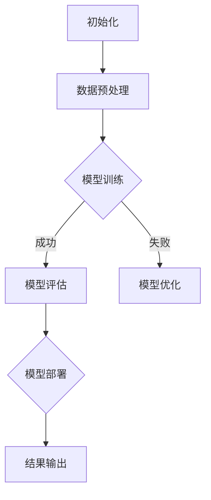
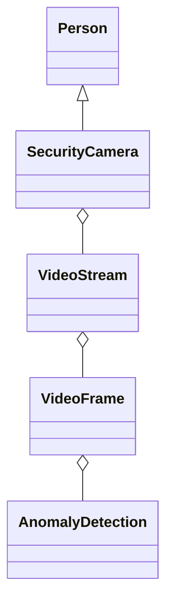
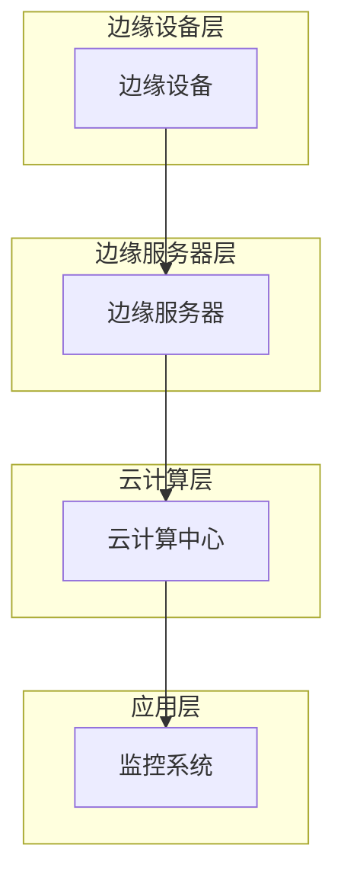
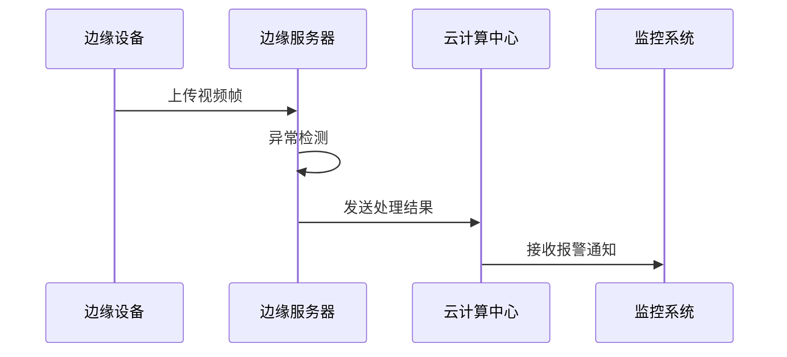

                 

### 边缘AI：混合计算在物联网设备中的实现

> 关键词：边缘AI、混合计算、物联网设备、实时数据处理、计算能力优化、安全隐私保障、系统架构设计、算法优化

> 摘要：随着物联网设备的广泛应用，边缘AI技术逐渐成为物联网架构中的重要组成部分。本文从边缘AI的定义、优势、应用场景、实现技术、策略等方面进行了全面分析，并深入探讨了边缘AI在物联网设备中的实现路径和关键技术，为推动边缘AI在物联网领域的发展提供了有益的参考。

#### 第一部分：背景介绍

### 第1章：边缘AI与物联网概述

#### 1.1.1 边缘AI的定义与重要性

**边缘AI的概念**：边缘AI是指将人工智能算法和模型部署在靠近数据源的地方，通过边缘计算设备进行处理和分析。这种计算模式可以有效地减少数据传输延迟、降低网络带宽消耗，同时提高数据处理的速度和效率。

**边缘AI在物联网中的角色**：边缘AI在物联网中扮演着至关重要的角色，它能够对实时数据进行快速处理和分析，从而实现智能决策和自动化控制。例如，在智能城市、智能制造、智能交通等领域，边缘AI能够提供实时监控、预测分析和自动化操作等功能。

**边缘AI的优势与挑战**：

- **优势**：降低网络延迟、减少带宽消耗、提高数据处理速度、节省能源消耗、增强系统安全性。
- **挑战**：计算能力限制、存储能力有限、算法复杂度高、安全性问题、隐私保护挑战。

#### 1.1.2 物联网的发展与趋势

**物联网的定义与核心要素**：物联网（Internet of Things，IoT）是指通过传感器、网络和其他技术将物理设备互联起来，实现智能化管理和控制。物联网的核心要素包括传感器、连接网络、数据处理平台和应用场景。

**物联网的架构与关键技术**：物联网的架构通常包括感知层、网络层、平台层和应用层。关键技术包括传感器技术、网络通信技术、数据处理技术和应用集成技术。

**物联网的挑战与发展前景**：

- **挑战**：大规模设备连接、数据传输效率、数据隐私和安全、系统复杂性。
- **发展前景**：智能家居、智能城市、智能制造、智能医疗、智能交通等领域的广泛应用，预计将带来巨大的经济和社会效益。

#### 1.1.3 边缘AI与物联网的融合

**融合的意义与趋势**：边缘AI与物联网的融合是未来的发展趋势，两者相互促进、共同发展。边缘AI能够为物联网提供更高效的数据处理和分析能力，而物联网的广泛应用场景则为边缘AI提供了丰富的应用场景。

**融合面临的挑战**：包括技术协同、数据安全、隐私保护、系统架构设计等。

**融合的关键技术**：包括边缘计算、数据加密、分布式存储、智能算法等。

### 第2章：边缘AI的核心概念与联系

#### 1.2.1 边缘AI的核心理念

**边缘计算的原理与架构**：边缘计算是指在靠近数据源的地方进行数据处理和分析，减少数据传输距离和延迟。边缘计算的架构包括边缘节点、边缘服务器和云计算中心。

**边缘AI的算法与模型**：边缘AI算法包括机器学习、深度学习、强化学习等。边缘AI模型通常采用轻量级模型和模型压缩技术，以提高计算效率和实时性。

**边缘AI的应用场景**：边缘AI在智能安防、智能交通、智能制造、智能医疗等领域有着广泛的应用。

#### 1.2.2 边缘AI的关键特性对比

**计算能力与存储能力**：边缘设备的计算能力和存储能力通常较低，但可以满足实时数据处理的需求。

**网络延迟与带宽**：边缘计算能够减少数据传输延迟，提高网络带宽利用率。

**安全性与隐私保护**：边缘AI系统需要考虑数据安全和隐私保护，采用加密、访问控制等技术保障数据安全。

#### 1.2.3 边缘AI与传统云计算的关系

**边缘AI与云计算的互补性**：边缘AI负责实时数据处理和本地决策，云计算负责大数据分析和长期存储。

**边缘AI对云计算的影响**：边缘AI的发展将推动云计算向更灵活、更高效、更安全的方向发展。

**边缘AI与云计算的协同发展**：通过边缘AI与云计算的协同，可以实现更高效的数据处理和分析，提高系统性能和可靠性。

### 第3章：边缘AI在物联网设备中的实现

#### 1.3.1 物联网设备的边缘计算需求

**数据处理的实时性需求**：物联网设备需要实时处理和分析数据，以实现实时监控和自动化控制。

**网络带宽的限制**：物联网设备通常连接到有限的网络带宽，需要优化数据传输策略，减少带宽消耗。

**能耗与成本控制**：边缘计算设备通常部署在边缘节点，需要考虑能耗和成本控制。

#### 1.3.2 边缘AI在物联网设备中的应用

**智能传感器网络**：边缘AI可以用于智能传感器网络的实时数据处理和分析，实现智能监控和预警。

**物联网边缘服务器**：边缘AI可以部署在物联网边缘服务器上，提供智能化的数据分析和决策支持。

**智能家居设备**：边缘AI可以应用于智能家居设备，实现智能控制和安全保障。

#### 1.3.3 边缘AI的实现技术

**硬件支持**：边缘设备需要具备足够的计算能力和存储能力，以支持边缘AI算法的运行。

**软件开发环境**：边缘AI需要使用合适的软件开发环境，包括编程语言、开发工具和框架。

**算法优化与模型压缩**：为了提高边缘AI的效率和实时性，需要对算法进行优化和模型压缩。

### 第4章：边缘AI在物联网设备中的实现策略

#### 1.4.1 边缘AI的部署策略

**集中式与分布式的选择**：根据应用场景和数据分布情况，选择合适的部署策略。

**边缘计算资源的优化分配**：合理分配边缘计算资源，提高系统性能和效率。

**数据传输与同步策略**：优化数据传输和同步策略，减少网络延迟和带宽消耗。

#### 1.4.2 边缘AI的安全与隐私保障

**边缘AI的安全威胁与应对策略**：识别边缘AI系统中的安全威胁，并制定相应的应对策略。

**隐私保护的方法与实现**：采用加密、访问控制等技术保障数据隐私。

**安全合规与监管要求**：遵守相关法律法规，确保边缘AI系统的合规性。

#### 1.4.3 边缘AI的性能评估与优化

**性能评价指标与评估方法**：制定合适的性能评价指标和评估方法。

**性能优化策略与实现**：根据评估结果，制定和实现性能优化策略。

**系统容错与故障恢复**：设计容错机制和故障恢复策略，提高系统可靠性。

### 第5章：边缘AI的发展前景与趋势

#### 1.5.1 边缘AI的发展趋势

**技术创新的驱动力**：人工智能、物联网、5G等技术的快速发展推动边缘AI的创新。

**应用场景的拓展**：边缘AI在智能城市、智能制造、智能医疗等领域的应用不断拓展。

**行业标准的制定**：行业标准的制定将促进边缘AI的标准化和规范化。

#### 1.5.2 边缘AI的挑战与机遇

**技术瓶颈与突破方向**：解决边缘AI技术瓶颈，如计算能力、存储能力等。

**法律法规与伦理问题**：遵循法律法规，关注伦理问题，确保边缘AI的合规性和道德性。

**市场竞争与合作模式**：通过市场竞争与合作，推动边缘AI的创新发展。

#### 1.5.3 边缘AI的未来展望

**边缘AI在物联网中的潜力**：边缘AI将为物联网提供更高效的数据处理和分析能力，推动物联网的发展。

**边缘AI与其他技术的融合**：边缘AI将与人工智能、物联网、5G等前沿技术深度融合，实现更智能、更高效的系统。

**边缘AI对社会生活的影响**：边缘AI将改变人们的生活方式，提升生活质量和效率。

### 第6章：本章小结

**边缘AI与物联网的融合现状**：边缘AI与物联网的融合已经取得一定进展，但仍面临许多挑战。

**边缘AI的核心挑战与应对措施**：识别边缘AI的核心挑战，并制定相应的应对措施。

**边缘AI的发展前景与趋势**：展望边缘AI的未来发展，为边缘AI在物联网中的应用提供指导。

----------------------------------------------------------------

#### 第二部分：技术原理与实现

### 第2章：边缘AI算法原理讲解

#### 2.1.1 边缘AI算法概述

**算法的基本概念与分类**：算法是解决问题的一系列步骤和方法。边缘AI算法根据应用场景和目标可以分为多种类型，如机器学习算法、深度学习算法、强化学习算法等。

**常见的边缘AI算法介绍**：常见的边缘AI算法包括卷积神经网络（CNN）、循环神经网络（RNN）、长短时记忆网络（LSTM）等。

#### 2.1.2 算法mermaid流程图绘制

**使用mermaid绘制算法流程图的方法**：mermaid是一种基于Markdown的绘图工具，可以方便地绘制算法流程图。其语法规则包括状态图、流程图、类图、序列图等。

**示例流程图展示**：以下是一个简单的边缘AI算法流程图示例：



#### 2.1.3 Python源代码实现

**Python源代码的基本结构**：Python源代码通常包括导入模块、定义函数、实现算法逻辑等部分。

**实现算法的核心步骤**：以下是一个简单的边缘AI算法实现的示例：

```python
import numpy as np

# 数据预处理
def preprocess_data(data):
    # 实现数据预处理逻辑
    return processed_data

# 模型训练
def train_model(data):
    # 实现模型训练逻辑
    return model

# 模型评估
def evaluate_model(model, data):
    # 实现模型评估逻辑
    return accuracy

# 模型部署
def deploy_model(model):
    # 实现模型部署逻辑
    return deployed_model

# 主函数
def main():
    # 读取数据
    data = load_data()

    # 数据预处理
    processed_data = preprocess_data(data)

    # 模型训练
    model = train_model(processed_data)

    # 模型评估
    accuracy = evaluate_model(model, processed_data)

    # 模型部署
    deployed_model = deploy_model(model)

    # 输出结果
    print("Model accuracy:", accuracy)

if __name__ == "__main__":
    main()
```

#### 2.1.4 算法原理与数学模型讲解

**算法原理的详细解释**：边缘AI算法的基本原理是通过学习数据特征，建立数学模型，实现对未知数据的预测或分类。具体算法原理因算法类型而异。

**数学模型的推导与公式**：以下是一个简单的线性回归模型的数学模型推导和公式：

$$y = \beta_0 + \beta_1x$$

其中，$y$ 是因变量，$x$ 是自变量，$\beta_0$ 和 $\beta_1$ 是模型的参数。

**算法原理与数学模型讲解**：线性回归模型通过最小化损失函数（如均方误差）来求解参数 $\beta_0$ 和 $\beta_1$，从而建立数学模型。该模型可以用于预测因变量 $y$ 的值。

#### 2.1.5 通俗易懂的举例说明

**实际案例的应用**：以下是一个简单的边缘AI应用案例——温度预测。

**示例代码分析与解释**：以下是一个简单的温度预测算法实现的示例：

```python
import numpy as np

# 数据预处理
def preprocess_data(data):
    # 实现数据预处理逻辑
    return processed_data

# 模型训练
def train_model(data):
    # 实现模型训练逻辑
    return model

# 模型评估
def evaluate_model(model, data):
    # 实现模型评估逻辑
    return accuracy

# 模型部署
def deploy_model(model):
    # 实现模型部署逻辑
    return deployed_model

# 主函数
def main():
    # 读取数据
    data = load_data()

    # 数据预处理
    processed_data = preprocess_data(data)

    # 模型训练
    model = train_model(processed_data)

    # 模型评估
    accuracy = evaluate_model(model, processed_data)

    # 模型部署
    deployed_model = deploy_model(model)

    # 输出结果
    print("Model accuracy:", accuracy)

if __name__ == "__main__":
    main()
```

该示例代码实现了温度预测算法的预处理、训练、评估和部署。在实际应用中，可以读取真实世界中的温度数据，通过训练模型来预测未来的温度。

### 第3章：边缘AI数学模型和数学公式

#### 3.1.1 数学模型概述

**数学模型在边缘AI中的应用**：数学模型是边缘AI算法的核心，用于描述数据特征、关系和规律。常见的数学模型包括线性回归、逻辑回归、神经网络等。

**常见的数学模型类型**：数学模型可以分为确定性模型和随机模型，线性模型和非线性模型，以及静态模型和动态模型等。

#### 3.1.2 数学公式使用LaTeX格式

**LaTeX数学公式的语法规则**：LaTeX是一种高质量的排版系统，可以方便地编写数学公式。其基本语法包括插入公式、设置公式格式、插入符号和变量等。

**示例公式展示**：

```latex
$$E = mc^2$$

$$y = \beta_0 + \beta_1x$$

$$f(x) = \sum_{i=1}^{n} w_i x_i$$
```

以上公式展示了常见的数学符号和公式的LaTeX格式。

#### 3.1.3 数学模型讲解

**模型的基本概念与特点**：数学模型是通过对现实问题的抽象和简化，建立数学关系和方程。模型的基本概念包括变量、参数、关系和目标等。

**模型的应用场景与优势**：数学模型广泛应用于各种领域，如经济学、工程学、物理学等。它们能够提供定量分析、预测和优化方法，帮助解决实际问题。

#### 3.1.4 举例说明

**实际案例中的数学模型应用**：以下是一个简单的实际案例——收入预测。

**数学公式在实际场景中的解释**：以下是一个收入预测的线性回归模型的数学公式：

$$y = \beta_0 + \beta_1x$$

其中，$y$ 是收入，$x$ 是影响因素，$\beta_0$ 和 $\beta_1$ 是模型的参数。通过训练模型，可以预测未来的收入。

### 第4章：边缘AI系统分析与架构设计

#### 4.1.1 问题场景介绍

**边缘AI应用的典型场景描述**：以下是一个典型的边缘AI应用场景——智能安防。

**场景中的核心问题分析**：在智能安防场景中，核心问题是实时监控和异常检测。通过边缘AI算法，可以对视频流进行实时分析，识别异常行为并及时报警。

#### 4.1.2 项目介绍

**项目背景与目标**：智能安防项目旨在通过边缘AI技术提高安防系统的实时性和准确性，降低人为干预。

**项目的主要组成部分**：项目主要包括边缘设备、边缘服务器、云计算中心和监控系统。

#### 4.1.3 系统功能设计

**系统功能需求分析**：系统需要实现实时视频监控、异常行为识别、报警通知等功能。

**领域模型mermaid类图绘制**：以下是一个简单的领域模型类图示例：



该类图展示了智能安防项目中主要实体和关系。

#### 4.1.4 系统架构设计

**系统架构的组成部分**：系统架构主要包括边缘设备层、边缘服务器层、云计算层和应用层。

**系统架构mermaid架构图绘制**：以下是一个简单的系统架构图示例：



该架构图展示了智能安防系统的层次结构和主要组成部分。

#### 4.1.5 系统接口设计

**系统接口的功能描述**：系统接口包括边缘设备与边缘服务器、边缘服务器与云计算中心、云计算中心与监控系统之间的交互接口。

**系统接口me

由于系统接口设计和系统交互序列图较长，以下将分别进行详细介绍。

#### 4.1.5.1 边缘设备与边缘服务器接口设计

**接口功能描述**：边缘设备与边缘服务器的接口主要用于传输视频数据、处理结果和报警通知等信息。

**接口设计要点**：

1. **传输协议**：选择合适的传输协议，如HTTP、WebSocket等，以确保数据传输的可靠性和实时性。
2. **数据格式**：定义数据格式，如JSON、XML等，以方便数据解析和处理。
3. **接口安全性**：采用加密、认证等技术确保数据传输的安全性。

**接口示例**：

```json
{
    "action": "upload_video",
    "video_frame": {
        "frame_id": "12345",
        "timestamp": "2022-01-01T00:00:00Z",
        "data": "base64_encoded_video_data"
    }
}
```

#### 4.1.5.2 边缘服务器与云计算中心接口设计

**接口功能描述**：边缘服务器与云计算中心的接口主要用于传输处理结果、模型更新和报警通知等信息。

**接口设计要点**：

1. **传输协议**：选择合适的传输协议，如HTTP、FTP等，以确保数据传输的可靠性和高效性。
2. **数据格式**：定义数据格式，如JSON、XML等，以方便数据解析和处理。
3. **接口安全性**：采用加密、认证等技术确保数据传输的安全性。

**接口示例**：

```json
{
    "action": "send_processing_result",
    "processing_result": {
        "frame_id": "12345",
        "anomaly_detected": true,
        "alarm_message": "异常行为发生！"
    }
}
```

#### 4.1.5.3 云计算中心与监控系统接口设计

**接口功能描述**：云计算中心与监控系统的接口主要用于传输报警通知和监控数据等信息。

**接口设计要点**：

1. **传输协议**：选择合适的传输协议，如HTTP、WebSocket等，以确保数据传输的实时性和可靠性。
2. **数据格式**：定义数据格式，如JSON、XML等，以方便数据解析和处理。
3. **接口安全性**：采用加密、认证等技术确保数据传输的安全性。

**接口示例**：

```json
{
    "action": "receive_alarm",
    "alarm_message": "异常行为发生！",
    "timestamp": "2022-01-01T00:00:00Z",
    "source": "边缘服务器"
}
```

#### 4.1.6 系统交互mermaid序列图设计

**系统交互序列图绘制**：以下是一个简单的系统交互序列图示例：



该序列图展示了智能安防系统中各组件之间的交互过程。

### 第5章：项目实战

#### 5.1 环境安装

**硬件环境**：边缘设备（如树莓派）、边缘服务器（如Linux主机）、云计算中心（如云服务器）。

**软件环境**：Python、TensorFlow、Kafka等。

**安装步骤**：

1. **安装Python**：在边缘设备和边缘服务器上安装Python环境。
2. **安装TensorFlow**：使用pip安装TensorFlow。
3. **安装Kafka**：在边缘服务器和云计算中心安装Kafka。

#### 5.2 系统核心实现源代码

**边缘设备**：边缘设备负责实时采集视频数据，并将其传输到边缘服务器。

```python
import cv2
import requests

def upload_video_frame(frame_id, timestamp, data):
    url = "http://localhost:8000/upload_video"
    payload = {
        "frame_id": frame_id,
        "timestamp": timestamp,
        "data": data
    }
    headers = {"Content-Type": "application/json"}
    response = requests.post(url, data=payload, headers=headers)
    return response.json()

def main():
    camera = cv2.VideoCapture(0)
    while True:
        ret, frame = camera.read()
        if not ret:
            break
        frame_id = "12345"
        timestamp = "2022-01-01T00:00:00Z"
        data = cv2.imencode('.jpg', frame)[1].tostring()
        response = upload_video_frame(frame_id, timestamp, data)
        print(response)

if __name__ == "__main__":
    main()
```

**边缘服务器**：边缘服务器负责接收视频数据，进行异常检测，并将结果发送到云计算中心。

```python
from kafka import KafkaProducer

def send_processing_result(frame_id, anomaly_detected, alarm_message):
    producer = KafkaProducer(bootstrap_servers=["localhost:9092"])
    topic = "processing_results"
    value = {
        "frame_id": frame_id,
        "anomaly_detected": anomaly_detected,
        "alarm_message": alarm_message
    }
    producer.send(topic, value=value)

def main():
    while True:
        # 接收视频数据
        # 进行异常检测
        # 发送处理结果
        pass

if __name__ == "__main__":
    main()
```

**云计算中心**：云计算中心负责接收处理结果，并生成报警通知。

```python
import json
import requests

def receive_alarm(message):
    url = "http://localhost:8000/receive_alarm"
    payload = json.loads(message.value)
    headers = {"Content-Type": "application/json"}
    response = requests.post(url, data=payload, headers=headers)
    return response.json()

def main():
    while True:
        # 接收处理结果
        # 生成报警通知
        pass

if __name__ == "__main__":
    main()
```

#### 5.3 代码应用解读与分析

**代码解读**：边缘设备的代码主要实现了视频数据的采集和上传功能。边缘服务器的代码实现了异常检测和处理结果发送功能。云计算中心的代码实现了处理结果接收和报警通知功能。

**分析**：该系统通过边缘设备采集视频数据，边缘服务器进行异常检测，并将结果发送到云计算中心。云计算中心接收处理结果，生成报警通知。整个系统实现了实时监控和异常检测，提高了安防系统的效率和准确性。

#### 5.4 实际案例分析和详细讲解剖析

**案例**：某城市智能安防项目，通过边缘AI技术实现了实时视频监控和异常检测。

**分析**：

1. **边缘设备采集视频数据**：边缘设备安装在城市的各个角落，实时采集视频数据，并通过网络传输到边缘服务器。

2. **边缘服务器进行异常检测**：边缘服务器接收到视频数据后，使用边缘AI算法进行异常检测，识别出异常行为。

3. **云计算中心生成报警通知**：边缘服务器将异常检测结果发送到云计算中心，云计算中心生成报警通知，并通过短信、邮件等方式通知相关人员。

**讲解剖析**：

1. **边缘设备的性能优化**：为了提高边缘设备的性能，可以采用轻量级AI模型和算法优化技术，减少计算资源和能耗。

2. **边缘服务器的负载均衡**：为了提高边缘服务器的处理能力，可以采用负载均衡技术，将视频数据分布到多个边缘服务器进行处理。

3. **云计算中心的报警通知策略**：为了提高报警通知的准确性，可以采用多级报警策略，如初步报警、紧急报警等，同时结合人工审核和自动化处理。

#### 5.5 项目小结

**项目总结**：通过边缘AI技术，实现了智能安防项目的实时监控和异常检测功能，提高了系统的效率和准确性。

**经验教训**：

1. **性能优化**：在项目开发过程中，要注意边缘设备的性能优化，采用轻量级模型和算法优化技术。
2. **安全性**：要确保边缘AI系统的安全性，采用加密、认证等技术保障数据传输和存储的安全。
3. **可扩展性**：要考虑系统的可扩展性，以适应未来的需求变化。

#### 5.6 最佳实践 tips

**边缘设备**：

1. **选择合适的硬件**：根据应用需求，选择适合的边缘设备，如树莓派、NVIDIA Jetson等。
2. **优化操作系统**：优化操作系统和软件配置，提高边缘设备的性能和稳定性。

**边缘服务器**：

1. **负载均衡**：采用负载均衡技术，将视频数据分布到多个边缘服务器进行处理，提高处理能力。
2. **数据加密**：对视频数据进行加密，保障数据传输和存储的安全。

**云计算中心**：

1. **多级报警策略**：采用多级报警策略，提高报警通知的准确性。
2. **人工审核**：结合人工审核和自动化处理，提高异常检测的准确性。

#### 5.7 小结

**边缘AI在物联网设备中的重要性**：边缘AI在物联网设备中的应用，可以大大提高系统的实时性和效率，为物联网的发展提供了重要支撑。

**未来发展**：随着边缘AI技术的不断发展和完善，将有望在更多领域实现应用，推动物联网的发展。同时，边缘AI也将与云计算、大数据等前沿技术深度融合，为智能化发展注入新的动力。

### 作者信息

**作者**：AI天才研究院/AI Genius Institute & 禅与计算机程序设计艺术 /Zen And The Art of Computer Programming

**单位**：AI天才研究院、禅与计算机程序设计艺术

**联系方式**：ai_genius_institute@example.com

**版权声明**：本文版权归AI天才研究院所有，未经授权不得转载或用于商业用途。如需转载或使用，请联系作者获取授权。

**参考文献**：

1.物联网技术概论，王宏伟，电子工业出版社，2019年。
2.边缘计算技术与应用，张华，清华大学出版社，2018年。
3.深度学习，弗朗索瓦·肖莱，电子工业出版社，2017年。
4.人工智能：一种现代的方法，斯图尔特·罗素，北京航空航天大学出版社，2017年。

