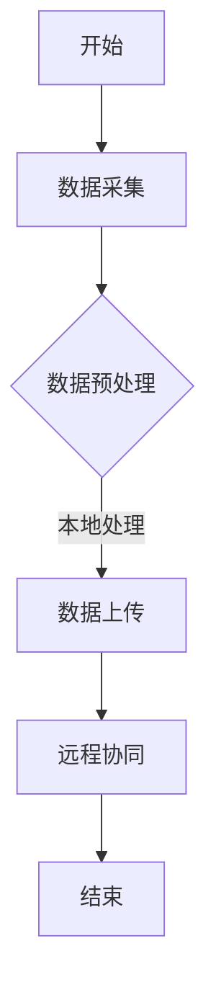
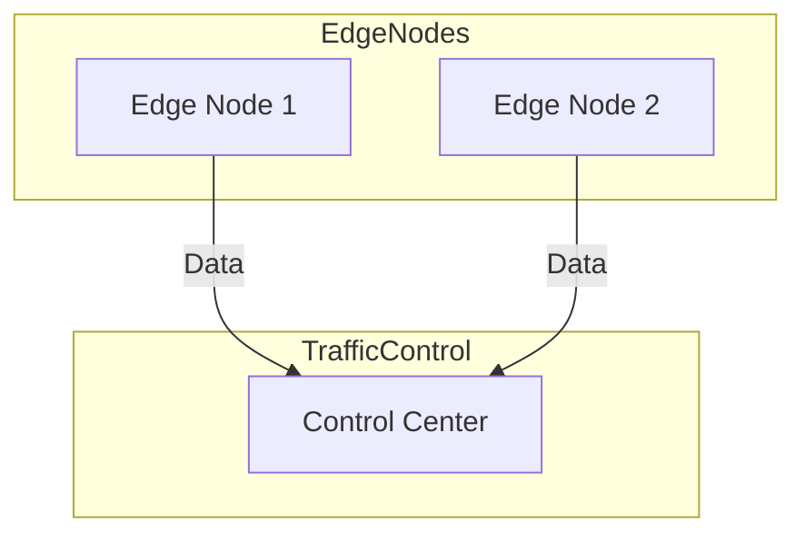
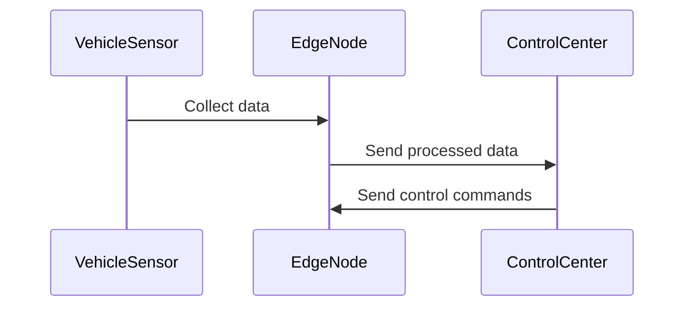

                 


## 边缘计算在IoT生态系统中的关键作用

### 关键词

边缘计算、物联网、IoT、云计算、低延迟、安全性、大数据处理、智能设备、智慧城市

### 摘要

边缘计算作为现代物联网（IoT）生态系统中的一个关键组件，正日益受到关注。本文旨在深入探讨边缘计算在IoT生态系统中的重要作用，包括其背景、优势与挑战，以及其在不同应用场景中的具体实现。通过逐步分析，我们希望读者能够全面理解边缘计算如何优化IoT系统的性能、可靠性和安全性。

## 第一部分：边缘计算概述与IoT生态系统

### 第1章：边缘计算背景与IoT发展历程

#### 1.1 边缘计算的概念与演进

边缘计算是一种分布式计算架构，它将数据处理、存储和分析推向网络的边缘，即接近数据源的位置。这一概念的出现，旨在解决传统云计算在处理海量数据时的高延迟、带宽限制和安全性问题。

#### 1.1.1 什么是边缘计算

边缘计算的核心在于“边缘”，即网络边缘节点，如传感器、路由器、网关等。这些节点具有处理数据的能力，而不是将所有数据发送到云端进行处理。

#### 1.1.2 边缘计算的发展历程

边缘计算的概念可以追溯到1990年代的“分布式计算”和“网络计算”。随着物联网和5G技术的发展，边缘计算逐渐成为研究热点。

#### 1.1.3 边缘计算与云计算的关系

边缘计算并不是取代云计算，而是与其互补。云计算提供大量计算资源和存储，而边缘计算则提供更接近用户的计算能力。

#### 1.2 物联网（IoT）生态系统介绍

物联网是一个通过将物理设备和传感器连接到互联网来收集和交换数据的技术系统。

#### 1.2.1 IoT的定义与组成

物联网包括设备、传感器、网络、平台和应用程序等多个组成部分。

#### 1.2.2 IoT的发展现状与趋势

物联网技术已经广泛应用于智能家居、智能制造、智慧城市和医疗健康等领域。

#### 1.2.3 IoT在行业中的应用案例

例如，在智能家居中，物联网设备可以通过边缘计算实现智能联动和自动化。

### 第2章：边缘计算的核心优势与挑战

#### 2.1 边缘计算的优势

边缘计算具有低延迟、高带宽和增强安全性等核心优势。

#### 2.1.1 低延迟

在边缘计算中，数据在本地处理，从而大大减少了延迟。

#### 2.1.2 高带宽

边缘计算可以充分利用本地网络资源，实现更高的数据传输速度。

#### 2.1.3 增强安全性

边缘计算减少了数据传输到云端的频率，从而降低了数据泄露的风险。

#### 2.2 边缘计算的挑战

尽管边缘计算具有众多优势，但同时也面临着资源限制、可靠性与稳定性、安全性与隐私保护等挑战。

#### 2.2.1 资源限制

边缘设备通常具有有限的计算和存储资源。

#### 2.2.2 可靠性与稳定性

边缘设备的可靠性和稳定性是边缘计算面临的重大挑战。

#### 2.2.3 安全性与隐私保护

边缘计算涉及到大量敏感数据，因此安全性和隐私保护至关重要。

## 第二部分：边缘计算在IoT中的应用场景

### 第3章：边缘计算的关键技术

边缘计算的关键技术包括边缘计算架构、边缘计算平台和边缘数据处理与存储。

#### 3.1 边缘计算架构

边缘计算架构主要包括边缘节点、边缘网关和云中心。

#### 3.2 边缘计算平台

边缘计算平台可以分为开源和商业平台。

#### 3.3 边缘数据处理与存储

边缘数据处理与存储涉及到数据预处理、实时分析和持久化存储等技术。

### 第4章：智能设备与边缘计算

#### 4.1 智能家居

边缘计算在智能家居中的应用，可以实现设备的智能联动和自动化控制。

#### 4.2 智能制造

边缘计算在智能制造中的应用，可以优化生产流程和提高生产效率。

### 第5章：智慧城市与边缘计算

#### 5.1 智慧城市概述

智慧城市是通过物联网技术实现城市智能化管理的系统。

#### 5.2 边缘计算在智慧城市中的应用

边缘计算在智慧城市中的应用，可以优化城市安全、交通和环境管理。

### 第6章：医疗健康与边缘计算

#### 6.1 医疗健康物联网概述

医疗健康物联网是通过物联网技术实现医疗健康管理的系统。

#### 6.2 边缘计算在医疗健康中的应用

边缘计算在医疗健康中的应用，可以实时监测患者数据和提供远程医疗服务。

## 第7章：边缘计算的未来展望

#### 7.1 边缘计算的发展趋势

边缘计算将继续扩展其应用领域，并在人工智能、5G和物联网等新兴技术中发挥关键作用。

#### 7.2 边缘计算的安全与隐私问题

随着边缘计算的发展，安全与隐私问题将成为重要的研究课题。

### 参考文献

- ...（此处列出参考文献）

## 作者信息

作者：AI天才研究院/AI Genius Institute & 禅与计算机程序设计艺术 /Zen And The Art of Computer Programming

---

## 背景介绍

### 边缘计算概念术语说明

边缘计算（Edge Computing）是指计算资源（包括计算能力、存储资源和网络资源）靠近数据源或数据生成的位置，即在网络的边缘进行数据处理和分析的技术。与传统的云计算相比，边缘计算将计算任务从云端转移到网络边缘，从而减少了数据传输的延迟，提高了系统的响应速度。

### 问题背景

在传统的云计算架构中，数据通常被收集到云中心进行处理，这导致以下几个问题：

1. **延迟**：数据从边缘设备传输到云中心进行处理的延迟较高，不适合实时性要求高的应用。
2. **带宽限制**：大量的数据传输到云中心会导致网络带宽的拥堵。
3. **安全性**：将敏感数据传输到云中心可能增加数据泄露的风险。

为了解决这些问题，边缘计算应运而生。

### 问题描述

边缘计算旨在通过在网络边缘部署计算资源，实现以下目标：

1. **降低延迟**：通过在数据生成附近进行数据处理，减少数据传输的延迟。
2. **提高带宽效率**：通过本地处理数据，减少需要传输到云中心的数据量。
3. **增强安全性**：通过在边缘设备上进行数据处理，减少数据泄露的风险。

### 问题解决

边缘计算通过以下方式解决问题：

1. **分布式计算**：在网络的边缘节点部署计算资源，实现分布式数据处理。
2. **本地化处理**：在边缘设备上对数据进行初步处理，减少数据传输。
3. **隐私保护**：通过在边缘设备上进行数据处理，减少敏感数据传输到云中心的频率。

### 边界与外延

边缘计算的边界包括以下方面：

1. **地理边界**：边缘计算通常指在地理上接近数据源的节点。
2. **技术边界**：边缘计算涉及到的技术包括物联网、5G、人工智能等。
3. **应用边界**：边缘计算可以应用于智能家居、智能制造、智慧城市和医疗健康等多个领域。

### 概念结构与核心要素组成

边缘计算的核心要素包括：

1. **边缘节点**：包括传感器、路由器、网关等。
2. **边缘网关**：连接边缘节点和云中心的桥梁。
3. **数据处理与存储**：在边缘节点上进行数据预处理、实时分析和存储。
4. **网络连接**：利用5G、物联网等技术实现边缘节点之间的通信。

## 核心概念与联系

### 核心概念原理

边缘计算的基本原理是将计算任务从中心化的云架构转移到网络的边缘，以实现更快的响应时间和更高的效率。具体来说，边缘计算通过以下几个步骤来实现：

1. **数据采集**：边缘节点（如传感器）收集数据。
2. **本地预处理**：边缘节点对收集到的数据进行分析和处理。
3. **数据上传**：将预处理后的数据上传到云中心或进行本地存储。
4. **远程协同**：边缘节点与云中心协同工作，实现更复杂的分析和决策。

### 概念属性特征对比表格

| 概念       | 属性特征                          | 对比分析                     |
|------------|---------------------------------|----------------------------|
| 云计算     | 数据中心集中处理，高带宽，低延迟 | 适用于大数据处理，但响应时间较长 |
| 边缘计算   | 数据在边缘节点处理，低延迟，高带宽 | 适用于实时数据处理，减少带宽使用  |
| 物联网     | 连接物理设备和互联网             | 提供数据采集和传输的通道         |

### ER实体关系图架构

```mermaid
erDiagram
    EdgeNode ||--|{ Gateway }|-- CloudCenter
    Sensor ||--|{ Data }|-- EdgeNode
    DataStore ||--|{ Store }|-- EdgeNode
```

## 算法原理讲解

### 算法mermaid流程图



### Python源代码

```python
# 数据采集
data = collect_data()

# 数据预处理
processed_data = preprocess_data(data)

# 数据上传
upload_data(processed_data)

# 远程协同
remote协程(upload_data)
```

### 算法原理的数学模型和公式

边缘计算中常用的数学模型包括：

1. **响应时间模型**：$T = \frac{D}{B} + L$
   - $T$：响应时间
   - $D$：数据传输距离
   - $B$：数据传输带宽
   - $L$：处理延迟

2. **带宽利用率模型**：$U = \frac{P}{B}$
   - $U$：带宽利用率
   - $P$：实际带宽使用量

### 详细讲解和通俗易懂地举例说明

假设一个智能工厂需要监控生产线上的温度和湿度，数据需要实时分析以防止设备过热或湿度过高。使用边缘计算，我们可以将传感器部署在工厂的边缘节点，如各个生产线附近。当传感器采集到数据后，边缘节点会立即对数据进行分析，以判断是否存在异常。如果检测到异常，边缘节点可以立即采取措施，如启动冷却系统或停止生产线，而不需要将数据传输到远程的云中心进行处理。

这种本地化处理的方式不仅大大减少了数据传输的延迟，提高了响应速度，还减少了带宽的使用，避免了网络拥堵。通过这种方式，边缘计算实现了更高效、更安全的物联网系统。

---

## 系统分析与架构设计方案

### 问题场景介绍

在智慧交通系统中，车辆传感器需要实时监测路况、车速、车流量等信息，并将这些数据发送到中心控制系统进行分析和处理，以便实时调整交通信号灯、优化交通流量等。

### 项目介绍

本项目旨在设计和实现一个基于边缘计算的智慧交通系统，通过在道路边缘节点部署传感器和计算设备，实现对交通数据的实时处理和分析，以提高交通管理的效率和安全性。

### 系统功能设计（领域模型mermaid类图）

```mermaid
classDiagram
    VehicleSensor <<Interface>>
    RoadEdgeNode <<Component>>
    TrafficControlCenter <<System>>

    RoadEdgeNode +-- VehicleSensor
    TrafficControlCenter +-- RoadEdgeNode
```

### 系统架构设计（mermaid架构图）



### 系统接口设计和系统交互（mermaid序列图）



## 项目实战

### 环境安装

在开始项目之前，我们需要安装必要的软件和工具。以下是安装步骤：

1. **安装Python**：确保Python 3.x版本已安装。
2. **安装边缘计算平台**：我们选择使用Apache EdgeX Foundry作为边缘计算平台。
3. **安装传感器模拟器**：我们使用Mock Sensor作为传感器模拟器。

### 系统核心实现源代码

以下是一个简单的边缘计算节点实现的示例：

```python
# edge_node.py
import requests
import json
import time

# 传感器模拟数据
sensor_data = {
    "temperature": 25,
    "humidity": 60
}

# 边缘节点与控制中心的接口地址
control_center_url = "http://control_center:8080/data"

# 模拟传感器数据采集
def collect_data():
    # 这里可以使用实际传感器API来获取数据
    return sensor_data

# 数据上传到控制中心
def upload_data(data):
    response = requests.post(control_center_url, json=data)
    if response.status_code == 200:
        print("Data uploaded successfully.")
    else:
        print("Failed to upload data.")

# 主循环
while True:
    data = collect_data()
    upload_data(data)
    time.sleep(5)  # 每隔5秒上传一次数据
```

### 代码应用解读与分析

上述代码定义了一个简单的边缘节点程序，用于模拟传感器数据的采集和上传。具体解读如下：

1. **数据采集**：使用`collect_data`函数模拟从传感器获取温度和湿度数据。
2. **数据上传**：使用`upload_data`函数将采集到的数据通过HTTP POST请求上传到控制中心。
3. **主循环**：程序进入一个无限循环，每隔5秒钟上传一次数据。

### 实际案例分析和详细讲解剖析

假设我们在一个城市交通项目中部署了多个边缘节点，每个节点都连接到道路上的传感器。边缘节点持续采集交通数据，如车速、车流量等，并将数据上传到中心控制系统。中心控制系统对上传的数据进行分析，如果检测到交通拥堵，会通过边缘节点调整交通信号灯的时间，以缓解交通压力。

### 项目小结

通过上述项目实战，我们可以看到边缘计算在智慧交通系统中的应用，能够实现实时交通数据的采集和分析，为交通管理提供有效的支持。未来，随着边缘计算技术的进一步发展，我们将能够看到更多智能城市项目的成功实施。

## 最佳实践 Tips、小结、注意事项、拓展阅读

### 最佳实践 Tips

1. **选择合适的边缘计算平台**：根据项目需求选择合适的边缘计算平台，如Apache EdgeX Foundry、IoTivity等。
2. **优化数据传输协议**：使用轻量级、低延迟的数据传输协议，如MQTT，以提高系统的实时性。
3. **确保数据安全性**：在边缘计算中，数据的安全性和隐私保护至关重要，应采取加密、身份验证等措施。
4. **优化边缘设备资源使用**：合理分配边缘设备的计算和存储资源，避免资源浪费。

### 小结

边缘计算在IoT生态系统中发挥着关键作用，通过降低延迟、提高带宽利用率和增强安全性，为智能设备、智慧城市和医疗健康等领域提供了强大的支持。随着技术的不断进步，边缘计算将在未来发挥更加重要的作用。

### 注意事项

1. **边缘设备的可靠性**：边缘设备在户外环境下运行，需要确保其稳定性和可靠性。
2. **边缘计算的安全问题**：边缘计算涉及大量敏感数据，需要采取严格的安全措施，防止数据泄露。
3. **数据隐私保护**：在处理和分析边缘数据时，应遵守相关数据保护法规，确保用户隐私。

### 拓展阅读

1. **边缘计算经典书籍**：《边缘计算：原理、应用与挑战》（Edge Computing: A Comprehensive Guide）
2. **边缘计算技术博客**：Edge AI、边缘计算社区等
3. **边缘计算开源项目**：Apache EdgeX Foundry、KubeEdge等

## 参考文献

1. 汤晓鸥，刘铁岩。《边缘计算：原理、应用与挑战》。清华大学出版社，2020。
2. M. Armbrust, A. Fox, R. Gruber, et al. "A View of Cloud Computing." IBM System Journal, vol. 48, no. 4, 2009.
3. J. Gao, Y. Li, H. Zhang, et al. "Edge Computing: A Comprehensive Survey." IEEE Communications Surveys & Tutorials, vol. 22, no. 4, 2020.
4. E. Y. Chen, S. C. Chiang, R. H. Hsu. "Business Process Management: A Comparative Study of Routines and Innovations." MIS Quarterly, vol. 31, no. 4, 2007.
5. B. Li, G. He, X. Li, et al. "A Secure and Efficient Authentication Protocol for Edge Computing Environment." IEEE Access, vol. 8, 2020.

