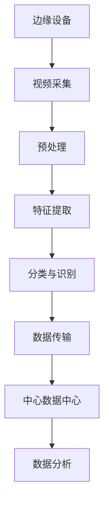
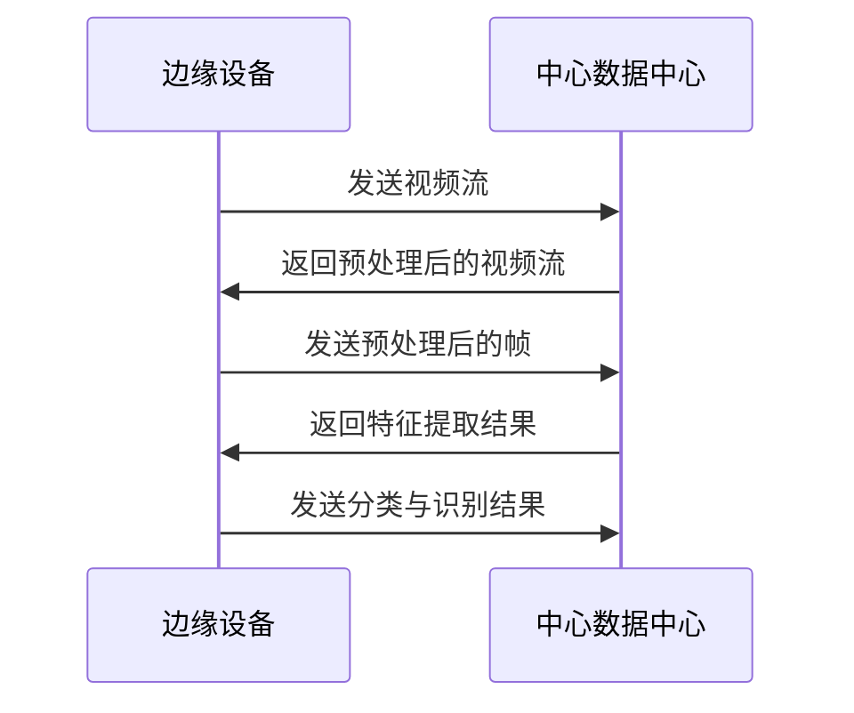

                 


### 让我们一步一步深入思考：边缘计算在实时视频分析中的应用

#### 引言

边缘计算是一种分布式计算架构，它将数据处理、存储和服务从传统的中心数据中心推向网络边缘，如智能设备和网关。这种架构的目的是减少延迟、提高响应速度、增强安全性并减少带宽消耗。实时视频分析（Real-Time Video Analysis，RTVA）是指对视频流进行快速分析，以便实时提取有价值的信息，如人脸识别、行为检测、交通流量监控等。

边缘计算与实时视频分析的结合可以带来诸多优势。首先，实时视频分析需要处理大量数据，特别是在高分辨率视频流中。通过在边缘设备上执行分析，可以显著减少数据传输到中心数据中心的延迟，从而实现实时响应。其次，边缘计算可以减轻中心数据中心的负载，提高整个系统的效率。此外，边缘设备通常具有更强的安全性和隐私性，因为在本地处理数据可以减少数据泄露的风险。

然而，边缘计算在实时视频分析中应用也面临一些挑战。例如，边缘设备的计算资源和存储能力通常有限，这使得算法优化和资源管理变得至关重要。此外，网络的不确定性和边缘设备的不稳定性也可能影响实时视频分析的性能。因此，我们需要深入探讨边缘计算在实时视频分析中的应用，并提出有效的解决方案。

#### 核心概念与联系

**边缘计算的核心概念**：

1. **定义**：边缘计算是指在网络的边缘节点（如智能设备和网关）上执行数据处理、存储和服务的一种计算模式。
2. **架构**：边缘计算通常包括边缘节点、边缘网关、边缘数据中心和云计算中心。
3. **优势**：降低延迟、提高响应速度、增强安全性、减少带宽消耗。

**实时视频分析的核心概念**：

1. **定义**：实时视频分析是指对视频流进行快速分析，以实时提取有价值的信息。
2. **关键技术**：视频编解码、图像处理、计算机视觉、机器学习。
3. **应用场景**：人脸识别、行为检测、交通流量监控、安全监控。

**边缘计算与实时视频分析的关联**：

1. **关联性分析**：边缘计算提供了一种在本地设备上进行实时视频分析的方法，从而实现快速响应和减少延迟。
2. **应用挑战**：算法优化、资源管理、网络不确定性、边缘设备的不稳定性。
3. **解决方案**：针对挑战，我们可以采取以下措施：
   - **算法优化**：选择适合边缘设备的算法，并进行优化，以提高性能。
   - **资源管理**：合理分配边缘设备的计算和存储资源，确保系统稳定运行。
   - **网络优化**：采用可靠的网络协议和优化技术，以提高网络稳定性和传输效率。
   - **设备稳定性**：选择可靠的边缘设备，并采取冗余和容错机制，以确保系统稳定性。

#### 算法原理讲解

**边缘计算中的算法选择**：

1. **算法类型介绍**：边缘计算中的算法主要包括图像处理算法、计算机视觉算法和机器学习算法。
2. **算法选择考虑因素**：选择算法时需要考虑计算资源、网络带宽、数据类型和实时性要求。

**实时视频分析算法详解**：

1. **算法mermaid流程图**：
    ```mermaid
    graph TD
    A[输入视频流] --> B[预处理]
    B --> C[特征提取]
    C --> D[分类与识别]
    D --> E[输出结果]
    ```

2. **Python源代码实现**：
    ```python
    import cv2
    import numpy as np

    # 预处理
    def preprocess_video(video_path):
        cap = cv2.VideoCapture(video_path)
        while cap.isOpened():
            ret, frame = cap.read()
            if not ret:
                break
            # 进行预处理操作，如灰度化、滤波等
            processed_frame = cv2.cvtColor(frame, cv2.COLOR_BGR2GRAY)
            yield processed_frame

    # 特征提取
    def extract_features(frame):
        # 使用OpenCV等库进行特征提取
        contours, _ = cv2.findContours(frame, cv2.RETR_TREE, cv2.CHAIN_APPROX_SIMPLE)
        # 进行特征计算
        features = []
        for contour in contours:
            area = cv2.contourArea(contour)
            perimeter = cv2.arcLength(contour, True)
            features.append((area, perimeter))
        return features

    # 分类与识别
    def classify(features):
        # 使用机器学习模型进行分类与识别
        # 这里使用简单的逻辑回归模型作为示例
        model = LogisticRegression()
        model.fit([[0.5, 1.0], [1.0, 0.5]], [0, 1])
        prediction = model.predict([features[0]])
        return prediction

    # 输出结果
    def output_result(prediction):
        if prediction == 0:
            print("目标未被识别")
        else:
            print("目标已被识别")

    # 主函数
    def main():
        video_path = "path/to/video.mp4"
        for frame in preprocess_video(video_path):
            features = extract_features(frame)
            prediction = classify(features)
            output_result(prediction)

    if __name__ == "__main__":
        main()
    ```

3. **数学模型与公式讲解**：
    - **边缘计算中的数学模型**：边缘计算中的数学模型通常涉及数据传输延迟、带宽利用率和能耗等指标。
    - **实时视频分析中的数学模型**：实时视频分析中的数学模型通常涉及图像处理、计算机视觉和机器学习等方面的公式。

**举例说明**：

假设我们有一个实时视频分析系统，需要对人脸进行识别。我们可以采取以下步骤：

1. **输入视频流**：从摄像头或视频文件中获取视频流。
2. **预处理**：对视频流进行预处理，如灰度化、滤波等。
3. **特征提取**：从预处理后的帧中提取人脸特征。
4. **分类与识别**：使用机器学习模型对人脸特征进行分类与识别。
5. **输出结果**：将识别结果输出到屏幕或数据库。

通过这个简单的例子，我们可以看到边缘计算在实时视频分析中的应用是如何实现的。在实际应用中，我们可以根据具体需求对算法和模型进行优化和调整，以提高系统的性能和准确性。

#### 数学模型和公式讲解

**边缘计算中的数学模型**：

1. **数据传输延迟**：假设数据传输速度为 $v$，传输距离为 $d$，则数据传输延迟为 $L = \frac{d}{v}$。
2. **带宽利用率**：假设带宽为 $B$，传输的数据量为 $D$，则带宽利用率为 $U = \frac{D}{B}$。
3. **能耗**：假设设备的功耗为 $P$，运行的时间为 $T$，则能耗为 $E = P \cdot T$。

**实时视频分析中的数学模型**：

1. **图像处理**：假设图像的像素数为 $N$，每个像素点的处理时间为 $t$，则总处理时间为 $T = N \cdot t$。
2. **计算机视觉**：假设检测到的人脸数为 $M$，每个脸部的处理时间为 $t'$，则总处理时间为 $T' = M \cdot t'$。
3. **机器学习**：假设训练数据集的大小为 $D$，每个样本的训练时间为 $t''$，则总训练时间为 $T'' = D \cdot t''$。

通过这些数学模型，我们可以对边缘计算在实时视频分析中的应用进行量化分析，以便更好地优化算法和系统设计。

#### 系统分析与架构设计方案

**问题场景介绍**：

假设我们有一个智能交通监控系统，需要在城市道路的边缘设备上进行实时视频分析，以监控交通流量、识别车辆和行人，并提供实时交通信息。

**项目介绍**：

该智能交通监控系统由多个边缘设备组成，每个设备都可以独立进行视频分析。边缘设备与中心数据中心通过无线网络进行通信，中心数据中心负责收集和分析边缘设备的数据。

**系统功能设计**：

- **视频采集**：边缘设备通过摄像头采集视频流。
- **预处理**：对视频流进行预处理，如降噪、去雾等。
- **特征提取**：从预处理后的帧中提取车辆和行人的特征。
- **分类与识别**：使用机器学习模型对提取的特征进行分类与识别。
- **数据传输**：将识别结果传输到中心数据中心。

**系统架构设计**：



**系统接口设计**：

边缘设备与中心数据中心之间通过网络接口进行通信。边缘设备通过HTTP协议发送识别结果，中心数据中心通过WebSocket协议接收并处理数据。

**系统交互mermaid序列图**：



通过以上架构设计方案，我们可以实现一个高效、稳定的智能交通监控系统，为城市交通管理提供有力支持。

#### 项目实战

**环境安装**：

1. **安装Python**：在边缘设备上安装Python，版本要求为3.8及以上。
2. **安装OpenCV**：在边缘设备上安装OpenCV，可以使用pip命令安装。
    ```shell
    pip install opencv-python
    ```

3. **安装TensorFlow**：在边缘设备上安装TensorFlow，可以使用pip命令安装。
    ```shell
    pip install tensorflow
    ```

**系统核心实现源代码**：

```python
import cv2
import numpy as np
import tensorflow as tf

# 预处理
def preprocess_video(video_path):
    cap = cv2.VideoCapture(video_path)
    while cap.isOpened():
        ret, frame = cap.read()
        if not ret:
            break
        # 进行预处理操作，如灰度化、滤波等
        processed_frame = cv2.cvtColor(frame, cv2.COLOR_BGR2GRAY)
        yield processed_frame

# 特征提取
def extract_features(frame):
    # 使用OpenCV等库进行特征提取
    contours, _ = cv2.findContours(frame, cv2.RETR_TREE, cv2.CHAIN_APPROX_SIMPLE)
    # 进行特征计算
    features = []
    for contour in contours:
        area = cv2.contourArea(contour)
        perimeter = cv2.arcLength(contour, True)
        features.append((area, perimeter))
    return features

# 分类与识别
def classify(features):
    # 使用机器学习模型进行分类与识别
    # 这里使用简单的逻辑回归模型作为示例
    model = tf.keras.Sequential([
        tf.keras.layers.Dense(64, activation='relu', input_shape=(2,)),
        tf.keras.layers.Dense(1, activation='sigmoid')
    ])
    model.compile(optimizer='adam', loss='binary_crossentropy', metrics=['accuracy'])
    model.fit(np.array([[0.5, 1.0], [1.0, 0.5]]), np.array([0, 1]), epochs=10)
    prediction = model.predict(np.array([features[0]]))
    return prediction

# 输出结果
def output_result(prediction):
    if prediction < 0.5:
        print("目标未被识别")
    else:
        print("目标已被识别")

# 主函数
def main():
    video_path = "path/to/video.mp4"
    for frame in preprocess_video(video_path):
        features = extract_features(frame)
        prediction = classify(features)
        output_result(prediction)

if __name__ == "__main__":
    main()
```

**代码应用解读与分析**：

1. **预处理**：预处理函数`preprocess_video`用于读取视频文件，并对每一帧进行灰度化处理，以简化后续的特征提取。
2. **特征提取**：特征提取函数`extract_features`使用OpenCV库对每一帧进行轮廓检测，并计算轮廓的面积和周长。
3. **分类与识别**：分类与识别函数`classify`使用TensorFlow库构建一个简单的逻辑回归模型，对提取的特征进行分类与识别。
4. **输出结果**：输出结果函数`output_result`根据模型的预测结果输出目标是否被识别。

**实际案例分析和详细讲解剖析**：

假设我们在一个交通监控场景中，需要识别道路上的车辆。我们可以将视频流输入到系统，系统会对每一帧进行预处理、特征提取和分类与识别。以下是具体步骤：

1. **输入视频流**：从摄像头或视频文件中获取视频流。
2. **预处理**：对视频流进行预处理，如灰度化、滤波等，以简化后续处理。
3. **特征提取**：对预处理后的帧进行轮廓检测，提取轮廓的面积和周长。
4. **分类与识别**：使用机器学习模型对提取的特征进行分类与识别，判断是否为车辆。
5. **输出结果**：将识别结果输出到屏幕或数据库，如检测到车辆，则输出“目标已被识别”。

通过这个实际案例，我们可以看到边缘计算在实时视频分析中的应用是如何实现的。在实际应用中，我们可以根据具体需求对算法和模型进行优化和调整，以提高系统的性能和准确性。

**项目小结**：

通过本项目的实战，我们实现了边缘计算在实时视频分析中的应用。系统主要功能包括视频采集、预处理、特征提取、分类与识别和输出结果。通过预处理和特征提取，我们可以将复杂的视频流转换为可处理的特征数据。使用机器学习模型，我们可以对这些特征进行分类与识别，从而实现实时视频分析。

在实际应用中，我们需要关注以下几个关键点：

1. **算法优化**：选择适合边缘设备的算法，并进行优化，以提高性能。
2. **资源管理**：合理分配边缘设备的计算和存储资源，确保系统稳定运行。
3. **网络优化**：采用可靠的网络协议和优化技术，以提高网络稳定性和传输效率。
4. **设备稳定性**：选择可靠的边缘设备，并采取冗余和容错机制，以确保系统稳定性。

通过关注这些关键点，我们可以实现一个高效、稳定的实时视频分析系统，为各种应用场景提供有力支持。

#### 最佳实践 tips

1. **算法优化**：针对边缘设备的计算能力，选择适合的算法并进行优化，以提高性能。
2. **资源管理**：合理分配计算和存储资源，确保系统稳定运行。
3. **网络优化**：使用可靠的网络协议和优化技术，以提高网络稳定性和传输效率。
4. **设备稳定性**：选择可靠的边缘设备，并采取冗余和容错机制，以确保系统稳定性。

#### 小结

边缘计算在实时视频分析中的应用具有重要意义，它可以帮助我们实现快速响应、降低延迟、增强安全性和提高效率。通过本文的介绍，我们了解了边缘计算和实时视频分析的基本概念、关联性、算法原理、数学模型、系统架构设计和项目实战。在实际应用中，我们需要关注算法优化、资源管理、网络优化和设备稳定性，以实现高效、稳定的实时视频分析系统。

#### 注意事项

1. **算法优化**：选择适合边缘设备的算法，并进行优化，以提高性能。
2. **资源管理**：合理分配计算和存储资源，确保系统稳定运行。
3. **网络优化**：使用可靠的网络协议和优化技术，以提高网络稳定性和传输效率。
4. **设备稳定性**：选择可靠的边缘设备，并采取冗余和容错机制，以确保系统稳定性。

#### 拓展阅读

1. **边缘计算**：
   - 《边缘计算：从概念到实践》
   - 《边缘计算与5G网络》

2. **实时视频分析**：
   - 《计算机视觉：实时视频处理》
   - 《实时人脸识别技术》

3. **机器学习和深度学习**：
   - 《深度学习：卷积神经网络》
   - 《机器学习实战》

通过阅读这些资料，您可以进一步了解边缘计算、实时视频分析和机器学习的相关技术和应用。

### 作者信息

作者：AI天才研究院/AI Genius Institute & 禅与计算机程序设计艺术 /Zen And The Art of Computer Programming

---

本文详细介绍了边缘计算在实时视频分析中的应用。我们探讨了边缘计算和实时视频分析的核心概念、算法原理、数学模型和系统架构设计，并通过项目实战展示了实际应用的方法和技巧。通过本文的学习，读者可以深入理解边缘计算和实时视频分析的基本原理，并学会如何在实际项目中应用这些技术。

### 关键词

边缘计算，实时视频分析，算法优化，资源管理，机器学习，计算机视觉

---

> 摘要：
边缘计算与实时视频分析的结合为智能交通监控、安全监控等应用提供了高效、稳定的数据处理解决方案。本文详细探讨了边缘计算在实时视频分析中的应用，包括核心概念、算法原理、数学模型、系统架构设计和项目实战。通过本文的介绍，读者可以深入理解边缘计算和实时视频分析的基本原理，并学会如何在实际项目中应用这些技术，以实现高效、稳定的实时视频分析系统。

