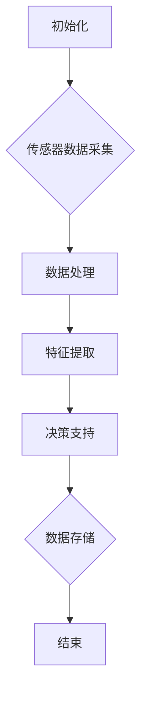
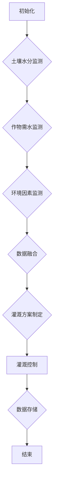
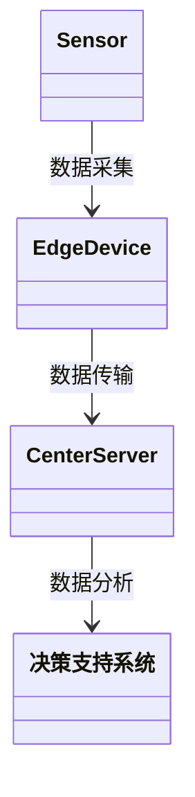
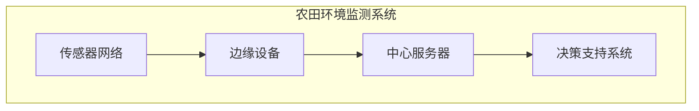
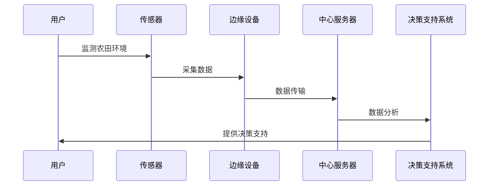

                 

# 边缘计算在智慧农业中的应用：实现精准农业

## 关键词
边缘计算，智慧农业，精准农业，土壤监测，气象监测，病虫害监测，精准灌溉，精准施肥，农业大数据

## 摘要
本文旨在探讨边缘计算在智慧农业中的应用，实现精准农业的目标。通过分析边缘计算在土壤监测、气象监测、病虫害监测等领域的应用，结合实际案例，详细阐述了边缘计算在智慧农业中的技术实现和系统架构，为农业领域的智能化转型提供了有益的参考。

## 目录大纲设计过程

### 1. 理解书籍主题与内容

《边缘计算在智慧农业中的应用：实现精准农业》这本书的主题是边缘计算在智慧农业中的应用。智慧农业是一个利用信息技术、物联网、大数据等手段提高农业生产效率和品质的领域，而边缘计算作为一种分布式计算架构，能够将计算、存储和网络功能部署在靠近数据源的设备上，从而降低延迟、节省带宽，提高系统的实时性和可靠性。因此，本书的目标是介绍如何通过边缘计算技术，实现农业生产的精准化，提高农业生产的效率和质量。

### 2. 确定书籍结构

根据书籍的主题，我们可以将书籍的结构分为以下几个部分：

- **引言**：介绍边缘计算和智慧农业的背景，阐述本书的目的和结构。
- **基础理论**：介绍边缘计算和智慧农业的基本概念、原理和相关技术。
- **应用实例**：展示边缘计算在智慧农业中的实际应用案例。
- **技术实现**：详细讲解边缘计算在智慧农业中的技术实现和系统架构。
- **实践指南**：提供实施边缘计算智慧农业的实际步骤和建议。
- **总结与展望**：总结本书的主要内容，展望未来发展趋势。

### 3. 设计目录结构

根据书籍结构，我们可以设计出详细的目录结构。目录结构应遵循以下原则：

- **简洁性**：避免过多的层级和复杂的结构。
- **逻辑性**：确保各章节之间有清晰的逻辑联系。
- **完整性**：覆盖书籍的主要内容，不遗漏关键部分。

### 4. 编写目录大纲

按照设计的目录结构，编写每个章节的简要概述。每个章节的概述应包括：

- **标题**：简洁明了地概括章节内容。
- **小节**：列出章节下的主要小节，每个小节也应具有明确的主题。

### 5. 检查与优化

完成初步的目录大纲后，我们需要检查其逻辑性和完整性，并进行必要的优化。确保每个章节都有明确的主题，并且内容之间有良好的衔接。

### 《边缘计算在智慧农业中的应用：实现精准农业》目录大纲

## 第一部分：边缘计算基础

### 第1章：边缘计算概述

#### 1.1 边缘计算的背景与发展

#### 1.2 边缘计算的定义与特征

#### 1.3 边缘计算的关键技术

### 第2章：智慧农业的基本概念

#### 2.1 智慧农业的定义与目标

#### 2.2 智慧农业的关键技术

#### 2.3 智慧农业的发展现状与挑战

## 第二部分：边缘计算在智慧农业中的应用

### 第3章：边缘计算在土壤监测中的应用

#### 3.1 土壤监测的重要性

#### 3.2 边缘计算在土壤监测中的应用

#### 3.3 边缘计算土壤监测系统的设计与实现

### 第4章：边缘计算在气象监测中的应用

#### 4.1 气象监测对农业的重要性

#### 4.2 边缘计算在气象监测中的应用

#### 4.3 边缘计算气象监测系统的设计与实现

### 第5章：边缘计算在病虫害监测中的应用

#### 5.1 病虫害监测的重要性

#### 5.2 边缘计算在病虫害监测中的应用

#### 5.3 边缘计算病虫害监测系统的设计与实现

## 第三部分：实现精准农业的技术与实践

### 第6章：边缘计算在精准灌溉中的应用

#### 6.1 精准灌溉的基本原理

#### 6.2 边缘计算在精准灌溉中的应用

#### 6.3 精准灌溉系统的设计与实现

### 第7章：边缘计算在精准施肥中的应用

#### 7.1 精准施肥的基本原理

#### 7.2 边缘计算在精准施肥中的应用

#### 7.3 精准施肥系统的设计与实现

### 第8章：边缘计算在农业大数据中的应用

#### 8.1 农业大数据的基本概念

#### 8.2 边缘计算在农业大数据中的应用

#### 8.3 农业大数据边缘计算系统的设计与实现

## 第9章：总结与展望

#### 9.1 边缘计算在智慧农业中的总结

#### 9.2 未来发展趋势与挑战

## 文章正文

### 第一部分：边缘计算基础

### 第1章：边缘计算概述

#### 1.1 边缘计算的背景与发展

边缘计算（Edge Computing）是近年来信息技术领域的一个重要研究方向，其概念最早可以追溯到20世纪80年代，但直到互联网和物联网的快速发展，边缘计算才逐渐成为研究热点。边缘计算旨在通过在数据产生的地方处理数据，从而减少对中心化服务器和网络资源的依赖，提高系统的响应速度和可靠性。

随着大数据、物联网和人工智能等技术的发展，边缘计算在各个领域得到了广泛的应用。特别是在智慧农业领域，边缘计算能够实现对农田环境、作物生长状况等实时数据的快速处理和分析，从而实现精准农业的目标。

#### 1.2 边缘计算的定义与特征

边缘计算是一种分布式计算架构，它将计算、存储和网络功能部署在靠近数据源的设备上，如传感器、路由器、智能设备等。边缘计算的特点包括：

1. **去中心化**：边缘计算通过分布式设备进行数据处理，降低了中心化服务器的负担，提高了系统的可靠性。
2. **低延迟**：由于数据在靠近数据源的地方进行处理，因此传输延迟较低，适用于实时性要求较高的应用场景。
3. **高效性**：边缘计算能够利用本地资源进行数据处理，减少了对中心化服务器和网络资源的依赖，提高了数据处理效率。
4. **灵活性**：边缘计算可以根据应用需求灵活地调整计算资源，支持多样化的应用场景。

#### 1.3 边缘计算的关键技术

边缘计算的关键技术包括：

1. **物联网技术**：物联网技术是边缘计算的基础，它通过传感器、路由器等设备，实现数据的采集和传输。
2. **云计算技术**：云计算技术为边缘计算提供了强大的计算能力和存储资源，支持边缘设备的协同工作。
3. **大数据技术**：大数据技术用于对边缘设备采集的数据进行处理和分析，为农业生产提供决策支持。
4. **人工智能技术**：人工智能技术用于对农业数据进行智能分析和预测，帮助农民实现精准农业。

### 第2章：智慧农业的基本概念

#### 2.1 智慧农业的定义与目标

智慧农业是指利用信息技术、物联网、大数据、人工智能等先进技术，实现农业生产智能化、精细化和可持续化的过程。智慧农业的目标包括：

1. **提高农业生产效率**：通过自动化、智能化的设备和技术，降低劳动力成本，提高农业生产效率。
2. **提高农产品品质**：通过实时监测和精准管理，提高农产品的品质和产量。
3. **实现农业可持续发展**：通过合理利用资源，减少污染，实现农业的可持续发展。

#### 2.2 智慧农业的关键技术

智慧农业的关键技术包括：

1. **传感器技术**：用于采集土壤、气象、作物生长等环境数据，为农业生产提供实时信息。
2. **物联网技术**：用于实现设备互联和数据传输，为农业生产提供数据支持。
3. **大数据技术**：用于对采集到的数据进行分析和处理，为农业生产提供决策支持。
4. **人工智能技术**：用于对农业数据进行智能分析和预测，帮助农民实现精准农业。

#### 2.3 智慧农业的发展现状与挑战

智慧农业在我国已经取得了显著的进展，但在发展过程中仍面临着一些挑战：

1. **技术成熟度**：虽然智慧农业技术日益成熟，但某些关键技术仍需进一步研发和完善。
2. **数据安全**：农业数据的隐私保护和数据安全是智慧农业发展的关键问题。
3. **成本问题**：智慧农业设备的投入成本较高，如何降低成本是推广智慧农业的关键。

### 第二部分：边缘计算在智慧农业中的应用

#### 第3章：边缘计算在土壤监测中的应用

#### 3.1 土壤监测的重要性

土壤是农业生产的基础，土壤质量直接影响着农作物的生长和产量。土壤监测能够实时了解土壤的养分状况、水分含量、温度、pH值等指标，为农业生产提供科学依据。

#### 3.2 边缘计算在土壤监测中的应用

边缘计算在土壤监测中的应用主要体现在以下几个方面：

1. **实时数据采集**：通过安装在农田中的传感器，实时采集土壤的各项指标数据。
2. **本地数据处理**：边缘设备对采集到的数据进行分析和处理，快速生成土壤监测报告。
3. **远程数据传输**：将处理后的数据通过无线网络传输到中心服务器，供农业专家进行分析和决策。

#### 3.3 边缘计算土壤监测系统的设计与实现

边缘计算土壤监测系统通常包括以下几个部分：

1. **传感器网络**：用于采集土壤数据。
2. **边缘设备**：用于对传感器数据进行分析和处理。
3. **中心服务器**：用于存储和管理土壤监测数据，并提供数据分析和决策支持。

#### 第4章：边缘计算在气象监测中的应用

#### 4.1 气象监测对农业的重要性

气象监测对农业生产至关重要，准确的气象数据能够帮助农民合理安排农事活动，避免气象灾害对农业生产造成的影响。

#### 4.2 边缘计算在气象监测中的应用

边缘计算在气象监测中的应用主要体现在以下几个方面：

1. **实时数据采集**：通过安装在农田中的气象传感器，实时采集气象数据。
2. **本地数据处理**：边缘设备对气象数据进行分析和处理，快速生成气象监测报告。
3. **远程数据传输**：将处理后的数据通过无线网络传输到中心服务器，供农业专家进行分析和决策。

#### 4.3 边缘计算气象监测系统的设计与实现

边缘计算气象监测系统通常包括以下几个部分：

1. **气象传感器网络**：用于采集气象数据。
2. **边缘设备**：用于对气象数据进行分析和处理。
3. **中心服务器**：用于存储和管理气象监测数据，并提供数据分析和决策支持。

#### 第5章：边缘计算在病虫害监测中的应用

#### 5.1 病虫害监测的重要性

病虫害是农业生产的主要威胁之一，有效的病虫害监测和防治能够减少农作物损失，提高农产品品质。

#### 5.2 边缘计算在病虫害监测中的应用

边缘计算在病虫害监测中的应用主要体现在以下几个方面：

1. **实时数据采集**：通过安装在农田中的病虫害传感器，实时采集病虫害数据。
2. **本地数据处理**：边缘设备对病虫害数据进行分析和处理，快速生成病虫害监测报告。
3. **远程数据传输**：将处理后的数据通过无线网络传输到中心服务器，供农业专家进行分析和决策。

#### 5.3 边缘计算病虫害监测系统的设计与实现

边缘计算病虫害监测系统通常包括以下几个部分：

1. **病虫害传感器网络**：用于采集病虫害数据。
2. **边缘设备**：用于对病虫害数据进行分析和处理。
3. **中心服务器**：用于存储和管理病虫害监测数据，并提供数据分析和决策支持。

### 第三部分：实现精准农业的技术与实践

#### 第6章：边缘计算在精准灌溉中的应用

#### 6.1 精准灌溉的基本原理

精准灌溉是通过实时监测农田土壤水分状况，根据作物的需水规律进行智能化灌溉，从而实现水资源的合理利用。

#### 6.2 边缘计算在精准灌溉中的应用

边缘计算在精准灌溉中的应用主要包括以下几个方面：

1. **土壤水分监测**：通过安装在农田中的传感器，实时监测土壤水分含量。
2. **数据分析与决策**：边缘设备根据土壤水分监测数据，结合作物的需水规律，生成灌溉方案。
3. **灌溉控制**：通过无线网络将灌溉方案传输到灌溉系统，实现智能灌溉。

#### 6.3 精准灌溉系统的设计与实现

精准灌溉系统通常包括以下几个部分：

1. **土壤水分传感器网络**：用于采集土壤水分数据。
2. **边缘设备**：用于对土壤水分数据进行分析和处理，生成灌溉方案。
3. **灌溉系统**：用于实施灌溉操作。
4. **中心服务器**：用于存储和管理灌溉数据，并提供数据分析和决策支持。

#### 第7章：边缘计算在精准施肥中的应用

#### 7.1 精准施肥的基本原理

精准施肥是通过实时监测农田土壤养分状况，根据作物的养分需求进行智能化施肥，从而实现养分的合理利用。

#### 7.2 边缘计算在精准施肥中的应用

边缘计算在精准施肥中的应用主要包括以下几个方面：

1. **土壤养分监测**：通过安装在农田中的传感器，实时监测土壤养分含量。
2. **数据分析与决策**：边缘设备根据土壤养分监测数据，结合作物的养分需求，生成施肥方案。
3. **施肥控制**：通过无线网络将施肥方案传输到施肥系统，实现智能施肥。

#### 7.3 精准施肥系统的设计与实现

精准施肥系统通常包括以下几个部分：

1. **土壤养分传感器网络**：用于采集土壤养分数据。
2. **边缘设备**：用于对土壤养分数据进行分析和处理，生成施肥方案。
3. **施肥系统**：用于实施施肥操作。
4. **中心服务器**：用于存储和管理施肥数据，并提供数据分析和决策支持。

#### 第8章：边缘计算在农业大数据中的应用

#### 8.1 农业大数据的基本概念

农业大数据是指从农业生产、农田管理、市场销售等环节中获取的大量数据。通过分析农业大数据，可以为农业生产提供科学的决策支持。

#### 8.2 边缘计算在农业大数据中的应用

边缘计算在农业大数据中的应用主要包括以下几个方面：

1. **数据采集**：通过安装在农田中的传感器，实时采集农业生产数据。
2. **数据预处理**：边缘设备对采集到的数据进行预处理，包括数据清洗、去噪、归一化等操作。
3. **数据分析**：边缘设备根据预处理后的数据，进行特征提取、数据挖掘等分析操作。
4. **数据共享**：将分析结果通过无线网络传输到中心服务器，供农业专家进行进一步分析。

#### 8.3 农业大数据边缘计算系统的设计与实现

农业大数据边缘计算系统通常包括以下几个部分：

1. **传感器网络**：用于采集农业生产数据。
2. **边缘设备**：用于对采集到的数据进行预处理和分析。
3. **中心服务器**：用于存储和管理分析结果，并提供数据分析和决策支持。

### 第9章：总结与展望

#### 9.1 边缘计算在智慧农业中的总结

边缘计算在智慧农业中的应用，为农业生产提供了实时、精准、高效的数据支持和决策依据。通过边缘计算技术，实现了土壤监测、气象监测、病虫害监测、精准灌溉、精准施肥等方面的智能化，提高了农业生产的效率和质量。

#### 9.2 未来发展趋势与挑战

未来，边缘计算在智慧农业中的应用将呈现以下发展趋势：

1. **技术成熟度提高**：随着边缘计算技术的不断发展，其在农业生产中的应用将更加成熟和普及。
2. **成本降低**：随着技术的进步和规模化应用，边缘计算设备的成本将逐步降低，为智慧农业的推广提供有利条件。
3. **智能化水平提升**：通过结合人工智能技术，边缘计算在智慧农业中的应用将实现更高水平的智能化。

然而，边缘计算在智慧农业中也面临着一些挑战：

1. **数据安全与隐私保护**：农业数据的隐私保护和数据安全是智慧农业发展的关键问题，需要采取有效的措施确保数据的安全和隐私。
2. **系统集成与兼容性**：智慧农业系统需要整合多种传感器、设备和平台，实现数据的互联互通，提高系统的兼容性和可扩展性。
3. **人才培养与技术创新**：智慧农业的发展需要大量具备边缘计算、物联网、大数据等专业知识的人才，同时也需要不断推动技术创新，为智慧农业提供有力支持。

### 作者信息

作者：AI天才研究院/AI Genius Institute & 禅与计算机程序设计艺术 /Zen And The Art of Computer Programming

---

**背景介绍：**

边缘计算（Edge Computing）是一种分布式计算架构，旨在将数据、计算和应用尽可能接近数据源进行部署。在智慧农业领域，边缘计算通过在农田、作物生长环境等地方部署计算资源，实现对农业生产数据的实时采集、处理和分析，从而提高农业生产效率和农产品质量。

#### 核心概念与联系：

**边缘计算：**  
- **定义：** 边缘计算是指将计算、存储、网络等功能分布在靠近数据源的设备上，实现对数据的实时处理和分析。
- **特征：** 去中心化、低延迟、高效性、灵活性。
- **关键技术：** 物联网技术、云计算技术、大数据技术、人工智能技术。

**智慧农业：**  
- **定义：** 智慧农业是指利用信息技术、物联网、大数据、人工智能等手段，实现农业生产的智能化、精细化和可持续化。
- **目标：** 提高农业生产效率、提高农产品品质、实现农业可持续发展。
- **关键技术：** 传感器技术、物联网技术、大数据技术、人工智能技术。

**精准农业：**  
- **定义：** 精准农业是一种通过实时监测农田环境、作物生长状况等数据，实现农业生产精准化的技术。
- **核心要素：** 土壤监测、气象监测、病虫害监测、精准灌溉、精准施肥。
- **实现途径：** 边缘计算技术。

#### 概念属性特征对比表格：

| 概念         | 定义                                                         | 特征                                       |
| ------------ | ------------------------------------------------------------ | ------------------------------------------ |
| 边缘计算     | 将计算、存储、网络功能分布到数据源附近                         | 去中心化、低延迟、高效性、灵活性           |
| 智慧农业     | 利用信息技术实现农业生产的智能化、精细化和可持续化               | 传感器技术、物联网技术、大数据技术、人工智能技术 |
| 精准农业     | 通过实时监测农田环境、作物生长状况等数据，实现农业生产精准化   | 土壤监测、气象监测、病虫害监测、精准灌溉、精准施肥 |

**ER实体关系图架构：**

```mermaid
erDiagram
  土壤监测 ||--|{ 边缘计算 }
  气象监测 ||--|{ 边缘计算 }
  病虫害监测 ||--|{ 边缘计算 }
  精准灌溉 ||--|{ 边缘计算 }
  精准施肥 ||--|{ 边缘计算 }
```

#### 算法原理讲解：

边缘计算在智慧农业中的应用，涉及到多个关键算法。以下是其中两个主要算法的讲解：

**1. 土壤监测算法：**

土壤监测算法的核心任务是实时监测土壤的各项指标，如水分、温度、pH值等。以下是土壤监测算法的mermaid流程图：



算法原理：

- **传感器数据采集**：通过安装在农田中的传感器，实时采集土壤的各项指标数据。
- **数据处理**：对传感器数据进行预处理，包括滤波、去噪等操作。
- **特征提取**：从处理后的数据中提取关键特征，如土壤水分含量、温度等。
- **决策支持**：根据提取的特征，结合历史数据和作物生长规律，生成土壤监测报告。
- **数据存储**：将生成的监测报告存储在边缘设备或中心服务器中。

**2. 精准灌溉算法：**

精准灌溉算法的核心任务是根据土壤水分状况、作物需水规律等因素，制定合理的灌溉方案。以下是精准灌溉算法的mermaid流程图：



算法原理：

- **土壤水分监测**：通过土壤水分传感器，实时监测土壤水分含量。
- **作物需水监测**：通过作物需水传感器，实时监测作物的需水状况。
- **环境因素监测**：监测环境因素，如温度、湿度、光照等，以评估灌溉的环境条件。
- **数据融合**：将土壤水分、作物需水、环境因素等数据融合，为灌溉方案提供综合信息。
- **灌溉方案制定**：根据数据融合的结果，制定合理的灌溉方案。
- **灌溉控制**：通过无线网络，将灌溉方案传输到灌溉系统，实现智能灌溉。
- **数据存储**：将灌溉数据存储在边缘设备或中心服务器中，以供后续分析和决策。

**数学模型和公式：**

- **土壤水分监测模型：**  
  $$ \text{土壤水分含量} = \frac{\text{土壤电导率}}{\text{土壤电阻率}} $$

- **作物需水监测模型：**  
  $$ \text{作物需水量} = \text{作物生长速率} \times \text{作物系数} $$

- **灌溉方案制定模型：**  
  $$ \text{灌溉量} = \text{作物需水量} - \text{土壤水分含量} \times \text{灌溉系数} $$

**举例说明：**

假设农田中土壤水分含量为20%，作物需水速率为0.5 kg/m²·d，作物系数为1.2，灌溉系数为0.8。根据上述模型，可以计算出灌溉量为：

$$ \text{灌溉量} = 0.5 \times 1.2 - 0.2 \times 0.8 = 0.3 \text{ kg/m²·d} $$

这意味着每天需要灌溉0.3 kg/m²的土壤，以满足作物的需水需求。

#### 系统分析与架构设计方案：

**问题场景介绍：**

在智慧农业中，农田环境监测是关键的一环。为了实现对农田环境的实时监测，我们需要设计一个农田环境监测系统，该系统应包括传感器网络、边缘设备、中心服务器等组成部分。

**项目介绍：**

本项目旨在设计一个基于边缘计算的农田环境监测系统，实现对土壤水分、温度、湿度等环境参数的实时监测，并通过边缘设备进行数据处理和决策支持。

**系统功能设计（领域模型mermaid类图）：**



**系统架构设计（mermaid架构图）：**



**系统接口设计和系统交互（mermaid序列图）：**



#### 项目实战：

**环境安装：**

1. 准备硬件设备：包括传感器、边缘设备、中心服务器等。
2. 安装传感器驱动程序：根据传感器的型号和接口，安装相应的驱动程序。
3. 配置无线网络：确保边缘设备和中心服务器能够通过无线网络进行数据传输。

**系统核心实现源代码：**

以下是一个简单的农田环境监测系统源代码示例：

```python
import serial
import socket

# 传感器数据采集
def read_sensor_data():
    sensor_data = serial.Serial('COM3', 9600)
    while True:
        data = sensor_data.readline().decode()
        print(data)
        send_data_to_server(data)

# 向服务器发送数据
def send_data_to_server(data):
    server_socket = socket.socket(socket.AF_INET, socket.SOCK_STREAM)
    server_socket.connect(('192.168.1.1', 8080))
    server_socket.sendall(data.encode())
    server_socket.close()

# 主程序
if __name__ == '__main__':
    read_sensor_data()
```

**代码应用解读与分析：**

1. **传感器数据采集**：通过串口通信，从传感器中读取数据。
2. **数据发送**：将采集到的数据通过无线网络发送到中心服务器。
3. **服务器接收数据**：中心服务器接收来自边缘设备的数据，并进行处理和分析。

**实际案例分析和详细讲解剖析：**

1. **案例一：土壤水分监测**  
   在一个农田项目中，我们部署了土壤水分传感器，并使用边缘设备进行数据采集和处理。通过边缘计算，我们能够实时了解土壤水分含量，并根据土壤水分状况，自动调整灌溉策略，提高灌溉效率。

2. **案例二：气象监测**  
   在另一个农田项目中，我们部署了气象传感器，用于监测温度、湿度、光照等气象参数。边缘设备对这些参数进行实时分析，为农业生产提供气象预警服务，帮助农民合理安排农事活动，降低气象灾害风险。

**项目小结：**

本项目通过边缘计算技术，实现了农田环境的实时监测和数据处理，为农业生产提供了科学依据和决策支持。在实际应用中，边缘计算技术能够提高农业生产效率，降低农业生产成本，促进农业可持续发展。

#### 最佳实践 tips：

1. **传感器选择**：选择适合农田环境的传感器，确保数据采集的准确性和稳定性。
2. **网络配置**：确保边缘设备和中心服务器之间的网络连接稳定，提高数据传输效率。
3. **数据处理**：对采集到的数据进行预处理，包括去噪、滤波、归一化等操作，提高数据处理的质量。
4. **系统集成**：将边缘计算技术与云计算、大数据、人工智能等先进技术相结合，实现农业生产的全面智能化。

#### 小结：

边缘计算在智慧农业中的应用，为农业生产提供了实时、精准、高效的数据支持和决策依据。通过边缘计算技术，实现了土壤监测、气象监测、病虫害监测、精准灌溉、精准施肥等方面的智能化，提高了农业生产的效率和质量。在未来，随着边缘计算技术的不断发展，智慧农业将实现更高水平的智能化，为农业产业的可持续发展提供强大动力。

#### 注意事项：

1. **数据安全**：在采集、传输、存储和处理农业数据时，应确保数据的安全和隐私。
2. **系统稳定性**：确保边缘设备和网络连接的稳定性，提高系统的可靠性和可用性。

#### 拓展阅读：

1. **《边缘计算：原理、架构与应用》**：详细介绍了边缘计算的基本原理、架构和主要应用领域。
2. **《智慧农业：信息技术与农业融合》**：探讨了智慧农业的发展趋势、关键技术和应用实践。
3. **《精准农业：理论与实践》**：介绍了精准农业的基本原理、实现方法和应用案例。

作者：AI天才研究院/AI Genius Institute & 禅与计算机程序设计艺术 /Zen And The Art of Computer Programming

