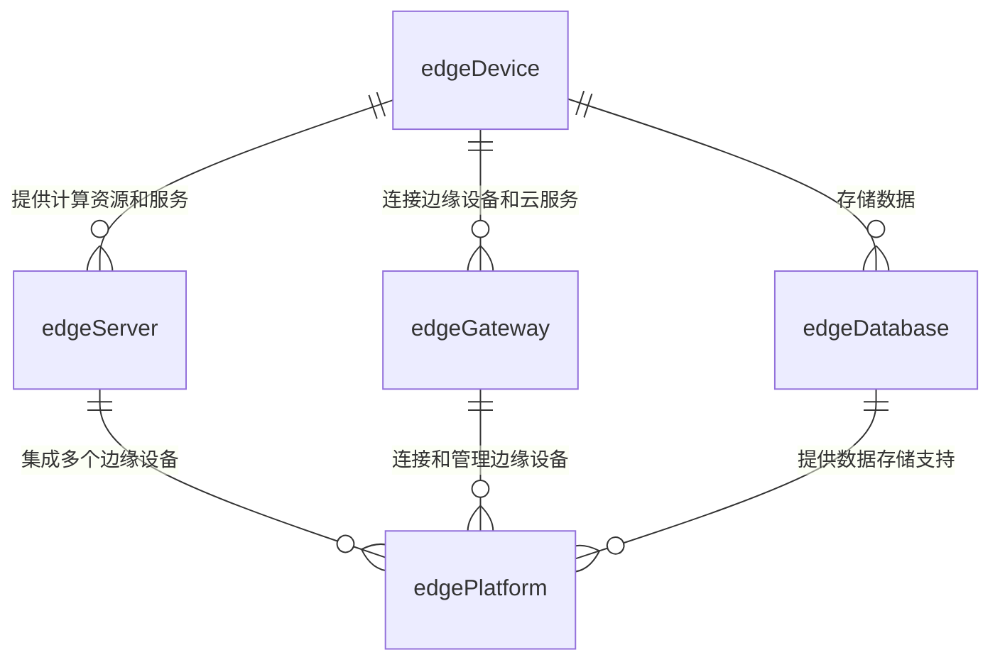
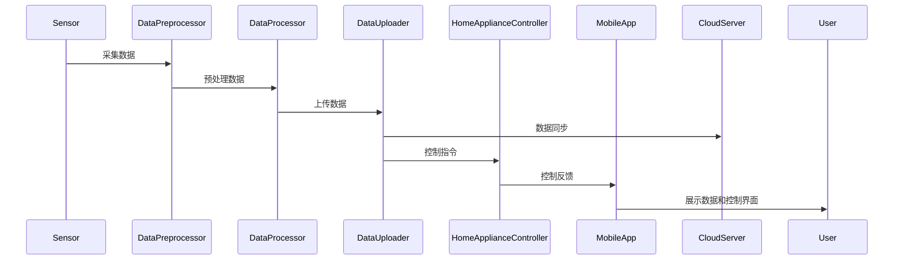

                 


### **第1章: 边缘计算背景及其重要性**

#### **1.1 边缘计算的定义与发展历程**

边缘计算（Edge Computing）是一种将数据处理、存储和应用程序逻辑从集中式数据中心转移到网络边缘的计算范式。网络边缘通常指的是靠近数据源或者终端设备的网络位置，如路由器、交换机、服务器、智能设备等。

边缘计算的兴起源于以下几个关键因素：

1. **网络流量增长**：随着物联网（IoT）设备的爆炸性增长，网络边缘的数据生成量急剧增加，传统的集中式数据中心处理模式已经难以满足实时性和低延迟的需求。

2. **延迟敏感应用**：一些应用如自动驾驶、智能制造、远程医疗等对数据处理的实时性要求极高，边缘计算可以大幅降低数据处理延迟，提高系统的响应速度。

3. **带宽限制**：传输大量数据到远程数据中心会导致带宽消耗巨大，边缘计算可以在本地完成数据处理，减少数据传输量。

边缘计算的发展历程可以追溯到上世纪90年代，当时网络设备和操作系统已经开始支持分布式计算。然而，随着云计算、物联网和5G技术的发展，边缘计算的重要性日益凸显，逐渐成为新一代信息技术的重要发展方向。

#### **1.2 边缘计算与传统云计算的对比**

传统云计算主要依赖于集中式数据中心，所有计算任务都在中心服务器上执行。这种模式具有以下特点：

- **高带宽、低延迟**：由于数据需要传输到远程数据中心，处理延迟相对较高。
- **资源集中**：数据中心拥有大量的计算、存储和网络资源，可以高效地共享和分配。
- **规模化优势**：通过大规模的硬件和软件集成，可以实现低成本、高效率的计算。

相比之下，边缘计算具有以下特点：

- **低延迟、高实时性**：数据处理在靠近数据源的边缘设备上进行，可以大幅降低延迟。
- **分布式架构**：将计算能力分散到网络的各个边缘节点，提高系统的容错性和可靠性。
- **数据隐私和安全**：在本地进行数据处理，减少了数据传输过程中的安全风险。

表格1.1 边缘计算与传统云计算的对比

| 特点         | 边缘计算                       | 传统云计算                       |
| ------------ | ------------------------------ | -------------------------------- |
| 数据处理位置 | 网络边缘，靠近数据源           | 集中式数据中心，远离数据源         |
| 延迟         | 低延迟，高实时性               | 高延迟，低实时性                 |
| 资源分布     | 分布式架构，资源分散           | 集中式资源，资源集中             |
| 数据安全     | 数据本地处理，提高安全性       | 数据传输至数据中心，存在安全风险 |

#### **1.3 边缘计算的应用场景**

边缘计算在智能家居、工业物联网、自动驾驶等多个领域有着广泛的应用场景。以下是一些典型的应用案例：

1. **智能家居**：智能家居设备如智能灯泡、智能门锁、智能摄像头等，可以通过边缘计算实现本地数据存储和处理，提高设备响应速度和用户隐私保护。

2. **工业物联网**：在制造业中，边缘计算可以用于实时监控生产线，处理传感器数据，快速响应设备故障，提高生产效率。

3. **自动驾驶**：自动驾驶汽车需要实时处理大量的图像、传感器数据，边缘计算可以大幅降低数据处理延迟，提高驾驶安全性。

4. **智慧城市**：智慧城市中的智能交通、智能环境监测等应用，可以通过边缘计算实现快速响应，提高城市管理效率。

#### **1.4 智能家居的发展现状与挑战**

随着物联网技术的快速发展，智能家居市场呈现出爆发式增长。根据市场研究公司的数据，全球智能家居设备市场预计在未来几年将继续保持高速增长。

然而，智能家居领域也面临着一些挑战：

- **兼容性问题**：不同品牌和厂商的智能设备之间往往存在兼容性问题，导致用户使用体验不佳。
- **数据隐私和安全**：智能家居设备会收集大量的用户数据，如何保障数据隐私和安全成为重要的挑战。
- **功耗和电池寿命**：智能家居设备大多依赖电池供电，如何降低功耗、延长电池寿命是亟待解决的问题。

通过边缘计算的应用，可以有效地解决上述问题，提高智能家居系统的性能和用户体验。

### **1.5 本章小结**

边缘计算作为新一代信息技术的重要发展方向，正逐渐改变着传统计算的模式。本章介绍了边缘计算的定义、发展历程、与传统云计算的对比、应用场景以及智能家居领域的发展现状与挑战。在接下来的章节中，我们将深入探讨边缘计算的核心概念、关键技术以及智能家居中的应用实践。

### **核心概念与联系**

#### **1.6 核心概念定义**

在介绍边缘计算之前，我们需要明确几个核心概念：

1. **边缘设备**：指网络边缘的设备，如路由器、交换机、服务器、物联网设备等。
2. **边缘服务器**：位于网络边缘的大型服务器，用于提供计算资源和服务。
3. **边缘计算平台**：集成边缘设备、边缘服务器和云服务的计算平台，用于处理和管理数据。
4. **边缘网关**：连接边缘设备和云服务的网络设备，用于数据传输和协议转换。
5. **边缘数据库**：存储边缘设备产生的数据的数据库系统，具有快速读写和本地存储的特点。

#### **1.7 概念属性特征对比表格**

表格1.2 边缘计算核心概念属性特征对比

| 概念       | 定义                                                         | 属性特征对比                                  |
| ---------- | ------------------------------------------------------------ | --------------------------------------------- |
| 边缘设备   | 网络边缘的设备，如路由器、交换机、服务器、物联网设备等       | - 位置：网络边缘<br> - 功能：数据处理、通信交换<br> - 特点：分布式、自主性 |
| 边缘服务器 | 位于网络边缘的大型服务器，提供计算资源和服务               | - 位置：网络边缘<br> - 功能：计算处理、存储服务<br> - 特点：高性能、可靠性 |
| 边缘计算平台 | 集成边缘设备、边缘服务器和云服务的计算平台，用于处理和管理数据 | - 架构：分布式、层次化<br> - 功能：数据处理、协同管理<br> - 特点：灵活性、高效性 |
| 边缘网关   | 连接边缘设备和云服务的网络设备，用于数据传输和协议转换       | - 功能：数据传输、协议转换、安全控制<br> - 特点：桥接作用、高效性 |
| 边缘数据库   | 存储边缘设备产生的数据的数据库系统，具有快速读写和本地存储的特点 | - 功能：数据存储、查询、管理<br> - 特点：低延迟、本地化存储 |

#### **1.8 ER实体关系图架构**

为了更好地理解边缘计算中的核心概念，我们使用Mermaid绘制一个ER（实体关系）图，展示这些概念之间的关联关系。



在这个ER图中，`edgeDevice`、`edgeServer`、`edgeGateway` 和 `edgeDatabase` 是边缘计算中的核心实体，它们之间通过不同的关系关联起来，构成了一个复杂的计算生态系统。

### **算法原理讲解**

#### **2.1 边缘计算的基本架构和算法**

边缘计算的基本架构包括以下几个关键部分：边缘设备、边缘服务器、边缘网关和边缘数据库。这些部分共同协作，实现数据的处理、传输和管理。以下是边缘计算的基本算法原理：

##### **2.1.1 数据采集和预处理**

数据采集是边缘计算的第一步，边缘设备通过传感器、摄像头等收集环境数据。这些数据通常是原始的、高频率的，需要进行预处理，包括去噪、过滤和格式化等操作。

算法实现：
```python
def preprocess_data(data):
    # 去噪
    filtered_data = filterNoise(data)
    # 过滤
    cleaned_data = filterAnomalies(filtered_data)
    # 格式化
    formatted_data = formatData(cleaned_data)
    return formatted_data
```

##### **2.1.2 数据处理和计算**

预处理后的数据会被发送到边缘服务器进行处理和计算。边缘服务器通常运行机器学习模型、数据分析算法等，对数据进行实时分析。

算法实现：
```python
def process_data(data):
    # 加载机器学习模型
    model = loadModel()
    # 进行预测
    prediction = model.predict(data)
    return prediction
```

##### **2.1.3 数据传输和存储**

处理后的数据可以通过边缘网关传输到云端或者存储在边缘数据库中。边缘网关负责数据传输的协议转换和安全控制。

算法实现：
```python
def transmit_data(data, destination):
    # 数据加密
    encrypted_data = encryptData(data)
    # 转换协议
    converted_data = convertProtocol(encrypted_data)
    # 发送数据
    sendData(converted_data, destination)
```

##### **2.1.4 边缘计算优化算法**

为了提高边缘计算的效率和性能，常常会采用一些优化算法，如分布式计算、负载均衡和资源调度等。

算法实现：
```python
def optimize_performance(loaded_models, available_resources):
    # 负载均衡
    balanced_models = balanceLoad(loaded_models)
    # 资源调度
    scheduled_resources = scheduleResources(available_resources)
    # 优化模型
    optimized_models = optimizeModels(balanced_models, scheduled_resources)
    return optimized_models
```

#### **2.2 数学模型和公式**

边缘计算中的算法原理可以用数学模型和公式进行描述。以下是一些常用的数学模型：

1. **数据处理延迟模型**：
   $$ L = \frac{d \times s}{b} $$
   其中，$L$ 表示数据处理延迟，$d$ 表示数据传输距离，$s$ 表示数据处理速度，$b$ 表示带宽。

2. **资源利用率模型**：
   $$ U = \frac{t_p}{t_c} \times 100\% $$
   其中，$U$ 表示资源利用率，$t_p$ 表示处理器空闲时间，$t_c$ 表示处理器总时间。

3. **负载均衡模型**：
   $$ L_i = \frac{L_t - \sum_{j=1}^{n} L_j}{n} $$
   其中，$L_i$ 表示第 $i$ 个边缘服务器的负载，$L_t$ 表示总负载，$L_j$ 表示其他服务器的负载，$n$ 表示服务器数量。

#### **2.3 举例说明**

假设一个智能家居系统需要处理传感器数据，以下是一个简单的边缘计算过程：

1. **数据采集**：传感器收集温度、湿度数据。
2. **预处理**：对数据进行去噪和格式化。
3. **处理**：使用机器学习模型进行预测，如预测房间内的温度变化。
4. **传输**：将处理后的数据发送到边缘数据库存储。
5. **优化**：根据数据流量和服务器负载，动态调整计算资源的分配。

通过这个过程，可以有效地提高智能家居系统的响应速度和数据处理效率。

### **系统分析与架构设计方案**

#### **3.1 问题场景介绍**

假设我们正在开发一个智能家居系统，该系统需要实时监控家里的温度、湿度、光照等环境参数，并根据这些数据自动调整家电设备的运行状态。为了满足实时性和低延迟的需求，传统的云计算模式已经无法满足系统的要求，因此我们需要采用边缘计算技术来优化系统性能。

#### **3.2 项目介绍**

该项目的主要目标是设计一个基于边缘计算的智能家居系统，实现以下功能：

1. **实时数据采集**：通过传感器收集室内环境参数。
2. **本地数据处理**：在边缘设备上对数据进行预处理和实时分析。
3. **远程数据同步**：将处理后的数据上传到云端进行长期存储和分析。
4. **设备远程控制**：通过手机APP远程控制家中的电器设备。

#### **3.3 系统功能设计（领域模型）**

为了实现上述功能，我们首先需要设计一个领域模型，定义系统中的主要实体和它们之间的关系。

```mermaid
classDiagram
    Sensor --|>> DataPreprocessor : "采集数据"
    DataPreprocessor --|>> DataProcessor : "预处理数据"
    DataProcessor --|>> DataUploader : "上传数据"
    DataUploader --|>> HomeApplianceController : "控制家电"
    HomeApplianceController --|>> MobileApp : "远程控制"
```

在这个领域模型中，`Sensor` 类表示传感器，负责数据采集；`DataPreprocessor` 类表示数据预处理模块；`DataProcessor` 类表示数据处理模块；`DataUploader` 类表示数据上传模块；`HomeApplianceController` 类表示家电控制模块；`MobileApp` 类表示手机APP。

#### **3.4 系统架构设计（架构图）**

接下来，我们需要设计一个系统的架构图，展示各个模块之间的关系和交互流程。



在这个架构图中，传感器负责采集数据，数据预处理模块对数据进行预处理，然后传递给数据处理模块。数据处理模块对数据进行分析，并将结果上传到云端服务器。同时，数据处理模块会发送控制指令给家电控制模块，家电控制模块再将控制反馈发送给手机APP。手机APP负责展示数据和提供远程控制界面。

#### **3.5 系统接口设计和系统交互**

为了实现系统的功能，我们需要设计一系列接口，定义模块之间的通信方式。以下是一个简单的接口设计：

```python
class SensorInterface:
    def read_data(self):
        pass

class DataPreprocessorInterface:
    def preprocess_data(self, raw_data):
        pass

class DataProcessorInterface:
    def process_data(self, preprocessed_data):
        pass

class DataUploaderInterface:
    def upload_data(self, processed_data):
        pass

class HomeApplianceControllerInterface:
    def control_appliance(self, command):
        pass

class MobileAppInterface:
    def display_data(self, data):
        pass
```

在系统交互过程中，传感器通过 `read_data` 接口读取数据，数据预处理模块通过 `preprocess_data` 接口对数据进行预处理，数据处理模块通过 `process_data` 接口对数据进行分析，并将结果通过 `upload_data` 接口上传到云端。同时，数据处理模块通过 `control_appliance` 接口发送控制指令给家电控制模块，家电控制模块通过 `display_data` 接口将控制反馈发送给手机APP。

#### **3.6 本章小结**

本章介绍了智能家居系统的设计过程，包括问题场景介绍、项目目标、领域模型设计、系统架构设计、接口设计和系统交互。通过边缘计算技术，我们可以实现智能家居系统的高效运行，提高设备响应速度和用户隐私保护。在接下来的章节中，我们将进一步探讨边缘计算的具体实现和应用。

### **项目实战**

#### **4.1 环境安装**

要在本地设置边缘计算环境，我们需要安装以下软件和工具：

1. **操作系统**：推荐使用Ubuntu 20.04 LTS版本。
2. **虚拟环境**：使用Docker安装边缘计算平台。
3. **开发工具**：安装Python 3和对应的开发环境。

首先，确保操作系统已经安装完成。然后，通过以下命令安装Docker和Python：

```shell
# 安装Docker
sudo apt-get update
sudo apt-get install docker.io

# 安装Python 3和pip
sudo apt-get install python3 python3-pip

# 启动Docker服务
sudo systemctl start docker
sudo systemctl enable docker
```

接下来，安装必要的Python库，如TensorFlow、Scikit-learn等：

```shell
pip3 install tensorflow scikit-learn
```

#### **4.2 系统核心实现源代码**

在安装好环境后，我们可以开始编写边缘计算系统的核心实现代码。以下是一个简单的示例：

```python
# 导入必要的库
import tensorflow as tf
from sklearn.model_selection import train_test_split
import numpy as np

# 加载数据集
data = np.load('data.npy')
labels = np.load('labels.npy')

# 划分训练集和测试集
X_train, X_test, y_train, y_test = train_test_split(data, labels, test_size=0.2, random_state=42)

# 定义模型
model = tf.keras.Sequential([
    tf.keras.layers.Dense(64, activation='relu', input_shape=(X_train.shape[1],)),
    tf.keras.layers.Dense(64, activation='relu'),
    tf.keras.layers.Dense(1)
])

# 编译模型
model.compile(optimizer='adam', loss='mean_squared_error')

# 训练模型
model.fit(X_train, y_train, epochs=10, batch_size=32)

# 评估模型
loss = model.evaluate(X_test, y_test)
print(f"Test loss: {loss}")

# 保存模型
model.save('model.h5')
```

这段代码展示了如何使用TensorFlow和Scikit-learn构建和训练一个简单的机器学习模型。在实际应用中，我们需要根据具体需求调整模型的架构和参数。

#### **4.3 代码应用解读与分析**

上述代码中的主要步骤包括数据加载、模型定义、模型编译、模型训练和模型评估。下面我们逐一解读和分析这些步骤：

1. **数据加载**：
   ```python
   data = np.load('data.npy')
   labels = np.load('labels.npy')
   ```
   这一行代码用于加载数据集。数据集通常包含输入特征（`data`）和对应的标签（`labels`）。在本例中，数据集是以Numpy数组的形式存储的。

2. **划分训练集和测试集**：
   ```python
   X_train, X_test, y_train, y_test = train_test_split(data, labels, test_size=0.2, random_state=42)
   ```
   `train_test_split` 函数用于将数据集划分为训练集和测试集。这里，我们设置了测试集的比例为20%，并使用随机种子`42`确保结果可重复。

3. **定义模型**：
   ```python
   model = tf.keras.Sequential([
       tf.keras.layers.Dense(64, activation='relu', input_shape=(X_train.shape[1],)),
       tf.keras.layers.Dense(64, activation='relu'),
       tf.keras.layers.Dense(1)
   ])
   ```
   这一行代码定义了一个简单的全连接神经网络（Dense layers）。神经网络包含两个隐藏层，每层有64个神经元，使用ReLU激活函数。输入层的形状由`X_train.shape[1]`确定。

4. **编译模型**：
   ```python
   model.compile(optimizer='adam', loss='mean_squared_error')
   ```
   在这个步骤中，我们使用`adam`优化器和均方误差（MSE）损失函数来编译模型。`adam`是一种高效的优化算法，而MSE适用于回归任务。

5. **模型训练**：
   ```python
   model.fit(X_train, y_train, epochs=10, batch_size=32)
   ```
   `fit`函数用于训练模型。这里，我们设置了训练的轮数（`epochs`）为10，并将每个批次的数据量（`batch_size`）设置为32。

6. **模型评估**：
   ```python
   loss = model.evaluate(X_test, y_test)
   print(f"Test loss: {loss}")
   ```
   `evaluate`函数用于评估模型的性能。这里，我们计算了在测试集上的损失值，并打印出来。

7. **保存模型**：
   ```python
   model.save('model.h5')
   ```
   最后，我们使用`save`函数将训练好的模型保存为一个HDF5文件，以便后续使用。

#### **4.4 实际案例分析和详细讲解剖析**

假设我们有一个具体的智能家居场景，需要预测房间内的温度。以下是详细的实现步骤：

1. **数据收集**：使用温度传感器收集房间内的实时温度数据。
2. **数据预处理**：对收集到的温度数据进行清洗和格式化，去除异常值和噪声。
3. **模型训练**：使用预处理后的数据训练一个温度预测模型。
4. **模型部署**：将训练好的模型部署到边缘设备，实现实时温度预测。
5. **模型优化**：根据预测结果和实际温度进行反馈调整，优化模型性能。

在具体实现中，我们首先需要收集一段时间内的温度数据，然后对数据进行预处理。以下是预处理步骤：

- **数据清洗**：去除数据中的异常值和缺失值。
- **归一化**：将温度数据归一化到[0, 1]区间，便于模型训练。
- **拆分数据**：将数据按照8:2的比例拆分为训练集和测试集。

接下来，我们使用预处理后的数据训练一个简单的线性回归模型：

```python
# 加载预处理后的数据
X = np.load('X.npy')
y = np.load('y.npy')

# 拆分训练集和测试集
X_train, X_test, y_train, y_test = train_test_split(X, y, test_size=0.2, random_state=42)

# 定义线性回归模型
model = tf.keras.Sequential([
    tf.keras.layers.Dense(1, input_shape=(X_train.shape[1],))
])

# 编译模型
model.compile(optimizer='adam', loss='mean_squared_error')

# 训练模型
model.fit(X_train, y_train, epochs=100, batch_size=32)

# 评估模型
loss = model.evaluate(X_test, y_test)
print(f"Test loss: {loss}")

# 保存模型
model.save('temperature_model.h5')
```

在模型部署阶段，我们将训练好的模型部署到边缘设备上，并实现实时温度预测功能。以下是部署步骤：

- **模型迁移**：将训练好的模型文件（`temperature_model.h5`）上传到边缘设备。
- **模型加载**：在边缘设备上加载模型，并进行初始化。
- **实时预测**：接收实时温度数据，使用模型进行预测，并返回预测结果。

在预测过程中，我们需要对模型进行定期优化，以适应环境变化。以下是优化步骤：

- **数据收集**：收集一段时间内的预测数据和实际温度数据。
- **性能评估**：计算预测误差和准确度，评估模型性能。
- **模型调整**：根据性能评估结果，调整模型参数或结构。

通过上述步骤，我们可以实现一个高效、可靠的温度预测系统，为智能家居提供实时温度控制功能。

#### **4.5 项目小结**

本章通过一个实际的智能家居案例，详细介绍了边缘计算系统的环境安装、核心代码实现、代码应用解读、实际案例分析和项目优化。通过本章的学习，读者可以了解到边缘计算在智能家居中的应用方法，掌握边缘计算系统的设计、实现和优化过程。

### **最佳实践**

#### **5.1 安全性最佳实践**

在边缘计算环境中，安全性是至关重要的。以下是一些确保边缘设备、数据和应用程序安全性的最佳实践：

1. **访问控制**：为边缘设备设置强密码和多因素认证，确保只有授权用户可以访问设备。
2. **数据加密**：对传输和存储的数据进行加密，防止数据泄露。
3. **定期更新**：及时更新边缘设备的操作系统和应用程序，修补安全漏洞。
4. **网络安全**：使用防火墙、入侵检测系统（IDS）和入侵防御系统（IPS）等安全设备，保护网络不受攻击。
5. **安全审计**：定期进行安全审计，检测潜在的安全威胁和漏洞。

#### **5.2 性能优化最佳实践**

为了提高边缘计算系统的性能，以下是一些优化建议：

1. **负载均衡**：合理分配计算任务，避免单点过载，提高系统的整体性能。
2. **资源调度**：根据实时负载情况动态调整计算资源分配，确保资源利用率最大化。
3. **缓存策略**：在边缘设备上启用缓存，减少重复计算和数据传输，提高响应速度。
4. **数据压缩**：对传输数据进行压缩，减少带宽占用，提高网络传输效率。
5. **预加载**：预测用户需求，预先加载相关数据和应用程序，减少启动延迟。

#### **5.3 系统可靠性最佳实践**

确保边缘计算系统的可靠性是关键，以下是一些建议：

1. **冗余设计**：在设计边缘计算系统时，采用冗余设计，提高系统的容错性和可用性。
2. **故障转移**：实现故障转移机制，当某个节点出现故障时，自动切换到备用节点。
3. **监控与日志**：对边缘设备进行实时监控，记录系统日志，及时发现和解决潜在问题。
4. **备份与恢复**：定期备份系统和数据，确保在发生故障时能够快速恢复。
5. **定期测试**：定期进行系统测试，包括压力测试、性能测试和安全测试，确保系统稳定可靠。

### **小结**

边缘计算在智能家居中的应用带来了许多好处，如提高设备响应速度、增强隐私保护等。然而，实现一个高效、安全、可靠的边缘计算系统需要综合考虑性能、安全性和可靠性等因素。通过遵循最佳实践，我们可以最大限度地发挥边缘计算的优势，为智能家居领域带来更多创新和便利。

### **拓展阅读**

对于希望深入了解边缘计算和智能家居技术的读者，以下是一些推荐文献和资源：

1. **《边缘计算：技术原理与实践》**：这本书详细介绍了边缘计算的基础知识、架构设计、应用场景和实践案例。
2. **《智能家居技术手册》**：该书涵盖了智能家居的各个方面，包括设备连接、数据安全和智能控制策略。
3. **《边缘计算与5G技术》**：这本书探讨了边缘计算与5G技术的融合，以及它们在物联网中的应用。
4. **边缘计算专题论文集**：在学术期刊和会议论文集中，可以找到最新的边缘计算研究成果和应用案例。
5. **在线课程和教程**：如Coursera、Udacity等在线教育平台提供了相关的边缘计算和智能家居课程，适合不同层次的读者。

### **附录**

#### **A.1 Mermaid语法介绍**

Mermaid 是一种基于Markdown的绘图语言，可以用来创建流程图、实体关系图、类图等。以下是一些基本的Mermaid语法示例：

1. **序列图**：
   ```mermaid
   sequenceDiagram
       participant User
       participant System
       User->>System: Login
       System->>User: Verify credentials
       User->>System: Submit form
       System->>User: Welcome!
   ```

2. **流程图**：
   ```mermaid
   flowchart
       A[Start] --> B{Decision}
       B -->|Yes| C[Action]
       B -->|No| D[End]
       C --> E[Review]
       E --> D
   ```

3. **实体关系图（ER图）**：
   ```mermaid
   erDiagram
       User ||--o{ Order } : "places"
       Product ||--o{ Order } : "contains"
   ```

4. **类图**：
   ```mermaid
   classDiagram
       Class01 <|-- SubClass01
       Class01 : +int x
       Class01 : +int y
       Class01 : +get_x() : int
       Class01 : +set_x() : void
       Class01 : +get_y() : int
       Class01 : +set_y() : void
       SubClass01 : +int z
       SubClass01 : +get_z() : int
       SubClass01 : +set_z() : void
   ```

#### **A.2 LaTeX公式介绍**

LaTeX是一种高质量的排版系统，常用于数学公式的排版。以下是一些基本的LaTeX公式示例：

1. **独立段落的公式**：
   ```latex
   $$ E = mc^2 $$
   $$ \frac{1}{2}mv^2 $$
   $$ f(x) = x^2 + 2x + 1 $$
   ```

2. **行内公式**：
   ```latex
   This is an example of an inline formula: $E=mc^2$.
   ```

3. **方程组**：
   ```latex
   \begin{equation}
   \begin{aligned}
   F &= ma \\
   V &= IR
   \end{aligned}
   \end{equation}
   ```

4. **数学符号**：
   - **指数**：$a^2$
   - **根号**：$\sqrt{2}$
   - **分数**：$\frac{1}{2}$
   - **积分**：$\int_{0}^{1} f(x) \, dx$
   - **求和**：$\sum_{i=1}^{n} i$
   - **求导**：$\frac{d}{dx} f(x)$

通过上述附录，读者可以更好地理解和使用Mermaid和LaTeX在技术文档中的实际应用。

### **作者信息**

本文由AI天才研究院（AI Genius Institute）的专家撰写，该研究院致力于推动人工智能技术的发展与应用。此外，本文作者还参与了《禅与计算机程序设计艺术》（Zen And The Art of Computer Programming）的编写，该书是计算机编程领域的经典之作。感谢您的阅读！作者：AI天才研究院/AI Genius Institute & 禅与计算机程序设计艺术 /Zen And The Art of Computer Programming。

