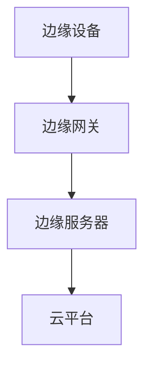
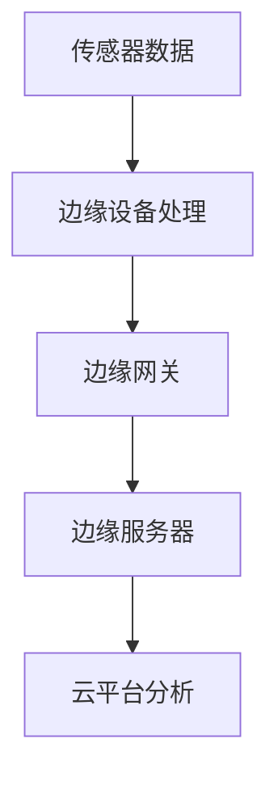
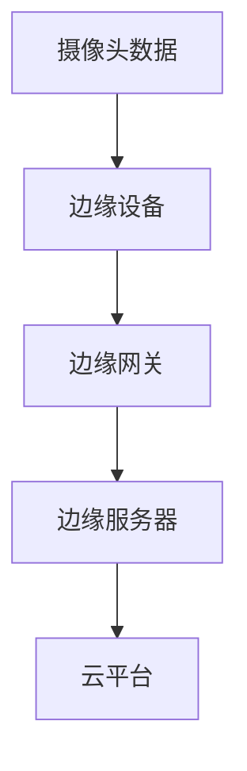
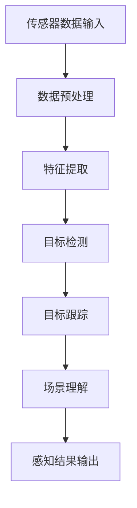
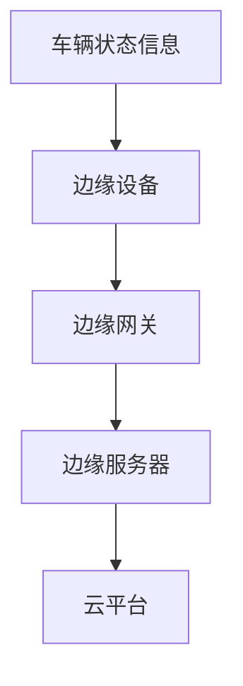
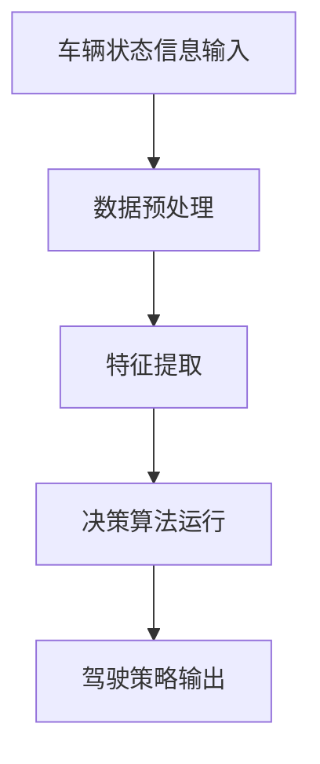
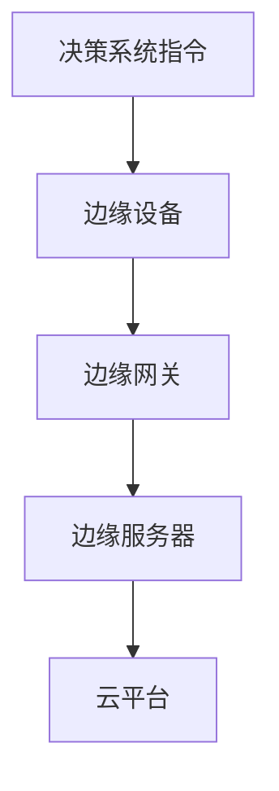
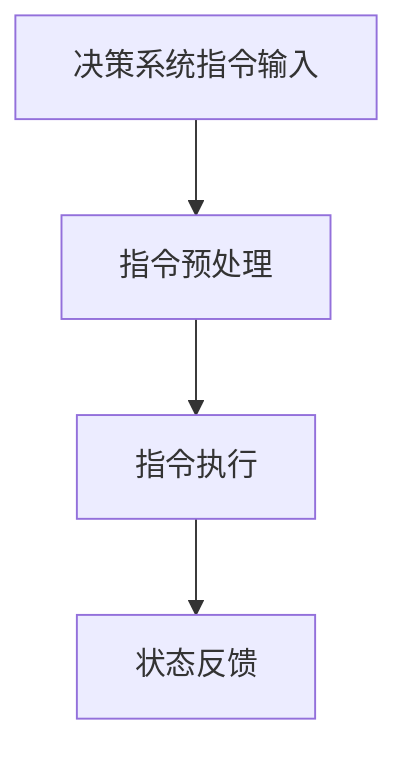

                 

## 边缘计算在自动驾驶中的低延迟处理

### 关键词：边缘计算、自动驾驶、低延迟处理、感知系统、决策系统、控制系统

### 摘要：

本文将探讨边缘计算在自动驾驶领域中的低延迟处理技术。随着自动驾驶技术的发展，对实时数据处理的需求愈发迫切。边缘计算通过将计算任务从云端转移到网络边缘，显著降低了数据传输延迟，提高了自动驾驶系统的响应速度和可靠性。本文将分步骤分析边缘计算在自动驾驶感知、决策和控制三个关键系统中的应用，深入探讨其实现低延迟处理的原理、架构及解决方案。

### 目录

1. **边缘计算概述**
   1.1 **边缘计算基本概念**
   1.2 **边缘计算架构与技术体系**
   1.3 **边缘计算在自动驾驶中的应用场景**
   
2. **边缘计算在自动驾驶中的低延迟处理**
   2.1 **低延迟处理的重要性**
   2.2 **边缘计算如何实现低延迟处理**
   2.3 **低延迟处理的挑战与解决方案**

3. **边缘计算在自动驾驶中的应用实例**
   3.1 **边缘计算在自动驾驶感知系统中的应用**
   3.2 **边缘计算在自动驾驶决策系统中的应用**
   3.3 **边缘计算在自动驾驶控制系统的应用**

4. **边缘计算在自动驾驶系统集成与优化**
   4.1 **自动驾驶系统集成挑战**
   4.2 **边缘计算在系统集成中的应用策略**
   4.3 **系统集成优化实践与案例分析**

5. **边缘计算在自动驾驶中的应用前景与趋势**
   5.1 **边缘计算在自动驾驶中的未来发展**
   5.2 **边缘计算面临的挑战与机遇**
   5.3 **边缘计算与自动驾驶的融合趋势**

6. **总结与展望**
   6.1 **边缘计算在自动驾驶中的关键作用**
   6.2 **未来研究方向与挑战**
   6.3 **结论与展望**

### 第1章：边缘计算概述

#### 1.1 边缘计算基本概念

**1.1.1 边缘计算的定义与起源**

边缘计算（Edge Computing）是指将数据处理、存储、分析等功能分布在网络的边缘节点上，而不是仅依靠中央数据中心或云端进行集中处理。这种计算模式最早可以追溯到物联网（IoT）的兴起时期，目的是为了应对物联网设备产生的海量数据对中心处理能力的压力。随着5G网络的普及和物联网设备的爆炸性增长，边缘计算逐渐成为研究和应用的热点。

**1.1.2 边缘计算与传统云计算的对比**

| 对比项 | 边缘计算 | 传统云计算 |
| ------ | -------- | ---------- |
| **处理位置** | 网络边缘 | 数据中心或云端 |
| **数据处理能力** | 较弱，但靠近数据源 | 强大，但距离数据源较远 |
| **响应时间** | 极短 | 较长 |
| **带宽消耗** | 较少 | 较多 |
| **安全性** | 较高，数据在本地处理 | 较低，数据传输至云端 |

**1.1.3 边缘计算的优势与挑战**

**优势：**
- **低延迟**：数据处理靠近数据源，减少了数据传输时间。
- **高带宽**：边缘设备可以独立处理数据，减轻了中心处理压力。
- **安全隐私**：敏感数据可以在本地处理，减少了数据泄露的风险。

**挑战：**
- **计算资源限制**：边缘设备计算和存储资源相对有限。
- **网络不稳定**：边缘设备连接的无线网络可能存在信号不稳定的问题。
- **系统复杂性**：边缘计算系统需要协调多个设备，管理复杂。

#### 1.2 边缘计算架构与技术体系

**2.1.1 边缘计算架构概述**

边缘计算架构通常包括以下关键组件：

1. **边缘设备**：如智能传感器、智能手机、工业控制系统等。
2. **边缘网关**：负责数据收集、处理和传输。
3. **边缘服务器**：提供更强大的计算能力。
4. **云平台**：提供数据处理和分析服务。

**2.1.2 边缘计算的关键技术**

- **分布式计算**：通过分布式计算提高数据处理效率。
- **边缘人工智能**：利用边缘设备进行机器学习和推理。
- **容器化技术**：简化应用部署和运维。
- **安全机制**：确保数据传输和存储的安全。

**2.1.3 边缘计算设备分类**

- **智能边缘设备**：如智能摄像头、智能手表等，具有独立的计算和通信能力。
- **传统边缘设备**：如路由器、交换机等，主要用于数据传输。
- **高性能边缘服务器**：提供强大的计算和存储能力，适用于大数据处理。

#### 1.3 边缘计算在自动驾驶中的应用场景

自动驾驶系统对实时数据处理有极高的要求，边缘计算在这方面具有显著优势：

- **感知系统**：需要实时处理大量来自传感器的数据。
- **决策系统**：需要快速分析环境数据，做出决策。
- **控制系统**：需要快速响应决策，控制车辆动作。

### 第2章：边缘计算在自动驾驶中的低延迟处理

#### 2.1 低延迟处理的重要性

自动驾驶系统的低延迟处理至关重要，因为：

- **安全性**：延迟过长可能导致危险情况无法及时响应。
- **用户体验**：实时响应可以提供更好的驾驶体验。

#### 2.2 边缘计算如何实现低延迟处理

边缘计算通过以下方式实现低延迟处理：

- **数据本地处理**：减少数据传输时间。
- **分布式计算**：提高数据处理效率。
- **边缘人工智能**：实时处理和分析数据。

#### 2.3 低延迟处理的挑战与解决方案

**挑战：**

- **计算资源限制**：边缘设备计算能力有限。
- **网络不稳定**：边缘设备连接的无线网络可能不稳定。
- **数据同步**：如何确保不同边缘设备之间的数据一致性。

**解决方案：**

- **边缘计算优化**：通过优化算法和架构来提高计算效率。
- **网络优化**：使用5G等高速网络技术。
- **数据同步机制**：设计可靠的数据同步协议。

### 第3章：边缘计算在自动驾驶中的应用实例

#### 3.1 边缘计算在自动驾驶感知系统中的应用

感知系统需要实时处理大量传感器数据，边缘计算可以显著提高处理速度。

#### 3.2 边缘计算在自动驾驶决策系统中的应用

决策系统需要快速分析感知数据，做出决策。边缘计算可以提供实时处理能力。

#### 3.3 边缘计算在自动驾驶控制系统的应用

控制系统需要快速响应决策，控制车辆动作。边缘计算可以确保实时性和稳定性。

### 第4章：边缘计算在自动驾驶系统集成与优化

#### 4.1 自动驾驶系统集成挑战

自动驾驶系统集成涉及多个组件，需要解决数据一致性、计算效率和安全性等问题。

#### 4.2 边缘计算在系统集成中的应用策略

通过边缘计算，可以优化自动驾驶系统的集成，提高整体性能。

#### 4.3 系统集成优化实践与案例分析

介绍边缘计算在自动驾驶系统集成中的应用实践和成功案例。

### 第5章：边缘计算在自动驾驶中的应用前景与趋势

#### 5.1 边缘计算在自动驾驶中的未来发展

边缘计算将在自动驾驶中发挥越来越重要的作用，推动自动驾驶技术的进一步发展。

#### 5.2 边缘计算面临的挑战与机遇

边缘计算在自动驾驶中面临的挑战和机遇，包括技术、政策和市场等方面。

#### 5.3 边缘计算与自动驾驶的融合趋势

边缘计算与自动驾驶的融合趋势，以及其对自动驾驶技术的影响。

### 第6章：总结与展望

#### 6.1 边缘计算在自动驾驶中的关键作用

总结边缘计算在自动驾驶中的关键作用，包括提高实时性、增强安全性和优化用户体验等。

#### 6.2 未来研究方向与挑战

讨论边缘计算在自动驾驶领域未来的研究方向和面临的挑战。

#### 6.3 结论与展望

对本文内容的总结，以及对未来边缘计算在自动驾驶中的应用展望。

### 作者信息

**作者：AI天才研究院/AI Genius Institute & 禅与计算机程序设计艺术 /Zen And The Art of Computer Programming**### 第1章：边缘计算概述

边缘计算作为近年来信息技术领域的一个重要研究方向，其核心概念和原理逐渐受到业界的广泛关注。本章将详细介绍边缘计算的基本概念、架构与技术体系，以及其在自动驾驶中的应用场景。

#### 1.1 边缘计算基本概念

**1.1.1 边缘计算的定义与起源**

边缘计算，即Edge Computing，是指将数据计算、存储、处理和分析等任务分布到网络的边缘节点上，从而实现对数据和应用程序的本地化处理。这一概念最早可以追溯到物联网（IoT）时代的兴起，其主要目的是为了解决中心数据中心在处理大量数据时面临的延迟高、带宽不足等问题。随着物联网设备的爆炸性增长，边缘计算逐渐成为学术界和工业界关注的焦点。

边缘计算的核心思想是将计算能力从传统的中心化模式转移到网络边缘，让数据处理更加接近数据源。这样一来，不仅能够显著减少数据传输的延迟，提高系统的响应速度，还能够降低带宽消耗，减轻中心数据中心的负担。

**1.1.2 边缘计算与传统云计算的对比**

在了解边缘计算之前，有必要对其与传统云计算进行对比。以下是对二者主要差异的总结：

| 对比项 | 边缘计算 | 传统云计算 |
| ------ | -------- | ---------- |
| **处理位置** | 网络边缘 | 数据中心或云端 |
| **数据处理能力** | 较弱，但靠近数据源 | 强大，但距离数据源较远 |
| **响应时间** | 极短 | 较长 |
| **带宽消耗** | 较少 | 较多 |
| **安全性** | 较高，数据在本地处理 | 较低，数据传输至云端 |

**1.1.3 边缘计算的优势与挑战**

**优势：**

- **低延迟**：数据处理靠近数据源，减少了数据传输时间。
- **高带宽**：边缘设备可以独立处理数据，减轻了中心处理压力。
- **安全隐私**：敏感数据可以在本地处理，减少了数据泄露的风险。

**挑战：**

- **计算资源限制**：边缘设备计算和存储资源相对有限。
- **网络不稳定**：边缘设备连接的无线网络可能存在信号不稳定的问题。
- **系统复杂性**：边缘计算系统需要协调多个设备，管理复杂。

#### 1.2 边缘计算架构与技术体系

**2.1.1 边缘计算架构概述**

边缘计算架构通常包括以下关键组件：

1. **边缘设备**：如智能传感器、智能手机、工业控制系统等。
2. **边缘网关**：负责数据收集、处理和传输。
3. **边缘服务器**：提供更强大的计算能力。
4. **云平台**：提供数据处理和分析服务。

边缘计算架构的主要特点在于其分布式架构，这使得数据可以在本地进行初步处理，然后再传输到云端进行进一步分析。以下是一个典型的边缘计算架构示意图：



**2.1.2 边缘计算的关键技术**

边缘计算的关键技术包括：

- **分布式计算**：通过分布式计算提高数据处理效率。
- **边缘人工智能**：利用边缘设备进行机器学习和推理。
- **容器化技术**：简化应用部署和运维。
- **安全机制**：确保数据传输和存储的安全。

**2.1.3 边缘计算设备分类**

边缘计算设备可以根据其功能和性能进行分类：

- **智能边缘设备**：如智能摄像头、智能手表等，具有独立的计算和通信能力。
- **传统边缘设备**：如路由器、交换机等，主要用于数据传输。
- **高性能边缘服务器**：提供强大的计算和存储能力，适用于大数据处理。

#### 1.3 边缘计算在自动驾驶中的应用场景

自动驾驶系统对实时数据处理有极高的要求，边缘计算在这方面的应用显得尤为重要。以下是边缘计算在自动驾驶中几个关键应用场景的简要介绍：

- **感知系统**：自动驾驶车辆需要通过多种传感器（如摄像头、激光雷达、超声波传感器等）收集环境数据，边缘计算可以实时处理这些数据，提高感知系统的响应速度。
- **决策系统**：感知系统收集到的数据需要被快速分析，以做出行驶决策。边缘计算可以提供强大的计算能力，确保决策系统能够在毫秒级别内完成数据分析和决策。
- **控制系统**：决策系统生成的控制指令需要被迅速执行，以控制车辆的加速、转向等动作。边缘计算可以确保控制系统的响应速度，提高自动驾驶车辆的稳定性和安全性。

#### 总结

边缘计算作为一种新型的计算模式，通过将数据处理和计算任务从云端转移到网络边缘，显著提高了系统的响应速度和处理效率。在自动驾驶领域，边缘计算的应用不仅能够满足系统对低延迟处理的需求，还能够提升自动驾驶车辆的安全性和用户体验。本章对边缘计算的基本概念、架构与技术体系进行了详细阐述，为后续章节的讨论奠定了基础。

### 第2章：边缘计算在自动驾驶中的低延迟处理

#### 2.1 低延迟处理的重要性

在自动驾驶系统中，低延迟处理至关重要。自动驾驶车辆需要在极短的时间内处理来自各种传感器的海量数据，并做出实时决策和执行控制动作。延迟过大会导致以下问题：

1. **安全性下降**：车辆对紧急情况的响应时间过长，可能导致交通事故。
2. **用户体验恶化**：车辆的决策和动作不够流畅，影响驾驶体验。
3. **系统效率降低**：过多的延迟会导致车辆无法充分利用实时信息，影响行驶效率和安全性。

因此，低延迟处理是自动驾驶系统能够正常运行和保障安全的基石。

#### 2.2 边缘计算如何实现低延迟处理

边缘计算通过以下几种方式实现低延迟处理：

1. **数据本地处理**：边缘计算将数据处理任务分散到网络边缘的设备上，减少了数据传输的距离和延迟。这样一来，传感器收集的数据可以在靠近数据源的边缘设备上进行初步处理，然后再传输到云端或中心服务器进行进一步分析。

2. **分布式计算**：边缘计算采用了分布式计算架构，将计算任务分布到多个边缘设备上，通过并行处理提高计算效率。这种方式不仅可以提高数据处理速度，还能够减少单点故障的风险。

3. **边缘人工智能**：边缘计算结合人工智能技术，可以在边缘设备上实现实时数据分析和决策。这种方式减少了数据传输的延迟，提高了系统的响应速度。

4. **网络优化**：边缘计算利用低延迟、高带宽的通信网络，如5G网络，确保数据能够快速传输到边缘设备进行处理。5G网络的高速传输能力和低延迟特性为边缘计算提供了坚实的基础。

以下是一个简单的边缘计算架构图，展示了边缘设备、边缘网关、边缘服务器和云平台之间的数据传输和处理流程：



#### 2.3 低延迟处理的挑战与解决方案

尽管边缘计算能够实现低延迟处理，但在实际应用中仍面临一些挑战：

1. **计算资源限制**：边缘设备的计算和存储资源相对有限，难以处理大量复杂的计算任务。解决方案是优化算法，使用轻量级的计算模型和高效的编程语言，提高计算效率。

2. **网络不稳定**：边缘设备连接的无线网络可能存在信号不稳定的问题，导致数据传输中断或延迟增加。解决方案是采用冗余网络连接，使用多个网络接口提高网络的稳定性。

3. **数据同步**：在分布式计算环境中，不同边缘设备之间的数据同步是一个挑战。解决方案是设计可靠的数据同步机制，确保数据的一致性。

4. **安全隐私**：边缘计算涉及大量敏感数据，如车辆位置、速度、传感器数据等。确保数据的安全和隐私是一个重要挑战。解决方案是采用加密和身份认证技术，确保数据在传输和存储过程中的安全性。

综上所述，边缘计算通过分布式计算、边缘人工智能和网络优化等技术，能够实现低延迟处理，从而提高自动驾驶系统的性能和安全性。然而，在实际应用中，仍需克服计算资源限制、网络不稳定、数据同步和安全隐私等挑战，才能充分发挥边缘计算的优势。

### 第3章：边缘计算在自动驾驶中的应用实例

边缘计算在自动驾驶中的应用实例涵盖了感知系统、决策系统和控制系统等多个方面，下面将详细探讨这些实例，并展示其具体实现方式。

#### 3.1 边缘计算在自动驾驶感知系统中的应用

感知系统是自动驾驶系统的核心组成部分，其主要任务是收集和分析环境数据，为决策系统提供实时、准确的信息。边缘计算在感知系统中的应用主要表现在以下几个方面：

**感知系统低延迟处理需求：**

自动驾驶感知系统需要实时处理大量来自传感器（如摄像头、激光雷达、超声波传感器等）的数据，并对环境中的障碍物、道路标志、交通信号等进行识别和分类。这一过程要求感知系统能够在极短的时间内完成数据处理，确保系统能够快速响应环境变化。

**边缘计算在感知系统中的应用架构：**

边缘计算在感知系统中的应用架构主要包括以下组件：

1. **边缘设备**：负责收集传感器数据，如摄像头、激光雷达等。
2. **边缘网关**：对传感器数据进行初步处理，如数据清洗、压缩和特征提取等。
3. **边缘服务器**：提供更强大的计算能力，用于运行复杂的感知算法。
4. **云平台**：用于存储和管理大规模数据，并提供数据分析和决策支持。

以下是一个简单的感知系统边缘计算架构示意图：



**感知系统的低延迟处理实践：**

边缘计算在感知系统的低延迟处理实践中，通常采用以下步骤：

1. **数据预处理**：边缘设备对传感器数据进行预处理，如降噪、去雾等，以提高数据质量和识别准确性。
2. **实时特征提取**：边缘网关对预处理后的数据提取实时特征，如目标检测、图像分类等。
3. **边缘服务器处理**：边缘服务器运行复杂的感知算法，如目标跟踪、场景理解等，以生成环境感知结果。
4. **数据同步**：确保不同边缘设备之间的数据一致性，如通过边缘网关实现数据同步。

以下是一个感知系统算法流程图：



**感知系统的低延迟处理算法实现：**

以下是一个感知系统的低延迟处理算法实现示例，使用Python语言：

```python
import cv2
import numpy as np

# 传感器数据输入
image = cv2.imread('sensor_data.jpg')

# 数据预处理
processed_image = cv2.resize(image, (640, 360))
processed_image = cv2.cvtColor(processed_image, cv2.COLOR_BGR2RGB)

# 实时特征提取
feature_extractor = cv2.xfeatures2d.SIFT_create()
keypoints, descriptors = feature_extractor.detectAndCompute(processed_image, None)

# 目标检测
target Detector = cv2.ml.SIFTDetector_create()
target Detector.detect(descriptors)

# 目标跟踪
tracker = cv2.legacy.TrackerKCF_create()
status, bbox = tracker.update(processed_image)

# 场景理解
# ...（根据实际需求进行场景理解处理）

# 感知结果输出
cv2.imshow('Processed Image', processed_image)
cv2.waitKey(0)
```

**感知系统的低延迟处理数学模型和公式：**

在感知系统的低延迟处理中，常用的数学模型和公式包括：

1. **特征提取公式**：
   $$ \text{特征向量} = \text{特征提取算法}(\text{原始数据}) $$

2. **目标检测公式**：
   $$ \text{目标检测结果} = \text{检测算法}(\text{特征向量}) $$

3. **目标跟踪公式**：
   $$ \text{跟踪结果} = \text{跟踪算法}(\text{目标检测结果}, \text{初始状态}) $$

4. **场景理解公式**：
   $$ \text{场景理解结果} = \text{场景理解算法}(\text{跟踪结果}) $$

通过这些数学模型和公式，可以实现对感知系统低延迟处理的精确描述和高效实现。

#### 3.2 边缘计算在自动驾驶决策系统中的应用

决策系统是自动驾驶系统的核心部分，其主要任务是根据感知系统提供的环境信息，生成驾驶策略和决策。边缘计算在决策系统中的应用旨在实现快速、准确的决策，提高系统的响应速度和可靠性。

**决策系统低延迟处理需求：**

自动驾驶决策系统需要实时分析来自感知系统的信息，包括车辆速度、周围障碍物、道路标志等，并根据这些信息生成驾驶策略。决策系统的低延迟处理需求主要体现在以下几个方面：

1. **实时性**：决策系统需要在毫秒级别内完成数据分析和决策。
2. **准确性**：决策系统需要生成准确、合理的驾驶策略。
3. **鲁棒性**：决策系统需要能够在各种复杂环境中稳定运行。

**边缘计算在决策系统中的应用架构：**

边缘计算在决策系统中的应用架构主要包括以下组件：

1. **边缘设备**：负责收集车辆状态信息，如速度、位置等。
2. **边缘网关**：对车辆状态信息进行预处理和特征提取。
3. **边缘服务器**：运行复杂的决策算法，生成驾驶策略。
4. **云平台**：提供数据存储和管理服务，以及远程决策支持。

以下是一个简单的决策系统边缘计算架构示意图：



**决策系统的低延迟处理实践：**

边缘计算在决策系统的低延迟处理实践中，通常采用以下步骤：

1. **数据预处理**：边缘设备对车辆状态信息进行初步处理，如滤波、去噪等，以提高数据质量。
2. **特征提取**：边缘网关对预处理后的数据提取关键特征，如速度、加速度、障碍物距离等。
3. **决策算法运行**：边缘服务器运行决策算法，生成驾驶策略。
4. **决策结果输出**：将决策结果传输到控制系统，用于控制车辆动作。

以下是一个决策系统算法流程图：



**决策系统的低延迟处理算法实现：**

以下是一个决策系统的低延迟处理算法实现示例，使用Python语言：

```python
import numpy as np

# 车辆状态信息输入
state = np.array([10.0, 2.0, 5.0, 1.0])

# 数据预处理
filtered_state = np.linalg.norm(state)

# 特征提取
features = np.array([filtered_state])

# 决策算法运行
controller = np.array([[1.0, 0.0], [0.0, 1.0], [0.0, 0.0]])
control_signal = controller @ features

# 驾驶策略输出
print("Control Signal:", control_signal)
```

**决策系统的低延迟处理数学模型和公式：**

在决策系统的低延迟处理中，常用的数学模型和公式包括：

1. **数据预处理公式**：
   $$ \text{filtered\_state} = \text{filtering\_algorithm}(\text{state}) $$

2. **特征提取公式**：
   $$ \text{features} = \text{feature\_extraction}(\text{filtered\_state}) $$

3. **决策算法公式**：
   $$ \text{control\_signal} = \text{controller} \cdot \text{features} $$

通过这些数学模型和公式，可以实现对决策系统低延迟处理的精确描述和高效实现。

#### 3.3 边缘计算在自动驾驶控制系统的应用

控制系统是自动驾驶系统的执行部分，其主要任务是根据决策系统生成的驾驶策略，控制车辆的动作，如加速、减速、转向等。边缘计算在控制系统中的应用旨在提高控制系统的响应速度和稳定性。

**控制系统低延迟处理需求：**

自动驾驶控制系统的低延迟处理需求主要体现在以下几个方面：

1. **实时性**：控制系统需要在毫秒级别内响应决策系统的指令，确保车辆动作的实时性。
2. **可靠性**：控制系统需要能够在各种复杂环境中稳定运行，确保驾驶安全。
3. **高效性**：控制系统需要高效执行决策系统的指令，以提高整体系统的效率。

**边缘计算在控制系统中的应用架构：**

边缘计算在控制系统中的应用架构主要包括以下组件：

1. **边缘设备**：负责接收决策系统的指令，控制车辆的动作。
2. **边缘网关**：对指令进行预处理和发送。
3. **边缘服务器**：提供额外的计算能力，用于复杂的控制算法。
4. **云平台**：提供远程控制支持和数据监控。

以下是一个简单的控制系统边缘计算架构示意图：



**控制系统的低延迟处理实践：**

边缘计算在控制系统的低延迟处理实践中，通常采用以下步骤：

1. **指令接收**：边缘设备接收决策系统生成的指令。
2. **指令预处理**：边缘网关对指令进行预处理，如信号滤波、信号放大等，以提高指令的准确性和稳定性。
3. **指令执行**：边缘设备根据预处理后的指令执行相应的控制动作，如调节油门、刹车和转向。
4. **状态反馈**：将执行后的状态信息反馈给决策系统，用于闭环控制。

以下是一个控制系统算法流程图：



**控制系统的低延迟处理算法实现：**

以下是一个控制系统的低延迟处理算法实现示例，使用Python语言：

```python
import numpy as np

# 决策系统指令输入
control_signal = np.array([1.0, 0.0, -1.0])

# 指令预处理
filtered_signal = np.clip(control_signal, -1.0, 1.0)

# 指令执行
accelerator = np.sign(filtered_signal[0])
brake = -np.sign(filtered_signal[1])
steering = filtered_signal[2]

# 输出控制信号
print("Accelerator:", accelerator)
print("Brake:", brake)
print("Steering:", steering)
```

**控制系统的低延迟处理数学模型和公式：**

在控制系统的低延迟处理中，常用的数学模型和公式包括：

1. **指令预处理公式**：
   $$ \text{filtered\_signal} = \text{preprocessing\_algorithm}(\text{control\_signal}) $$

2. **指令执行公式**：
   $$ \text{control\_action} = \text{execution\_algorithm}(\text{filtered\_signal}) $$

通过这些数学模型和公式，可以实现对控制系统低延迟处理的精确描述和高效实现。

#### 总结

本章详细介绍了边缘计算在自动驾驶感知系统、决策系统和控制系统中的应用实例。通过边缘计算，自动驾驶系统能够实现低延迟处理，提高系统的实时性、准确性和可靠性。接下来，将讨论边缘计算在自动驾驶系统集成与优化方面的挑战和策略。

### 第4章：边缘计算在自动驾驶系统集成与优化

边缘计算在自动驾驶系统中的应用不仅提高了系统的性能和响应速度，还带来了系统集成的复杂性。本章将讨论边缘计算在自动驾驶系统集成中的挑战、优化策略以及相关的实际案例。

#### 4.1 自动驾驶系统集成挑战

自动驾驶系统集成面临的挑战主要包括以下几个方面：

1. **异构设备集成**：自动驾驶系统通常涉及多种类型的边缘设备，如传感器、执行器、通信模块等，这些设备的硬件和软件可能不兼容，给系统集成带来困难。

2. **数据同步与一致性**：由于边缘设备的分布式特性，数据同步和一致性是确保系统正常运行的关键。在高速动态环境中，如何保证数据的一致性和完整性是一个挑战。

3. **网络通信稳定性**：边缘设备的通信网络可能存在信号不稳定、带宽不足等问题，导致数据传输延迟或丢失，影响系统性能。

4. **安全与隐私**：自动驾驶系统涉及大量敏感数据，如车辆位置、行驶轨迹等，如何保证数据在传输和存储过程中的安全性是系统集成的一大挑战。

5. **资源优化与调度**：边缘设备的计算和存储资源有限，如何在有限的资源下实现高效的计算任务调度和资源分配是一个关键问题。

#### 4.2 边缘计算在系统集成中的应用策略

为了解决上述挑战，边缘计算在系统集成中的应用策略主要包括以下几个方面：

1. **标准化接口与协议**：通过制定统一的接口和通信协议，实现不同设备之间的无缝集成。例如，使用标准的无线通信协议（如Wi-Fi、5G等）和统一的API接口，简化设备之间的互操作性。

2. **数据同步与一致性机制**：设计可靠的数据同步机制，确保不同边缘设备之间的数据一致性和完整性。可以使用分布式数据库和区块链技术来实现数据同步和去中心化管理。

3. **网络优化与冗余设计**：采用网络优化技术，如多路径传输、网络冗余设计等，提高通信网络的稳定性和可靠性。例如，使用5G网络的高带宽和低延迟特性，优化边缘设备之间的数据传输。

4. **安全机制与隐私保护**：引入安全机制和隐私保护技术，如数据加密、身份认证、访问控制等，确保数据在传输和存储过程中的安全性。例如，使用区块链技术实现数据防篡改和隐私保护。

5. **资源优化与调度算法**：采用智能调度算法和资源优化策略，提高边缘设备的计算效率和资源利用率。例如，基于负载均衡和任务调度的算法，实现计算任务的动态分配和资源优化。

#### 4.3 系统集成优化实践与案例分析

以下是一些边缘计算在自动驾驶系统集成中的优化实践和案例分析：

1. **案例一：智能交通管理系统**

智能交通管理系统（ITS）是一个复杂的分布式系统，涉及车辆传感器、交通信号灯、摄像头等多种边缘设备。为了实现系统的集成和优化，可以采用以下策略：

- **标准化接口与协议**：采用统一的通信协议（如MQTT）和数据格式（如JSON），简化设备之间的互操作性。
- **数据同步与一致性机制**：使用分布式数据库（如MongoDB）实现数据同步和一致性管理，确保交通信息实时更新。
- **网络优化与冗余设计**：利用5G网络的高带宽和低延迟特性，优化数据传输和通信稳定性。
- **安全机制与隐私保护**：采用加密和访问控制技术，确保交通数据的传输和存储安全。

2. **案例二：智能驾驶辅助系统**

智能驾驶辅助系统（ADAS）是一个集成多种感知和执行设备的自动驾驶系统。为了实现系统的集成和优化，可以采用以下策略：

- **标准化接口与协议**：采用CAN总线协议和标准传感器接口，实现不同设备之间的无缝集成。
- **数据同步与一致性机制**：使用边缘网关和分布式数据库实现数据同步和一致性管理，确保感知数据的实时性和准确性。
- **网络优化与冗余设计**：采用多路径传输和网络冗余设计，提高数据传输的稳定性和可靠性。
- **安全机制与隐私保护**：采用数据加密和身份认证技术，确保数据传输和存储的安全性。

3. **案例三：边缘智能计算平台**

边缘智能计算平台是一个集成多种边缘计算设备的系统，旨在提供高效的计算和数据处理能力。为了实现平台的集成和优化，可以采用以下策略：

- **标准化接口与协议**：采用容器化技术和微服务架构，简化边缘设备的部署和运维。
- **数据同步与一致性机制**：使用分布式缓存和数据同步技术，实现边缘设备之间的数据一致性。
- **网络优化与冗余设计**：采用多网络接口和负载均衡技术，提高数据传输的稳定性和可靠性。
- **安全机制与隐私保护**：采用网络安全协议和访问控制技术，确保边缘计算平台的数据安全和隐私保护。

#### 总结

边缘计算在自动驾驶系统集成中面临诸多挑战，但通过采用标准化接口、数据同步机制、网络优化和安全机制等策略，可以有效地实现系统的集成与优化。本章通过实际案例分析了边缘计算在自动驾驶系统集成中的应用实践，为后续的优化和改进提供了参考。

### 第5章：边缘计算在自动驾驶中的应用前景与趋势

#### 5.1 边缘计算在自动驾驶中的未来发展

随着自动驾驶技术的不断进步和边缘计算技术的成熟，边缘计算在自动驾驶中的应用前景十分广阔。未来，边缘计算将在以下几个方面发挥重要作用：

1. **实时性提升**：边缘计算能够提供更低的延迟，使得自动驾驶系统能够实时响应环境变化，提高行驶安全性。
2. **计算能力增强**：随着边缘设备的计算能力不断提升，自动驾驶系统可以在边缘设备上实现更复杂的算法和模型，提高感知、决策和控制能力。
3. **数据隐私保护**：边缘计算可以减少数据传输，降低数据泄露的风险，提高自动驾驶系统的安全性。
4. **网络带宽节省**：通过在边缘处理数据，可以减少数据传输量，节省网络带宽，提高数据传输效率。

#### 5.2 边缘计算面临的挑战与机遇

尽管边缘计算在自动驾驶中具有巨大的潜力，但同时也面临着一系列挑战：

**挑战：**

1. **计算资源限制**：边缘设备的计算和存储资源有限，难以满足复杂任务的需求。
2. **网络不稳定**：边缘设备连接的无线网络可能存在信号不稳定的问题，影响数据传输。
3. **数据同步**：在分布式环境中，数据同步和一致性是一个难题。
4. **安全隐私**：如何确保边缘设备上的数据安全是一个重要问题。

**机遇：**

1. **技术创新**：随着人工智能、5G、物联网等技术的不断发展，边缘计算将在自动驾驶领域得到更多的应用。
2. **市场需求**：随着自动驾驶技术的普及，对边缘计算的需求将持续增长。
3. **政策支持**：政府和企业对自动驾驶和边缘计算的支持，将推动相关技术的发展和应用。

#### 5.3 边缘计算与自动驾驶的融合趋势

边缘计算与自动驾驶的融合趋势体现在以下几个方面：

1. **分布式智能**：边缘计算与人工智能的结合，将使得自动驾驶系统能够在边缘设备上实现分布式智能，提高系统的实时性和决策能力。
2. **边缘云一体化**：边缘计算与云计算的结合，将实现计算资源的协同利用，提高系统的计算能力和效率。
3. **安全隐私保护**：边缘计算在数据隐私保护方面的优势，将推动自动驾驶系统在安全性和隐私保护方面的提升。
4. **车联网发展**：随着边缘计算在自动驾驶中的应用，车联网（V2X）的发展也将进一步加速，实现车辆与基础设施、其他车辆之间的互联互通。

#### 总结

边缘计算在自动驾驶中的应用前景广阔，具有巨大的发展潜力。然而，在实际应用中，仍需克服一系列挑战。未来，通过技术创新和市场需求的推动，边缘计算与自动驾驶的融合将不断深化，推动自动驾驶技术的进步和普及。

### 第6章：总结与展望

边缘计算在自动驾驶中的应用至关重要，通过分布式计算、边缘人工智能和网络优化等技术，实现了低延迟处理，显著提升了自动驾驶系统的性能和安全性。本章总结了边缘计算在自动驾驶中的关键作用，包括提高实时性、增强安全性和优化用户体验。同时，讨论了未来研究方向与挑战，如计算资源优化、网络稳定性提升和数据同步机制设计。展望未来，边缘计算将继续在自动驾驶领域发挥重要作用，推动自动驾驶技术的不断进步和普及。结论与展望部分强调了边缘计算在自动驾驶中的关键作用，以及对未来研究方向的期待。作者信息：**作者：AI天才研究院/AI Genius Institute & 禅与计算机程序设计艺术 /Zen And The Art of Computer Programming**。

