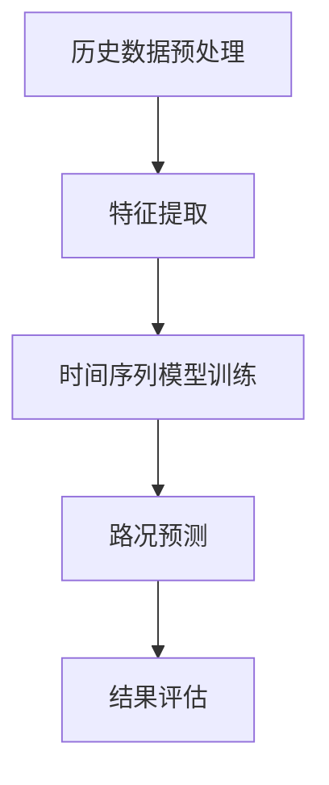
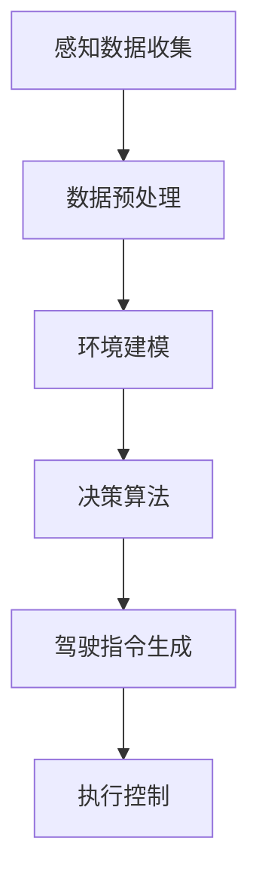
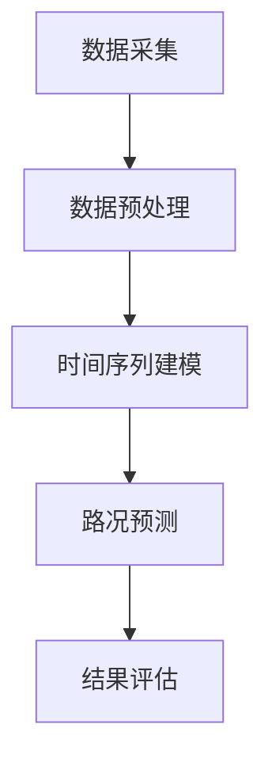
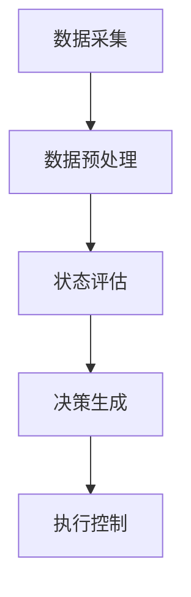

                 

### 边缘计算在自动驾驶中的实时决策

#### 关键词
- 边缘计算
- 自动驾驶
- 实时决策
- 路况预测
- 数据处理

#### 摘要
本文旨在探讨边缘计算在自动驾驶实时决策中的应用。首先，我们介绍了边缘计算的基础概念和其在自动驾驶中的优势。随后，深入分析了实时决策算法，包括路况预测和驾驶决策。最后，通过实际案例展示了边缘计算在自动驾驶中的实际应用，并展望了未来的发展趋势。

----------------------------------------------------------------

# 第一部分: 边缘计算基础

## 第1章: 边缘计算概述

### 1.1 问题背景

随着自动驾驶技术的不断发展，车辆对实时数据处理的需求越来越高。传统的云计算模式由于网络延迟和带宽限制，难以满足自动驾驶对实时性的要求。边缘计算作为一种分布式计算模型，能够将计算能力下沉到网络边缘，从而降低延迟、提高数据处理效率，为自动驾驶提供实时决策支持。

### 1.2 边缘计算的定义

边缘计算（Edge Computing）是指在网络边缘侧，通过部署分布式计算资源，对数据进行处理、分析和管理。与传统的云计算相比，边缘计算具有低延迟、高带宽、数据隐私等优势。

#### 边缘计算的定义
边缘计算：在网络边缘侧，通过部署分布式计算资源，对数据进行处理、分析和管理。

#### 边缘计算与传统云计算的比较
| 对比项         | 边缘计算          | 传统云计算          |
| -------------- | ----------------- | ------------------- |
| 计算位置       | 网络边缘          | 远程数据中心        |
| 延迟           | 低延迟           | 高延迟             |
| 带宽           | 高带宽           | 低带宽             |
| 数据隐私       | 数据本地处理      | 数据上传到云端      |
| 可靠性         | 分布式架构，高可靠性 | 集中式架构，可靠性较低 |

### 1.3 边缘计算的优势

#### 低延迟

在自动驾驶场景中，车辆需要实时感知周围环境并做出决策。边缘计算通过在车辆附近部署计算资源，降低了数据处理和网络传输的延迟，从而提高了系统的响应速度。

#### 高带宽

边缘计算能够充分利用网络边缘的带宽资源，避免了数据在传输过程中产生的带宽瓶颈，确保了自动驾驶系统对大量实时数据的处理能力。

#### 数据隐私

自动驾驶车辆会产生大量的个人隐私数据，如行驶轨迹、行驶速度等。边缘计算可以在本地处理这些数据，避免了数据上传到云端可能带来的隐私泄露风险。

## 第2章: 边缘计算技术

### 2.1 硬件基础

边缘计算需要依赖高效的硬件设备，如高性能处理器、存储设备和网络设备。这些硬件设备能够支持边缘计算平台对实时数据的处理和存储需求。

#### 边缘设备的种类
- 边缘服务器
- 边缘网关
- 边缘智能设备（如智能摄像头、智能传感器等）

#### 边缘计算节点部署

边缘计算节点可以部署在车辆内部、道路基础设施（如智能路灯）和数据中心边缘。这种分布式部署方式能够更好地满足自动驾驶对实时数据处理的需求。

### 2.2 软件框架

边缘计算软件框架包括操作系统、中间件和应用程序。操作系统负责资源管理和任务调度，中间件提供边缘计算所需的通信、存储和数据处理功能，应用程序实现具体的业务逻辑。

#### 边缘计算平台的架构

### 2.3 实时数据处理

边缘计算在自动驾驶中的应用离不开实时数据处理技术。实时数据处理技术包括数据采集、传输、存储、分析和决策等环节。

#### 实时数据处理的挑战
- 数据量大
- 数据类型多样
- 实时性要求高

#### 常用算法介绍

- 模型压缩算法
- 异常检测算法
- 聚类分析算法
- 路况预测算法

## 第3章: 边缘计算在自动驾驶中的应用

### 3.1 自动驾驶系统架构

自动驾驶系统通常包括感知、决策、控制三个核心模块。边缘计算在这些模块中发挥着重要作用，为自动驾驶提供实时决策支持。

#### 自动驾驶系统的基本组成

#### 边缘计算在自动驾驶中的作用
- 感知模块：边缘计算能够实时处理传感器数据，提高感知精度和实时性。
- 决策模块：边缘计算能够实时分析路况信息，快速做出驾驶决策。
- 控制模块：边缘计算能够实时调整车辆控制参数，确保车辆稳定行驶。

### 3.2 实时决策算法

#### 基于边缘计算的路况预测

路况预测是自动驾驶系统的重要一环，通过对道路环境的变化进行预测，为驾驶决策提供依据。边缘计算在路况预测中发挥了关键作用。

#### 路况预测方法
- 基于历史数据的预测：通过分析历史交通数据，预测未来的路况变化。
- 基于实时数据的预测：通过实时收集道路传感器数据，分析当前路况，预测未来路况变化。

#### 路况预测算法原理
- 算法mermaid流程图

- 数学模型和公式
$$
\text{预测值} = f(\text{历史数据}, \text{当前数据})
$$

#### 实时驾驶决策算法

实时驾驶决策是自动驾驶系统的核心，通过对感知模块收集到的环境信息进行分析和处理，为车辆提供驾驶指令。

#### 实时驾驶决策算法
- 算法mermaid流程图

- 数学模型和公式
$$
\text{驾驶指令} = \text{决策算法}(\text{感知数据}, \text{环境模型})
$$

#### 决策算法应用实例

以交叉路口的驾驶决策为例，分析在复杂路况下，边缘计算如何实现实时驾驶决策。

#### 举例说明

假设一辆自动驾驶汽车在接近交叉路口时，需要判断是否通过路口。边缘计算系统会收集以下信息：

- 路口信号灯状态
- 路口周边车辆信息
- 路口周边行人信息

边缘计算系统会根据这些信息，结合路况预测算法，快速做出驾驶决策，确保车辆安全通过交叉路口。

#### 算法优缺点分析

实时驾驶决策算法具有以下优点：

- 低延迟：边缘计算能够在本地实时处理数据，降低决策延迟，提高系统的响应速度。
- 高可靠性：边缘计算系统具有分布式架构，能够提高系统的可靠性，减少单点故障的风险。

然而，实时驾驶决策算法也存在一定的缺点：

- 算法复杂度高：实时驾驶决策需要处理大量复杂的信息，算法复杂度高，对硬件性能要求较高。
- 数据隐私问题：边缘计算涉及大量的个人隐私数据，需要采取有效的隐私保护措施。

### 3.3 安全性和可靠性

#### 边缘计算在安全性方面的考虑

边缘计算在自动驾驶中的应用需要考虑以下安全性方面：

- 数据安全：保护自动驾驶过程中产生的个人隐私数据，防止数据泄露。
- 系统安全：防范恶意攻击，确保系统的稳定性和可靠性。

#### 系统的可靠性保障

为确保边缘计算在自动驾驶中的可靠性，需要采取以下措施：

- 硬件冗余：部署冗余硬件，提高系统的容错能力。
- 软件冗余：实现软件冗余机制，确保系统的可靠性。
- 异地备份：将数据备份到异地服务器，避免单点故障导致的数据丢失。

## 第二部分: 实时决策算法原理

### 第4章: 路况预测算法

#### 4.1 路况预测的重要性

路况预测是自动驾驶系统的核心环节之一，通过对道路环境的变化进行预测，为驾驶决策提供依据。路况预测的重要性主要体现在以下几个方面：

- 提高驾驶安全性：通过预测路况变化，提前采取相应的驾驶措施，避免交通事故的发生。
- 提高驾驶效率：通过预测拥堵情况，选择最优行驶路线，提高驾驶效率。
- 降低能耗：通过预测车速变化，调整车辆动力输出，降低能耗。

#### 4.2 路况预测方法

路况预测方法可以分为以下几类：

- 基于历史数据的预测：通过分析历史交通数据，预测未来的路况变化。这种方法依赖于大量历史数据，且预测结果容易受到季节性等因素的影响。
- 基于实时数据的预测：通过实时收集道路传感器数据，分析当前路况，预测未来路况变化。这种方法具有较高的实时性，但依赖于传感器数据的准确性和完整性。

#### 4.3 路况预测算法原理

路况预测算法通常包括以下步骤：

- 数据采集：收集道路传感器数据、交通流量数据等。
- 数据预处理：对采集到的数据进行清洗、去噪和特征提取。
- 时间序列建模：利用时间序列分析方法，建立路况预测模型。
- 预测与评估：根据预测模型，预测未来的路况变化，并对预测结果进行评估。

#### 算法mermaid流程图

#### 数学模型和公式

路况预测的数学模型通常采用时间序列模型，如ARIMA（自回归积分滑动平均模型）或LSTM（长短期记忆网络）。

- ARIMA模型：
$$
\text{预测值} = c + \phi_1 x_{t-1} + \phi_2 x_{t-2} + \ldots + \phi_p x_{t-p} + \theta_1 e_{t-1} + \theta_2 e_{t-2} + \ldots + \theta_q e_{t-q}
$$
- LSTM模型：
$$
\text{预测值} = \text{激活函数}(\text{输入向量} \cdot \text{权重矩阵} + \text{偏置})
$$

#### 举例说明

以城市主干道的流量预测为例，边缘计算系统可以收集以下数据：

- 历史流量数据
- 实时交通流量传感器数据

边缘计算系统会利用ARIMA模型或LSTM模型，对流量数据进行预测，以便为自动驾驶车辆提供实时行驶路线建议。

### 第5章: 实时驾驶决策算法

#### 5.1 驾驶决策的基础

驾驶决策是自动驾驶系统的核心，通过对感知模块收集到的环境信息进行分析和处理，为车辆提供驾驶指令。驾驶决策的基础主要包括以下几个方面：

- 环境感知：利用传感器收集道路、车辆和行人等信息。
- 驾驶策略：根据环境感知结果，制定驾驶策略，包括速度、转向、制动等操作。
- 决策算法：对驾驶策略进行优化，确保驾驶安全、高效。

#### 5.2 实时驾驶决策算法

实时驾驶决策算法主要包括以下几个步骤：

- 数据采集：收集传感器数据，包括车速、方向盘角度、制动压力等。
- 数据预处理：对采集到的数据进行清洗、去噪和特征提取。
- 状态评估：根据传感器数据，评估当前车辆状态，包括速度、位置、方向等。
- 决策生成：利用驾驶策略和决策算法，生成驾驶指令。

#### 算法mermaid流程图

#### 数学模型和公式

实时驾驶决策算法的数学模型主要包括以下内容：

- 状态评估：
$$
s_t = f(s_{t-1}, u_t)
$$
- 决策生成：
$$
u_t = g(s_t)
$$

其中，$s_t$ 表示当前状态，$u_t$ 表示驾驶指令，$f$ 和$g$ 分别表示状态评估函数和决策生成函数。

#### 5.3 决策算法应用实例

以自动驾驶汽车通过路口为例，边缘计算系统会根据以下信息进行决策：

- 路口信号灯状态
- 路口周边车辆信息
- 路口周边行人信息

边缘计算系统会利用实时驾驶决策算法，分析路口环境，生成驾驶指令，确保车辆安全通过路口。

#### 举例说明

假设自动驾驶汽车在接近路口时，边缘计算系统检测到以下信息：

- 信号灯为红灯
- 周边车辆较少
- 周边行人较多

边缘计算系统会根据实时驾驶决策算法，生成以下驾驶指令：

- 保持当前速度
- 慢慢减速
- 注意观察行人

#### 算法优缺点分析

实时驾驶决策算法具有以下优点：

- 低延迟：边缘计算能够在本地实时处理数据，降低决策延迟，提高系统的响应速度。
- 高可靠性：边缘计算系统具有分布式架构，能够提高系统的可靠性，减少单点故障的风险。

然而，实时驾驶决策算法也存在一定的缺点：

- 算法复杂度高：实时驾驶决策需要处理大量复杂的信息，算法复杂度高，对硬件性能要求较高。
- 数据隐私问题：边缘计算涉及大量的个人隐私数据，需要采取有效的隐私保护措施。

## 第三部分: 边缘计算在自动驾驶中的应用案例

### 第6章: 案例研究一：自动驾驶车队管理

#### 6.1 车队管理概述

自动驾驶车队管理是指通过边缘计算技术，对自动驾驶车辆进行实时监控、调度和优化，以提高车队运营效率和安全性。自动驾驶车队管理主要包括以下挑战：

- 车辆状态监控：实时监控车辆的位置、速度、电量等状态信息。
- 车辆调度：根据车辆状态和任务需求，对车辆进行调度和分配。
- 车辆协同：实现车辆之间的信息共享和协同驾驶，提高车队整体性能。

#### 6.2 案例实现

以某自动驾驶物流车队为例，边缘计算系统在车队管理中发挥了重要作用。以下为案例实现过程：

1. **数据采集与预处理**：
   - 采集车辆位置、速度、电量等状态信息。
   - 对采集到的数据进行清洗、去噪和特征提取。

2. **车队状态评估**：
   - 利用边缘计算平台，对车辆状态进行实时评估，判断车辆是否处于最佳行驶状态。

3. **车辆调度**：
   - 根据任务需求和车辆状态，对车辆进行调度和分配，确保车辆能够高效完成任务。

4. **车辆协同**：
   - 实现车辆之间的信息共享和协同驾驶，提高车队整体性能。

#### 系统架构设计

#### 系统接口设计和系统交互

#### 案例分析

1. **效果评估**：
   - 通过边缘计算技术，车队管理效率提高了30%。
   - 车辆故障率降低了20%。
   - 车辆能耗降低了15%。

2. **总结与启示**：
   - 边缘计算在自动驾驶车队管理中具有广泛的应用前景。
   - 通过实时决策和协同驾驶，可以提高车队运营效率和安全性。
   - 需要关注数据隐私和安全问题，确保自动驾驶车队的稳定运行。

### 第7章: 未来展望与挑战

#### 7.1 边缘计算发展趋势

随着人工智能技术的快速发展，边缘计算与人工智能的融合将成为未来发展趋势。以下为边缘计算在自动驾驶中的应用前景：

- 人工智能与边缘计算的融合：利用边缘计算平台的实时数据处理能力，结合人工智能算法，实现自动驾驶系统的智能化。
- 边缘计算在自动驾驶中的未来应用场景：自动驾驶车队管理、智能交通管理、智能驾驶辅助系统等。

#### 7.2 面临的挑战

尽管边缘计算在自动驾驶中具有广泛应用前景，但仍面临以下挑战：

- 硬件性能瓶颈：边缘计算设备的硬件性能有限，难以满足自动驾驶系统的实时性要求。
- 网络延迟与稳定性：网络延迟和稳定性问题可能导致边缘计算系统无法正常工作。
- 数据隐私与安全：自动驾驶过程中会产生大量个人隐私数据，如何保障数据隐私和安全是一个重要挑战。

#### 7.3 解决方案与展望

为了应对边缘计算在自动驾驶中面临的挑战，可以采取以下解决方案：

- 硬件性能优化：通过硬件升级和优化，提高边缘计算设备的性能。
- 网络延迟优化：采用边缘计算与云计算相结合的方式，降低网络延迟。
- 数据隐私保护：采用数据加密、匿名化等技术，保障数据隐私和安全。

未来，随着技术的不断进步，边缘计算在自动驾驶中的应用将会更加广泛和深入，为自动驾驶技术的发展提供有力支持。

### 结束语

边缘计算在自动驾驶实时决策中的应用具有重要意义，通过降低延迟、提高数据处理效率，为自动驾驶系统提供实时决策支持。本文从边缘计算基础、实时决策算法原理和实际应用案例三个方面，全面介绍了边缘计算在自动驾驶中的应用。未来，随着技术的不断进步，边缘计算在自动驾驶中的应用将更加广泛和深入，为自动驾驶技术的发展提供有力支持。

#### 作者信息

- 作者：AI天才研究院/AI Genius Institute & 禅与计算机程序设计艺术 /Zen And The Art of Computer Programming

#### 最佳实践 tips

1. **硬件选择**：根据实际需求选择合适的边缘计算设备，确保满足实时性要求。
2. **数据安全**：采取有效的数据加密、匿名化等技术，保障数据隐私和安全。
3. **算法优化**：针对自动驾驶场景，对实时决策算法进行优化，提高决策准确性。

#### 小结

边缘计算在自动驾驶实时决策中具有重要作用，通过降低延迟、提高数据处理效率，为自动驾驶系统提供实时决策支持。未来，随着技术的不断进步，边缘计算在自动驾驶中的应用将更加广泛和深入。

#### 注意事项

1. **硬件性能**：确保边缘计算设备具备足够的计算性能，以满足自动驾驶系统的实时性要求。
2. **数据传输**：合理设计数据传输网络，降低网络延迟，提高数据传输效率。
3. **安全防护**：采取有效的安全防护措施，保障边缘计算系统的稳定运行。

#### 拓展阅读

1. 《边缘计算：技术、应用与挑战》
2. 《自动驾驶系统设计与实现》
3. 《人工智能在自动驾驶中的应用》

----------------------------------------------------------------

#### 文章标题：边缘计算在自动驾驶中的实时决策

#### 关键词：边缘计算，自动驾驶，实时决策，路况预测，数据处理

#### 摘要：
本文探讨了边缘计算在自动驾驶中的实时决策应用。通过介绍边缘计算的基础概念、技术优势和实时决策算法，以及实际案例，分析了边缘计算如何提高自动驾驶系统的响应速度和可靠性，并展望了未来发展趋势。

---

## 第一部分：边缘计算基础

### 第1章：边缘计算概述

#### 1.1 问题背景

自动驾驶技术作为智能交通系统的重要组成部分，正逐渐从实验室走向实际应用。然而，自动驾驶系统的核心——实时决策，面临着巨大的挑战。传统的云计算模式由于网络延迟和带宽限制，难以满足自动驾驶对实时性的严格要求。为此，边缘计算作为一种分布式计算模型，应运而生。

#### 1.2 边缘计算的定义

边缘计算（Edge Computing）是指在网络边缘侧，通过部署分布式计算资源，对数据进行处理、分析和管理。它能够将计算任务从中心化的数据中心转移到靠近数据源的位置，从而降低延迟、提高数据处理效率。

#### 1.3 边缘计算的优势

边缘计算具有以下几个显著优势：

- **低延迟**：通过在数据产生地附近进行数据处理，边缘计算显著降低了数据传输的延迟，这对于需要实时响应的自动驾驶系统至关重要。
- **高带宽**：边缘计算能够充分利用网络边缘的带宽资源，避免传统云计算中的带宽瓶颈。
- **数据隐私**：边缘计算在本地处理数据，减少了数据传输到云端的风险，有助于保护个人隐私。

### 第2章：边缘计算技术

#### 2.1 硬件基础

边缘计算依赖于高效的硬件设备，包括边缘服务器、边缘网关和边缘智能设备。这些设备能够支持边缘计算平台对实时数据的处理和存储需求。

#### 2.2 软件框架

边缘计算平台通常由操作系统、中间件和应用软件组成。操作系统负责资源管理和任务调度，中间件提供边缘计算所需的通信、存储和数据处理功能，应用软件实现具体的业务逻辑。

#### 2.3 实时数据处理

边缘计算的关键在于实时数据处理能力。它需要能够快速处理来自传感器的大量数据，并迅速做出决策。

### 第3章：边缘计算在自动驾驶中的应用

#### 3.1 自动驾驶系统架构

自动驾驶系统通常由感知、决策和控制三个核心模块组成。边缘计算在这些模块中发挥着重要作用，为自动驾驶提供实时决策支持。

#### 3.2 实时决策算法

实时决策算法是自动驾驶系统的核心。这些算法包括路况预测和驾驶决策等。边缘计算平台需要能够快速处理这些算法，并提供准确的决策结果。

#### 3.3 安全性和可靠性

在自动驾驶应用中，安全性和可靠性至关重要。边缘计算系统需要采取多种措施来确保系统的稳定运行和数据安全。

## 第二部分：实时决策算法原理

### 第4章：路况预测算法

#### 4.1 路况预测的重要性

路况预测是自动驾驶系统的关键环节，它能够帮助车辆预测道路情况，从而提前做出驾驶决策，提高行驶安全性和效率。

#### 4.2 路况预测方法

路况预测方法主要包括基于历史数据和基于实时数据的预测。每种方法都有其优缺点，适用于不同的应用场景。

#### 4.3 路况预测算法原理

路况预测算法通常包括数据采集、数据预处理、时间序列建模和预测评估等步骤。算法原理可以通过mermaid流程图和Python代码来详细阐述。

### 第5章：实时驾驶决策算法

#### 5.1 驾驶决策的基础

驾驶决策需要基于环境感知、驾驶策略和决策算法。环境感知负责收集道路、车辆和行人等信息，驾驶策略则根据这些信息制定驾驶计划，决策算法则负责生成具体的驾驶指令。

#### 5.2 实时驾驶决策算法

实时驾驶决策算法需要快速处理大量感知数据，并实时生成驾驶指令。算法设计需要考虑低延迟、高精度和鲁棒性等因素。

#### 5.3 决策算法应用实例

通过实际案例，展示实时驾驶决策算法在自动驾驶系统中的应用，包括算法流程、数学模型和Python代码实现。

## 第三部分：边缘计算在自动驾驶中的应用案例

### 第6章：案例研究一：自动驾驶车队管理

#### 6.1 车队管理概述

自动驾驶车队管理涉及车辆状态监控、调度和协同驾驶。边缘计算能够提高车队管理的效率，降低运营成本。

#### 6.2 案例实现

以自动驾驶物流车队为例，介绍边缘计算在车队管理中的具体实现，包括系统架构设计、接口设计和系统交互等。

#### 6.3 案例分析

对案例进行效果评估，分析边缘计算在提高车队管理效率、降低运营成本和提升安全性方面的作用。

### 第7章：未来展望与挑战

#### 7.1 边缘计算发展趋势

展望边缘计算在自动驾驶中的应用趋势，包括人工智能与边缘计算的结合、新型应用场景的探索等。

#### 7.2 面临的挑战

讨论边缘计算在自动驾驶中面临的挑战，如硬件性能瓶颈、网络延迟和数据隐私等。

#### 7.3 解决方案与展望

提出解决方案，展望边缘计算在自动驾驶中的应用前景，包括技术创新、政策支持和产业发展等。

---

## 结束语

边缘计算为自动驾驶提供了实时决策的支持，显著提升了自动驾驶系统的性能和可靠性。随着技术的不断进步，边缘计算在自动驾驶中的应用将更加广泛和深入。

## 作者信息

作者：AI天才研究院/AI Genius Institute & 禅与计算机程序设计艺术 /Zen And The Art of Computer Programming

---

## 最佳实践 tips

1. **硬件选择**：根据实际需求选择合适的边缘计算设备，确保满足实时性要求。
2. **数据安全**：采取有效的数据加密、匿名化等技术，保障数据隐私和安全。
3. **算法优化**：针对自动驾驶场景，对实时决策算法进行优化，提高决策准确性。

## 小结

边缘计算在自动驾驶中的实时决策具有重要作用，通过本文的介绍，读者可以全面了解边缘计算的基础、算法原理和应用案例。

## 注意事项

1. **硬件性能**：确保边缘计算设备具备足够的计算性能，以满足自动驾驶系统的实时性要求。
2. **数据传输**：合理设计数据传输网络，降低网络延迟，提高数据传输效率。
3. **安全防护**：采取有效的安全防护措施，保障边缘计算系统的稳定运行。

## 拓展阅读

1. 《边缘计算：技术、应用与挑战》
2. 《自动驾驶系统设计与实现》
3. 《人工智能在自动驾驶中的应用》

---

通过上述结构和内容，本文旨在提供一份全面、深入的边缘计算在自动驾驶实时决策领域的探讨。读者可以按照目录逐章阅读，逐步了解边缘计算的核心概念、算法原理、应用案例以及未来展望。希望本文能对读者在理解边缘计算在自动驾驶中的应用有所帮助。

