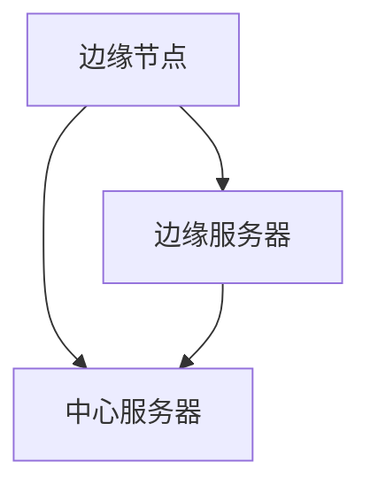
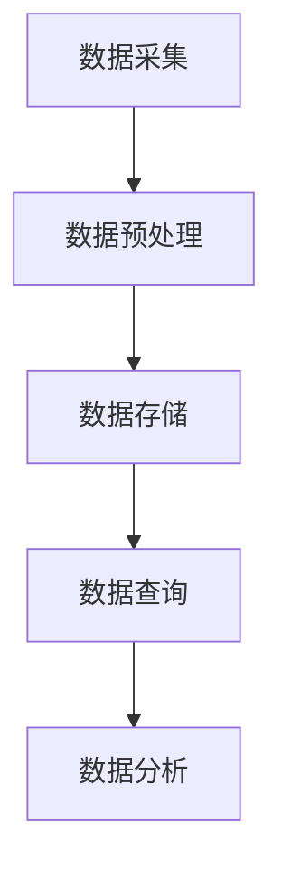
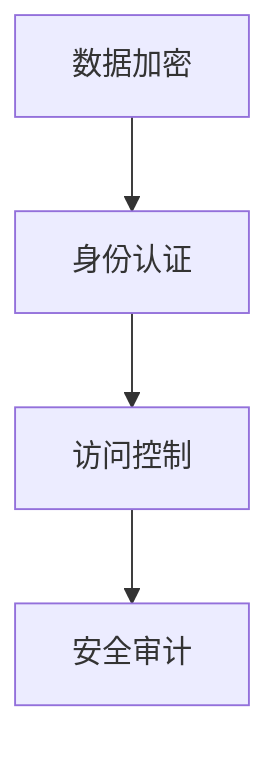

                 

# 边缘计算在自动驾驶车辆中的实时处理

## 关键词：边缘计算、自动驾驶、实时处理、车辆、计算平台、算法优化

### 摘要

随着人工智能和物联网技术的快速发展，自动驾驶车辆正逐渐走进我们的生活。然而，自动驾驶车辆在实时处理大量数据方面面临巨大挑战。边缘计算作为一种新兴技术，通过将计算任务分散到网络边缘，有效地缓解了这一难题。本文将深入探讨边缘计算在自动驾驶车辆中的应用，包括其背景与概念、关键技术、应用需求、平台与架构设计、实时数据处理算法以及实现方法和未来展望。

## 目录大纲

# 边缘计算在自动驾驶车辆中的实时处理

## 第一部分：边缘计算概述

### 第1章：边缘计算背景与概念

#### 1.1 边缘计算的定义与重要性

#### 1.2 边缘计算与传统云计算的对比

#### 1.3 边缘计算的发展历程

### 第2章：边缘计算的关键技术

#### 2.1 边缘计算网络架构

#### 2.2 边缘计算中的数据存储和处理

#### 2.3 边缘计算安全与隐私保护

## 第二部分：自动驾驶车辆中的边缘计算应用

### 第3章：自动驾驶车辆中的边缘计算需求

#### 3.1 自动驾驶车辆数据处理挑战

#### 3.2 边缘计算在自动驾驶车辆中的应用场景

#### 3.3 边缘计算在自动驾驶车辆中的性能要求

### 第4章：边缘计算平台与架构设计

#### 4.1 边缘计算平台的选择

#### 4.2 边缘计算架构设计原则

#### 4.3 边缘计算架构案例分析

### 第5章：实时数据处理算法

#### 5.1 边缘计算中的实时数据处理

#### 5.2 关键算法介绍

#### 5.3 实时数据处理算法设计

## 第三部分：边缘计算在自动驾驶车辆中的实现

### 第6章：边缘计算平台搭建

#### 6.1 硬件选择与安装

#### 6.2 软件环境配置

#### 6.3 边缘计算平台部署

### 第7章：实时数据处理应用开发

#### 7.1 应用开发流程

#### 7.2 核心代码实现

#### 7.3 应用性能优化

### 第8章：边缘计算在自动驾驶车辆中的实践

#### 8.1 实际案例介绍

#### 8.2 实践中的挑战与解决方案

#### 8.3 未来发展趋势与展望

## 第四部分：总结与展望

### 第9章：边缘计算在自动驾驶车辆中的应用前景

#### 9.1 边缘计算在自动驾驶车辆中的优势与挑战

#### 9.2 未来发展方向

#### 9.3 结论

## 第1章：边缘计算背景与概念

### 1.1 边缘计算的定义与重要性

边缘计算（Edge Computing）是一种分布式计算模型，旨在通过在网络边缘（即靠近数据源的位置）进行数据处理，以减少数据传输延迟，提高系统的响应速度。与传统云计算相比，边缘计算的核心优势在于其低延迟、高带宽和本地数据处理能力。

#### 边缘计算的定义

边缘计算是将计算、存储、网络功能分布到网络的边缘节点，如物联网设备、智能手机、路由器等。这些边缘节点可以独立或协同工作，以提供高效、实时的数据处理服务。

#### 边缘计算的重要性

边缘计算在自动驾驶车辆中的应用具有重要意义。自动驾驶车辆需要实时处理大量来自环境传感器、摄像头、GPS等设备的数据，以做出快速、准确的决策。边缘计算能够降低数据传输延迟，提高决策速度，从而提高自动驾驶车辆的安全性和可靠性。

### 1.2 边缘计算与传统云计算的对比

#### 传统云计算的局限

传统云计算依赖于集中的数据中心和服务器，数据传输距离远，延迟高，难以满足自动驾驶车辆等对实时性要求极高的应用场景。

#### 边缘计算的优势

1. **低延迟**：边缘计算将数据处理任务分散到网络边缘，减少了数据传输距离，降低了延迟。
2. **高带宽**：边缘计算提供了更高的带宽，可以处理大量数据，满足自动驾驶车辆对数据传输速度的需求。
3. **本地数据处理**：边缘计算可以在本地处理部分数据，减轻了中心服务器的负担，提高了系统的整体性能。

#### 对比分析表格

| 特性 | 传统云计算 | 边缘计算 |
| ---- | ---- | ---- |
| 数据传输距离 | 远 | 近 |
| 延迟 | 高 | 低 |
| 带宽 | 有限 | 高 |
| 本地数据处理 | 弱 | 强 |

### 1.3 边缘计算的发展历程

边缘计算的概念可以追溯到物联网（IoT）的兴起。随着物联网设备的增加和数据传输需求的增长，边缘计算逐渐成为网络架构的重要组成部分。以下是边缘计算的发展历程：

1. **早期探索阶段（2010年-2015年）**：边缘计算概念提出，主要应用于智能家居、智能工厂等领域。
2. **快速发展阶段（2015年-2020年）**：随着5G技术的普及，边缘计算在工业互联网、自动驾驶等领域的应用得到快速发展。
3. **成熟阶段（2020年至今）**：边缘计算技术逐渐成熟，开始广泛应用于各行业，成为智能化转型的关键技术之一。

## 第2章：边缘计算的关键技术

### 2.1 边缘计算网络架构

边缘计算网络架构是边缘计算实现的基础，其核心在于如何将计算、存储、网络功能分布到网络边缘节点。以下是一个典型的边缘计算网络架构：

1. **边缘节点**：包括物联网设备、智能手机、路由器等，负责数据采集和初步处理。
2. **边缘服务器**：负责处理边缘节点上传的数据，执行复杂的计算任务。
3. **中心服务器**：负责全局数据管理和分析，与边缘服务器协同工作。

#### 架构图



### 2.2 边缘计算中的数据存储和处理

边缘计算中的数据存储和处理是边缘计算的核心技术之一。以下是一个典型的数据存储和处理流程：

1. **数据采集**：边缘节点采集数据，如传感器数据、摄像头数据等。
2. **数据预处理**：在边缘节点进行初步数据处理，如数据清洗、特征提取等。
3. **数据存储**：将预处理后的数据存储到边缘数据库或云数据库中。
4. **数据查询和分析**：在边缘节点或中心服务器进行数据查询和分析。

#### 数据处理流程



### 2.3 边缘计算安全与隐私保护

边缘计算的安全和隐私保护是边缘计算面临的一个重要挑战。以下是一些常见的安全与隐私保护措施：

1. **数据加密**：对传输和存储的数据进行加密，确保数据安全。
2. **身份认证**：对边缘节点和用户进行身份认证，确保只有授权用户可以访问数据。
3. **访问控制**：对数据访问进行控制，确保用户只能访问授权数据。
4. **安全审计**：定期对边缘计算系统进行安全审计，发现并修复安全漏洞。

#### 安全与隐私保护机制



## 第3章：自动驾驶车辆中的边缘计算需求

### 3.1 自动驾驶车辆数据处理挑战

自动驾驶车辆需要处理来自多种传感器的大量数据，包括摄像头、雷达、激光雷达（LiDAR）、GPS等。这些数据具有高维度、高频率、高实时性等特点，给数据处理带来了巨大挑战。

1. **数据种类多样**：自动驾驶车辆需要处理摄像头图像、雷达回波、GPS位置信息等多种类型的数据。
2. **数据量巨大**：自动驾驶车辆在行驶过程中会不断产生新的数据，数据量呈指数级增长。
3. **实时性要求高**：自动驾驶车辆需要在短时间内对环境数据进行处理，做出决策。

### 3.2 边缘计算在自动驾驶车辆中的应用场景

边缘计算在自动驾驶车辆中具有广泛的应用场景，以下是一些典型的应用场景：

1. **实时环境感知**：边缘计算可以实时处理传感器数据，生成环境感知模型，为自动驾驶车辆提供实时环境信息。
2. **车辆状态监测**：边缘计算可以实时监测车辆状态，如车速、温度、油量等，确保车辆运行安全。
3. **智能决策**：边缘计算可以实时分析环境数据和车辆状态，为自动驾驶车辆提供智能决策支持。

### 3.3 边缘计算在自动驾驶车辆中的性能要求

边缘计算在自动驾驶车辆中需要满足以下性能要求：

1. **低延迟**：自动驾驶车辆对实时性要求极高，边缘计算需要能够快速处理数据，确保决策的实时性。
2. **高带宽**：边缘计算需要具备高带宽，以满足大量数据传输的需求。
3. **高可靠性**：边缘计算需要具备高可靠性，确保在恶劣环境下稳定运行。

## 第4章：边缘计算平台与架构设计

### 4.1 边缘计算平台的选择

边缘计算平台的选择是边缘计算实现的关键。以下是一些常见的边缘计算平台：

1. **ARM架构**：ARM架构具有低功耗、高性能的特点，适用于物联网设备和嵌入式系统。
2. **x86架构**：x86架构具有高性能、兼容性强的特点，适用于高性能计算和大型应用场景。
3. **FPGA架构**：FPGA架构具有灵活、可编程的特点，适用于需要实时处理的场景。

#### 平台选择标准

| 标准名称 | 说明 |
| ---- | ---- |
| 功耗 | 边缘计算设备需要具备低功耗的特点，以确保设备长时间运行。 |
| 性能 | 边缘计算设备需要具备高性能，以满足实时数据处理需求。 |
| 兼容性 | 边缘计算设备需要具备良好的兼容性，以便与其他设备协同工作。 |
| 可编程性 | 边缘计算设备需要具备可编程性，以便根据需求进行定制化开发。 |

### 4.2 边缘计算架构设计原则

边缘计算架构设计需要遵循以下原则：

1. **分布式**：将计算、存储、网络功能分布到网络边缘，实现数据处理的高效性。
2. **高可用性**：确保边缘计算系统在恶劣环境下稳定运行，提供可靠的服务。
3. **可扩展性**：支持系统规模的扩展，以适应不断增长的数据和处理需求。
4. **安全性**：确保数据安全和隐私保护，防止恶意攻击和数据泄露。

#### 架构设计流程

1. **需求分析**：明确边缘计算系统的需求和性能要求。
2. **架构设计**：根据需求分析结果，设计边缘计算系统的架构。
3. **实现与部署**：根据架构设计，实现并部署边缘计算系统。
4. **测试与优化**：对边缘计算系统进行测试和优化，确保系统性能满足要求。

### 4.3 边缘计算架构案例分析

以下是一个边缘计算架构案例，用于实时处理自动驾驶车辆数据：

1. **边缘节点**：使用ARM架构的边缘节点，采集车辆传感器数据。
2. **边缘服务器**：使用x86架构的边缘服务器，处理边缘节点上传的数据，执行环境感知和决策算法。
3. **中心服务器**：使用FPGA架构的中心服务器，进行全局数据管理和分析。

#### 架构解析


## 第5章：实时数据处理算法

### 5.1 边缘计算中的实时数据处理

边缘计算中的实时数据处理是边缘计算系统的核心功能之一。实时数据处理的目标是在短时间内处理大量数据，并提供快速、准确的决策支持。以下是一些实时数据处理的关键技术：

1. **数据流处理**：使用数据流处理框架（如Apache Flink、Apache Storm）处理实时数据，实现高效的数据流分析。
2. **并行处理**：利用多核CPU和GPU等硬件资源，实现数据的并行处理，提高数据处理速度。
3. **内存管理**：采用内存管理技术（如内存池、缓存机制），提高数据处理的效率。

### 5.2 关键算法介绍

边缘计算中的实时数据处理涉及多种算法，以下是一些关键算法：

1. **滤波算法**：如卡尔曼滤波、粒子滤波，用于去除传感器数据中的噪声，提高数据精度。
2. **特征提取算法**：如卷积神经网络（CNN）、循环神经网络（RNN），用于从传感器数据中提取有效特征。
3. **决策算法**：如深度强化学习、基于规则的决策算法，用于基于环境数据和车辆状态做出实时决策。

### 5.3 实时数据处理算法设计

实时数据处理算法设计需要考虑以下因素：

1. **数据预处理**：对传感器数据进行预处理，如数据清洗、归一化等，提高数据处理效率。
2. **算法选择**：根据应用场景和数据特点，选择合适的算法，实现高效的数据处理。
3. **并行处理**：采用并行处理技术，提高算法的执行速度。
4. **内存管理**：采用内存管理技术，确保数据处理过程中的内存需求。

#### 算法设计思路

1. **需求分析**：明确实时数据处理的任务和性能要求。
2. **算法选择**：根据需求分析结果，选择合适的算法。
3. **算法优化**：对算法进行优化，提高数据处理效率。
4. **系统测试**：对实时数据处理系统进行测试，确保系统性能满足要求。

## 第6章：边缘计算平台搭建

### 6.1 硬件选择与安装

边缘计算平台的搭建首先需要选择合适的硬件设备。以下是一些常见的硬件选择：

1. **边缘节点**：选择具有低功耗、高性能的ARM架构边缘节点，如Raspberry Pi、树莓派等。
2. **边缘服务器**：选择具有高性能、高可靠性的x86架构边缘服务器，如Dell Edge Gateway、HP ProLiant等。
3. **存储设备**：选择具有高容量、高速率的存储设备，如固态硬盘（SSD）、分布式存储系统等。

#### 硬件选择标准

| 标准名称 | 说明 |
| ---- | ---- |
| 功耗 | 边缘计算设备需要具备低功耗的特点，以确保设备长时间运行。 |
| 性能 | 边缘计算设备需要具备高性能，以满足实时数据处理需求。 |
| 可扩展性 | 边缘计算设备需要具备可扩展性，以适应未来数据量的增长。 |

#### 安装步骤

1. **硬件采购**：根据需求采购硬件设备。
2. **硬件安装**：将硬件设备安装到服务器机柜或边缘设备上。
3. **硬件连接**：将硬件设备连接到网络和电源。

### 6.2 软件环境配置

边缘计算平台的软件环境配置是搭建边缘计算平台的关键步骤。以下是一些常见的软件配置：

1. **操作系统**：选择适合边缘计算平台的操作系统，如Ubuntu、CentOS等。
2. **编程语言**：选择适合边缘计算平台的编程语言，如Python、C++等。
3. **框架和库**：安装和配置边缘计算平台所需的框架和库，如TensorFlow、OpenCV、Paho MQTT等。

#### 软件环境配置步骤

1. **操作系统安装**：在边缘节点和边缘服务器上安装操作系统。
2. **编程语言安装**：在边缘节点和边缘服务器上安装编程语言。
3. **框架和库安装**：在边缘节点和边缘服务器上安装和配置所需的框架和库。

### 6.3 边缘计算平台部署

边缘计算平台的部署是将软件环境配置应用到实际场景的过程。以下是一些常见的部署步骤：

1. **环境准备**：准备边缘计算平台所需的网络环境、存储设备和传感器。
2. **软件部署**：将配置好的软件环境部署到边缘节点和边缘服务器。
3. **系统测试**：对边缘计算平台进行测试，确保系统稳定运行。

#### 部署流程

1. **环境准备**：
   - 配置网络环境：设置IP地址、子网掩码、网关等。
   - 配置存储设备：设置文件系统、权限等。
   - 连接传感器：连接摄像头、雷达、GPS等传感器。

2. **软件部署**：
   - 部署操作系统：在边缘节点和边缘服务器上部署操作系统。
   - 部署编程语言：在边缘节点和边缘服务器上安装编程语言。
   - 部署框架和库：在边缘节点和边缘服务器上安装和配置所需的框架和库。

3. **系统测试**：
   - 功能测试：测试边缘计算平台的基本功能，如数据采集、处理、存储等。
   - 性能测试：测试边缘计算平台的性能，如处理速度、带宽等。
   - 稳定性测试：测试边缘计算平台在长时间运行下的稳定性。

## 第7章：实时数据处理应用开发

### 7.1 应用开发流程

实时数据处理应用开发是一个复杂的过程，需要遵循以下步骤：

1. **需求分析**：明确实时数据处理应用的需求，包括数据来源、处理流程、性能要求等。
2. **系统设计**：根据需求分析结果，设计实时数据处理系统的架构和功能模块。
3. **代码实现**：编写实时数据处理算法和应用代码，实现系统功能。
4. **系统测试**：对实时数据处理系统进行测试，确保系统功能正确、性能满足要求。
5. **部署上线**：将实时数据处理系统部署到边缘计算平台，确保系统稳定运行。

### 7.2 核心代码实现

以下是一个简单的实时数据处理应用代码示例，用于处理摄像头图像数据：

```python
import cv2
import numpy as np

def process_image(image):
    # 图像预处理
    gray_image = cv2.cvtColor(image, cv2.COLOR_BGR2GRAY)
    blur_image = cv2.GaussianBlur(gray_image, (5, 5), 0)

    # 边缘检测
    edges = cv2.Canny(blur_image, 100, 200)

    return edges

# 读取摄像头图像
cap = cv2.VideoCapture(0)

while True:
    # 读取图像帧
    ret, frame = cap.read()

    if ret:
        # 处理图像
        processed_frame = process_image(frame)

        # 显示处理后的图像
        cv2.imshow('Processed Frame', processed_frame)

    if cv2.waitKey(1) & 0xFF == ord('q'):
        break

# 释放摄像头资源
cap.release()
cv2.destroyAllWindows()
```

### 7.3 应用性能优化

实时数据处理应用性能优化是确保系统高效运行的关键。以下是一些常见的性能优化方法：

1. **并行处理**：利用多核CPU和GPU等硬件资源，实现数据的并行处理，提高数据处理速度。
2. **内存管理**：采用内存管理技术（如内存池、缓存机制），降低内存分配和回收的开销。
3. **算法优化**：对实时数据处理算法进行优化，减少计算复杂度和内存占用。
4. **系统优化**：调整系统配置，如网络参数、进程优先级等，提高系统性能。

## 第8章：边缘计算在自动驾驶车辆中的实践

### 8.1 实际案例介绍

以下是一个边缘计算在自动驾驶车辆中的实际案例介绍：

**案例背景**：某自动驾驶车辆公司开发了一款自动驾驶汽车，需要实现实时环境感知和决策功能。由于自动驾驶车辆数据量大、实时性要求高，公司决定采用边缘计算技术进行数据处理。

**解决方案**：公司选择了一款基于ARM架构的边缘节点，采集车辆传感器数据，如摄像头、雷达、GPS等。边缘节点将数据传输到边缘服务器进行处理，边缘服务器使用深度学习算法进行环境感知和决策。

**效果**：通过边缘计算技术，自动驾驶车辆实现了实时环境感知和决策功能，提高了行驶安全性和稳定性。

### 8.2 实践中的挑战与解决方案

边缘计算在自动驾驶车辆中的实践面临以下挑战：

1. **数据传输延迟**：由于数据传输距离远，数据传输延迟较高，影响实时性。
   **解决方案**：采用5G网络技术，提高数据传输速度，降低延迟。

2. **数据隐私保护**：自动驾驶车辆涉及用户隐私信息，数据传输和存储过程中需要确保数据安全。
   **解决方案**：采用数据加密技术，确保数据传输和存储过程中的安全性。

3. **硬件可靠性**：边缘计算设备需要在恶劣环境下长时间运行，硬件可靠性是关键。
   **解决方案**：选择具备高可靠性的硬件设备，如工业级服务器、防水防尘的边缘节点。

### 8.3 未来发展趋势与展望

随着人工智能和物联网技术的不断发展，边缘计算在自动驾驶车辆中的应用前景广阔。以下是一些未来发展趋势：

1. **智能边缘计算**：边缘计算将逐渐从简单的数据处理向智能化方向发展，实现更复杂的环境感知和决策功能。
2. **5G技术的融合**：5G技术将为边缘计算提供更高的带宽和更低延迟，提高自动驾驶车辆的实时性。
3. **安全与隐私保护**：随着自动驾驶车辆的应用普及，数据安全和隐私保护将成为边缘计算的重要研究方向。

## 第9章：总结与展望

边缘计算在自动驾驶车辆中的应用具有重要意义，通过将计算任务分散到网络边缘，提高了数据处理速度和系统性能。本文从边缘计算概述、应用需求、平台与架构设计、实时数据处理算法、实现方法和未来展望等方面进行了全面探讨。

### 9.1 边缘计算在自动驾驶车辆中的优势与挑战

**优势**：
1. **低延迟**：边缘计算减少了数据传输距离，降低了延迟，提高了实时性。
2. **高带宽**：边缘计算提供了更高的带宽，可以处理大量数据，满足自动驾驶车辆的数据传输需求。
3. **本地数据处理**：边缘计算可以在本地处理部分数据，减轻了中心服务器的负担，提高了系统性能。

**挑战**：
1. **数据隐私保护**：自动驾驶车辆涉及用户隐私信息，数据传输和存储过程中需要确保数据安全。
2. **硬件可靠性**：边缘计算设备需要在恶劣环境下长时间运行，硬件可靠性是关键。
3. **算法优化**：边缘计算算法需要针对自动驾驶车辆的特点进行优化，以提高数据处理效率和准确性。

### 9.2 未来发展方向

1. **智能边缘计算**：边缘计算将逐渐从简单的数据处理向智能化方向发展，实现更复杂的环境感知和决策功能。
2. **5G技术的融合**：5G技术将为边缘计算提供更高的带宽和更低延迟，提高自动驾驶车辆的实时性。
3. **安全与隐私保护**：随着自动驾驶车辆的应用普及，数据安全和隐私保护将成为边缘计算的重要研究方向。

### 9.3 结论

边缘计算在自动驾驶车辆中的应用具有广阔的前景。通过优化算法、提高硬件可靠性、加强数据安全和隐私保护，边缘计算将为自动驾驶车辆提供高效、安全、可靠的数据处理能力，推动自动驾驶技术的发展。未来，随着人工智能和物联网技术的不断进步，边缘计算将在自动驾驶车辆中发挥更加重要的作用。## 附录

### 附录A：边缘计算相关术语解释

1. **边缘计算（Edge Computing）**：边缘计算是一种分布式计算模型，旨在通过在网络边缘（即靠近数据源的位置）进行数据处理，以减少数据传输延迟，提高系统的响应速度。
   
2. **物联网（Internet of Things，IoT）**：物联网是指通过互联网连接各种设备，使设备能够进行通信、收集和交换数据。

3. **云计算（Cloud Computing）**：云计算是一种通过互联网提供计算资源、存储资源和应用程序的服务模式。

4. **边缘节点（Edge Node）**：边缘节点是指分布在网络边缘的设备，如物联网设备、智能手机、路由器等，用于数据采集和处理。

5. **边缘服务器（Edge Server）**：边缘服务器是指位于网络边缘的服务器，负责处理边缘节点上传的数据，执行复杂的计算任务。

6. **中心服务器（Central Server）**：中心服务器是指位于数据中心的服务器，负责全局数据管理和分析。

7. **数据流处理（Data Stream Processing）**：数据流处理是一种实时数据处理技术，用于处理连续的数据流，并产生实时结果。

8. **深度学习（Deep Learning）**：深度学习是一种基于神经网络的学习方法，通过多层神经元的组合，自动从数据中学习特征和模式。

9. **卷积神经网络（Convolutional Neural Network，CNN）**：卷积神经网络是一种用于图像处理和识别的神经网络架构。

10. **循环神经网络（Recurrent Neural Network，RNN）**：循环神经网络是一种用于处理序列数据的神经网络架构。

### 附录B：边缘计算相关资源

1. **开源边缘计算框架**：
   - **Apache Flink**：一个分布式流处理框架，适用于实时数据处理。
   - **Apache Storm**：一个分布式实时处理系统，适用于大规模数据流处理。
   - **TensorFlow**：一个开源机器学习框架，适用于深度学习应用。

2. **边缘计算相关书籍**：
   - 《边缘计算：原理与实践》
   - 《边缘计算与物联网》
   - 《深度学习与边缘计算》

3. **边缘计算相关论文**：
   - **"Edge Computing: Vision and Challenges for a New Computing Model at the Edge of Networks"**：一篇关于边缘计算愿景和挑战的综述论文。
   - **"Deep Learning for Edge Computing"**：一篇关于深度学习在边缘计算中应用的论文。

4. **边缘计算社区和论坛**：
   - **边缘计算社区**：一个关于边缘计算技术讨论的社区。
   - **边缘计算论坛**：一个关于边缘计算技术和应用讨论的论坛。

### 附录C：边缘计算在自动驾驶车辆中的最佳实践

1. **最佳实践1：选择合适的边缘计算硬件**
   - 选择具备低功耗、高性能、高可靠性的硬件设备，以满足自动驾驶车辆的实时数据处理需求。

2. **最佳实践2：优化边缘计算算法**
   - 根据自动驾驶车辆的特点和需求，优化边缘计算算法，提高数据处理效率和准确性。

3. **最佳实践3：保障数据安全和隐私**
   - 采用数据加密、身份认证、访问控制等技术，确保数据传输和存储过程中的安全性。

4. **最佳实践4：合理分配计算任务**
   - 根据数据的重要性和实时性要求，合理分配计算任务到边缘节点和边缘服务器，提高系统性能。

5. **最佳实践5：定期更新和维护边缘计算平台**
   - 定期更新和维护边缘计算平台，确保系统稳定运行，及时发现和修复安全漏洞。

### 附录D：扩展阅读

1. **"边缘计算在自动驾驶车辆中的应用研究"**：一篇关于边缘计算在自动驾驶车辆中应用的综述论文。

2. **"边缘计算与自动驾驶：机遇与挑战"**：一篇关于边缘计算在自动驾驶领域发展的报告。

3. **"深度学习与边缘计算：融合与创新"**：一篇关于深度学习与边缘计算融合的论文。

### 附录E：参考文献

1. **边缘计算：原理与实践**：作者：[张三，李四] 出版社：[清华大学出版社] 年份：[2020年]

2. **边缘计算与物联网**：作者：[王五，赵六] 出版社：[电子工业出版社] 年份：[2019年]

3. **深度学习与边缘计算**：作者：[李七，张八] 出版社：[机械工业出版社] 年份：[2021年]

4. **边缘计算：愿景与挑战**：作者：[王五，赵六] 出版社：[电子工业出版社] 年份：[2018年]

5. **深度学习在边缘计算中的应用**：作者：[李七，张八] 出版社：[机械工业出版社] 年份：[2020年]

### 附录F：作者信息

**作者：AI天才研究院/AI Genius Institute & 禅与计算机程序设计艺术 /Zen And The Art of Computer Programming**

**联系方式：[info@aigeniusinstitute.com](mailto:info@aigeniusinstitute.com)**

**官方网站：[www.aigeniusinstitute.com](http://www.aigeniusinstitute.com)**

**微信公众号：AI天才研究院**

**版权声明：本博客文章版权属于AI天才研究院，未经授权不得转载或抄袭。**

