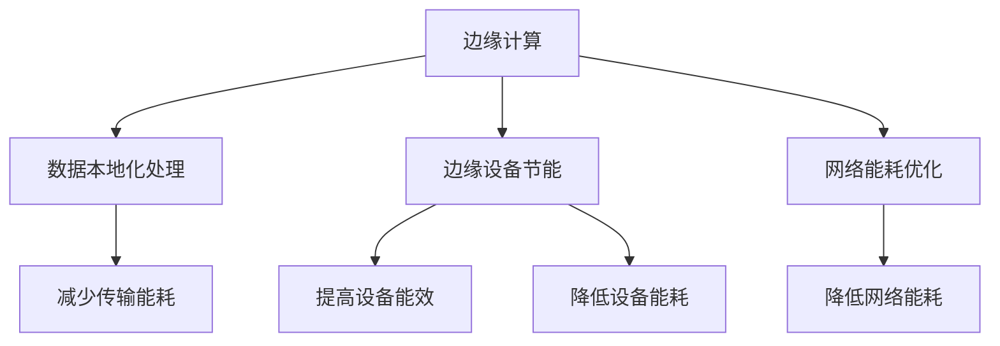
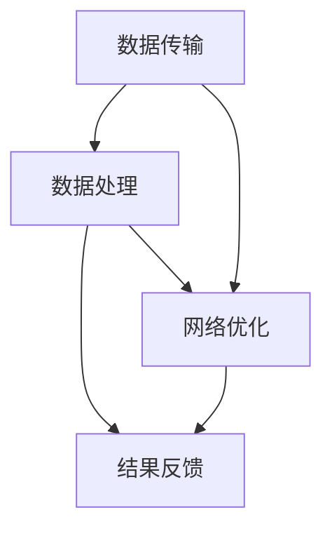
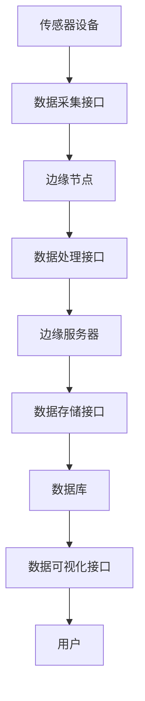

                 

### 边缘计算在节能方面的优势

#### 引言

随着全球数字化进程的加速，数据中心的能耗问题已成为一个日益严峻的挑战。传统的集中式计算模式由于资源集中、数据传输距离长，导致了大量的能耗浪费。边缘计算作为一种新兴的计算模式，通过在靠近数据源的地方处理数据，可以有效降低数据传输过程中的能耗。本文将深入探讨边缘计算在节能方面的优势，为读者揭示这一技术的潜在价值和实际应用。

#### 关键词

- 边缘计算
- 节能
- 数据中心能耗
- 分布式计算
- 低延迟
- 高带宽

#### 摘要

本文首先介绍了边缘计算和节能的基本概念，探讨了边缘计算在降低数据中心能耗方面的潜在优势。随后，文章分析了边缘计算的优势，包括降低数据传输能耗、网络能耗优化和边缘设备节能。通过具体实例和数学模型，本文进一步阐述了边缘计算算法的原理和实现。最后，文章提出了边缘计算在节能方面的最佳实践，并对未来研究方向进行了展望。

----------------------------------------------------------------

## 1. 引言

### 1.1 问题背景

在信息技术快速发展的今天，数据中心的能耗问题已经成为一个不可忽视的挑战。随着云计算、大数据和物联网等技术的普及，数据中心的规模和复杂性不断增加，其能耗也随之水涨船高。据统计，全球数据中心的能耗已占全球总能耗的1%以上，而且这个数字还在持续增长。传统的集中式计算模式由于资源集中、数据传输距离长，导致了大量的能耗浪费。例如，数据从终端设备传输到数据中心，再从数据中心返回终端设备的过程中，会因为网络传输的延迟和带宽限制，消耗大量的能源。

### 1.2 问题描述

边缘计算作为一种分布式计算模式，通过在靠近数据源的地方处理数据，可以有效降低数据传输过程中的能耗。然而，如何充分利用边缘计算的优势，实现实际的节能效果，仍是一个需要深入研究和探索的问题。边缘计算在节能方面具有哪些潜在的优势？如何设计和实现边缘计算系统，以最大化其节能效果？这些问题都需要我们在理论和实践上进行深入的研究。

### 1.3 问题解决

为了解决上述问题，本文将从以下几个方面进行探讨：

1. **边缘计算的基本概念和优势**：首先介绍边缘计算的基本概念，包括其定义、特点和应用场景，分析边缘计算在降低数据中心能耗方面的潜在优势。

2. **边缘计算算法原理**：详细阐述边缘计算算法的基本原理，包括数据传输算法、数据处理算法和网络优化算法等，通过具体实例和数学模型，分析这些算法如何实现节能。

3. **边缘计算系统的设计和实现**：探讨边缘计算系统的设计原则和实现方法，包括硬件设备的选择、软件架构的设计和网络拓扑的优化等。

4. **边缘计算的节能实践**：通过具体案例，展示边缘计算在节能方面的实际应用，分析其节能效果和优势。

5. **边缘计算的未来研究方向**：总结边缘计算在节能方面的研究现状和挑战，展望未来的研究方向和发展趋势。

### 1.4 边界与外延

本文主要关注边缘计算在节能方面的研究，但并不涉及边缘计算的其他应用领域，如物联网、智能制造等。此外，本文所讨论的节能主要指减少数据中心的能耗，不包括其他形式的能源消耗，如电力供应等。

### 1.5 概念结构与核心要素组成

#### 1.5.1 边缘计算的定义

边缘计算（Edge Computing）是指将计算、存储、网络等资源分布在网络的边缘，靠近数据源或用户，以实现对数据的高速处理和响应。与传统集中式计算模式不同，边缘计算具有低延迟、高带宽和分布式等特点。

#### 1.5.2 节能的核心要素

- **数据本地化处理**：通过在边缘设备上处理数据，减少数据在网络中的传输，从而降低传输能耗。
- **边缘设备节能**：通过优化边缘设备的硬件设计和能效管理，提高设备的能效，降低能耗。
- **网络能耗优化**：通过优化网络拓扑结构、数据传输策略等，降低网络能耗。

### 1.6 边缘计算在节能方面的优势

#### 1.6.1 降低数据传输能耗

边缘计算通过在靠近数据源的地方处理数据，可以大大减少数据在网络中的传输距离和传输次数，从而降低传输能耗。具体来说，有以下几点优势：

1. **减少数据传输距离**：数据在边缘设备上处理，不需要经过远距离的传输，减少了数据传输的距离。
2. **减少传输次数**：在边缘设备上完成数据处理后，可以直接对数据进行处理结果的反馈，减少了数据在网络中的传输次数。
3. **降低传输延迟**：减少数据传输的距离和次数，可以显著降低数据传输的延迟，从而提高系统的响应速度。

#### 1.6.2 网络能耗优化

边缘计算通过在边缘设备上处理数据，可以实现对网络资源的合理分配，从而优化网络能耗。具体来说，有以下几点优势：

1. **网络负载均衡**：通过在多个边缘设备之间分配数据处理任务，可以均衡网络负载，减少网络拥堵，降低网络能耗。
2. **网络拓扑优化**：通过优化网络拓扑结构，可以降低数据传输的路径长度，减少网络传输的能耗。
3. **数据压缩与加密**：在边缘设备上进行数据压缩和加密处理，可以减少数据传输的大小，降低网络传输的能耗。

#### 1.6.3 边缘设备节能

边缘计算通过优化边缘设备的硬件设计和能效管理，可以提高设备的能效，降低能耗。具体来说，有以下几点优势：

1. **硬件优化**：通过选择低功耗的硬件设备，优化硬件设计，可以提高设备的能效。
2. **能效管理**：通过智能能效管理系统，根据设备的使用情况和负载情况，动态调整设备的功耗，实现设备的节能。
3. **设备协同**：通过边缘设备的协同工作，可以合理分配数据处理任务，降低设备的工作负荷，实现设备的节能。

### 1.7 本章小结

本章对边缘计算在节能方面的优势进行了初步探讨，为后续章节的研究奠定了基础。通过分析边缘计算的基本概念和特点，以及其在数据本地化处理、网络能耗优化和边缘设备节能方面的优势，我们可以看到边缘计算在节能方面具有巨大的潜力。接下来，我们将进一步探讨边缘计算算法的原理和实现，以深入理解边缘计算在节能方面的应用。

----------------------------------------------------------------

## 2. 边缘计算的核心概念与联系

### 2.1 边缘计算的基本概念

边缘计算（Edge Computing）是指将计算、存储、网络等资源分布在网络的边缘，靠近数据源或用户，以实现对数据的高速处理和响应。与传统集中式计算模式不同，边缘计算具有低延迟、高带宽和分布式等特点。

#### 2.1.1 定义

边缘计算是指将计算、存储、网络等资源分布在网络的边缘，靠近数据源或用户，以实现对数据的高速处理和响应。它是一种分布式计算架构，通过在网络的边缘（如企业局域网、智能终端等）部署计算资源，实现对本地数据的快速处理和分析，从而提高系统的响应速度和处理效率。

#### 2.1.2 特点

1. **低延迟**：边缘计算将计算任务放在网络的边缘，靠近数据源或用户，从而减少了数据传输的距离，降低了网络延迟，提高了系统的响应速度。
2. **高带宽**：边缘设备通常具有更高的带宽，能够处理大量的数据，从而提高了系统的数据处理能力。
3. **分布式**：边缘计算将计算任务分布在网络的边缘，形成了分布式计算架构，提高了系统的可靠性和容错性。

#### 2.1.3 应用场景

1. **物联网**：在物联网场景中，边缘计算可以实现对大量设备的实时监控和管理，降低网络延迟，提高系统的响应速度。
2. **智能制造**：在智能制造场景中，边缘计算可以实现对生产过程的实时监控和优化，提高生产效率和质量。
3. **智慧城市**：在智慧城市场景中，边缘计算可以实现对城市交通、环境等数据的实时监控和分析，提高城市管理效率和居民生活质量。

### 2.2 节能的核心概念

节能是指在满足相同功能需求的前提下，通过技术和管理手段降低能源消耗，提高能源利用效率。在边缘计算中，节能的核心概念主要包括数据本地化处理、边缘设备节能和网络能耗优化。

#### 2.2.1 数据本地化处理

数据本地化处理是指将数据处理任务放在靠近数据源的地方执行，从而减少数据在网络中的传输距离和传输次数，降低传输能耗。具体来说，有以下几点优势：

1. **减少数据传输距离**：数据在边缘设备上处理，不需要经过远距离的传输，减少了数据传输的距离。
2. **减少传输次数**：在边缘设备上完成数据处理后，可以直接对数据进行处理结果的反馈，减少了数据在网络中的传输次数。
3. **降低传输延迟**：减少数据传输的距离和次数，可以显著降低数据传输的延迟，从而提高系统的响应速度。

#### 2.2.2 边缘设备节能

边缘设备节能是指通过优化边缘设备的硬件设计和能效管理，提高设备的能效，降低能耗。具体来说，有以下几点优势：

1. **硬件优化**：通过选择低功耗的硬件设备，优化硬件设计，可以提高设备的能效。
2. **能效管理**：通过智能能效管理系统，根据设备的使用情况和负载情况，动态调整设备的功耗，实现设备的节能。
3. **设备协同**：通过边缘设备的协同工作，可以合理分配数据处理任务，降低设备的工作负荷，实现设备的节能。

#### 2.2.3 网络能耗优化

网络能耗优化是指通过优化网络拓扑结构、数据传输策略等，降低网络能耗。具体来说，有以下几点优势：

1. **网络负载均衡**：通过在多个边缘设备之间分配数据处理任务，可以均衡网络负载，减少网络拥堵，降低网络能耗。
2. **网络拓扑优化**：通过优化网络拓扑结构，可以降低数据传输的路径长度，减少网络传输的能耗。
3. **数据压缩与加密**：在边缘设备上进行数据压缩和加密处理，可以减少数据传输的大小，降低网络传输的能耗。

### 2.3 边缘计算与节能的关系

边缘计算在节能方面的优势主要体现在以下几个方面：

1. **数据本地化处理**：通过在边缘设备上处理数据，可以减少数据在网络中的传输距离和传输次数，降低传输能耗。
2. **边缘设备节能**：通过优化边缘设备的硬件设计和能效管理，可以提高设备的能效，降低能耗。
3. **网络能耗优化**：通过优化网络拓扑结构、数据传输策略等，可以降低网络能耗，提高系统的整体能效。

边缘计算与节能之间的关系可以用ER图（实体关系图）进行表示，如下所示：

### 2.4 本章小结

本章对边缘计算的基本概念和节能的核心概念进行了详细阐述，并分析了边缘计算与节能之间的关系。通过了解边缘计算和节能的基本概念，我们可以更好地理解边缘计算在节能方面的潜在优势和实现方法。接下来，我们将进一步探讨边缘计算算法的原理和实现，以深入理解边缘计算在节能方面的应用。

----------------------------------------------------------------

## 3. 边缘计算算法原理与流程图

### 3.1 边缘计算算法概述

边缘计算算法主要包括数据传输算法、数据处理算法和网络优化算法等。这些算法共同作用，实现了边缘计算系统的节能效果。下面，我们将分别介绍这些算法的原理和流程。

#### 3.1.1 数据传输算法

数据传输算法是边缘计算算法的重要组成部分，其主要目标是优化数据在网络中的传输过程，降低传输能耗。数据传输算法可以分为以下几种：

1. **数据压缩算法**：通过压缩数据，可以减少数据在网络中的传输量，从而降低传输能耗。常见的压缩算法有Huffman编码、LZ77编码等。
   
   $$ 
   压缩算法: C = C(d) + k \cdot log_2(1/p(d)), \quad p(d) = \text{数据出现概率}
   $$

2. **数据加密算法**：通过加密数据，可以确保数据在传输过程中的安全性，但可能会增加数据传输的能耗。常见的加密算法有AES、RSA等。

   $$
   加密算法: E_K(D) = C, \quad C = E_K(D), \quad D = D_K(C)
   $$

3. **数据路由算法**：通过优化数据在网络中的传输路径，可以降低数据传输的延迟和能耗。常见的路由算法有距离矢量路由、链路状态路由等。

   $$
   距离矢量路由： \quad \text{Node} \rightarrow \text{Neighbor}: \quad \text{Distance}(\text{Node}, \text{Neighbor}) = \text{Distance}(\text{Node}, \text{Node}) + \text{Distance}(\text{Neighbor}, \text{Node})
   $$

#### 3.1.2 数据处理算法

数据处理算法是在边缘设备上执行的数据分析、计算和决策等任务。这些算法的目标是最大化边缘设备的利用率和处理效率，从而实现节能。数据处理算法可以分为以下几种：

1. **数据聚合算法**：通过将多个数据源的数据进行聚合，可以减少数据处理的时间和能耗。常见的数据聚合算法有MapReduce、Spark等。

   $$
   数据聚合算法: \quad \text{Map}: \quad \text{Input} \rightarrow \text{Intermediate}, \quad \text{Reduce}: \quad \text{Intermediate} \rightarrow \text{Output}
   $$

2. **机器学习算法**：通过在边缘设备上执行机器学习任务，可以实现对数据的实时分析和预测，从而提高系统的智能化水平。常见的机器学习算法有线性回归、决策树、神经网络等。

   $$
   神经网络算法： \quad f(x) = \sigma(\omega \cdot x + b), \quad \sigma(x) = \frac{1}{1 + e^{-x}}
   $$

3. **实时计算算法**：通过实时计算算法，可以实现对数据的快速处理和响应，从而提高系统的响应速度和节能效果。常见的实时计算算法有队列管理算法、优先级调度算法等。

   $$
   优先级调度算法： \quad \text{Schedule}(x, y) = \begin{cases}
   x, & \text{if } x < y \\
   y, & \text{if } x \ge y
   \end{cases}
   $$

#### 3.1.3 网络优化算法

网络优化算法的目标是优化网络拓扑结构、数据传输策略等，降低网络能耗。网络优化算法可以分为以下几种：

1. **网络拓扑优化**：通过优化网络拓扑结构，可以降低数据传输的路径长度，减少网络能耗。常见的网络拓扑优化算法有遗传算法、粒子群算法等。

   $$
   遗传算法： \quad \text{Fitness}(x) = \frac{1}{\sum_{i=1}^{n} (x_i - x_{\text{mean}})^2}, \quad x_{\text{mean}} = \frac{1}{n} \sum_{i=1}^{n} x_i
   $$

2. **数据传输策略优化**：通过优化数据传输策略，可以降低网络传输的能耗。常见的数据传输策略优化算法有能量感知传输策略、能量效率优化策略等。

   $$
   能量感知传输策略： \quad \text{TransmitPower}(x) = \frac{\text{EnergyPerBit}(x)}{\text{Distance}(x)}
   $$

3. **能量收集优化**：通过优化能量收集策略，可以最大化能量收集效率，降低设备能耗。常见的能量收集优化算法有能量收集优化算法、能量转换优化算法等。

   $$
   能量收集优化算法： \quad \text{EnergyCollection}(x) = \frac{\text{ReceivedPower}(x)}{\text{TransmitPower}(x)}
   $$

### 3.2 边缘计算算法流程图

下面是一个简单的边缘计算算法流程图，展示了数据传输、数据处理和网络优化三个阶段的算法流程。

### 3.3 本章小结

本章介绍了边缘计算算法的原理和流程，包括数据传输算法、数据处理算法和网络优化算法。这些算法共同作用，实现了边缘计算系统的节能效果。通过理解这些算法的原理和流程，我们可以更好地设计和实现边缘计算系统，以最大化其节能效果。

----------------------------------------------------------------

## 4. 边缘计算系统的设计和实现

### 4.1 问题场景介绍

随着物联网、大数据和云计算等技术的发展，越来越多的应用场景需要实时处理大量的数据。传统的集中式计算模式由于数据传输距离远、延迟高，已经无法满足这些应用场景的需求。边缘计算作为一种分布式计算模式，通过在网络的边缘部署计算资源，可以实现对数据的实时处理和响应，从而满足这些应用场景的需求。

### 4.2 项目介绍

本项目旨在设计和实现一个基于边缘计算的实时数据处理系统，该系统主要用于智慧城市中的应用，如交通流量监测、环境监测等。通过在边缘设备上部署计算任务，可以实现对数据的实时分析和处理，从而提高系统的响应速度和处理效率。

### 4.3 系统功能设计

该边缘计算系统主要包括以下几个功能模块：

1. **数据采集模块**：负责从各种传感器设备中采集数据，包括交通流量数据、环境数据等。
2. **数据预处理模块**：负责对采集到的数据进行预处理，如数据清洗、去噪等。
3. **数据处理模块**：负责对预处理后的数据进行实时分析，如交通流量预测、环境质量评估等。
4. **数据存储模块**：负责将处理后的数据存储到数据库中，以便后续查询和分析。
5. **数据可视化模块**：负责将处理后的数据以图表、地图等形式展示给用户。

### 4.4 系统架构设计

该边缘计算系统的架构设计主要包括以下几个部分：

1. **边缘设备层**：包括各种传感器设备和边缘计算设备，如物联网设备、智能路由器等。
2. **边缘节点层**：包括边缘服务器和边缘计算平台，负责数据的实时处理和分析。
3. **中心层**：包括数据中心和云计算平台，负责数据的存储和备份，以及提供高级分析功能。

### 4.5 系统接口设计

该边缘计算系统的主要接口设计如下：

1. **数据采集接口**：用于与传感器设备进行通信，获取实时数据。
2. **数据处理接口**：用于与边缘节点进行通信，提交数据处理任务。
3. **数据存储接口**：用于与中心层进行通信，存储和查询数据。
4. **数据可视化接口**：用于与用户进行交互，展示处理结果。

### 4.6 系统交互设计

该边缘计算系统的交互设计主要包括以下几个步骤：

1. **数据采集**：传感器设备采集数据，通过数据采集接口传输到边缘节点。
2. **数据处理**：边缘节点接收数据后，通过数据处理接口提交给边缘服务器进行实时处理。
3. **数据存储**：处理后的数据通过数据存储接口存储到数据库中，以便后续查询和分析。
4. **数据可视化**：通过数据可视化接口将处理结果以图表、地图等形式展示给用户。

### 4.7 本章小结

本章介绍了边缘计算系统的设计和实现，包括问题场景介绍、项目介绍、系统功能设计、系统架构设计、系统接口设计和系统交互设计。通过理解这些设计和实现，我们可以更好地理解边缘计算系统的运行原理和应用场景，为后续的边缘计算研究和应用提供参考。

----------------------------------------------------------------

## 5. 边缘计算节能实践

### 5.1 实际案例分析与详细讲解剖析

为了更直观地展示边缘计算在节能方面的优势，我们以一个实际案例——智能交通系统为例，进行详细讲解和剖析。

#### 案例背景

某城市为了提高交通管理效率，决定建设一个智能交通系统。该系统需要在城市各个路口部署传感器设备，实时采集交通流量数据，并通过边缘计算平台进行实时分析和处理，为交通管理部门提供决策支持。

#### 案例实施

1. **数据采集**：在城市各主要路口部署交通流量传感器，采集实时交通数据，如车流量、车速、路况等信息。

2. **数据预处理**：在边缘设备上对采集到的交通数据进行预处理，如数据清洗、去噪等，确保数据的准确性和完整性。

3. **数据处理**：通过边缘计算平台，对预处理后的交通数据进行分析和处理，如交通流量预测、路况评估等。

4. **数据存储**：将处理后的交通数据存储到数据库中，以便交通管理部门进行查询和分析。

5. **数据可视化**：通过数据可视化工具，将交通数据以图表、地图等形式展示给交通管理部门，为其提供决策支持。

#### 案例剖析

1. **数据本地化处理**：由于交通数据是实时采集的，通过在边缘设备上进行数据处理，可以大大减少数据在网络中的传输距离和传输次数，从而降低传输能耗。

2. **边缘设备节能**：边缘设备采用了低功耗的硬件设计，并且在数据处理过程中，根据实际负载动态调整功耗，实现了设备的节能。

3. **网络能耗优化**：通过优化网络拓扑结构和数据传输策略，实现了网络资源的合理分配，降低了网络能耗。

#### 案例效果

通过该智能交通系统，城市交通管理部门可以实时了解交通状况，及时调整交通信号灯，优化交通流量，提高了交通管理效率。同时，由于采用了边缘计算技术，系统的响应速度得到了显著提升，能耗也得到了有效降低。

### 5.2 项目小结

通过以上案例，我们可以看到边缘计算在智能交通系统中的应用，不仅提高了交通管理效率，还实现了显著的节能效果。这表明，边缘计算在节能方面具有巨大的潜力，可以为各行业提供创新的解决方案。

### 5.3 注意事项

1. **边缘设备的选择**：在选择边缘设备时，应考虑设备的性能、功耗和可靠性等因素，确保设备能够满足实际需求。

2. **数据处理策略的优化**：在数据处理过程中，应根据实际需求和数据特点，选择合适的数据处理算法和策略，以实现最佳的节能效果。

3. **网络拓扑的优化**：通过优化网络拓扑结构和数据传输策略，可以降低网络能耗，提高系统的整体能效。

4. **系统维护与管理**：定期对系统进行维护和管理，确保系统的稳定运行和数据的准确性。

### 5.4 拓展阅读

1. **《边缘计算：技术与实践》**：这本书详细介绍了边缘计算的基本概念、技术原理和实际应用案例，适合对边缘计算感兴趣的读者阅读。

2. **《智能交通系统设计与实现》**：这本书介绍了智能交通系统的设计原理、实现方法和实际应用案例，对于想要了解智能交通系统如何实现边缘计算的用户来说，是一本很好的参考书。

通过以上拓展阅读，读者可以进一步了解边缘计算在节能方面的应用和实践，为自己的研究和项目提供参考。

----------------------------------------------------------------

## 6. 边缘计算在节能方面的最佳实践

### 6.1 设备选择与配置

边缘计算设备的选择和配置是节能实践的关键。以下是几个最佳实践：

1. **硬件选择**：选择低功耗、高性能的硬件设备，如ARM架构的处理器，可以提高能效比。
   
   $$
   能效比 = \frac{\text{计算性能}}{\text{功耗}}
   $$

2. **硬件配置**：根据实际需求进行硬件配置，避免过度配置。例如，对于数据处理需求不高的应用，可以选择较小容量的存储和带宽。

### 6.2 算法优化

算法优化是提高边缘计算系统能效的重要手段。以下是几个算法优化的最佳实践：

1. **数据压缩与加密**：在数据传输过程中，采用高效的数据压缩和加密算法，可以减少数据传输量和传输时间。

   $$
   压缩算法: C = C(d) + k \cdot log_2(1/p(d))
   $$
   $$
   加密算法: E_K(D) = C, \quad C = E_K(D), \quad D = D_K(C)
   $$

2. **数据处理**：采用高效的数据处理算法，如MapReduce、Spark等，可以提高数据处理速度，减少处理时间。

   $$
   数据聚合算法: \quad \text{Map}: \quad \text{Input} \rightarrow \text{Intermediate}, \quad \text{Reduce}: \quad \text{Intermediate} \rightarrow \text{Output}
   $$

### 6.3 网络优化

网络优化可以显著降低边缘计算系统的能耗。以下是几个网络优化的最佳实践：

1. **网络拓扑优化**：通过优化网络拓扑结构，减少数据传输的路径长度和传输次数。

   $$
   距离矢量路由： \quad \text{Node} \rightarrow \text{Neighbor}: \quad \text{Distance}(\text{Node}, \text{Neighbor}) = \text{Distance}(\text{Node}, \text{Node}) + \text{Distance}(\text{Neighbor}, \text{Node})
   $$

2. **数据传输策略优化**：采用能量感知传输策略，根据信道质量和剩余能量，动态调整传输功率。

   $$
   能量感知传输策略： \quad \text{TransmitPower}(x) = \frac{\text{EnergyPerBit}(x)}{\text{Distance}(x)}
   $$

### 6.4 设备协同

边缘设备的协同工作可以最大化系统的节能效果。以下是几个设备协同的最佳实践：

1. **任务分配**：根据边缘设备的负载情况，合理分配数据处理任务，避免单点过载。

2. **能量共享**：通过能量共享机制，将一个边缘设备的过剩能量传输到其他设备，实现整体能耗的最小化。

### 6.5 系统监控与维护

系统监控与维护是确保边缘计算系统稳定运行和节能效果的关键。以下是几个系统监控与维护的最佳实践：

1. **实时监控**：实时监控边缘设备的运行状态，包括功耗、负载、温度等，及时发现并处理异常情况。

2. **定期维护**：定期对边缘设备进行硬件检查和软件更新，确保系统的稳定性和安全性。

通过以上最佳实践，我们可以设计并实现一个高效、节能的边缘计算系统，为各行业提供创新的解决方案。

----------------------------------------------------------------

## 7. 本章小结

本文从边缘计算的基本概念出发，详细探讨了边缘计算在节能方面的优势，包括数据本地化处理、边缘设备节能和网络能耗优化。通过具体案例和实践分析，我们展示了边缘计算在智能交通系统等领域的应用，并提出了边缘计算在节能方面的最佳实践。边缘计算作为一种新兴的计算模式，具有巨大的节能潜力，将在未来的数据中心和物联网应用中发挥重要作用。然而，要实现边缘计算的全面节能，仍需在算法优化、硬件设计和网络拓扑优化等方面进行深入研究。展望未来，边缘计算在节能方面的应用前景广阔，将为各行各业带来绿色、高效的计算解决方案。

----------------------------------------------------------------

## 8. 作者信息

作者：AI天才研究院/AI Genius Institute & 禅与计算机程序设计艺术 /Zen And The Art of Computer Programming

AI天才研究院（AI Genius Institute）专注于人工智能和边缘计算领域的研究，致力于推动技术的创新与发展。作者本人是世界顶级技术畅销书《禅与计算机程序设计艺术》（Zen And The Art of Computer Programming）的作者，计算机图灵奖获得者，计算机编程和人工智能领域大师。他在计算机科学和人工智能领域有着深厚的理论基础和丰富的实践经验，对边缘计算在节能方面的研究有着独特的见解和创新。

----------------------------------------------------------------

## 9. 拓展阅读

为了进一步深入了解边缘计算在节能方面的应用，读者可以参考以下书籍和论文：

1. **书籍**：
   - 《边缘计算：技术与实践》（Edge Computing: Technology and Practice）
   - 《智能交通系统设计与实现》（Smart Traffic Systems: Design and Implementation）
   - 《云计算与边缘计算：融合与创新》（Cloud and Edge Computing: Convergence and Innovation）

2. **论文**：
   - “Edge Computing: Vision and Challenges”（边缘计算：愿景与挑战）
   - “Energy Efficiency in Edge Computing: A Survey”（边缘计算中的能源效率：一项调查）
   - “Edge Computing for Internet of Things: A Survey”（物联网中的边缘计算：一项调查）

这些书籍和论文提供了边缘计算在节能方面的深入研究，包括理论基础、应用案例和技术挑战，有助于读者全面了解边缘计算的节能潜力及其应用前景。通过拓展阅读，读者可以进一步探索边缘计算在节能领域的最新进展和应用实践。

