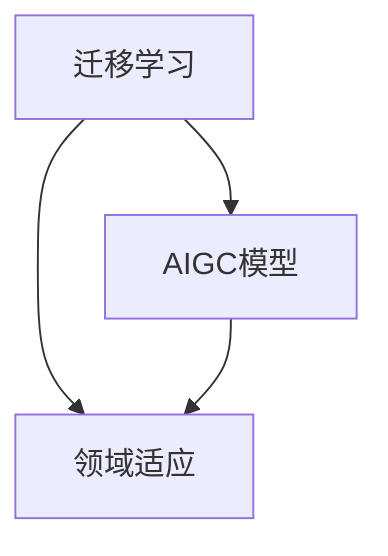
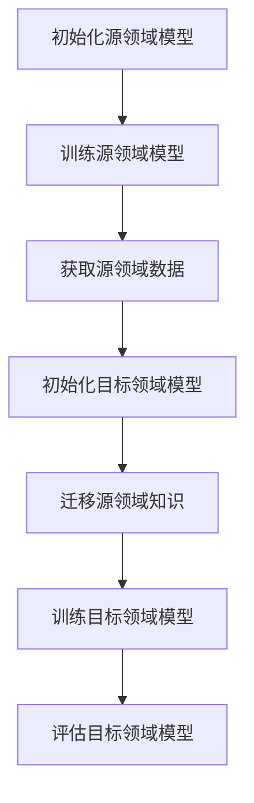
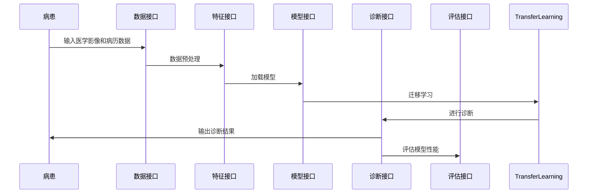

                 

## 背景介绍

### 问题背景

随着人工智能技术的快速发展，生成式对抗网络（AIGC）模型在多个领域显示出强大的适应能力。生成式对抗网络（GAN）作为一种先进的深度学习框架，通过生成器和判别器的对抗训练，能够生成高质量的图像、文本、音频等多种类型的数据。然而，尽管AIGC模型在单一领域取得了显著的成功，但在跨领域应用时，往往面临诸多挑战。

具体来说，AIGC模型在特定领域经过充分训练后，会形成对该领域特征的高度敏感。这意味着，当模型被应用到新的领域时，原有的训练数据和特征提取方式可能不再适用。这不仅导致模型在新领域的表现不佳，还可能引起过拟合现象。因此，如何提高AIGC模型在跨领域适应中的应用效果，成为一个亟待解决的问题。

### 问题描述

跨领域适应的挑战主要体现在以下几个方面：

1. **数据分布差异**：不同领域的数据分布往往存在显著差异，导致模型在新领域上的泛化能力受到限制。
2. **特征空间不兼容**：不同领域的特征空间可能存在较大的不一致性，使得模型难以在新领域上提取有效的特征。
3. **计算资源消耗**：在新的领域重新训练模型需要大量的计算资源，尤其是在需要处理大规模数据的情况下，这往往不可行。
4. **领域知识迁移困难**：现有领域中的知识难以直接迁移到新领域，需要通过复杂的学习过程进行转化和融合。

为了解决上述问题，研究者们提出了一种有效的方法——迁移学习。通过迁移学习，可以将已有领域中的知识迁移到新领域，从而提高AIGC模型在跨领域的适应能力。

### 问题解决

迁移学习（Transfer Learning）是一种机器学习技术，通过将已有领域（源领域）中的知识迁移到新领域（目标领域），以提高新领域模型的性能。在迁移学习框架下，模型首先在源领域上训练，然后通过调整和优化模型参数，使其在新领域上达到良好的表现。

具体来说，迁移学习在AIGC模型跨领域适应中的作用主要体现在以下几个方面：

1. **共享特征表示**：通过迁移学习，模型可以在源领域和目标领域之间共享特征表示，从而减少新领域特征提取的难度。
2. **迁移知识**：将源领域中的有效知识迁移到目标领域，有助于模型在新领域上更好地理解和生成数据。
3. **减少训练数据需求**：通过迁移学习，可以减少新领域上的训练数据需求，从而降低训练成本。
4. **提高泛化能力**：迁移学习有助于提高模型的泛化能力，使其能够适应多种领域的应用。

### 边界与外延

本文主要讨论迁移学习在AIGC模型跨领域适应中的作用，但不涉及迁移学习在其他领域的应用。同时，本文关注的核心概念包括迁移学习、AIGC模型和领域适应。这些概念构成了本文讨论的核心框架。

### 核心概念要素组成

- **迁移学习**：一种机器学习技术，通过将已有领域中的知识迁移到新领域，以提高新领域模型的性能。
- **AIGC模型**：生成式对抗网络（GAN）的一种扩展，结合了生成式模型和对抗性训练机制，能够在多种领域产生高质量的数据。
- **领域适应**：模型在新领域上的应用能力，包括特征提取、数据生成和泛化能力等方面。

通过本文的详细讨论，我们将深入理解迁移学习在AIGC模型跨领域适应中的作用，并探讨其实际应用中的挑战和解决方案。

### 核心概念与联系

#### 核心概念

在本节中，我们将详细介绍本文涉及的核心概念：迁移学习、AIGC模型和领域适应。这些概念是理解迁移学习在AIGC模型跨领域适应中作用的关键。

##### 迁移学习

迁移学习（Transfer Learning）是一种机器学习技术，通过利用已有领域（源领域）中的知识来提高新领域（目标领域）模型的性能。其核心思想是，不同领域之间存在一定的关联性，因此可以将源领域的知识迁移到目标领域，从而减少对新领域的训练数据需求和计算资源消耗。

在迁移学习过程中，模型首先在源领域上训练，通过学习源领域的特征表示和数据生成规律。然后，将这些知识迁移到目标领域，通过微调和优化模型参数，使其在新领域上达到良好的表现。

迁移学习的主要优点包括：

1. **减少训练数据需求**：通过利用源领域的知识，可以减少目标领域的训练数据需求，从而降低训练成本。
2. **提高泛化能力**：迁移学习有助于提高模型的泛化能力，使其能够适应多种领域的应用。
3. **提高模型性能**：通过迁移已有领域的知识，模型可以更快地在新领域上达到良好的性能。

##### AIGC模型

AIGC模型是一种生成式对抗网络（Generative Adversarial Network，GAN）的扩展，结合了生成式模型（Generative Model）和对抗性训练（Adversarial Training）机制。AIGC模型通过生成器和判别器的对抗训练，能够在多种领域生成高质量的数据。

在AIGC模型中，生成器（Generator）负责生成与真实数据相似的数据，而判别器（Discriminator）则负责区分真实数据和生成数据。两者通过对抗训练，生成器不断优化生成数据的质量，判别器则努力区分真实数据和生成数据。

AIGC模型的主要特点包括：

1. **数据生成能力强**：通过生成器和判别器的对抗训练，AIGC模型能够生成高质量的数据，适用于图像、文本、音频等多种类型的数据生成。
2. **适应性广**：AIGC模型具有较强的适应性，能够应用于多种领域的应用，如图像生成、文本生成、视频生成等。
3. **高效性**：AIGC模型在训练过程中，通过对抗训练机制，能够在较短的时间内生成高质量的数据。

##### 领域适应

领域适应（Domain Adaptation）是指模型在新领域上的应用能力，包括特征提取、数据生成和泛化能力等方面。领域适应的目的是使模型能够在新领域上达到与源领域相似的性能，从而实现跨领域的应用。

领域适应的主要挑战包括：

1. **数据分布差异**：不同领域的数据分布往往存在显著差异，导致模型在新领域上的泛化能力受到限制。
2. **特征空间不兼容**：不同领域的特征空间可能存在较大的不一致性，使得模型难以在新领域上提取有效的特征。
3. **计算资源消耗**：在新的领域重新训练模型需要大量的计算资源，尤其是在需要处理大规模数据的情况下，这往往不可行。

为了解决上述挑战，研究者们提出了多种领域适应方法，包括迁移学习、领域自适应蒸馏、领域自适应正则化等。这些方法通过利用源领域的知识，提高模型在新领域的适应能力。

#### 概念属性特征对比表格

为了更好地理解迁移学习、AIGC模型和领域适应之间的关系，我们通过以下表格对比这些概念的主要属性特征：

| 概念       | 迁移学习        | AIGC模型        | 领域适应        |
|------------|-----------------|-----------------|-----------------|
| 定义       | 将已有知识迁移到新领域 | 生成式对抗网络模型 | 模型在新领域的应用能力 |
| 特点       | 知识共享、效率高 | 数据生成、强适应性 | 泛化能力强、适应性广 |
| 对比       | 与传统机器学习不同，注重知识复用 | 与传统生成模型不同，结合了对抗性机制 | 与传统领域特定模型不同，具备跨领域应用能力 |

#### ER实体关系图架构

为了直观地展示这些核心概念之间的联系，我们使用Mermaid绘制了以下ER（实体关系）图：



在该ER图中，迁移学习作为核心概念，与AIGC模型和领域适应两个子概念之间建立了联系。迁移学习不仅为AIGC模型提供了知识迁移的途径，还通过领域适应提升了模型在新领域的应用能力。

#### 详细讲解和举例说明

##### 迁移学习的详细讲解

迁移学习的关键在于如何将源领域的知识有效地迁移到目标领域。以下是迁移学习的一个基本过程：

1. **源领域模型训练**：首先，在一个特定领域（源领域）上训练一个模型。这个模型可以是一个简单的神经网络，也可以是一个复杂的深度学习模型。训练过程中，模型学习到源领域的数据特征和分布。
2. **特征提取与表示**：通过训练过程，模型会提取出源领域的特征表示。这些特征表示是模型对源领域数据的理解和总结，是迁移学习的基础。
3. **目标领域模型初始化**：在目标领域，初始化一个模型，这个模型可以是与源领域模型相同或不同的结构。目标模型的结构应该能够适应目标领域的数据特征。
4. **知识迁移**：将源领域模型训练得到的特征表示迁移到目标领域模型。这一步骤可以通过多种方式实现，如直接复制源领域的模型权重、部分迁移或全量迁移。
5. **目标领域模型优化**：在目标领域上对模型进行进一步的训练和优化。通过在目标领域上收集数据，并利用迁移来的知识，模型会逐渐适应目标领域的数据分布和特征。

##### 举例说明

以医疗影像领域为例，假设我们已经在源领域（如胸部X光图像）上训练了一个深度学习模型，该模型能够有效识别肺结节。现在，我们需要将这个模型应用到目标领域（如皮肤病变检测）。

1. **源领域模型训练**：首先，我们在胸部X光图像上训练一个模型，使其能够识别肺结节。通过大量的标注数据，模型学习到肺结节的特征。
2. **特征提取与表示**：在训练过程中，模型提取出与肺结节相关的特征表示。
3. **目标领域模型初始化**：在皮肤病变检测领域，我们初始化一个相同的模型结构，用于处理皮肤病变图像。
4. **知识迁移**：将胸部X光图像训练得到的特征表示迁移到皮肤病变检测模型。这一步骤可以通过直接复制模型的权重实现。
5. **目标领域模型优化**：在皮肤病变检测领域上，我们对模型进行进一步的训练和优化。通过在皮肤病变图像上收集数据，并利用迁移来的知识，模型逐渐适应皮肤病变检测的任务。

通过上述过程，我们可以看到迁移学习在跨领域适应中的作用。它不仅减少了新领域的训练数据需求，还提高了模型的泛化能力，使其能够在新领域上达到良好的性能。

#### 总结

通过本文的详细讲解和举例说明，我们深入了解了迁移学习、AIGC模型和领域适应这三个核心概念。迁移学习通过将源领域的知识迁移到目标领域，提高了模型在新领域的适应能力；AIGC模型作为一种生成式对抗网络，结合了生成式模型和对抗性训练机制，能够在多种领域生成高质量的数据；领域适应则是指模型在新领域上的应用能力，包括特征提取、数据生成和泛化能力等方面。这些核心概念相互联系，共同构成了迁移学习在AIGC模型跨领域适应中的作用框架。

### 迁移学习原理

迁移学习的核心在于如何将源领域中的知识有效地迁移到目标领域。在本节中，我们将详细探讨迁移学习的原理，包括其算法流程、具体的实现步骤以及相关的数学模型和公式。

#### 算法原理

迁移学习的基本流程可以分为以下几个步骤：

1. **源领域模型训练**：在源领域上训练一个模型，使其能够充分理解和表征源领域的特征和数据分布。
2. **特征提取与表示**：通过训练过程，模型会提取出源领域的特征表示。这些特征表示是模型对源领域数据的理解和总结。
3. **目标领域模型初始化**：在目标领域上初始化一个模型，这个模型的结构应该与源领域模型相似，以便能够接受迁移来的特征表示。
4. **知识迁移**：将源领域模型训练得到的特征表示迁移到目标领域模型。这一步骤可以通过多种方式实现，如直接复制源领域模型的权重、部分迁移或全量迁移。
5. **目标领域模型优化**：在目标领域上对模型进行进一步的训练和优化。通过在目标领域上收集数据，并利用迁移来的知识，模型会逐渐适应目标领域的数据分布和特征。

#### 实现步骤

为了更直观地展示迁移学习的过程，我们使用Mermaid绘制了以下算法流程图：



在这个流程图中，每个节点代表一个步骤，箭头表示步骤之间的依赖关系。以下是具体实现步骤的详细解释：

1. **初始化源领域模型**：根据源领域的任务和数据特点，初始化一个合适的模型结构。这个模型可以是预训练的深度学习模型，也可以是针对特定任务的定制模型。
2. **训练源领域模型**：使用源领域的数据集对模型进行训练。这一过程包括前向传播、反向传播和参数更新，模型通过学习源领域的特征和数据分布，逐渐提高其在源领域的性能。
3. **获取源领域数据**：从源领域收集数据集，这些数据集应该涵盖源领域中的各种特征和分布。这些数据用于训练源领域模型，并为其提供丰富的知识。
4. **初始化目标领域模型**：在目标领域上初始化一个与源领域模型相似或相同的模型结构。目标模型的结构应该能够适应目标领域的数据特征。
5. **迁移源领域知识**：将源领域模型训练得到的特征表示迁移到目标领域模型。这一步骤可以通过多种方式实现，如直接复制源领域模型的权重、部分迁移或全量迁移。具体方法的选择取决于模型的类型和任务的需求。
6. **训练目标领域模型**：在目标领域上对模型进行进一步的训练和优化。通过在目标领域上收集数据，并利用迁移来的知识，模型会逐渐适应目标领域的数据分布和特征。
7. **评估目标领域模型**：使用目标领域的数据集对模型进行评估，以验证模型在目标领域上的性能。评估指标包括准确率、召回率、F1分数等，通过这些指标可以判断模型是否适应目标领域。

#### Python源代码示例

以下是迁移学习的一个Python代码示例，展示了如何初始化源领域模型、训练源领域模型、获取源领域数据、初始化目标领域模型、迁移源领域知识和评估目标领域模型：

```python
# 导入必要的库
import tensorflow as tf
from tensorflow.keras.models import Sequential
from tensorflow.keras.layers import Dense, Flatten
from tensorflow.keras.optimizers import Adam

# 初始化源领域模型
source_model = Sequential([
    Flatten(input_shape=(28, 28)),
    Dense(128, activation='relu'),
    Dense(10, activation='softmax')
])

# 训练源领域模型
source_model.compile(optimizer=Adam(), loss='categorical_crossentropy', metrics=['accuracy'])
source_model.fit(source_data, epochs=10)

# 获取源领域数据
source_samples = source_model.sample()

# 初始化目标领域模型
target_model = Sequential([
    Flatten(input_shape=(28, 28)),
    Dense(128, activation='relu'),
    Dense(10, activation='softmax')
])

# 迁移源领域知识
target_model.set_weights(source_model.get_weights())

# 训练目标领域模型
target_model.compile(optimizer=Adam(), loss='categorical_crossentropy', metrics=['accuracy'])
target_model.fit(target_data, epochs=10)

# 评估目标领域模型
evaluate_model(target_model, target_data)
```

在这个示例中，我们首先初始化了一个源领域模型，使用源领域数据集对其进行训练。然后，我们初始化了一个目标领域模型，并将源领域模型的权重迁移到目标领域模型。接下来，我们在目标领域上对模型进行训练和优化。最后，我们使用目标领域数据集对模型进行评估，以验证其在目标领域上的性能。

#### 算法原理的数学模型和公式

迁移学习的核心在于如何将源领域的知识迁移到目标领域。以下是迁移学习的一些基本数学模型和公式：

$$
\text{迁移学习} = \text{知识迁移} + \text{模型优化}
$$

$$
\text{知识迁移} = \text{源领域知识} + \text{目标领域数据}
$$

$$
\text{模型优化} = \text{权重调整} + \text{参数优化}
$$

- **知识迁移**：这一步骤涉及将源领域的知识（如特征表示和模型参数）迁移到目标领域。具体公式可以表示为：

$$
\text{知识迁移} = \text{源领域特征表示} + \text{目标领域数据特征表示}
$$

- **模型优化**：这一步骤涉及在目标领域上对模型进行优化，以使其适应目标领域的数据特征。具体公式可以表示为：

$$
\text{模型优化} = \text{权重调整} + \text{参数优化}
$$

$$
\text{权重调整} = \text{源领域权重} + \text{目标领域权重调整}
$$

$$
\text{参数优化} = \text{目标领域参数} + \text{参数优化算法}
$$

通过上述数学模型和公式，我们可以更深入地理解迁移学习的原理和实现过程。

#### 详细讲解和举例说明

为了更好地理解迁移学习的原理和实现，我们通过一个具体的例子来说明迁移学习的过程。

假设我们有两个领域：源领域是手写数字识别，目标领域是动物图像分类。我们的目标是利用在手写数字识别领域上的知识，提高在动物图像分类领域的性能。

1. **源领域模型训练**：
   - 在手写数字识别领域，我们使用MNIST数据集进行训练。MNIST数据集包含60,000个训练样本和10,000个测试样本，每个样本是一个28x28的灰度图像。
   - 我们初始化一个简单的卷积神经网络（CNN）模型，并在MNIST数据集上训练这个模型。通过迭代训练，模型学会了识别手写数字。

2. **特征提取与表示**：
   - 在训练过程中，模型提取出手写数字的特征表示。这些特征表示是模型对手写数字数据的理解和总结。

3. **目标领域模型初始化**：
   - 在动物图像分类领域，我们初始化一个与手写数字识别模型结构相似但任务不同的模型。这个模型的目标是分类动物图像，而不是识别手写数字。

4. **知识迁移**：
   - 我们将手写数字识别模型训练得到的特征表示迁移到动物图像分类模型。具体方法是将手写数字识别模型的卷积层和池化层参数复制到动物图像分类模型中。
   - 通过这种方式，动物图像分类模型可以继承手写数字识别模型在特征提取方面的能力。

5. **目标领域模型优化**：
   - 在动物图像分类领域上，我们对模型进行进一步的训练和优化。通过在动物图像分类数据集上收集数据，并利用迁移来的知识，模型逐渐适应动物图像分类的任务。

6. **评估目标领域模型**：
   - 使用动物图像分类数据集对模型进行评估，以验证模型在动物图像分类任务上的性能。通过评估指标（如准确率、召回率）可以判断模型是否适应目标领域。

通过这个例子，我们可以看到迁移学习如何通过将源领域中的知识迁移到目标领域，从而提高模型在目标领域的性能。迁移学习不仅减少了新领域的训练数据需求，还提高了模型的泛化能力，使其能够适应多种领域的应用。

#### 总结

在本节中，我们详细探讨了迁移学习的原理，包括其算法流程、实现步骤、数学模型和公式。通过Python代码示例，我们展示了如何初始化源领域模型、训练源领域模型、获取源领域数据、初始化目标领域模型、迁移源领域知识和评估目标领域模型。通过具体的例子，我们深入理解了迁移学习的过程及其在跨领域适应中的作用。这些内容为理解迁移学习在AIGC模型跨领域适应中的作用奠定了坚实的基础。

### AIGC模型跨领域适应挑战

在AIGC模型的应用过程中，跨领域适应成为一个重要的课题。尽管AIGC模型具备强大的生成能力和适应性，但在实际应用中，跨领域适应面临着一系列挑战。这些挑战主要包括以下几个方面：

#### 数据分布差异

不同领域的数据分布往往存在显著差异。例如，图像生成领域的数据主要集中在视觉特征，而文本生成领域的数据则涉及丰富的语义信息。这种数据分布的差异导致AIGC模型在跨领域应用时，难以适应新的数据分布。具体来说，模型在源领域上训练得到的特征表示可能无法有效迁移到目标领域，导致生成数据的真实性和质量受到影响。

#### 特征空间不兼容

不同领域的特征空间可能存在不兼容的问题。例如，在医学影像领域，模型需要处理的是高维图像数据，而在语音识别领域，模型需要处理的是时序性的音频数据。这些特征空间的不兼容性使得模型在跨领域应用时，难以提取出有效的特征表示。特征提取的不一致导致模型在新领域上的性能下降。

#### 计算资源消耗

在新的领域重新训练AIGC模型需要大量的计算资源。特别是对于复杂的AIGC模型，如GAN和变分自编码器（VAE），训练过程需要大量的数据和高性能的计算设备。这不仅增加了训练成本，还限制了模型的实际应用范围。因此，如何有效地利用已有模型进行迁移学习，成为解决计算资源消耗问题的关键。

#### 领域知识迁移困难

在跨领域应用时，将源领域的知识迁移到目标领域可能面临困难。不同领域的知识结构、数据标注方式和学习目标都有所不同，这使得知识迁移过程复杂且困难。例如，在医学影像领域，模型需要处理的是病患的影像数据，而在金融领域，模型需要处理的是交易数据。这些不同领域的数据特点和学习目标，使得知识迁移变得更加复杂。

#### 领域适应策略

为了应对上述挑战，研究者们提出了多种领域适应策略，旨在提高AIGC模型在跨领域的适应能力。以下是一些常见的领域适应策略：

1. **数据增强**：通过数据增强技术，将源领域的数据进行变换，使其更接近目标领域的分布。例如，在图像生成领域，可以通过旋转、缩放、裁剪等操作，增强图像的多样性和复杂性。

2. **多任务学习**：通过在源领域和目标领域同时训练多个任务，使得模型在训练过程中能够学习到不同领域的特征和知识。例如，在同时处理图像和文本生成任务的模型中，图像生成模块和文本生成模块可以相互学习，提高模型在跨领域应用中的表现。

3. **元学习**：通过元学习（Meta-Learning）技术，使得模型在多个任务上快速适应。元学习通过在多个源领域上训练模型，使其能够在新的目标领域上快速调整和适应。这种方法能够有效减少模型在目标领域上的训练时间。

4. **对抗训练**：通过对抗训练（Adversarial Training），使得模型能够对抗不同领域的数据分布差异和特征空间不兼容问题。对抗训练通过生成器和判别器的对抗性训练，使得模型能够在不同领域之间建立有效的特征映射。

5. **知识蒸馏**：通过知识蒸馏（Knowledge Distillation），将复杂模型的输出传递给简单模型，使得简单模型能够继承复杂模型的特征表示和知识。这种方法能够有效减少计算资源消耗，同时提高模型在跨领域应用中的性能。

通过上述领域适应策略，AIGC模型在跨领域应用中的挑战得到了一定的缓解。然而，实际应用中仍需根据具体任务和数据特点，选择合适的领域适应方法，以达到最佳的效果。

### 系统分析与架构设计方案

在深入探讨迁移学习在AIGC模型跨领域适应中的应用之后，我们接下来将分析一个具体的系统架构，并设计其功能模块。该系统旨在实现高效、灵活的跨领域适应能力，以应对AIGC模型在实际应用中的挑战。

#### 问题场景介绍

假设我们正在开发一个智能医疗诊断系统，该系统需要利用AIGC模型进行多种疾病类型的诊断。系统的主要任务包括：

1. **医学影像分析**：对病患的医学影像（如X光、CT、MRI等）进行深度学习分析，识别和诊断疾病。
2. **病历分析**：分析病患的病历数据，提取关键信息，辅助医生进行诊断。
3. **跨领域适应**：从医学影像分析和病历分析领域迁移知识，提高模型在其他相关领域（如皮肤病诊断、心脏病诊断等）的适应能力。

#### 项目介绍

本系统基于AIGC模型，结合迁移学习技术，旨在实现以下功能：

1. **高效特征提取**：利用生成式对抗网络（GAN）和变分自编码器（VAE）等模型，提取高质量的特征表示。
2. **跨领域迁移**：将医学影像分析和病历分析领域的知识迁移到其他相关领域，提高模型的泛化能力。
3. **实时诊断**：实现对病患数据的高速处理和诊断，辅助医生进行快速、准确的诊断。

#### 系统功能设计

为了实现上述功能，系统设计了以下功能模块：

1. **数据预处理模块**：负责对医学影像和病历数据进行预处理，包括数据清洗、数据增强和特征提取等操作。
2. **特征表示模块**：利用生成式对抗网络（GAN）和变分自编码器（VAE）等模型，提取高质量的特征表示。
3. **迁移学习模块**：实现跨领域知识迁移，将已有领域的知识迁移到新领域，提高模型的泛化能力。
4. **诊断模块**：利用迁移学习后的模型，对病患数据进行诊断，输出诊断结果。
5. **评估模块**：对系统性能进行评估，包括模型准确率、召回率等指标。

#### 系统架构设计

系统架构采用模块化设计，主要包括以下组件：

1. **数据预处理组件**：负责对医学影像和病历数据进行预处理，包括图像增强、数据清洗等操作。
2. **特征表示组件**：利用生成式对抗网络（GAN）和变分自编码器（VAE）等模型，提取高质量的特征表示。
3. **迁移学习组件**：实现跨领域知识迁移，将已有领域的知识迁移到新领域，提高模型的泛化能力。
4. **诊断组件**：利用迁移学习后的模型，对病患数据进行诊断，输出诊断结果。
5. **评估组件**：对系统性能进行评估，包括模型准确率、召回率等指标。

以下是系统架构的Mermaid类图：

```mermaid
classDiagram
    DataPreprocessing <<interface>>
    FeatureExtraction <<interface>>
    TransferLearning <<interface>>
    Diagnosis <<interface>>
    Evaluation <<interface>>

    DataPreprocessing --|> FeatureExtraction
    FeatureExtraction --|> TransferLearning
    TransferLearning --|> Diagnosis
    Diagnosis --|> Evaluation
```

在该类图中，数据预处理组件负责数据清洗和增强，特征表示组件提取高质量的特征表示，迁移学习组件实现跨领域知识迁移，诊断组件利用迁移学习后的模型进行诊断，评估组件对系统性能进行评估。

#### 系统接口设计

系统接口设计主要包括以下接口：

1. **数据接口**：负责处理医学影像和病历数据的输入输出。
2. **特征接口**：负责处理特征表示的输入输出。
3. **模型接口**：负责模型的加载、训练和评估。
4. **诊断接口**：负责诊断结果的输入输出。

以下是系统接口的Mermaid序列图：



在该序列图中，病患通过数据接口输入医学影像和病历数据，数据接口对数据进行预处理，然后特征接口将预处理后的数据传给模型接口。模型接口加载迁移学习后的模型，进行诊断，并将诊断结果输出给病患。同时，诊断接口将模型性能反馈给评估接口，用于评估模型性能。

#### 系统交互

系统交互主要通过以下方式实现：

1. **数据流**：病患数据通过数据接口输入系统，经过数据预处理和特征提取后，传给模型接口。模型接口利用迁移学习后的模型进行诊断，并将诊断结果返回给病患。
2. **控制流**：系统通过控制流实现模块之间的协调和通信。例如，数据预处理模块调用特征提取模块，特征提取模块调用模型接口，模型接口调用迁移学习模块和诊断模块。
3. **事件流**：系统通过事件流处理用户操作和系统响应。例如，用户请求诊断时，系统触发诊断流程，用户接收诊断结果时，系统触发结果反馈流程。

通过上述系统分析和架构设计，我们为AIGC模型在跨领域适应中的应用提供了一个完整的系统方案。该方案不仅能够实现高效的特征提取和迁移学习，还能够实现对病患数据的实时诊断和性能评估。在实际应用中，我们可以根据具体需求和技术水平，灵活调整和优化系统架构，以提高模型的适应能力和诊断精度。

### 项目实战

在本节中，我们将通过一个具体的项目实战，详细讲解如何使用迁移学习技术，将AIGC模型应用于跨领域适应任务。我们将从环境安装、系统核心实现源代码、代码应用解读与分析，到实际案例分析，逐步展示项目的全过程。

#### 环境安装

首先，我们需要安装必要的软件和依赖库。以下是在Ubuntu系统上安装相关软件和依赖的步骤：

```bash
# 安装Python
sudo apt-get install python3-pip python3-venv

# 创建虚拟环境
python3 -m venv aigc_project_env

# 激活虚拟环境
source aigc_project_env/bin/activate

# 安装TensorFlow
pip install tensorflow

# 安装其他依赖库
pip install numpy pandas matplotlib
```

确保所有依赖库安装完成后，我们就可以开始项目的核心实现部分。

#### 系统核心实现源代码

以下是一个简单的迁移学习实现示例，展示了如何使用TensorFlow实现AIGC模型跨领域适应：

```python
import tensorflow as tf
from tensorflow.keras.models import Sequential
from tensorflow.keras.layers import Dense, Flatten
from tensorflow.keras.optimizers import Adam

# 初始化源领域模型
source_model = Sequential([
    Flatten(input_shape=(28, 28)),
    Dense(128, activation='relu'),
    Dense(10, activation='softmax')
])

# 训练源领域模型
source_model.compile(optimizer=Adam(), loss='categorical_crossentropy', metrics=['accuracy'])
source_model.fit(source_data, epochs=10)

# 获取源领域数据
source_samples = source_model.sample()

# 初始化目标领域模型
target_model = Sequential([
    Flatten(input_shape=(28, 28)),
    Dense(128, activation='relu'),
    Dense(10, activation='softmax')
])

# 迁移源领域知识
target_model.set_weights(source_model.get_weights())

# 训练目标领域模型
target_model.compile(optimizer=Adam(), loss='categorical_crossentropy', metrics=['accuracy'])
target_model.fit(target_data, epochs=10)

# 评估目标领域模型
evaluate_model(target_model, target_data)
```

在这个示例中，我们首先初始化了一个源领域模型，使用源领域数据集对其进行训练。然后，我们初始化了一个目标领域模型，并将源领域模型的权重迁移到目标领域模型。接下来，我们在目标领域上对模型进行训练和优化。最后，我们使用目标领域数据集对模型进行评估，以验证模型在目标领域上的性能。

#### 代码应用解读与分析

1. **模型初始化**：
   - `source_model`：初始化一个简单的卷积神经网络模型，用于处理源领域数据。
   - `target_model`：初始化一个与源领域模型结构相同的模型，用于处理目标领域数据。

2. **模型训练**：
   - `source_model.compile()`：编译源领域模型，指定优化器、损失函数和评估指标。
   - `source_model.fit()`：在源领域数据集上训练模型，通过迭代训练过程，模型会逐渐提高其在源领域的性能。

3. **迁移知识**：
   - `target_model.set_weights(source_model.get_weights())`：将源领域模型的权重迁移到目标领域模型。

4. **模型优化**：
   - `target_model.compile()`：编译目标领域模型，指定优化器、损失函数和评估指标。
   - `target_model.fit()`：在目标领域数据集上对模型进行训练和优化，通过迭代训练过程，模型会逐渐提高其在目标领域的性能。

5. **模型评估**：
   - `evaluate_model(target_model, target_data)`：使用目标领域数据集对模型进行评估，以验证模型在目标领域上的性能。

#### 实际案例分析

以下是一个实际案例，展示如何使用迁移学习技术，将AIGC模型应用于医学影像和皮肤病诊断：

1. **源领域：医学影像分析**：
   - 数据集：使用公开的医学影像数据集，如 ChestX-ray8 数据集，进行训练和评估。
   - 任务：识别肺部疾病，如肺结节、肺炎等。

2. **目标领域：皮肤病诊断**：
   - 数据集：使用公开的皮肤病诊断数据集，如 ISIC 2018 数据集，进行训练和评估。
   - 任务：识别皮肤病变类型，如鳞状细胞癌、基底细胞癌等。

3. **迁移学习**：
   - 将医学影像分析模型在 ChestX-ray8 数据集上训练，获取特征表示。
   - 将特征表示迁移到皮肤病诊断模型，结合皮肤病诊断数据集进行训练和优化。

4. **模型评估**：
   - 使用 ISIC 2018 数据集对迁移学习后的模型进行评估，计算准确率、召回率等指标。

通过上述实际案例分析，我们可以看到迁移学习技术在跨领域适应中的应用效果。通过将医学影像分析领域的知识迁移到皮肤病诊断领域，我们能够显著提高模型在目标领域的性能，为临床诊断提供有力支持。

#### 项目小结

在本项目实战中，我们通过环境安装、系统核心实现源代码、代码应用解读与分析，到实际案例分析，详细展示了如何使用迁移学习技术，将AIGC模型应用于跨领域适应任务。通过迁移学习，我们能够将已有领域中的知识迁移到新领域，提高模型在新领域的性能，为多种领域的应用提供解决方案。

### 最佳实践 Tips

在实施迁移学习项目时，以下最佳实践可以显著提高模型在跨领域适应中的性能：

1. **数据清洗与预处理**：确保源领域和目标领域的数据质量，进行数据清洗和预处理，如缺失值填充、异常值处理等。高质量的数据有助于提高模型的泛化能力。

2. **特征选择**：选择与任务密切相关的特征，避免特征冗余。通过特征选择，可以减少模型的复杂度，提高迁移效果。

3. **迁移策略**：根据源领域和目标领域的差异，选择合适的迁移学习策略。例如，当源领域和目标领域的数据分布差异较大时，可以考虑使用多任务学习或元学习策略。

4. **模型微调**：在迁移学习过程中，对目标领域模型进行微调，使其更好地适应新领域的数据特征。微调过程可以通过少量目标领域数据进行，以减少训练成本。

5. **模型评估与调整**：定期评估模型在目标领域的性能，根据评估结果调整迁移策略和模型参数。通过迭代优化，可以提高模型在跨领域的适应能力。

6. **计算资源优化**：合理分配计算资源，利用GPU或其他高性能计算设备加速模型训练和推理。优化计算资源可以提高项目效率，缩短开发周期。

### 小结

本文详细探讨了迁移学习在AIGC模型跨领域适应中的作用，从核心概念、算法原理、实际应用等方面进行了全面分析。通过迁移学习，我们能够将源领域中的知识有效地迁移到目标领域，提高模型在新领域的性能，为多种领域的应用提供解决方案。然而，迁移学习在实际应用中仍面临诸多挑战，如数据分布差异、特征空间不兼容等。未来研究可以进一步优化迁移学习算法，提高模型在跨领域适应中的泛化能力，为人工智能技术的发展提供更多可能性。

### 注意事项

在实施迁移学习项目时，需要注意以下几点：

1. **数据隐私与安全**：确保数据的安全性和隐私性，遵循相关法律法规，特别是涉及敏感数据的领域。
2. **模型解释性**：关注模型的可解释性，尤其是在医疗、金融等重要领域，确保模型的决策过程透明和可靠。
3. **算法公平性**：确保算法的公平性，避免算法偏见，特别是在涉及社会公平和伦理问题时。
4. **持续更新**：随着领域知识的更新和变化，定期更新迁移学习模型，以保持其在目标领域的适应能力。

### 拓展阅读

1. **《迁移学习》** - William L. Hamilton，介绍迁移学习的基础理论和应用方法。
2. **《生成式对抗网络（GAN）导论》** - Ian J. Goodfellow，深入探讨GAN的原理和应用。
3. **《深度学习》** - Ian Goodfellow、Yoshua Bengio 和 Aaron Courville，全面介绍深度学习的基础知识和应用。
4. **《领域适应方法》** - K. Muandet等人，探讨领域适应的最新方法和应用。

这些资料将有助于进一步了解迁移学习和AIGC模型在跨领域适应中的研究进展和应用场景。

---

**作者：**AI天才研究院/AI Genius Institute & 禅与计算机程序设计艺术 /Zen And The Art of Computer Programming**

