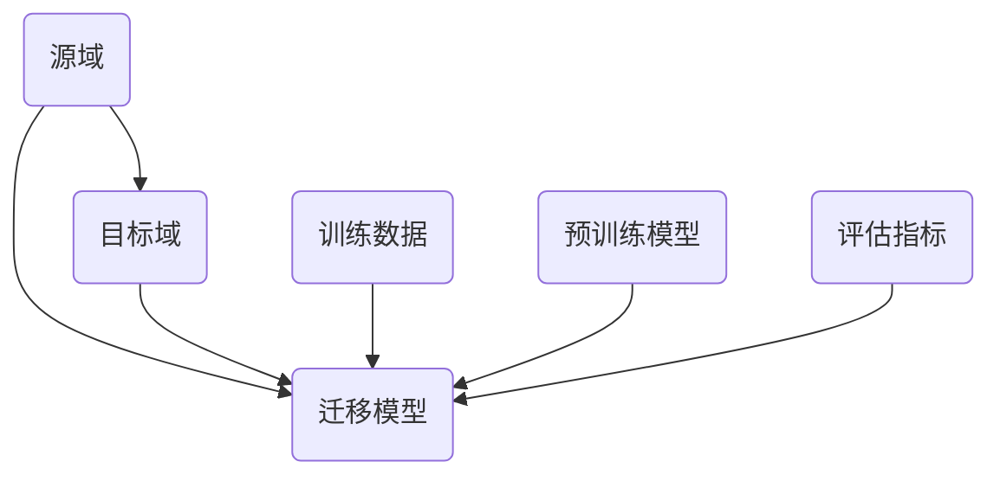

                 

## 迁移学习在AIGC领域知识迁移中的作用

### 关键词

- 迁移学习
- AIGC
- 知识迁移
- 算法
- 系统架构

### 摘要

随着人工智能技术的发展，AIGC（人工智能生成内容）领域日益成为研究热点。然而，AIGC系统在实际应用中面临着数据稀缺、模型训练成本高、训练数据与目标任务相关性不强等问题。本文旨在探讨迁移学习在AIGC领域知识迁移中的作用，分析其核心概念、原理及实现方法，并提出系统分析与架构设计。通过深入理解迁移学习，有助于解决AIGC领域中的知识迁移问题，提升模型泛化能力和应用效果。

## 目录大纲设计

### 第一部分：背景介绍

#### 1.1 问题背景
#### 1.2 问题描述
#### 1.3 问题解决
#### 1.4 边界与外延
#### 1.5 概念结构与核心要素组成

### 第二部分：核心概念与联系

#### 2.1 迁移学习原理
#### 2.2 概念属性特征对比
#### 2.3 ER实体关系图

### 第三部分：算法原理讲解

#### 3.1 迁移学习算法基础
#### 3.2 数学模型和公式
#### 3.3 Python源代码示例
#### 3.4 算法原理详细讲解

### 第四部分：系统分析与架构设计

#### 4.1 问题场景介绍
#### 4.2 系统功能设计
#### 4.3 系统架构设计
#### 4.4 系统接口设计
#### 4.5 系统交互

### 第五部分：项目实战

#### 5.1 环境安装
#### 5.2 系统核心实现源代码
#### 5.3 代码应用解读与分析
#### 5.4 实际案例分析与讲解
#### 5.5 项目小结

### 第六部分：最佳实践 tips

#### 6.1 注意事项
#### 6.2 拓展阅读

### 第七部分：小结

#### 7.1 文章总结
#### 7.2 展望未来

---

## 第一部分：背景介绍

### 1.1 问题背景

随着互联网和社交媒体的迅猛发展，人工智能生成内容（AIGC）领域逐渐成为研究热点。AIGC是一种基于人工智能技术自动生成内容的方法，涵盖了文本、图像、音频等多种形式。然而，AIGC系统在实际应用中面临着诸多问题，其中最为突出的是数据稀缺和模型训练成本高。

数据稀缺是由于AIGC领域的数据集相对较少，且数据质量和标注质量参差不齐。模型训练成本高则是因为AIGC系统通常需要大量计算资源和时间进行训练。此外，训练数据与目标任务的相关性不强也是一个制约因素。在这种情况下，如何有效地进行知识迁移，提高模型泛化能力，成为AIGC领域亟待解决的问题。

### 1.2 问题描述

AIGC领域中的知识迁移问题主要包括以下三个方面：

1. **数据迁移**：如何将已有的数据集迁移到新的应用场景中，解决数据稀缺问题。
2. **模型迁移**：如何将已有的模型迁移到新的任务中，提高模型训练效率。
3. **知识迁移**：如何将已有领域知识迁移到新的任务中，提高任务解决能力。

### 1.3 问题解决

为了解决上述问题，迁移学习成为一种有效的方法。迁移学习旨在利用已有知识（源域）来加速新任务（目标域）的学习过程。其基本思想是将源域的知识迁移到目标域，以减少对新任务的训练数据和计算资源的依赖。

### 1.4 边界与外延

迁移学习的边界与外延包括以下几个方面：

1. **应用领域**：迁移学习广泛应用于计算机视觉、自然语言处理、推荐系统等众多领域。
2. **挑战与展望**：迁移学习面临着数据不匹配、模型适应性差、知识表征不足等挑战。未来，随着人工智能技术的不断发展，迁移学习有望在更多领域取得突破。
3. **与传统机器学习的对比**：迁移学习与传统机器学习相比，更加关注已有知识的复用，有助于提高模型泛化能力和应用效果。

### 1.5 概念结构与核心要素组成

迁移学习的基本概念和核心要素包括：

1. **源域与目标域**：源域是已有知识的应用场景，目标域是新的应用场景。
2. **迁移模型**：迁移模型是将源域知识迁移到目标域的模型。
3. **训练数据**：训练数据是用于训练迁移模型的输入数据。
4. **预训练模型**：预训练模型是迁移学习的基础，通常通过在大量数据上训练得到。
5. **评估指标**：评估指标用于衡量迁移模型在目标域的性能。

## 第二部分：核心概念与联系

### 2.1 迁移学习原理

迁移学习的核心思想是利用已有知识（源域）来加速新任务（目标域）的学习。其基本原理包括以下几个方面：

1. **知识表征**：通过将源域知识表示为特征向量，实现知识在模型中的表示和存储。
2. **模型共享**：共享源域和目标域的部分模型结构，以实现知识在模型中的传递。
3. **损失函数**：通过在目标域上训练模型，优化模型参数，实现知识在目标域的应用。

### 2.2 概念属性特征对比

以下是迁移学习与传统机器学习的对比：

| 对比项       | 迁移学习                             | 传统机器学习                         |
| ------------ | ------------------------------------ | ------------------------------------ |
| 数据依赖     | 低依赖，利用已有知识               | 高依赖，依赖大量训练数据             |
| 模型训练     | 利用共享模型，训练效率高           | 需要从头开始训练，效率低             |
| 泛化能力     | 更强的泛化能力，适用于新任务        | 泛化能力依赖于训练数据质量           |
| 应用领域     | 广泛应用于计算机视觉、NLP等         | 广泛应用于各种任务                   |

### 2.3 ER实体关系图

以下是一个简单的ER实体关系图，用于描述迁移学习中的核心实体和关系：

- **源域**：指已有知识的应用场景。
- **目标域**：指新的应用场景。
- **迁移模型**：将源域知识迁移到目标域的模型。
- **训练数据**：用于训练迁移模型的输入数据。
- **预训练模型**：在大量数据上训练得到的模型，作为迁移学习的基础。
- **评估指标**：用于衡量迁移模型在目标域的性能。

