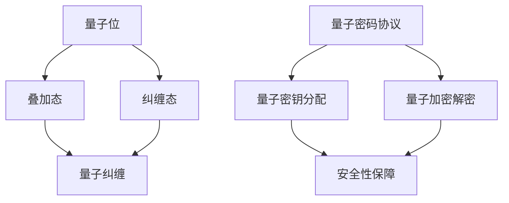
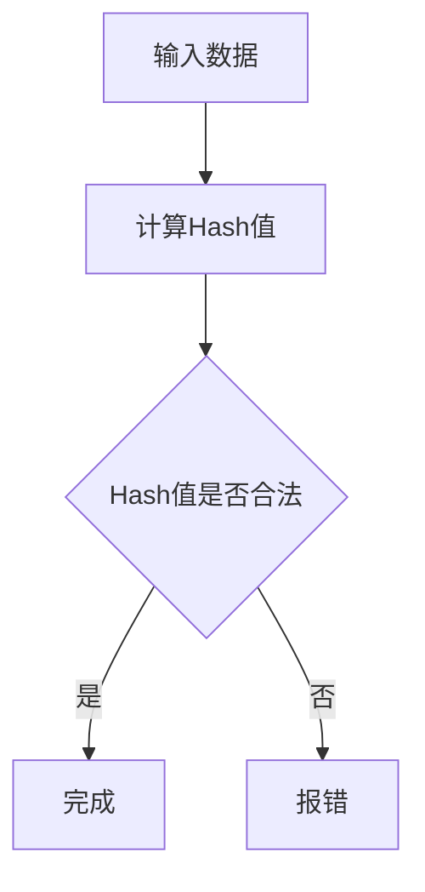
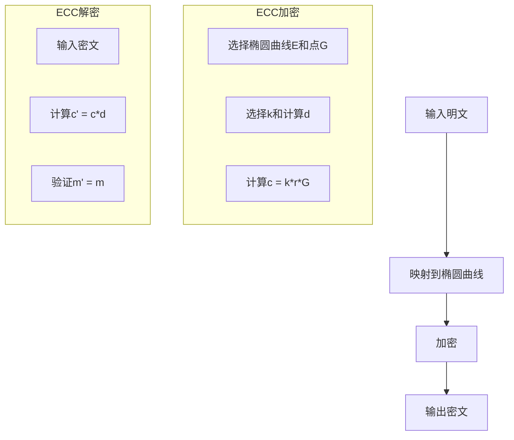
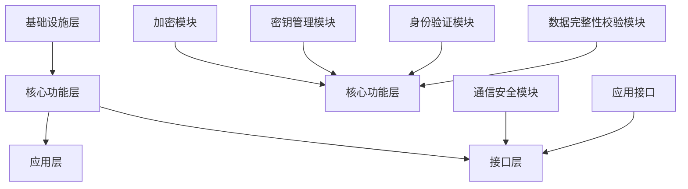
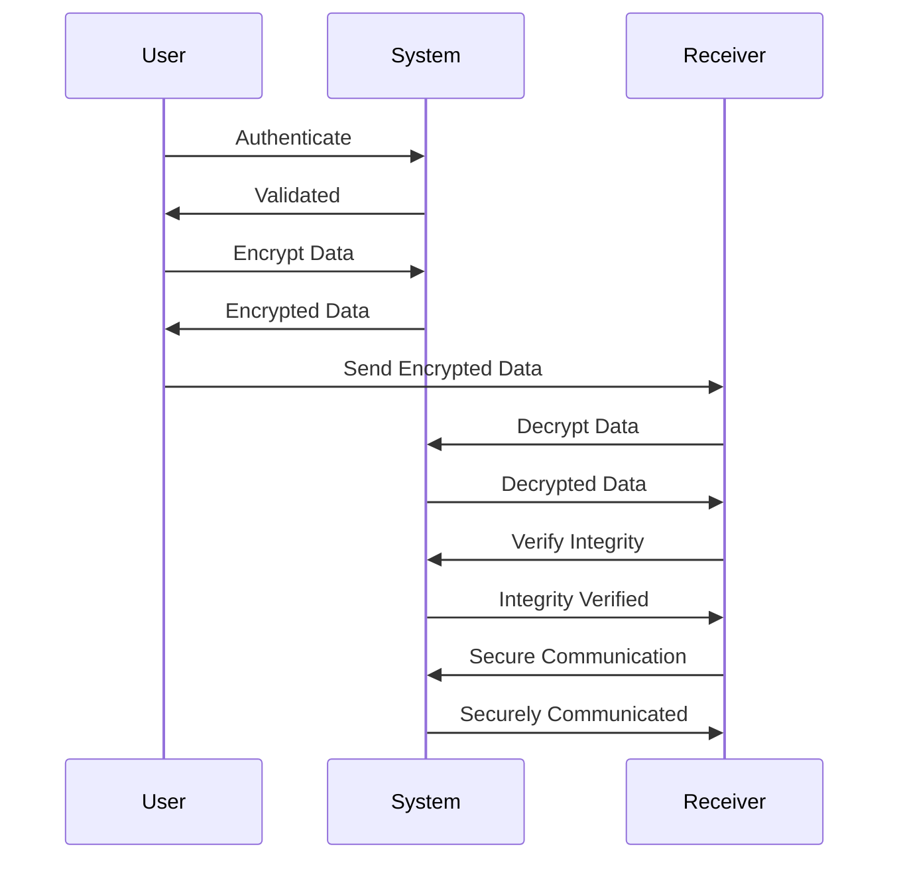

                 

# 量子resistant密码系统的设计原则

## 关键词

- 量子密码学
- 量子resistant密码
- 密码系统设计
- 算法原理
- 系统架构

## 摘要

随着量子计算机的发展，传统密码系统面临着巨大的安全威胁。量子resistant密码系统应运而生，旨在抵抗量子计算机的攻击。本文将详细介绍量子resistant密码系统的设计原则，包括核心概念、算法原理、系统架构和实际应用，帮助读者全面理解这一前沿技术。

## 设计思路

设计《量子resistant密码系统的设计原则》时，我们遵循以下思路：

1. **背景介绍**：阐述量子密码学的起源、发展背景以及量子resistant密码系统的必要性。
2. **核心概念与联系**：定义量子resistant密码系统的核心概念，展示概念之间的联系。
3. **算法原理讲解**：详细讲解量子resistant密码系统的算法原理，使用mermaid绘制流程图。
4. **系统分析与架构设计方案**：分析量子resistant密码系统的架构设计，包括系统功能、架构、接口和交互流程。
5. **项目实战**：通过实际案例展示量子resistant密码系统的实现和应用。
6. **最佳实践 tips、小结、注意事项、拓展阅读**：总结全书，提供最佳实践建议，并对全书内容进行小结和拓展阅读推荐。

## 目录大纲

### 第一部分：量子resistant密码系统概述

### 第1章：量子密码学的崛起

- **1.1 引言**
- **1.2 量子密码学的核心原理**
- **1.3 量子resistant密码系统的必要性**
- **1.4 量子resistant密码学的研究现状与挑战**

### 第2章：量子resistant密码系统的核心概念

- **2.1 基本概念与术语**
  - **2.1.1 量子位（qubit）**
  - **2.1.2 量子纠缠**
  - **2.1.3 量子密码协议**
- **2.2 概念联系与关系图**

### 第3章：量子resistant密码算法原理

- **3.1 概述**
- **3.2 Hash函数**
  - **3.2.1 常见Hash函数**
  - **3.2.2 Hash函数在量子resistant密码系统中的应用**
  - **3.2.3 Mermaid算法流程图**
- **3.3 公开密钥加密算法**
  - **3.3.1 RSA算法**
  - **3.3.2 ECC算法**
  - **3.3.3 Mermaid算法流程图**

### 第4章：量子resistant密码系统的设计与实现

- **4.1 系统功能设计**
- **4.2 系统架构设计**
- **4.3 系统接口设计**
- **4.4 系统交互流程**

### 第5章：项目实战

- **5.1 环境安装与配置**
- **5.2 系统核心实现源代码**
- **5.3 代码应用解读与分析**
- **5.4 实际案例分析与讲解**

### 第6章：最佳实践与注意事项

- **6.1 最佳实践建议**
- **6.2 注意事项**
- **6.3 拓展阅读**

## 量子resistant密码系统概述

### 第1章：量子密码学的崛起

#### 1.1 引言

量子计算机的崛起对传统密码学带来了巨大的挑战。量子计算机利用量子位（qubit）和量子纠缠等现象，可以实现对传统加密算法的快速破解。为了应对这一挑战，量子resistant密码系统应运而生。本节将介绍量子密码学的历史背景、核心原理以及量子resistant密码系统的必要性。

#### 1.2 量子密码学的核心原理

量子密码学基于量子力学的基本原理，主要包括量子位、量子纠缠和量子密码协议。量子位是量子计算机的基本单元，具有叠加态和纠缠态的特点。量子纠缠是量子位之间的特殊关联，即使距离遥远，量子位之间的状态仍然相互关联。量子密码协议利用这些特性来实现安全通信。

#### 1.3 量子resistant密码系统的必要性

随着量子计算机的发展，传统加密算法（如RSA、ECC）的安全性受到严重威胁。量子resistant密码系统旨在设计出能够抵抗量子计算机攻击的加密算法。这些密码系统通常采用不同的加密原理，如基于Hash函数的加密算法、基于格的加密算法等。

#### 1.4 量子resistant密码学的研究现状与挑战

目前，量子resistant密码系统的研究正处于快速发展阶段。许多新型加密算法被提出，并在实际应用中得到了验证。然而，仍存在一些挑战，如密码算法的效率、兼容性以及量子计算机的实际应用等。未来，量子resistant密码系统的研究将继续深入，以应对不断发展的量子计算威胁。

## 量子resistant密码系统的核心概念

### 第2章：量子resistant密码系统的核心概念

量子resistant密码系统的设计离不开一系列核心概念，包括量子位、量子纠缠和量子密码协议等。这些概念是量子resistant密码系统的基石，理解这些概念有助于我们更好地掌握量子resistant密码系统的设计原则。

#### 2.1 基本概念与术语

**2.1.1 量子位（qubit）**

量子位是量子计算机的基本单元，具有叠加态和纠缠态的特点。与传统计算机中的比特（bit）不同，量子位可以同时处于0和1的叠加状态，从而大幅提升计算能力。

**2.1.2 量子纠缠**

量子纠缠是量子位之间的特殊关联，即使距离遥远，量子位之间的状态仍然相互关联。量子纠缠是量子计算机实现高速计算的关键因素。

**2.1.3 量子密码协议**

量子密码协议是一种基于量子力学原理的加密通信协议，能够确保通信过程中的信息安全。量子密码协议通常包括量子密钥分配和量子加密解密等过程。

#### 2.2 概念联系与关系图

为了更好地理解量子resistant密码系统的核心概念，我们可以使用实体关系图（ER图）来展示这些概念之间的联系。以下是量子resistant密码系统核心概念ER图的Markdown表示：



在这个ER图中，量子位（A）具有叠加态（B）和纠缠态（C），这些特性使得量子位能够实现量子纠缠（D）。量子密码协议（E）利用量子纠缠实现量子密钥分配（F）和量子加密解密（G），从而保障通信安全（H）。

通过这个ER图，我们可以清晰地看到量子resistant密码系统核心概念之间的联系，为进一步的学习和理解奠定了基础。

## 量子resistant密码算法原理

### 第3章：量子resistant密码算法原理

量子resistant密码系统的设计离不开一系列高效的加密算法。这些算法不仅能够抵抗量子计算机的攻击，还能够满足实际应用的需求。本节将详细讲解量子resistant密码系统中的Hash函数和公开密钥加密算法，并使用mermaid绘制流程图来帮助理解。

#### 3.1 概述

量子resistant密码算法的设计原则主要包括以下几点：

- **抵抗量子计算机的攻击**：算法必须能够抵抗基于Shor算法的攻击，这意味着算法的数学基础需要能够在量子计算机上难以求解。
- **高效性**：算法需要在保证安全性的同时，具备高效的计算性能。
- **兼容性**：算法需要与传统加密算法兼容，以便在现有系统中实现过渡。

#### 3.2 Hash函数

Hash函数在量子resistant密码系统中扮演着重要角色，主要用于数据完整性校验和数字签名。以下是一些常见的Hash函数及其在量子resistant密码系统中的应用：

**3.2.1 常见Hash函数**

- **SHA系列**：SHA-256、SHA-3
- **BLAKE2**
- **Keccak**

**3.2.2 Hash函数在量子resistant密码系统中的应用**

Hash函数在量子resistant密码系统中的应用主要包括以下几个方面：

- **数据完整性校验**：通过计算数据的Hash值，确保数据在传输过程中未被篡改。
- **数字签名**：利用Hash函数生成签名，实现身份验证和数据完整性保障。

**3.2.3 Mermaid算法流程图**

为了更好地理解Hash函数在量子resistant密码系统中的应用，我们可以使用mermaid绘制一个简单的算法流程图：



在这个流程图中，输入数据（A）通过Hash函数（B）计算得到Hash值。然后，对Hash值进行合法性验证（C）。如果Hash值合法，则流程完成（D）；否则，报告错误（E）。

#### 3.3 公开密钥加密算法

公开密钥加密算法在量子resistant密码系统中用于实现数据加密和解密。以下介绍两种常见的公开密钥加密算法：RSA和ECC。

**3.3.1 RSA算法**

RSA算法是一种基于大整数分解问题的公开密钥加密算法。其安全性依赖于大整数分解的难度。RSA算法的主要步骤如下：

1. 选择两个大素数p和q，计算n=p*q和φ=(p-1)*(q-1)。
2. 选择一个与φ互质的整数e，计算d，满足d*e ≡ 1 (mod φ)。
3. 公开密钥为(n, e)，私有密钥为(n, d)。

RSA算法的加密和解密过程如下：

- **加密**：将明文M转换为整数m，计算密文c = m^e mod n。
- **解密**：将密文c转换为整数c'，计算明文M' = c'^d mod n。

**3.3.2 ECC算法**

ECC（椭圆曲线密码学）是一种基于椭圆曲线离散对数问题的公开密钥加密算法。其安全性同样依赖于求解椭圆曲线离散对数的难度。ECC算法的主要步骤如下：

1. 选择一条椭圆曲线E和点G ∈ E，计算n和G的阶。
2. 选择一个与n互质的整数k，计算私钥d = k^-1 mod n，计算公钥Q = k*G。
3. 公开密钥为(Q)，私有密钥为(d)。

ECC算法的加密和解密过程如下：

- **加密**：将明文M映射到椭圆曲线上的点m，计算密文c = k*r*G，其中r是随机选择的整数。
- **解密**：将密文c转换为点c'，计算明文M' = m*d = c'*d。

**3.3.3 Mermaid算法流程图**

为了更好地理解RSA和ECC算法，我们可以使用mermaid绘制它们的算法流程图：

**RSA算法流程图：**

```mermaid
graph TD
    A[输入明文] --> B[计算模n]
    B --> C[加密]
    C --> D[输出密文]
    
    subgraph RSA加密
        E[选择p和q]
        F[计算n和φ]
        G[选择e和计算d]
        H[计算c = m^e mod n]
    end

    subgraph RSA解密
        I[输入密文]
        J[计算m' = c^d mod n]
        K[验证m' ≡ m (mod n)]
    end
```

**ECC算法流程图：**



通过这些mermaid流程图，我们可以更直观地理解RSA和ECC算法的步骤和原理。

### 第4章：量子resistant密码系统的设计与实现

#### 4.1 系统功能设计

量子resistant密码系统的设计首先需要明确其功能需求，以便为后续的系统架构设计和实现提供指导。以下是量子resistant密码系统的基本功能需求：

- **加密与解密**：支持对数据进行加密和解密，确保数据在传输和存储过程中的安全性。
- **密钥管理**：管理加密密钥和私钥，包括生成、存储、分发和销毁等操作。
- **身份验证**：对通信双方的身份进行验证，确保只有授权用户才能访问系统和数据。
- **数据完整性校验**：对传输的数据进行完整性校验，确保数据在传输过程中未被篡改。
- **通信安全**：确保通信过程中的信息安全，防止窃听和中间人攻击。

#### 4.1.1 功能需求分析

在明确功能需求后，我们需要对每个功能进行详细分析，以便为系统设计和实现提供明确的指导。以下是各功能的具体分析：

- **加密与解密**：分析加密和解密算法的选择，包括算法的安全性、效率和兼容性。
- **密钥管理**：分析密钥生成、存储、分发和销毁的机制，确保密钥的安全性和隐私性。
- **身份验证**：分析身份验证算法和协议，确保身份验证过程的准确性和可靠性。
- **数据完整性校验**：分析数据完整性校验算法和协议，确保数据在传输过程中的完整性。
- **通信安全**：分析通信安全机制，包括加密通信和防窃听措施。

#### 4.1.2 功能模块划分

根据功能需求分析，我们可以将量子resistant密码系统划分为以下功能模块：

- **加密模块**：实现加密和解密功能，支持多种量子resistant加密算法。
- **密钥管理模块**：管理密钥的生成、存储、分发和销毁，确保密钥的安全。
- **身份验证模块**：实现身份验证功能，确保通信双方的合法性。
- **数据完整性校验模块**：实现数据完整性校验，确保数据在传输过程中的完整性。
- **通信安全模块**：实现通信安全机制，包括加密通信和防窃听措施。

#### 4.2 系统架构设计

系统架构设计是量子resistant密码系统设计的关键环节，需要明确系统的整体结构和各模块之间的关系。以下是量子resistant密码系统的系统架构设计：

**4.2.1 系统架构概述**

量子resistant密码系统采用分层架构，分为四个层次：基础设施层、核心功能层、应用层和接口层。

- **基础设施层**：提供系统运行的基础设施，包括操作系统、网络通信和数据库等。
- **核心功能层**：实现量子resistant密码系统的核心功能，包括加密模块、密钥管理模块、身份验证模块和数据完整性校验模块。
- **应用层**：为具体应用提供接口，实现量子resistant密码系统的实际应用。
- **接口层**：提供与其他系统和应用的接口，实现系统之间的数据交换和功能调用。

**4.2.2 Mermaid架构图**

为了更好地展示量子resistant密码系统的架构设计，我们可以使用mermaid绘制系统架构图：



在这个mermaid架构图中，基础设施层（A）为系统提供运行环境；核心功能层（B）实现量子resistant密码系统的核心功能；应用层（C）为具体应用提供接口；接口层（D）提供与其他系统和应用的接口。加密模块（E）、密钥管理模块（G）、身份验证模块（H）和数据完整性校验模块（I）是核心功能层（F）的组成部分。

#### 4.3 系统接口设计

系统接口设计是量子resistant密码系统与其他系统和应用交互的桥梁，需要明确接口规范和实现方式。以下是量子resistant密码系统的系统接口设计：

**4.3.1 接口规范**

量子resistant密码系统的接口规范包括以下方面：

- **加密接口**：定义加密和解密操作的接口，支持多种量子resistant加密算法。
- **密钥管理接口**：定义密钥生成、存储、分发和销毁的接口，确保密钥的安全性和隐私性。
- **身份验证接口**：定义身份验证操作的接口，确保通信双方的合法性。
- **数据完整性校验接口**：定义数据完整性校验操作的接口，确保数据在传输过程中的完整性。
- **通信安全接口**：定义通信安全操作的接口，包括加密通信和防窃听措施。

**4.3.2 接口实现**

量子resistant密码系统的接口实现主要包括以下方面：

- **加密接口实现**：根据加密算法的具体实现，定义加密和解密的接口方法，确保接口的通用性和可扩展性。
- **密钥管理接口实现**：根据密钥管理的需求，定义密钥生成、存储、分发和销毁的接口方法，确保接口的安全性和可靠性。
- **身份验证接口实现**：根据身份验证算法的具体实现，定义身份验证的接口方法，确保接口的准确性和可靠性。
- **数据完整性校验接口实现**：根据数据完整性校验算法的具体实现，定义数据完整性校验的接口方法，确保接口的通用性和可扩展性。
- **通信安全接口实现**：根据通信安全机制的具体实现，定义通信安全的接口方法，确保接口的通用性和可扩展性。

#### 4.4 系统交互流程

系统交互流程描述了量子resistant密码系统与其他系统和应用之间的交互过程，包括数据传输、功能调用和安全保障等方面。以下是量子resistant密码系统的系统交互流程：

**4.4.1 交互流程概述**

量子resistant密码系统的交互流程主要包括以下步骤：

1. **身份验证**：系统启动时，通过身份验证接口验证用户身份，确保只有授权用户才能访问系统和数据。
2. **数据加密**：用户上传数据时，通过加密接口对数据进行加密，确保数据在传输过程中的安全性。
3. **数据传输**：加密后的数据通过网络传输到接收端。
4. **数据解密**：接收端通过加密接口对数据进行解密，恢复原始数据。
5. **数据完整性校验**：接收端对传输的数据进行完整性校验，确保数据在传输过程中未被篡改。
6. **通信安全**：在数据传输过程中，通过通信安全接口实现加密通信和防窃听措施，确保通信过程的安全性。

**4.4.2 Mermaid序列图**

为了更好地展示量子resistant密码系统的系统交互流程，我们可以使用mermaid绘制序列图：



在这个mermaid序列图中，用户（User）首先通过身份验证接口（Authenticate）验证身份（Validated）；然后，用户使用加密接口（Encrypt Data）对数据进行加密（Encrypted Data）；加密后的数据通过用户发送给接收端（Sender）；接收端通过加密接口（Decrypt Data）对数据进行解密，恢复原始数据；接着，接收端对传输的数据进行完整性校验（Verify Integrity）；最后，在数据传输过程中，通过通信安全接口（Secure Communication）实现加密通信和防窃听措施，确保通信过程的安全性。

通过这个系统交互流程，我们可以清晰地了解量子resistant密码系统与其他系统和应用之间的交互过程，为实际应用提供了明确的指导和参考。

### 第5章：项目实战

#### 5.1 环境安装与配置

在实际项目中，实现量子resistant密码系统需要搭建一个合适的环境。以下是一个简单的安装和配置步骤：

1. **安装操作系统**：选择一个稳定且支持量子resistant密码算法的操作系统，如Ubuntu 20.04。
2. **安装依赖库**：安装Python、pip等依赖库，用于实现量子resistant密码算法和接口。
3. **安装量子resistant密码算法库**：使用pip安装相关算法库，如`pycryptodome`。
4. **配置环境变量**：设置环境变量，确保Python和pip可以使用。

```bash
sudo apt update
sudo apt install python3-pip
pip3 install pycryptodome
```

#### 5.2 系统核心实现源代码

以下是一个简单的量子resistant密码系统实现示例，包括加密、解密、密钥管理和身份验证等功能。

```python
from Cryptodome.PublicKey import RSA
from Cryptodome.Cipher import PKCS1_OAEP
import hashlib
import base64

# RSA加密与解密
def rsa_encrypt(plaintext, public_key):
    cipher = PKCS1_OAEP.new(public_key)
    encrypted_text = cipher.encrypt(plaintext)
    return base64.b64encode(encrypted_text).decode()

def rsa_decrypt(encrypted_text, private_key):
    cipher = PKCS1_OAEP.new(private_key)
    decrypted_text = cipher.decrypt(base64.b64decode(encrypted_text))
    return decrypted_text

# Hash函数
def hash_data(data):
    return hashlib.sha256(data.encode()).hexdigest()

# 身份验证
def verify_signature(data, signature, public_key):
    hashed_data = hash_data(data)
    return public_key.verify(hashed_data.encode(), signature)

# 生成密钥对
def generate_rsa_keypair():
    key = RSA.generate(2048)
    private_key = key.export_key()
    public_key = key.publickey().export_key()
    return private_key, public_key

# 测试代码
if __name__ == "__main__":
    private_key, public_key = generate_rsa_keypair()
    data = "Hello, World!"
    encrypted_data = rsa_encrypt(data, public_key)
    print("Encrypted Data:", encrypted_data)
    decrypted_data = rsa_decrypt(encrypted_data, private_key)
    print("Decrypted Data:", decrypted_data)
    signature = public_key.sign(data.encode())
    print("Signature:", signature.hex())
    print("Verification:", verify_signature(data, signature, public_key))
```

#### 5.3 代码应用解读与分析

以上代码实现了量子resistant密码系统的核心功能。首先，我们使用`Cryptodome`库生成RSA密钥对，然后实现加密、解密、Hash函数和身份验证等功能。以下是对代码的解读和分析：

1. **RSA加密与解密**：使用`PKCS1_OAEP`加密算法实现RSA加密和解密操作。加密时，将明文数据转换为字节码，然后使用公钥进行加密；解密时，使用私钥对密文进行解密。
2. **Hash函数**：使用`hashlib`库实现SHA-256哈希函数，用于生成数据的哈希值。
3. **身份验证**：使用`public_key.verify`方法实现签名验证，确保数据的完整性和真实性。

通过这个简单的示例，我们可以看到量子resistant密码系统的实现过程。在实际应用中，可以根据具体需求对代码进行扩展和优化。

#### 5.4 实际案例分析与详细讲解剖析

为了更好地理解量子resistant密码系统的实际应用，我们可以分析一个实际案例。以下是一个简单的通信系统，使用量子resistant密码系统进行加密和解密。

**案例背景**：Alice和Bob需要通过互联网进行安全通信，防止数据被窃取或篡改。他们使用量子resistant密码系统来实现安全通信。

**案例步骤**：

1. **密钥生成**：Alice和Bob分别生成RSA密钥对，并将其公钥发送给对方。
2. **身份验证**：Alice和Bob使用对方的公钥对身份进行验证，确保通信双方的合法性。
3. **数据加密**：Alice使用Bob的公钥对数据进行加密，然后将加密后的数据发送给Bob。
4. **数据解密**：Bob使用自己的私钥对收到的加密数据进行解密，恢复原始数据。
5. **数据完整性校验**：Bob对解密后的数据使用哈希函数进行完整性校验，确保数据在传输过程中未被篡改。

**案例代码实现**：

```python
# Alice端
private_key_a, public_key_a = generate_rsa_keypair()
print("Alice's Private Key:", private_key_a.export_key().decode())
print("Alice's Public Key:", public_key_a.export_key().decode())

# Bob端
private_key_b, public_key_b = generate_rsa_keypair()
print("Bob's Private Key:", private_key_b.export_key().decode())
print("Bob's Public Key:", public_key_b.export_key().decode())

# Alice加密并发送数据
data = "Hello, Bob!"
encrypted_data = rsa_encrypt(data, public_key_b)
print("Encrypted Data:", encrypted_data)

# Bob接收数据并解密
decrypted_data = rsa_decrypt(encrypted_data, private_key_b)
print("Decrypted Data:", decrypted_data)

# 数据完整性校验
hashed_data = hash_data(data)
print("Hashed Data:", hashed_data)
signature = public_key_a.sign(data.encode())
print("Signature:", signature.hex())
verification = verify_signature(data, signature, public_key_b)
print("Verification:", verification)
```

通过这个案例，我们可以看到量子resistant密码系统在通信中的应用。在实际应用中，可以根据具体需求对通信流程进行扩展和优化。

#### 5.5 项目小结

通过以上实际案例，我们可以看到量子resistant密码系统在安全通信中的应用。量子resistant密码系统为数据传输提供了强大的安全保障，有效抵抗了量子计算机的攻击。在实际应用中，我们可以根据具体需求对系统进行优化和扩展，以应对不断变化的安全挑战。

### 第6章：最佳实践与注意事项

#### 6.1 最佳实践建议

为了确保量子resistant密码系统的有效性和安全性，以下是一些建议：

- **定期更新密码算法**：随着量子计算机技术的发展，定期更新密码算法以适应新的安全威胁。
- **使用强密码**：确保密钥和密码强度足够，避免使用容易被猜到的密码。
- **密钥管理**：严格管理密钥的生成、存储、分发和销毁，防止密钥泄露。
- **安全传输**：确保数据在传输过程中的安全性，采用加密传输协议。
- **身份验证**：使用强身份验证机制，确保通信双方的合法性。

#### 6.2 注意事项

在设计和实现量子resistant密码系统时，需要注意以下事项：

- **兼容性**：确保量子resistant密码系统与传统加密算法和协议的兼容性。
- **效率**：优化密码算法和系统架构，提高系统的效率和性能。
- **安全性**：确保密码系统的安全性，避免潜在的安全漏洞。
- **易用性**：设计简洁易用的接口和用户界面，降低使用难度。
- **扩展性**：为未来的技术发展和需求变化提供扩展性。

#### 6.3 拓展阅读

以下是一些建议的拓展阅读资源，帮助读者深入了解量子resistant密码系统的设计和实现：

- **量子密码学基础**：深入理解量子密码学的基本原理和概念。
- **量子resistant密码算法**：研究各种量子resistant密码算法的原理和实现。
- **量子计算机与密码学**：探讨量子计算机对传统密码学的影响。
- **密码学最佳实践**：了解密码学的最佳实践和注意事项。

通过以上拓展阅读，读者可以进一步深入了解量子resistant密码系统的设计和实现，为实际应用提供更全面的理论和实践支持。

## 总结

量子resistant密码系统是应对量子计算机威胁的重要技术手段。本文详细介绍了量子resistant密码系统的设计原则，包括核心概念、算法原理、系统架构和实际应用。通过实际案例分析和最佳实践建议，读者可以更好地理解和应用量子resistant密码系统。随着量子计算机技术的不断发展，量子resistant密码系统的研究和实现将变得尤为重要，为信息安全领域提供坚实的保障。

### 作者信息

作者：AI天才研究院/AI Genius Institute & 禅与计算机程序设计艺术 /Zen And The Art of Computer Programming


