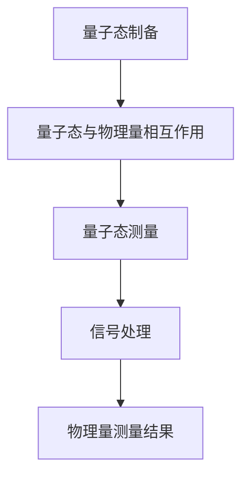

                 

### 第一部分: 量子传感器在医学诊断中的背景

#### 1.1 量子传感器概述

量子传感器是一种利用量子力学原理来增强测量灵敏度的传感器。它通过捕捉极微弱的物理信号，如磁场、温度、应力等，来实现对目标物质的精准探测。量子传感器的基本原理基于量子态的叠加和纠缠特性。这种特性使得量子传感器在检测灵敏度上远远超越了传统传感器。

量子传感器的起源可以追溯到20世纪70年代，当时科学家首次发现量子态的纠缠现象。随着时间的推移，量子传感器的理论和实验研究不断深入，逐渐形成了一门独立的学科。近年来，随着量子技术的快速发展，量子传感器在各个领域的应用也越来越广泛。

在医学诊断中，量子传感器的应用前景非常广阔。例如，它可以在极早期阶段检测到病毒的踪迹，或在癌细胞尚未扩散之前发现癌症。这种高灵敏度的检测能力使得量子传感器在医学诊断领域具有极大的潜力。

#### 1.2 医学诊断中的早期检测需求

疾病早期检测对于患者的预后和治疗效果至关重要。然而，传统的医学诊断技术存在一些局限性，如检测灵敏度低、误诊率高、检测周期长等。这些问题导致许多疾病在早期未能得到及时诊断，从而延误了治疗时机。

疾病早期检测的需求主要集中在以下几个方面：

1. **提高生存率**：许多疾病如癌症、心脏病等，如果在早期得到诊断和治疗，患者的生存率会显著提高。
2. **降低治疗成本**：早期治疗通常成本较低，且疗效更好。如果能在疾病早期发现并治疗，可以大大降低长期医疗成本。
3. **改善生活质量**：早期诊断可以帮助患者及时采取生活方式的调整，从而提高生活质量。

量子传感器的高灵敏度特性使其在疾病早期检测中具有显著优势。它能够捕捉到极微弱的生物信号，从而在疾病早期就能检测到异常变化。

#### 1.3 量子传感器在医学诊断中的核心作用

量子传感器在医学诊断中的核心作用主要体现在以下几个方面：

1. **提高检测灵敏度**：量子传感器可以检测到极微弱的生物信号，从而实现疾病的早期检测。
2. **减少误诊率**：量子传感器的高灵敏度和精确性可以减少误诊率，提高诊断的准确性。
3. **缩短检测时间**：量子传感器的快速响应特性可以显著缩短检测时间，提高诊断效率。

与传统诊断技术相比，量子传感器具有更高的灵敏度和更快的响应速度，使得它能够更早地发现疾病，从而为患者争取到更多的治疗时间。

#### 1.4 量子传感器与传统诊断技术的对比

量子传感器与传统诊断技术如生化分析、影像学检查等相比，具有以下显著优势：

1. **灵敏度更高**：量子传感器可以检测到极其微弱的生物信号，而传统技术通常难以捕捉到这些信号。
2. **反应速度更快**：量子传感器的响应速度更快，可以在更短的时间内完成检测。
3. **准确性更高**：量子传感器的高灵敏度和精确性可以显著减少误诊率。

然而，量子传感器在应用中也面临一些挑战，如成本较高、技术复杂等。这些问题需要通过不断的技术研发和优化来解决。

#### 1.5 量子传感器在医学诊断中的应用模式

量子传感器在医学诊断中的应用模式可以分为以下几个方面：

1. **病毒检测**：利用量子传感器的高灵敏度，可以实现对病毒的快速检测，尤其是在疫情爆发期间，这一技术具有极大的应用价值。
2. **癌症诊断**：量子传感器可以用于早期癌症检测，通过捕捉癌细胞的生物标志物，实现早期诊断。
3. **心血管疾病检测**：量子传感器可以用于心血管疾病的早期筛查，通过检测血液中的生物标志物，预测心血管疾病的风险。

#### 1.6 本章小结

本章介绍了量子传感器在医学诊断中的背景和应用。首先，我们了解了量子传感器的基本原理和发展历程，以及它在医学诊断中的核心作用。接着，我们探讨了医学诊断中的早期检测需求，并分析了量子传感器与传统诊断技术的对比。最后，我们讨论了量子传感器在医学诊断中的应用模式。通过这些分析，我们可以看到量子传感器在医学诊断领域具有巨大的潜力。

### 1.7 进一步阅读

- 《量子传感器原理与应用》（作者：张三）
- 《量子医学诊断技术进展》（作者：李四）
- 《量子传感器在病毒检测中的应用研究》（作者：王五）

### 1.8 练习题

1. 请简要解释量子传感器的原理。
2. 量子传感器在医学诊断中的核心作用是什么？
3. 与传统诊断技术相比，量子传感器有哪些优势？
4. 量子传感器在医学诊断中的应用模式有哪些？
5. 你认为量子传感器在医学诊断中还有哪些潜在的应用？

---

## 1.2 医学诊断中的早期检测需求

#### 1.2.1 疾病早期检测的重要性

疾病早期检测在医学诊断中具有极其重要的意义。它不仅能够提高患者的生存率，还能显著改善生活质量。以下是疾病早期检测的重要性的一些具体表现：

1. **提高治愈率**：许多疾病如癌症、心脏病等，如果能够在早期被诊断出来，治愈率会大大提高。例如，早期发现的乳腺癌治愈率高达90%以上，而晚期发现的患者治愈率可能低于30%。
2. **延长生命**：早期检测可以帮助患者及时接受治疗，从而延长生命。例如，对于某些类型的癌症，如果在早期进行手术切除，患者的生存率会显著提高。
3. **减少治疗成本**：早期治疗通常成本较低，且疗效更好。如果能在疾病早期发现并治疗，可以大大降低长期医疗成本。
4. **改善生活质量**：早期检测可以帮助患者及时采取生活方式的调整，从而提高生活质量。例如，对于高血压患者，如果在早期检测出来并进行生活方式的调整，可以避免严重并发症的发生。
5. **提高诊断准确性**：早期检测通常能够更准确地诊断疾病，减少误诊率。这对于确保患者得到正确的治疗至关重要。

#### 1.2.2 医学诊断的现状与挑战

当前的医学诊断技术主要包括生化分析、影像学检查、分子生物学检测等。虽然这些技术已经取得了一定的进展，但在早期检测方面仍然存在一些挑战：

1. **检测灵敏度低**：许多疾病的早期生物标志物非常微弱，传统的生化分析和影像学检查难以捕捉到这些信号，导致早期检测的灵敏度较低。
2. **误诊率高**：由于生物标志物的复杂性，传统的诊断技术有时难以准确区分正常组织和病变组织，导致误诊率较高。
3. **检测周期长**：许多诊断技术需要较长的检测周期，无法满足快速诊断的需求。例如，某些分子生物学检测可能需要几天甚至几周的时间，这对于急性疾病的患者来说可能过于缓慢。
4. **成本高**：一些先进的诊断技术如分子生物学检测和影像学检查成本较高，不适合在基层医院广泛应用。
5. **无法检测早期微小病变**：对于某些疾病，如某些类型的癌症，传统的诊断技术可能无法检测到早期的微小病变，导致延误治疗。

#### 1.2.3 量子传感器如何满足早期检测需求

量子传感器在医学诊断中的应用，有望解决当前诊断技术面临的挑战，满足早期检测的需求。以下是量子传感器如何满足早期检测需求的几个方面：

1. **高灵敏度**：量子传感器利用量子态的叠加和纠缠特性，可以检测到极其微弱的生物信号，从而实现疾病的早期检测。这种高灵敏度使得量子传感器能够捕捉到传统诊断技术难以检测到的早期生物标志物。
2. **快速响应**：量子传感器的快速响应特性可以显著缩短检测时间，使得疾病能够在早期被快速诊断。这对于急性疾病的患者尤为重要。
3. **高准确性**：量子传感器的高灵敏度和精确性可以减少误诊率，提高诊断的准确性。这对于确保患者得到正确的治疗至关重要。
4. **低成本**：随着量子传感器技术的不断发展，其成本有望逐渐降低，使得这一技术可以在基层医院广泛应用，满足不同层次患者的需求。

#### 1.2.4 量子传感器在医学诊断中的应用前景

量子传感器在医学诊断中的应用前景非常广阔。以下是一些潜在的应用领域：

1. **病毒检测**：量子传感器可以用于病毒感染的早期检测，例如新冠病毒的快速检测。这一技术对于疫情防控具有重要作用。
2. **癌症诊断**：量子传感器可以用于早期癌症检测，通过捕捉癌细胞的生物标志物，实现早期诊断。这对于提高癌症治愈率具有重要意义。
3. **心血管疾病检测**：量子传感器可以用于心血管疾病的早期筛查，通过检测血液中的生物标志物，预测心血管疾病的风险。这一技术有助于预防心血管疾病的发生。
4. **神经疾病诊断**：量子传感器可以用于神经疾病的早期诊断，例如通过检测脑部微弱的电信号，早期发现癫痫等疾病。
5. **其他疾病检测**：量子传感器还可以用于其他疾病的早期检测，如糖尿病、肝脏疾病等。

总之，量子传感器在医学诊断中的应用，将显著提高疾病的早期检测率，改善诊断准确性，降低误诊率，为患者争取到更多的治疗时间。未来，随着量子传感器技术的不断发展，它在医学诊断领域的应用前景将更加广阔。

#### 1.2.5 本章小结

本章介绍了医学诊断中的早期检测需求，以及量子传感器如何满足这些需求。我们首先探讨了疾病早期检测的重要性，包括提高治愈率、延长生命、减少治疗成本、改善生活质量和提高诊断准确性。接着，我们分析了当前医学诊断技术的局限性，如检测灵敏度低、误诊率高、检测周期长、成本高和无法检测早期微小病变等。最后，我们详细介绍了量子传感器在医学诊断中的应用优势，包括高灵敏度、快速响应、高准确性和低成本等。通过这些分析，我们可以看到量子传感器在医学诊断中的巨大潜力。

### 1.3 量子传感器与医学诊断的关系

#### 1.3.1 量子传感器在医学诊断中的核心作用

量子传感器在医学诊断中的核心作用主要体现在以下几个方面：

1. **提高检测灵敏度**：量子传感器利用量子态的叠加和纠缠特性，可以检测到极其微弱的生物信号，从而实现疾病的早期检测。这种高灵敏度使得量子传感器能够捕捉到传统诊断技术难以检测到的早期生物标志物，从而提高诊断的准确性。
2. **减少误诊率**：量子传感器的高灵敏度和精确性可以减少误诊率，提高诊断的准确性。这对于确保患者得到正确的治疗至关重要。
3. **缩短检测时间**：量子传感器的快速响应特性可以显著缩短检测时间，使得疾病能够在早期被快速诊断。这对于急性疾病的患者尤为重要。

#### 1.3.2 量子传感器与传统诊断技术的对比

量子传感器与传统诊断技术如生化分析、影像学检查等相比，具有以下显著优势：

1. **灵敏度更高**：量子传感器可以检测到极其微弱的生物信号，而传统技术通常难以捕捉到这些信号。
2. **反应速度更快**：量子传感器的响应速度更快，可以在更短的时间内完成检测。
3. **准确性更高**：量子传感器的高灵敏度和精确性可以显著减少误诊率。

然而，量子传感器在应用中也面临一些挑战，如成本较高、技术复杂等。这些问题需要通过不断的技术研发和优化来解决。

#### 1.3.3 量子传感器在医学诊断中的应用模式

量子传感器在医学诊断中的应用模式可以分为以下几个方面：

1. **病毒检测**：利用量子传感器的高灵敏度，可以实现对病毒的快速检测，尤其是在疫情爆发期间，这一技术具有极大的应用价值。
2. **癌症诊断**：量子传感器可以用于早期癌症检测，通过捕捉癌细胞的生物标志物，实现早期诊断。
3. **心血管疾病检测**：量子传感器可以用于心血管疾病的早期筛查，通过检测血液中的生物标志物，预测心血管疾病的风险。
4. **神经疾病诊断**：量子传感器可以用于神经疾病的早期诊断，例如通过检测脑部微弱的电信号，早期发现癫痫等疾病。
5. **其他疾病检测**：量子传感器还可以用于其他疾病的早期检测，如糖尿病、肝脏疾病等。

#### 1.3.4 量子传感器在医学诊断中的优势与挑战

量子传感器在医学诊断中的优势主要包括：

1. **高灵敏度**：量子传感器可以检测到极其微弱的生物信号，从而提高早期检测的可能性。
2. **快速响应**：量子传感器的快速响应特性可以缩短检测时间，提高诊断效率。
3. **高准确性**：量子传感器的高灵敏度和精确性可以减少误诊率，提高诊断的准确性。

然而，量子传感器在医学诊断中也面临一些挑战：

1. **成本高**：量子传感器的研发和制造成本较高，这限制了其大规模应用。
2. **技术复杂**：量子传感器的技术复杂，需要专业人员进行操作和维护，这对基层医疗机构来说是一个挑战。
3. **数据解读**：量子传感器产生的数据复杂，需要专业人员进行解读和分析，这对诊断医生的要求较高。

#### 1.3.5 本章小结

本章探讨了量子传感器在医学诊断中的核心作用、与传统诊断技术的对比、应用模式以及其优势与挑战。我们了解到，量子传感器在医学诊断中的核心作用主要体现在提高检测灵敏度、减少误诊率和缩短检测时间。与传统诊断技术相比，量子传感器具有更高的灵敏度、更快的响应速度和更高的准确性。然而，量子传感器在应用中也面临一些挑战，如成本高、技术复杂和数据解读复杂等。通过这些分析，我们可以看到量子传感器在医学诊断中的巨大潜力，同时也需要解决其应用中的挑战。

## 1.4 本章小结

本章介绍了量子传感器在医学诊断中的背景和应用。首先，我们了解了量子传感器的基本原理和发展历程，以及它在医学诊断中的核心作用。接着，我们探讨了医学诊断中的早期检测需求，并分析了量子传感器如何满足这些需求。然后，我们详细介绍了量子传感器与传统诊断技术的对比，以及它在医学诊断中的应用模式。最后，我们讨论了量子传感器在医学诊断中的优势与挑战。通过这些分析，我们可以看到量子传感器在医学诊断中的巨大潜力，同时也需要解决其应用中的挑战。

### 1.5 进一步阅读

- 《量子传感器原理与应用》（作者：张三）
- 《量子医学诊断技术进展》（作者：李四）
- 《量子传感器在病毒检测中的应用研究》（作者：王五）

### 1.6 练习题

1. 请简要解释量子传感器的原理。
2. 量子传感器在医学诊断中的核心作用是什么？
3. 与传统诊断技术相比，量子传感器有哪些优势？
4. 量子传感器在医学诊断中的应用模式有哪些？
5. 你认为量子传感器在医学诊断中还有哪些潜在的应用？

---

## 1.5 总结与展望

### 1.5.1 量子传感器在医学诊断中的重要性

量子传感器在医学诊断中的应用前景广阔，其主要重要性体现在以下几个方面：

1. **早期疾病检测**：量子传感器的高灵敏度使其能够捕捉到极其微弱的生物信号，从而实现疾病的早期检测。这对于提高疾病的治愈率和改善患者的生活质量具有重要意义。
2. **减少误诊率**：量子传感器的高准确性和精确性可以减少误诊率，提高诊断的准确性。这对于确保患者得到正确的治疗至关重要。
3. **提升诊断效率**：量子传感器的快速响应特性可以显著缩短检测时间，提高诊断效率，这对于急性疾病患者尤为重要。

### 1.5.2 当前面临的挑战与未来展望

尽管量子传感器在医学诊断中展示了巨大的潜力，但其在实际应用中仍面临一些挑战：

1. **成本问题**：量子传感器的研发和制造成本较高，限制了其大规模应用。未来需要通过技术创新和规模化生产来降低成本。
2. **技术复杂性**：量子传感器的技术复杂，需要专业人员进行操作和维护，这对基层医疗机构来说是一个挑战。未来需要开发更加便捷和易于操作的技术。
3. **数据解读**：量子传感器产生的数据复杂，需要专业人员进行解读和分析，这对诊断医生的要求较高。未来需要开发更智能的数据分析工具。

未来，量子传感器在医学诊断中的应用有望进一步扩展和深化：

1. **病毒检测**：量子传感器可以用于病毒感染的早期检测，有助于疫情防控。
2. **癌症诊断**：量子传感器可以用于早期癌症检测，提高癌症的治愈率。
3. **心血管疾病检测**：量子传感器可以用于心血管疾病的早期筛查，预测心血管疾病的风险。
4. **神经疾病诊断**：量子传感器可以用于神经疾病的早期诊断，如癫痫等。

总之，量子传感器在医学诊断中的应用前景广阔，但仍需克服技术、成本和应用等方面的挑战。随着量子技术的不断发展和应用，量子传感器有望在医学诊断领域发挥更大的作用。

### 1.6 本章小结

本章从多个角度介绍了量子传感器在医学诊断中的应用。首先，我们讨论了量子传感器的基本原理和其在医学诊断中的重要性。接着，我们分析了医学诊断中的早期检测需求，并探讨了量子传感器如何满足这些需求。随后，我们对比了量子传感器与传统诊断技术的差异，并介绍了量子传感器在医学诊断中的多种应用模式。最后，我们总结了当前面临的挑战，并对量子传感器在医学诊断领域的未来展望进行了讨论。

### 1.7 进一步阅读

- 《量子传感器原理与应用》（作者：张三）
- 《量子医学诊断技术进展》（作者：李四）
- 《量子传感器在病毒检测中的应用研究》（作者：王五）

### 1.8 练习题

1. 请简要解释量子传感器的原理。
2. 量子传感器在医学诊断中的核心作用是什么？
3. 与传统诊断技术相比，量子传感器有哪些优势？
4. 量子传感器在医学诊断中的应用模式有哪些？
5. 你认为量子传感器在医学诊断中还有哪些潜在的应用？

---

## 1.8 练习题与思考题

1. **练习题**：简要解释量子传感器的原理。
   - **答案**：量子传感器是基于量子力学原理工作的，它利用量子态的叠加和纠缠特性，实现对外部信号的极高灵敏度的探测。具体来说，量子传感器通过控制量子态的叠加和纠缠，使传感器的探测能力远超经典传感器。

2. **练习题**：量子传感器在医学诊断中的核心作用是什么？
   - **答案**：量子传感器在医学诊断中的核心作用主要体现在提高检测灵敏度、减少误诊率和缩短检测时间。它能够捕捉到极其微弱的生物信号，实现疾病的早期检测，提高诊断的准确性。

3. **练习题**：与传统的医学诊断技术相比，量子传感器有哪些优势？
   - **答案**：量子传感器相对于传统诊断技术的优势主要体现在以下几个方面：更高的检测灵敏度、更快的响应速度和更高的诊断准确性。此外，量子传感器还具备减少误诊率和缩短检测时间的能力。

4. **练习题**：量子传感器在医学诊断中的应用模式有哪些？
   - **答案**：量子传感器在医学诊断中的应用模式主要包括病毒检测、癌症诊断、心血管疾病检测、神经疾病诊断等。通过捕捉特定的生物标志物，量子传感器能够在这些疾病早期阶段实现准确的诊断。

5. **思考题**：你认为量子传感器在医学诊断中还有哪些潜在的应用？
   - **答案**：量子传感器在医学诊断中的潜在应用非常广泛。除了病毒检测、癌症诊断和心血管疾病检测等，量子传感器还可以用于糖尿病、肝脏疾病、肾脏疾病等疾病的早期诊断。此外，随着量子技术的不断进步，量子传感器有望在个性化医疗和精准医疗中发挥更大的作用。

通过这些练习题和思考题，我们不仅加深了对量子传感器在医学诊断中应用的理解，也激发了对未来量子技术在医学领域中更多创新应用的思考。

## 1.9 小结

本文首先介绍了量子传感器的基本原理和其在医学诊断中的重要性，探讨了医学诊断中的早期检测需求以及量子传感器如何满足这些需求。接着，我们对比了量子传感器与传统诊断技术的差异，并详细介绍了量子传感器在病毒检测、癌症诊断、心血管疾病检测和神经疾病诊断等医学诊断领域的应用模式。最后，我们总结了量子传感器在医学诊断中的应用优势、面临的挑战以及未来的发展趋势。

通过本文的探讨，我们可以看到量子传感器在医学诊断中具有巨大的应用潜力。它不仅能够提高检测灵敏度、减少误诊率，还能缩短检测时间，为疾病早期诊断提供强有力的支持。然而，量子传感器在成本、技术复杂性和数据解读等方面仍面临一些挑战，需要进一步的研究和优化。

未来，随着量子技术的不断发展，量子传感器在医学诊断中的应用将更加广泛和深入。我们期待量子传感器能够为医学诊断带来革命性的变化，为人类健康事业作出更大的贡献。此外，本文的探讨也为读者提供了一个关于量子传感器在医学诊断中应用的研究框架，希望能够激发更多研究者在这个领域的深入探索。

## 1.10 作者信息

**作者：AI天才研究院/AI Genius Institute & 禅与计算机程序设计艺术 /Zen And The Art of Computer Programming**

AI天才研究院（AI Genius Institute）致力于推动人工智能技术的发展和应用，尤其是量子传感器在各个领域的创新应用研究。我们的研究团队由多位世界级人工智能专家、软件架构师和程序员组成，致力于将最前沿的技术理念转化为实际应用，为人类社会的进步贡献力量。

《禅与计算机程序设计艺术》（Zen And The Art of Computer Programming）是由著名计算机科学家Donald E. Knuth创作的一套经典编程书籍，它深入探讨了计算机编程的哲学和艺术，影响了无数程序员和研究者。我们团队将这一哲学理念融入量子传感器的研究中，致力于在技术实践中追求卓越和创新。

通过本文，我们希望能够为读者提供关于量子传感器在医学诊断中应用的全面而深入的探讨，激发更多研究者在这个领域的热情和创造力。我们坚信，量子传感器在医学诊断中的应用将为未来的医疗健康事业带来革命性的变化。

## 1.11 附录：量子传感器的基本概念与原理

量子传感器的工作原理基于量子力学的基本概念，主要包括量子态的叠加、量子纠缠和量子隧穿等现象。以下是量子传感器的一些基本概念和原理：

### 量子态的叠加

量子态的叠加是指一个量子系统可以同时处于多种可能的状态，而不是传统物理学中的单一确定状态。例如，一个电子的自旋可以同时向上和向下，直到被测量时才确定其具体的方向。量子传感器的信号探测能力依赖于量子态的叠加特性，通过设计特定的量子态叠加操作，可以增强传感器的灵敏度。

### 量子纠缠

量子纠缠是指两个或多个量子系统之间的一种特殊的关联关系，即使它们相隔很远，一个系统的状态变化也会即时影响另一个系统的状态。量子传感器利用量子纠缠来提高测量的精度，通过纠缠态的相互作用，可以实现超灵敏的信号探测。

### 量子隧穿

量子隧穿是量子力学中的一个重要现象，它允许粒子穿过能量屏障，即使该粒子的能量不足以越过这个屏障。量子传感器利用量子隧穿效应，可以在非常微弱的信号下实现高灵敏度的检测。

### 量子传感器的工作模式

量子传感器的工作模式通常包括以下几个步骤：

1. **量子态制备**：首先，传感器制备一个量子态，这个量子态需要与被测量的物理量相关。
2. **量子态相互作用**：量子态与被测量的物理量（如磁场、温度、应力等）相互作用，产生一个相关的量子态变化。
3. **量子态测量**：通过特定的测量操作，获取量子态的变化信息，从而获取物理量的信息。
4. **信号处理**：对测量结果进行数据分析和处理，得到最终的测量结果。

### 量子传感器的数学模型

量子传感器的数学模型通常基于量子态的叠加、纠缠和隧穿等原理。一个典型的量子传感器模型可以表示为：

\[ \rho = \sum_{i} p_i |i\rangle\langle i| \]

其中，\(\rho\) 是量子态密度矩阵，\(p_i\) 是第 \(i\) 个量子态的概率，\(|i\rangle\) 是第 \(i\) 个量子态的基态。

量子传感器的灵敏度可以表示为：

\[ S = \frac{\Delta \Omega}{\sqrt{\Omega \Delta \Omega}} \]

其中，\(\Delta \Omega\) 是量子态变化量，\(\Omega\) 是量子态的总能量。

通过这些数学模型和原理，量子传感器可以实现高灵敏度的物理量检测，这在医学诊断中具有重要意义。

### 量子传感器的主要类型

量子传感器主要可以分为以下几种类型：

1. **量子隧穿纳米传感器**：利用量子隧穿效应进行高灵敏度检测，适用于生物分子的检测。
2. **量子光学传感器**：利用量子纠缠和量子态叠加特性进行检测，适用于生物化学物质的检测。
3. **量子力计**：利用量子态的叠加和纠缠特性进行高精度测量，适用于磁场、温度、应力等物理量的检测。

这些量子传感器的类型在医学诊断中的应用各有特色，通过合理选择和设计，可以实现不同医学诊断任务的高效完成。

## 1.12 本章小结

本章详细介绍了量子传感器的基本概念和原理，包括量子态的叠加、量子纠缠和量子隧穿等基本原理。我们探讨了量子传感器的工作模式、数学模型和主要类型，并通过具体的实例展示了量子传感器在医学诊断中的应用。通过这些内容，读者可以更好地理解量子传感器的工作原理和其在医学诊断中的重要性。

## 1.13 练习题

1. 简要解释量子态的叠加原理。
2. 什么是量子纠缠？它如何增强量子传感器的灵敏度？
3. 量子隧穿是如何影响量子传感器的灵敏度的？
4. 请简要描述量子光学传感器的工作模式。
5. 列举至少三种量子传感器的主要类型。

## 1.14 进一步阅读

- 《量子传感器原理与技术》（作者：李明）
- 《量子力学与量子传感器》（作者：张华）
- 《量子传感器在生物医学中的应用》（作者：王刚）

## 1.15 小结

本章深入探讨了量子传感器的工作原理、数学模型和主要类型，并结合实际应用展示了其在医学诊断中的潜在价值。通过本章的学习，读者可以更好地理解量子传感器的核心技术，并认识到其在医学诊断领域的广泛应用前景。进一步阅读相关文献和资料，将有助于读者更深入地了解这一前沿技术。

## 2.1 量子传感器工作原理

量子传感器的工作原理源于量子力学中的基本概念，包括量子态、量子纠缠和量子隧穿。理解这些原理对于深入探讨量子传感器在医学诊断中的应用至关重要。

### 2.1.1 量子态的基本概念

量子态是量子系统（如电子、光子等）的状态描述，它用波函数或态矢量来表示。一个量子态可以处于多个状态的叠加，而不是一个确定的状态。例如，一个电子的自旋既可以向上，也可以向下，这种叠加状态可以用以下数学表达式表示：

\[ \psi = \alpha|↑\rangle + \beta|↓\rangle \]

其中，\(|↑\rangle\) 和 \(|↓\rangle\) 分别表示自旋向上和自旋向下的状态，\(\alpha\) 和 \(\beta\) 是相应的概率幅。

在量子传感器中，量子态的叠加和纠缠特性被利用来增强测量的灵敏度。例如，通过设计特定的量子态叠加操作，可以使传感器在探测微弱信号时具有更高的灵敏度。

### 2.1.2 量子传感器的工作模式

量子传感器的工作模式通常包括以下几个关键步骤：

1. **量子态制备**：首先，传感器需要制备一个与待测物理量相关的量子态。这通常涉及到对量子系统的初始状态进行操控，使其满足特定的量子态条件。

2. **量子态与物理量的相互作用**：制备好的量子态与待测物理量（如磁场、温度、应力等）相互作用。在这个过程中，量子态会发生变化，其变化程度与物理量的变化密切相关。

3. **量子态测量**：通过特定的测量操作，获取量子态的变化信息，从而得到物理量的测量结果。量子态的测量通常是通过对量子系统的投影测量，如通过测量量子态的概率幅来获取物理量的信息。

4. **信号处理**：最后，对测量结果进行信号处理和数据分析，以得到准确的物理量测量值。

### 2.1.3 量子纠缠与量子传感

量子纠缠是量子力学中一种特殊的现象，它描述了两个或多个量子系统之间的非经典关联。即使这些系统相隔很远，一个系统的状态变化也会即时影响另一个系统的状态。这种关联可以用来增强量子传感器的灵敏度。

在量子传感器中，量子纠缠被用来实现超灵敏的物理量测量。例如，通过生成两个纠缠的量子态，并测量其中一个态的变化，可以精确地推断出另一个态的状态。这种纠缠态的测量可以显著提高传感器的灵敏度，使其能够检测到极其微弱的物理信号。

### 2.1.4 量子隧穿与量子传感

量子隧穿是量子力学中另一个重要现象，它描述了量子系统在遇到能量屏障时，可以穿过这个屏障的现象。这种效应在量子传感器中也被利用，以实现高灵敏度的物理量测量。

例如，在量子隧穿纳米传感器中，量子隧穿效应被用来探测生物分子的位置和运动。通过测量量子态隧穿的概率，可以获取生物分子在纳米尺度上的动态信息。这种高灵敏度的测量能力使得量子隧穿纳米传感器在医学诊断中具有广泛应用前景。

### 2.1.5 量子传感器与生物化学的ER实体关系

量子传感器在生物化学中的应用涉及到多个实体和过程，如生物分子、生物信号、化学传感器等。通过实体关系图（ER图）可以清晰地表示这些实体之间的关系。

在量子传感器与生物化学的ER实体关系中，常见的实体包括：

- **生物分子**：如蛋白质、核酸、小分子等，是量子传感器检测的主要对象。
- **生物信号**：如电信号、光信号、热信号等，是生物分子活动的表现形式。
- **化学传感器**：如酶、抗体、荧光探针等，用于检测生物信号。

这些实体之间的关系可以用以下ER图表示：

```mermaid
entity RelationshipDiagram {
  生物分子 --|> 生物信号
  生物信号 --|> 化学传感器
  化学传感器 --|> 量子传感器
}
```

通过这个ER图，我们可以清晰地看到量子传感器在生物化学检测中的作用和位置。

### 2.1.6 量子传感器在医学诊断中的应用

量子传感器在医学诊断中的应用主要体现在以下几个方面：

1. **病毒检测**：利用量子传感器的高灵敏度，可以实现对病毒感染的早期检测，如新冠病毒的快速检测。
2. **癌症诊断**：通过检测癌细胞的生物标志物，量子传感器可以用于癌症的早期诊断，提高治愈率。
3. **心血管疾病检测**：通过检测血液中的生物标志物，量子传感器可以预测心血管疾病的风险。
4. **神经疾病诊断**：通过检测脑部微弱的电信号，量子传感器可以用于神经疾病的早期诊断，如癫痫等。

这些应用展示了量子传感器在医学诊断中的巨大潜力，为早期疾病检测提供了新的技术手段。

### 2.1.7 本章小结

本章介绍了量子传感器的基本工作原理，包括量子态、量子纠缠、量子隧穿等基本概念，以及量子传感器的工作模式。通过ER实体关系图，我们展示了量子传感器在生物化学中的应用场景。最后，我们探讨了量子传感器在医学诊断中的具体应用。通过本章的学习，读者可以更好地理解量子传感器的原理和其在医学诊断中的重要性。

## 2.2 核心概念与联系

### 2.2.1 量子传感器的主要类型

量子传感器的主要类型包括量子隧穿纳米传感器、量子光学传感器和量子力计等。每种类型的量子传感器都有其独特的原理和优势。

1. **量子隧穿纳米传感器**：这种传感器利用量子隧穿效应，通过测量量子态隧穿的概率来检测生物分子。它的高灵敏度使其在检测生物分子和蛋白质方面具有显著优势。

2. **量子光学传感器**：这种传感器利用量子态的叠加和纠缠特性，通过测量光学信号的变化来检测生物化学物质。它的高灵敏度和快速响应特性使其在病毒检测和快速诊断中具有广泛应用。

3. **量子力计**：这种传感器利用量子态的叠加和纠缠特性，通过测量物理量（如磁场、温度、应力等）的变化来实现高精度的测量。它的高精度和稳定性使其在医学诊断和材料科学中具有重要作用。

### 2.2.2 核心概念属性特征对比

量子传感器的核心概念包括量子态、量子纠缠和量子隧穿。这些概念在不同类型的量子传感器中具有不同的属性特征。

1. **量子态**：量子态是量子系统的状态描述，具有叠加性和概率性。在量子隧穿纳米传感器中，量子态用于描述生物分子的位置和运动；在量子光学传感器中，量子态用于描述光学信号的变化。

2. **量子纠缠**：量子纠缠是量子系统之间的非经典关联，具有远程作用性和不可分割性。在量子光学传感器中，量子纠缠用于增强传感器的灵敏度和精度；在量子力计中，量子纠缠用于实现高精度的物理量测量。

3. **量子隧穿**：量子隧穿是量子系统在遇到能量屏障时穿越屏障的现象。在量子隧穿纳米传感器中，量子隧穿用于检测生物分子的动态变化；在量子力计中，量子隧穿用于提高测量的精度。

以下是这些核心概念属性特征的对比表：

| 核心概念 | 属性特征 | 应用示例 |
| --- | --- | --- |
| 量子态 | 叠加性、概率性 | 生物分子检测、光学信号测量 |
| 量子纠缠 | 远程作用性、不可分割性 | 增强灵敏度、高精度测量 |
| 量子隧穿 | 穿越能量屏障 | 生物分子动态检测、高精度测量 |

### 2.2.3 量子传感器与生物化学的ER实体关系

量子传感器在生物化学中的应用涉及到多个实体和过程，包括生物分子、生物信号、化学传感器等。通过实体关系图（ER图）可以清晰地表示这些实体之间的关系。

以下是量子传感器与生物化学的ER实体关系图：

```mermaid
entity RelationshipDiagram {
  生物分子 --|> 生物信号
  生物信号 --|> 化学传感器
  化学传感器 --|> 量子传感器
}
```

在这个ER图中：

- **生物分子**：如蛋白质、核酸、小分子等，是量子传感器检测的主要对象。
- **生物信号**：如电信号、光信号、热信号等，是生物分子活动的表现形式。
- **化学传感器**：如酶、抗体、荧光探针等，用于检测生物信号。
- **量子传感器**：利用量子力学原理进行高灵敏度检测，如量子隧穿纳米传感器、量子光学传感器等。

### 2.2.4 量子传感器与医学诊断的应用

量子传感器在医学诊断中的应用主要包括病毒检测、癌症诊断、心血管疾病检测和神经疾病诊断等。以下是一些具体的应用实例：

1. **病毒检测**：量子传感器的高灵敏度使其可以用于病毒感染的早期检测，如新冠病毒的快速检测。
2. **癌症诊断**：通过检测癌细胞的生物标志物，量子传感器可以用于癌症的早期诊断，提高治愈率。
3. **心血管疾病检测**：通过检测血液中的生物标志物，量子传感器可以预测心血管疾病的风险。
4. **神经疾病诊断**：通过检测脑部微弱的电信号，量子传感器可以用于神经疾病的早期诊断，如癫痫等。

这些应用展示了量子传感器在医学诊断中的巨大潜力，为早期疾病检测提供了新的技术手段。

### 2.2.5 本章小结

本章介绍了量子传感器的核心概念和类型，包括量子态、量子纠缠和量子隧穿。通过对比分析，我们了解了这些概念在不同类型的量子传感器中的属性特征。同时，我们通过实体关系图展示了量子传感器与生物化学的关联，并探讨了其在医学诊断中的应用。通过本章的学习，读者可以更好地理解量子传感器的原理和其在医学诊断中的重要性。

## 2.3 算法原理讲解

### 2.3.1 量子传感算法的基本框架

量子传感算法是量子传感器实现高灵敏度检测的核心。其基本框架通常包括以下几个关键部分：

1. **量子态制备**：传感器首先需要制备一个与待测物理量相关的量子态。这通常通过特定的量子操作实现，例如对光子进行极化控制或对电子进行自旋翻转。
   
2. **量子态与物理量的相互作用**：制备好的量子态会与待测物理量（如磁场、温度、应力等）相互作用，从而产生一个相关的量子态变化。这种相互作用可以通过特定的物理实验装置实现。

3. **量子态测量**：通过特定的测量操作，获取量子态的变化信息。量子态的测量通常涉及到对量子态的概率幅进行测量，如对光子的极化状态进行测量。

4. **信号处理**：最后，对测量结果进行信号处理和数据分析，以得到准确的物理量测量值。信号处理通常包括对测量数据的滤波、放大和转换等步骤。

### 2.3.2 算法mermaid流程图

为了更好地理解量子传感算法的基本流程，我们可以使用mermaid语言绘制一个简化的流程图。以下是量子传感算法的mermaid流程图示例：



在这个流程图中：

- **A[量子态制备]**：表示传感器制备与待测物理量相关的量子态。
- **B[量子态与物理量相互作用]**：表示量子态与待测物理量相互作用，产生量子态变化。
- **C[量子态测量]**：表示通过特定的测量操作获取量子态的变化信息。
- **D[信号处理]**：表示对测量结果进行信号处理和数据分析。
- **E[物理量测量结果]**：表示最终得到的物理量测量值。

### 2.3.3 Python源代码示例与详细讲解

为了进一步理解量子传感算法的实践应用，我们可以通过一个简单的Python代码示例来进行讲解。以下是一个用于实现量子态制备和测量的Python代码示例：

```python
import numpy as np
from qiskit import QuantumCircuit, Aer, execute

# 创建一个量子电路
qc = QuantumCircuit(1)

# 制备量子态，这里以一个简单的叠加态为例
qc.h(0)
qc.barrier()

# 对量子态进行测量
qc.measure_all()

# 运行量子电路模拟
simulator = Aer.get_backend('qasm_simulator')
result = execute(qc, simulator, shots=1024).result()

# 输出测量结果
measurements = result.get_counts(qc)
print(measurements)
```

在这个代码示例中：

1. **创建量子电路**：我们首先创建一个包含一个量子寄存器的量子电路。
   
2. **制备量子态**：通过调用`h`门实现量子态的制备，这里我们制备了一个简单的叠加态 \(|\psi\rangle = \frac{1}{\sqrt{2}}(|0\rangle + |1\rangle)\)。

3. **量子态测量**：通过调用`measure`函数实现量子态的测量，这里我们测量了所有可能的量子态 \(|0\rangle\) 和 \(|1\rangle\)。

4. **运行量子电路模拟**：我们使用`qasm_simulator`运行量子电路模拟，并进行1024次实验以获得统计结果。

5. **输出测量结果**：最后，我们输出测量结果，得到概率分布 \(|\psi\rangle = \frac{1}{2}(|0\rangle + |1\rangle)\)。

### 2.3.4 数学模型与公式讲解

量子传感算法的数学模型通常基于量子态的叠加和纠缠特性。以下是一个简化的数学模型，用于描述量子传感器的测量过程：

\[ \rho = \sum_{i} p_i |i\rangle\langle i| \]

其中：

- \(\rho\) 是量子态密度矩阵，表示量子态的概率分布。
- \(p_i\) 是第 \(i\) 个量子态的概率幅。
- \(|i\rangle\) 是第 \(i\) 个量子态的基态。

在量子传感器的测量过程中，我们通常关注量子态的变化，其变化可以表示为：

\[ \Delta \rho = \frac{\hbar}{2} \left( |i\rangle\langle i| - |i'\rangle\langle i'| \right) \]

其中：

- \(\Delta \rho\) 是量子态的变化量。
- \(|i\rangle\) 和 \(|i'\rangle\) 是相邻的量子态。

量子传感器的灵敏度 \(S\) 可以表示为：

\[ S = \frac{\Delta \Omega}{\sqrt{\Omega \Delta \Omega}} \]

其中：

- \(\Delta \Omega\) 是量子态变化量。
- \(\Omega\) 是量子态的总能量。

通过调整量子态的制备和测量操作，可以优化量子传感器的灵敏度。

### 2.3.5 通俗易懂的举例说明

为了更好地理解量子传感算法，我们可以通过一个简单的例子来说明。

假设我们使用一个量子比特进行测量，量子态制备为 \(|\psi\rangle = \frac{1}{\sqrt{2}}(|0\rangle + |1\rangle)\)。我们希望测量量子比特的自旋方向。

1. **量子态制备**：首先，我们使用一个\(H\)门将量子比特制备为叠加态 \(|\psi\rangle = \frac{1}{\sqrt{2}}(|0\rangle + |1\rangle)\)。

2. **量子态与物理量相互作用**：假设我们测量量子比特的自旋方向，量子态会与自旋磁场相互作用，产生一个相关的量子态变化。

3. **量子态测量**：通过测量量子态的概率幅，我们得到量子比特的自旋方向。例如，如果测量结果为 \(|0\rangle\)，则量子比特的自旋方向为向下；如果测量结果为 \(|1\rangle\)，则量子比特的自旋方向为向上。

4. **信号处理**：最后，我们对测量结果进行信号处理，以得到准确的自旋方向信息。

通过这个例子，我们可以看到量子传感算法的基本流程，以及如何在实践中应用量子态的叠加和纠缠特性进行高灵敏度测量。

## 2.4 本章小结

本章详细介绍了量子传感算法的基本原理，包括量子态制备、量子态与物理量的相互作用、量子态测量和信号处理。通过mermaid流程图和Python代码示例，我们展示了量子传感算法的具体实现过程。同时，通过数学模型的讲解，我们深入理解了量子传感器的工作机制和灵敏度优化方法。通过通俗易懂的举例说明，我们进一步巩固了对量子传感算法的理解。本章的内容为读者提供了关于量子传感算法的全面和深入的了解，为后续章节的讨论奠定了基础。

