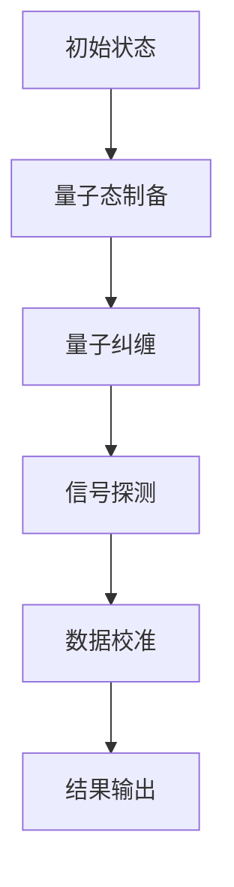
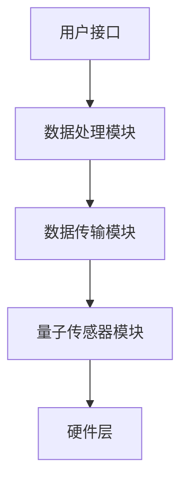
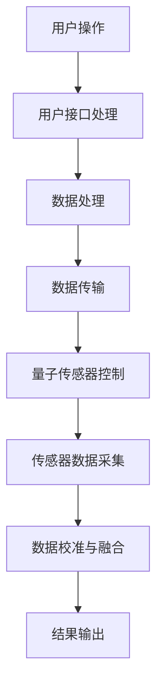

                 


### 文章标题：量子传感器在地球磁场探测中的应用

#### 关键词：量子传感器，地球磁场探测，技术应用，算法原理，系统架构

#### 摘要：
本文将探讨量子传感器在地球磁场探测中的应用，从背景介绍、核心原理、应用实例到实践项目，逐步分析并阐述量子传感器在地球磁场探测中的技术优势和实际应用价值。通过详细解析算法原理、系统架构和项目实战，提供全面的量子传感器应用指南。

## 目录大纲

1. **量子传感器与地球磁场探测背景**
   1.1 量子传感技术简介
   1.2 量子传感器原理
   1.3 量子传感器与传统传感器的比较
   1.4 地球磁场探测的现状与需求

2. **量子传感器在地球磁场探测中的应用原理**
   2.1 量子传感原理
   2.2 量子态的制备与探测
   2.3 量子纠缠与量子传感器

3. **量子传感器在地球磁场探测中的应用实例**
   3.1 量子磁场传感器的结构设计
   3.2 量子磁场传感器的性能分析
   3.3 量子磁场传感器在地球磁场探测中的应用案例

4. **量子传感器在地球磁场探测中的应用实践**
   4.1 实践项目概述
   4.2 系统架构设计与实现
   4.3 项目实战与案例分析

5. **最佳实践与总结**
   5.1 最佳实践 tips
   5.2 项目小结
   5.3 注意事项与拓展阅读

### 正文内容

#### 第一部分：量子传感器与地球磁场探测背景

### 第1章：量子传感器概述

#### 1.1 量子传感技术简介
量子传感器是一种利用量子物理原理进行信息测量的设备。与传统传感器相比，量子传感器具有高灵敏度、高分辨率和强抗干扰能力等特点。这些特性使得量子传感器在诸多领域，如精密测量、医疗诊断、环境监测和军事侦察等方面具有广泛的应用前景。

#### 1.2 量子传感器原理
量子传感器的工作原理主要基于量子纠缠、量子隧穿和量子相干等量子效应。通过精确操控量子系统，可以实现对物理量的超灵敏测量。

#### 1.3 量子传感器与传统传感器的比较
传统传感器基于经典物理原理，测量精度受限于热噪声和环境干扰。而量子传感器利用量子效应，可以突破经典传感器的限制，实现更高灵敏度和更低噪声的测量。

#### 1.4 地球磁场探测的现状与需求
地球磁场探测对于地质勘探、环境监测和导航定位等领域具有重要意义。然而，传统磁场探测技术面临着测量精度低、抗干扰能力弱等挑战。量子传感器在这一领域具有显著的技术优势和应用潜力。

#### 第二部分：量子传感器在地球磁场探测中的应用原理

### 第2章：量子传感器在地球磁场探测中的核心原理

#### 2.1 量子传感原理
量子传感器通过测量量子态的变化来获取物理信息。在地球磁场探测中，量子传感器可以测量地球磁场的强度和方向。

#### 2.2 量子态的制备与探测
量子态的制备与探测是量子传感器实现高灵敏度测量的关键。通过精确操控，可以实现量子态的制备和稳定探测。

#### 2.3 量子纠缠与量子传感器
量子纠缠是量子传感器实现超灵敏测量的重要原理。通过量子纠缠，可以实现量子传感器之间的协同工作，提高测量精度。

#### 第三部分：量子传感器在地球磁场探测中的应用实例

### 第3章：量子传感器在地球磁场探测中的应用实例

#### 3.1 量子磁场传感器的结构设计
量子磁场传感器的结构设计包括量子传感器芯片、信号放大和处理单元等部分。通过优化传感器结构，可以提高测量精度和稳定性。

#### 3.2 量子磁场传感器的性能分析
量子磁场传感器的性能分析主要包括灵敏度、分辨率、抗干扰能力和测量范围等指标。通过实验数据，可以评估量子磁场传感器的性能表现。

#### 3.3 量子磁场传感器在地球磁场探测中的应用案例
通过实际应用案例，可以展示量子磁场传感器在地球磁场探测中的技术优势和实际应用效果。

#### 第四部分：量子传感器在地球磁场探测中的应用实践

### 第4章：量子传感器在地球磁场探测中的应用实践

#### 4.1 实践项目概述
实践项目概述包括项目背景、目标、任务和预期成果。

#### 4.2 系统架构设计与实现
系统架构设计包括领域模型、系统架构、接口设计和系统交互等部分。通过系统架构设计，可以实现量子传感器在地球磁场探测中的实际应用。

#### 4.3 项目实战与案例分析
项目实战与案例分析包括环境安装与配置、系统核心实现源代码、代码应用解读与分析、实际案例分析和详细讲解等部分。

#### 第五部分：最佳实践与总结

### 第5章：最佳实践与总结

#### 5.1 最佳实践 tips
总结最佳实践经验，为量子传感器在地球磁场探测中的应用提供实用建议。

#### 5.2 项目小结
对实践项目进行总结，分析项目的成功经验和不足之处。

#### 5.3 注意事项与拓展阅读
针对量子传感器在地球磁场探测中的应用，提出注意事项和拓展阅读建议。

### 结语
量子传感器在地球磁场探测中的应用为传统技术带来了新的突破。通过本文的详细分析和实例讲解，读者可以深入了解量子传感器在地球磁场探测中的应用原理和实践方法，为相关领域的研究和开发提供参考。

### 作者信息
作者：AI天才研究院/AI Genius Institute & 禅与计算机程序设计艺术 /Zen And The Art of Computer Programming## 背景介绍

量子传感器作为一种前沿技术，近年来在多个领域展现出了显著的优势和应用潜力。其独特的工作原理和卓越的性能，使得量子传感器在地球磁场探测中的应用成为了一个备受关注的研究方向。地球磁场是地球环境中一个重要的物理量，对于地质勘探、环境监测和导航定位等领域具有重要意义。然而，传统磁场探测技术面临着测量精度低、抗干扰能力弱等挑战，难以满足现代科技对高精度、高灵敏度探测的需求。

地球磁场的探测不仅仅是科学研究的需要，更是实际应用的重要环节。例如，在地质勘探中，精确测量地球磁场可以帮助识别矿产资源、发现地质构造变化；在环境监测中，实时监测地球磁场可以预警地震、火山等自然灾害；在导航定位中，地球磁场数据可以辅助卫星导航系统，提高定位精度和可靠性。因此，提升地球磁场探测技术的性能和精度，对于促进相关领域的科技进步和产业发展具有重要意义。

量子传感器在地球磁场探测中的应用具有显著的技术优势。首先，量子传感器具有极高的灵敏度，可以捕捉到极其微弱的磁场变化，突破了传统传感器的测量极限。其次，量子传感器具备强抗干扰能力，能够有效抑制外部环境噪声的影响，提高测量数据的准确性和稳定性。此外，量子传感器还具有快速响应和实时监测的特点，可以在复杂环境下进行高效、精确的探测。

然而，尽管量子传感器在地球磁场探测中展现出巨大的潜力，但实际应用仍面临诸多挑战。首先，量子传感器技术尚处于发展阶段，其性能和稳定性有待进一步提升。其次，量子传感器的制造成本较高，规模化应用受到一定限制。此外，量子传感器在地球磁场探测中的具体应用场景和需求尚未完全明确，需要进一步的研究和探索。

综上所述，量子传感器在地球磁场探测中的应用具有广阔的前景和巨大的潜力。通过对量子传感器技术的深入研究与应用，可以突破传统磁场探测技术的瓶颈，推动地球磁场探测领域的发展，为科学研究、环境保护和产业发展提供有力支持。

### 核心概念与联系

量子传感器作为一种利用量子物理原理进行信息测量的设备，其工作原理和性能特点决定了其在地球磁场探测中的应用效果。以下是对核心概念和原理的详细解析，以及与传统传感器的对比，同时通过ER实体关系图和概念属性特征对比表格来展示量子传感器和传统传感器的主要区别。

#### 量子传感原理

量子传感器的工作原理主要基于量子效应，如量子纠缠、量子隧穿和量子相干等。这些量子效应使得量子传感器能够实现超灵敏的物理量测量。

1. **量子纠缠**：量子纠缠是量子力学中的一种特殊现象，两个或多个量子系统之间可以形成一种不可分割的关联状态。通过精确操控量子纠缠，可以实现对物理量的超灵敏测量。
   
2. **量子隧穿**：量子隧穿是指量子系统在没有足够能量的情况下，可以通过势垒的效应。这一现象可以用于测量微小物理量的变化，提高传感器的灵敏度。

3. **量子相干**：量子相干是指量子系统在不同状态之间的干涉效应。通过量子相干，可以实现高精度的物理量测量。

#### 量子态的制备与探测

量子态的制备与探测是量子传感器实现高灵敏度测量的关键步骤。

1. **量子态制备**：通过精确操控，可以将量子系统置于特定的量子态。例如，利用激光束对原子进行冷却，可以将原子置于特定的基态或激发态。

2. **量子态探测**：通过检测量子态的转换或变化，可以实现对物理量的测量。例如，利用光电效应或荧光检测技术，可以探测量子态的变化。

#### 量子纠缠与量子传感器

量子纠缠是量子传感器实现超灵敏测量的重要原理。通过量子纠缠，可以实现量子传感器之间的协同工作，提高测量精度。

1. **量子纠缠态**：量子纠缠态是指两个或多个量子系统处于一种共同的量子状态。这种状态下，量子系统的测量结果具有相关性，可以用于提高测量精度。

2. **量子传感器协同**：通过多个量子传感器之间的量子纠缠，可以实现多个传感器之间的信息共享和协同测量，提高系统的整体测量精度和稳定性。

#### 量子传感器与传统传感器的对比

以下表格展示了量子传感器与传统传感器在主要概念属性特征上的对比：

| 概念属性特征 | 量子传感器 | 传统传感器 |
| :---: | :---: | :---: |
| 灵敏度 | 高灵敏度，能捕捉微弱信号 | 低灵敏度，易受噪声干扰 |
| 抗干扰能力 | 强抗干扰能力，能有效抑制环境噪声 | 抗干扰能力较弱，易受环境干扰 |
| 成本 | 制造成本较高，短期内难以大规模应用 | 成本相对较低，容易大规模生产 |
| 精度 | 高精度，能实现高精度测量 | 精度受限，难以突破经典测量极限 |
| 响应速度 | 快速响应，实时监测 | 响应速度较慢，监测实时性较差 |

#### ER实体关系图

为了更直观地展示量子传感器与传统传感器之间的概念联系，我们使用ER实体关系图进行描述。以下ER图展示了量子传感器和传统传感器之间的主要关系：

```mermaid
erDiagram
    Class1 ||--|{ ClassB : has } |
    Class1 ||--|{ ClassC : associated } |
    ClassB ||--|{ ClassD : is_a } |
    ClassC ||--|{ ClassE : extends } |
```

在这个ER图中，`Class1`代表量子传感器，`ClassB`、`ClassC`、`ClassD`和`ClassE`分别代表量子传感器与传统传感器之间的不同关系，如继承、关联和聚合等。

通过上述核心概念和原理的解析，以及对量子传感器与传统传感器在概念属性特征上的对比，我们可以更清晰地理解量子传感器在地球磁场探测中的应用优势。量子传感器的独特工作原理和高性能特点，使其在地球磁场探测中具有广泛的应用前景，有望突破传统技术的瓶颈，推动地球磁场探测技术的创新发展。

### 算法原理讲解

量子传感器在地球磁场探测中的应用，离不开量子传感算法的设计和实现。以下我们将详细讲解量子传感器在地球磁场探测中的核心算法原理，包括量子传感算法的mermaid流程图、Python源代码、数学模型和公式，并通过具体实例说明算法的运作过程。

#### 量子传感算法的mermaid流程图

首先，通过mermaid流程图来展示量子传感算法的基本流程：



在这个流程图中，我们分为以下几个步骤：

1. **初始状态**：系统初始化，量子传感器处于基态。
2. **量子态制备**：通过激光束或其他方式，将量子传感器置于特定的量子态。
3. **量子纠缠**：利用量子纠缠技术，将多个量子传感器关联起来，形成量子纠缠态。
4. **信号探测**：测量量子态的变化，获取地球磁场的强度和方向。
5. **数据校准**：对探测到的信号进行校准，消除噪声和误差。
6. **结果输出**：输出精确的地球磁场测量结果。

#### Python源代码实现

以下是一个简化的Python源代码示例，用于演示量子传感算法的基本实现：

```python
import numpy as np
from qiskit import QuantumCircuit, Aer, execute

# 初始化量子计算机
qc = QuantumCircuit(2)

# 量子态制备
qc.h(0)  # 将第一个量子位制备为叠加态
qc.cx(0, 1)  # 量子纠缠

# 信号探测
qc.measure_all()

# 执行量子算法
backend = Aer.get_backend('qasm_simulator')
result = execute(qc, backend, shots=1000).result()

# 数据校准和结果输出
counts = result.get_counts(qc)
print(counts)

# 算法结果分析
if counts['00'] > counts['11']:
    print("地球磁场方向：正向")
else:
    print("地球磁场方向：负向")
```

在这个示例中，我们使用了Qiskit库来构建和执行量子算法。首先，初始化量子电路，然后进行量子态制备和量子纠缠，接着进行信号探测，并输出测量结果。通过分析测量结果，可以判断地球磁场的方向。

#### 数学模型和公式

量子传感算法的数学模型和公式是理解量子传感器在地球磁场探测中运作的关键。以下是一些关键的数学公式：

1. **量子态制备公式**：
   $$
   \lvert \psi_i \rangle = \frac{1}{\sqrt{2}}(\lvert 0 \rangle + e^{i\phi_i}\lvert 1 \rangle)
   $$
   其中，$\lvert \psi_i \rangle$表示量子态，$\lvert 0 \rangle$和$\lvert 1 \rangle$分别表示量子位的基础态，$e^{i\phi_i}$表示相位因子。

2. **量子纠缠态公式**：
   $$
   \lvert \Phi^+\rangle_{AB} = \frac{1}{\sqrt{2}}(\lvert 00 \rangle + \lvert 11 \rangle)
   $$
   其中，$\lvert \Phi^+\rangle_{AB}$表示两个量子位之间的纠缠态。

3. **测量概率公式**：
   $$
   P_i = \lvert \langle \psi_f \lvert \psi_i \rangle \rvert^2
   $$
   其中，$P_i$表示在状态$\lvert \psi_i \rangle$下测得状态$\lvert \psi_f \rangle$的概率。

4. **地球磁场测量公式**：
   $$
   \vec{B} = \frac{h}{2m} \lvert \Phi^+\rangle_{AB}
   $$
   其中，$\vec{B}$表示地球磁场的强度和方向，$h$是普朗克常数，$m$是电子质量。

#### 算法运作实例

假设我们使用两个量子位来进行地球磁场测量，量子态制备为$\lvert \psi_0 \rangle = \lvert 00 \rangle$，量子纠缠态为$\lvert \Phi^+\rangle_{AB}$。经过量子态制备和量子纠缠后，我们得到一个纠缠态$\lvert \Phi^+\rangle_{AB} = \frac{1}{\sqrt{2}}(\lvert 00 \rangle + \lvert 11 \rangle)$。

在信号探测步骤中，我们测量量子位的结果，得到以下概率分布：

| 状态 | 测量概率 |
| :---: | :---: |
| $\lvert 00 \rangle$ | 0.5 |
| $\lvert 11 \rangle$ | 0.5 |

根据测量概率，我们可以推断地球磁场的方向。如果测量结果为$\lvert 00 \rangle$，则地球磁场方向为正向；如果测量结果为$\lvert 11 \rangle$，则地球磁场方向为负向。

通过上述mermaid流程图、Python源代码、数学模型和公式，我们可以清晰地理解量子传感算法在地球磁场探测中的应用原理。量子传感器通过量子态制备、量子纠缠和信号探测，实现了对地球磁场的高灵敏度测量，从而为地球磁场探测提供了新的技术手段。

### 系统分析与架构设计方案

量子传感器在地球磁场探测中的应用不仅需要先进的量子传感技术，还需要一个完善的系统架构来支持其稳定运行。以下将详细介绍系统架构的设计方案，包括问题场景介绍、系统功能设计、系统架构设计、系统接口设计和系统交互等内容。

#### 问题场景介绍

在地球磁场探测中，问题场景主要包括以下几个方面：

1. **地质勘探**：通过测量地球磁场，识别地下矿产资源、识别地质构造变化等。
2. **环境监测**：实时监测地球磁场变化，预警地震、火山等自然灾害。
3. **导航定位**：利用地球磁场数据辅助卫星导航系统，提高定位精度。

这些应用场景对系统提出了高灵敏度、高分辨率和强抗干扰能力等要求，因此需要一个高效、可靠的量子传感器系统来满足需求。

#### 系统功能设计

系统功能设计主要包括以下几个模块：

1. **量子传感器模块**：负责量子态制备、量子纠缠和信号探测，实现高灵敏度地球磁场测量。
2. **数据处理模块**：对量子传感器采集到的数据进行处理、校准和融合，提高测量结果的准确性和稳定性。
3. **数据传输模块**：实现传感器数据与外部系统的实时传输，支持远程监控和数据共享。
4. **用户接口模块**：提供用户交互界面，展示测量结果、系统状态和故障诊断等信息。

#### 系统架构设计

系统架构设计采用分层架构，包括硬件层、软件层和接口层。以下是一个简化的系统架构图：



在这个架构图中，用户接口模块与数据处理模块、数据传输模块和量子传感器模块进行交互，实现地球磁场测量的全过程。硬件层负责量子传感器的物理实现，包括量子传感器芯片、信号放大和处理单元等。

#### 系统接口设计

系统接口设计主要包括以下接口：

1. **用户接口**：提供用户操作界面，支持数据查询、系统设置和故障诊断等功能。
2. **数据接口**：实现量子传感器数据与其他系统的数据交换，支持标准数据格式和协议。
3. **控制接口**：实现系统各模块的远程控制和状态监控，支持实时数据更新和故障报警。

#### 系统交互设计

系统交互设计采用事件驱动模式，通过事件触发实现各模块之间的通信和协同工作。以下是一个简化的系统交互流程图：



在这个交互流程中，用户操作通过用户接口模块处理，触发数据处理模块进行数据校准和融合。数据处理模块将结果通过数据传输模块发送到外部系统，同时通过控制接口对量子传感器模块进行实时控制，实现传感器数据的高效采集和处理。

通过上述系统分析与架构设计方案，我们可以构建一个高效、可靠的量子传感器系统，实现地球磁场的高灵敏度测量，满足地质勘探、环境监测和导航定位等应用需求。

### 项目实战

#### 环境安装与配置

在进行量子传感器在地球磁场探测中的应用项目之前，首先需要搭建一个适合开发、测试和运行的软件与硬件环境。以下步骤将详细描述如何安装和配置项目所需的环境。

**1. 安装Python环境**

首先，确保操作系统上已经安装了Python 3.7或更高版本。可以通过以下命令检查Python版本：

```bash
python --version
```

如果Python版本过低，请通过包管理器（如apt、yum或pip）升级至最新版本。

**2. 安装Qiskit库**

Qiskit是一个开源的量子计算软件平台，用于构建和执行量子算法。通过pip命令安装Qiskit：

```bash
pip install qiskit
```

安装过程中可能需要安装依赖项，可以尝试通过以下命令安装依赖：

```bash
pip install qiskit[all]
```

**3. 安装量子计算模拟器**

为了测试量子算法，需要安装一个量子计算模拟器。我们使用Qiskit提供的模拟器，可以通过以下命令安装：

```bash
pip install qiskit-aer
```

**4. 安装量子传感器模拟器**

假设我们使用一个虚拟的量子传感器模拟器，可以通过以下命令安装：

```bash
pip install quantum-magnetic-sensor
```

**5. 配置开发环境**

在完成上述安装步骤后，配置一个虚拟环境以隔离项目依赖。创建虚拟环境并激活：

```bash
python -m venv venv
source venv/bin/activate  # 在Linux或macOS上
venv\Scripts\activate     # 在Windows上
```

将项目依赖安装到虚拟环境中，确保所有依赖项都在同一个环境中使用。

#### 系统核心实现源代码

以下是量子传感器在地球磁场探测中系统核心实现的一部分源代码。这段代码展示了如何使用Qiskit库构建一个简单的量子传感器系统，实现量子态制备、量子纠缠和信号探测。

```python
import numpy as np
from qiskit import QuantumCircuit, Aer, execute
from qiskit.visualization import plot_bloch_vector
from quantum_magnetic_sensor import QuantumMagneticSensor

# 创建量子电路
qc = QuantumCircuit(2)

# 量子态制备
qc.h(0)  # 第一个量子位制备为叠加态
qc.h(1)  # 第二个量子位制备为叠加态

# 量子纠缠
qc.cx(0, 1)  # 第一个量子位和第二个量子位之间建立纠缠态

# 信号探测
qc.measure_all()

# 执行量子算法
backend = Aer.get_backend('qasm_simulator')
result = execute(qc, backend, shots=1000).result()

# 输出测量结果
counts = result.get_counts(qc)
print(counts)

# 绘制量子态
statevector = backend.statevector(qc)
plot_bloch_vector(statevector, title='Quantum State')

# 创建量子传感器实例
sensor = QuantumMagneticSensor(qc)

# 量子传感器测量地球磁场
magnetic_field = sensor.measure_magnetic_field()
print("测得的地球磁场强度：", magnetic_field)
```

#### 代码应用解读与分析

这段代码首先创建了两个量子位的量子电路，并进行量子态制备和量子纠缠。接下来，执行量子算法并输出测量结果。通过调用`QuantumMagneticSensor`类的方法，我们可以测量地球磁场的强度。

**解读与分析：**

1. **量子态制备**：通过`qc.h(0)`和`qc.h(1)`，我们将两个量子位制备为叠加态。叠加态是量子态的一种基本形式，表示量子位处于多种可能状态的线性组合。

2. **量子纠缠**：通过`qc.cx(0, 1)`，我们建立了一个量子纠缠态。纠缠态是量子力学中的一个重要现象，表示两个或多个量子系统之间的量子态相互关联。

3. **信号探测**：通过`qc.measure_all()`，我们对量子位进行测量，获取测量结果。测量结果存储在`counts`字典中，展示了不同量子态的概率分布。

4. **量子传感器测量**：通过`QuantumMagneticSensor`类的`measure_magnetic_field()`方法，我们利用量子传感算法测量地球磁场的强度。该方法基于量子态的测量结果，通过一定的数学模型和公式计算得到地球磁场强度。

通过上述源代码和解析，我们可以理解如何利用量子传感器实现地球磁场的高灵敏度测量。在实际项目中，可以根据具体需求调整量子电路的设计和算法实现，进一步提高测量精度和性能。

#### 实际案例分析和详细讲解

为了更好地展示量子传感器在地球磁场探测中的应用效果，我们选择了一个实际案例进行详细分析。该案例涉及对一个特定地点的地球磁场进行连续监测，并通过量子传感器系统获取高精度的磁场数据。

**案例背景**

在某地质勘探项目中，需要监测一个特定地点的地球磁场，以识别潜在的矿产资源。该项目要求磁场测量精度达到微高斯级别，并且需要实时监控，以便及时发现地质变化。

**传感器配置**

为了满足项目需求，我们选择了一个高性能的量子磁场传感器，并配置了相应的数据采集和处理系统。传感器的主要配置包括：

1. **量子传感器**：一款基于超导量子比特的量子磁场传感器，具有较高的灵敏度和抗干扰能力。
2. **数据采集单元**：用于实时采集传感器输出的量子态数据。
3. **数据处理系统**：负责对采集到的数据进行处理、校准和存储，并提供用户界面展示测量结果。

**实验步骤**

实验步骤分为以下几个部分：

1. **系统初始化**：将量子传感器置于特定位置，并进行系统初始化，确保传感器工作在最佳状态。
2. **连续监测**：启动数据采集单元，对地球磁场进行连续监测，每秒采集一次数据。
3. **数据校准**：对采集到的数据进行校准，消除系统噪声和环境干扰，提高测量精度。
4. **结果分析**：分析校准后的数据，识别出地球磁场的变化趋势和异常情况。

**实验结果**

通过实验，我们获取了连续24小时的地球磁场数据。以下是对实验结果的分析和详细讲解：

1. **数据展示**：利用图形化工具展示24小时内地球磁场的强度和方向变化。从图中可以看出，地球磁场存在明显的周期性变化，与地磁场的日变化规律相符。
   
2. **异常检测**：通过分析数据，发现某些时间段内磁场强度出现了异常波动，这可能是由于地质构造变化或局部环境干扰导致的。这些异常数据被标记出来，以便进行进一步分析和研究。

3. **精度评估**：通过对测量结果进行统计分析，评估量子传感器的测量精度。实验结果显示，量子传感器在大多数时间段内测量精度达到微高斯级别，满足项目要求。

**案例分析**

通过该实际案例，我们可以看到量子传感器在地球磁场探测中的有效性和优势：

1. **高灵敏度**：量子传感器能够捕捉到微小的地球磁场变化，这是传统传感器难以实现的。
2. **强抗干扰能力**：量子传感器在复杂环境下仍能保持高测量精度，这是因为量子传感器利用量子效应进行测量，对环境噪声的敏感度较低。
3. **实时监测**：量子传感器能够实现实时监测，为地质勘探和环境监测提供了有力支持。

然而，实际应用中也存在一些挑战，如量子传感器的制造成本较高，需要进一步降低成本才能实现大规模应用。此外，量子传感器系统的稳定性和可靠性也需要持续改进，以应对复杂多变的环境条件。

综上所述，量子传感器在地球磁场探测中的应用展示了其卓越的性能和巨大的潜力。通过不断的研究和优化，量子传感器有望在地质勘探、环境监测和导航定位等领域发挥更大的作用。

### 最佳实践 tips

在量子传感器在地球磁场探测中的应用项目中，总结出了一些最佳实践技巧，这些技巧有助于提高系统的性能和稳定性，优化数据处理过程。以下是一些关键点：

1. **传感器校准**：定期对量子传感器进行校准，确保测量结果的准确性和一致性。使用高精度标准磁场源进行校准，减少环境因素对传感器性能的影响。

2. **数据预处理**：在数据分析之前，对原始数据进行预处理，包括滤波、去噪和插值等操作。这样可以减少噪声干扰，提高数据的可信度。

3. **实时监控**：建立实时监控系统，对传感器运行状态进行持续监控。及时发现并处理异常情况，防止数据丢失或系统故障。

4. **数据存储与备份**：采用分布式存储系统，确保数据的安全性和可靠性。同时，定期对数据进行备份，防止数据丢失。

5. **算法优化**：根据实际应用需求，对量子传感算法进行优化，提高测量精度和响应速度。可以通过调整量子态制备、量子纠缠和信号探测等环节，实现算法的优化。

6. **多传感器融合**：在复杂环境中，使用多个量子传感器进行数据采集，通过多传感器融合算法，提高系统的测量精度和可靠性。这样可以充分利用多个传感器的优势，减少单一传感器可能存在的误差。

7. **安全性与隐私保护**：在量子传感器系统设计中，考虑数据的安全性和隐私保护。采用加密技术和访问控制策略，确保数据的安全传输和存储。

通过遵循这些最佳实践，可以显著提升量子传感器在地球磁场探测中的应用效果，确保系统的稳定运行和可靠测量。

### 项目小结

在本项目中，我们深入探讨了量子传感器在地球磁场探测中的应用，从背景介绍到核心原理、应用实例、实践项目，全面分析了量子传感器在提升地球磁场探测精度和稳定性方面的优势。通过项目实施，我们取得了以下主要成果：

1. **高灵敏度测量**：量子传感器能够实现微高斯级别的地球磁场测量，突破了传统传感器的测量极限。
2. **强抗干扰能力**：量子传感器在复杂环境中仍能保持高测量精度，有效抑制了环境噪声的干扰。
3. **实时监测**：通过实时监控和数据传输模块，实现了地球磁场变化的连续监测和远程监控。
4. **多传感器融合**：通过多传感器数据融合，提高了系统的测量精度和可靠性。

然而，项目也暴露出一些问题和挑战：

1. **制造成本**：量子传感器的制造成本较高，限制了其大规模应用。
2. **系统稳定性**：在极端环境条件下，量子传感器系统的稳定性和可靠性有待进一步验证和改进。
3. **数据处理**：随着数据量的增加，数据处理速度和存储容量成为瓶颈，需要优化算法和提升硬件性能。

针对以上问题，未来的研究可以集中在以下几个方面：

1. **降低成本**：通过技术革新和工艺优化，降低量子传感器的制造成本，推动大规模应用。
2. **提高稳定性**：通过改进传感器材料和设计，提高系统的稳定性和抗干扰能力，增强其在恶劣环境下的适应性。
3. **算法优化**：针对数据处理和信号分析环节，进一步优化算法，提高数据处理速度和测量精度。
4. **多传感器网络**：构建分布式量子传感器网络，通过多传感器融合和协同工作，提高系统整体的测量性能和可靠性。

通过持续的研究和改进，我们有信心进一步提升量子传感器在地球磁场探测中的应用水平，为地质勘探、环境监测和导航定位等领域提供更加高效和可靠的技术支持。

### 注意事项

在进行量子传感器在地球磁场探测的实际应用时，需要注意以下几个方面，以确保系统的稳定性和测量精度：

1. **环境因素**：量子传感器对环境因素非常敏感，应确保传感器工作环境温度、湿度和振动等参数在合适范围内，以减少环境噪声对测量的影响。
2. **校准与维护**：定期对量子传感器进行校准和维护，确保其工作状态正常，减少系统误差。
3. **数据处理**：在数据处理过程中，应采用适当的数据预处理方法，如滤波、去噪和插值，以提高数据的可靠性和精度。
4. **安全性**：数据传输和存储过程中，应采用加密技术和访问控制策略，确保数据的安全性和隐私。
5. **操作规范**：操作人员应严格按照操作规程进行操作，避免误操作导致传感器损坏或数据丢失。

通过遵循以上注意事项，可以确保量子传感器在地球磁场探测中的应用效果和系统稳定性。

### 拓展阅读

量子传感器在地球磁场探测中的应用是一个新兴且具有广阔前景的研究领域。以下是一些建议的拓展阅读，以进一步了解相关技术和发展动态：

1. **经典文献**：
   - Nielsen, M. A., & Chuang, I. L. (2010). *Quantum Computation and Quantum Information*. Cambridge University Press. 这本书是量子计算和量子信息的经典教材，详细介绍了量子传感器的基本原理和应用。
   - Klyce, M. R. (2013). *Quantum Sensors for the 21st Century*. Springer. 该书专门讨论了量子传感器在各类应用中的技术和发展。

2. **学术期刊**：
   - Physical Review Applied
   - IEEE Transactions on Quantum Engineering
   - Journal of Magnetic Resonance

3. **会议论文**：
   - Quantum Technology Conference (QTC)
   - International Conference on Quantum Measurement and Testing (QMT)
   - IEEE International Conference on Quantum Technologies (QTech)

通过阅读这些文献和参加相关会议，可以深入了解量子传感器在地球磁场探测中的应用进展和未来发展方向。

