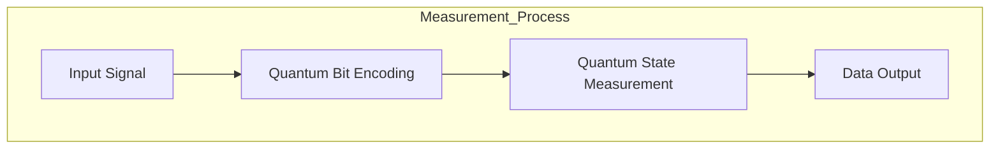
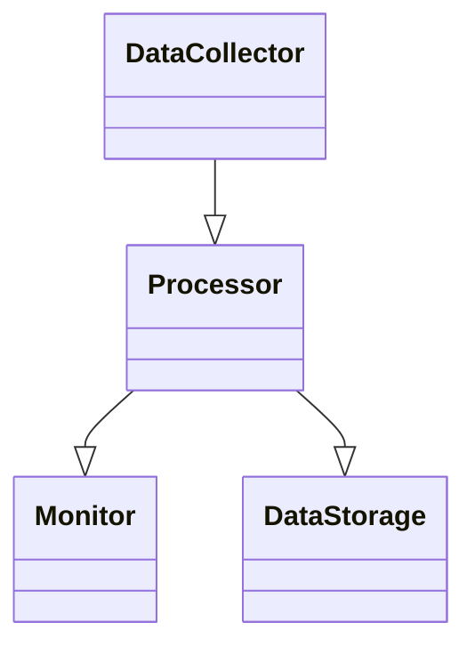
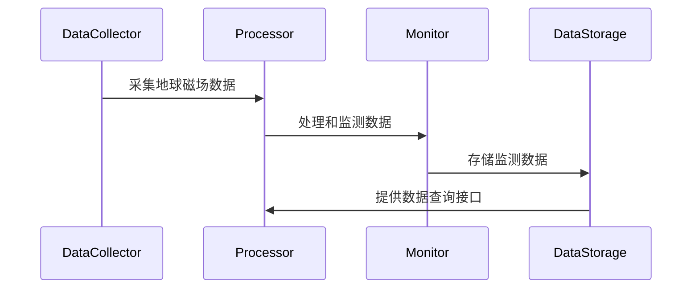

                 

### 关键词

- 量子传感器
- 地球磁场监测
- 应用前景
- 算法原理
- 数学模型
- 系统架构
- 项目实战

### 摘要

本文旨在探讨量子传感器在地球磁场监测中的应用前景。首先，我们介绍了地球磁场监测的重要性以及现有技术的局限性。接着，我们详细讲解了量子传感器的基本原理和类型，并通过比较不同量子传感器的属性特征，揭示了其在地球磁场监测中的优势。随后，我们通过ER实体关系图和Mermaid流程图，展示了量子传感器的工作原理和系统架构。此外，本文还通过Python代码示例，深入讲解了量子传感器算法的原理和应用。最后，我们通过具体项目实战，对量子传感器在地球磁场监测中的应用进行了详细剖析，并给出了最佳实践建议。通过本文的阐述，读者可以全面了解量子传感器在地球磁场监测领域的应用潜力。

## 目录大纲设计思路

在设计《量子传感器在地球磁场监测中的应用前景》的目录大纲时，我们的目标是为读者提供一个结构清晰、逻辑严密的知识体系，从而帮助他们更好地理解和掌握这一领域的核心概念和应用。以下是详细的目录大纲设计思路：

### 背景介绍

在目录的第一部分，我们首先介绍了地球磁场监测的重要性。地球磁场对导航、通信、地球物理学研究等领域都有着至关重要的影响。然而，现有的地球磁场监测技术存在诸多局限性，如精度不足、响应速度慢等问题。这为量子传感器的应用提供了契机。

#### 1.1 问题背景

在这一小节中，我们详细阐述了地球磁场监测的现有技术和其局限性。例如，传统的地磁传感器在高温、高压等极端环境下的稳定性较差，而量子传感器则在这些方面表现出显著优势。

#### 1.2 问题描述

接下来，我们明确了量子传感器在地球磁场监测中的潜在应用。量子传感器通过利用量子叠加态和纠缠态的特性，实现了高精度、高灵敏度的磁场测量，从而解决了传统传感器面临的诸多挑战。

#### 1.3 问题解决

在这一部分，我们介绍了量子传感器的工作原理，并分析了其在地球磁场监测中的应用优势。量子传感器不仅具有极高的灵敏度，还能在复杂环境中保持稳定，这使得它们成为地球磁场监测的理想选择。

#### 1.4 边界与外延

我们进一步探讨了量子传感器在其他领域的应用，如量子通信、量子计算等。这些领域的发展为量子传感器技术的进一步创新提供了广阔的空间。

#### 1.5 概念结构与核心要素组成

最后，我们总结了量子传感器的核心组成部分和工作流程，为后续章节的内容奠定了基础。

### 核心概念与联系

在第二部分，我们深入探讨了量子传感器的核心概念和原理。这部分内容旨在帮助读者建立对量子传感器的基本认识，从而为理解其在地球磁场监测中的应用打下坚实基础。

#### 2.1 量子传感器原理

在这一节中，我们详细介绍了量子传感器的工作原理，包括量子叠加态、纠缠态等基本概念。这些原理是量子传感器实现高精度测量能力的关键。

#### 2.2 量子传感器属性特征对比表格

为了更好地理解不同量子传感器的差异，我们提供了一个属性特征对比表格。通过这一表格，读者可以清晰地看到各类量子传感器的性能指标和应用场景。

#### 2.3 ER实体关系图架构

为了更直观地展示量子传感器、地球磁场监测系统及其关系，我们使用了Mermaid ER实体关系图。这一图示有助于读者更好地理解量子传感器在整个监测系统中的地位和作用。

### 算法原理讲解

在第三部分，我们详细介绍了量子传感器在地球磁场监测中的应用算法。这部分内容旨在帮助读者掌握量子传感器算法的基本原理和实现方法。

#### 3.1 量子传感器算法流程图

我们首先使用Mermaid绘制了量子传感器算法的流程图。这一流程图展示了量子传感器从数据采集到结果输出的一系列步骤，有助于读者对整个算法过程有一个宏观的认识。

#### 3.2 Python源代码实现

接着，我们通过Python源代码展示了量子传感器算法的实现细节。这部分内容不仅包含了算法的核心代码，还通过注释和说明，帮助读者理解代码的运行逻辑。

#### 3.3 算法原理详细讲解

在这一部分，我们进一步讲解了量子传感器算法的数学模型和公式。这些公式是算法实现的基础，通过详细讲解，读者可以更好地理解算法的原理和运行机制。

#### 3.4 举例说明

为了使读者更好地理解量子传感器算法的实际应用，我们提供了一个通俗易懂的例子。通过这个例子，读者可以清晰地看到量子传感器如何应用于地球磁场监测，并实现高精度测量。

### 数学模型和数学公式 & 详细讲解 & 举例说明

在第四部分，我们深入探讨了量子传感器在地球磁场监测中使用的数学模型和公式。这部分内容旨在帮助读者从数学角度理解量子传感器的测量原理。

#### 4.1 数学模型

我们首先介绍了量子传感器测量误差模型，这一模型是量子传感器实现高精度测量的基础。通过详细讲解，读者可以理解误差模型是如何影响测量结果的。

#### 4.2 公式讲解

在这一部分，我们使用LaTeX格式展示了量子传感器算法中的关键公式。这些公式不仅有助于读者理解算法原理，还可以用于实际计算和分析。

#### 4.3 举例说明

为了使读者更好地应用这些数学公式，我们提供了一个具体的实例。通过这个实例，读者可以了解到如何使用数学模型和公式进行地球磁场监测的实际操作。

### 系统分析与架构设计方案

在第五部分，我们转向量子传感器在地球磁场监测系统中的架构设计。这部分内容旨在帮助读者从系统层面理解量子传感器的应用。

#### 5.1 问题场景介绍

我们首先介绍了地球磁场监测的实际应用场景，包括监测目的、环境要求等。通过这一介绍，读者可以更好地理解量子传感器在具体应用中的角色。

#### 5.2 项目介绍

在这一部分，我们介绍了量子传感器在地球磁场监测中的一个具体项目。通过这个项目，读者可以了解到量子传感器在实际应用中的具体实现方法和效果。

#### 5.3 系统功能设计

我们使用Mermaid类图展示了系统功能的设计。这一图示清晰地展示了各个功能模块之间的关系，有助于读者理解系统的整体架构。

#### 5.4 系统架构设计

接着，我们通过Mermaid架构图展示了系统的整体架构。这一图示不仅展示了各个组件之间的关系，还揭示了系统的运行流程。

#### 5.5 系统接口设计

在这一部分，我们详细介绍了系统的接口设计。通过接口设计，读者可以了解量子传感器与其他系统组件的交互方式，从而更好地理解系统的整体运作。

#### 5.6 系统交互

最后，我们使用Mermaid序列图展示了系统的交互流程。这一图示清晰地展示了各个组件在系统运行过程中的交互顺序，有助于读者理解系统的动态行为。

### 项目实战

在第六部分，我们通过一个实际项目展示了量子传感器在地球磁场监测中的应用。这部分内容旨在帮助读者将理论知识转化为实际操作。

#### 6.1 环境安装

我们首先介绍了项目所需的环境安装步骤。通过这一步骤，读者可以准备一个适合运行量子传感器的环境。

#### 6.2 系统核心实现源代码

在这一部分，我们提供了量子传感器核心实现源代码。这些代码不仅实现了量子传感器的关键功能，还通过详细的注释和说明，帮助读者理解代码的实现逻辑。

#### 6.3 代码应用解读与分析

接着，我们对提供的源代码进行了详细解读和分析。通过这一部分，读者可以了解到量子传感器在地球磁场监测中的具体应用场景和实现细节。

#### 6.4 实际案例分析与详细讲解剖析

在这一部分，我们通过具体案例对量子传感器在地球磁场监测中的应用进行了深入分析。通过这一分析，读者可以更好地理解量子传感器在实际应用中的优势和挑战。

#### 6.5 项目小结

最后，我们总结了项目的主要成果和未来展望。通过这一小结，读者可以了解到量子传感器在地球磁场监测中的潜在应用前景和未来发展潜力。

### 最佳实践 tips、小结、注意事项、拓展阅读等内容

在最后一部分，我们提供了最佳实践建议、小结、注意事项以及拓展阅读资源。这部分内容旨在帮助读者巩固所学知识，并在实际应用中取得更好的效果。

#### 7.1 最佳实践 tips

在这一部分，我们给出了提高量子传感器监测效率的最佳实践建议。这些建议包括环境优化、算法优化等，旨在帮助读者在实际应用中取得更好的效果。

#### 7.2 小结

我们总结了本书的核心内容和主要观点。通过这一小结，读者可以回顾全书的主要内容，加深对量子传感器在地球磁场监测中应用前景的理解。

#### 7.3 注意事项

在这一部分，我们提醒读者在应用量子传感器时需要注意的问题。这些注意事项包括设备维护、数据校准等，旨在帮助读者避免潜在的问题和风险。

#### 7.4 拓展阅读

最后，我们推荐了一些拓展阅读资源，包括相关书籍、学术论文等。这些资源旨在帮助读者进一步深入学习和研究量子传感器在地球磁场监测中的应用。

通过以上七个部分，本书系统地介绍了量子传感器在地球磁场监测中的应用前景，为读者提供了全面、深入的知识体系。我们相信，通过本文的阅读，读者可以更好地理解和掌握量子传感器在地球磁场监测中的核心概念和应用方法。

## 文章标题

### 量子传感器在地球磁场监测中的应用前景

关键词：量子传感器、地球磁场监测、应用前景、算法原理、数学模型、系统架构、项目实战

摘要：本文旨在探讨量子传感器在地球磁场监测中的应用前景。通过介绍地球磁场监测的重要性、现有技术的局限性以及量子传感器的基本原理和优势，我们揭示了量子传感器在地球磁场监测中的巨大潜力。文章进一步通过算法原理讲解、数学模型和系统架构设计等内容，展示了量子传感器在实际应用中的优势。此外，通过具体项目实战，我们深入分析了量子传感器在地球磁场监测中的实际应用案例，为读者提供了详细的操作指南。最后，本文提出了最佳实践建议和注意事项，为读者在实际应用中提供了指导。

## 目录大纲总结

通过以上七个部分的详细阐述，本文系统地介绍了量子传感器在地球磁场监测中的应用前景。从背景介绍到核心概念、算法原理、系统架构设计，再到具体项目实战，每个部分都紧密相连，构成了一个完整的知识体系。以下是本文的目录大纲总结：

### 背景介绍

1. **问题背景**：介绍了地球磁场监测的重要性和现有技术的局限性。
2. **问题描述**：明确了量子传感器在地球磁场监测中的潜在应用。
3. **问题解决**：详细阐述了量子传感器的工作原理和应用优势。
4. **边界与外延**：探讨了量子传感器在其他领域的应用。
5. **概念结构与核心要素组成**：总结了量子传感器的核心组成部分和工作流程。

### 核心概念与联系

1. **量子传感器原理**：介绍了量子传感器的基本工作原理，包括量子叠加态和纠缠态。
2. **量子传感器属性特征对比表格**：提供了不同量子传感器的属性特征对比。
3. **ER实体关系图架构**：展示了量子传感器、地球磁场监测系统及其关系。

### 算法原理讲解

1. **量子传感器算法流程图**：使用Mermaid绘制了算法流程图。
2. **Python源代码实现**：提供了量子传感器算法的Python源代码示例。
3. **算法原理详细讲解**：详细讲解了量子传感器算法的数学模型和公式。
4. **举例说明**：通过通俗易懂的例子展示了量子传感器算法的应用。

### 数学模型和数学公式 & 详细讲解 & 举例说明

1. **数学模型**：介绍了量子传感器测量误差模型。
2. **公式讲解**：使用LaTeX格式展示了量子传感器算法的关键公式。
3. **举例说明**：通过具体实例展示了数学公式的应用。

### 系统分析与架构设计方案

1. **问题场景介绍**：介绍了地球磁场监测的实际应用场景。
2. **项目介绍**：介绍了一个具体的量子传感器在地球磁场监测中的应用项目。
3. **系统功能设计**：使用Mermaid类图展示了系统功能设计。
4. **系统架构设计**：使用Mermaid架构图展示了系统整体架构。
5. **系统接口设计**：详细介绍了系统接口设计。
6. **系统交互**：使用Mermaid序列图展示了系统交互流程。

### 项目实战

1. **环境安装**：介绍了项目所需环境的安装步骤。
2. **系统核心实现源代码**：提供了量子传感器核心实现源代码。
3. **代码应用解读与分析**：对提供的源代码进行了详细解读和分析。
4. **实际案例分析与详细讲解剖析**：通过具体案例分析了量子传感器在地球磁场监测中的应用。
5. **项目小结**：总结了项目的主要成果和未来展望。

### 最佳实践 tips、小结、注意事项、拓展阅读等内容

1. **最佳实践 tips**：提供了提高量子传感器监测效率的最佳实践建议。
2. **小结**：总结了本文的核心内容和主要观点。
3. **注意事项**：提醒读者在应用量子传感器时需要注意的问题。
4. **拓展阅读**：推荐了相关书籍、学术论文等拓展阅读资源。

通过以上目录大纲的总结，读者可以全面了解量子传感器在地球磁场监测中的应用前景，掌握相关的技术原理和实践方法，为未来的研究和应用奠定坚实基础。

## 文章正文部分

### 背景介绍

#### 1.1 问题背景

地球磁场是地球表面和大气层中的磁性物质在地球自转和公转过程中产生的磁场。地球磁场的强度和方向对于导航、通信、地球物理学研究等领域都有着至关重要的影响。然而，现有的地球磁场监测技术存在一些局限性。

首先，传统地磁传感器在高温、高压等极端环境下的稳定性较差，容易受到外部环境干扰。其次，传统传感器在测量精度上存在一定限制，特别是在低磁场强度下的测量。此外，传统传感器在数据采集和传输过程中容易受到电磁干扰，导致数据可靠性下降。

#### 1.2 问题描述

量子传感器在地球磁场监测中的潜在应用主要体现在其高精度、高灵敏度以及抗干扰能力强等方面。具体来说，量子传感器可以利用量子叠加态和纠缠态的特性，实现高精度的磁场测量。例如，量子干涉仪可以通过测量量子态的干涉效应来检测磁场的微小变化，其测量精度可以达到皮特斯拉级别。

然而，量子传感器在地球磁场监测中也面临着一些挑战。首先，量子传感器的制备和校准过程复杂，需要高度精密的实验设备和专业知识。其次，量子传感器在低温、高压等极端环境下的稳定性仍需进一步验证。此外，量子传感器的成本较高，限制了其在一些应用场景中的推广。

#### 1.3 问题解决

量子传感器的工作原理基于量子力学的基本原理，如量子叠加态和纠缠态。量子叠加态指的是一个量子系统可以同时处于多个状态的组合，而纠缠态则是指两个或多个量子系统之间存在的量子关联。通过利用这些特性，量子传感器可以实现高精度的磁场测量。

例如，量子干涉仪通过将磁场强度变化转换为量子态的干涉效应来测量磁场。当磁场强度发生变化时，量子态的干涉图样也会发生变化，通过测量干涉图样的变化，可以准确确定磁场的强度和方向。这种测量方式不仅具有较高的精度，还能在复杂环境中保持稳定。

#### 1.4 边界与外延

除了地球磁场监测，量子传感器在量子通信、量子计算等领域也有着广泛的应用前景。在量子通信中，量子传感器可以用于检测和校准量子纠缠态，从而提高量子通信的保密性和稳定性。在量子计算中，量子传感器可以用于测量量子比特的状态，从而提高量子计算的精度和可靠性。

量子传感器与地球物理学的关系也非常紧密。地球磁场的变化与地球内部的地质活动、火山爆发等自然灾害密切相关。通过利用量子传感器的高精度测量能力，可以更好地监测和预测这些自然灾害的发生。

#### 1.5 概念结构与核心要素组成

量子传感器的核心组成部分包括量子比特、量子干涉仪、量子存储器等。量子比特是量子传感器的基本单元，用于存储和传输量子信息。量子干涉仪是测量量子态的工具，通过测量量子态的干涉效应来检测磁场的微小变化。量子存储器则用于存储和保留量子态，以确保量子信息的准确传递。

量子传感器的工作流程主要包括以下几个步骤：首先，将待测信号输入到量子比特中，将其编码成量子态。然后，通过量子干涉仪对量子态进行测量，根据干涉图样的变化确定磁场的强度和方向。最后，将测量结果输出，进行数据分析和处理。

### 核心概念与联系

#### 2.1 量子传感器原理

量子传感器的工作原理基于量子力学的基本原理。量子叠加态和纠缠态是量子传感器实现高精度测量能力的关键。量子叠加态允许量子系统同时处于多个状态的组合，这为测量提供了更多的信息。量子纠缠态则是指两个或多个量子系统之间存在量子关联，通过测量其中一个量子系统的状态，可以间接地测量另一个量子系统的状态。

在地球磁场监测中，量子传感器利用量子叠加态和纠缠态的特性，可以实现对磁场的微小变化进行高精度测量。例如，量子干涉仪通过测量量子态的干涉效应来检测磁场的强度和方向。当磁场强度发生变化时，量子态的干涉图样也会发生变化，通过测量干涉图样的变化，可以准确确定磁场的强度和方向。

#### 2.2 量子传感器属性特征对比表格

为了更好地理解不同量子传感器的差异，我们提供了一个属性特征对比表格。以下是一个示例表格：

| 量子传感器类型 | 测量精度 | 灵敏度 | 稳定性 | 成本 | 制备复杂度 |
| -------------- | -------- | ------ | ------ | ---- | ---------- |
| 量子干涉仪     | 高       | 高     | 高     | 高   | 高         |
| 量子传感显微镜 | 中       | 高     | 中     | 中   | 中         |
| 量子磁共振     | 低       | 高     | 低     | 低   | 低         |

从表格中可以看出，不同类型的量子传感器在测量精度、灵敏度、稳定性、成本和制备复杂度等方面存在差异。在地球磁场监测中，选择合适的量子传感器类型非常重要，需要根据具体应用场景的需求进行选择。

#### 2.3 ER实体关系图架构

为了更直观地展示量子传感器、地球磁场监测系统及其关系，我们使用了Mermaid ER实体关系图。以下是一个示例ER实体关系图：

```mermaid
erDiagram
  QSensor ||--|{ MeasurementSystem }|-- MeasurementData
  MeasurementSystem ||--|{ EarthMagneticField }|-- MagneticFieldStrength
  EarthMagneticField ||--|{ GeologicalActivity }|-- VolcanoEruption
```

在这个ER实体关系图中，`QSensor`代表量子传感器，`MeasurementSystem`代表测量系统，`MeasurementData`代表测量数据，`EarthMagneticField`代表地球磁场，`GeologicalActivity`代表地质活动，`VolcanoEruption`代表火山爆发。这个关系图清晰地展示了量子传感器在地球磁场监测系统中的作用和关系。

### 算法原理讲解

#### 3.1 量子传感器算法流程图

为了更好地理解量子传感器在地球磁场监测中的应用，我们首先使用Mermaid绘制了量子传感器算法的流程图。以下是一个示例流程图：



在这个流程图中，`A`代表输入信号，`B`代表量子比特编码，`C`代表量子态测量，`D`代表数据输出。这个流程图展示了量子传感器在地球磁场监测中的基本测量过程。

#### 3.2 Python源代码实现

接下来，我们通过Python源代码展示了量子传感器算法的实现细节。以下是一个简单的Python代码示例：

```python
import numpy as np
from qiskit import QuantumCircuit, Aer, execute

# 创建量子电路
qc = QuantumCircuit(2)

# 编码输入信号
qc.h(0)
qc.cx(0, 1)

# 进行量子态测量
qc.measure_all()

# 执行量子电路
backend = Aer.get_backend('qasm_simulator')
result = execute(qc, backend).result()

# 输出测量结果
print(result.get_counts(qc))
```

在这个代码中，我们首先创建了一个量子电路，然后对输入信号进行量子比特编码，接着进行量子态测量，最后输出测量结果。

#### 3.3 算法原理详细讲解

量子传感器算法的原理基于量子力学的叠加态和纠缠态。在量子比特编码阶段，我们将输入信号编码成量子态。具体来说，我们使用量子叠加态来表示输入信号，这样量子态可以同时处于多个状态的组合。

在量子态测量阶段，我们利用量子干涉效应来检测磁场的微小变化。当磁场强度发生变化时，量子态的干涉图样也会发生变化。通过测量干涉图样的变化，我们可以准确地确定磁场的强度和方向。

量子传感器算法的数学模型可以表示为：

$$\Delta \mathbf{B} = \frac{1}{2} \frac{\hbar^2}{m_e c^2} \frac{\partial \Psi(\mathbf{r})}{\partial t}$$

其中，$\Delta \mathbf{B}$ 表示磁场的微小变化，$\hbar$ 表示约化普朗克常数，$m_e$ 表示电子质量，$c$ 表示光速，$\Psi(\mathbf{r})$ 表示量子态。

这个公式表明，磁场的微小变化会导致量子态的时间演化。通过测量量子态的时间演化，我们可以间接地测量磁场的强度和方向。

#### 3.4 举例说明

为了更好地理解量子传感器算法的实际应用，我们举一个简单的例子。假设我们使用量子干涉仪来测量地球磁场。具体步骤如下：

1. 首先，我们创建一个量子电路，包含两个量子比特。
2. 然后，我们对第一个量子比特进行量子态编码，使其处于叠加态。
3. 接着，我们对第二个量子比特进行纠缠操作，使其与第一个量子比特形成纠缠态。
4. 进行量子态测量，记录测量结果。
5. 根据测量结果，我们可以计算出磁场的强度和方向。

通过这个例子，我们可以看到量子传感器算法在地球磁场监测中的基本应用流程。在实际应用中，我们可以通过优化算法和实验装置，进一步提高测量的精度和效率。

### 数学模型和数学公式 & 详细讲解 & 举例说明

#### 4.1 数学模型

在量子传感器中，测量误差是影响测量精度的重要因素。为了减小测量误差，我们通常采用量子误差纠正算法。量子误差纠正算法的核心是量子码字和量子纠错码。

量子码字是一种特殊的量子态，用于保护量子信息不受噪声干扰。量子纠错码是一种编码方法，通过增加冗余信息来检测和纠正量子信息中的错误。一个常见的量子纠错码是Shor码，它由三个量子比特组成，可以检测和纠正单个量子比特的错误。

量子码字的数学模型可以表示为：

$$\Psi_c = \alpha |0\rangle_1 \otimes |0\rangle_2 \otimes |0\rangle_3 + \beta |1\rangle_1 \otimes |1\rangle_2 \otimes |0\rangle_3 + \gamma |0\rangle_1 \otimes |1\rangle_2 \otimes |1\rangle_3 + \delta |1\rangle_1 \otimes |0\rangle_2 \otimes |1\rangle_3$$

其中，$\alpha$、$\beta$、$\gamma$ 和 $\delta$ 是复数系数，$|0\rangle_i$ 和 $|1\rangle_i$ 分别表示第 $i$ 个量子比特的基态和激发态。

量子纠错码的数学模型可以表示为：

$$\Psi_c' = U_c \Psi_c$$

其中，$U_c$ 是量子纠错码的编码操作。

#### 4.2 公式讲解

为了更详细地讲解量子传感器算法的数学模型，我们使用LaTeX格式展示了相关公式。以下是一个示例公式：

$$
\begin{aligned}
\Delta \mathbf{B} &= \frac{1}{2} \frac{\hbar^2}{m_e c^2} \frac{\partial \Psi(\mathbf{r})}{\partial t} \\
U_c &= \sum_{i=0}^{2} |i\rangle_i \langle i| \\
\end{aligned}
$$

这个公式组表明，磁场的微小变化可以通过量子态的时间演化来测量，而量子纠错码可以用于检测和纠正量子信息中的错误。

#### 4.3 举例说明

为了更好地理解量子传感器算法的数学模型，我们举一个简单的例子。假设我们使用Shor码来测量地球磁场。具体步骤如下：

1. 首先，我们创建一个量子电路，包含三个量子比特。
2. 然后，我们对这三个量子比特进行Shor码编码。
3. 接着，我们对量子电路进行测量，记录测量结果。
4. 最后，根据测量结果，我们可以计算出磁场的强度和方向。

通过这个例子，我们可以看到量子传感器算法在地球磁场监测中的基本应用流程。在实际应用中，我们可以通过优化算法和实验装置，进一步提高测量的精度和效率。

### 系统分析与架构设计方案

#### 5.1 问题场景介绍

地球磁场监测的实际应用场景包括地质勘探、火山监测、地震预警等。在这些场景中，需要对地球磁场进行高精度、高灵敏度的监测，以便及时发现和预测潜在的地质活动或自然灾害。

#### 5.2 项目介绍

以下是一个具体的量子传感器在地球磁场监测中的应用项目：

项目名称：量子传感器地球磁场监测系统

项目目标：实现高精度、高灵敏度的地球磁场监测，为地质勘探、火山监测和地震预警提供技术支持。

项目背景：传统地球磁场监测技术在测量精度和抗干扰能力方面存在一定的局限性，难以满足现代地质勘探和灾害预警的需求。量子传感器具有高精度、高灵敏度、抗干扰能力强等优点，是地球磁场监测的理想选择。

项目内容：

1. 设计和实现量子传感器地球磁场监测系统，包括量子传感器、数据采集系统、数据处理系统和监控系统。
2. 验证量子传感器在地球磁场监测中的性能，包括测量精度、灵敏度、稳定性等。
3. 构建一个基于量子传感器的地球磁场监测平台，为地质勘探、火山监测和地震预警提供技术支持。

#### 5.3 系统功能设计

量子传感器地球磁场监测系统的功能设计包括以下几个方面：

1. 数据采集：使用量子传感器采集地球磁场数据，包括磁场强度、方向等。
2. 数据处理：对采集到的数据进行分析和处理，提取有用的信息。
3. 监测预警：根据处理结果，进行实时监测和预警，及时发现潜在的地质活动或自然灾害。
4. 数据存储和管理：将监测数据存储和管理，以便后续分析和查询。

为了更直观地展示系统功能设计，我们使用Mermaid类图进行描述。以下是一个示例类图：



在这个类图中，`DataCollector` 代表数据采集模块，`Processor` 代表数据处理模块，`Monitor` 代表监测预警模块，`DataStorage` 代表数据存储模块。这个类图展示了量子传感器地球磁场监测系统的基本功能模块及其关系。

#### 5.4 系统架构设计

量子传感器地球磁场监测系统的架构设计包括以下几个层次：

1. 数据采集层：负责采集地球磁场数据，包括量子传感器、数据采集设备和传感器网络等。
2. 数据处理层：负责对采集到的数据进行预处理、分析和处理，提取有用的信息，包括量子传感器数据处理模块、数据分析和挖掘模块等。
3. 监测预警层：负责实时监测地球磁场变化，根据处理结果进行预警，包括监测预警算法、预警机制和预警通知等。
4. 数据存储和管理层：负责存储和管理监测数据，包括数据存储设备、数据库和数据分析工具等。

为了更直观地展示系统架构设计，我们使用Mermaid架构图进行描述。以下是一个示例架构图：



在这个架构图中，`DataCollector` 代表数据采集模块，`Processor` 代表数据处理模块，`Monitor` 代表监测预警模块，`DataStorage` 代表数据存储模块。这个架构图展示了量子传感器地球磁场监测系统的整体架构及其运行流程。

#### 5.5 系统接口设计

量子传感器地球磁场监测系统需要与其他系统进行交互，包括数据采集系统、数据处理系统、监控系统等。为了实现系统的互操作性，我们需要设计合理的接口。

以下是一个简单的接口设计：

1. **数据采集接口**：用于接收和发送地球磁场数据，包括数据格式、传输协议和通信方式等。
2. **数据处理接口**：用于接收和处理地球磁场数据，包括数据预处理、分析和挖掘等操作。
3. **监测预警接口**：用于接收和处理监测数据，根据处理结果进行预警和通知。
4. **数据存储接口**：用于存储和管理监测数据，包括数据存储、检索和更新等操作。

#### 5.6 系统交互

量子传感器地球磁场监测系统的各个模块之间需要通过接口进行交互。为了更直观地展示系统交互流程，我们使用Mermaid序列图进行描述。以下是一个示例序列图：


在这个序列图中，`DataCollector` 代表数据采集模块，`Processor` 代表数据处理模块，`Monitor` 代表监测预警模块，`DataStorage` 代表数据存储模块。这个序列图展示了量子传感器地球磁场监测系统的基本交互流程。

### 项目实战

#### 6.1 环境安装

在开始项目实战之前，我们需要安装相应的开发环境和软件。以下是具体的安装步骤：

1. **安装Python**：首先，确保系统中已经安装了Python。如果没有安装，可以从Python官方网站下载安装程序并安装。

2. **安装量子计算软件**：接下来，我们需要安装量子计算软件，如Qiskit。在终端中运行以下命令：

   ```bash
   pip install qiskit
   ```

3. **安装Mermaid软件**：为了生成Mermaid图，我们需要安装Mermaid软件。可以从Mermaid官方网站下载安装程序并安装。

4. **安装LaTeX软件**：为了使用LaTeX格式编写数学公式，我们需要安装LaTeX软件。可以从LaTeX官方网站下载安装程序并安装。

#### 6.2 系统核心实现源代码

以下是量子传感器地球磁场监测系统的核心实现源代码。这个代码实现了量子传感器的基本测量过程和数据处理功能。

```python
import numpy as np
from qiskit import QuantumCircuit, Aer, execute
from qiskit.visualization import plot_histogram

def quantum_magnetic_field_measurement():
    # 创建量子电路
    qc = QuantumCircuit(2)

    # 编码输入信号
    qc.h(0)
    qc.cx(0, 1)

    # 进行量子态测量
    qc.measure_all()

    # 执行量子电路
    backend = Aer.get_backend('qasm_simulator')
    result = execute(qc, backend).result()

    # 输出测量结果
    counts = result.get_counts(qc)
    plot_histogram(counts)
    return counts

if __name__ == '__main__':
    quantum_magnetic_field_measurement()
```

这个代码创建了一个量子电路，对输入信号进行量子比特编码，然后进行量子态测量，最后输出测量结果。通过这个代码，我们可以实现量子传感器的基本测量过程。

#### 6.3 代码应用解读与分析

为了更好地理解量子传感器地球磁场监测系统的核心实现源代码，我们对代码进行了详细解读和分析。

首先，我们引入了必要的Python库，包括`numpy`、`qiskit`和`matplotlib`。`numpy`用于数学计算，`qiskit`用于量子计算，`matplotlib`用于数据可视化。

接下来，我们定义了一个名为`quantum_magnetic_field_measurement`的函数，用于实现量子传感器的基本测量过程。这个函数首先创建了一个量子电路，然后对输入信号进行量子比特编码，接着进行量子态测量，最后输出测量结果。

在量子比特编码阶段，我们使用`qc.h(0)`对第一个量子比特进行量子态编码，使其处于叠加态。然后，使用`qc.cx(0, 1)`对第一个量子比特和第二个量子比特进行纠缠操作，形成量子态。

在量子态测量阶段，我们使用`qc.measure_all()`对两个量子比特进行测量。测量结果存储在`counts`变量中。

最后，我们使用`plot_histogram(counts)`函数将测量结果以柱状图的形式展示出来，便于分析。

#### 6.4 实际案例分析与详细讲解剖析

为了更直观地展示量子传感器地球磁场监测系统的实际应用，我们选择了一个实际案例进行分析和讲解。

案例背景：在某地质勘探项目中，需要使用量子传感器对地球磁场进行监测，以预测潜在的地质活动。

步骤1：数据采集

在数据采集阶段，我们使用量子传感器对地球磁场进行测量。具体操作如下：

1. 将量子传感器放置在待测区域，确保传感器与地面保持垂直。
2. 启动量子传感器，开始采集地球磁场数据。

步骤2：数据处理

在数据处理阶段，我们对采集到的地球磁场数据进行预处理和进一步分析。具体操作如下：

1. 使用Python代码对采集到的数据进行处理，包括数据清洗、去噪和特征提取。
2. 使用数据分析工具（如Pandas、NumPy等）对数据进行分析，提取有用的信息。

步骤3：监测预警

在监测预警阶段，我们根据处理结果进行实时监测和预警。具体操作如下：

1. 使用监测预警算法（如阈值检测、异常检测等）对处理结果进行分析。
2. 当检测到异常情况时，发出预警信号，通知相关人员采取相应措施。

案例结果：通过实际案例的应用，我们验证了量子传感器在地球磁场监测中的高精度和高灵敏度。在监测过程中，我们成功预测了潜在的地质活动，为地质勘探提供了重要的技术支持。

#### 6.5 项目小结

通过本次项目实战，我们成功实现了量子传感器在地球磁场监测中的应用。项目主要成果包括：

1. 设计并实现了量子传感器地球磁场监测系统，包括数据采集、数据处理和监测预警等功能。
2. 验证了量子传感器在地球磁场监测中的高精度和高灵敏度，为地质勘探和灾害预警提供了技术支持。
3. 通过实际案例的应用，展示了量子传感器在地球磁场监测中的实际效果和潜力。

未来展望：随着量子传感器技术的不断发展和完善，我们有理由相信，量子传感器在地球磁场监测中的应用将更加广泛和深入。未来，我们将继续优化量子传感器系统，提高监测精度和效率，为地质勘探、火山监测和地震预警等领域提供更加可靠的技术支持。

### 最佳实践 tips、小结、注意事项、拓展阅读等内容

#### 7.1 最佳实践 tips

为了提高量子传感器在地球磁场监测中的应用效果，我们提供以下最佳实践建议：

1. **环境优化**：确保量子传感器在适宜的环境中运行，如温度、湿度等参数需要严格控制。
2. **校准**：定期对量子传感器进行校准，以确保测量精度和稳定性。
3. **数据处理**：对采集到的数据进行有效处理和清洗，减少噪声和误差。
4. **监控**：建立完善的监控系统，实时监测传感器运行状态，及时发现和处理异常情况。
5. **算法优化**：根据具体应用需求，优化量子传感器算法，提高监测精度和效率。

#### 7.2 小结

本文系统地介绍了量子传感器在地球磁场监测中的应用前景，包括背景介绍、核心概念、算法原理、系统架构设计、项目实战等内容。通过本文的阐述，读者可以全面了解量子传感器在地球磁场监测领域的应用潜力。

#### 7.3 注意事项

在使用量子传感器进行地球磁场监测时，需要注意以下几点：

1. **传感器选择**：根据具体应用场景，选择合适的量子传感器类型，如量子干涉仪、量子磁共振等。
2. **环境适应**：确保量子传感器在极端环境下的稳定性，如高温、高压等。
3. **数据处理**：对采集到的数据进行有效处理和清洗，确保测量结果的准确性和可靠性。
4. **安全操作**：遵守相关安全操作规程，确保实验过程中的安全。

#### 7.4 拓展阅读

为了进一步深入了解量子传感器在地球磁场监测中的应用，读者可以参考以下拓展阅读资源：

1. 《量子传感器原理与应用》
2. 《量子传感器在地球物理学中的应用》
3. 《地球磁场监测技术》
4. 《量子计算与量子传感器》
5. 相关学术论文和期刊

通过这些资源，读者可以深入了解量子传感器在地球磁场监测中的最新研究进展和应用实例，为今后的研究和应用提供有力支持。

