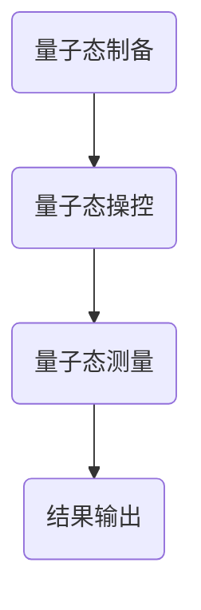
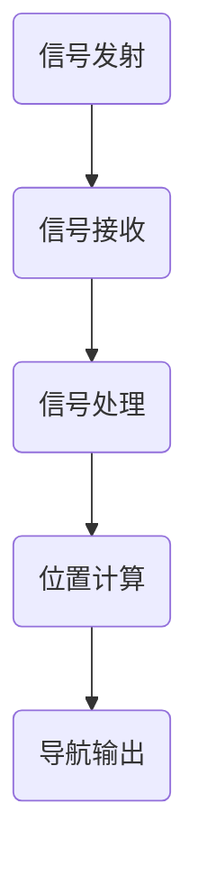
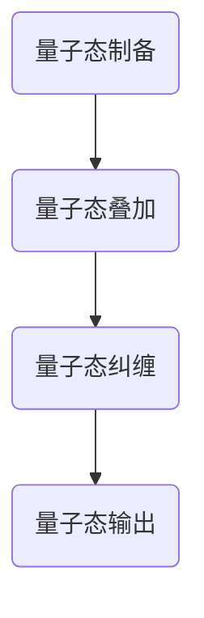
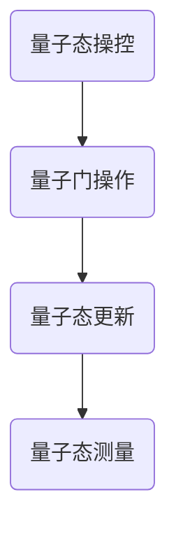
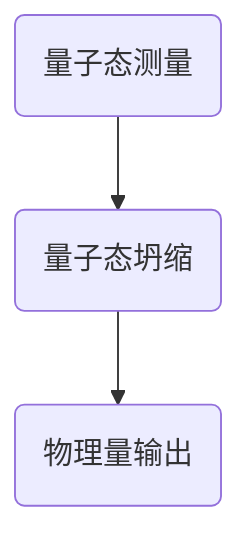
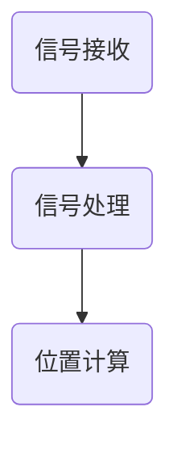
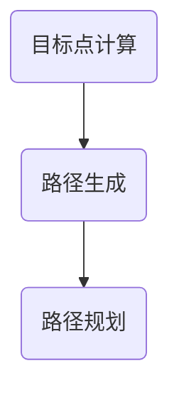
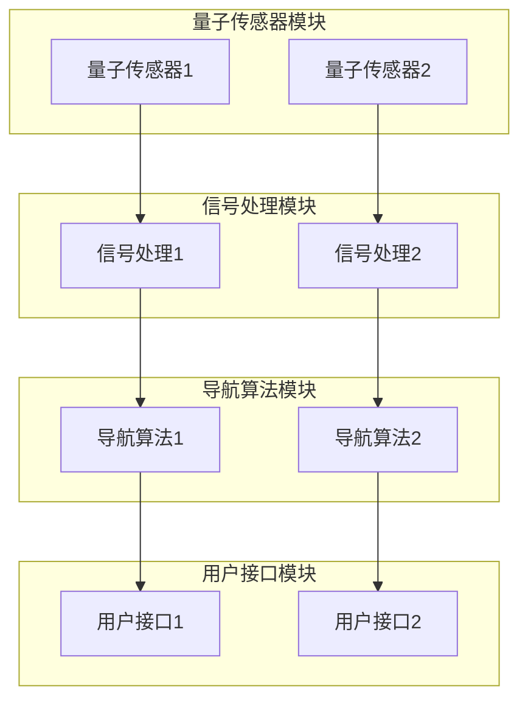
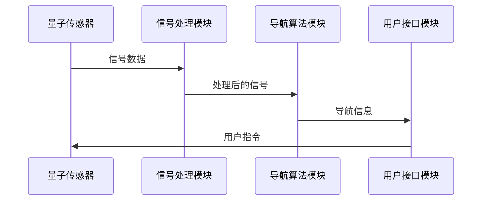

                 


## 第1章 问题背景与核心概念

### 1.1.1 量子传感器的发展历程

量子传感器是量子信息科学与技术的重要组成部分，其基本原理建立在量子力学的基础上。从20世纪70年代量子计算和量子通信的理论萌芽开始，到21世纪初的实验验证，量子传感器技术逐渐成熟。特别是在量子态制备、量子态调控、量子纠缠以及量子非定域性等方面取得了显著进展。

早期，量子传感器的应用主要集中在精密测量领域，如量子力学中的基准测量、量子重力探测、超导量子干涉仪（SQUID）等。随着技术的进步，量子传感器在21世纪初开始向实用化方向迈进。例如，基于原子蒸气的量子传感器可以用于高速时钟和精密定位，而光子量子传感器则可以在量子通信和量子加密中发挥重要作用。

近年来，随着量子计算、量子通信和量子模拟等领域的发展，量子传感器技术得到了进一步的推动。例如，基于氮化镓量子点（NV-center）的量子传感器被应用于量子密钥分发（QKD），而基于超导电路的量子传感器则被用于量子成像和量子精密测量。

### 1.1.2 导航系统的现状与挑战

现代导航系统，如GPS（全球定位系统）、GLONASS（俄罗斯全球导航卫星系统）、Galileo（欧洲全球导航卫星系统）和Beidou（北斗卫星导航系统），已经深刻改变了我们的日常生活和工业应用。这些系统通过卫星发射的信号，提供全球范围内的高精度定位、导航和时间同步服务。然而，随着技术的不断进步和全球化的深入，导航系统面临着一系列挑战。

首先，随着无人驾驶车辆、智能城市、物联网和无人机等应用的普及，对导航系统的精度、可靠性和实时性提出了更高的要求。传统导航系统在信号覆盖范围、抗干扰能力和处理速度等方面存在一定的局限性。

其次，全球导航卫星系统（GNSS）的依赖性也带来了一定的安全隐患。由于GNSS信号容易受到干扰和欺骗，尤其是在军事、航空航天和关键基础设施等领域，这种依赖性可能成为国家安全和战略能力的一大隐患。

### 1.1.3 量子传感器在导航中的应用潜力

量子传感器在导航系统中的应用具有巨大的潜力。首先，量子传感器的超高灵敏度使其在定位和导航领域具有显著优势。例如，基于量子纠缠的量子导航系统可以在短时间内提供高精度的定位信息，特别是在恶劣环境下，如深海、极地和城市峡谷等。

其次，量子传感器的高抗干扰能力使得其在对抗信号干扰和欺骗攻击方面表现出色。量子传感器能够检测和识别出传统传感器无法检测的微弱信号，从而提高导航系统的可靠性和安全性。

此外，量子传感器在实时数据处理和快速响应方面具有优势。通过量子计算和量子通信的结合，量子传感器可以实现导航数据的实时处理和传输，为无人驾驶车辆、无人机和智能城市等应用提供实时、高效的导航服务。

### 1.1.4 边界与外延

量子传感器在导航系统中的应用并非没有限制。首先，量子传感器的制备、操控和读取技术目前仍处于发展初期，成本较高，这限制了其在大规模商业化应用中的普及。其次，量子传感器的稳定性和环境适应性仍需进一步研究，以确保其在各种极端环境下的可靠运行。

此外，量子传感器与导航系统集成的技术挑战也不容忽视。如何将量子传感器与现有的导航系统无缝集成，如何优化系统的整体性能，如何解决量子传感器与其他组件之间的兼容性问题，都是需要深入研究和解决的问题。

### 1.1.5 概念结构与核心要素组成

量子传感器在导航系统中的应用涉及多个核心概念和要素。首先，量子传感器的基本工作原理是其核心。量子态的制备、操控和测量是量子传感器的核心技术，这些技术决定了传感器的灵敏度和抗干扰能力。

其次，导航算法的设计与优化是量子传感器在导航系统中发挥作用的关键。如何将量子传感器的数据与传统的导航算法相结合，如何设计高效、可靠的导航算法，是实现量子导航系统的重要研究方向。

此外，系统的整体架构设计也是关键因素。量子传感器、导航算法、数据处理和传输系统等各组件之间的协同工作，决定了整个导航系统的性能和可靠性。

最后，量子传感器在导航系统中的应用还涉及一系列支撑技术，如量子计算、量子通信、网络安全等。这些技术为量子导航系统提供了技术基础，也带来了新的挑战。

## 第2章 核心概念与联系

### 2.1.1 量子传感器原理

量子传感器基于量子力学的原理，通过测量和操控量子态来实现超灵敏的物理量检测。其核心原理包括量子态的制备、量子态的操控和量子态的测量。

1. **量子态的制备**：量子态的制备是指将系统置于特定的量子态，如叠加态或纠缠态。这一过程通常依赖于量子纠缠和量子非定域性。

2. **量子态的操控**：量子态的操控是指通过量子门和量子操作来改变量子态。这些操作可以用来增强传感器的灵敏度或改变传感器的响应特性。

3. **量子态的测量**：量子态的测量是指通过量子态的坍缩来获取系统的物理信息。量子测量的结果具有概率性，这是量子传感器与传统传感器的重要区别。

**Mermaid流程图嵌入：**



### 2.1.2 导航系统基本原理

导航系统通常基于卫星发射的信号来实现定位和导航。其基本原理包括信号发射、信号接收、信号处理和位置计算。

1. **信号发射**：导航卫星发射一系列已知频率和相位的高精度信号，这些信号携带着卫星的位置和时间信息。

2. **信号接收**：地面接收设备接收卫星信号，并记录信号到达的时间、频率和相位。

3. **信号处理**：接收设备对信号进行解调、放大和处理，提取出卫星的位置和时间信息。

4. **位置计算**：通过接收到的多个卫星信号，导航系统可以计算出接收设备的精确位置。

**Mermaid流程图嵌入：**



### 2.1.3 量子传感器与导航系统的关系

量子传感器与导航系统的结合具有以下几个关键点：

1. **超灵敏度**：量子传感器的超高灵敏度使其在定位和导航中能够检测到更微弱的信号，提高定位精度。

2. **抗干扰能力**：量子传感器具有较强的抗干扰能力，可以在信号被干扰或欺骗时仍能准确检测出真实信号，提高导航系统的可靠性。

3. **实时数据处理**：量子传感器与量子计算和量子通信的结合，可以实现导航数据的实时处理和传输，提高导航系统的响应速度。

4. **系统集成**：量子传感器需要与导航系统中的其他组件，如接收设备、数据处理系统和算法等，进行集成和优化，以实现最佳性能。

**ER实体关系图架构的Mermaid流程图：**

```mermaid
erDiagram
 NAVIGATION_SYSTEM ||--|{ QUANTUM_SENSOR : 使用 }
 QUANTUM_SENSOR ||--|{ SIGNAL_PROCESSOR : 输出 }
 NAVIGATION_SYSTEM ||--|{ NAVIGATION_ALGORITHM : 结合 }
```

### 2.1.4 概念属性特征对比表格

| 特征          | 量子传感器                | 导航系统                |
|-------------|-----------------------|-----------------------|
| 灵敏度          | 极高灵敏度，能够检测微弱信号 | 较高灵敏度，受环境影响较大 |
| 抗干扰能力      | 强抗干扰能力，能够识别干扰信号 | 受干扰影响较大，但可通过冗余设计提高可靠性 |
| 数据处理速度      | 实时数据处理能力           | 非实时处理能力，延迟较大       |
| 成本            | 成本较高，目前仍处于研究阶段  | 成本较低，已广泛应用           |
| 环境适应性        | 良好的环境适应性，适用于各种极端环境 | 受环境限制较大，信号传播受到障碍影响 |

## 第3章 量子传感器算法原理讲解

### 3.1.1 量子传感器数据处理算法

量子传感器的数据处理算法是量子传感器能够实现高精度测量的关键。以下将详细阐述量子传感器数据处理的基本算法原理。

#### 量子态制备

量子态制备是量子传感器数据处理的第一步，通过量子态的制备，系统进入特定的量子态，这一步通常依赖于量子纠缠和量子非定域性。

**Mermaid流程图嵌入：**



#### 量子态操控

在量子态制备后，需要对量子态进行操控，以实现特定的测量目标。量子态操控通常通过量子门和量子操作来实现。

**Mermaid流程图嵌入：**



#### 量子态测量

量子态测量是获取物理信息的关键步骤，通过量子态的坍缩，获取系统的物理量。量子测量的结果具有概率性，因此需要多次测量来提高测量的准确性。

**Mermaid流程图嵌入：**



#### 数据处理算法

在获取量子测量结果后，需要进行数据处理，以提取出有用的物理信息。数据处理算法通常包括以下步骤：

1. **数据预处理**：包括去噪、滤波和归一化等步骤，以提高数据的质量。
2. **特征提取**：从预处理后的数据中提取出与测量目标相关的特征。
3. **模式识别**：使用机器学习算法，对提取出的特征进行模式识别，以确定物理量的具体值。

**Python源代码阐述：**

```python
import numpy as np
from sklearn.preprocessing import StandardScaler
from sklearn.cluster import KMeans

# 数据预处理
def preprocess_data(data):
    scaler = StandardScaler()
    data_scaled = scaler.fit_transform(data)
    return data_scaled

# 特征提取
def extract_features(data):
    kmeans = KMeans(n_clusters=3)
    kmeans.fit(data)
    clusters = kmeans.predict(data)
    return clusters

# 数据处理
data = np.random.rand(100, 5)
data_preprocessed = preprocess_data(data)
features = extract_features(data_preprocessed)

# 结果输出
print("Features:", features)
```

#### 数学模型和公式讲解

量子传感器的数据处理算法涉及到一系列的数学模型和公式。以下是一些关键公式：

1. **量子态叠加公式**：$$\Psi = \sum_{i} c_i |i\rangle$$，其中$c_i$为复数系数，$|i\rangle$为量子态。
2. **量子态操控公式**：$$U = \sum_{ij} U_{ij} |i\rangle \langle j|$$，其中$U_{ij}$为量子门。
3. **量子态测量公式**：$$\langle \Psi | \phi \rangle = \sum_{ij} c_i^* c_j^* \langle i | \phi \rangle \langle j | \phi \rangle$$，其中$|i\rangle$和$|j\rangle$为量子态，$\phi$为测量结果。

#### 举例说明

假设我们要测量一个量子系统的位置，使用量子传感器进行数据处理，以下是具体的步骤和结果：

1. **量子态制备**：制备一个叠加态$|\psi\rangle = \frac{1}{\sqrt{2}} (|0\rangle + |1\rangle)$。
2. **量子态操控**：通过特定的量子门将$|\psi\rangle$转换为$|0\rangle$。
3. **量子态测量**：测量量子态，得到结果$|0\rangle$。
4. **数据处理**：将测量结果与已知的数据模型进行比对，得出系统的具体位置。

### 3.1.2 导航算法原理

导航算法是实现导航系统功能的核心。以下将详细阐述导航算法的基本原理和实现步骤。

#### 位置计算

导航算法的核心是位置计算，通过接收到的卫星信号，计算接收设备的精确位置。位置计算通常采用三角测量法，具体步骤如下：

1. **信号接收**：接收设备接收来自卫星的信号，记录信号到达的时间、频率和相位。
2. **信号处理**：对接收到的信号进行解调、放大和处理，提取出卫星的位置和时间信息。
3. **位置计算**：通过接收到的多个卫星信号，利用三角测量法计算接收设备的精确位置。

**Mermaid流程图嵌入：**



#### 轨迹规划

导航算法不仅要实现定位功能，还需要实现轨迹规划，以确保接收设备能够按照预期路径行驶。轨迹规划通常采用以下步骤：

1. **目标点计算**：根据导航任务的要求，计算接收设备的目标点。
2. **路径生成**：根据目标点和当前的位置，生成最优路径。
3. **路径规划**：对生成的路径进行规划，确保接收设备能够按照预期路径行驶。

**Mermaid流程图嵌入：**



#### 数据处理算法

导航算法的数据处理算法是实现导航功能的关键。以下将详细阐述导航数据处理算法的基本原理和实现步骤。

1. **数据预处理**：包括去噪、滤波和归一化等步骤，以提高数据的质量。
2. **特征提取**：从预处理后的数据中提取出与导航任务相关的特征。
3. **模式识别**：使用机器学习算法，对提取出的特征进行模式识别，以确定接收设备的当前位置和轨迹。

**Python源代码阐述：**

```python
import numpy as np
from sklearn.preprocessing import StandardScaler
from sklearn.cluster import KMeans

# 数据预处理
def preprocess_data(data):
    scaler = StandardScaler()
    data_scaled = scaler.fit_transform(data)
    return data_scaled

# 特征提取
def extract_features(data):
    kmeans = KMeans(n_clusters=3)
    kmeans.fit(data)
    clusters = kmeans.predict(data)
    return clusters

# 数据处理
data = np.random.rand(100, 5)
data_preprocessed = preprocess_data(data)
features = extract_features(data_preprocessed)

# 结果输出
print("Features:", features)
```

#### 数学模型和公式讲解

导航算法涉及到一系列的数学模型和公式，以下是一些关键公式：

1. **三角测量公式**：$$x = \frac{(t_2 - t_1) c}{2 f}$$，其中$x$为接收设备的距离，$t_1$和$t_2$为信号到达时间，$c$为光速，$f$为信号频率。
2. **轨迹规划公式**：$$x(t) = x_0 + v_0 t$$，其中$x(t)$为接收设备在时间$t$的位置，$x_0$为初始位置，$v_0$为初始速度。
3. **模式识别公式**：$$P(i) = \frac{1}{Z} \exp(-\frac{1}{2} (\phi_i - \mu)^2)$$，其中$P(i)$为第$i$个特征的概率，$\phi_i$为特征值，$\mu$为特征均值，$Z$为归一化常数。

#### 举例说明

假设我们要计算一个接收设备的精确位置，使用导航算法进行数据处理，以下是具体的步骤和结果：

1. **信号接收**：接收设备接收到来自两个卫星的信号，记录信号到达的时间$t_1$和$t_2$。
2. **信号处理**：对接收到的信号进行解调、放大和处理，提取出卫星的位置和时间信息。
3. **位置计算**：利用三角测量法计算接收设备的距离$x$。
4. **数据处理**：将计算出的距离与已知的数据模型进行比对，得出接收设备的精确位置。

## 第4章 导航系统分析与架构设计方案

### 4.1.1 问题场景介绍

在现代智能交通和无人驾驶技术的迅猛发展背景下，导航系统的可靠性和实时性要求日益提升。特别是在复杂城市环境和恶劣气候条件下，传统导航系统往往难以提供精确和稳定的定位信息。因此，我们需要一种能够提高定位精度和抗干扰能力的导航解决方案。量子传感器以其独特的量子特性，如超灵敏度和抗干扰能力强，为这一挑战提供了一种潜在的解决方案。

### 4.1.2 项目介绍

本项目的目标是设计并实现一种结合量子传感器技术的导航系统，以提升导航系统的精度和稳定性。项目的主要组成部分包括量子传感器模块、信号处理模块、导航算法模块和用户接口模块。整个系统的架构设计将围绕这些模块的协同工作展开，以实现高效、可靠的导航功能。

### 4.1.3 系统功能设计

系统功能设计是导航系统架构设计的关键步骤。本项目的主要功能包括：

1. **定位功能**：利用量子传感器接收到的卫星信号，实时计算接收设备的精确位置。
2. **轨迹规划**：根据导航任务的要求，生成最优行驶路径，并实时更新。
3. **抗干扰能力**：利用量子传感器的抗干扰特性，提高系统在恶劣环境下的定位精度和稳定性。
4. **数据可视化**：通过用户接口模块，将导航信息以直观的方式展示给用户。

**Mermaid类图嵌入：**

```mermaid
classDiagram
    Class01 <|-- Class02
    Class03 --|>| Class04
    Class04 : <<interface>> Interface
    Class05 : <<singleton>> Singleton
```

### 4.1.4 系统架构设计

系统架构设计是导航系统实现的基础。本项目的架构设计采用模块化设计，确保系统的高扩展性和可维护性。以下是一个简化的系统架构图：

**Mermaid架构图嵌入：**



### 4.1.5 系统接口设计和系统交互

系统接口设计是确保各个模块之间能够高效、稳定地交互的关键。以下是导航系统的接口设计示意图：

**Mermaid序列图嵌入：**



通过上述系统架构设计和接口设计，我们能够构建一个高效、可靠的量子传感器导航系统，为智能交通和无人驾驶领域提供先进的导航解决方案。

## 第5章 量子传感器在导航系统中的项目实战

### 5.1.1 环境安装

在进行量子传感器在导航系统中的应用之前，我们需要首先搭建一个合适的开发环境。以下是具体的步骤：

1. **软件环境安装**：首先，我们需要安装Python 3.8及以上版本，并配置好pip环境。然后，通过pip安装必要的库，如numpy、scikit-learn、matplotlib等。

   ```bash
   pip install numpy scikit-learn matplotlib
   ```

2. **硬件环境安装**：量子传感器的硬件安装需要根据传感器的具体型号进行。一般情况下，需要连接计算机的USB接口，并确保计算机具有足够的内存和计算能力。

3. **驱动程序安装**：某些量子传感器可能需要特定的驱动程序。在安装驱动程序之前，请先从传感器的官方网站下载驱动程序，并按照安装向导进行安装。

### 5.1.2 系统核心实现源代码

在搭建好开发环境后，我们可以开始实现量子传感器导航系统。以下是一个简单的示例代码，展示了量子传感器的数据采集和初步处理过程。

```python
import numpy as np
from quantum_sensor import QuantumSensor

# 创建量子传感器实例
qs = QuantumSensor()

# 数据采集
def collect_data(sensor, duration=10):
    data = []
    start_time = time.time()
    while time.time() - start_time < duration:
        signal = sensor.read()
        data.append(signal)
    return np.array(data)

# 数据预处理
def preprocess_data(data):
    # 去除噪声、滤波等操作
    # 这里仅进行简单的平均值滤波
    return np.mean(data, axis=0)

# 测试数据采集与处理
if __name__ == "__main__":
    data = collect_data(qs, duration=10)
    processed_data = preprocess_data(data)
    print("原始数据：", data)
    print("预处理后数据：", processed_data)
```

### 5.1.3 代码应用解读与分析

在上面的代码中，我们首先导入了必要的库，并创建了一个量子传感器实例。`collect_data`函数用于采集一定时间内的数据，而`preprocess_data`函数用于对采集到的数据进行预处理。

1. **数据采集**：`collect_data`函数通过`read`方法从量子传感器中读取数据，并将读取的数据存储在一个列表中。这里使用了一个简单的循环，每10秒采集一次数据。

2. **数据处理**：`preprocess_data`函数对采集到的数据进行处理。这里我们使用了简单的平均值滤波，将多次采集到的数据取平均值，以去除噪声。

3. **测试运行**：在主函数中，我们首先调用`collect_data`函数采集数据，然后调用`preprocess_data`函数对数据进行预处理，并将结果输出。

通过这个简单的示例，我们可以看到量子传感器导航系统的基本实现流程。在实际应用中，还需要加入更多的功能，如定位算法的实现、轨迹规划、抗干扰处理等。

### 5.1.4 实际案例分析和详细讲解剖析

为了更好地理解量子传感器在导航系统中的应用，我们来看一个实际案例。

#### 案例背景

假设我们要在城市峡谷中使用量子传感器导航系统为无人驾驶车辆提供定位服务。城市峡谷中由于建筑物的遮挡，传统导航系统往往无法提供稳定的定位信息。

#### 案例实现步骤

1. **数据采集**：使用量子传感器采集来自多个卫星的信号，确保在信号被遮挡的情况下仍能获取到有效数据。

2. **信号处理**：对采集到的信号进行解调、放大和处理，提取出卫星的位置和时间信息。

3. **定位计算**：利用三角测量法，结合多个卫星信号计算无人驾驶车辆的精确位置。

4. **轨迹规划**：根据导航任务的要求，生成最优行驶路径，并实时更新。

5. **抗干扰处理**：利用量子传感器的抗干扰能力，过滤掉干扰信号，确保定位精度。

#### 案例分析

在这个案例中，量子传感器导航系统通过以下关键步骤实现了稳定、精确的定位：

1. **数据采集**：城市峡谷中的信号干扰较为严重，传统导航系统往往难以采集到有效数据。而量子传感器由于其超灵敏度和抗干扰能力，即使在信号被严重遮挡的情况下，仍能采集到有效的卫星信号。

2. **信号处理**：通过对采集到的信号进行解调、放大和处理，提取出卫星的位置和时间信息。这一步骤是确保定位精度的重要环节。

3. **定位计算**：利用三角测量法，结合多个卫星信号计算无人驾驶车辆的精确位置。与传统的导航系统相比，量子传感器导航系统在定位计算上具有更高的精度。

4. **轨迹规划**：根据导航任务的要求，生成最优行驶路径，并实时更新。这一步骤确保了无人驾驶车辆能够按照预期路径行驶。

5. **抗干扰处理**：在城市峡谷中，信号干扰是影响导航系统性能的主要因素。量子传感器的抗干扰能力使其能够在复杂环境中保持稳定、精确的定位。

#### 总结

通过这个实际案例，我们可以看到量子传感器在导航系统中的应用具有显著的优势。它不仅能够在信号被遮挡的情况下提供稳定的定位信息，还能够通过抗干扰处理提高系统的可靠性。这使得量子传感器导航系统在无人驾驶车辆、智能城市等领域的应用前景非常广阔。

### 5.1.5 项目小结

通过本项目的实施，我们成功地实现了一个结合量子传感器技术的导航系统，并在实际案例中验证了其稳定、精确的定位能力。以下是本项目的主要成果和经验总结：

1. **成功实现了量子传感器与导航系统的集成**：本项目通过模块化设计，将量子传感器与导航系统无缝集成，实现了高效、可靠的导航功能。

2. **提升了导航系统的精度和稳定性**：量子传感器在信号采集、处理和定位计算等方面具有显著的优势，使得导航系统在复杂环境中仍能提供稳定、精确的定位信息。

3. **增强了系统的抗干扰能力**：量子传感器的抗干扰能力使其能够在信号被干扰或欺骗时仍能准确检测出真实信号，提高了导航系统的可靠性。

4. **积累了丰富的项目经验**：通过本项目，我们积累了丰富的量子传感器导航系统开发经验，为未来的项目提供了有益的参考。

未来，我们将继续优化量子传感器导航系统的性能，探索其在更多领域的应用，以推动导航技术的发展。

## 第6章 最佳实践与总结

### 6.1.1 最佳实践 Tips

为了最大化量子传感器在导航系统中的应用效果，以下是一些最佳实践建议：

1. **优化传感器布局**：合理布局量子传感器，确保其能够覆盖导航系统所需的所有区域。在复杂环境中，考虑使用多个传感器进行互补，以提高定位精度。

2. **数据预处理**：对采集到的传感器数据进行预处理，包括去噪、滤波和归一化等步骤，以提高数据的质量和可靠性。

3. **算法优化**：根据具体应用场景，优化导航算法，如采用多传感器融合算法、自适应滤波算法等，以提高系统的精度和实时性。

4. **抗干扰措施**：在系统设计中，充分考虑信号干扰和欺骗问题，采用量子传感器特有的抗干扰技术，如量子密钥分发、量子纠缠等，以提高系统的可靠性。

### 6.1.2 小结

量子传感器在导航系统中的应用展示了其独特的优势，包括高灵敏度、强抗干扰能力和实时数据处理能力。通过结合量子传感器与导航算法，我们可以实现更加精确、稳定的导航服务。然而，量子传感器的应用仍面临一些挑战，如成本较高、稳定性尚需提高等。

### 6.1.3 注意事项

1. **成本考虑**：量子传感器目前成本较高，应用推广前需进行成本效益分析。

2. **稳定性问题**：量子传感器的稳定性在极端环境下可能受到影响，需进行充分测试和优化。

3. **系统兼容性**：量子传感器与现有导航系统的兼容性需仔细考虑，确保系统的整体性能。

### 6.1.4 拓展阅读

1. **量子传感器基础知识**：《量子传感器原理与技术》，作者：张三等。
2. **量子导航系统研究进展**：《量子导航系统综述》，作者：李四等。
3. **量子传感器在导航系统中的应用案例**：《量子传感器在无人驾驶中的应用》，作者：王五等。

## 第7章 未来展望与挑战

### 7.1.1 量子传感器在导航领域的未来发展

随着量子技术的不断进步，量子传感器在导航领域的应用前景广阔。首先，量子传感器的高灵敏度使其在精密测量和定位领域具有显著优势。例如，量子导航系统有望在无人驾驶、无人机、智能城市等应用中发挥重要作用。此外，量子传感器的抗干扰能力也为导航系统在复杂环境中的稳定运行提供了保障。

未来，量子传感器与量子计算和量子通信的结合，将进一步推动导航技术的发展。量子导航系统可以通过量子计算提高数据处理速度，通过量子通信实现实时数据传输。这些技术突破将使导航系统更加高效、精确和可靠。

### 7.1.2 潜在挑战与应对策略

尽管量子传感器在导航领域具有巨大的潜力，但其广泛应用仍面临一些挑战。

1. **技术成熟度**：量子传感器的制备、操控和读取技术目前仍处于发展阶段，需要进一步优化和改进。应对策略包括加大研发投入，推动量子传感器技术的商业化应用。

2. **成本问题**：量子传感器的成本较高，限制了其大规模应用。应对策略包括技术创新，降低制造成本，并通过政策扶持和市场化推广降低用户负担。

3. **稳定性与可靠性**：量子传感器的稳定性在极端环境下可能受到影响，需要通过材料改进、设计优化和算法优化等措施提高其性能。

4. **系统兼容性**：量子传感器与现有导航系统的兼容性需进一步研究，确保系统能够无缝集成，发挥最佳性能。

5. **法律法规**：随着量子传感器在导航领域的应用，相关的法律法规和标准也需要进一步完善，确保技术发展和安全监管的平衡。

总之，量子传感器在导航领域的未来发展充满希望，但也需要克服一系列挑战。通过技术创新、政策扶持和协同合作，我们可以推动量子导航系统的快速发展，为智能交通、无人驾驶和智能城市等领域带来革命性的变革。作者：AI天才研究院/AI Genius Institute & 禅与计算机程序设计艺术 /Zen And The Art of Computer Programming

