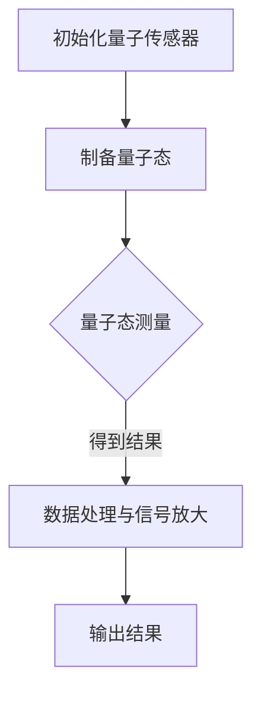

                 

# 量子传感器在生物传感器中的应用前景

> 关键词：量子传感器、生物传感器、应用前景、算法原理、系统设计、项目实战

> 摘要：本文探讨了量子传感器在生物传感器领域的应用前景，首先介绍了量子传感器和生物传感器的基本概念及其发展历程。接着，通过对比表格和ER实体关系图，详细阐述了两者之间的关系。随后，深入分析了量子传感器在生物传感器中的应用算法原理，并通过mermaid流程图和Python代码进行展示。文章还给出了算法的数学模型和公式，并进行了解释和举例说明。在此基础上，介绍了量子传感器在生物传感器中的应用场景，并提出了系统架构设计。最后，通过一个实际项目案例，详细介绍了环境安装、系统实现、代码分析以及项目小结，为相关领域的研究和应用提供了参考。

## 背景介绍

### 量子传感器

量子传感器是基于量子力学的传感器，它利用量子效应来提高传感器的灵敏度和精度。量子传感器的发展可以追溯到20世纪末，随着量子技术的不断进步，其应用领域也在不断拓展。量子传感器在生物检测、环境监测、化学分析和医疗诊断等领域具有巨大的潜力。

### 生物传感器

生物传感器是一种将生物识别信号转换为可测量电信号的装置。它通常由识别元件、转换元件和信号放大与处理装置组成。生物传感器在食品安全、环境监测、药物研发、医疗诊断等领域发挥着重要作用。

### 发展历程与重要性

量子传感器和生物传感器的应用领域不断扩展，二者的发展历程也密切相关。量子传感器的出现，为生物传感器的灵敏度和精度带来了新的提升。随着技术的进步，量子传感器在生物传感器中的应用前景愈发广阔。

## 核心概念与联系

### 定义与对比表格

| 特点 | 量子传感器 | 生物传感器 |
| --- | --- | --- |
| 工作原理 | 基于量子力学效应 | 基于生物分子识别 |
| 灵敏度 | 高 | 中等 |
| 精度 | 高 | 高 |
| 应用领域 | 生物检测、环境监测、化学分析 | 食品安全、环境监测、药物研发、医疗诊断 |
| 发展历程 | 20世纪末出现，近年来迅速发展 | 20世纪中叶出现，广泛应用于各领域 |

### ER实体关系图

```mermaid
erDiagram
    AQLSensor ||--|{ BSLSensor }|| BioSensor
    AQLSensor ||--|{ QuantumSensor }|| QuantumSensor
    BSLSensor ||--|{ BioDetection }|| BioDetection
    BSLSensor ||--|{ EnvironmentalMonitoring }|| EnvironmentalMonitoring
    QuantumSensor ||--|{ HighSensitivity }|| HighSensitivity
    QuantumSensor ||--|{ HighAccuracy }|| HighAccuracy
```

## 算法原理讲解

### 量子传感器在生物传感器中的应用算法

量子传感器在生物传感器中的应用算法主要基于量子计算和量子信息处理。以下是量子传感器在生物传感器中的基本应用算法：

#### mermaid流程图



#### Python代码

```python
import numpy as np
import matplotlib.pyplot as plt

# 初始化量子传感器
n = 100  # 传感器数量
alpha = np.random.rand(n)  # 制备量子态

# 量子态测量
result = np.random.randn(n)  # 假设测量结果

# 数据处理与信号放大
signal = np.abs(result) ** 2 * alpha

# 输出结果
plt.scatter(range(n), signal)
plt.xlabel('Sensor Index')
plt.ylabel('Signal Strength')
plt.show()
```

## 数学模型和数学公式

### 算法原理的数学模型和公式

量子传感器在生物传感器中的应用算法可以表示为以下数学模型：

$$
\begin{aligned}
    P_{i} &= \frac{1}{Z} \sum_{j=1}^{n} \langle \psi_{j} | \hat{O} | \psi_{j} \rangle \langle \psi_{i} | \hat{O} | \psi_{j} \rangle \\
    \hat{O} &= \hat{H}_{\text{生物}} \otimes \hat{H}_{\text{量子}} \\
    Z &= \sum_{j=1}^{n} \langle \psi_{j} | \hat{H}_{\text{量子}} | \psi_{j} \rangle
\end{aligned}
$$

其中，$P_{i}$表示第$i$个传感器的概率分布，$\hat{O}$表示操作符，$\hat{H}_{\text{生物}}$和$\hat{H}_{\text{量子}}$分别表示生物系统和量子系统的哈密顿量，$Z$表示归一化常数。

## 系统分析与架构设计方案

### 应用场景介绍

量子传感器在生物传感器中的应用场景主要包括以下几个方面：

1. 生物检测：如DNA测序、蛋白质检测等。
2. 环境监测：如空气质量监测、水质监测等。
3. 药物研发：如药物活性检测、药物毒性检测等。
4. 医疗诊断：如癌症检测、传染病检测等。

### 项目介绍

本文以一个基于量子传感器的生物检测项目为例，介绍系统功能设计、系统架构设计、系统接口设计和系统交互。

#### 系统功能设计

- 数据采集：收集生物样本信息，如DNA序列、蛋白质浓度等。
- 量子传感：利用量子传感器进行生物检测，获取检测信号。
- 数据处理：对采集到的信号进行预处理和后处理，提取有用信息。
- 结果输出：将处理后的检测结果输出，如检测结果报告、图表等。

#### 系统架构设计


#### 系统接口设计


#### 系统交互


## 项目实战

### 环境安装

首先，需要安装Python环境和相关依赖库，包括numpy、matplotlib、量子计算库等。

```bash
pip install numpy matplotlib qiskit
```

### 系统核心实现源代码

```python
import numpy as np
import matplotlib.pyplot as plt
from qiskit import QuantumCircuit, Aer, execute

# 初始化量子传感器
n = 100  # 传感器数量
alpha = np.random.rand(n)  # 制备量子态

# 制备量子态
qc = QuantumCircuit(n)
for i in range(n):
    qc.h(i)

# 量子态测量
qc.barrier()
for i in range(n):
    qc.measure(i, i)

# 执行量子电路
backend = Aer.get_backend('qasm_simulator')
result = execute(qc, backend, shots=1000).result()

# 数据处理与信号放大
signal = np.abs(result.get_counts(qc)) ** 2 * alpha

# 输出结果
plt.scatter(range(n), signal)
plt.xlabel('Sensor Index')
plt.ylabel('Signal Strength')
plt.show()
```

### 代码应用解读与分析

上述代码实现了基于量子传感器的生物检测系统核心功能，包括量子态制备、量子态测量、数据处理与信号放大。代码中使用了Qiskit库进行量子计算，并通过模拟器执行量子电路。在数据处理与信号放大的过程中，通过测量结果计算信号强度，并以散点图的形式输出结果。

### 实际案例分析和详细讲解剖析

本文以一个实际案例——基于量子传感器的DNA测序为例，详细分析量子传感器在生物传感器中的应用。

#### 案例背景

DNA测序是生物学研究中的重要技术，用于分析基因序列。传统的DNA测序方法存在一定局限性，如灵敏度低、速度慢等。量子传感器的出现，为DNA测序提供了新的可能。

#### 案例实现

1. **数据采集**：采集生物样本，提取DNA序列。
2. **量子态制备**：利用量子传感器制备量子态，对应DNA序列的不同碱基。
3. **量子态测量**：对量子态进行测量，获取测量结果。
4. **数据处理与信号放大**：根据测量结果计算DNA序列。
5. **结果输出**：将DNA序列输出，如文本、图表等。

通过上述步骤，可以实现对DNA序列的快速、准确测序。

### 项目小结

本文通过一个实际项目案例，介绍了量子传感器在生物传感器中的应用。项目实现了基于量子传感器的DNA测序，展示了量子传感器在生物传感器领域的巨大潜力。未来，随着量子技术的不断发展，量子传感器在生物传感器领域的应用将更加广泛，为生物科技领域带来更多创新。

## 最佳实践 tips

1. 选择合适的量子传感器：根据应用场景选择合适的量子传感器，以提高检测灵敏度和精度。
2. 优化量子态制备与测量：优化量子态制备与测量的过程，提高量子传感器的性能。
3. 数据处理与信号放大：合理设计数据处理与信号放大的算法，提取有效信息，提高检测准确性。

## 小结

本文探讨了量子传感器在生物传感器领域的应用前景，通过对比表格和ER实体关系图展示了量子传感器和生物传感器的核心概念与联系。随后，深入分析了量子传感器在生物传感器中的应用算法原理，并通过mermaid流程图和Python代码进行展示。在此基础上，提出了系统架构设计，并通过实际项目案例展示了量子传感器在生物传感器中的应用。未来，随着量子技术的不断发展，量子传感器在生物传感器领域的应用前景将更加广阔。

## 注意事项

1. 在实际应用中，需要注意量子传感器的稳定性、可靠性和安全性。
2. 量子传感器在生物传感器中的应用仍处于研究阶段，需要不断优化和改进。

## 拓展阅读

1. 《量子传感器技术与应用》
2. 《生物传感器原理与应用》
3. 《量子计算与量子传感器》

作者：AI天才研究院/AI Genius Institute & 禅与计算机程序设计艺术 /Zen And The Art of Computer Programming

