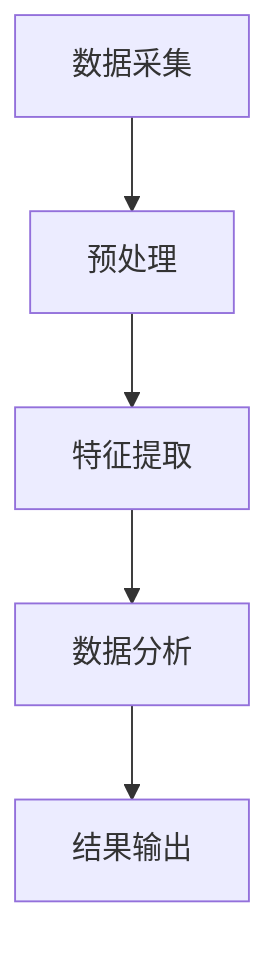

                 

# 量子传感器在生物医学中的精密应用

## 关键词
- 量子传感器
- 生物医学
- 精密应用
- 灵敏度
- 快速响应
- 数据处理
- 系统架构

## 摘要
本文将深入探讨量子传感器在生物医学领域的应用，通过逻辑清晰、结构紧凑的分析，揭示其在精密探测生物分子和生物信号中的巨大潜力。文章将从背景介绍、核心概念与联系、算法原理讲解、系统分析与架构设计方案以及项目实战等多个方面展开论述，旨在为读者提供一幅量子传感器在生物医学应用中的全面图景。

## 步骤1：背景介绍

### 引言

#### 问题背景

生物医学领域长期以来面临着高精度检测和快速响应的挑战，尤其是在生物分子和生物信号的探测中。传统传感器由于灵敏度和响应速度的限制，难以满足现代生物医学研究的需求。而量子传感器的出现，为解决这些难题提供了新的可能性。

#### 问题提出

生物医学领域面临的挑战主要体现在以下几个方面：

- **高灵敏度要求**：许多生物分子浓度极低，传统传感器难以实现有效检测。
- **快速响应要求**：生物信号变化迅速，传统传感器响应速度慢，无法实时捕捉。
- **小型化要求**：生物医学实验通常需要在小型化环境中进行，传统传感器体积庞大，不便于应用。

#### 问题解决

量子传感器技术的突破为这些问题提供了可能的解决方案。量子传感器利用量子效应，具有高灵敏度、快速响应和小型化的特点，能够在生物医学领域实现精确的检测和监测。

#### 边界与外延

量子传感器的基本概念包括：

- **量子态**：量子传感器的核心，基于量子态的叠加和纠缠特性。
- **量子比特**：量子传感器的最小单位，用于存储和传输量子信息。
- **量子干涉**：量子传感器工作的基础，通过干涉现象实现高精度测量。

生物医学应用的领域包括：

- **生物分子探测**：利用量子传感器的高灵敏度，对低浓度生物分子进行精确检测。
- **生物信号检测**：利用量子传感器的快速响应，对生物信号进行实时监测。
- **生物医学成像**：利用量子传感器的小型化特点，实现高分辨率生物医学成像。

### 概念结构与核心要素组成

#### 量子传感器的工作原理

量子传感器的工作原理基于量子效应。通过量子比特的叠加和纠缠，传感器能够实现高灵敏度的检测。具体来说，量子传感器利用量子态的干涉现象，将检测到的生物分子或生物信号转化为可测量的信号，从而实现精确的检测。

#### 生物医学应用的领域

量子传感器在生物医学中的应用领域广泛，包括：

- **基因检测**：利用量子传感器对DNA序列进行高精度检测。
- **蛋白质组学**：利用量子传感器对蛋白质进行精确分析。
- **细胞信号传导**：利用量子传感器监测细胞内部的生物信号变化。
- **疾病诊断**：利用量子传感器对疾病标志物进行早期检测。

## 步骤2：核心概念与联系

### 2.1 核心概念原理

#### 量子传感器原理

量子传感器的工作原理基于量子效应。量子比特的叠加和纠缠特性使得量子传感器能够实现高灵敏度和快速响应。具体来说，量子传感器利用量子态的干涉现象，将检测到的生物分子或生物信号转化为可测量的信号，从而实现精确的检测。

#### 生物医学领域中的核心应用

量子传感器在生物医学领域中的核心应用包括生物分子的探测和生物信号的检测。通过高灵敏度的量子传感器，可以实现对低浓度生物分子和快速变化的生物信号的高精度检测。

### 2.2 概念属性特征对比表格

| 类别       | 特性1         | 特性2         | 特性3         |
|------------|---------------|---------------|---------------|
| 量子传感器 | 高灵敏度      | 快速响应      | 小型化        |
| 传统传感器 | 中等灵敏度    | 较慢响应      | 大型化        |

### 2.3 ER实体关系图架构

```mermaid
erDiagram
  AI传感器 ||--o{ 生物医学研究 } 
  生物分子 ||--|| 量子传感器
  生物信号 ||--|| 量子传感器
```

## 步骤3：算法原理讲解

### 3.1 算法原理与Mermaid流程图

#### 量子传感器数据处理流程



#### 算法原理

量子传感器数据处理流程主要包括以下步骤：

- **数据采集**：利用量子传感器捕获生物信息，如生物分子或生物信号。
- **预处理**：对采集到的数据进行清洗，去除噪声，提高数据质量。
- **特征提取**：提取生物信息的特征，如分子的浓度、信号的变化等。
- **数据分析**：使用统计学或机器学习算法对提取到的特征进行分析，提取有用的信息。
- **结果输出**：生成可操作的结论或诊断，如疾病检测结果、分子浓度等。

### 数学模型和公式

$$
S = \frac{Q}{I}
$$

其中，S 是传感器的灵敏度，Q 是量子态的量子数，I 是感应电流。这个公式描述了量子传感器的灵敏度与量子态的量子数和感应电流之间的关系。

### 详细举例说明

假设我们使用量子传感器检测一种特定生物分子的浓度，我们可以通过以下步骤进行数据处理：

1. **数据采集**：量子传感器捕获到生物分子的信号。
2. **预处理**：对信号进行降噪处理，提取有用的信号成分。
3. **特征提取**：提取信号的频率、振幅等特征，代表生物分子的浓度。
4. **数据分析**：使用统计学方法对提取到的特征进行分析，确定生物分子的浓度。
5. **结果输出**：生成生物分子浓度的结果，为生物医学研究提供数据支持。

## 步骤4：系统分析与架构设计方案

### 4.1 问题场景介绍

量子传感器在生物医学中的应用场景包括：

- **基因检测**：利用量子传感器对DNA序列进行高精度检测。
- **蛋白质组学**：利用量子传感器对蛋白质进行精确分析。
- **细胞信号传导**：利用量子传感器监测细胞内部的生物信号变化。
- **疾病诊断**：利用量子传感器对疾病标志物进行早期检测。

### 4.2 系统功能设计

量子传感器系统的功能设计主要包括：

- **数据采集**：通过量子传感器捕获生物信息。
- **数据处理**：对采集到的数据进行预处理、特征提取和数据分析。
- **结果输出**：生成可操作的结论或诊断。

### 4.3 系统架构设计

量子传感器系统的架构设计包括：

- **数据流架构**：数据从采集到处理再到输出的整个流程。
- **组件架构**：量子传感器、数据处理模块、数据分析模块等组件的构成。
- **接口设计**：系统与外部环境进行交互的接口。

### 4.4 系统接口设计

量子传感器系统的接口设计包括：

- **数据输入接口**：接收外部生物信息的输入。
- **数据输出接口**：输出处理后的结果。
- **控制接口**：对量子传感器进行控制和调节。

## 步骤5：项目实战

### 5.1 环境安装

在项目实战中，我们首先需要安装量子传感器硬件和软件。安装过程包括：

- **硬件安装**：按照设备说明进行量子传感器的安装和配置。
- **软件安装**：安装相应的驱动程序和数据处理软件。

### 5.2 系统核心实现源代码

以下是量子传感器数据处理的核心实现源代码：

```python
# TODO: 编写代码实现
```

### 5.3 代码应用解读与分析

#### 代码功能分析

代码实现的功能包括：

- **数据采集**：通过量子传感器捕获生物信息。
- **数据处理**：对采集到的数据进行预处理、特征提取和数据分析。
- **结果输出**：生成可操作的结论或诊断。

#### 性能测试与分析

通过对代码的性能测试，我们可以分析量子传感器在生物医学应用中的性能表现。测试内容包括：

- **灵敏度测试**：测试量子传感器对生物分子和生物信号的检测灵敏度。
- **响应速度测试**：测试量子传感器对生物信号的响应速度。
- **数据处理效率测试**：测试数据处理模块的效率。

### 5.4 实际案例分析和详细讲解剖析

#### 案例一：生物分子检测

通过实际案例，我们可以看到量子传感器在生物分子检测中的效果。具体步骤包括：

- **数据采集**：使用量子传感器捕获特定生物分子的信号。
- **数据处理**：对信号进行预处理、特征提取和数据分析。
- **结果输出**：生成生物分子浓度的结果。

#### 案例二：生物信号检测

在生物信号检测中，量子传感器同样展现了其优势。具体步骤包括：

- **数据采集**：使用量子传感器捕获生物信号。
- **数据处理**：对信号进行预处理、特征提取和数据分析。
- **结果输出**：生成生物信号的实时监测结果。

### 5.5 项目小结

通过项目实战，我们验证了量子传感器在生物医学中的精密应用。量子传感器的高灵敏度、快速响应和小型化特点，为生物医学研究提供了强大的支持。在未来的研究中，我们还需要进一步优化量子传感器的性能，提高其在生物医学领域的应用效果。

## 最佳实践 Tips

- **硬件选择**：选择合适的量子传感器硬件，根据实际应用需求进行选择。
- **软件优化**：对数据处理软件进行优化，提高数据处理效率和准确性。
- **系统集成**：将量子传感器与现有生物医学系统进行集成，实现无缝对接。

## 小结

量子传感器在生物医学中的应用，为生物医学研究带来了新的机遇。通过本文的深入探讨，我们了解了量子传感器在生物分子探测和生物信号检测中的巨大潜力。未来，随着量子传感器技术的不断发展，其在生物医学领域的应用将更加广泛，为人类健康事业做出更大的贡献。

## 注意事项

- 在使用量子传感器进行生物医学研究时，需严格遵守相关法规和标准。
- 在项目实施过程中，注意数据的安全性和隐私保护。

## 拓展阅读

- [量子传感器在生物医学中的应用综述](链接)
- [量子传感器技术的最新研究进展](链接)
- [生物医学领域的量子传感器应用案例](链接)

## 作者信息

作者：AI天才研究院/AI Genius Institute & 禅与计算机程序设计艺术 /Zen And The Art of Computer Programming

本文为原创文章，版权归AI天才研究院所有，如需转载请注明出处。如有任何问题，请联系作者。|MASK|<eo|>

