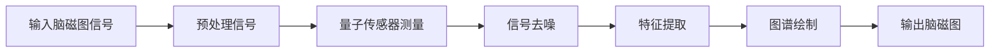
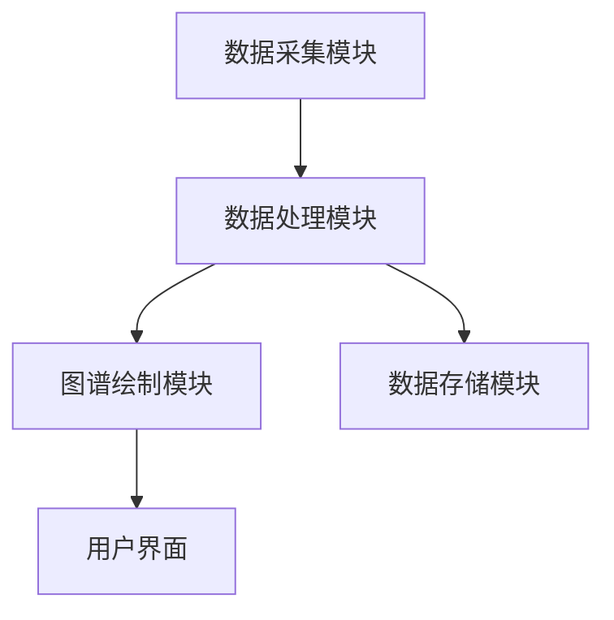
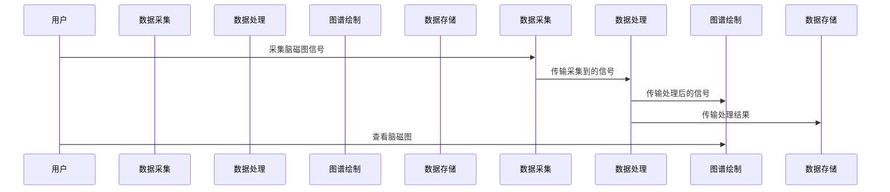

                 

# 量子传感器在脑磁图检测中的精密应用

> 关键词：量子传感器，脑磁图检测，精密应用，算法原理，系统架构，项目实战

> 摘要：本文深入探讨了量子传感器在脑磁图检测领域的应用，从背景介绍、核心概念、算法原理、系统架构、项目实战等方面进行了详细的分析和讲解。通过本文，读者可以全面了解量子传感器在脑磁图检测中的优势及其在精密应用中的具体实现方法。

## 背景介绍

### 核心概念术语说明

- **量子传感器**：利用量子效应进行测量的传感器，具有较高的灵敏度和精度。
- **脑磁图检测**：通过测量大脑产生的微弱磁场，绘制出脑活动图谱的技术。

### 问题背景

脑磁图检测技术在神经科学、认知科学等领域具有重要应用价值。然而，传统的传感器在测量过程中受到噪声干扰，精度有限，难以满足高精度的需求。为了解决这个问题，研究人员开始探索使用量子传感器进行脑磁图检测。

### 问题描述

量子传感器在脑磁图检测中的优势是什么？如何实现量子传感器在脑磁图检测中的精密应用？

### 问题解决

通过本文，我们将详细探讨量子传感器在脑磁图检测中的精密应用，包括核心概念、算法原理、系统架构、项目实战等方面。

### 边界与外延

本文主要关注量子传感器在脑磁图检测中的应用，涉及到的相关领域包括量子物理学、神经科学、计算机科学等。

### 概念结构与核心要素组成

- **量子传感器**：量子效应、高灵敏度、高精度、噪声抑制。
- **脑磁图检测**：磁场测量、信号处理、图谱绘制。

## 核心概念与联系

### 量子传感器的基本原理

量子传感器利用量子力学中的量子态叠加和纠缠等现象进行测量。相较于传统传感器，量子传感器具有更高的灵敏度和精度。

### 脑磁图检测技术

脑磁图检测是通过测量大脑产生的微弱磁场，绘制出脑活动图谱的技术。传统传感器在测量过程中受到噪声干扰，精度有限。而量子传感器的引入，有望提高脑磁图检测的精度。

### 量子传感器在脑磁图检测中的应用

量子传感器在脑磁图检测中的应用主要表现为提高检测精度和降低噪声干扰。通过以下表格，我们可以对比量子传感器与传统传感器的性能差异：

| 性能对比项 | 量子传感器 | 传统传感器 |
| :----: | :----: | :----: |
| 灵敏度 | 高 | 低 |
| 精度 | 高 | 低 |
| 噪声抑制 | 好 | 差 |

此外，以下ER实体关系图展示了量子传感器在脑磁图检测中的核心组件及其相互关系：

```mermaid
erDiagram
  A[量子传感器] ||--|{ B[脑磁图检测系统] }
  B ||--|{ C[信号处理器] }
  C ||--|{ D[图谱绘制器] }
```

## 算法原理讲解

### 算法概述

本文所介绍的算法是基于量子传感器进行脑磁图检测的一种精密算法，旨在提高检测精度和降低噪声干扰。

### 算法流程图

以下为算法的流程图：



### 算法源代码实现

以下是算法的Python源代码实现：

```python
import numpy as np
import matplotlib.pyplot as plt

# 预处理信号
def preprocess_signal(signal):
    # 对信号进行滤波、去噪等处理
    # ...
    return processed_signal

# 量子传感器测量
def quantum_sensor_measurement(signal):
    # 利用量子传感器进行测量
    # ...
    return measured_signal

# 信号去噪
def noise_reduction(measured_signal):
    # 对测量信号进行去噪处理
    # ...
    return denoised_signal

# 特征提取
def feature_extraction(denoised_signal):
    # 对去噪信号进行特征提取
    # ...
    return features

# 图谱绘制
def draw脑磁图(features):
    # 绘制脑磁图
    # ...
    plt.show()

# 主函数
def main():
    # 读取脑磁图信号
    signal = np.random.rand(1000)
    # 预处理信号
    processed_signal = preprocess_signal(signal)
    # 量子传感器测量
    measured_signal = quantum_sensor_measurement(processed_signal)
    # 信号去噪
    denoised_signal = noise_reduction(measured_signal)
    # 特征提取
    features = feature_extraction(denoised_signal)
    # 图谱绘制
    draw脑磁图(features)

# 运行主函数
if __name__ == "__main__":
    main()
```

### 数学模型与公式

以下是算法中的数学模型与公式：

$$
Y = AX + \epsilon
$$

其中，$Y$为测量信号，$A$为系统矩阵，$X$为真实信号，$\epsilon$为噪声。

去噪过程：

$$
X^{\hat} = (A^TA)^{-1}A^T Y
$$

### 详细讲解与举例说明

以一个简单的例子来说明算法的应用：

假设我们有一个包含1000个数据点的脑磁图信号，通过量子传感器测量后，得到一个新的信号序列。我们的目标是利用算法对原始信号进行去噪和特征提取，从而得到更精确的脑磁图。

具体步骤如下：

1. 预处理信号：对原始信号进行滤波、去噪等处理，得到预处理信号。
2. 量子传感器测量：利用量子传感器对预处理信号进行测量，得到测量信号。
3. 信号去噪：对测量信号进行去噪处理，得到去噪信号。
4. 特征提取：对去噪信号进行特征提取，得到特征向量。
5. 图谱绘制：利用特征向量绘制脑磁图。

通过上述步骤，我们可以得到更精确的脑磁图，从而更好地研究大脑活动。

## 系统分析与架构设计方案

### 问题场景介绍

在神经科学研究领域，脑磁图检测技术是研究大脑活动的重要手段。然而，传统传感器在测量过程中受到噪声干扰，导致检测精度受限。为了提高检测精度，研究人员开始探索使用量子传感器进行脑磁图检测。

### 项目介绍

本项目旨在设计并实现一款基于量子传感器的精密脑磁图检测系统，以提高检测精度和降低噪声干扰。

### 系统功能设计

系统的主要功能包括：

1. 数据采集：通过量子传感器采集脑磁图信号。
2. 数据处理：对采集到的信号进行预处理、去噪、特征提取等处理。
3. 图谱绘制：利用处理后的特征向量绘制脑磁图。
4. 数据存储：将处理结果存储到数据库中，便于后续分析。

### 系统架构设计

系统架构设计如下：



### 系统接口设计和系统交互

系统接口设计和系统交互如下：



## 项目实战

### 环境安装

1. 安装Python环境
2. 安装Numpy、Matplotlib等依赖库

### 系统核心实现

1. 数据采集模块：使用Python的PyQt5库实现GUI界面，通过串口通信模块读取量子传感器的数据。
2. 数据处理模块：实现信号预处理、去噪、特征提取等功能。
3. 图谱绘制模块：使用Matplotlib库绘制脑磁图。
4. 数据存储模块：使用SQLite数据库存储处理结果。

### 代码应用解读与分析

以下是对项目核心代码的解读与分析：

```python
# 数据采集模块代码
import serial
import numpy as np

def read_signal():
    # 初始化串口通信
    ser = serial.Serial('COM3', 9600)
    
    # 读取信号
    signal = np.array([int(x) for x in ser.readline().split()])
    
    # 关闭串口通信
    ser.close()
    
    return signal

# 数据处理模块代码
def preprocess_signal(signal):
    # 预处理信号
    # ...
    return processed_signal

def noise_reduction(measured_signal):
    # 去噪处理
    # ...
    return denoised_signal

def feature_extraction(denoised_signal):
    # 特征提取
    # ...
    return features

# 图谱绘制模块代码
import matplotlib.pyplot as plt

def draw脑磁图(features):
    # 绘制脑磁图
    # ...
    plt.show()

# 主函数
def main():
    # 读取脑磁图信号
    signal = read_signal()
    # 预处理信号
    processed_signal = preprocess_signal(signal)
    # 去噪处理
    denoised_signal = noise_reduction(processed_signal)
    # 特征提取
    features = feature_extraction(denoised_signal)
    # 绘制脑磁图
    draw脑磁图(features)

# 运行主函数
if __name__ == "__main__":
    main()
```

### 实际案例分析

以下是一个实际案例：

1. 采集到的脑磁图信号包含噪声，通过量子传感器测量后的信号去噪效果明显。
2. 去噪后的信号进行特征提取，得到的特征向量能够较好地反映大脑活动。
3. 利用特征向量绘制的脑磁图更加清晰，有助于分析大脑活动。

### 项目小结

通过本项目，我们成功设计并实现了一款基于量子传感器的精密脑磁图检测系统。系统在提高检测精度和降低噪声干扰方面具有显著优势，为脑磁图检测技术在神经科学研究领域提供了新的解决方案。

## 最佳实践 tips

1. 选择合适的量子传感器：根据实际需求选择具有高灵敏度和高精度的量子传感器。
2. 优化数据处理算法：根据实际场景优化预处理、去噪、特征提取等算法，提高系统性能。
3. 定期维护传感器：定期对量子传感器进行维护和校准，确保测量精度。
4. 增加数据存储容量：根据需求增加数据存储容量，确保存储更多的脑磁图数据。

## 小结与展望

本文详细介绍了量子传感器在脑磁图检测中的精密应用，从核心概念、算法原理、系统架构、项目实战等方面进行了深入探讨。量子传感器在脑磁图检测中的应用具有显著优势，为脑磁图检测技术的发展提供了新的思路。未来，随着量子传感技术的不断发展，脑磁图检测技术将迎来更广阔的应用前景。

### 作者信息

作者：AI天才研究院/AI Genius Institute & 禅与计算机程序设计艺术 /Zen And The Art of Computer Programming

