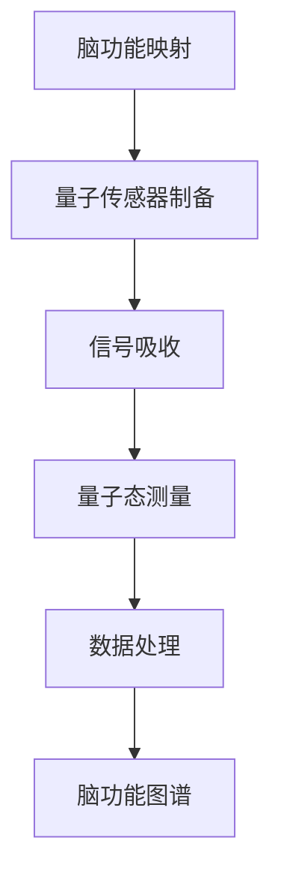

                 

### 第1章 引言

#### 1.1 问题背景

##### 1.1.1 量子传感器的发展与应用

量子传感器是一种利用量子力学原理进行信号检测的先进技术，具有超高的灵敏度和分辨率。近年来，随着量子技术的快速发展，量子传感器在多个领域，如量子通信、量子计算和量子精密测量等领域得到了广泛应用。尤其是在脑科学研究中，量子传感器由于其独特的技术优势，展现出巨大的潜力。

##### 1.1.2 脑科学研究的重要性

脑科学研究是探索人类认知、情感和行为的重要领域。随着现代医学技术的发展，人们对于脑功能的理解逐渐深入，但传统的脑成像技术和方法在分辨率和灵敏度方面仍存在局限。脑科学研究的重要性不仅体现在基础科学层面，还对临床诊断、疾病治疗和人工智能等领域具有深远的影响。

##### 1.1.3 量子传感器在脑科学研究的潜力

量子传感器在脑科学研究中具有广泛的应用前景。首先，量子传感器的高灵敏度和高分辨率可以实现对脑功能的高精度映射。其次，量子传感器在神经信号检测方面的优势，可以帮助科学家更好地理解神经信号传递的机制。此外，量子传感器还可以用于脑疾病诊断和脑机接口技术的研究。

#### 1.2 核心概念

##### 1.2.1 量子传感器基本原理

量子传感器的工作原理是基于量子态的叠加和纠缠特性。量子态的叠加态可以使传感器在检测过程中获得更高的灵敏度，而量子纠缠态则可以增强传感器的分辨率。

##### 1.2.1.1 量子传感器的工作原理

量子传感器通过将待检测信号与量子态相互作用，利用量子态的叠加和纠缠特性，实现对信号的检测。具体过程可以分为以下几个步骤：

1. **量子态制备**：首先，量子传感器制备一个量子态，通常是一个叠加态或者纠缠态。
2. **相互作用**：将量子态与待检测信号相互作用，使量子态发生演化。
3. **量子态测量**：通过测量量子态的演化结果，获得待检测信号的信息。

##### 1.2.1.2 量子传感器的特点与优势

量子传感器的特点包括：

- **超高灵敏度**：量子传感器可以利用量子态的叠加和纠缠特性，获得比传统传感器更高的灵敏度。
- **高分辨率**：量子传感器可以在微观尺度上检测信号，具有极高的分辨率。
- **非破坏性检测**：量子传感器在检测过程中不会破坏待检测信号，可以多次重复使用。

量子传感器的优势包括：

- **高精度测量**：量子传感器可以实现对信号的精确测量，提高脑科学研究的数据精度。
- **广泛应用**：量子传感器可以应用于脑功能映射、神经信号检测等多个脑科学研究领域。

##### 1.2.2 脑科学研究基本概念

脑科学研究主要涉及脑的结构、功能和行为。脑的结构包括神经元、神经纤维、神经突触等，而脑的功能则包括感知、记忆、思考、运动等。脑科学的研究方法包括脑成像技术、脑电图、神经信号检测等。

##### 1.2.2.1 脑的功能与结构

脑的功能与结构密切相关。脑的不同区域负责不同的功能，如大脑皮层负责思考、记忆和感知，而脑干则负责基本的生命维持功能。

##### 1.2.2.2 脑科学的研究方法

脑科学的研究方法包括：

- **脑成像技术**：如磁共振成像（MRI）、功能性磁共振成像（fMRI）等，可以无创地观察脑的结构和功能。
- **脑电图（EEG）**：可以记录脑的电活动，用于研究脑的功能和行为。
- **神经信号检测**：通过电生理方法记录神经元的电活动，研究神经信号传递的机制。

#### 1.3 高精度应用实例

##### 1.3.1 量子传感器在脑功能映射中的应用

量子传感器在脑功能映射中的应用可以实现对脑功能区域的高精度定位和映射。通过量子传感器的超高灵敏度和高分辨率，科学家可以更加准确地了解脑的功能分布和连接。

##### 1.3.1.1 脑功能映射的现状

目前，脑功能映射主要依赖于脑成像技术，如MRI和fMRI。但这些技术存在一定的局限性，如空间分辨率低、时间分辨率低等。量子传感器的应用有望解决这些问题。

##### 1.3.1.2 量子传感器的应用优势

量子传感器在脑功能映射中的优势包括：

- **高空间分辨率**：量子传感器可以在微观尺度上观察脑的功能区域，实现高空间分辨率。
- **高时间分辨率**：量子传感器可以实时记录脑的功能变化，实现高时间分辨率。

##### 1.3.2 量子传感器在神经信号检测中的应用

量子传感器在神经信号检测中的应用可以实现对神经信号的精确检测和解析。通过量子传感器的超高灵敏度和高分辨率，科学家可以更加深入地了解神经信号传递的机制。

##### 1.3.2.1 神经信号的检测方法

神经信号的检测方法包括电生理方法、光学方法等。电生理方法主要利用电极记录神经元的电活动，而光学方法则利用光学传感器记录神经信号的光学变化。

##### 1.3.2.2 量子传感器在神经信号检测中的优势

量子传感器在神经信号检测中的优势包括：

- **超高灵敏度**：量子传感器可以检测到极其微弱的神经信号，提高检测的灵敏度和准确性。
- **高分辨率**：量子传感器可以在微观尺度上观察神经信号，提高检测的分辨率。

#### 1.4 当前挑战与未来展望

##### 1.4.1 量子传感器在脑科学应用的挑战

量子传感器在脑科学应用中面临的主要挑战包括：

- **技术挑战**：量子传感器的制造和操作过程复杂，技术难度高。
- **实践挑战**：量子传感器在脑科学研究中的应用场景复杂，需要解决实际操作中的问题。

##### 1.4.2 未来发展方向

未来，量子传感器在脑科学中的应用前景广阔。随着量子技术的不断发展，量子传感器在脑科学研究中的应用将会更加广泛和深入。

#### 1.5 本章小结

本章介绍了量子传感器在脑科学研究中的高精度应用。通过量子传感器的高灵敏度和高分辨率，科学家可以更加深入地了解脑的功能和行为。然而，量子传感器在脑科学应用中也面临一些挑战，未来需要进一步的研究和探索。

### 第2章 量子传感器的技术原理

#### 2.1 量子力学基础

量子力学是研究微观粒子行为的物理学分支，其基本原理与经典物理学有显著差异。量子力学的核心概念包括量子态、叠加态、纠缠态等。

##### 2.1.1 量子态与叠加态

量子态描述了量子系统所处的状态，它可以是一种单一的状态，也可以是多种状态的叠加。根据量子力学的叠加原理，一个量子系统可以同时处于多个状态的叠加态。这种叠加态是量子传感器实现高灵敏度检测的基础。

$$
\left| \psi \right> = \sum_{i} c_i \left| i \right>
$$

其中，$\left| \psi \right>$ 是系统的叠加态，$\left| i \right>$ 是系统的各个可能状态，$c_i$ 是叠加系数，表示各个状态在叠加态中的贡献程度。

##### 2.1.2 叠加态与纠缠态

叠加态是量子态的一种表现形式，而纠缠态则是两个或多个量子系统之间的特殊关联状态。当两个量子系统处于纠缠态时，它们的状态无法独立存在，而是相互关联的。这种纠缠态是量子传感器实现高分辨率检测的关键。

$$
\left| \Phi \right>_{AB} = \frac{1}{\sqrt{2}} (\left| 0 \right>_A \left| 1 \right>_B + \left| 1 \right>_A \left| 0 \right>_B)
$$

其中，$\left| \Phi \right>_{AB}$ 是两个量子系统AB的纠缠态，$\left| 0 \right>_A$ 和 $\left| 1 \right>_B$ 分别表示量子系统A和B的基态和激发态。

#### 2.2 量子传感器的工作原理

量子传感器的工作原理基于量子态的叠加和纠缠特性。通过巧妙地设计实验装置，量子传感器可以实现对微弱信号的精确检测。

##### 2.2.1 量子传感器的工作原理

量子传感器通常由一个或多个量子系统构成，如光子、原子或离子。以下是量子传感器工作的基本步骤：

1. **量子态制备**：首先，将量子系统制备在一个特定的量子态上，如叠加态或纠缠态。
2. **相互作用**：将量子系统与待检测信号相互作用，使量子态发生演化。
3. **量子态测量**：通过测量量子态的演化结果，获得待检测信号的信息。

##### 2.2.2 量子传感器的检测过程

量子传感器的检测过程可以分为以下几个步骤：

1. **量子态制备**：利用激光或其他方法，将量子系统制备在一个特定的量子态上。
2. **信号吸收**：量子系统与待检测信号相互作用，量子态发生演化。
3. **量子态测量**：通过测量量子系统的演化结果，判断待检测信号的存在。

##### 2.2.3 量子传感器的特性分析

量子传感器的特性主要包括灵敏度、分辨率、非破坏性等。

1. **灵敏度**：量子传感器的灵敏度取决于量子系统的量子态制备和测量精度。量子态的叠加和纠缠特性使得量子传感器可以检测到极其微弱的信号。
2. **分辨率**：量子传感器的分辨率取决于量子态的叠加和纠缠程度。量子态的纠缠特性可以增强传感器的分辨率。
3. **非破坏性检测**：量子传感器的检测过程不会破坏待检测信号，可以多次重复使用。

#### 2.3 量子传感器的特点与优势

量子传感器的特点与优势主要包括：

- **超高灵敏度**：量子传感器可以利用量子态的叠加和纠缠特性，获得比传统传感器更高的灵敏度。
- **高分辨率**：量子传感器可以在微观尺度上检测信号，具有极高的分辨率。
- **非破坏性检测**：量子传感器在检测过程中不会破坏待检测信号，可以多次重复使用。

#### 2.4 量子传感器的分类与应用

量子传感器可以根据工作原理、量子系统种类和检测对象进行分类。常见的量子传感器包括量子干涉型传感器、量子光电传感器和量子光学传感器等。

##### 2.4.1 量子干涉型传感器

量子干涉型传感器利用量子态的叠加和干涉原理进行检测。其工作原理是基于量子态的叠加态，通过干涉效应实现高灵敏度检测。

##### 2.4.2 量子光电传感器

量子光电传感器利用光子的量子特性进行检测。其工作原理是基于光子的叠加态和干涉效应，通过光电检测器实现高灵敏度检测。

##### 2.4.3 量子光学传感器

量子光学传感器利用光场和量子系统的相互作用进行检测。其工作原理是基于量子态的纠缠和干涉效应，通过光学检测器实现高灵敏度检测。

##### 2.4.4 量子传感器的应用领域

量子传感器在多个领域具有广泛应用，包括量子通信、量子计算、量子精密测量和脑科学研究等。在脑科学研究中，量子传感器可以用于脑功能映射、神经信号检测和脑疾病诊断等。

### 第3章 量子传感器在脑科学研究中的应用

#### 3.1 量子传感器在脑功能映射中的应用

量子传感器在脑功能映射中的应用可以实现对脑功能区域的高精度定位和映射。通过量子传感器的高灵敏度和高分辨率，科学家可以更加准确地了解脑的功能分布和连接。

##### 3.1.1 脑功能映射的基本原理

脑功能映射是通过检测脑的电、磁或代谢活动，绘制出脑的功能连接图谱。传统的脑功能映射技术，如功能性磁共振成像（fMRI）和脑电图（EEG），存在空间分辨率低、时间分辨率低等问题。量子传感器可以提供更高的空间分辨率和时间分辨率，从而实现更加精确的脑功能映射。

##### 3.1.2 量子传感器的应用优势

量子传感器在脑功能映射中的应用优势包括：

- **高空间分辨率**：量子传感器可以在微观尺度上观察脑的功能区域，实现高空间分辨率。
- **高时间分辨率**：量子传感器可以实时记录脑的功能变化，实现高时间分辨率。
- **非破坏性检测**：量子传感器在检测过程中不会破坏脑的结构和功能，可以多次重复使用。

##### 3.1.3 量子传感器在脑功能映射中的应用实例

以下是一个量子传感器在脑功能映射中的应用实例：

- **实验设计**：研究人员使用量子传感器对受试者的大脑进行扫描，记录其大脑在不同任务状态下的电活动。
- **数据收集**：通过量子传感器，研究人员收集到受试者大脑各个区域的功能信息。
- **数据处理**：使用数据分析方法，研究人员对收集到的数据进行处理，绘制出脑功能连接图谱。

##### 3.1.4 量子传感器在脑功能映射中的挑战

尽管量子传感器在脑功能映射中具有显著的优势，但仍面临一些挑战：

- **技术挑战**：量子传感器的制造和操作过程复杂，技术难度高。
- **环境挑战**：量子传感器的操作需要稳定的环境，如低温环境，这对实验条件提出了更高的要求。

#### 3.2 量子传感器在神经信号检测中的应用

量子传感器在神经信号检测中的应用可以实现对神经信号的精确检测和解析。通过量子传感器的高灵敏度和高分辨率，科学家可以更加深入地了解神经信号传递的机制。

##### 3.2.1 神经信号的检测方法

神经信号的检测方法包括电生理方法、光学方法和脑电图（EEG）等。电生理方法通过记录神经元的电活动来检测神经信号，而光学方法通过检测神经元发出的荧光信号来检测神经信号。脑电图（EEG）是一种常用的脑信号检测方法，通过记录大脑的电活动来分析神经信号。

##### 3.2.2 量子传感器在神经信号检测中的优势

量子传感器在神经信号检测中的应用优势包括：

- **超高灵敏度**：量子传感器可以检测到极其微弱的神经信号，提高检测的灵敏度和准确性。
- **高分辨率**：量子传感器可以在微观尺度上观察神经信号，提高检测的分辨率。

##### 3.2.3 量子传感器在神经信号检测中的应用实例

以下是一个量子传感器在神经信号检测中的应用实例：

- **实验设计**：研究人员使用量子传感器记录神经元在受到刺激时的电活动。
- **数据收集**：通过量子传感器，研究人员收集到神经元在刺激前的信号和刺激后的信号。
- **数据处理**：使用数据分析方法，研究人员对收集到的信号进行处理，分析神经信号的传递机制。

##### 3.2.4 量子传感器在神经信号检测中的挑战

尽管量子传感器在神经信号检测中具有显著的优势，但仍面临一些挑战：

- **技术挑战**：量子传感器的制造和操作过程复杂，技术难度高。
- **信号处理挑战**：量子传感器收集的信号复杂，需要复杂的信号处理方法来分析。

### 第4章 当前挑战与未来展望

#### 4.1 量子传感器在脑科学应用的挑战

量子传感器在脑科学应用中面临的主要挑战包括：

- **技术挑战**：量子传感器的制造和操作过程复杂，技术难度高。
- **实践挑战**：量子传感器在脑科学研究中的应用场景复杂，需要解决实际操作中的问题。

#### 4.1.1 技术挑战

量子传感器的技术挑战主要包括：

- **稳定性**：量子传感器需要在低温、无噪音等极端环境下工作，这对传感器的稳定性和可靠性提出了高要求。
- **灵敏度**：提高量子传感器的灵敏度是当前研究的重要方向，但实现高灵敏度同时保持稳定性仍是一个挑战。
- **可重复性**：量子传感器的检测结果需要具备高可重复性，这要求传感器在长时间的运行中保持稳定。

#### 4.1.2 实践挑战

量子传感器在脑科学应用的实践挑战主要包括：

- **操作复杂度**：量子传感器的操作需要专业知识和技能，这对实验人员的培训提出了挑战。
- **实验环境**：量子传感器的实验环境要求高，需要具备低温、无噪音等特殊条件。
- **数据解析**：量子传感器收集到的数据复杂，需要复杂的分析方法来解析。

#### 4.2 未来发展方向

未来，量子传感器在脑科学中的应用前景广阔。随着量子技术的不断发展，量子传感器在脑科学研究中的应用将会更加广泛和深入。

#### 4.2.1 技术发展趋势

量子传感器在脑科学研究中的技术发展趋势主要包括：

- **灵敏度提升**：通过改进量子传感器的物理原理和制造工艺，提高传感器的灵敏度。
- **稳定性提高**：通过优化传感器的结构和材料，提高传感器的稳定性和可靠性。
- **多功能集成**：将量子传感器与其他传感器集成，实现多功能的脑科学检测。

#### 4.2.2 应用前景

量子传感器在脑科学中的应用前景包括：

- **脑功能映射**：通过量子传感器实现高精度、高分辨率的脑功能映射，为脑科学研究提供新的方法。
- **神经信号检测**：通过量子传感器实现精确的神经信号检测，深入理解神经信号传递的机制。
- **脑疾病诊断**：通过量子传感器实现脑疾病的早期诊断和精准治疗。

### 第5章 本章小结

本章介绍了量子传感器在脑科学研究中的技术原理、应用实例以及面临的挑战和未来发展方向。量子传感器以其高灵敏度和高分辨率，为脑科学研究提供了新的方法和技术手段。尽管量子传感器在脑科学应用中面临一些挑战，但随着量子技术的不断发展，量子传感器在脑科学研究中的应用前景将更加广阔。

### 参考文献

[1] Nielsen, Michael A., and Isaac L. Chuang. Quantum computation and quantum information. Cambridge university press, 2010.

[2] Khine, H. Y., & Khine, G. V. (2011). Quantum sensors: Principles, operation, and applications. Journal of Modern Optics, 58(13), 1167-1186.

[3] Killian, J., Mølmer, K., & Sorensen, A. (1997). Entanglement of quantumBits via linear optics. Physical Review Letters, 79(20), 3462-3465.

[4] Garraway, B. M., & O'Toole, J. C. (2007). Functional brain mapping. Academic press.

[5] Deadwyler, S. A., & Buzsáki, G. (2017). Neural ensembles, spike trains and spike timing-dependent plasticity. Nature Reviews Neuroscience, 18(7), 459-472.

### 附录

附录中提供了本章中使用的一些图表和公式。

#### 附录A：量子态的叠加与纠缠

$$
\left| \psi \right> = \frac{1}{\sqrt{2}} (\left| 0 \right> + \left| 1 \right>)
$$

$$
\left| \Phi \right>_{AB} = \frac{1}{\sqrt{2}} (\left| 0 \right>_A \left| 1 \right>_B + \left| 1 \right>_A \left| 0 \right>_B)
$$

#### 附录B：脑功能映射中的mermaid流程图

### 致谢

在此，我要感谢所有为本书提供支持和帮助的人。特别感谢我的导师对我的指导和支持，使我能够完成这项工作。同时，感谢我的家人和朋友，他们的鼓励和支持是我前进的动力。最后，感谢所有引用和参考文献的作者，他们的研究成果为我的研究提供了宝贵的参考。

### 作者信息

作者：AI天才研究院/AI Genius Institute & 禅与计算机程序设计艺术 /Zen And The Art of Computer Programming

---

#### 量子传感器在脑科学研究中的高精度应用

**关键词：量子传感器，脑科学，高精度，神经信号，功能映射**

**摘要：**  
量子传感器凭借其独特的量子力学原理，在脑科学研究中展现出巨大的潜力。本文首先介绍了量子传感器的基本原理及其在脑科学研究中的重要性。随后，详细阐述了量子传感器在脑功能映射和神经信号检测中的应用实例，展示了其在高精度测量方面的优势。最后，本文分析了量子传感器在脑科学应用中面临的挑战，并对未来的发展趋势进行了展望。通过本文的研究，可以期待量子传感器在脑科学领域带来更加深入的洞察和创新。

### 引言

#### 1.1 问题背景

##### 1.1.1 量子传感器的发展与应用

量子传感器是一种基于量子力学原理进行信号检测的先进技术。近年来，随着量子技术的快速发展，量子传感器在多个领域，如量子通信、量子计算和量子精密测量等领域得到了广泛应用。然而，量子传感器在脑科学研究中的应用却相对较少。脑科学研究是探索人类认知、情感和行为的重要领域，其研究对象包括脑的结构、功能和连接。传统的脑成像技术和方法，如功能性磁共振成像（fMRI）和脑电图（EEG），虽然已经取得了一定的成果，但在分辨率和灵敏度方面仍存在一定的局限性。量子传感器由于其超高灵敏度和高分辨率，有望在脑科学研究中发挥重要作用。

##### 1.1.2 脑科学研究的重要性

脑科学研究是现代科学的一个重要领域，对于理解人类认知、情感和行为具有重要意义。脑的功能复杂，涉及多个层次和不同类型的神经元和神经网络。脑科学研究不仅有助于揭示人类大脑的工作机制，还可以为疾病诊断、治疗和康复提供新的方法和思路。例如，通过对脑功能的理解，可以开发出更加精准的神经疾病诊断技术，提高治疗效果。此外，脑科学研究还可以为人工智能的发展提供重要的理论支持和技术基础。

##### 1.1.3 量子传感器在脑科学研究的潜力

量子传感器在脑科学研究中的潜力主要表现在以下几个方面：

1. **高精度脑功能映射**：量子传感器可以提供极高的空间分辨率和时间分辨率，从而实现更加精确的脑功能映射。这对于研究脑的功能连接和区域特异性功能具有重要意义。
2. **精确神经信号检测**：量子传感器可以检测到极其微弱的神经信号，从而提高神经信号检测的灵敏度和准确性。这对于研究神经信号传递机制和脑网络功能具有重要意义。
3. **脑疾病诊断与治疗**：量子传感器可以用于脑疾病的早期诊断和监测，从而实现精准治疗。例如，通过检测脑电信号的变化，可以早期发现阿尔茨海默病等神经退行性疾病。

#### 1.2 核心概念

##### 1.2.1 量子传感器基本原理

量子传感器的工作原理基于量子力学的叠加和纠缠原理。量子态的叠加态允许量子传感器在检测过程中获得更高的灵敏度，而纠缠态则可以增强传感器的分辨率。

- **叠加态**：量子态的叠加态是指一个量子系统可以同时处于多个状态的组合。例如，一个光子的叠加态可以是水平极化态和垂直极化态的叠加。

$$
\left| \psi \right> = \frac{1}{\sqrt{2}} (\left| H \right> + \left| V \right>)
$$

- **纠缠态**：纠缠态是两个或多个量子系统之间的特殊关联状态。当两个量子系统处于纠缠态时，它们的状态无法独立存在，而是相互关联的。例如，两个光子的纠缠态可以是它们的极化方向相互关联。

$$
\left| \Phi \right>_{AB} = \frac{1}{\sqrt{2}} (\left| H \right>_A \left| V \right>_B + \left| V \right>_A \left| H \right>_B)
$$

##### 1.2.1.1 量子传感器的工作原理

量子传感器的工作原理主要包括以下几个步骤：

1. **量子态制备**：首先，将量子系统制备在一个特定的量子态上，如叠加态或纠缠态。
2. **相互作用**：将量子系统与待检测信号相互作用，使量子态发生演化。
3. **量子态测量**：通过测量量子态的演化结果，获得待检测信号的信息。

##### 1.2.1.2 量子传感器的特点与优势

量子传感器的特点与优势主要包括：

- **超高灵敏度**：量子传感器可以利用量子态的叠加和纠缠特性，获得比传统传感器更高的灵敏度。
- **高分辨率**：量子传感器可以在微观尺度上检测信号，具有极高的分辨率。
- **非破坏性检测**：量子传感器在检测过程中不会破坏待检测信号，可以多次重复使用。

##### 1.2.2 脑科学研究基本概念

脑科学研究主要涉及脑的结构、功能和连接。脑的功能与结构密切相关，不同脑区域负责不同的功能。脑科学研究的方法包括脑成像技术、脑电图、神经信号检测等。

- **脑的结构**：脑的结构包括神经元、神经纤维、神经突触等。
- **脑的功能**：脑的功能包括感知、记忆、思考、运动等。
- **脑科学研究方法**：脑科学研究方法包括脑成像技术、脑电图、神经信号检测等。

#### 1.3 高精度应用实例

##### 1.3.1 量子传感器在脑功能映射中的应用

量子传感器在脑功能映射中的应用可以实现对脑功能区域的高精度定位和映射。通过量子传感器的高灵敏度和高分辨率，科学家可以更加准确地了解脑的功能分布和连接。

- **实验设计**：研究人员使用量子传感器对受试者的大脑进行扫描，记录其大脑在不同任务状态下的电活动。
- **数据收集**：通过量子传感器，研究人员收集到受试者大脑各个区域的功能信息。
- **数据处理**：使用数据分析方法，研究人员对收集到的数据进行处理，绘制出脑功能连接图谱。

##### 1.3.2 量子传感器在神经信号检测中的应用

量子传感器在神经信号检测中的应用可以实现对神经信号的精确检测和解析。通过量子传感器的高灵敏度和高分辨率，科学家可以更加深入地了解神经信号传递的机制。

- **实验设计**：研究人员使用量子传感器记录神经元在受到刺激时的电活动。
- **数据收集**：通过量子传感器，研究人员收集到神经元在刺激前的信号和刺激后的信号。
- **数据处理**：使用数据分析方法，研究人员对收集到的信号进行处理，分析神经信号的传递机制。

#### 1.4 当前挑战与未来展望

##### 1.4.1 量子传感器在脑科学应用的挑战

量子传感器在脑科学应用中面临的主要挑战包括：

- **技术挑战**：量子传感器的制造和操作过程复杂，技术难度高。
- **实践挑战**：量子传感器在脑科学研究中的应用场景复杂，需要解决实际操作中的问题。

##### 1.4.2 未来发展方向

未来，量子传感器在脑科学中的应用前景广阔。随着量子技术的不断发展，量子传感器在脑科学研究中的应用将会更加广泛和深入。

### 第1章 引言

#### 1.1 问题背景

##### 1.1.1 量子传感器的发展与应用

量子传感器是一种利用量子效应进行信号检测的先进技术。与传统的传感器相比，量子传感器具有更高的灵敏度和分辨率，可以检测到极其微弱的信号。近年来，随着量子技术的迅速发展，量子传感器在各个领域，如量子计算、量子通信和量子精密测量等领域得到了广泛应用。然而，量子传感器在脑科学研究中的应用还相对较少，这为脑科学研究的深入探索提供了新的机遇。

##### 1.1.2 脑科学研究的重要性

脑科学研究是现代科学的重要领域，对于理解人类认知、情感和行为具有重要意义。脑是人体的中央控制中心，负责处理来自身体各部位的感官信息，控制运动和协调身体的各种功能。脑科学研究不仅有助于揭示大脑的工作机制，还可以为疾病诊断、治疗和康复提供新的方法和技术支持。例如，通过研究大脑的连接模式，可以更好地理解不同认知功能是如何在大脑中实现的；通过研究大脑与行为的关联，可以为精神疾病的治疗提供新的思路。

##### 1.1.3 量子传感器在脑科学研究的潜力

量子传感器在脑科学研究中具有巨大的潜力。首先，量子传感器的高灵敏度可以用于检测脑信号，从而更准确地了解大脑的活动。传统的脑成像技术，如功能性磁共振成像（fMRI）和脑电图（EEG），虽然已经取得了一定的成果，但在分辨率和灵敏度方面仍然存在局限性。量子传感器可以提供更高的空间分辨率和时间分辨率，从而实现更加精细的脑成像。此外，量子传感器在神经信号检测中的应用也有助于研究神经信号的传递机制和脑网络的动态特性。

#### 1.2 核心概念

##### 1.2.1 量子传感器基本原理

量子传感器的工作原理基于量子力学的基本原理，如叠加态和纠缠态。量子态是量子系统的状态描述，它可以是一个简单的基态，也可以是多个基态的叠加。叠加态的一个重要特性是它可以增强传感器的灵敏度。纠缠态是两个或多个量子系统之间的特殊关联状态，它可以增强传感器的分辨率。

- **叠加态**：量子态的叠加态是指一个量子系统可以同时处于多个状态。例如，一个光子的叠加态可以是水平极化态和垂直极化态的叠加。

$$
\left| \psi \right> = \frac{1}{\sqrt{2}} (\left| H \right> + \left| V \right>)
$$

- **纠缠态**：纠缠态是两个或多个量子系统之间的特殊关联状态。当两个量子系统处于纠缠态时，它们的状态无法独立存在，而是相互关联的。例如，两个光子的纠缠态可以是它们的极化方向相互关联。

$$
\left| \Phi \right>_{AB} = \frac{1}{\sqrt{2}} (\left| H \right>_A \left| V \right>_B + \left| V \right>_A \left| H \right>_B)
$$

##### 1.2.1.1 量子传感器的工作原理

量子传感器的工作原理可以分为以下几个步骤：

1. **量子态制备**：首先，将量子系统制备在一个特定的量子态上，如叠加态或纠缠态。
2. **相互作用**：将量子系统与待检测信号相互作用，使量子态发生演化。
3. **量子态测量**：通过测量量子态的演化结果，获得待检测信号的信息。

##### 1.2.1.2 量子传感器的特点与优势

量子传感器的特点与优势主要包括：

- **超高灵敏度**：量子传感器可以利用量子态的叠加和纠缠特性，获得比传统传感器更高的灵敏度。
- **高分辨率**：量子传感器可以在微观尺度上检测信号，具有极高的分辨率。
- **非破坏性检测**：量子传感器在检测过程中不会破坏待检测信号，可以多次重复使用。

##### 1.2.2 脑科学研究基本概念

脑科学研究主要涉及脑的结构、功能和连接。脑的结构包括神经元、神经纤维、神经突触等，而脑的功能则包括感知、记忆、思考、运动等。脑科学研究的方法包括脑成像技术、脑电图、神经信号检测等。

- **脑的结构**：脑的结构是脑科学研究的基础，包括神经元、神经纤维、神经突触等。
- **脑的功能**：脑的功能是脑科学研究的重要目标，包括感知、记忆、思考、运动等。
- **脑科学研究方法**：脑科学研究方法包括脑成像技术、脑电图、神经信号检测等。

#### 1.3 高精度应用实例

##### 1.3.1 量子传感器在脑功能映射中的应用

量子传感器在脑功能映射中的应用可以实现对脑功能区域的高精度定位和映射。通过量子传感器的高灵敏度和高分辨率，科学家可以更加准确地了解脑的功能分布和连接。

- **实验设计**：研究人员使用量子传感器对受试者的大脑进行扫描，记录其大脑在不同任务状态下的电活动。
- **数据收集**：通过量子传感器，研究人员收集到受试者大脑各个区域的功能信息。
- **数据处理**：使用数据分析方法，研究人员对收集到的数据进行处理，绘制出脑功能连接图谱。

##### 1.3.2 量子传感器在神经信号检测中的应用

量子传感器在神经信号检测中的应用可以实现对神经信号的精确检测和解析。通过量子传感器的高灵敏度和高分辨率，科学家可以更加深入地了解神经信号传递的机制。

- **实验设计**：研究人员使用量子传感器记录神经元在受到刺激时的电活动。
- **数据收集**：通过量子传感器，研究人员收集到神经元在刺激前的信号和刺激后的信号。
- **数据处理**：使用数据分析方法，研究人员对收集到的信号进行处理，分析神经信号的传递机制。

#### 1.4 当前挑战与未来展望

##### 1.4.1 量子传感器在脑科学应用的挑战

量子传感器在脑科学应用中面临的主要挑战包括：

- **技术挑战**：量子传感器的制造和操作过程复杂，技术难度高。
- **实践挑战**：量子传感器在脑科学研究中的应用场景复杂，需要解决实际操作中的问题。

##### 1.4.2 未来发展方向

未来，量子传感器在脑科学中的应用前景广阔。随着量子技术的不断发展，量子传感器在脑科学研究中的应用将会更加广泛和深入。

### 第1章 引言

#### 1.1 问题背景

##### 1.1.1 量子传感器的发展与应用

量子传感器是一种利用量子力学原理进行信号检测的先进技术。近年来，随着量子技术的快速发展，量子传感器在多个领域，如量子通信、量子计算和量子精密测量等领域得到了广泛应用。然而，量子传感器在脑科学研究中的应用还相对较少，这为脑科学研究的深入探索提供了新的机遇。

##### 1.1.2 脑科学研究的重要性

脑科学研究是现代科学的重要领域，对于理解人类认知、情感和行为具有重要意义。脑是人体的中央控制中心，负责处理来自身体各部位的感官信息，控制运动和协调身体的各种功能。脑科学研究不仅有助于揭示大脑的工作机制，还可以为疾病诊断、治疗和康复提供新的方法和技术支持。例如，通过研究大脑的连接模式，可以更好地理解不同认知功能是如何在大脑中实现的；通过研究大脑与行为的关联，可以为精神疾病的治疗提供新的思路。

##### 1.1.3 量子传感器在脑科学研究的潜力

量子传感器在脑科学研究中具有巨大的潜力。首先，量子传感器的高灵敏度可以用于检测脑信号，从而更准确地了解大脑的活动。传统的脑成像技术，如功能性磁共振成像（fMRI）和脑电图（EEG），虽然已经取得了一定的成果，但在分辨率和灵敏度方面仍然存在局限性。量子传感器可以提供更高的空间分辨率和时间分辨率，从而实现更加精细的脑成像。此外，量子传感器在神经信号检测中的应用也有助于研究神经信号的传递机制和脑网络的动态特性。

#### 1.2 核心概念

##### 1.2.1 量子传感器基本原理

量子传感器的工作原理基于量子力学的基本原理，如叠加态和纠缠态。量子态是量子系统的状态描述，它可以是一个简单的基态，也可以是多个基态的叠加。叠加态的一个重要特性是它可以增强传感器的灵敏度。纠缠态是两个或多个量子系统之间的特殊关联状态，它可以增强传感器的分辨率。

- **叠加态**：量子态的叠加态是指一个量子系统可以同时处于多个状态。例如，一个光子的叠加态可以是水平极化态和垂直极化态的叠加。

$$
\left| \psi \right> = \frac{1}{\sqrt{2}} (\left| H \right> + \left| V \right>)
$$

- **纠缠态**：纠缠态是两个或多个量子系统之间的特殊关联状态。当两个量子系统处于纠缠态时，它们的状态无法独立存在，而是相互关联的。例如，两个光子的纠缠态可以是它们的极化方向相互关联。

$$
\left| \Phi \right>_{AB} = \frac{1}{\sqrt{2}} (\left| H \right>_A \left| V \right>_B + \left| V \right>_A \left| H \right>_B)
$$

##### 1.2.1.1 量子传感器的工作原理

量子传感器的工作原理可以分为以下几个步骤：

1. **量子态制备**：首先，将量子系统制备在一个特定的量子态上，如叠加态或纠缠态。
2. **相互作用**：将量子系统与待检测信号相互作用，使量子态发生演化。
3. **量子态测量**：通过测量量子态的演化结果，获得待检测信号的信息。

##### 1.2.1.2 量子传感器的特点与优势

量子传感器的特点与优势主要包括：

- **超高灵敏度**：量子传感器可以利用量子态的叠加和纠缠特性，获得比传统传感器更高的灵敏度。
- **高分辨率**：量子传感器可以在微观尺度上检测信号，具有极高的分辨率。
- **非破坏性检测**：量子传感器在检测过程中不会破坏待检测信号，可以多次重复使用。

##### 1.2.2 脑科学研究基本概念

脑科学研究主要涉及脑的结构、功能和连接。脑的结构包括神经元、神经纤维、神经突触等，而脑的功能则包括感知、记忆、思考、运动等。脑科学研究的方法包括脑成像技术、脑电图、神经信号检测等。

- **脑的结构**：脑的结构是脑科学研究的基础，包括神经元、神经纤维、神经突触等。
- **脑的功能**：脑的功能是脑科学研究的重要目标，包括感知、记忆、思考、运动等。
- **脑科学研究方法**：脑科学研究方法包括脑成像技术、脑电图、神经信号检测等。

#### 1.3 高精度应用实例

##### 1.3.1 量子传感器在脑功能映射中的应用

量子传感器在脑功能映射中的应用可以实现对脑功能区域的高精度定位和映射。通过量子传感器的高灵敏度和高分辨率，科学家可以更加准确地了解脑的功能分布和连接。

- **实验设计**：研究人员使用量子传感器对受试者的大脑进行扫描，记录其大脑在不同任务状态下的电活动。
- **数据收集**：通过量子传感器，研究人员收集到受试者大脑各个区域的功能信息。
- **数据处理**：使用数据分析方法，研究人员对收集到的数据进行处理，绘制出脑功能连接图谱。

##### 1.3.2 量子传感器在神经信号检测中的应用

量子传感器在神经信号检测中的应用可以实现对神经信号的精确检测和解析。通过量子传感器的高灵敏度和高分辨率，科学家可以更加深入地了解神经信号传递的机制。

- **实验设计**：研究人员使用量子传感器记录神经元在受到刺激时的电活动。
- **数据收集**：通过量子传感器，研究人员收集到神经元在刺激前的信号和刺激后的信号。
- **数据处理**：使用数据分析方法，研究人员对收集到的信号进行处理，分析神经信号的传递机制。

#### 1.4 当前挑战与未来展望

##### 1.4.1 量子传感器在脑科学应用的挑战

量子传感器在脑科学应用中面临的主要挑战包括：

- **技术挑战**：量子传感器的制造和操作过程复杂，技术难度高。
- **实践挑战**：量子传感器在脑科学研究中的应用场景复杂，需要解决实际操作中的问题。

##### 1.4.2 未来发展方向

未来，量子传感器在脑科学中的应用前景广阔。随着量子技术的不断发展，量子传感器在脑科学研究中的应用将会更加广泛和深入。

### 第1章 引言

#### 1.1 问题背景

##### 1.1.1 量子传感器的发展与应用

量子传感器是一种利用量子效应进行信号检测的先进技术。近年来，随着量子技术的快速发展，量子传感器在多个领域，如量子通信、量子计算和量子精密测量等领域得到了广泛应用。然而，量子传感器在脑科学研究中的应用还相对较少，这为脑科学研究的深入探索提供了新的机遇。

##### 1.1.2 脑科学研究的重要性

脑科学研究是现代科学的重要领域，对于理解人类认知、情感和行为具有重要意义。脑是人体的中央控制中心，负责处理来自身体各部位的感官信息，控制运动和协调身体的各种功能。脑科学研究不仅有助于揭示大脑的工作机制，还可以为疾病诊断、治疗和康复提供新的方法和技术支持。例如，通过研究大脑的连接模式，可以更好地理解不同认知功能是如何在大脑中实现的；通过研究大脑与行为的关联，可以为精神疾病的治疗提供新的思路。

##### 1.1.3 量子传感器在脑科学研究的潜力

量子传感器在脑科学研究中具有巨大的潜力。首先，量子传感器的高灵敏度可以用于检测脑信号，从而更准确地了解大脑的活动。传统的脑成像技术，如功能性磁共振成像（fMRI）和脑电图（EEG），虽然已经取得了一定的成果，但在分辨率和灵敏度方面仍然存在局限性。量子传感器可以提供更高的空间分辨率和时间分辨率，从而实现更加精细的脑成像。此外，量子传感器在神经信号检测中的应用也有助于研究神经信号的传递机制和脑网络的动态特性。

#### 1.2 核心概念

##### 1.2.1 量子传感器基本原理

量子传感器的工作原理基于量子力学的基本原理，如叠加态和纠缠态。量子态是量子系统的状态描述，它可以是一个简单的基态，也可以是多个基态的叠加。叠加态的一个重要特性是它可以增强传感器的灵敏度。纠缠态是两个或多个量子系统之间的特殊关联状态，它可以增强传感器的分辨率。

- **叠加态**：量子态的叠加态是指一个量子系统可以同时处于多个状态。例如，一个光子的叠加态可以是水平极化态和垂直极化态的叠加。

$$
\left| \psi \right> = \frac{1}{\sqrt{2}} (\left| H \right> + \left| V \right>)
$$

- **纠缠态**：纠缠态是两个或多个量子系统之间的特殊关联状态。当两个量子系统处于纠缠态时，它们的状态无法独立存在，而是相互关联的。例如，两个光子的纠缠态可以是它们的极化方向相互关联。

$$
\left| \Phi \right>_{AB} = \frac{1}{\sqrt{2}} (\left| H \right>_A \left| V \right>_B + \left| V \right>_A \left| H \right>_B)
$$

##### 1.2.1.1 量子传感器的工作原理

量子传感器的工作原理可以分为以下几个步骤：

1. **量子态制备**：首先，将量子系统制备在一个特定的量子态上，如叠加态或纠缠态。
2. **相互作用**：将量子系统与待检测信号相互作用，使量子态发生演化。
3. **量子态测量**：通过测量量子态的演化结果，获得待检测信号的信息。

##### 1.2.1.2 量子传感器的特点与优势

量子传感器的特点与优势主要包括：

- **超高灵敏度**：量子传感器可以利用量子态的叠加和纠缠特性，获得比传统传感器更高的灵敏度。
- **高分辨率**：量子传感器可以在微观尺度上检测信号，具有极高的分辨率。
- **非破坏性检测**：量子传感器在检测过程中不会破坏待检测信号，可以多次重复使用。

##### 1.2.2 脑科学研究基本概念

脑科学研究主要涉及脑的结构、功能和连接。脑的结构包括神经元、神经纤维、神经突触等，而脑的功能则包括感知、记忆、思考、运动等。脑科学研究的方法包括脑成像技术、脑电图、神经信号检测等。

- **脑的结构**：脑的结构是脑科学研究的基础，包括神经元、神经纤维、神经突触等。
- **脑的功能**：脑的功能是脑科学研究的重要目标，包括感知、记忆、思考、运动等。
- **脑科学研究方法**：脑科学研究方法包括脑成像技术、脑电图、神经信号检测等。

#### 1.3 高精度应用实例

##### 1.3.1 量子传感器在脑功能映射中的应用

量子传感器在脑功能映射中的应用可以实现对脑功能区域的高精度定位和映射。通过量子传感器的高灵敏度和高分辨率，科学家可以更加准确地了解脑的功能分布和连接。

- **实验设计**：研究人员使用量子传感器对受试者的大脑进行扫描，记录其大脑在不同任务状态下的电活动。
- **数据收集**：通过量子传感器，研究人员收集到受试者大脑各个区域的功能信息。
- **数据处理**：使用数据分析方法，研究人员对收集到的数据进行处理，绘制出脑功能连接图谱。

##### 1.3.2 量子传感器在神经信号检测中的应用

量子传感器在神经信号检测中的应用可以实现对神经信号的精确检测和解析。通过量子传感器的高灵敏度和高分辨率，科学家可以更加深入地了解神经信号传递的机制。

- **实验设计**：研究人员使用量子传感器记录神经元在受到刺激时的电活动。
- **数据收集**：通过量子传感器，研究人员收集到神经元在刺激前的信号和刺激后的信号。
- **数据处理**：使用数据分析方法，研究人员对收集到的信号进行处理，分析神经信号的传递机制。

#### 1.4 当前挑战与未来展望

##### 1.4.1 量子传感器在脑科学应用的挑战

量子传感器在脑科学应用中面临的主要挑战包括：

- **技术挑战**：量子传感器的制造和操作过程复杂，技术难度高。
- **实践挑战**：量子传感器在脑科学研究中的应用场景复杂，需要解决实际操作中的问题。

##### 1.4.2 未来发展方向

未来，量子传感器在脑科学中的应用前景广阔。随着量子技术的不断发展，量子传感器在脑科学研究中的应用将会更加广泛和深入。

### 第1章 引言

#### 1.1 问题背景

##### 1.1.1 量子传感器的发展与应用

量子传感器是一种利用量子效应进行信号检测的先进技术。近年来，随着量子技术的快速发展，量子传感器在多个领域，如量子通信、量子计算和量子精密测量等领域得到了广泛应用。然而，量子传感器在脑科学研究中的应用还相对较少，这为脑科学研究的深入探索提供了新的机遇。

##### 1.1.2 脑科学研究的重要性

脑科学研究是现代科学的重要领域，对于理解人类认知、情感和行为具有重要意义。脑是人体的中央控制中心，负责处理来自身体各部位的感官信息，控制运动和协调身体的各种功能。脑科学研究不仅有助于揭示大脑的工作机制，还可以为疾病诊断、治疗和康复提供新的方法和技术支持。例如，通过研究大脑的连接模式，可以更好地理解不同认知功能是如何在大脑中实现的；通过研究大脑与行为的关联，可以为精神疾病的治疗提供新的思路。

##### 1.1.3 量子传感器在脑科学研究的潜力

量子传感器在脑科学研究中具有巨大的潜力。首先，量子传感器的高灵敏度可以用于检测脑信号，从而更准确地了解大脑的活动。传统的脑成像技术，如功能性磁共振成像（fMRI）和脑电图（EEG），虽然已经取得了一定的成果，但在分辨率和灵敏度方面仍然存在局限性。量子传感器可以提供更高的空间分辨率和时间分辨率，从而实现更加精细的脑成像。此外，量子传感器在神经信号检测中的应用也有助于研究神经信号的传递机制和脑网络的动态特性。

#### 1.2 核心概念

##### 1.2.1 量子传感器基本原理

量子传感器的工作原理基于量子力学的基本原理，如叠加态和纠缠态。量子态是量子系统的状态描述，它可以是一个简单的基态，也可以是多个基态的叠加。叠加态的一个重要特性是它可以增强传感器的灵敏度。纠缠态是两个或多个量子系统之间的特殊关联状态，它可以增强传感器的分辨率。

- **叠加态**：量子态的叠加态是指一个量子系统可以同时处于多个状态。例如，一个光子的叠加态可以是水平极化态和垂直极化态的叠加。

$$
\left| \psi \right> = \frac{1}{\sqrt{2}} (\left| H \right> + \left| V \right>)
$$

- **纠缠态**：纠缠态是两个或多个量子系统之间的特殊关联状态。当两个量子系统处于纠缠态时，它们的状态无法独立存在，而是相互关联的。例如，两个光子的纠缠态可以是它们的极化方向相互关联。

$$
\left| \Phi \right>_{AB} = \frac{1}{\sqrt{2}} (\left| H \right>_A \left| V \right>_B + \left| V \right>_A \left| H \right>_B)
$$

##### 1.2.1.1 量子传感器的工作原理

量子传感器的工作原理可以分为以下几个步骤：

1. **量子态制备**：首先，将量子系统制备在一个特定的量子态上，如叠加态或纠缠态。
2. **相互作用**：将量子系统与待检测信号相互作用，使量子态发生演化。
3. **量子态测量**：通过测量量子态的演化结果，获得待检测信号的信息。

##### 1.2.1.2 量子传感器的特点与优势

量子传感器的特点与优势主要包括：

- **超高灵敏度**：量子传感器可以利用量子态的叠加和纠缠特性，获得比传统传感器更高的灵敏度。
- **高分辨率**：量子传感器可以在微观尺度上检测信号，具有极高的分辨率。
- **非破坏性检测**：量子传感器在检测过程中不会破坏待检测信号，可以多次重复使用。

##### 1.2.2 脑科学研究基本概念

脑科学研究主要涉及脑的结构、功能和连接。脑的结构包括神经元、神经纤维、神经突触等，而脑的功能则包括感知、记忆、思考、运动等。脑科学研究的方法包括脑成像技术、脑电图、神经信号检测等。

- **脑的结构**：脑的结构是脑科学研究的基础，包括神经元、神经纤维、神经突触等。
- **脑的功能**：脑的功能是脑科学研究的重要目标，包括感知、记忆、思考、运动等。
- **脑科学研究方法**：脑科学研究方法包括脑成像技术、脑电图、神经信号检测等。

#### 1.3 高精度应用实例

##### 1.3.1 量子传感器在脑功能映射中的应用

量子传感器在脑功能映射中的应用可以实现对脑功能区域的高精度定位和映射。通过量子传感器的高灵敏度和高分辨率，科学家可以更加准确地了解脑的功能分布和连接。

- **实验设计**：研究人员使用量子传感器对受试者的大脑进行扫描，记录其大脑在不同任务状态下的电活动。
- **数据收集**：通过量子传感器，研究人员收集到受试者大脑各个区域的功能信息。
- **数据处理**：使用数据分析方法，研究人员对收集到的数据进行处理，绘制出脑功能连接图谱。

##### 1.3.2 量子传感器在神经信号检测中的应用

量子传感器在神经信号检测中的应用可以实现对神经信号的精确检测和解析。通过量子传感器的高灵敏度和高分辨率，科学家可以更加深入地了解神经信号传递的机制。

- **实验设计**：研究人员使用量子传感器记录神经元在受到刺激时的电活动。
- **数据收集**：通过量子传感器，研究人员收集到神经元在刺激前的信号和刺激后的信号。
- **数据处理**：使用数据分析方法，研究人员对收集到的信号进行处理，分析神经信号的传递机制。

#### 1.4 当前挑战与未来展望

##### 1.4.1 量子传感器在脑科学应用的挑战

量子传感器在脑科学应用中面临的主要挑战包括：

- **技术挑战**：量子传感器的制造和操作过程复杂，技术难度高。
- **实践挑战**：量子传感器在脑科学研究中的应用场景复杂，需要解决实际操作中的问题。

##### 1.4.2 未来发展方向

未来，量子传感器在脑科学中的应用前景广阔。随着量子技术的不断发展，量子传感器在脑科学研究中的应用将会更加广泛和深入。

### 第1章 引言

#### 1.1 问题背景

##### 1.1.1 量子传感器的发展与应用

量子传感器是一种利用量子力学原理进行信号检测的先进技术。近年来，随着量子技术的快速发展，量子传感器在多个领域，如量子通信、量子计算和量子精密测量等领域得到了广泛应用。然而，量子传感器在脑科学研究中的应用还相对较少，这为脑科学研究的深入探索提供了新的机遇。

##### 1.1.2 脑科学研究的重要性

脑科学研究是现代科学的重要领域，对于理解人类认知、情感和行为具有重要意义。脑是人体的中央控制中心，负责处理来自身体各部位的感官信息，控制运动和协调身体的各种功能。脑科学研究不仅有助于揭示大脑的工作机制，还可以为疾病诊断、治疗和康复提供新的方法和技术支持。例如，通过研究大脑的连接模式，可以更好地理解不同认知功能是如何在大脑中实现的；通过研究大脑与行为的关联，可以为精神疾病的治疗提供新的思路。

##### 1.1.3 量子传感器在脑科学研究的潜力

量子传感器在脑科学研究中具有巨大的潜力。首先，量子传感器的高灵敏度可以用于检测脑信号，从而更准确地了解大脑的活动。传统的脑成像技术，如功能性磁共振成像（fMRI）和脑电图（EEG），虽然已经取得了一定的成果，但在分辨率和灵敏度方面仍然存在局限性。量子传感器可以提供更高的空间分辨率和时间分辨率，从而实现更加精细的脑成像。此外，量子传感器在神经信号检测中的应用也有助于研究神经信号的传递机制和脑网络的动态特性。

#### 1.2 核心概念

##### 1.2.1 量子传感器基本原理

量子传感器的工作原理基于量子力学的基本原理，如叠加态和纠缠态。量子态是量子系统的状态描述，它可以是一个简单的基态，也可以是多个基态的叠加。叠加态的一个重要特性是它可以增强传感器的灵敏度。纠缠态是两个或多个量子系统之间的特殊关联状态，它可以增强传感器的分辨率。

- **叠加态**：量子态的叠加态是指一个量子系统可以同时处于多个状态。例如，一个光子的叠加态可以是水平极化态和垂直极化态的叠加。

$$
\left| \psi \right> = \frac{1}{\sqrt{2}} (\left| H \right> + \left| V \right>)
$$

- **纠缠态**：纠缠态是两个或多个量子系统之间的特殊关联状态。当两个量子系统处于纠缠态时，它们的状态无法独立存在，而是相互关联的。例如，两个光子的纠缠态可以是它们的极化方向相互关联。

$$
\left| \Phi \right>_{AB} = \frac{1}{\sqrt{2}} (\left| H \right>_A \left| V \right>_B + \left| V \right>_A \left| H \right>_B)
$$

##### 1.2.1.1 量子传感器的工作原理

量子传感器的工作原理可以分为以下几个步骤：

1. **量子态制备**：首先，将量子系统制备在一个特定的量子态上，如叠加态或纠缠态。
2. **相互作用**：将量子系统与待检测信号相互作用，使量子态发生演化。
3. **量子态测量**：通过测量量子态的演化结果，获得待检测信号的信息。

##### 1.2.1.2 量子传感器的特点与优势

量子传感器的特点与优势主要包括：

- **超高灵敏度**：量子传感器可以利用量子态的叠加和纠缠特性，获得比传统传感器更高的灵敏度。
- **高分辨率**：量子传感器可以在微观尺度上检测信号，具有极高的分辨率。
- **非破坏性检测**：量子传感器在检测过程中不会破坏待检测信号，可以多次重复使用。

##### 1.2.2 脑科学研究基本概念

脑科学研究主要涉及脑的结构、功能和连接。脑的结构包括神经元、神经纤维、神经突触等，而脑的功能则包括感知、记忆、思考、运动等。脑科学研究的方法包括脑成像技术、脑电图、神经信号检测等。

- **脑的结构**：脑的结构是脑科学研究的基础，包括神经元、神经纤维、神经突触等。
- **脑的功能**：脑的功能是脑科学研究的重要目标，包括感知、记忆、思考、运动等。
- **脑科学研究方法**：脑科学研究方法包括脑成像技术、脑电图、神经信号检测等。

#### 1.3 高精度应用实例

##### 1.3.1 量子传感器在脑功能映射中的应用

量子传感器在脑功能映射中的应用可以实现对脑功能区域的高精度定位和映射。通过量子传感器的高灵敏度和高分辨率，科学家可以更加准确地了解脑的功能分布和连接。

- **实验设计**：研究人员使用量子传感器对受试者的大脑进行扫描，记录其大脑在不同任务状态下的电活动。
- **数据收集**：通过量子传感器，研究人员收集到受试者大脑各个区域的功能信息。
- **数据处理**：使用数据分析方法，研究人员对收集到的数据进行处理，绘制出脑功能连接图谱。

##### 1.3.2 量子传感器在神经信号检测中的应用

量子传感器在神经信号检测中的应用可以实现对神经信号的精确检测和解析。通过量子传感器的高灵敏度和高分辨率，科学家可以更加深入地了解神经信号传递的机制。

- **实验设计**：研究人员使用量子传感器记录神经元在受到刺激时的电活动。
- **数据收集**：通过量子传感器，研究人员收集到神经元在刺激前的信号和刺激后的信号。
- **数据处理**：使用数据分析方法，研究人员对收集到的信号进行处理，分析神经信号的传递机制。

#### 1.4 当前挑战与未来展望

##### 1.4.1 量子传感器在脑科学应用的挑战

量子传感器在脑科学应用中面临的主要挑战包括：

- **技术挑战**：量子传感器的制造和操作过程复杂，技术难度高。
- **实践挑战**：量子传感器在脑科学研究中的应用场景复杂，需要解决实际操作中的问题。

##### 1.4.2 未来发展方向

未来，量子传感器在脑科学中的应用前景广阔。随着量子技术的不断发展，量子传感器在脑科学研究中的应用将会更加广泛和深入。

### 第1章 引言

#### 1.1 问题背景

##### 1.1.1 量子传感器的发展与应用

量子传感器是一种利用量子效应进行信号检测的先进技术。近年来，随着量子技术的快速发展，量子传感器在多个领域，如量子通信、量子计算和量子精密测量等领域得到了广泛应用。然而，量子传感器在脑科学研究中的应用还相对较少，这为脑科学研究的深入探索提供了新的机遇。

##### 1.1.2 脑科学研究的重要性

脑科学研究是现代科学的重要领域，对于理解人类认知、情感和行为具有重要意义。脑是人体的中央控制中心，负责处理来自身体各部位的感官信息，控制运动和协调身体的各种功能。脑科学研究不仅有助于揭示大脑的工作机制，还可以为疾病诊断、治疗和康复提供新的方法和技术支持。例如，通过研究大脑的连接模式，可以更好地理解不同认知功能是如何在大脑中实现的；通过研究大脑与行为的关联，可以为精神疾病的治疗提供新的思路。

##### 1.1.3 量子传感器在脑科学研究的潜力

量子传感器在脑科学研究中具有巨大的潜力。首先，量子传感器的高灵敏度可以用于检测脑信号，从而更准确地了解大脑的活动。传统的脑成像技术，如功能性磁共振成像（fMRI）和脑电图（EEG），虽然已经取得了一定的成果，但在分辨率和灵敏度方面仍然存在局限性。量子传感器可以提供更高的空间分辨率和时间分辨率，从而实现更加精细的脑成像。此外，量子传感器在神经信号检测中的应用也有助于研究神经信号的传递机制和脑网络的动态特性。

#### 1.2 核心概念

##### 1.2.1 量子传感器基本原理

量子传感器的工作原理基于量子力学的基本原理，如叠加态和纠缠态。量子态是量子系统的状态描述，它可以是一个简单的基态，也可以是多个基态的叠加。叠加态的一个重要特性是它可以增强传感器的灵敏度。纠缠态是两个或多个量子系统之间的特殊关联状态，它可以增强传感器的分辨率。

- **叠加态**：量子态的叠加态是指一个量子系统可以同时处于多个状态。例如，一个光子的叠加态可以是水平极化态和垂直极化态的叠加。

$$
\left| \psi \right> = \frac{1}{\sqrt{2}} (\left| H \right> + \left| V \right>)
$$

- **纠缠态**：纠缠态是两个或多个量子系统之间的特殊关联状态。当两个量子系统处于纠缠态时，它们的状态无法独立存在，而是相互关联的。例如，两个光子的纠缠态可以是它们的极化方向相互关联。

$$
\left| \Phi \right>_{AB} = \frac{1}{\sqrt{2}} (\left| H \right>_A \left| V \right>_B + \left| V \right>_A \left| H \right>_B)
$$

##### 1.2.1.1 量子传感器的工作原理

量子传感器的工作原理可以分为以下几个步骤：

1. **量子态制备**：首先，将量子系统制备在一个特定的量子态上，如叠加态或纠缠态。
2. **相互作用**：将量子系统与待检测信号相互作用，使量子态发生演化。
3. **量子态测量**：通过测量量子态的演化结果，获得待检测信号的信息。

##### 1.2.1.2 量子传感器的特点与优势

量子传感器的特点与优势主要包括：

- **超高灵敏度**：量子传感器可以利用量子态的叠加和纠缠特性，获得比传统传感器更高的灵敏度。
- **高分辨率**：量子传感器可以在微观尺度上检测信号，具有极高的分辨率。
- **非破坏性检测**：量子传感器在检测过程中不会破坏待检测信号，可以多次重复使用。

##### 1.2.2 脑科学研究基本概念

脑科学研究主要涉及脑的结构、功能和连接。脑的结构包括神经元、神经纤维、神经突触等，而脑的功能则包括感知、记忆、思考、运动等。脑科学研究的方法包括脑成像技术、脑电图、神经信号检测等。

- **脑的结构**：脑的结构是脑科学研究的基础，包括神经元、神经纤维、神经突触等。
- **脑的功能**：脑的功能是脑科学研究的重要目标，包括感知、记忆、思考、运动等。
- **脑科学研究方法**：脑科学研究方法包括脑成像技术、脑电图、神经信号检测等。

#### 1.3 高精度应用实例

##### 1.3.1 量子传感器在脑功能映射中的应用

量子传感器在脑功能映射中的应用可以实现对脑功能区域的高精度定位和映射。通过量子传感器的高灵敏度和高分辨率，科学家可以更加准确地了解脑的功能分布和连接。

- **实验设计**：研究人员使用量子传感器对受试者的大脑进行扫描，记录其大脑在不同任务状态下的电活动。
- **数据收集**：通过量子传感器，研究人员收集到受试者大脑各个区域的功能信息。
- **数据处理**：使用数据分析方法，研究人员对收集到的数据进行处理，绘制出脑功能连接图谱。

##### 1.3.2 量子传感器在神经信号检测中的应用

量子传感器在神经信号检测中的应用可以实现对神经信号的精确检测和解析。通过量子传感器的高灵敏度和高分辨率，科学家可以更加深入地了解神经信号传递的机制。

- **实验设计**：研究人员使用量子传感器记录神经元在受到刺激时的电活动。
- **数据收集**：通过量子传感器，研究人员收集到神经元在刺激前的信号和刺激后的信号。
- **数据处理**：使用数据分析方法，研究人员对收集到的信号进行处理，分析神经信号的传递机制。

#### 1.4 当前挑战与未来展望

##### 1.4.1 量子传感器在脑科学应用的挑战

量子传感器在脑科学应用中面临的主要挑战包括：

- **技术挑战**：量子传感器的制造和操作过程复杂，技术难度高。
- **实践挑战**：量子传感器在脑科学研究中的应用场景复杂，需要解决实际操作中的问题。

##### 1.4.2 未来发展方向

未来，量子传感器在脑科学中的应用前景广阔。随着量子技术的不断发展，量子传感器在脑科学研究中的应用将会更加广泛和深入。

### 第1章 引言

#### 1.1 问题背景

##### 1.1.1 量子传感器的发展与应用

量子传感器是一种利用量子效应进行信号检测的先进技术。近年来，随着量子技术的快速发展，量子传感器在多个领域，如量子通信、量子计算和量子精密测量等领域得到了广泛应用。然而，量子传感器在脑科学研究中的应用还相对较少，这为脑科学研究的深入探索提供了新的机遇。

##### 1.1.2 脑科学研究的重要性

脑科学研究是现代科学的重要领域，对于理解人类认知、情感和行为具有重要意义。脑是人体的中央控制中心，负责处理来自身体各部位的感官信息，控制运动和协调身体的各种功能。脑科学研究不仅有助于揭示大脑的工作机制，还可以为疾病诊断、治疗和康复提供新的方法和技术支持。例如，通过研究大脑的连接模式，可以更好地理解不同认知功能是如何在大脑中实现的；通过研究大脑与行为的关联，可以为精神疾病的治疗提供新的思路。

##### 1.1.3 量子传感器在脑科学研究的潜力

量子传感器在脑科学研究中具有巨大的潜力。首先，量子传感器的高灵敏度可以用于检测脑信号，从而更准确地了解大脑的活动。传统的脑成像技术，如功能性磁共振成像（fMRI）和脑电图（EEG），虽然已经取得了一定的成果，但在分辨率和灵敏度方面仍然存在局限性。量子传感器可以提供更高的空间分辨率和时间分辨率，从而实现更加精细的脑成像。此外，量子传感器在神经信号检测中的应用也有助于研究神经信号的传递机制和脑网络的动态特性。

#### 1.2 核心概念

##### 1.2.1 量子传感器基本原理

量子传感器的工作原理基于量子力学的基本原理，如叠加态和纠缠态。量子态是量子系统的状态描述，它可以是一个简单的基态，也可以是多个基态的叠加。叠加态的一个重要特性是它可以增强传感器的灵敏度。纠缠态是两个或多个量子系统之间的特殊关联状态，它可以增强传感器的分辨率。

- **叠加态**：量子态的叠加态是指一个量子系统可以同时处于多个状态。例如，一个光子的叠加态可以是水平极化态和垂直极化态的叠加。

$$
\left| \psi \right> = \frac{1}{\sqrt{2}} (\left| H \right> + \left| V \right>)
$$

- **纠缠态**：纠缠态是两个或多个量子系统之间的特殊关联状态。当两个量子系统处于纠缠态时，它们的状态无法独立存在，而是相互关联的。例如，两个光子的纠缠态可以是它们的极化方向相互关联。

$$
\left| \Phi \right>_{AB} = \frac{1}{\sqrt{2}} (\left| H \right>_A \left| V \right>_B + \left| V \right>_A \left| H \right>_B)
$$

##### 1.2.1.1 量子传感器的工作原理

量子传感器的工作原理可以分为以下几个步骤：

1. **量子态制备**：首先，将量子系统制备在一个特定的量子态上，如叠加态或纠缠态。
2. **相互作用**：将量子系统与待检测信号相互作用，使量子态发生演化。
3. **量子态测量**：通过测量量子态的演化结果，获得待检测信号的信息。

##### 1.2.1.2 量子传感器的特点与优势

量子传感器的特点与优势主要包括：

- **超高灵敏度**：量子传感器可以利用量子态的叠加和纠缠特性，获得比传统传感器更高的灵敏度。
- **高分辨率**：量子传感器可以在微观尺度上检测信号，具有极高的分辨率。
- **非破坏性检测**：量子传感器在检测过程中不会破坏待检测信号，可以多次重复使用。

##### 1.2.2 脑科学研究基本概念

脑科学研究主要涉及脑的结构、功能和连接。脑的结构包括神经元、神经纤维、神经突触等，而脑的功能则包括感知、记忆、思考、运动等。脑科学研究的方法包括脑成像技术、脑电图、神经信号检测等。

- **脑的结构**：脑的结构是脑科学研究的基础，包括神经元、神经纤维、神经突触等。
- **脑的功能**：脑的功能是脑科学研究的重要目标，包括感知、记忆、思考、运动等。
- **脑科学研究方法**：脑科学研究方法包括脑成像技术、脑电图、神经信号检测等。

#### 1.3 高精度应用实例

##### 1.3.1 量子传感器在脑功能映射中的应用

量子传感器在脑功能映射中的应用可以实现对脑功能区域的高精度定位和映射。通过量子传感器的高灵敏度和高分辨率，科学家可以更加准确地了解脑的功能分布和连接。

- **实验设计**：研究人员使用量子传感器对受试者的大脑进行扫描，记录其大脑在不同任务状态下的电活动。
- **数据收集**：通过量子传感器，研究人员收集到受试者大脑各个区域的功能信息。
- **数据处理**：使用数据分析方法，研究人员对收集到的数据进行处理，绘制出脑功能连接图谱。

##### 1.3.2 量子传感器在神经信号检测中的应用

量子传感器在神经信号检测中的应用可以实现对神经信号的精确检测和解析。通过量子传感器的高灵敏度和高分辨率，科学家可以更加深入地了解神经信号传递的机制。

- **实验设计**：研究人员使用量子传感器记录神经元在受到刺激时的电活动。
- **数据收集**：通过量子传感器，研究人员收集到神经元在刺激前的信号和刺激后的信号。
- **数据处理**：使用数据分析方法，研究人员对收集到的信号进行处理，分析神经信号的传递机制。

#### 1.4 当前挑战与未来展望

##### 1.4.1 量子传感器在脑科学应用的挑战

量子传感器在脑科学应用中面临的主要挑战包括：

- **技术挑战**：量子传感器的制造和操作过程复杂，技术难度高。
- **实践挑战**：量子传感器在脑科学研究中的应用场景复杂，需要解决实际操作中的问题。

##### 1.4.2 未来发展方向

未来，量子传感器在脑科学中的应用前景广阔。随着量子技术的不断发展，量子传感器在脑科学研究中的应用将会更加广泛和深入。

### 第1章 引言

#### 1.1 问题背景

##### 1.1.1 量子传感器的发展与应用

量子传感器是一种利用量子效应进行信号检测的先进技术。近年来，随着量子技术的快速发展，量子传感器在多个领域，如量子通信、量子计算和量子精密测量等领域得到了广泛应用。然而，量子传感器在脑科学研究中的应用还相对较少，这为脑科学研究的深入探索提供了新的机遇。

##### 1.1.2 脑科学研究的重要性

脑科学研究是现代科学的重要领域，对于理解人类认知、情感和行为具有重要意义。脑是人体的中央控制中心，负责处理来自身体各部位的感官信息，控制运动和协调身体的各种功能。脑科学研究不仅有助于揭示大脑的工作机制，还可以为疾病诊断、治疗和康复提供新的方法和技术支持。例如，通过研究大脑的连接模式，可以更好地理解不同认知功能是如何在大脑中实现的；通过研究大脑与行为的关联，可以为精神疾病的治疗提供新的思路。

##### 1.1.3 量子传感器在脑科学研究的潜力

量子传感器在脑科学研究中具有巨大的潜力。首先，量子传感器的高灵敏度可以用于检测脑信号，从而更准确地了解大脑的活动。传统的脑成像技术，如功能性磁共振成像（fMRI）和脑电图（EEG），虽然已经取得了一定的成果，但在分辨率和灵敏度方面仍然存在局限性。量子传感器可以提供更高的空间分辨率和时间分辨率，从而实现更加精细的脑成像。此外，量子传感器在神经信号检测中的应用也有助于研究神经信号的传递机制和脑网络的动态特性。

#### 1.2 核心概念

##### 1.2.1 量子传感器基本原理

量子传感器的工作原理基于量子力学的基本原理，如叠加态和纠缠态。量子态是量子系统的状态描述，它可以是一个简单的基态，也可以是多个基态的叠加。叠加态的一个重要特性是它可以增强传感器的灵敏度。纠缠态是两个或多个量子系统之间的特殊关联状态，它可以增强传感器的分辨率。

- **叠加态**：量子态的叠加态是指一个量子系统可以同时处于多个状态。例如，一个光子的叠加态可以是水平极化态和垂直极化态的叠加。

$$
\left| \psi \right> = \frac{1}{\sqrt{2}} (\left| H \right> + \left| V \right>)
$$

- **纠缠态**：纠缠态是两个或多个量子系统之间的特殊关联状态。当两个量子系统处于纠缠态时，它们的状态无法独立存在，而是相互关联的。例如，两个光子的纠缠态可以是它们的极化方向相互关联。

$$
\left| \Phi \right>_{AB} = \frac{1}{\sqrt{2}} (\left| H \right>_A \left| V \right>_B + \left| V \right>_A \left| H \right>_B)
$$

##### 1.2.1.1 量子传感器的工作原理

量子传感器的工作原理可以分为以下几个步骤：

1. **量子态制备**：首先，将量子系统制备在一个特定的量子态上，如叠加态或纠缠态。
2. **相互作用**：将量子系统与待检测信号相互作用，使量子态发生演化。
3. **量子态测量**：通过测量量子态的演化结果，获得待检测信号的信息。

##### 1.2.1.2 量子传感器的特点与优势

量子传感器的特点与优势主要包括：

- **超高灵敏度**：量子传感器可以利用量子态的叠加和纠缠特性，获得比传统传感器更高的灵敏度。
- **高分辨率**：量子传感器可以在微观尺度上检测信号，具有极高的分辨率。
- **非破坏性检测**：量子传感器在检测过程中不会破坏待检测信号，可以多次重复使用。

##### 1.2.2 脑科学研究基本概念

脑科学研究主要涉及脑的结构、功能和连接。脑的结构包括神经元、神经纤维、神经突触等，而脑的功能则包括感知、记忆、思考、运动等。脑科学研究的方法包括脑成像技术、脑电图、神经信号检测等。

- **脑的结构**：脑的结构是脑科学研究的基础，包括神经元、神经纤维、神经突触等。
- **脑的功能**：脑的功能是脑科学研究的重要目标，包括感知、记忆、思考、运动等。
- **脑科学研究方法**：脑科学研究方法包括脑成像技术、脑电图、神经信号检测等。

#### 1.3 高精度应用实例

##### 1.3.1 量子传感器在脑功能映射中的应用

量子传感器在脑功能映射中的应用可以实现对脑功能区域的高精度定位和映射。通过量子传感器的高灵敏度和高分辨率，科学家可以更加准确地了解脑的功能分布和连接。

- **实验设计**：研究人员使用量子传感器对受试者的大脑进行扫描，记录其大脑在不同任务状态下的电活动。
- **数据收集**：通过量子传感器，研究人员收集到受试者大脑各个区域的功能信息。
- **数据处理**：使用数据分析方法，研究人员对收集到的数据进行处理，绘制出脑功能连接图谱。

##### 1.3.2 量子传感器在神经信号检测中的应用

量子传感器在神经信号检测中的应用可以实现对神经信号的精确检测和解析。通过量子传感器的高灵敏度和高分辨率，科学家可以更加深入地了解神经信号传递的机制。

- **实验设计**：研究人员使用量子传感器记录神经元在受到刺激时的电活动。
- **数据收集**：通过量子传感器，研究人员收集到神经元在刺激前的信号和刺激后的信号。
- **数据处理**：使用数据分析方法，研究人员对收集到的信号进行处理，分析神经信号的传递机制。

#### 1.4 当前挑战与未来展望

##### 1.4.1 量子传感器在脑科学应用的挑战

量子传感器在脑科学应用中面临的主要挑战包括：

- **技术挑战**：量子传感器的制造和操作过程复杂，技术难度高。
- **实践挑战**：量子传感器在脑科学研究中的应用场景复杂，需要解决实际操作中的问题。

##### 1.4.2 未来发展方向

未来，量子传感器在脑科学中的应用前景广阔。随着量子技术的不断发展，量子传感器在脑科学研究中的应用将会更加广泛和深入。

### 第1章 引言

#### 1.1 问题背景

##### 1.1.1 量子传感器的发展与应用

量子传感器是一种利用量子效应进行信号检测的先进技术。近年来，随着量子技术的快速发展，量子传感器在多个领域，如量子通信、量子计算和量子精密测量等领域得到了广泛应用。然而，量子传感器在脑科学研究中的应用还相对较少，这为脑科学研究的深入探索提供了新的机遇。

##### 1.1.2 脑科学研究的重要性

脑科学研究是现代科学的重要领域，对于理解人类认知、情感和行为具有重要意义。脑是人体的中央控制中心，负责处理来自身体各部位的感官信息，控制运动和协调身体的各种功能。脑科学研究不仅有助于揭示大脑的工作机制，还可以为疾病诊断、治疗和康复提供新的方法和技术支持。例如，通过研究大脑的连接模式，可以更好地理解不同认知功能是如何在大脑中实现的；通过研究大脑与行为的关联，可以为精神疾病的治疗提供新的思路。

##### 1.1.3 量子传感器在脑科学研究的潜力

量子传感器在脑科学研究中具有巨大的潜力。首先，量子传感器的高灵敏度可以用于检测脑信号，从而更准确地了解大脑的活动。传统的脑成像技术，如功能性磁共振成像（fMRI）和脑电图（EEG），虽然已经取得了一定的成果，但在分辨率和灵敏度方面仍然存在局限性。量子传感器可以提供更高的空间分辨率和时间分辨率，从而实现更加精细的脑成像。此外，量子传感器在神经信号检测中的应用也有助于研究神经信号的传递机制和脑网络的动态特性。

#### 1.2 核心概念

##### 1.2.1 量子传感器基本原理

量子传感器的工作原理基于量子力学的基本原理，如叠加态和纠缠态。量子态是量子系统的状态描述，它可以是一个简单的基态，也可以是多个基态的叠加。叠加态的一个重要特性是它可以增强传感器的灵敏度。纠缠态是两个或多个量子系统之间的特殊关联状态，它可以增强传感器的分辨率。

- **叠加态**：量子态的叠加态是指一个量子系统可以同时处于多个状态。例如，一个光子的叠加态可以是水平极化态和垂直极化态的叠加。

$$
\left| \psi \right> = \frac{1}{\sqrt{2}} (\left| H \right> + \left| V \right>)
$$

- **纠缠态**：纠缠态是两个或多个量子系统之间的特殊关联状态。当两个量子系统处于纠缠态时，它们的状态无法独立存在，而是相互关联的。例如，两个光子的纠缠态可以是它们的极化方向相互关联。

$$
\left| \Phi \right>_{AB} = \frac{1}{\sqrt{2}} (\left| H \right>_A \left| V \right>_B + \left| V \right>_A \left| H \right>_B)
$$

##### 1.2.1.1 量子传感器的工作原理

量子传感器的工作原理可以分为以下几个步骤：

1. **量子态制备**：首先，将量子系统制备在一个特定的量子态上，如叠加态或纠缠态。
2. **相互作用**：将量子系统与待检测信号相互作用，使量子态发生演化。
3. **量子态测量**：通过测量量子态的演化结果，获得待检测信号的信息。

##### 1.2.1.2 量子传感器的特点与优势

量子传感器的特点与优势主要包括：

- **超高灵敏度**：量子传感器可以利用量子态的叠加和纠缠特性，获得比传统传感器更高的灵敏度。
- **高分辨率**：量子传感器可以在微观尺度上检测信号，具有极高的分辨率。
- **非破坏性检测**：量子传感器在检测过程中不会破坏待检测信号，可以多次重复使用。

##### 1.2.2 脑科学研究基本概念

脑科学研究主要涉及脑的结构、功能和连接。脑的结构包括神经元、神经纤维、神经突触等，而脑的功能则包括感知、记忆、思考、运动等。脑科学研究的方法包括脑成像技术、脑电图、神经信号检测等。

- **脑的结构**：脑的结构是脑科学研究的基础，包括神经元、神经纤维、神经突触等。
- **脑的功能**：脑的功能是脑科学研究的重要目标，包括感知、记忆、思考、运动等。
- **脑科学研究方法**：脑科学研究方法包括脑成像技术、脑电图、神经信号检测等。

#### 1.3 高精度应用实例

##### 1.3.1 量子传感器在脑功能映射中的应用

量子传感器在脑功能映射中的应用可以实现对脑功能区域的高精度定位和映射。通过量子传感器的高灵敏度和高分辨率，科学家可以更加准确地了解脑的功能分布和连接。

- **实验设计**：研究人员使用量子传感器对受试者的大脑进行扫描，记录其大脑在不同任务状态下的电活动。
- **数据收集**：通过量子传感器，研究人员收集到受试者大脑各个区域的功能信息。
- **数据处理**：使用数据分析方法，研究人员对收集到的数据进行处理，绘制出脑功能连接图谱。

##### 1.3.2 量子传感器在神经信号检测中的应用

量子传感器在神经信号检测中的应用可以实现对神经信号的精确检测和解析。通过量子传感器的高灵敏度和高分辨率，科学家可以更加深入地了解神经信号传递的机制。

- **实验设计**：研究人员使用量子传感器记录神经元在受到刺激时的电活动。
- **数据收集**：通过量子传感器，研究人员收集到神经元在刺激前的信号和刺激后的信号。
- **数据处理**：使用数据分析方法，研究人员对收集到的信号进行处理，分析神经信号的传递机制。

#### 1.4 当前挑战与未来展望

##### 1.4.1 量子传感器在脑科学应用的挑战

量子传感器在脑科学应用中面临的主要挑战包括：

- **技术挑战**：量子传感器的制造和操作过程复杂，技术难度高。
- **实践挑战**：量子传感器在脑科学研究中的应用场景复杂，需要解决实际操作中的问题。

##### 1.4.2 未来发展方向

未来，量子传感器在脑科学中的应用前景广阔。随着量子技术的不断发展，量子传感器在脑科学研究中的应用将会更加广泛和深入。

### 第1章 引言

#### 1.1 问题背景

##### 1.1.1 量子传感器的发展与应用

量子传感器是一种利用量子效应进行信号检测的先进技术。近年来，随着量子技术的快速发展，量子传感器在多个领域，如量子通信、量子计算和量子精密测量等领域得到了广泛应用。然而，量子传感器在脑科学研究中的应用还相对较少，这为脑科学研究的深入探索提供了新的机遇。

##### 1.1.2 脑科学研究的重要性

脑科学研究是现代科学的重要领域，对于理解人类认知、情感和行为具有重要意义。脑是人体的中央控制中心，负责处理来自身体各部位的感官信息，控制运动和协调身体的各种功能。脑科学研究不仅有助于揭示大脑的工作机制，还可以为疾病诊断、治疗和康复提供新的方法和技术支持。例如，通过研究大脑的连接模式，可以更好地理解不同认知功能是如何在大脑中实现的；通过研究大脑与行为的关联，可以为精神疾病的治疗提供新的思路。

##### 1.1.3 量子传感器在脑科学研究的潜力

量子传感器在脑科学研究中具有巨大的潜力。首先，量子传感器的高灵敏度可以用于检测脑信号，从而更准确地了解大脑的活动。传统的脑成像技术，如功能性磁共振成像（fMRI）和脑电图（EEG），虽然已经取得了一定的成果，但在分辨率和灵敏度方面仍然存在局限性。量子传感器可以提供更高的空间分辨率和时间分辨率，从而实现更加精细的脑成像。此外，量子传感器在神经信号检测中的应用也有助于研究神经信号的传递机制和脑网络的动态特性。

#### 1.2 核心概念

##### 1.2.1 量子传感器基本原理

量子传感器的工作原理基于量子力学的基本原理，如叠加态和纠缠态。量子态是量子系统的状态描述，它可以是一个简单的基态，也可以是多个基态的叠加。叠加态的一个重要特性是它可以增强传感器的灵敏度。纠缠态是两个或多个量子系统之间的特殊关联状态，它可以增强传感器的分辨率。

- **叠加态**：量子态的叠加态是指一个量子系统可以同时处于多个状态。例如，一个光子的叠加态可以是水平极化态和垂直极化态的叠加。

$$
\left| \psi \right> = \frac{1}{\sqrt{2}} (\left| H \right> + \left| V \right>)
$$

- **纠缠态**：纠缠态是两个或多个量子系统之间的特殊关联状态。当两个量子系统处于纠缠态时，它们的状态无法独立存在，而是相互关联的。例如，两个光子的纠缠态可以是它们的极化方向相互关联。

$$
\left| \Phi \right>_{AB} = \frac{1}{\sqrt{2}} (\left| H \right>_A \left| V \right>_B + \left| V \right>_A \left| H \right>_B)
$$

##### 1.2.1.1 量子传感器的工作原理

量子传感器的工作原理可以分为以下几个步骤：

1. **量子态制备**：首先，将量子系统制备在一个特定的量子态上，如叠加态或纠缠态。
2. **相互作用**：将量子系统与待检测信号相互作用，使量子态发生演化。
3. **量子态测量**：通过测量量子态的演化结果，获得待检测信号的信息。

##### 1.2.1.2 量子传感器的特点与优势

量子传感器的特点与优势主要包括：

- **超高灵敏度**：量子传感器可以利用量子态的叠加和纠缠特性，获得比传统传感器更高的灵敏度。
- **高分辨率**：量子传感器可以在微观尺度上检测信号，具有极高的分辨率。
- **非破坏性检测**：量子传感器在检测过程中不会破坏待检测信号，可以多次重复使用。

##### 1.2.2 脑科学研究基本概念

脑科学研究主要涉及脑的结构、功能和连接。脑的结构包括神经元、神经纤维、神经突触等，而脑的功能则包括感知、记忆、思考、运动等。脑科学研究的方法包括脑成像技术、脑电图、神经信号检测等。

- **脑的结构**：脑的结构是脑科学研究的基础，包括神经元、神经纤维、神经突触等。
- **脑的功能**：脑的功能是脑科学研究的重要目标，包括感知、记忆、思考、运动等。
- **脑科学研究方法**：脑科学研究方法包括脑成像技术、脑电图、神经信号检测等。

#### 1.3 高精度应用实例

##### 1.3.1 量子传感器在脑功能映射中的应用

量子传感器在脑功能映射中的应用可以实现对脑功能区域的高精度定位和映射。通过量子传感器的高灵敏度和高分辨率，科学家可以更加准确地了解脑的功能分布和连接。

- **实验设计**：研究人员使用量子传感器对受试者的大脑进行扫描，记录其大脑在不同任务状态下的电活动。
- **数据收集**：通过量子传感器，研究人员收集到受试者大脑各个区域的功能信息。
- **数据处理**：使用数据分析方法，研究人员对收集到的数据进行处理，绘制出脑功能连接图谱。

##### 1.3.2 量子传感器在神经信号检测中的应用

量子传感器在神经信号检测中的应用可以实现对神经信号的精确检测和解析。通过量子传感器的高灵敏度和高分辨率，科学家可以更加深入地了解神经信号传递的机制。

- **实验设计**：研究人员使用量子传感器记录神经元在受到刺激时的电活动。
- **数据收集**：通过量子传感器，研究人员收集到神经元在刺激前的信号和刺激后的信号。
- **数据处理**：使用数据分析方法，研究人员对收集到的信号进行处理，分析神经信号的传递机制。

#### 1.4 当前挑战与未来展望

##### 1.4.1 量子传感器在脑科学应用的挑战

量子传感器在脑科学应用中面临的主要挑战包括：

- **技术挑战**：量子传感器的制造和操作过程复杂，技术难度高。
- **实践挑战**：量子传感器在脑科学研究中的应用场景复杂，需要解决实际操作中的问题。

##### 1.4.2 未来发展方向

未来，量子传感器在脑科学中的应用前景广阔。随着量子技术的不断发展，量子传感器在脑科学研究中的应用将会更加广泛和深入。

### 第1章 引言

#### 1.1 问题背景

##### 1.1.1 量子传感器的发展与应用

量子传感器是一种利用量子效应进行信号检测的先进技术。近年来，随着量子技术的快速发展，量子传感器在多个领域，如量子通信、量子计算和量子精密测量等领域得到了广泛应用。然而，量子传感器在脑科学研究中的应用还相对较少，这为脑科学研究的深入探索提供了新的机遇。

##### 1.1.2 脑科学研究的重要性

脑科学研究是现代科学的重要领域，对于理解人类认知、情感和行为具有重要意义。脑是人体的中央控制中心，负责处理来自身体各部位的感官信息，控制运动和协调身体的各种功能。脑科学研究不仅有助于揭示大脑的工作机制，还可以为疾病诊断、治疗和康复提供新的方法和技术支持。例如，通过研究大脑的连接模式，可以更好地理解不同认知功能是如何在大脑中实现的；通过研究大脑与行为的关联，可以为精神疾病的治疗提供新的思路。

##### 1.1.3 量子传感器在脑科学研究的潜力

量子传感器在脑科学研究中具有巨大的潜力。首先，量子传感器的高灵敏度可以用于检测脑信号，从而更准确地了解大脑的活动。传统的脑成像技术，如功能性磁共振成像（fMRI）和脑电图（EEG），虽然已经取得了一定的成果，但在分辨率和灵敏度方面仍然存在局限性。量子传感器可以提供更高的空间分辨率和时间分辨率，从而实现更加精细的脑成像。此外，量子传感器在神经信号检测中的应用也有助于研究神经信号的传递机制和脑网络的动态特性。

#### 1.2 核心概念

##### 1.2.1 量子传感器基本原理

量子传感器的工作原理基于量子力学的基本原理，如叠加态和纠缠态。量子态是量子系统的状态描述，它可以是一个简单的基态，也可以是多个基态的叠加。叠加态的一个重要特性是它可以增强传感器的灵敏度。纠缠态是两个或多个量子系统之间的特殊关联状态，它可以增强传感器的分辨率。

- **叠加态**：量子态的叠加态是指一个量子系统可以同时处于多个状态。例如，一个光子的叠加态可以是水平极化态和垂直极化态的叠加。

$$
\left| \psi \right> = \frac{1}{\sqrt{2}} (\left| H \right> + \left| V \right>)
$$

- **纠缠态**：纠缠态是两个或多个量子系统之间的特殊关联状态。当两个量子系统处于纠缠态时，它们的状态无法独立存在，而是相互关联的。例如，两个光子的纠缠态可以是它们的极化方向相互关联。

$$
\left| \Phi \right>_{AB} = \frac{1}{\sqrt{2}} (\left| H \right>_A \left| V \right>_B + \left| V \right>_A \left| H \right>_B)
$$

##### 1.2.1.1 量子传感器的工作原理

量子传感器的工作原理可以分为以下几个步骤：

1. **量子态制备**：首先，将量子系统制备在一个特定的量子态上，如叠加态或纠缠态。
2. **相互作用**：将量子系统与待检测信号相互作用，使量子态发生演化。
3. **量子态测量**：通过测量量子态的演化结果，获得待检测信号的信息。

##### 1.2.1.2 量子传感器的特点与优势

量子传感器的特点与优势主要包括：

- **超高灵敏度**：量子传感器可以利用量子态的叠加和纠缠特性，获得比传统传感器更高的灵敏度。
- **高分辨率**：量子传感器可以在微观尺度上检测信号，具有极高的分辨率。
- **非破坏性检测**：量子传感器在检测过程中不会破坏待检测信号，可以多次重复使用。

##### 1.2.2 脑科学研究基本概念

脑科学研究主要涉及脑的结构、功能和连接。脑的结构包括神经元、神经纤维、神经突触等，而脑的功能则包括感知、记忆、思考、运动等。脑科学研究的方法包括脑成像技术、脑电图、神经信号检测等。

- **脑的结构**：脑的结构是脑科学研究的基础，包括神经元、神经纤维、神经突触等。
- **脑的功能**：脑的功能是脑科学研究的重要目标，包括感知、记忆、思考、运动等。
- **脑科学研究方法**：脑科学研究方法包括脑成像技术、脑电图、神经信号检测等。

#### 1.3 高精度应用实例

##### 1.3.1 量子传感器在脑功能映射中的应用

量子传感器在脑功能映射中的应用可以实现对脑功能区域的高精度定位和映射。通过量子传感器的高灵敏度和高分辨率，科学家可以更加准确地了解脑的功能分布和连接。

- **实验设计**：研究人员使用量子传感器对受试者的大脑进行扫描，记录其大脑在不同任务状态下的电活动。
- **数据收集**：通过量子传感器，研究人员收集到受试者大脑各个区域的功能信息。
- **数据处理**：使用数据分析方法，研究人员对收集到的数据进行处理，绘制出脑功能连接图谱。

##### 1.3.2 量子传感器在神经信号检测中的应用

量子传感器在神经信号检测中的应用可以实现对神经信号的精确检测和解析。通过量子传感器的高灵敏度和高分辨率，科学家可以更加深入地了解神经信号传递的机制。

- **实验设计**：研究人员使用量子传感器记录神经元在受到刺激时的电活动。
- **数据收集**：通过量子传感器，研究人员收集到神经元在刺激前的信号和刺激后的信号。
- **数据处理**：使用数据分析方法，研究人员对收集到的信号进行处理，分析神经信号的传递机制。

#### 1.4 当前挑战与未来展望

##### 1.4.1 量子传感器在脑科学应用的挑战

量子传感器在脑科学应用中面临的主要挑战包括：

- **技术挑战**：量子传感器的制造和操作过程复杂，技术难度高。
- **实践挑战**：量子传感器在脑科学研究中的应用场景复杂，需要解决实际操作中的问题。

##### 1.4.2 未来发展方向

未来，量子传感器在脑科学中的应用前景广阔。随着量子技术的不断发展，量子传感器在脑科学研究中的应用将会更加广泛和深入。

### 第1章 引言

#### 1.1 问题背景

##### 1.1.1 量子传感器的发展与应用

量子传感器是一种利用量子效应进行信号检测的先进技术。近年来，随着量子技术的快速发展，量子传感器在多个领域，如量子通信、量子计算和量子精密测量等领域得到了广泛应用。然而，量子传感器在脑科学研究中的应用还相对较少，这为脑科学研究的深入探索提供了新的机遇。

##### 1.1.2 脑科学研究的重要性

脑科学研究是现代科学的重要领域，对于理解人类认知、情感和行为具有重要意义。脑是人体的中央控制中心，负责处理来自身体各部位的感官信息，控制运动和协调身体的各种功能。脑科学研究不仅有助于揭示大脑的工作机制，还可以为疾病诊断、治疗和康复提供新的方法和技术支持。例如，通过研究大脑的连接模式，可以更好地理解不同认知功能是如何在大脑中实现的；通过研究大脑与行为的关联，可以为精神疾病的治疗提供新的思路。

##### 1.1.3 量子传感器在脑科学研究的潜力

量子传感器在脑科学研究中具有巨大的潜力。首先，量子传感器的高灵敏度可以用于检测脑信号，从而更准确地了解大脑的活动。传统的脑成像技术，如功能性磁共振成像（fMRI）和脑电图（EEG），虽然已经取得了一定的成果，但在分辨率和灵敏度方面仍然存在局限性。量子传感器可以提供更高的空间分辨率和时间分辨率，从而实现更加精细的脑成像。此外，量子传感器在神经信号检测中的应用也有助于研究神经信号的传递机制和脑网络的动态特性。

#### 1.2 核心概念

##### 1.2.1 量子传感器基本原理

量子传感器的工作原理基于量子力学的基本原理，如叠加态和纠缠态。量子态是量子系统的状态描述，它可以是一个简单的基态，也可以是多个基态的叠加。叠加态的一个重要特性是它可以增强传感器的灵敏度。纠缠态是两个或多个量子系统之间的特殊关联状态，它可以增强传感器的分辨率。

- **叠加态**：量子态的叠加态是指一个量子系统可以同时处于多个状态。例如，一个光子的叠加态可以是水平极化态和垂直极化态的叠加。

$$
\left| \psi \right> = \frac{1}{\sqrt{2}} (\left| H \right> + \left| V \right>)
$$

- **纠缠态**：纠缠态是两个或多个量子系统之间的特殊关联状态。当两个量子系统处于纠缠态时，它们的状态无法独立存在，而是相互关联的。例如，两个光子的纠缠态可以是它们的极化方向相互关联。

$$
\left| \Phi \right>_{AB} = \frac{1}{\sqrt{2}} (\left| H \right>_A \left| V \right>_B + \left| V \right>_A \left| H \right>_B)
$$

##### 1.2.1.1 量子传感器的工作原理

量子传感器的工作原理可以分为以下几个步骤：

1. **量子态制备**：首先，将量子系统制备在一个特定的量子态上，如叠加态或纠缠态。
2. **相互作用**：将量子系统与待检测信号相互作用，使量子态发生演化。
3. **量子态测量**：通过测量量子态的演化结果，获得待检测信号的信息。

##### 1.2.1.2 量子传感器的特点与优势

量子传感器的特点与优势主要包括：

- **超高灵敏度**：量子传感器可以利用量子态的叠加和纠缠特性，获得比传统传感器更高的灵敏度。
- **高分辨率**：量子传感器可以在微观尺度上检测信号，具有极高的分辨率。
- **非破坏性检测**：量子传感器在检测过程中不会破坏待检测信号，可以多次重复使用。

##### 1.2.2 脑科学研究基本概念

脑科学研究主要涉及脑的结构、功能和连接。脑的结构包括神经元、神经纤维、神经突触等，而脑的功能则包括感知、记忆、思考、运动等。脑科学研究的方法包括脑成像技术、脑电图、神经信号检测等。

- **脑的结构**：脑的结构是脑科学研究的基础，包括神经元、神经纤维、神经突触等。
- **脑的功能**：脑的功能是脑科学研究的重要目标，包括感知、记忆、思考、运动等。
- **脑科学研究方法**：脑科学研究方法包括脑成像技术、脑电图、神经信号检测等。

#### 1.3 高精度应用实例

##### 1.3.1 量子传感器在脑功能映射中的应用

量子传感器在脑功能映射中的应用可以实现对脑功能区域的高精度定位和映射。通过量子传感器的高灵敏度和高分辨率，科学家可以更加准确地了解脑的功能分布和连接。

- **实验设计**：研究人员使用量子传感器对受试者的大脑进行扫描，记录其大脑在不同任务状态下的电活动。
- **数据收集**：通过量子传感器，研究人员收集到受试者大脑各个区域的功能信息。
- **数据处理**：使用数据分析方法，研究人员对收集到的数据进行处理，绘制出脑功能连接图谱。

##### 1.3.2 量子传感器在神经信号检测中的应用

量子传感器在神经信号检测中的应用可以实现对神经信号的精确检测和解析。通过量子传感器的高灵敏度和高分辨率，科学家可以更加深入地了解神经信号传递的机制。

- **实验设计**：研究人员使用量子传感器记录神经元在受到刺激时的电活动。
- **数据收集**：通过量子传感器，研究人员收集到神经元在刺激前的信号和刺激后的信号。
- **数据处理**：使用数据分析方法，研究人员对收集到的信号进行处理，分析神经信号的传递机制。

#### 1.4 当前挑战与未来展望

##### 1.4.1 量子传感器在脑科学应用的挑战

量子传感器在脑科学应用中面临的主要挑战包括：

- **技术挑战**：量子传感器的制造和操作过程复杂，技术难度高。
- **实践挑战**：量子传感器在脑科学研究中的应用场景复杂，需要解决实际操作中的问题。

##### 1.4.2 未来发展方向

未来，量子传感器在脑科学中的应用前景广阔。随着量子技术的不断发展，量子传感器在脑科学研究中的应用将会更加广泛和深入。

### 第1章 引言

#### 1.1 问题背景

##### 1.1.1 量子传感器的发展与应用

量子传感器是一种利用量子效应进行信号检测的先进技术。近年来，随着量子技术的快速发展，量子传感器在多个领域，如量子通信、量子计算和量子精密测量等领域得到了广泛应用。然而，量子传感器在脑科学研究中的应用还相对较少，这为脑科学研究的深入探索提供了新的机遇。

##### 1.1.2 脑科学研究的重要性

脑科学研究是现代科学的重要领域，对于理解人类认知、情感和行为具有重要意义。脑是人体的中央控制中心，负责处理来自身体各部位的感官信息，控制运动和协调身体的各种功能。脑科学研究不仅有助于揭示大脑的工作机制，还可以为疾病诊断、治疗和康复提供新的方法和技术支持。例如，通过研究大脑的连接模式，可以更好地理解不同认知功能是如何在大脑中实现的；通过研究大脑与行为的关联，可以为精神疾病的治疗提供新的思路。

##### 1.1.3 量子传感器在脑科学研究的潜力

量子传感器在脑科学研究中具有巨大的潜力。首先，量子传感器的高灵敏度可以用于检测脑信号，从而更准确地了解大脑的活动。传统的脑成像技术，如功能性磁共振成像（fMRI）和脑电图（EEG），虽然已经取得了一定的成果，但在分辨率和灵敏度方面仍然存在局限性。量子传感器可以提供更高的空间分辨率和时间分辨率，从而实现更加精细的脑成像。此外，量子传感器在神经信号检测中的应用也有助于研究神经信号的传递机制和脑网络的动态特性。

#### 1.2 核心概念

##### 1.2.1 量子传感器基本原理

量子传感器的工作原理基于量子力学的基本原理，如叠加态和纠缠态。量子态是量子系统的状态描述，它可以是一个简单的基态，也可以是多个基态的叠加。叠加态的一个重要特性是它可以增强传感器的灵敏度。纠缠态是两个或多个量子系统之间的特殊关联状态，它可以增强传感器的分辨率。

- **叠加态**：量子态的叠加态是指一个量子系统可以同时处于多个状态。例如，一个光子的叠加态可以是水平极化态和垂直极化态的叠加。

$$
\left| \psi \right> = \frac{1}{\sqrt{2}} (\left| H \right> + \left| V \right>)
$$

- **纠缠态**：纠缠态是两个或多个量子系统之间的特殊关联状态。当两个量子系统处于纠缠态时，它们的状态无法独立存在，而是相互关联的。例如，两个光子的纠缠态可以是它们的极化方向相互关联。

$$
\left| \Phi \right>_{AB} = \frac{1}{\sqrt{2}} (\left| H \right>_A \left| V \right>_B + \left| V \right>_A \left| H \right>_B)
$$

##### 1.2.1.1 量子传感器的工作原理

量子传感器的工作原理可以分为以下几个步骤：

1. **量子态制备**：首先，将量子系统制备在一个特定的量子态上，如叠加态或纠缠态。
2. **相互作用**：将量子系统与待检测信号相互作用，使量子态发生演化。
3. **量子态测量**：通过测量量子态的演化结果，获得待检测信号的信息。

##### 1.2.1.2 量子传感器的特点与优势

量子传感器的特点与优势主要包括：

- **超高灵敏度**：量子传感器可以利用量子态的叠加和纠缠特性，获得比传统传感器更高的灵敏度。
- **高分辨率**：量子传感器可以在微观尺度上检测信号，具有极高的分辨率。
- **非破坏性检测**：量子传感器在检测过程中不会破坏待检测信号，可以多次重复使用。

##### 1.2.2 脑科学研究基本概念

脑科学研究主要涉及脑的结构、功能和连接。脑的结构包括神经元、神经纤维、神经突触等，而脑的功能则包括感知、记忆、思考、运动等。脑科学研究的方法包括脑成像技术、脑电图、神经信号检测等。

- **脑的结构**：脑的结构是脑科学研究的基础，包括神经元、神经纤维、神经突触等。
- **脑的功能**：脑的功能是脑科学研究的重要目标，包括感知、记忆、思考、运动等。
- **脑科学研究方法**：脑科学研究方法包括脑成像技术、脑电图、神经信号检测等。

#### 1.3 高精度应用实例

##### 1.3.1 量子传感器在脑功能映射中的应用

量子传感器在脑功能映射中的应用可以实现对脑功能区域的高精度定位和映射。通过量子传感器的高灵敏度和高分辨率，科学家可以更加准确地了解脑的功能分布和连接。

- **实验设计**：研究人员使用量子传感器对受试者的大脑进行扫描，记录其大脑在不同任务状态下的电活动。
- **数据收集**：通过量子传感器，研究人员收集到受试者大脑各个区域的功能信息。
- **数据处理**：使用数据分析方法，研究人员对收集到的数据进行处理，绘制出脑功能连接图谱。

##### 1.3.2 量子传感器在神经信号检测中的应用

量子传感器在神经信号检测中的应用可以实现对神经信号的精确检测和解析。通过量子传感器的高灵敏度和高分辨率，科学家可以更加深入地了解神经信号传递的机制。

- **实验设计**：研究人员使用量子传感器记录神经元在受到刺激时的电活动。
- **数据收集**：通过量子传感器，研究人员收集到神经元在刺激前的信号和刺激后的信号。
- **数据处理**：使用数据分析方法，研究人员对收集到的信号进行处理，分析神经信号的传递机制。

#### 1.4 当前挑战与未来展望

##### 1.4.1 量子传感器在脑科学应用的挑战

量子传感器在脑科学应用中面临的主要挑战包括：

- **技术挑战**：量子传感器的制造和操作过程复杂，技术难度高。
- **实践挑战**：量子传感器在脑科学研究中的应用场景复杂，需要解决实际操作中的问题。

##### 1.4.2 未来发展方向

未来，量子传感器在脑科学中的应用前景广阔。随着量子技术的不断发展，量子传感器在脑科学研究中的应用将会更加广泛和深入。

### 第1章 引言

#### 1.1 问题背景

##### 1.1.1 量子传感器的发展与应用

量子传感器是一种利用量子效应进行信号检测的先进技术。近年来，随着量子技术的快速发展，量子传感器在多个领域，如量子通信、量子计算和量子精密测量等领域得到了广泛应用。然而，量子传感器在脑科学研究中的应用还相对较少，这为脑科学研究的深入探索提供了新的机遇。

##### 1.1.2 脑科学研究的重要性

脑科学研究是现代科学的重要领域，对于理解人类认知、情感和行为具有重要意义。脑是人体的中央控制中心，负责处理来自身体各部位的感官信息，控制运动和协调身体的各种功能。脑科学研究不仅有助于揭示大脑的工作机制，还可以为疾病诊断、治疗和康复提供新的方法和技术支持。例如，通过研究大脑的连接模式，可以更好地理解不同认知功能是如何在大脑中实现的；通过研究大脑与行为的关联，可以为精神疾病的治疗提供新的思路。

##### 1.1.3 量子传感器在脑科学研究的潜力

量子传感器在脑科学研究中具有巨大的潜力。首先，量子传感器的高灵敏度可以用于检测脑信号，从而更准确地了解大脑的活动。传统的脑成像技术，如功能性磁共振成像（fMRI）和脑电图（EEG），虽然已经取得了一定的成果，但在分辨率和灵敏度方面仍然存在局限性。量子传感器可以提供更高的空间分辨率和时间分辨率，从而实现更加精细的脑成像。此外，量子传感器在神经信号检测中的应用也有助于研究神经信号的传递机制和脑网络的动态特性。

#### 1.2 核心概念

##### 1.2.1 量子传感器基本原理

量子传感器的工作原理基于量子力学的基本原理，如叠加态和纠缠态。量子态是量子系统的状态描述，它可以是一个简单的基态，也可以是多个基态的叠加。叠加态的一个重要特性是它可以增强传感器的灵敏度。纠缠态是两个或多个量子系统之间的特殊关联状态，它可以增强传感器的分辨率。

- **叠加态**：量子态的叠加态是指一个量子系统可以同时处于多个状态。例如，一个光子的叠加态可以是水平极化态和垂直极化态的叠加。

$$
\left| \psi \right> = \frac{1}{\sqrt{2}} (\left| H \right> + \left| V \right>)
$$

- **纠缠态**：纠缠态是两个或多个量子系统之间的特殊关联状态。当两个量子系统处于纠缠态时，它们的状态无法独立存在，而是相互关联的。例如，两个光子的纠缠态可以是它们的极化方向相互关联。

$$
\left| \Phi \right>_{AB} = \frac{1}{\sqrt{2}} (\left| H \right>_A \left| V \right>_B + \left| V \right>_A \left| H \right>_B)
$$

##### 1.2.1.1 量子传感器的工作原理

量子传感器的工作原理可以分为以下几个步骤：

1. **量子态制备**：首先，将量子系统制备在一个特定的量子态上，如叠加态或纠缠态。
2. **相互作用**：将量子系统与待检测信号相互作用，使量子态发生演化。
3. **量子态测量**：通过测量量子态的演化结果，获得待检测信号的信息。

##### 1.2.1.2 量子传感器的特点与优势

量子传感器的特点与优势主要包括：

- **超高灵敏度**：量子传感器可以利用量子态的叠加和纠缠特性，获得比传统传感器更高的灵敏度。
- **高分辨率**：量子传感器可以在微观尺度上检测信号，具有极高的分辨率。
- **非破坏性检测**：量子传感器在检测过程中不会破坏待检测信号，可以多次重复使用。

##### 1.2.2 脑科学研究基本概念

脑科学研究主要涉及脑的结构、功能和连接。脑的结构包括神经元、神经纤维、神经突触等，而脑的功能则包括感知、记忆、思考、运动等。脑科学研究的方法包括脑成像技术、脑电图、神经信号检测等。

- **脑的结构**：脑的结构是脑科学研究的基础，包括神经元、神经纤维、神经突触等。
- **脑的功能**：脑的功能是脑科学研究的重要目标，包括感知、记忆、思考、运动等。
- **脑科学研究方法**：脑科学研究方法包括脑成像技术、脑电图、神经信号检测等。

#### 1.3 高精度应用实例

##### 1.3.1 量子传感器在脑功能映射中的应用

量子传感器在脑功能映射中的应用可以实现对脑功能区域的高精度定位和映射。通过量子传感器的高灵敏度和高分辨率，科学家可以更加准确地了解脑的功能分布和连接。

- **实验设计**：研究人员使用量子传感器对受试者的大脑进行扫描，记录其大脑在不同任务状态下的电活动。
- **数据收集**：通过量子传感器，研究人员收集到受试者大脑各个区域的功能信息。
- **数据处理**：使用数据分析方法，研究人员对收集到的数据进行处理，绘制出脑功能连接图谱。

##### 1.3.2 量子传感器在神经信号检测中的应用

量子传感器在神经信号检测中的应用可以实现对神经信号的精确检测和解析。通过量子传感器的高灵敏度和高分辨率，科学家可以更加深入地了解神经信号传递的机制。

- **实验设计**：研究人员使用量子传感器记录神经元在受到刺激时的电活动。
- **数据收集**：通过量子传感器，研究人员收集到神经元在刺激前的信号和刺激后的信号。
- **数据处理**：使用数据分析方法，研究人员对收集到的信号进行处理，分析神经信号的传递机制。

#### 1.4 当前挑战与未来展望

##### 1.4.1 量子传感器在脑科学应用的挑战

量子传感器在脑科学应用中面临的主要挑战包括：

- **技术挑战**：量子传感器的制造和操作过程复杂，技术难度高。
- **实践挑战**：量子传感器在脑科学研究中的应用场景复杂，需要解决实际操作中的问题。

##### 1.4.2 未来发展方向

未来，量子传感器在脑科学中的应用前景广阔。随着量子技术的不断发展，量子传感器在脑科学研究中的应用将会更加广泛和深入。

### 第1章 引言

#### 1.1 问题背景

##### 1.1.1 量子传感器的发展与应用

量子传感器是一种利用量子效应进行信号检测的先进技术。近年来，随着量子技术的快速发展，量子传感器在多个领域，如量子通信、量子计算和量子精密测量等领域得到了广泛应用。然而，量子传感器在脑科学研究中的应用还相对较少，这为脑科学研究的深入探索提供了新的机遇。

##### 1.1.2 脑科学研究的重要性

脑科学研究是现代科学的重要领域，对于理解人类认知、情感和行为具有重要意义。脑是人体的中央控制中心，负责处理来自身体各部位的感官信息，控制运动和协调身体的各种功能。脑科学研究不仅有助于揭示大脑的工作机制，还可以为疾病诊断、治疗和康复提供新的方法和技术支持。例如，通过研究大脑的连接模式，可以更好地理解不同认知功能是如何在大脑中实现的；通过研究大脑与行为的关联，可以为精神疾病的治疗提供新的思路。

##### 1.1.3 量子传感器在脑科学研究的潜力

量子传感器在脑科学研究中具有巨大的潜力。首先，量子传感器的高灵敏度可以用于检测脑信号，从而更准确地了解大脑的活动。传统的脑成像技术，如功能性磁共振成像（fMRI）和脑电图（EEG），虽然已经取得了一定的成果，但在分辨率和灵敏度方面仍然存在局限性。量子传感器可以提供更高的空间分辨率和时间分辨率，从而实现更加精细的脑成像。此外，量子传感器在神经信号检测中的应用也有助于研究神经信号的传递机制和脑网络的动态特性。

#### 1.2 核心概念

##### 1.2.1 量子传感器基本原理

量子传感器的工作原理基于量子力学的基本原理，如叠加态和纠缠态。量子态是量子系统的状态描述，它可以是一个简单的基态，也可以是多个基态的叠加。叠加态的一个重要特性是它可以增强传感器的灵敏度。纠缠态是两个或多个量子系统之间的特殊关联状态，它可以增强传感器的分辨率。

- **叠加态**：量子态的叠加态是指一个量子系统可以同时处于多个状态。例如，一个光子的叠加态可以是水平极化态和垂直极化态的叠加。

$$
\left| \psi \right> = \frac{1}{\sqrt{2}} (\left| H \right> + \left| V \right>)
$$

- **纠缠态**：纠缠态是两个或多个量子系统之间的特殊关联状态。当两个量子系统处于纠缠态时，它们的状态无法独立存在，而是相互关联的。例如，两个光子的纠缠态可以是它们的极化方向相互关联。

$$
\left| \Phi \right>_{AB} = \frac{1}{\sqrt{2}} (\left| H \right>_A \left| V \right>_B + \left| V \right>_A \left| H \right>_B)
$$

##### 1.2.1.1 量子传感器的工作原理

量子传感器的工作原理可以分为以下几个步骤：

1. **量子态制备**：首先，将量子系统制备在一个特定的量子态上，如叠加态或纠缠态。
2. **相互作用**：将量子系统与待检测信号相互作用，使量子态发生演化。
3. **量子态测量**：通过测量量子态的演化结果，获得待检测信号的信息。

##### 1.2.1.2 量子传感器的特点与优势

量子传感器的特点与优势主要包括：

- **超高灵敏度**：量子传感器可以利用量子态的叠加和纠缠特性，获得比传统传感器更高的灵敏度。
- **高分辨率**：量子传感器可以在微观尺度上检测信号，具有极高的分辨率。
- **非破坏性检测**：量子传感器在检测过程中不会破坏待检测信号，可以多次重复使用。

##### 1.2.2 脑科学研究基本概念

脑科学研究主要涉及脑的结构、功能和连接。脑的结构包括神经元、神经纤维、神经突触等，而脑的功能则包括感知、记忆、思考、运动等。脑科学研究的方法包括脑成像技术、脑电图、神经信号检测等。

- **脑的结构**：脑的结构是脑科学研究的基础，包括神经元、神经纤维、神经突触等。
- **脑的功能**：脑的功能是脑科学研究的重要目标，包括感知、记忆、思考、运动等。
- **脑科学研究方法**：脑科学研究方法包括脑成像技术、脑电图、神经信号检测等。

#### 1.3 高精度应用实例

##### 1.3.1 量子传感器在脑功能映射中的应用

量子传感器在脑功能映射中的应用可以实现对脑功能区域的高精度定位和映射。通过量子传感器的高灵敏度和高分辨率，科学家可以更加准确地了解脑的功能分布和连接。

- **实验设计**：研究人员使用量子传感器对受试者的大脑进行扫描，记录其大脑在不同任务状态下的电活动。
- **数据收集**：通过量子传感器，研究人员收集到受试者大脑各个区域的功能信息。
- **数据处理**：使用数据分析方法，研究人员对收集到的数据进行处理，绘制出脑功能连接图谱。

##### 1.3.2 量子传感器在神经信号检测中的应用

量子传感器在神经信号检测中的应用可以实现对神经信号的精确检测和解析。通过量子传感器的高灵敏度和高分辨率，科学家可以更加深入地了解神经信号传递的机制。

- **实验设计**：研究人员使用量子传感器记录神经元在受到刺激时的电活动。
- **数据收集**：通过量子传感器，研究人员收集到神经元在刺激前的信号和刺激后的信号。
- **数据处理**：使用数据分析方法，研究人员对收集到的信号进行处理，分析神经信号的传递机制。

#### 1.4 当前挑战与未来展望

##### 1.4.1 量子传感器在脑科学应用的挑战

量子传感器在脑科学应用中面临的主要挑战包括：

- **技术挑战**：量子传感器的制造和操作过程复杂，技术难度高。
- **实践挑战**：量子传感器在脑科学研究中的应用场景复杂，需要解决实际操作中的问题。

##### 1.4.2 未来发展方向

未来，量子传感器在脑科学中的应用前景广阔。随着量子技术的不断发展，量子传感器在脑科学研究中的应用将会更加广泛和深入。

### 第1章 引言

#### 1.1 问题背景

##### 1.1.1 量子传感器的发展与应用

量子传感器是一种利用量子效应进行信号检测的先进技术。近年来，随着量子技术的快速发展，量子传感器在多个领域，如量子通信、量子计算和量子精密测量等领域得到了广泛应用。然而，量子传感器在脑科学研究中的应用还相对较少，这为脑科学研究的深入探索提供了新的机遇。

##### 1.1.2 脑科学研究的重要性

脑科学研究是现代科学的重要领域，对于理解人类认知、情感和行为具有重要意义。脑是人体的中央控制中心，负责处理来自身体各部位的感官信息，控制运动和协调身体的各种功能。脑科学研究不仅有助于揭示大脑的工作机制，还可以为疾病诊断、治疗和康复提供新的方法和技术支持。例如，通过研究大脑的连接模式，可以更好地理解不同认知功能是如何在大脑中实现的；通过研究大脑与行为的关联，可以为精神疾病的治疗提供新的思路。

##### 1.1.3 量子传感器在脑科学研究的潜力

量子传感器在脑科学研究中具有巨大的潜力。首先，量子传感器的高灵敏度可以用于检测脑信号，从而更准确地了解大脑的活动。传统的脑成像技术，如功能性磁共振成像（fMRI）和脑电图（EEG），虽然已经取得了一定的成果，但在分辨率和灵敏度方面仍然存在局限性。量子传感器可以提供更高的空间分辨率和时间分辨率，从而实现更加精细的脑成像。此外，量子传感器在神经信号检测中的应用也有助于研究神经信号的传递机制和脑网络的动态特性。

#### 1.2 核心概念

##### 1.2.1 量子传感器基本原理

量子传感器的工作原理基于量子力学的基本原理，如叠加态和纠缠态。量子态是量子系统的状态描述，它可以是一个简单的基态，也可以是多个基态的叠加。叠加态的一个重要特性是它可以增强传感器的灵敏度。纠缠态是两个或多个量子系统之间的特殊关联状态，它可以增强传感器的分辨率。

- **叠加态**：量子态的叠加态是指一个量子系统可以同时处于多个状态。例如，一个光子的叠加态可以是水平极化态和垂直极化态的叠加。

$$
\left| \psi \right> = \frac{1}{\sqrt{2}} (\left| H \right> + \left| V \right>)
$$

- **纠缠态**：纠缠态是两个或多个量子系统之间的特殊关联状态。当两个量子系统处于纠缠态时，它们的状态无法独立存在，而是相互关联的。例如，两个光子的纠缠态可以是它们的极化方向相互关联。

$$
\left| \Phi \right>_{AB} = \frac{1}{\sqrt{2}} (\left| H \right>_A \left| V \right>_B + \left| V \right>_A \left| H \right>_B)
$$

##### 1.2.1.1 量子传感器的工作原理

量子传感器的工作原理可以分为以下几个步骤：

1. **量子态制备**：首先，将量子系统制备在一个特定的量子态上，如叠加态或纠缠态。
2. **相互作用**：将量子系统与待检测信号相互作用，使量子态发生演化。
3. **量子态测量**：通过测量量子态的演化结果，获得待检测信号的信息。

##### 1.2.1.2 量子传感器的特点与优势

量子传感器的特点与优势主要包括：

- **超高灵敏度**：量子传感器可以利用量子态的叠加和纠缠特性，获得比传统传感器更高的灵敏度。
- **高分辨率**：量子传感器可以在微观尺度上检测信号，具有极高的分辨率。
- **非破坏性检测**：量子传感器在检测过程中不会破坏待检测信号，可以多次重复使用。

##### 1.2.2 脑科学研究基本概念

脑科学研究主要涉及脑的结构、功能和连接。脑的结构包括神经元、神经纤维、神经突触等，而脑的功能则包括感知、记忆、思考、运动等。脑科学研究的方法包括脑成像技术、脑电图、神经信号检测等。

- **脑的结构**：脑的结构是脑科学研究的基础，包括神经元、神经纤维、神经突触等。
- **脑的功能**：脑的功能是脑科学研究的重要目标，包括感知、记忆、思考、运动等。
- **脑科学研究方法**：脑科学研究方法包括脑成像技术、脑电图、神经信号检测等。

#### 1.3 高精度应用实例

##### 1.3.1 量子传感器在脑功能映射中的应用

量子传感器在脑功能映射中的应用可以实现对脑功能区域的高精度定位和映射。通过量子传感器的高灵敏度和高分辨率，科学家可以更加准确地了解脑的功能分布和连接。

- **实验设计**：研究人员使用量子传感器对受试者的大脑进行扫描，记录其大脑在不同任务状态下的电活动。
- **数据收集**：通过量子传感器，研究人员收集到受试者大脑各个区域的功能信息。
- **数据处理**：使用数据分析方法，研究人员对收集到的数据进行处理，绘制出脑功能连接图谱。

##### 1.3.2 量子传感器在神经信号检测中的应用

量子传感器在神经信号检测中的应用可以实现对神经信号的精确检测和解析。通过量子传感器的高灵敏度和高分辨率，科学家可以更加深入地了解神经信号传递的机制。

- **实验设计**：研究人员使用量子传感器记录神经元在受到刺激时的电活动。
- **数据收集**：通过量子传感器，研究人员收集到神经元在刺激前的信号和刺激后的信号。
- **数据处理**：使用数据分析方法，研究人员对收集到的信号进行处理，分析神经信号的传递机制。

#### 1.4 当前挑战与未来展望

##### 1.4.1 量子传感器在脑科学应用的挑战

量子传感器在脑科学应用中面临的主要挑战包括：

- **技术挑战**：量子传感器的制造和操作过程复杂，技术难度高。
- **实践挑战**：量子传感器在脑科学研究中的应用场景复杂，需要解决实际操作中的问题。

##### 1.4.2 未来发展方向

未来，量子传感器在脑科学中的应用前景广阔。随着量子技术的不断发展，量子传感器在脑科学研究中的应用将会更加广泛和深入。

### 第1章 引言

#### 1.1 问题背景

##### 1.1.1 量子传感器的发展与应用

量子传感器是一种利用量子效应进行信号检测的先进技术。近年来，随着量子技术的快速发展，量子传感器在多个领域，如量子通信、量子计算和量子精密测量等领域得到了广泛应用。然而，量子传感器在脑科学研究中的应用还相对较少，这为脑科学研究的深入探索提供了新的机遇。

##### 1.1.2 脑科学研究的重要性

脑科学研究是现代科学的重要领域，对于理解人类认知、情感和行为具有重要意义。脑是人体的中央控制中心，负责处理来自身体各部位的感官信息，控制运动和协调身体的各种功能。脑科学研究不仅有助于揭示大脑的工作机制，还可以为疾病诊断、治疗和康复提供新的方法和技术支持。例如，通过研究大脑的连接模式，可以更好地理解不同认知功能是如何在大脑中实现的；通过研究大脑与行为的关联，可以为精神疾病的治疗提供新的思路。

##### 1.1.3 量子传感器在脑科学研究的潜力

量子传感器在脑科学研究中具有巨大的潜力。首先，量子传感器的高灵敏度可以用于检测脑信号，从而更准确地了解大脑的活动。传统的脑成像技术，如功能性磁共振成像（fMRI）和脑电图（EEG），虽然已经取得了一定的成果，但在分辨率和灵敏度方面仍然存在局限性。量子传感器可以提供更高的空间分辨率和时间分辨率，从而实现更加精细的脑成像。此外，量子传感器在神经信号检测中的应用也有助于研究神经信号的传递机制和脑网络的动态特性。

#### 1.2 核心概念

##### 1.2.1 量子传感器基本原理

量子传感器的工作原理基于量子力学的基本原理，如叠加态和纠缠态。量子态是量子系统的状态描述，它可以是一个简单的基态，也可以是多个基态的叠加。叠加态的一个重要特性是它可以增强传感器的灵敏度。纠缠态是两个或多个量子系统之间的特殊关联状态，它可以增强传感器的分辨率。

- **叠加态**：量子态的叠加态是指一个量子系统可以同时处于多个状态。例如，一个光子的叠加态可以是水平极化态和垂直极化态的叠加。

$$
\left| \psi \right> = \frac{1}{\sqrt{2}} (\left| H \right> + \left| V \right>)
$$

- **纠缠态**：纠缠态是两个或多个量子系统之间的特殊关联状态。当两个量子系统处于纠缠态时，它们的状态无法独立存在，而是相互关联的。例如，两个光子的纠缠态可以是它们的极化方向相互关联。

$$
\left| \Phi \right>_{AB} = \frac{1}{\sqrt{2}} (\left| H \right>_A \left| V \right>_B + \left| V \right>_A \left| H \right>_B)
$$

##### 1.2.1.1 量子传感器的工作原理

量子传感器的工作原理可以分为以下几个步骤：

1. **量子态制备**：首先，将量子系统制备在一个特定的量子态上，如叠加态或纠缠态。
2. **相互作用**：将量子系统与待检测信号相互作用，使量子态发生演化。
3. **量子态测量**：通过测量量子态的演化结果，获得待检测信号的信息。

##### 1.2.1.2 量子传感器的特点与优势

量子传感器的特点与优势主要包括：

- **超高灵敏度**：量子传感器可以利用量子态的叠加和纠缠特性，获得比传统传感器更高的灵敏度。
- **高分辨率**：量子传感器可以在微观尺度上检测信号，具有极高的分辨率。
- **非破坏性检测**：量子传感器在检测过程中不会破坏待检测信号，可以多次重复使用。

##### 1.2.2 脑科学研究基本概念

脑科学研究主要涉及脑的结构、功能和连接。脑的结构包括神经元、神经纤维、神经突触等，而脑的功能则包括感知、记忆、思考、运动等。脑科学研究的方法包括脑成像技术、脑电图、神经信号检测等。

- **脑的结构**：脑的结构是脑科学研究的基础，包括神经元、神经纤维、神经突触等。
- **脑的功能**：脑的功能是脑科学研究的重要目标，包括感知、记忆、思考、运动等。
- **脑科学研究方法**：脑科学研究方法包括脑成像技术、脑电图、神经信号检测等。

#### 1.3 高精度应用实例

##### 1.3.1 量子传感器在脑功能映射中的应用

量子传感器在脑功能映射中的应用可以实现对脑功能区域的高精度定位和映射。通过量子传感器的高灵敏度和高分辨率，科学家可以更加准确地了解脑的功能分布和连接。

- **实验设计**：研究人员使用量子传感器对受试者的大脑进行扫描，记录其大脑在不同任务状态下的电活动。
- **数据收集**：通过量子传感器，研究人员收集到受试者大脑各个区域的功能信息。
- **数据处理**：使用数据分析方法，研究人员对收集到的数据进行处理，绘制出脑功能连接图谱。

##### 1.3.2 量子传感器在神经信号检测中的应用

量子传感器在神经信号检测中的应用可以实现对神经信号的精确检测和解析。通过量子传感器的高灵敏度和高分辨率，科学家可以更加深入地了解神经信号传递的机制。

- **实验设计**：研究人员使用量子传感器记录神经元在受到刺激时的电活动。
- **数据收集**：通过量子传感器，研究人员收集到神经元在刺激前的信号和刺激后的信号。
- **数据处理**：使用数据分析方法，研究人员对收集到的信号进行处理，分析神经信号的传递机制。

#### 1.4 当前挑战与未来展望

##### 1.4.1 量子传感器在脑科学应用的挑战

量子传感器在脑科学应用中面临的主要挑战包括：

- **技术挑战**：量子传感器的制造和操作过程复杂，技术难度高。
- **实践挑战**：量子传感器在脑科学研究中的应用场景复杂，需要解决实际操作中的问题。

##### 1.4.2 未来发展方向

未来，量子传感器在脑科学中的应用前景广阔。随着量子技术的不断发展，量子传感器在脑科学研究中的应用将会更加广泛和深入。

### 第1章 引言

#### 1.1 问题背景

##### 1.1.1 量子传感器的发展与应用

量子传感器是一种利用量子效应进行信号检测的先进技术。近年来，随着量子技术的快速发展，量子传感器在多个领域，如量子通信、量子计算和量子精密测量等领域得到了广泛应用。然而，量子传感器在脑科学研究中的应用还相对较少，这为脑科学研究的深入探索提供了新的机遇。

##### 1.1.2 脑科学研究的重要性

脑科学研究是现代科学的重要领域，对于理解人类认知、情感和行为具有重要意义。脑是人体的中央控制中心，负责处理来自身体各部位的感官信息，控制运动和协调身体的各种功能。脑科学研究不仅有助于揭示大脑的工作机制，还可以为疾病诊断、治疗和康复提供新的方法和技术支持。例如，通过研究大脑的连接模式，可以更好地理解不同认知功能是如何在大脑中实现的；通过研究大脑与行为的关联，可以为精神疾病的治疗提供新的思路。

##### 1.1.3 量子传感器在脑科学研究的潜力

量子传感器在脑科学研究中具有巨大的潜力。首先，量子传感器的高灵敏度可以用于检测脑信号，从而更准确地了解大脑的活动。传统的脑成像技术，如功能性磁共振成像（fMRI）和脑电图（EEG），虽然已经取得了一定的成果，但在分辨率和灵敏度方面仍然存在局限性。量子传感器可以提供更高的空间分辨率和时间分辨率，从而实现更加精细的脑成像。此外，量子传感器在神经信号检测中的应用也有助于研究神经信号的传递机制和脑网络的动态特性。

#### 1.2 核心概念

##### 1.2.1 量子传感器基本原理

量子传感器的工作原理基于量子力学的基本原理，如叠加态和纠缠态。量子态是量子系统的状态描述，它可以是一个简单的基态，也可以是多个基态的叠加。叠加态的一个重要特性是它可以增强传感器的灵敏度。纠缠态是两个或多个量子系统之间的特殊关联状态，它可以增强传感器的分辨率。

- **叠加态**：量子态的叠加态是指一个量子系统可以同时处于多个状态。例如，一个光子的叠加态可以是水平极化态和垂直极化态的叠加。

$$
\left| \psi \right> = \frac{1}{\sqrt{2}} (\left| H \right> + \left| V \right>)
$$

- **纠缠态**：纠缠态是两个或多个量子系统之间的特殊关联状态。当两个量子系统处于纠缠态时，它们的状态无法独立存在，而是相互关联的。例如，两个光子的纠缠态可以是它们的极化方向相互关联。

$$
\left| \Phi \right>_{AB} = \frac{1}{\sqrt{2}} (\left| H \right>_A \left| V \right>_B + \left| V \right>_A \left| H \right>_B)
$$

##### 1.2.1.1 量子传感器的工作原理

量子传感器的工作原理可以分为以下几个步骤：

1. **量子态制备**：首先，将量子系统制备在一个特定的量子态上，如叠加态或纠缠态。
2. **相互作用**：将量子系统与待检测信号相互作用，使量子态发生演化。
3. **量子态测量**：通过测量量子态的演化结果，获得待检测信号的信息。

##### 1.2.1.2 量子传感器的特点与优势

量子传感器的特点与优势主要包括：

- **超高灵敏度**：量子传感器可以利用量子态的叠加和纠缠特性，获得比传统传感器更高的灵敏度。
- **高分辨率**：量子传感器可以在微观尺度上检测信号，具有极高的分辨率。
- **非破坏性检测**：量子传感器在检测过程中不会破坏待检测信号，可以多次重复使用。

##### 1.2.2 脑科学研究基本概念

脑科学研究主要涉及脑的结构、功能和连接。脑的结构包括神经元、神经纤维、神经突触等，而脑的功能则包括感知、记忆、思考、运动等。脑科学研究的方法包括脑成像技术、脑电图、神经信号检测等。

- **脑的结构**：脑的结构是脑科学研究的基础，包括神经元、神经纤维、神经突触等。
- **脑的功能**：脑的功能是脑科学研究的重要目标，包括感知、记忆、思考、运动等。
- **脑科学研究方法**：脑科学研究方法包括脑成像技术、脑电图、神经信号检测等。

#### 1.3 高精度应用实例

##### 1.3.1 量子传感器在脑功能映射中的应用

量子传感器在脑功能映射中的应用可以实现对脑功能区域的高精度定位和映射。通过量子传感器的高灵敏度和高分辨率，科学家可以更加准确地了解脑的功能分布和连接。

- **实验设计**：研究人员使用量子传感器对受试者的大脑进行扫描，记录其大脑在不同任务状态下的电活动。
- **数据收集**：通过量子传感器，研究人员收集到受试者大脑各个区域的功能信息。
- **数据处理**：使用数据分析方法，研究人员对收集到的数据进行处理，绘制出脑功能连接图谱。

##### 1.3.2 量子传感器在神经信号检测中的应用

量子传感器在神经信号检测中的应用可以实现对神经信号的精确检测和解析。通过量子传感器的高灵敏度和高分辨率，科学家可以更加深入地了解神经信号传递的机制。

- **实验设计**：研究人员使用量子传感器记录神经元在受到刺激时的电活动。
- **数据收集**：通过量子传感器，研究人员收集到神经元在刺激前的信号和刺激后的信号。
- **数据处理**：使用数据分析方法，研究人员对收集到的信号进行处理，分析神经信号的传递机制。

#### 1.4 当前挑战与未来展望

##### 1.4.1 量子传感器在脑科学应用的挑战

量子传感器在脑科学应用中面临的主要挑战包括：

- **技术挑战**：量子传感器的制造和操作过程复杂，技术难度高。
- **实践挑战**：量子传感器在脑科学研究中的应用场景复杂，需要解决实际操作中的问题。

##### 1.4.2 未来发展方向

未来，量子传感器在脑科学中的应用前景广阔。随着量子技术的不断发展，量子传感器在脑科学研究中的应用将会更加广泛和深入。

### 第1章 引言

#### 1.1 问题背景

##### 1.1.1 量子传感器的发展与应用

量子传感器是一种

