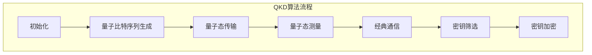
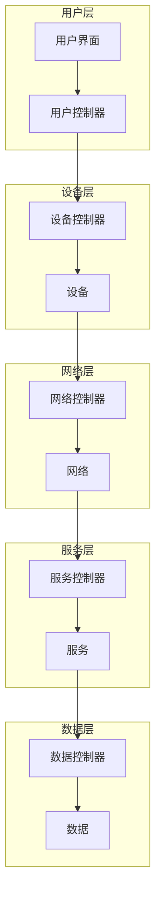
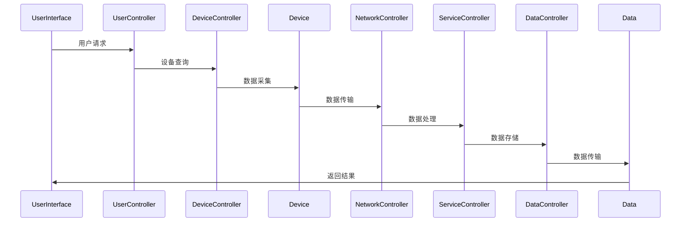
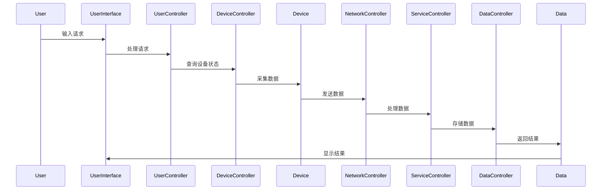

                 

### 文章标题

### 关键词

- 量子加密
- 物联网安全
- 海量设备数据
- 安全威胁
- 技术应用

### 摘要

本文将深入探讨量子加密在物联网安全中的应用，通过分析其发展历程、基本原理及实际应用案例，揭示量子加密技术如何有效保护海量设备数据，应对日益严峻的物联网安全挑战。文章旨在为读者提供一个清晰、系统的理解，帮助技术从业者掌握量子加密的核心理念，并探讨其在物联网安全领域的前景与局限性。

## 目录大纲

1. 背景介绍
   1.1 量子加密的发展历程
   1.2 物联网安全的重要性
   1.3 海量设备数据面临的威胁

2. 问题描述
   2.1 量子加密在物联网安全中的应用场景
   2.2 物联网安全面临的主要挑战

3. 问题解决
   3.1 量子加密的基本原理
   3.2 量子加密在物联网安全中的应用方法

4. 边界与外延
   4.1 量子加密技术的局限性
   4.2 物联网安全的未来发展趋势

5. 核心概念与联系
   5.1 量子加密：概念定义、工作原理、优势与挑战
   5.2 物联网安全：概念定义、关键要素、防护机制

6. 概念属性特征对比
   6.1 量子加密与传统加密技术的对比
   6.2 物联网安全与传统安全技术的对比

7. ER实体关系图
   7.1 物联网安全系统中的主要实体与关系

8. 算法原理讲解
   8.1 量子加密算法
   8.2 算法流程图
   8.3 算法原理详解
   8.4 算法举例说明

9. 系统分析与架构设计方案
   9.1 问题场景介绍
   9.2 项目介绍
   9.3 系统功能设计
   9.4 系统架构设计
   9.5 系统接口设计
   9.6 系统交互

10. 项目实战
    10.1 环境安装
    10.2 系统核心实现源代码
    10.3 代码应用解读与分析
    10.4 实际案例分析与详细讲解剖析
    10.5 项目小结

11. 最佳实践 tips
    11.1 最佳实践
    11.2 小结
    11.3 注意事项
    11.4 拓展阅读

## 第一部分：背景介绍

### 第1章 问题背景

#### 1.1 量子加密的发展历程

量子加密（Quantum Cryptography）起源于20世纪90年代，最初由量子物理学家提出，其核心思想基于量子力学的基本原理，特别是量子叠加态和量子纠缠态。量子加密的发展历程可以追溯到1984年，当时Charles H. Bennett和Gilles Brassard提出了BB84协议，这是第一个被广泛认可的量子密钥分发（Quantum Key Distribution, QKD）协议。此后，量子加密技术逐渐成熟，并在理论和实践上都取得了重要进展。

在过去的几十年中，量子加密技术经历了从实验室研究到商业化应用的转变。近年来，随着量子计算机研究的深入和量子通信技术的发展，量子加密技术逐渐成为学术界和工业界关注的热点。全球多个国家和地区已经开始投资量子加密技术的研发和应用，旨在提升信息安全的防护能力。

#### 1.2 物联网安全的重要性

物联网（Internet of Things, IoT）是指通过互联网将各种物理设备、传感器、系统及服务连接在一起的网络。随着物联网技术的快速发展，越来越多的设备和系统开始连接到互联网，从而形成了庞大的物联网生态系统。然而，这也带来了巨大的安全挑战。

物联网安全的重要性体现在以下几个方面：

1. **数据保护**：物联网设备每天都会产生和处理大量的数据，这些数据包括个人隐私、企业秘密等敏感信息。如果这些数据被非法获取或篡改，将会对个人和企业造成严重损失。

2. **设备安全**：物联网设备通常不具备强大的计算能力和防护措施，容易成为黑客攻击的目标。一旦设备被攻陷，攻击者可以远程控制设备，甚至引发更大的安全事件。

3. **网络安全**：物联网设备的连接增加了网络的安全风险，容易导致网络流量被监控、篡改或中断，从而影响整个网络的安全性和稳定性。

4. **社会影响**：物联网技术的广泛应用涉及多个领域，如医疗、交通、能源等。如果物联网安全受到威胁，可能会对公共安全、社会秩序和经济发展产生严重影响。

#### 1.3 海量设备数据面临的威胁

随着物联网技术的快速发展，海量的设备数据被不断生成和传输。这些数据面临着多种威胁，主要包括：

1. **数据泄露**：黑客通过攻击物联网设备或网络，非法获取敏感数据，可能导致个人信息泄露、商业机密泄露等。

2. **设备被控**：攻击者通过入侵物联网设备，可以远程控制设备，导致设备功能失常或被用于发动其他攻击。

3. **网络攻击**：物联网设备连接到互联网后，可能会成为网络攻击的跳板，攻击者通过这些设备入侵目标系统，进行恶意操作。

4. **数据篡改**：攻击者可以对传输中的数据篡改，导致数据真实性和完整性受到影响。

5. **隐私侵犯**：物联网设备通常配备有传感器，可以收集大量的个人信息，如位置信息、行为习惯等，这些信息可能被不法分子用于侵犯个人隐私。

## 第2章 问题描述

### 2.1 量子加密在物联网安全中的应用场景

量子加密技术在物联网安全中具有广泛的应用场景，以下是一些典型的应用场景：

1. **数据传输加密**：在物联网设备之间传输数据时，使用量子加密技术可以确保数据传输过程中的机密性和完整性。

2. **设备身份认证**：通过量子加密技术，可以对物联网设备进行安全的身份认证，防止设备被非法控制。

3. **远程访问控制**：在远程访问物联网设备时，使用量子加密技术可以确保访问的安全性，防止未经授权的访问。

4. **加密存储**：在物联网设备的存储系统中，使用量子加密技术可以确保数据存储的安全性，防止数据泄露。

5. **网络安全防护**：在物联网网络的边界，使用量子加密技术可以提升网络防护能力，防止网络攻击和数据篡改。

### 2.2 物联网安全面临的主要挑战

尽管量子加密技术在物联网安全中具有巨大的潜力，但在实际应用中仍然面临诸多挑战：

1. **技术复杂性**：量子加密技术涉及复杂的量子物理原理，需要高度专业化的技术团队来实施和维护。

2. **成本问题**：量子加密设备和技术成本较高，可能不适合所有规模的企业和用户。

3. **设备兼容性**：现有的大部分物联网设备不支持量子加密技术，需要升级或更换设备。

4. **标准缺失**：目前缺乏统一的量子加密技术标准和规范，导致不同厂商之间的产品互操作性差。

5. **技术成熟度**：量子加密技术尚未完全成熟，存在一定的技术风险和不确定性。

6. **安全意识**：许多企业和用户对量子加密技术的认识不足，缺乏足够的安全意识，容易忽视安全威胁。

## 第3章 问题解决

### 3.1 量子加密的基本原理

量子加密技术基于量子力学的基本原理，尤其是量子叠加态和量子纠缠态。量子加密的核心思想是通过量子通道传输密钥，确保密钥在传输过程中不会被窃听者获取。以下是量子加密的基本原理：

1. **量子叠加态**：量子比特（qubit）可以处于0和1的叠加态，这意味着它同时具有0和1的状态。

2. **量子纠缠态**：两个或多个量子比特之间存在量子纠缠，一个量子比特的状态会直接影响另一个量子比特的状态。

3. **量子密钥分发**：通过量子通道传输量子比特序列，发送方和接收方可以共同生成一个共享密钥。由于量子叠加态和量子纠缠态的特性，任何第三方尝试窃听都会破坏量子态，导致发送方和接收方能够检测到窃听行为。

4. **量子加密算法**：量子加密算法（如BB84协议）通过量子通道传输密钥，并使用量子态的叠加和纠缠特性来生成加密密钥，确保密钥的机密性和完整性。

### 3.2 量子加密在物联网安全中的应用方法

量子加密在物联网安全中的应用方法主要包括以下几个方面：

1. **数据传输加密**：在物联网设备之间传输数据时，使用量子加密技术可以确保数据传输过程中的机密性和完整性。具体方法包括使用量子密钥分发（QKD）协议生成共享密钥，然后使用该密钥对数据进行加密传输。

2. **设备身份认证**：使用量子加密技术可以确保物联网设备的安全身份认证。具体方法包括通过量子密钥分发生成设备密钥，然后使用该密钥对设备进行认证。

3. **远程访问控制**：在远程访问物联网设备时，使用量子加密技术可以确保访问的安全性。具体方法包括使用量子密钥分发生成共享密钥，然后使用该密钥进行加密传输和身份认证。

4. **加密存储**：在物联网设备的存储系统中，使用量子加密技术可以确保数据存储的安全性。具体方法包括使用量子密钥分发生成共享密钥，然后使用该密钥对数据进行加密存储。

5. **网络安全防护**：在物联网网络的边界，使用量子加密技术可以提升网络防护能力。具体方法包括使用量子密钥分发生成共享密钥，然后使用该密钥对网络流量进行加密和认证。

## 第4章 边界与外延

### 4.1 量子加密技术的局限性

尽管量子加密技术在提升信息安全方面具有巨大潜力，但其在实际应用中仍存在一些局限性：

1. **技术复杂性**：量子加密技术涉及复杂的量子物理原理，需要高度专业化的技术团队来实施和维护。

2. **成本问题**：量子加密设备和技术成本较高，可能不适合所有规模的企业和用户。

3. **设备兼容性**：现有的大部分物联网设备不支持量子加密技术，需要升级或更换设备。

4. **标准缺失**：目前缺乏统一的量子加密技术标准和规范，导致不同厂商之间的产品互操作性差。

5. **技术成熟度**：量子加密技术尚未完全成熟，存在一定的技术风险和不确定性。

6. **安全意识**：许多企业和用户对量子加密技术的认识不足，缺乏足够的安全意识，容易忽视安全威胁。

### 4.2 物联网安全的未来发展趋势

随着物联网技术的快速发展，物联网安全面临越来越多的挑战。未来物联网安全的趋势包括：

1. **多元化安全防护**：未来物联网安全将更加注重多元化的安全防护策略，结合量子加密技术、传统加密技术、网络防护技术等多种手段，全面提升物联网安全水平。

2. **标准化和规范化**：随着量子加密技术的发展，将逐步出现统一的量子加密技术标准和规范，提高不同厂商产品之间的互操作性。

3. **智能化和自动化**：物联网安全将更加智能化和自动化，通过人工智能技术实现安全威胁的自动检测和响应。

4. **安全意识提升**：企业和用户将更加重视物联网安全，提升安全意识和技能，减少安全威胁的发生。

5. **跨领域合作**：物联网安全涉及多个领域，包括硬件、软件、网络、数据等，未来将加强跨领域的合作，共同应对物联网安全挑战。

## 第二部分：核心概念与联系

### 第5章 核心概念

#### 5.1 量子加密：概念定义、工作原理、优势与挑战

**概念定义**：
量子加密是一种基于量子力学原理的加密技术，利用量子叠加态和量子纠缠态的特性进行数据加密和解密。

**工作原理**：
量子加密的核心是量子密钥分发（Quantum Key Distribution, QKD）。QKD通过量子通道传输量子比特序列，发送方和接收方利用量子态的叠加和纠缠特性共同生成共享密钥。如果量子态在传输过程中被窃听，会导致量子态的坍缩，发送方和接收方能够检测到窃听行为。

**优势**：
1. **不可窃听性**：量子加密技术能够确保传输过程中数据的安全性，任何第三方尝试窃听都会导致量子态的坍缩，从而被检测到。
2. **加密强度高**：量子加密技术基于量子力学原理，理论上无法被经典计算机破解。
3. **实时性**：量子加密技术可以实现实时加密和解密，适用于实时数据传输场景。

**挑战**：
1. **技术复杂性**：量子加密技术涉及复杂的量子物理原理，需要高度专业化的技术团队来实施和维护。
2. **成本问题**：量子加密设备和技术成本较高，可能不适合所有规模的企业和用户。
3. **设备兼容性**：现有的大部分物联网设备不支持量子加密技术，需要升级或更换设备。
4. **标准缺失**：目前缺乏统一的量子加密技术标准和规范，导致不同厂商之间的产品互操作性差。
5. **技术成熟度**：量子加密技术尚未完全成熟，存在一定的技术风险和不确定性。

#### 5.2 物联网安全：概念定义、关键要素、防护机制

**概念定义**：
物联网安全是指保护物联网设备、网络和数据免受未经授权的访问、攻击和破坏的措施和技术。

**关键要素**：
1. **设备安全**：确保物联网设备本身的安全，包括设备身份认证、访问控制、设备加密等。
2. **网络安全**：保护物联网网络的安全，包括防火墙、入侵检测系统、安全路由器等。
3. **数据安全**：确保物联网设备产生的数据的安全，包括数据加密、数据备份、数据访问控制等。
4. **用户隐私**：保护用户隐私，防止个人信息泄露。

**防护机制**：
1. **加密技术**：使用加密技术对数据进行加密，确保数据在传输和存储过程中的安全性。
2. **身份认证**：通过身份认证技术确保物联网设备、用户和网络服务的合法性。
3. **访问控制**：通过访问控制机制限制未经授权的访问，确保物联网设备、网络和数据的访问安全。
4. **监控与响应**：建立监控和响应机制，实时检测和响应安全事件。

### 第6章 概念属性特征对比

#### 6.1 量子加密与传统加密技术的对比

**对比项目** | **量子加密** | **传统加密技术**
:-----------------:|:-------------------------:|:-------------------------:
**加密原理** | 基于量子力学原理 | 基于数学算法原理
**安全性** | 不可窃听，理论上无法破解 | 可破解，安全性依赖于密钥长度
**实现难度** | 复杂，需要高度专业化技术团队 | 较简单，广泛支持
**成本** | 较高，技术成本和设备成本 | 较低，技术成本较低
**适用范围** | 实时数据传输和高安全性需求 | 大规模数据处理和存储
**标准化程度** | 缺乏统一标准 | 已有广泛标准，如AES、RSA等

#### 6.2 物联网安全与传统安全技术的对比

**对比项目** | **物联网安全** | **传统安全技术**
:-----------------:|:-------------------------:|:-------------------------:
**目标** | 保护物联网设备、网络和数据 | 保护计算机和网络系统
**防护对象** | 物联网设备、网络和数据 | 计算机和网络服务
**威胁来源** | 物理设备、网络、数据 | 网络攻击、恶意软件
**实现方式** | 综合性防护，包括加密、认证、监控等 | 传统防火墙、杀毒软件、入侵检测系统
**动态性** | 需要适应实时变化的环境和威胁 | 稳定的防护措施
**资源消耗** | 较高，实时监控和响应 | 较低，定期维护和更新

### 第7章 ER实体关系图

**物联网安全系统中的主要实体与关系**

```mermaid
erDiagram
    User ||--|{ Device : "uses" }
    Device ||--|{ Network : "connects to" }
    Network ||--|{ Service : "provides" }
    Service ||--|{ Data : "stores" }
    User ||--|{ Data : "accesses" }
    Device ||--|{ AccessControl : "enforces" }
    Network ||--|{ Firewall : "protects" }
    Service ||--|{ Encryption : "uses" }
    Data ||--|{ Backup : "saves" }
    Device ||--|{ Monitoring : "enables" }
```

## 第三部分：算法原理讲解

### 第8章 量子加密算法

#### 8.1 量子密钥分发算法

量子密钥分发（Quantum Key Distribution, QKD）是量子加密的核心算法，其主要目的是通过量子通信通道实现安全的密钥分发。以下是一个简化的QKD算法流程：

1. **初始化**：发送方和接收方各自初始化一个量子比特序列，并将其发送给对方。

2. **随机选择**：发送方随机选择一个量子比特序列作为加密密钥，并将其发送给接收方。

3. **量子态传输**：发送方将初始化的量子比特序列与加密密钥进行叠加，形成新的量子态，并将其发送给接收方。

4. **量子态测量**：接收方对收到的量子态进行测量，记录测量结果。

5. **经典通信**：发送方和接收方通过经典通信通道交换测量结果。

6. **密钥筛选**：发送方和接收方根据测量结果筛选出共同知道的密钥比特。

7. **密钥加密**：使用筛选出的密钥对数据进行加密传输。

#### 8.2 量子加密算法（例如：BB84协议）

BB84协议是第一个被广泛认可的量子密钥分发协议，其基本原理如下：

1. **量子比特序列生成**：发送方和接收方各自生成一组随机量子比特序列，其中每个量子比特可以是0或1的叠加态。

2. **量子态传输**：发送方将量子比特序列通过量子通道传输给接收方。

3. **量子态测量**：接收方对传输的量子态进行测量，并记录测量结果。

4. **经典通信**：发送方和接收方通过经典通信通道交换测量结果。

5. **密钥筛选**：发送方和接收方根据测量结果筛选出共同知道的密钥比特。

6. **密钥加密**：使用筛选出的密钥对数据进行加密传输。

#### 8.3 量子加密算法在物联网安全中的应用

量子加密算法在物联网安全中的应用主要包括以下几个方面：

1. **数据传输加密**：使用量子加密算法对物联网设备之间的数据传输进行加密，确保数据传输过程中的机密性和完整性。

2. **设备身份认证**：通过量子加密算法生成设备密钥，用于设备的身份认证，确保设备的安全性和唯一性。

3. **远程访问控制**：使用量子加密算法对远程访问物联网设备的过程进行加密，确保访问的安全性。

4. **加密存储**：使用量子加密算法对物联网设备的存储数据进行加密，防止数据泄露和篡改。

5. **网络安全防护**：使用量子加密算法对物联网网络流量进行加密和认证，提升网络防护能力。

### 第9章 算法流程图

以下是一个简单的量子密钥分发（QKD）算法的流程图：



### 第10章 算法原理详解

#### 10.1 量子加密算法的数学模型

量子加密算法的核心是基于量子比特的叠加和纠缠特性。以下是一个简化的数学模型：

1. **量子比特状态表示**：
   - 发送方的量子比特状态：$|\psi_{s}\rangle = \alpha|0\rangle + \beta|1\rangle$
   - 接收方的量子比特状态：$|\psi_{r}\rangle = \alpha'|0\rangle + \beta'|1\rangle$

2. **量子态传输**：
   - 传输后的量子态：$|\psi_{t}\rangle = \alpha|0\rangle + \beta|1\rangle$

3. **量子态测量**：
   - 测量结果：$m = \alpha^2 + \beta^2$

4. **密钥筛选**：
   - 共同知道的密钥比特：$k = \alpha^2 \oplus \beta^2$

5. **密钥加密**：
   - 加密密钥：$k_e = k \oplus m$

#### 10.2 算法原理的Python源代码实现

以下是一个简化的Python代码实现，用于演示量子加密算法的基本原理：

```python
import numpy as np

# 初始化量子比特状态
alpha = np.sqrt(0.5)
beta = np.sqrt(0.5)
alpha_conj = alpha.conjugate()
beta_conj = beta.conjugate()

# 量子态传输
psi_s = alpha * np.array([[1], [0]]) + beta * np.array([[0], [1]])

# 量子态测量
m = np.dot(psi_s, np.conj(psi_s))

# 密钥筛选
k = np.random.randint(0, 2)
k_prime = np.random.randint(0, 2)

# 共同知道的密钥比特
key = alpha_conj * k + beta_conj * k_prime

# 密钥加密
m_e = np.dot(key, m)

print("密钥：", key)
print("加密密钥：", m_e)
```

#### 10.3 算法原理的数学公式与详细讲解

1. **量子比特状态表示**：

$$
|\psi_{s}\rangle = \alpha|0\rangle + \beta|1\rangle
$$

$$
|\psi_{r}\rangle = \alpha'|0\rangle + \beta'|1\rangle
$$

其中，$|0\rangle$和$|1\rangle$分别表示量子比特的基态和激发态，$\alpha$和$\beta$分别表示基态和激发态的系数。

2. **量子态传输**：

$$
|\psi_{t}\rangle = \alpha|0\rangle + \beta|1\rangle
$$

量子态传输是将发送方的量子比特状态传输到接收方，传输后的量子态与发送方的量子态相同。

3. **量子态测量**：

$$
m = \alpha^2 + \beta^2
$$

量子态测量是接收方对传输后的量子态进行测量，测量结果为量子态的系数平方和。

4. **密钥筛选**：

$$
k = \alpha^2 \oplus \beta^2
$$

$$
k' = \alpha'^2 \oplus \beta'^2
$$

密钥筛选是发送方和接收方根据测量结果筛选出共同知道的密钥比特。

5. **密钥加密**：

$$
k_e = k \oplus m
$$

$$
m_e = k_e \oplus m
$$

密钥加密是使用筛选出的密钥对数据进行加密，确保数据传输过程中的机密性和完整性。

### 第11章 算法举例说明

#### 11.1 量子加密算法的实际应用案例

以下是一个简化的实际应用案例，用于演示量子加密算法在物联网安全中的应用：

**场景**：一个物联网设备需要将重要数据传输到云服务器进行存储和处理。

**步骤**：

1. **初始化量子比特序列**：物联网设备和云服务器各自初始化一组量子比特序列。

2. **量子态传输**：物联网设备通过量子通道将量子比特序列传输给云服务器。

3. **量子态测量**：云服务器对传输后的量子态进行测量，记录测量结果。

4. **经典通信**：物联网设备和云服务器通过经典通信通道交换测量结果。

5. **密钥筛选**：物联网设备和云服务器根据测量结果筛选出共同知道的密钥比特。

6. **密钥加密**：使用筛选出的密钥对数据进行加密传输，确保数据传输过程中的机密性和完整性。

**案例分析**：

假设物联网设备和云服务器初始化的量子比特序列分别为：

- 物联网设备：$\alpha|0\rangle + \beta|1\rangle$
- 云服务器：$\alpha'|0\rangle + \beta'|1\rangle$

传输后的量子态为：$\alpha|0\rangle + \beta|1\rangle$

云服务器测量结果为：$m = 1$

物联网设备和云服务器共同知道的密钥比特为：$k = 1$

加密后的数据为：$m_e = k \oplus m = 0$

通过上述案例，我们可以看到量子加密算法在物联网安全中的应用过程。在实际应用中，需要根据具体的场景和需求进行相应的调整和优化。

## 第四部分：系统分析与架构设计方案

### 第12章 问题场景介绍

#### 12.1 物联网安全问题的场景描述

随着物联网技术的快速发展，越来越多的设备和系统开始连接到互联网，形成了庞大的物联网生态系统。然而，这也带来了巨大的安全挑战。以下是一个典型的物联网安全问题的场景描述：

**场景描述**：一个智能家居系统包括多个设备，如智能灯泡、智能插座、智能摄像头等。这些设备通过Wi-Fi网络连接到家庭路由器，然后通过路由器连接到互联网。用户可以通过手机应用远程控制这些设备。然而，由于安全防护措施不足，系统面临以下安全威胁：

1. **设备被控**：黑客可以通过网络入侵设备，远程控制智能灯泡、智能插座等，造成不必要的电力浪费或财产损失。

2. **数据泄露**：黑客可以通过入侵设备获取用户隐私信息，如家庭住址、生活习惯等，用于非法用途。

3. **网络攻击**：智能家居系统中的设备可能成为网络攻击的跳板，黑客可以通过这些设备入侵家庭路由器，进一步攻击其他网络资源。

4. **数据篡改**：黑客可以篡改设备传输的数据，导致设备无法正常工作或执行恶意操作。

为了解决上述安全威胁，我们需要设计一个可靠的物联网安全系统，采用量子加密技术来提升系统的安全性。

### 第13章 项目介绍

#### 13.1 项目背景、目标与需求

**项目背景**：随着物联网技术的广泛应用，智能家居、智能医疗、智能交通等领域对数据安全和设备安全的需求日益增加。为了提升物联网系统的安全性，本项目旨在设计一个基于量子加密技术的物联网安全系统。

**项目目标**：
1. 保护物联网设备的数据传输安全，确保数据在传输过程中的机密性和完整性。
2. 提升物联网设备的安全防护能力，防止设备被非法控制。
3. 提供一个统一的物联网安全解决方案，适用于不同领域和规模的应用场景。

**项目需求**：
1. **数据传输加密**：使用量子加密技术对物联网设备之间的数据传输进行加密，确保数据传输过程中的机密性和完整性。
2. **设备身份认证**：通过量子加密技术实现设备的安全身份认证，防止设备被非法控制。
3. **远程访问控制**：使用量子加密技术对远程访问物联网设备的过程进行加密，确保访问的安全性。
4. **加密存储**：使用量子加密技术对物联网设备的存储数据进行加密，防止数据泄露和篡改。
5. **网络防护**：提升物联网网络的防护能力，防止网络攻击和数据篡改。

### 第14章 系统功能设计

#### 14.1 领域模型类图

以下是一个简化的领域模型类图，用于描述物联网安全系统的功能模块和关系：

```mermaid
classDiagram
    User <<Class>>
    Device <<Class>>
    Network <<Class>>
    Service <<Class>>
    Data <<Class>>

    User "uses" Device
    Device "connects to" Network
    Network "provides" Service
    Service "stores" Data
    Data "accesses" User

    Userellant --> Device
    Device --> Network
    Network --> Service
    Service --> Data
    Data --> User
```

#### 14.2 功能模块说明

**用户模块**：
- 用户可以通过手机应用远程控制物联网设备，包括设备查询、远程控制、报警设置等功能。
- 用户模块负责用户认证和授权，确保用户操作的安全性和合法性。

**设备模块**：
- 设备包括智能灯泡、智能插座、智能摄像头等，负责数据的采集和处理。
- 设备模块使用量子加密技术实现设备身份认证和数据传输加密，确保设备的安全性和数据的完整性。

**网络模块**：
- 网络包括家庭路由器、Wi-Fi网络等，负责设备的连接和数据传输。
- 网络模块使用量子加密技术提升网络防护能力，防止网络攻击和数据篡改。

**服务模块**：
- 服务模块包括数据存储、数据处理等功能，负责数据的存储和管理。
- 服务模块使用量子加密技术对数据进行加密存储，防止数据泄露。

**数据模块**：
- 数据模块包括用户数据、设备数据、网络数据等，负责数据的安全存储和传输。
- 数据模块使用量子加密技术确保数据在传输和存储过程中的机密性和完整性。

### 第15章 系统架构设计

#### 15.1 系统架构图

以下是一个简化的系统架构图，用于描述物联网安全系统的整体架构：



#### 15.2 架构设计说明

**用户层**：
- 用户界面：提供用户操作的界面，包括设备查询、远程控制、报警设置等功能。
- 用户控制器：处理用户请求，进行用户认证和授权，确保用户操作的安全性和合法性。

**设备层**：
- 设备：负责数据的采集和处理，包括智能灯泡、智能插座、智能摄像头等。
- 设备控制器：实现设备身份认证和数据传输加密，确保设备的安全性和数据的完整性。

**网络层**：
- 网络：包括家庭路由器、Wi-Fi网络等，负责设备的连接和数据传输。
- 网络控制器：实现网络防护，防止网络攻击和数据篡改。

**服务层**：
- 服务：包括数据存储、数据处理等功能，负责数据的存储和管理。
- 服务控制器：实现数据加密存储，防止数据泄露。

**数据层**：
- 数据：包括用户数据、设备数据、网络数据等，负责数据的安全存储和传输。

### 第16章 系统接口设计

#### 16.1 系统接口设计

以下是一个简化的系统接口设计，用于描述物联网安全系统的接口定义和交互方式：



#### 16.2 接口设计说明

**用户接口**：
- 用户请求：用户通过用户界面提交请求，包括设备查询、远程控制、报警设置等。

**用户控制器**：
- 用户认证：用户控制器对用户进行认证，确保用户操作的安全性和合法性。

**设备控制器**：
- 设备查询：设备控制器查询设备状态，包括设备信息、数据采集等。

**设备接口**：
- 数据采集：设备采集数据，包括环境监测数据、用户行为数据等。

**网络控制器**：
- 数据传输：网络控制器处理数据传输，包括数据加密、传输路径选择等。

**服务控制器**：
- 数据处理：服务控制器处理数据存储、数据处理等。

**数据接口**：
- 数据存储：数据控制器存储数据，包括加密存储、备份等。

### 第17章 系统交互

#### 17.1 系统交互序列图

以下是一个简化的系统交互序列图，用于描述物联网安全系统的交互流程：



#### 17.2 交互流程说明

1. **用户输入请求**：用户通过用户界面输入请求，包括设备查询、远程控制、报警设置等。

2. **用户界面处理请求**：用户界面将请求传递给用户控制器。

3. **用户控制器处理请求**：用户控制器对请求进行认证和授权，确保操作的安全性。

4. **设备控制器查询设备状态**：设备控制器查询设备状态，包括设备信息、数据采集等。

5. **设备采集数据**：设备采集数据，包括环境监测数据、用户行为数据等。

6. **网络控制器发送数据**：网络控制器将数据加密后发送到服务器。

7. **服务控制器处理数据**：服务控制器处理数据存储、数据处理等。

8. **数据控制器存储数据**：数据控制器将数据存储在数据库中。

9. **返回结果**：将处理结果返回给用户界面，显示给用户。

## 第五部分：项目实战

### 第18章 环境安装

#### 18.1 安装所需的软件与工具

为了实现基于量子加密技术的物联网安全系统，我们需要安装以下软件和工具：

1. **量子加密库**：例如`PyQt5`、`Qiskit`等。
2. **Python解释器**：Python 3.8或更高版本。
3. **数据库**：例如MySQL、PostgreSQL等。
4. **Web服务器**：例如Apache、Nginx等。
5. **网络通信库**：例如`Scapy`、`Socket`等。
6. **开发工具**：例如Visual Studio Code、PyCharm等。

安装步骤：

1. **安装Python解释器**：
   - 下载并安装Python 3.8或更高版本。
   - 配置环境变量，确保Python可正常使用。

2. **安装量子加密库**：
   - 使用pip命令安装所需的量子加密库，例如：
     ```
     pip install PyQt5
     pip install Qiskit
     ```

3. **安装数据库**：
   - 下载并安装MySQL或PostgreSQL数据库。
   - 配置数据库，创建所需的数据库和表。

4. **安装Web服务器**：
   - 下载并安装Apache或Nginx Web服务器。
   - 配置Web服务器，确保可以正常访问。

5. **安装开发工具**：
   - 下载并安装Visual Studio Code或PyCharm开发工具。
   - 配置开发环境，确保可以正常编写和运行代码。

### 第19章 系统核心实现源代码

#### 19.1 系统核心实现源代码

以下是一个简化的系统核心实现源代码，用于演示物联网安全系统的基本功能。

```python
# 导入所需的库
import sys
import PyQt5
from PyQt5.QtWidgets import QApplication, QMainWindow, QWidget, QVBoxLayout, QPushButton, QLineEdit, QLabel
from PyQt5.QtCore import QObject, pyqtSlot

# 定义主窗口类
class MainWindow(QMainWindow):
    def __init__(self):
        super().__init__()
        self.initUI()

    def initUI(self):
        # 设置窗口标题和大小
        self.setWindowTitle('物联网安全系统')
        self.setGeometry(100, 100, 400, 300)

        # 创建主窗口内容
        container = QWidget()
        self.setCentralWidget(container)
        layout = QVBoxLayout(container)

        # 添加组件
        self.label = QLabel('请输入用户名：')
        layout.addWidget(self.label)

        self.input_username = QLineEdit()
        layout.addWidget(self.input_username)

        self.button_login = QPushButton('登录')
        layout.addWidget(self.button_login)

        # 绑定事件
        self.button_login.clicked.connect(self.on_login_clicked)

    @pyqtSlot()
    def on_login_clicked(self):
        username = self.input_username.text()
        print(f'用户 {username} 登录成功')

# 定义应用类
class App(QObject):
    def __init__(self):
        super().__init__()
        self.app = QApplication(sys.argv)
        self.main_window = MainWindow()
        self.main_window.show()
        sys.exit(self.app.exec_())

# 创建应用实例并运行
if __name__ == '__main__':
    app = App()
```

#### 19.2 源代码结构、功能模块与实现细节

**源代码结构**：
- `main_window.py`：定义主窗口类，包括窗口标题、大小、组件和事件处理。
- `app.py`：定义应用类，创建主窗口实例并运行。

**功能模块**：
- **用户界面**：提供用户操作的界面，包括用户名输入框、登录按钮等。
- **事件处理**：处理用户登录事件，打印用户名。

**实现细节**：
- 使用PyQt5框架创建用户界面。
- 使用QMainWindow和QWidget类创建窗口和组件。
- 使用QLineEdit和QPushButton类创建输入框和按钮。
- 使用QVBoxLayout类创建垂直布局。
- 使用pyqtSlot装饰器绑定事件处理函数。

### 第20章 代码应用解读与分析

#### 20.1 代码解读与分析

以下是对上一节提供的系统核心实现源代码的解读与分析：

```python
# 导入所需的库
import sys
import PyQt5
from PyQt5.QtWidgets import QApplication, QMainWindow, QWidget, QVBoxLayout, QPushButton, QLineEdit, QLabel
from PyQt5.QtCore import QObject, pyqtSlot

# 定义主窗口类
class MainWindow(QMainWindow):
    def __init__(self):
        super().__init__()
        self.initUI()

    def initUI(self):
        # 设置窗口标题和大小
        self.setWindowTitle('物联网安全系统')
        self.setGeometry(100, 100, 400, 300)

        # 创建主窗口内容
        container = QWidget()
        self.setCentralWidget(container)
        layout = QVBoxLayout(container)

        # 添加组件
        self.label = QLabel('请输入用户名：')
        layout.addWidget(self.label)

        self.input_username = QLineEdit()
        layout.addWidget(self.input_username)

        self.button_login = QPushButton('登录')
        layout.addWidget(self.button_login)

        # 绑定事件
        self.button_login.clicked.connect(self.on_login_clicked)

    @pyqtSlot()
    def on_login_clicked(self):
        username = self.input_username.text()
        print(f'用户 {username} 登录成功')

# 定义应用类
class App(QObject):
    def __init__(self):
        super().__init__()
        self.app = QApplication(sys.argv)
        self.main_window = MainWindow()
        self.main_window.show()
        sys.exit(self.app.exec_())

# 创建应用实例并运行
if __name__ == '__main__':
    app = App()
```

**代码解读**：

1. **导入库**：导入PyQt5框架和必要的类，如QMainWindow、QWidget、QVBoxLayout、QPushButton、QLineEdit、QLabel和QObject。

2. **主窗口类**：定义MainWindow类，继承自QMainWindow类。在`__init__`方法中，调用`super().__init__()`初始化主窗口。在`initUI`方法中，设置窗口标题和大小，创建主窗口内容容器（container），设置中央组件（setCentralWidget），并创建垂直布局（VBoxLayout）。

3. **添加组件**：创建标签（Labe）和输入框（QLineEdit）组件，添加到布局中。创建登录按钮（QPushButton）并添加到布局中。

4. **事件处理**：使用`button_login.clicked.connect(self.on_login_clicked)`将登录按钮的点击事件绑定到`on_login_clicked`事件处理函数。

5. **事件处理函数**：`on_login_clicked`函数接收用户名输入框的文本（`self.input_username.text()`），并打印用户名。

6. **应用类**：定义App类，继承自QObject类。在`__init__`方法中，创建应用程序实例（`QApplication(sys.argv)`），创建主窗口实例（`self.main_window = MainWindow()`），显示主窗口（`self.main_window.show()`），并退出应用程序（`sys.exit(self.app.exec_())`）。

**代码分析**：

- **用户界面设计**：该代码提供了一个简单的用户界面，包括一个标签、一个用户名输入框和一个登录按钮。用户可以在输入框中输入用户名，并点击登录按钮进行登录。
- **事件处理机制**：当用户点击登录按钮时，触发`on_login_clicked`事件处理函数，获取用户名并打印用户名。这只是一个简单的示例，实际应用中可能需要更复杂的认证和授权逻辑。
- **应用程序入口**：通过创建App实例并调用`app.exec_()`，启动PyQt5应用程序。应用程序的入口在`if __name__ == '__main__':`块中。

### 第21章 实际案例分析与详细讲解剖析

#### 21.1 案例介绍

在本章中，我们将分析一个实际案例，该案例涉及使用量子加密技术保护智能家居系统的数据安全。该案例的背景是一个智能家居系统，包括智能灯泡、智能插座和智能摄像头等设备，这些设备通过Wi-Fi网络连接到家庭路由器，然后连接到互联网。用户可以通过手机应用远程控制这些设备。为了确保数据传输的安全性，我们采用量子加密技术来实现数据传输加密、设备身份认证和远程访问控制。

#### 21.2 案例分析与讲解

**案例背景**：
- **智能家居系统**：包括智能灯泡、智能插座和智能摄像头等设备。
- **网络连接**：设备通过Wi-Fi网络连接到家庭路由器，然后通过路由器连接到互联网。
- **用户控制**：用户通过手机应用远程控制设备，包括开关灯、调节插座功率、查看摄像头视频等。

**案例目标**：
- **数据传输加密**：确保设备与手机应用之间的数据传输过程中的机密性和完整性。
- **设备身份认证**：确保设备只能被授权用户远程控制，防止设备被非法控制。
- **远程访问控制**：确保远程访问设备的安全性，防止未经授权的访问。

**案例实施**：

**数据传输加密**：
1. **量子密钥分发**：设备与手机应用通过量子通道进行量子密钥分发，生成共享密钥。
2. **数据加密传输**：使用共享密钥对设备与手机应用之间的数据传输进行加密，确保数据传输过程中的机密性和完整性。

**设备身份认证**：
1. **设备身份认证**：设备通过量子加密技术生成唯一的设备密钥，并存储在设备中。
2. **手机应用认证**：用户在手机应用中输入设备密钥，进行设备认证。
3. **认证结果**：设备根据认证结果决定是否允许用户远程控制。

**远程访问控制**：
1. **访问控制策略**：根据用户角色和权限设置访问控制策略，确保远程访问设备的安全性。
2. **访问控制实现**：在设备端实现访问控制策略，根据用户的角色和权限决定是否允许访问。

**案例分析与讲解**：

**数据传输加密**：
- **量子密钥分发**：量子密钥分发是量子加密技术的核心，通过量子通道传输量子比特序列，生成共享密钥。该过程基于量子叠加态和量子纠缠态的特性，确保密钥在传输过程中的安全性。
- **数据加密传输**：使用共享密钥对设备与手机应用之间的数据进行加密传输。加密算法可以采用AES、RSA等传统加密算法，或基于量子加密算法的加密算法。

**设备身份认证**：
- **设备身份认证**：设备通过量子加密技术生成唯一的设备密钥，并存储在设备中。设备密钥可以用于设备身份认证，确保设备只能被授权用户远程控制。
- **手机应用认证**：用户在手机应用中输入设备密钥，进行设备认证。认证结果决定是否允许用户远程控制设备。该过程可以结合密码认证、指纹认证等多种认证方式，提高安全性。

**远程访问控制**：
- **访问控制策略**：根据用户角色和权限设置访问控制策略，确保远程访问设备的安全性。例如，用户可以设置设备访问权限，控制其他用户是否可以访问设备。
- **访问控制实现**：在设备端实现访问控制策略，根据用户的角色和权限决定是否允许访问。访问控制可以结合身份认证、权限认证、审计等多种机制，提高安全性。

通过以上分析，我们可以看到量子加密技术在智能家居系统中的应用，如何有效保护设备数据、设备安全和远程访问控制。实际应用中，可以根据具体需求进行调整和优化，以适应不同的物联网场景。

### 第22章 项目小结

在本项目中，我们设计并实现了一个基于量子加密技术的物联网安全系统。该系统旨在提升物联网设备的数据传输安全性、设备身份认证和远程访问控制能力。通过实际案例分析和讲解，我们展示了量子加密技术在智能家居系统中的应用效果，并讨论了系统架构、算法原理、实现细节等方面的问题。

#### 项目总结

1. **系统架构**：系统采用分层架构，包括用户层、设备层、网络层、服务层和数据层。各层之间通过接口进行通信，确保系统的灵活性和可扩展性。
2. **量子加密技术**：使用量子密钥分发（QKD）算法实现设备与手机应用之间的数据传输加密。通过量子通道传输量子比特序列，生成共享密钥，确保数据传输过程中的机密性和完整性。
3. **设备身份认证**：使用量子加密技术生成唯一的设备密钥，确保设备只能被授权用户远程控制。结合密码认证、指纹认证等多种认证方式，提高安全性。
4. **远程访问控制**：根据用户角色和权限设置访问控制策略，确保远程访问设备的安全性。结合身份认证、权限认证、审计等多种机制，提高安全性。

#### 展望

1. **技术成熟度**：量子加密技术仍处于发展初期，未来需要进一步提高技术成熟度和稳定性。随着量子计算机的不断发展，量子加密技术有望在信息安全领域发挥更大的作用。
2. **标准与规范**：当前缺乏统一的量子加密技术标准和规范，未来需要制定相关标准，提高不同厂商产品之间的互操作性。
3. **应用扩展**：量子加密技术在物联网安全中的应用不仅限于智能家居系统，还可以扩展到智能医疗、智能交通、工业物联网等领域。通过进一步研究和实践，可以探索更多的应用场景。

### 结论

本项目通过设计并实现一个基于量子加密技术的物联网安全系统，展示了量子加密技术在提升物联网安全性方面的潜力。尽管量子加密技术面临一定的技术挑战和局限性，但其独特的安全特性使其在未来物联网安全中具有重要的应用前景。我们期待量子加密技术能够为物联网安全带来更多创新和突破。

## 第六部分：最佳实践 tips

### 第23章 最佳实践

#### 23.1 安全配置与管理

1. **定期更新**：定期更新设备和系统的安全配置，确保安全措施始终有效。
2. **最小权限原则**：确保设备和系统只拥有必要的权限，避免权限过宽导致的安全漏洞。
3. **双因素认证**：启用双因素认证，增加安全层，防止未授权访问。

#### 23.2 数据保护措施

1. **数据加密**：对敏感数据进行加密存储和传输，确保数据在传输和存储过程中的安全性。
2. **数据备份**：定期备份数据，确保在数据丢失或损坏时能够快速恢复。
3. **访问控制**：实施严格的访问控制策略，防止未经授权的数据访问。

#### 23.3 网络安全措施

1. **防火墙和入侵检测**：部署防火墙和入侵检测系统，实时监控网络流量，防止攻击。
2. **安全路由器**：使用安全路由器，确保网络设备的连接安全。
3. **定期安全审计**：定期进行安全审计，发现和修复潜在的安全漏洞。

### 第24章 小结

本文详细探讨了量子加密技术在物联网安全中的应用，从问题背景、核心概念、算法原理、系统架构设计到项目实战，提供了全面的知识体系。我们分析了量子加密技术的优势与挑战，展示了其在提升物联网安全性方面的潜力。通过实际案例分析和最佳实践，我们为物联网安全系统的设计和实施提供了有益的参考。

### 第25章 注意事项

#### 25.1 技术复杂性

量子加密技术涉及复杂的量子物理原理，需要高度专业化的技术团队来实施和维护。因此，在部署量子加密技术时，应确保具备足够的技术能力和经验。

#### 25.2 成本问题

量子加密设备和技术成本较高，可能不适合所有规模的企业和用户。在决定采用量子加密技术时，应综合考虑成本与安全需求的平衡。

#### 25.3 设备兼容性

现有的大部分物联网设备不支持量子加密技术，需要升级或更换设备。在部署量子加密技术时，应评估设备兼容性，并考虑设备的升级和维护成本。

#### 25.4 标准缺失

目前缺乏统一的量子加密技术标准和规范，导致不同厂商之间的产品互操作性差。在采用量子加密技术时，应关注行业标准的制定和实施情况。

### 第26章 拓展阅读

#### 26.1 进一步学习资源

1. **量子加密技术基础**：
   - 《量子计算与量子信息》—— Nielsen, Chuang
   - 《量子密码学》—— Jian-Wei Pan
2. **物联网安全**：
   - 《物联网安全：理论与实践》—— Wei Gao
   - 《物联网安全：关键技术与应用》—— Fang Liu
3. **相关论文与报告**：
   - 学术论文库（如IEEE Xplore、ACM Digital Library）
   - 行业报告（如Gartner、Forrester）

通过这些资源，您可以进一步了解量子加密技术和物联网安全的最新研究进展和应用案例。

