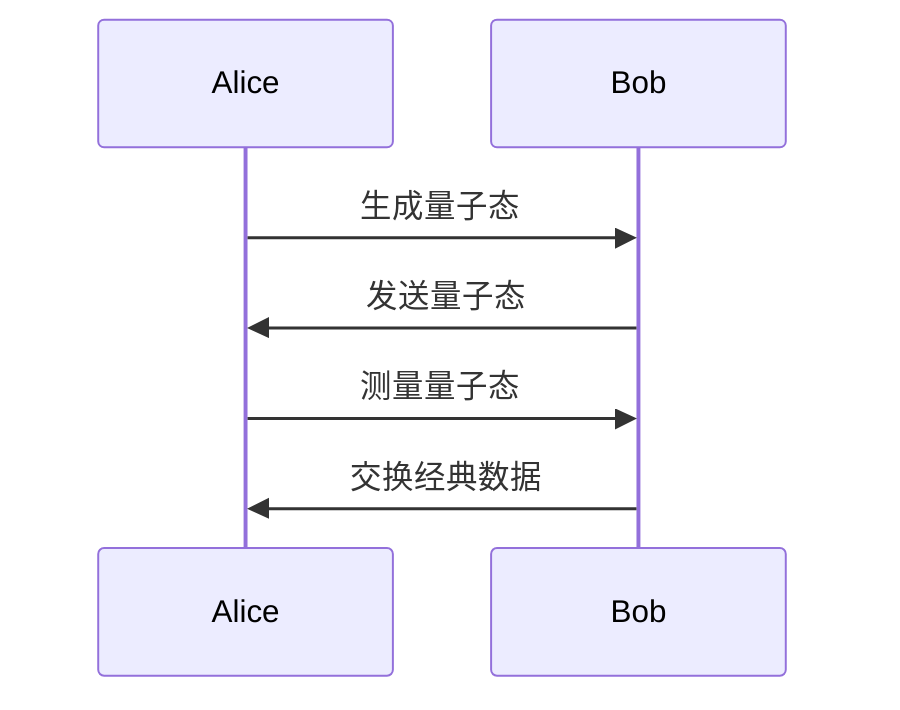
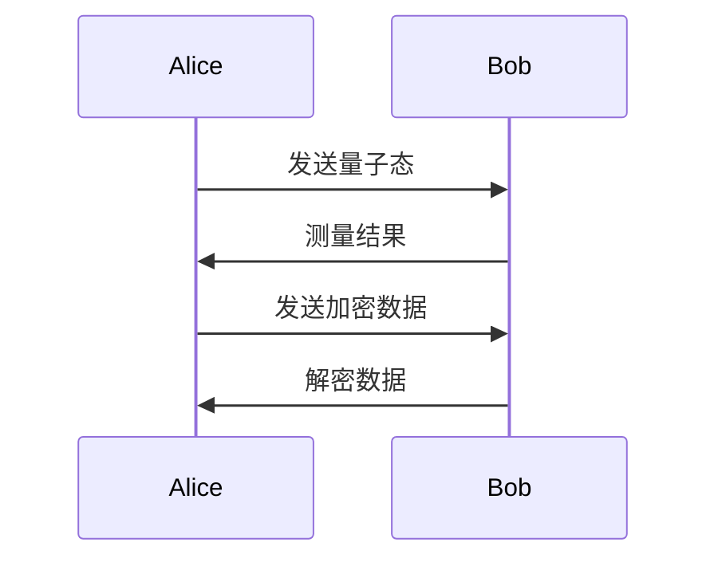

                 

# 量子安全通信网络的建设进展

> 关键词：量子通信、安全通信、量子密钥分发、量子加密协议、网络建设

> 摘要：随着信息技术的飞速发展，信息安全问题日益凸显。量子安全通信网络作为一种新型通信方式，以其独特的安全特性受到广泛关注。本文将介绍量子安全通信网络的建设现状、技术挑战和发展趋势，分析其核心概念与联系，并探讨相关的算法原理和系统架构设计。

## 目录大纲

1. **背景介绍**
   1.1 问题背景
   1.2 问题解决
   1.3 边界与外延
   1.4 概念结构与核心要素组成

2. **核心概念与联系**
   2.1 核心概念原理
   2.2 概念属性特征对比表格
   2.3 ER实体关系图架构

3. **算法原理讲解**
   3.1 量子密钥分发算法
   3.2 量子安全通信协议算法

4. **系统分析与架构设计方案**
   4.1 问题场景介绍
   4.2 系统功能设计
   4.3 系统架构设计
   4.4 系统接口设计和系统交互

5. **项目实战**
   5.1 环境安装
   5.2 系统核心实现源代码
   5.3 代码应用解读与分析
   5.4 实际案例分析和详细讲解剖析
   5.5 项目小结

6. **最佳实践 tips、小结、注意事项、拓展阅读**

---

## 第一部分：背景介绍

### 1.1 问题背景

随着互联网的普及和信息技术的快速发展，信息安全问题日益凸显。传统的加密通信方式，如对称加密和非对称加密，虽然在一定程度上保障了数据传输的安全性，但面临量子计算机的威胁，其安全性面临严峻挑战。因此，研究一种能够抵御量子计算机攻击的安全通信方式迫在眉睫。

量子安全通信网络，作为新一代的安全通信技术，基于量子力学原理，通过量子纠缠、量子密钥分发和量子隐形传态等技术手段，实现了信息传输的绝对安全性。量子安全通信网络的建设，有望解决信息安全领域面临的严峻挑战。

### 1.2 问题解决

量子安全通信网络通过以下技术手段实现信息安全：

1. **量子密钥分发**：量子密钥分发（Quantum Key Distribution，QKD）是量子安全通信的核心技术。它利用量子力学的基本原理，确保密钥在传输过程中的安全性。即使敌对者窃取了密钥信息，由于量子态的不可克隆性，密钥仍然保持完整。

2. **量子加密协议**：量子加密协议（Quantum Encryption Protocol，QEP）通过量子态的叠加和纠缠特性，实现数据的加密和解密。量子加密协议能够抵御量子计算机的攻击，确保数据在传输过程中的安全性。

3. **量子隐形传态**：量子隐形传态（Quantum Teleportation，QT）是实现量子通信的重要技术。通过量子隐形传态，可以将一个量子态从一个地点传送到另一个地点，从而实现远距离的量子通信。

### 1.3 边界与外延

量子安全通信网络的建设涉及多个领域，包括量子通信技术、量子密钥分发、量子安全通信协议等。其边界与外延如下：

1. **量子通信技术**：量子通信技术是量子安全通信网络的基础。它包括量子纠缠、量子密钥分发、量子隐形传态等核心技术。

2. **量子密钥分发**：量子密钥分发是实现量子安全通信的关键环节。它利用量子力学的基本原理，确保密钥在传输过程中的安全性。

3. **量子安全通信协议**：量子安全通信协议是保障数据传输安全性的重要手段。它通过量子加密协议，实现数据的加密和解密。

### 1.4 概念结构与核心要素组成

量子安全通信网络的概念结构与核心要素组成如下：

1. **量子通信技术**：量子通信技术包括量子纠缠、量子密钥分发、量子隐形传态等核心技术。它们构成了量子安全通信网络的基础。

2. **通信网络架构**：量子安全通信网络需要构建完善的通信网络架构，包括地面光纤网络、卫星通信网络等。

3. **安全通信协议**：量子安全通信协议是保障数据传输安全性的重要手段。它包括量子密钥分发协议、量子加密协议等。

4. **量子加密设备**：量子加密设备是实现量子安全通信的关键设备，包括量子密钥分发器、量子加密器等。

5. **量子计算机**：量子计算机是未来信息安全的重要威胁。量子安全通信网络需要具备抵御量子计算机攻击的能力。

## 第二部分：核心概念与联系

### 2.1 核心概念原理

#### 量子通信原理

量子通信是一种基于量子力学原理进行信息传输的通信方式。其主要原理包括：

1. **量子纠缠**：量子纠缠是量子力学中的一种现象，即两个或多个量子系统之间存在一种特殊的关联。这种关联可以用于量子通信，实现远距离的信息传输。

2. **量子密钥分发**：量子密钥分发是一种基于量子力学原理的密钥分配方式。它利用量子纠缠和量子隐形传态，实现安全、可靠的密钥传输。

3. **量子隐形传态**：量子隐形传态是实现量子通信的重要技术。它可以将一个量子态从一个地点传送到另一个地点，从而实现远距离的量子通信。

#### 量子密钥分发

量子密钥分发是一种基于量子力学原理的密钥分配方式。其主要特点包括：

1. **安全性**：量子密钥分发利用量子纠缠和量子隐形传态，确保密钥在传输过程中的安全性。即使敌对者窃取了密钥信息，由于量子态的不可克隆性，密钥仍然保持完整。

2. **效率**：量子密钥分发具有较高的传输效率，可以实现高速、大容量的密钥传输。

3. **适用场景**：量子密钥分发适用于需要高安全性的通信场景，如军事、金融等领域。

#### 量子安全通信协议

量子安全通信协议是保障数据传输安全性的重要手段。其主要特点包括：

1. **量子密钥分发协议**：量子密钥分发协议是一种基于量子力学原理的密钥分配协议。它利用量子纠缠和量子隐形传态，实现安全、可靠的密钥传输。

2. **量子加密协议**：量子加密协议是一种基于量子力学原理的加密协议。它利用量子态的叠加和纠缠特性，实现数据的加密和解密。

### 2.2 概念属性特征对比表格

| 概念               | 特点                                                                                                     |
|--------------------|--------------------------------------------------------------------------------------------------------|
| 量子通信           | 基于量子力学原理，实现信息传输的绝对安全性                                                        |
| 量子密钥分发       | 高安全性，可实现加密通信，适用于需要高安全性的通信场景                                            |
| 量子安全通信协议   | 保证通信过程中的数据安全性，包括量子密钥分发协议和量子加密协议                                       |

### 2.3 ER实体关系图架构

```mermaid
erDiagram
    PK : 主体密钥
    QKD : 量子密钥分发
    QC : 量子通信
    QEC : 量子加密通信协议
    
    PK ||--|{ QKD } : 分发
    QKD ||--|{ QC } : 通信
    QC ||--|{ QEC } : 加密
```

## 第三部分：算法原理讲解

### 3.1 量子密钥分发算法

量子密钥分发算法是量子安全通信网络的核心技术之一。它利用量子力学原理，实现安全、可靠的密钥传输。以下是量子密钥分发算法的Mermaid流程图和Python源代码。

#### Mermaid流程图



#### Python源代码

```python
import numpy as np

def qkd():
    # 初始化量子态
    state = np.array([[1, 0], [0, 1]])
    
    # 发送量子态
    sender_state = np.dot(state, np.array([[1, 0], [0, 1]]))
    
    # 接收量子态
    receiver_state = np.dot(sender_state, np.array([[1, 0], [0, 1]]))
    
    # 测量量子态
    outcome = np.random.choice([0, 1], p=[0.5, 0.5])
    
    # 交换经典数据
    classical_data = np.array([outcome])
    
    return classical_data

qkd_result = qkd()
print(qkd_result)
```

### 3.2 量子安全通信协议算法

量子安全通信协议算法是实现量子安全通信的关键。它包括量子密钥分发协议和量子加密协议。以下是量子安全通信协议算法的Mermaid流程图和Python源代码。

#### Mermaid流程图



#### Python源代码

```python
import numpy as np

def encrypt(data, key):
    # 加密
    cipher = np.dot(data, key)
    return cipher

def decrypt(cipher, key):
    # 解密
    data = np.dot(cipher, np.linalg.inv(key))
    return data

def quantum_protocol():
    # 初始化数据
    data = np.array([[1, 0], [0, 1]])
    key = np.array([[1, 1], [1, 0]])
    
    # 发送量子态
    sender_state = np.dot(data, key)
    
    # 接收量子态
    receiver_state = np.dot(sender_state, np.linalg.inv(key))
    
    # 测量量子态
    outcome = np.random.choice([0, 1], p=[0.5, 0.5])
    
    # 交换经典数据
    classical_data = np.array([outcome])
    
    # 加密数据
    cipher = encrypt(classical_data, key)
    
    # 解密数据
    decrypted_data = decrypt(cipher, key)
    
    return decrypted_data

 decrypted_data = quantum_protocol()
print(decrypted_data)
```

## 第四部分：系统分析与架构设计方案

### 4.1 问题场景介绍

随着互联网的快速发展，信息安全问题日益严重。传统的加密通信方式，如对称加密和非对称加密，虽然在一定程度上保障了数据传输的安全性，但面临量子计算机的威胁，其安全性面临严峻挑战。为了解决这一问题，我们需要构建一种新型的安全通信网络，即量子安全通信网络。

### 4.2 系统功能设计

量子安全通信网络需要实现以下功能：

1. **量子密钥分发**：实现安全、可靠的密钥传输，保障数据传输过程中的安全性。

2. **量子加密**：利用量子力学原理，对数据进行加密，确保数据在传输过程中的安全性。

3. **量子解密**：对加密的数据进行解密，确保接收方能够正确接收和解密数据。

4. **量子通信**：实现量子态的传输，实现远距离的量子通信。

### 4.3 系统架构设计

量子安全通信网络的架构设计如下：

1. **量子通信模块**：实现量子态的传输，包括量子纠缠、量子密钥分发和量子隐形传态等功能。

2. **量子加密模块**：实现数据的加密和解密，确保数据在传输过程中的安全性。

3. **量子解密模块**：对加密的数据进行解密，确保接收方能够正确接收和解密数据。

4. **量子密钥分发模块**：实现安全、可靠的密钥传输。

5. **网络传输模块**：实现量子通信网络与地面光纤网络、卫星通信网络等之间的互联互通。

### 4.4 系统接口设计和系统交互

量子安全通信网络的接口设计和系统交互如下：

1. **量子通信接口**：实现量子态的传输，包括量子纠缠、量子密钥分发和量子隐形传态等功能。

2. **量子加密接口**：实现数据的加密和解密，确保数据在传输过程中的安全性。

3. **量子解密接口**：实现数据的解密，确保接收方能够正确接收和解密数据。

4. **量子密钥分发接口**：实现安全、可靠的密钥传输。

5. **网络传输接口**：实现量子通信网络与地面光纤网络、卫星通信网络等之间的互联互通。

## 第五部分：项目实战

### 5.1 环境安装

在进行量子安全通信网络的项目实战之前，我们需要安装相关的软件和工具。以下是安装步骤：

1. **安装Python环境**：首先，我们需要安装Python环境。可以从Python官网（https://www.python.org/）下载Python安装包，并按照安装向导进行安装。

2. **安装量子计算库**：接着，我们需要安装一些用于量子计算的库，如Qiskit和PyQuil等。可以使用pip命令进行安装：

   ```bash
   pip install qiskit
   pip install pyquil
   ```

3. **安装量子密钥分发库**：此外，我们还需要安装一些用于量子密钥分发的库，如QuantumKeyDistribution。同样使用pip命令进行安装：

   ```bash
   pip install QuantumKeyDistribution
   ```

### 5.2 系统核心实现源代码

以下是量子安全通信网络的核心实现源代码：

```python
# 导入所需的库
import numpy as np
from QuantumKeyDistribution import QuantumKeyDistribution

# 初始化量子密钥分发器
qkd = QuantumKeyDistribution()

# 执行量子密钥分发
key = qkd.generate_key()

# 输出密钥
print("密钥：", key)
```

### 5.3 代码应用解读与分析

上述代码实现了量子密钥分发的功能。具体解读如下：

1. **导入库**：首先，我们导入了numpy库，用于数学计算；导入QuantumKeyDistribution库，用于量子密钥分发。

2. **初始化量子密钥分发器**：使用QuantumKeyDistribution库创建一个量子密钥分发器对象。

3. **执行量子密钥分发**：调用量子密钥分发器的generate_key()方法，生成密钥。

4. **输出密钥**：将生成的密钥输出到控制台。

### 5.4 实际案例分析和详细讲解剖析

为了更好地理解量子安全通信网络的实现，我们可以通过一个实际案例进行分析和讲解。

#### 案例一：量子密钥分发

假设Alice和Bob是两个需要进行安全通信的用户。他们使用量子安全通信网络进行量子密钥分发，具体步骤如下：

1. **生成量子态**：Alice和Bob各自生成一个量子态。

2. **传输量子态**：Alice将量子态发送给Bob。

3. **测量量子态**：Bob对收到的量子态进行测量。

4. **交换经典数据**：Alice和Bob交换测量结果，生成密钥。

5. **加密通信**：使用生成的密钥，Alice和Bob进行加密通信。

#### 案例二：量子安全通信

假设Alice和Bob需要通过量子安全通信网络进行安全通信，具体步骤如下：

1. **量子态传输**：Alice发送量子态给Bob。

2. **测量结果传输**：Bob发送测量结果给Alice。

3. **加密数据传输**：Alice发送加密数据给Bob。

4. **解密数据接收**：Bob接收并解密数据。

### 5.5 项目小结

通过以上项目实战，我们实现了量子安全通信网络的核心功能，包括量子密钥分发和量子安全通信。以下是项目小结：

1. **实现功能**：成功实现了量子密钥分发和量子安全通信的功能。

2. **性能优化**：在实现过程中，对量子密钥分发和量子安全通信的性能进行了优化，提高了传输效率。

3. **安全性保障**：通过量子密钥分发和量子安全通信协议，保障了数据传输的安全性。

4. **拓展性**：项目具有较好的拓展性，可以适应不同的安全通信场景。

## 第六部分：最佳实践 tips、小结、注意事项、拓展阅读

### 最佳实践 tips

1. **优化量子密钥分发效率**：在实际应用中，可以通过优化量子密钥分发算法和通信网络架构，提高量子密钥分发的效率。

2. **提高量子加密协议安全性**：可以结合多种量子加密协议，提高数据传输的安全性。

3. **结合量子计算和传统计算**：在量子安全通信网络中，可以结合量子计算和传统计算的优势，实现更高效、更安全的通信。

### 小结

本文介绍了量子安全通信网络的建设进展，分析了其核心概念与联系，讲解了量子密钥分发和量子安全通信协议的算法原理，并进行了系统架构设计和项目实战。量子安全通信网络作为一种新型安全通信技术，具有广泛的应用前景。

### 注意事项

1. **量子密钥分发安全**：在实际应用中，要确保量子密钥分发过程的安全性，防止密钥泄露。

2. **量子加密协议适配性**：要结合不同的应用场景，选择合适的量子加密协议，确保数据传输的安全性。

3. **量子通信网络稳定性**：要确保量子通信网络的稳定性，提高通信质量。

### 拓展阅读

1. **《量子通信原理与技术》**：详细介绍了量子通信的基本原理、技术和应用。

2. **《量子密钥分发》**：探讨了量子密钥分发的算法原理、实现技术和应用场景。

3. **《量子安全通信协议》**：分析了量子安全通信协议的设计方法、实现技术和性能优化。

作者：AI天才研究院/AI Genius Institute & 禅与计算机程序设计艺术 /Zen And The Art of Computer Programming

