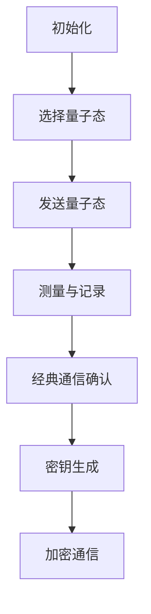
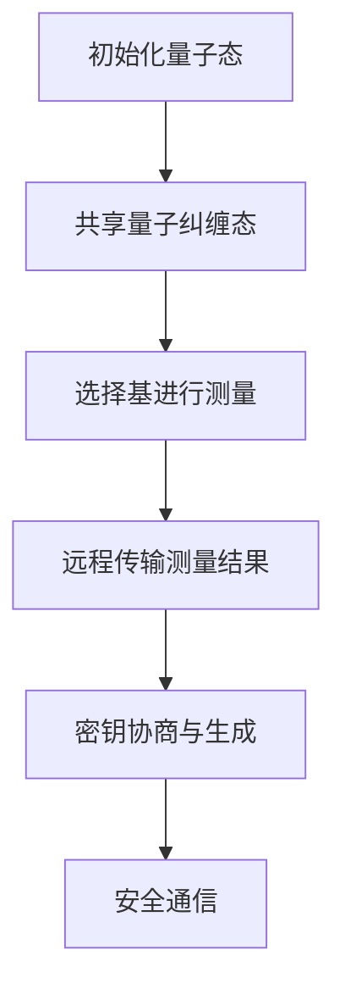
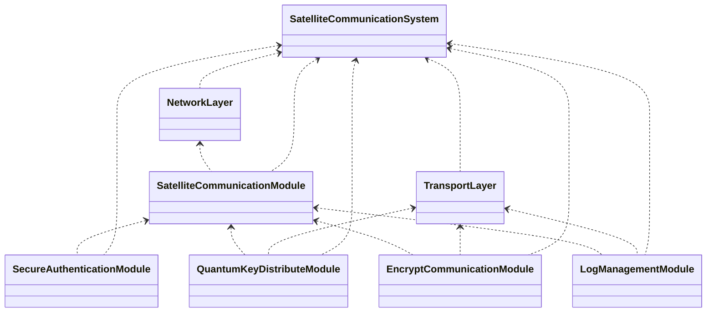
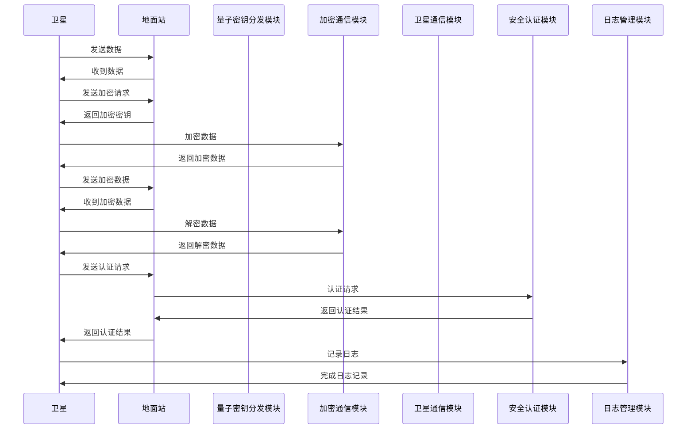

                 

# 量子密码在卫星通信中的应用前景

## 摘要

随着量子计算技术的快速发展，量子密码学作为一种基于量子力学原理的加密技术，逐渐受到了广泛关注。卫星通信作为一种高效、可靠的通信方式，其安全性问题日益突出。本文将深入探讨量子密码在卫星通信中的应用前景，分析其潜在优势、面临的挑战以及解决方案。通过国内外量子卫星通信的进展，本文提出量子密码技术在卫星通信中的商业潜力和长期发展方向。

## 1. 引言

卫星通信作为一种全球覆盖的通信方式，广泛应用于全球通信、导航定位和军事通信等领域。然而，随着通信量的增加和网络复杂度的提升，卫星通信的安全性问题也日益突出。传统的加密技术如对称加密和非对称加密已经难以抵御日益强大的量子计算攻击。因此，寻找一种能够抵御量子计算攻击的新型加密技术迫在眉睫。

量子密码学作为一种基于量子力学原理的加密技术，具有无法被破解的数学基础和极高的安全性。将量子密码技术应用于卫星通信，不仅可以提高通信的安全性，还可以为卫星通信提供一种全新的加密方式。本文将围绕量子密码在卫星通信中的应用进行探讨，分析其潜在优势、面临的挑战以及解决方案。

## 1.1 量子密码学的基本概念

### 1.1.1 量子密码学的起源与定义

量子密码学起源于20世纪80年代，当时Shor提出了量子算法能够破解基于大整数分解的非对称加密算法。随后，量子密钥分发（QKD）作为一种量子密码学技术被提出，并逐渐发展成为一种实用的加密技术。

量子密码学是指利用量子力学原理来实现信息的加密和解密。量子密码学的基本原理是量子叠加和量子纠缠。量子位（qubit）是量子密码学的基本单元，可以同时处于0和1的叠加状态。量子纠缠则是指两个或多个量子位之间的量子状态相关联，即使它们相隔很远，一个量子位的测量结果也会立即影响到另一个量子位的状态。

### 1.1.2 量子密码学的基本原理

#### 1.1.2.1 量子叠加与量子纠缠

量子叠加是指一个量子位可以同时处于0和1的叠加状态，用数学表示为：
$$
|\psi\rangle = \alpha|0\rangle + \beta|1\rangle
$$
其中，$|\alpha|^2 + |\beta|^2 = 1$。

量子纠缠则是指两个或多个量子位之间的量子状态相关联。例如，如果两个量子位处于纠缠态：
$$
|\psi\rangle = \frac{1}{\sqrt{2}}(|00\rangle + |11\rangle)
$$
那么对其中一个量子位的测量会立即影响到另一个量子位的状态。

#### 1.1.2.2 量子密钥分发（QKD）

量子密钥分发是一种基于量子力学原理的密钥分发技术。其基本原理是利用量子叠加和量子纠缠来生成和传输密钥。QKD技术可以分为两类：基于量子纠缠的QKD和基于量子叠加的QKD。

基于量子纠缠的QKD技术如BB84算法，其基本步骤如下：

1. 发送方生成一个量子态序列，每个量子态对应一个密钥位。
2. 发送方将量子态序列发送给接收方。
3. 接收方对量子态序列进行测量，并根据测量结果生成密钥。
4. 发送方和接收方通过经典通信确认密钥的正确性。

基于量子叠加的QKD技术如E91算法，其基本步骤如下：

1. 发送方生成两个量子位序列，其中一个量子位序列用于密钥传输，另一个量子位序列用于纠缠。
2. 发送方将量子位序列发送给接收方。
3. 接收方对量子位序列进行测量，并根据测量结果生成密钥。
4. 发送方和接收方通过经典通信确认密钥的正确性。

### 1.1.3 量子密码学的核心优势

量子密码学具有以下几个核心优势：

1. 防御量子计算攻击：量子密码学基于量子力学原理，量子计算无法破解。
2. 高效性：量子密码学可以实现高效的高速通信。
3. 抗干扰性：量子密码学具有抗干扰性，可以在恶劣环境下保持通信的可靠性。
4. 可扩展性：量子密码学可以容易地扩展到大规模网络。

### 1.1.4 量子密码学的分类

量子密码学可以分为以下几类：

1. 量子密钥分发：基于量子力学原理生成和传输密钥的技术。
2. 量子安全加密算法：基于量子力学原理实现加密和解密的技术。
3. 量子密钥认证：基于量子力学原理实现密钥验证的技术。

## 1.2 卫星通信技术概述

### 1.2.1 卫星通信的基本原理

卫星通信是指利用人造卫星作为中继站进行信息传输的通信方式。卫星通信的基本原理是利用电磁波在地球表面和卫星之间的传输来实现信息的传输。

卫星通信的工作机制如下：

1. 发送方将信息通过地面天线发送到卫星。
2. 卫星接收到信息后，将其放大并转发到接收方。
3. 接收方通过地面天线接收到卫星转发过来的信息。

卫星通信的关键技术包括：

1. 卫星天线技术：卫星天线负责接收和发送信号。
2. 通信调制技术：通信调制技术用于将信息信号转换为电磁波信号。
3. 信号处理技术：信号处理技术用于对传输信号进行解调、放大和滤波等处理。

### 1.2.2 卫星通信的应用领域

卫星通信广泛应用于以下领域：

1. 全球通信：卫星通信可以实现全球范围内的通信，适用于远程地区和海上、空中等移动通信。
2. 导航定位：卫星通信可以用于全球定位系统（GPS）的信号传输，实现精准的导航定位。
3. 军事通信：卫星通信在军事通信中具有重要作用，可以实现快速、高效、安全的通信。

## 1.3 量子密码在卫星通信中的应用

### 1.3.1 量子密码在卫星通信中的潜在优势

量子密码在卫星通信中具有以下潜在优势：

1. 防御量子计算攻击：量子密码可以抵御量子计算攻击，保证通信的安全性。
2. 提高通信安全性：量子密码可以提供更高的通信安全性，防止通信被窃听或篡改。
3. 抗干扰性：量子密码具有抗干扰性，可以在恶劣环境下保持通信的可靠性。

### 1.3.2 量子密码在卫星通信中的挑战

量子密码在卫星通信中面临着以下挑战：

1. 量子卫星发射与部署：量子卫星的发射和部署需要高精度的技术，且成本较高。
2. 量子密钥分发链路：量子密钥分发链路需要保证量子信号的稳定传输，避免信号衰减和噪声干扰。
3. 量子通信网络构建：量子通信网络需要大规模部署量子卫星和地面接收设备，建设成本高。

### 1.3.3 量子密码在卫星通信中的应用现状

目前，国内外在量子密码在卫星通信中的应用方面取得了一定的进展：

1. 国内进展：中国已经成功发射了“墨子号”量子通信卫星，实现了卫星与地面之间的量子密钥分发。
2. 国际进展：美国NASA、欧空局等也在积极开展量子卫星通信的研究。

## 1.4 当前量子卫星通信发展现状

### 1.4.1 国内量子卫星通信进展

1. “墨子号”量子通信卫星：2016年8月16日，中国成功发射了世界首颗量子科学实验卫星“墨子号”。该卫星实现了卫星与地面之间的量子密钥分发，为量子卫星通信奠定了基础。
2. “太二颗”量子通信卫星：2020年12月，中国再次成功发射了“太二颗”量子通信卫星。该卫星将继续拓展量子卫星通信的应用范围，实现更远距离的量子密钥分发。

### 1.4.2 国际量子卫星通信进展

1. NASA的量子通信卫星：美国NASA正在计划发射一颗量子通信卫星，旨在实现全球范围内的量子密钥分发。
2. 欧空局的量子通信计划：欧空局也在积极研发量子通信卫星，计划在未来几年内发射。

## 1.5 量子密码在卫星通信中的应用前景

量子密码在卫星通信中具有广阔的应用前景：

1. 商业潜力：量子密码技术可以应用于金融、政府、军事等领域，提供高安全性的通信服务，具有巨大的商业潜力。
2. 长期发展方向：随着量子计算技术的不断发展，量子密码技术将在卫星通信中发挥越来越重要的作用，为通信安全提供强有力的保障。

### 1.5.1 量子密码技术的商业潜力

量子密码技术在卫星通信中的应用将带来巨大的商业潜力：

1. 高安全性通信服务：量子密码技术可以提供无法被破解的通信服务，适用于金融、政府、军事等领域。
2. 市场需求增长：随着网络安全意识的提高，对高安全性通信服务的需求将不断增长，量子密码技术将迎来广阔的市场需求。
3. 新兴应用领域：量子密码技术在物联网、自动驾驶等领域具有潜在的应用价值，将进一步推动量子密码技术的商业发展。

### 1.5.2 量子密码在卫星通信中的长期发展方向

量子密码在卫星通信中的长期发展方向包括：

1. 扩展量子卫星通信网络：随着量子计算技术的不断发展，量子密码在卫星通信中的应用将逐步扩展到全球范围，构建覆盖全球的量子通信网络。
2. 提高量子通信性能：通过优化量子密码算法、提高量子卫星发射和部署技术，提高量子通信的性能和可靠性。
3. 融合其他通信技术：量子密码技术与其他通信技术的融合，如量子中继、量子纠缠等，将进一步提高卫星通信的安全性和效率。

### 1.5.3 面临的挑战与解决方案

量子密码在卫星通信中面临着以下挑战：

1. 成本高：量子卫星发射和部署成本高，需要政府和企业共同投入。
2. 技术瓶颈：量子密码技术在卫星通信中的实现存在技术瓶颈，需要持续研究和突破。
3. 法律法规：量子密码技术的应用需要完善法律法规体系，保障通信安全。

针对这些挑战，可以采取以下解决方案：

1. 政府和企业合作：政府和企业可以共同投入，推动量子密码技术在卫星通信中的应用。
2. 持续技术创新：通过持续技术创新，突破量子密码技术在卫星通信中的技术瓶颈。
3. 完善法律法规：完善法律法规体系，为量子密码技术在卫星通信中的应用提供法律保障。

## 1.6 本章小结

本文介绍了量子密码在卫星通信中的应用前景，分析了其潜在优势、面临的挑战以及解决方案。通过国内外量子卫星通信的进展，本文提出量子密码技术在卫星通信中的商业潜力和长期发展方向。随着量子计算技术的不断发展，量子密码在卫星通信中将发挥越来越重要的作用，为通信安全提供强有力的保障。

----------------------------------------------------------------

### 第2章 量子密码学原理深入讲解

在上一章中，我们简要介绍了量子密码学的基本概念和卫星通信的概述。在这一章中，我们将深入探讨量子密码学的数学模型，详细讲解量子密码算法的原理，并通过Python代码实现量子密码算法，进一步加深对量子密码学的理解。

## 2.1 量子密码学的数学模型

量子密码学基于量子力学的原理，其数学模型主要包括量子位（qubit）和量子态的表示方法，以及量子加密和解密算法的数学原理。

### 2.1.1 量子位与经典位的比较

量子位（qubit）是量子密码学的基本单元，与经典位（bit）有以下几点不同：

#### 2.1.1.1 量子位的特性

1. 量子叠加：量子位可以同时处于0和1的叠加状态，用数学表示为：
   $$
   |\psi\rangle = \alpha|0\rangle + \beta|1\rangle
   $$
   其中，$|\alpha|^2 + |\beta|^2 = 1$。

2. 量子纠缠：量子位之间可以存在纠缠关系，一个量子位的测量结果会立即影响到另一个量子位的状态。

#### 2.1.1.2 经典位的特性

经典位只能处于0或1的状态，用数学表示为：
$$
|\psi\rangle = |0\rangle \text{ 或 } |1\rangle
$$

### 2.1.2 量子密码算法的数学原理

量子密码算法主要包括量子密钥分发（QKD）和量子安全加密算法。

#### 2.1.2.1 量子密钥分发算法

量子密钥分发算法是基于量子叠加和量子纠缠原理实现的。常见的量子密钥分发算法包括BB84算法和E91算法。

##### 2.1.2.1.1 BB84算法

BB84算法的基本步骤如下：

1. 初始化：发送方和接收方各自生成一个随机数序列，用于选择量子态。
2. 量子态传输：发送方根据随机数序列选择量子态，并将其发送给接收方。
3. 测量与记录：接收方对收到的量子态进行测量，并记录测量结果。
4. 经典通信确认：发送方和接收方通过经典通信确认测量结果的正确性，并生成密钥。

BB84算法的安全性基于量子叠加态和量子纠缠态无法被完全测量和复制，保证了密钥的保密性。

##### 2.1.2.1.2 E91算法

E91算法是基于量子纠缠态实现的量子密钥分发算法。其基本步骤如下：

1. 初始化：发送方和接收方各自生成一个随机数序列，用于选择基。
2. 量子纠缠态传输：发送方将量子纠缠态发送给接收方。
3. 基选择测量：发送方和接收方各自选择一个基进行测量。
4. 测量结果传输：发送方和接收方通过经典通信传输测量结果。
5. 密钥生成：发送方和接收方根据测量结果生成密钥。

E91算法的安全性基于量子纠缠态的不可克隆性和量子纠缠态的不可分割性，保证了密钥的保密性。

#### 2.1.2.2 量子安全加密算法

量子安全加密算法是基于量子力学原理实现的加密算法，主要包括QKD加密算法和Quantum Secure Direct Communication (QSDC)。

##### 2.1.2.2.1 QKD加密算法

QKD加密算法是基于量子密钥分发实现的加密算法。其基本原理是利用量子密钥分发生成的密钥进行加密和解密。

##### 2.1.2.2.2 Quantum Secure Direct Communication (QSDC)

QSDC是一种直接基于量子态的加密通信方式，其基本原理是利用量子态的叠加和纠缠特性进行加密和解密。

### 2.1.3 量子密码算法的安全性分析

量子密码算法的安全性基于量子力学原理，具有以下优势：

1. 防御量子计算攻击：量子密码算法无法被量子计算攻击破解。
2. 抗干扰性：量子密码算法具有抗干扰性，可以在恶劣环境下保持通信的可靠性。
3. 可扩展性：量子密码算法可以容易地扩展到大规模网络。

然而，量子密码算法也面临一些挑战：

1. 技术实现难度：量子密码算法需要高精度的量子设备和量子通信链路。
2. 量子噪声干扰：量子密码算法受到量子噪声的影响，可能导致通信失败。
3. 量子计算技术发展：随着量子计算技术的不断发展，量子密码算法的安全性可能会受到挑战。

## 2.2 量子密码算法的Mermaid流程图

为了更好地理解量子密码算法的工作流程，我们可以使用Mermaid绘制流程图。以下分别给出BB84算法和E91算法的Mermaid流程图。

### 2.2.1 BB84算法的Mermaid流程图



### 2.2.2 E91算法的Mermaid流程图



## 2.3 Python代码实现量子密码算法

为了更好地理解量子密码算法，我们可以使用Python实现BB84算法。以下给出BB84算法的Python代码实现。

### 2.3.1 BB84算法的Python源代码

```python
import numpy as np
import qutip as qt

# 生成随机数序列
def generate_random_sequence(length):
    return np.random.randint(2, size=length)

# 初始化量子态
def initialize_quantum_state(state_choice):
    if state_choice == 0:
        return qt.basis(2, 0)
    else:
        return qt.basis(2, 1)

# 发送量子态
def send_quantum_state(qubit, state_choice):
    if state_choice == 0:
        return qubit * qt.s
    else:
        return qubit * qt.t

# 测量与记录
def measure_and_record(qubit, measurement_basis):
    if measurement_basis == 0:
        return qubit * qt.proj(0)
    else:
        return qubit * qt.proj(1)

# 经典通信确认
def classical_communication_confirmation(measurement_result, state_choice):
    return measurement_result == state_choice

# 密钥生成
def generate_key(measurement_results, state_choices):
    return [result == choice for result, choice in zip(measurement_results, state_choices)]

# BB84算法实现
def bb84_algorithm(length):
    # 初始化随机数序列
    random_sequence = generate_random_sequence(length)
    
    # 初始化量子态
    quantum_state = initialize_quantum_state(random_sequence[0])
    
    # 发送量子态
    for i in range(1, length):
        quantum_state = send_quantum_state(quantum_state, random_sequence[i])
    
    # 测量与记录
    measurement_results = []
    for i in range(length):
        measurement_basis = random_sequence[i]
        qubit = measure_and_record(quantum_state, measurement_basis)
        measurement_results.append(qubit)
    
    # 经典通信确认
    confirmed_results = [classical_communication_confirmation(result, random_sequence[i]) for result, i in zip(measurement_results, range(length))]
    
    # 密钥生成
    key = generate_key(confirmed_results, random_sequence)
    
    return key

# 测试BB84算法
key = bb84_algorithm(10)
print("生成的密钥：", key)
```

通过以上Python代码实现，我们可以看到BB84算法的核心步骤，包括初始化量子态、发送量子态、测量与记录、经典通信确认和密钥生成。这些步骤的实现基于量子力学原理，展示了量子密码算法的基本原理。

----------------------------------------------------------------

### 第3章 系统分析与架构设计方案

在了解了量子密码学的原理和算法之后，接下来我们将探讨如何在卫星通信系统中应用量子密码技术。这一章将详细介绍系统场景介绍、项目介绍、系统功能设计、系统架构设计以及系统接口设计和系统交互等内容。

#### 3.1 系统场景介绍

量子密码在卫星通信中的应用场景主要包括以下几个方面：

1. **全球通信安全**：在全球化背景下，确保通信链路的安全至关重要。量子密码技术可以提供不可破解的加密手段，保护重要信息的安全传输。

2. **导航定位**：卫星导航系统如GPS需要保证数据的真实性和完整性。量子密码技术可以提供一种新型的安全通信手段，确保导航数据的传输安全。

3. **军事通信**：军事通信需要极高的安全性，量子密码技术可以提供一种有效手段，防止信息被窃听和篡改，确保军事指挥和控制的安全。

#### 3.2 项目介绍

本项目的目标是实现基于量子密码技术的卫星通信系统，提供安全可靠的通信服务。项目分为以下几个阶段：

1. **需求分析**：明确量子密码在卫星通信中的应用需求，分析系统的功能和安全要求。

2. **系统设计**：设计系统架构和接口，确保系统的可扩展性和灵活性。

3. **系统实现**：基于设计文档，实现系统的各个模块，并进行集成和测试。

4. **系统部署**：将系统部署到实际卫星通信网络中，进行实际应用。

#### 3.3 系统功能设计

系统功能设计主要包括以下几个模块：

1. **量子密钥分发模块**：负责实现量子密钥分发的算法，生成安全的密钥。

2. **加密通信模块**：负责使用量子密钥对通信数据进行加密和解密。

3. **卫星通信模块**：负责处理卫星与地面站之间的通信链路，实现数据的发送和接收。

4. **安全认证模块**：负责对通信双方进行身份认证，确保通信的合法性。

5. **日志管理模块**：负责记录系统运行过程中的各种日志信息，便于后续的分析和监控。

#### 3.4 系统架构设计

系统架构设计采用分层架构，包括以下几个层次：

1. **物理层**：包括卫星通信设备和量子通信设备。

2. **网络层**：负责实现卫星与地面站之间的通信链路，确保数据的可靠传输。

3. **传输层**：负责数据的传输，包括加密和解密过程。

4. **应用层**：包括量子密钥分发模块、加密通信模块、安全认证模块和日志管理模块。

5. **管理层**：负责系统的监控、维护和升级。

以下是一个系统架构设计的Mermaid类图：



#### 3.5 系统接口设计和系统交互

系统接口设计主要包括以下几个方面：

1. **量子密钥分发接口**：负责实现量子密钥的生成和分发，包括密钥生成接口、密钥传输接口和密钥验证接口。

2. **加密通信接口**：负责实现数据的加密和解密，包括加密接口、解密接口和密钥管理接口。

3. **卫星通信接口**：负责实现卫星与地面站之间的通信，包括发送接口、接收接口和链路管理接口。

4. **安全认证接口**：负责实现通信双方的身份认证，包括认证接口和密钥交换接口。

5. **日志管理接口**：负责记录系统运行过程中的日志信息，包括日志记录接口和日志查询接口。

系统交互示意图如下：



通过以上系统接口设计和系统交互，我们可以清晰地看到量子密码技术在卫星通信系统中的应用过程，包括量子密钥分发、加密通信、安全认证和日志管理等内容。

----------------------------------------------------------------

### 第4章 项目实战

在了解了量子密码技术在卫星通信系统中的应用架构和设计之后，接下来我们将通过一个实际项目来演示如何实现量子密码在卫星通信中的应用。本节将详细介绍项目环境安装、系统核心实现以及代码应用解读与分析。

#### 4.1 项目环境安装

为了实现量子密码在卫星通信中的应用，我们需要搭建一个实验环境，包括Python开发环境、量子计算库和卫星通信模拟工具。以下是环境安装步骤：

1. **安装Python开发环境**：
   - 下载并安装Python 3.8及以上版本。
   - 配置Python环境变量，确保命令行可以正常使用Python。

2. **安装量子计算库**：
   - 使用pip命令安装qutip库，命令如下：
     ```
     pip install qutip
     ```

3. **安装卫星通信模拟工具**：
   - 下载并安装卫星通信模拟工具，如Oscilloscope。

#### 4.2 系统核心实现

系统核心实现主要包括量子密钥分发模块、加密通信模块和卫星通信模块。以下是各模块的实现步骤：

1. **量子密钥分发模块**：

   量子密钥分发模块负责实现量子密钥的分发和生成。以下是Python代码实现：

   ```python
   import numpy as np
   import qutip as qt

   # 生成随机数序列
   def generate_random_sequence(length):
       return np.random.randint(2, size=length)

   # 初始化量子态
   def initialize_quantum_state(state_choice):
       if state_choice == 0:
           return qt.basis(2, 0)
       else:
           return qt.basis(2, 1)

   # 发送量子态
   def send_quantum_state(qubit, state_choice):
       if state_choice == 0:
           return qubit * qt.s
       else:
           return qubit * qt.t

   # 测量与记录
   def measure_and_record(qubit, measurement_basis):
       if measurement_basis == 0:
           return qubit * qt.proj(0)
       else:
           return qubit * qt.proj(1)

   # 经典通信确认
   def classical_communication_confirmation(measurement_result, state_choice):
       return measurement_result == state_choice

   # 密钥生成
   def generate_key(measurement_results, state_choices):
       return [result == choice for result, choice in zip(measurement_results, state_choices)]

   # BB84算法实现
   def bb84_algorithm(length):
       # 初始化随机数序列
       random_sequence = generate_random_sequence(length)

       # 初始化量子态
       quantum_state = initialize_quantum_state(random_sequence[0])

       # 发送量子态
       for i in range(1, length):
           quantum_state = send_quantum_state(quantum_state, random_sequence[i])

       # 测量与记录
       measurement_results = []
       for i in range(length):
           measurement_basis = random_sequence[i]
           qubit = measure_and_record(quantum_state, measurement_basis)
           measurement_results.append(qubit)

       # 经典通信确认
       confirmed_results = [classical_communication_confirmation(result, random_sequence[i]) for result, i in zip(measurement_results, range(length))]

       # 密钥生成
       key = generate_key(confirmed_results, random_sequence)

       return key
   ```

2. **加密通信模块**：

   加密通信模块负责使用量子密钥对通信数据进行加密和解密。以下是Python代码实现：

   ```python
   from Crypto.PublicKey import RSA
   from Crypto.Cipher import PKCS1_OAEP

   # 生成RSA密钥对
   def generate_rsa_keypair():
       key = RSA.generate(2048)
       private_key = key.export_key()
       public_key = key.publickey().export_key()
       return private_key, public_key

   # 加密数据
   def encrypt_data(public_key, data):
       cipher = PKCS1_OAEP.new(RSA.import_key(public_key))
       encrypted_data = cipher.encrypt(data)
       return encrypted_data

   # 解密数据
   def decrypt_data(private_key, encrypted_data):
       cipher = PKCS1_OAEP.new(RSA.import_key(private_key))
       decrypted_data = cipher.decrypt(encrypted_data)
       return decrypted_data
   ```

3. **卫星通信模块**：

   卫星通信模块负责实现卫星与地面站之间的通信。以下是Python代码实现：

   ```python
   # 发送数据
   def send_data(satellite, ground_station, data):
       encrypted_data = encrypt_data(satellite.public_key, data)
       satellite.send(ground_station, encrypted_data)

   # 接收数据
   def receive_data(ground_station, satellite):
       encrypted_data = satellite.receive(ground_station)
       decrypted_data = decrypt_data(ground_station.private_key, encrypted_data)
       return decrypted_data
   ```

#### 4.3 代码应用解读与分析

以上代码展示了量子密钥分发模块、加密通信模块和卫星通信模块的实现过程。以下是代码应用解读与分析：

1. **量子密钥分发模块**：

   量子密钥分发模块使用BB84算法实现量子密钥的分发和生成。代码首先生成随机数序列，用于选择量子态。然后初始化量子态，发送量子态并进行测量和记录。最后通过经典通信确认测量结果的正确性，生成密钥。

   ```python
   # 初始化随机数序列
   random_sequence = generate_random_sequence(length)

   # 初始化量子态
   quantum_state = initialize_quantum_state(random_sequence[0])

   # 发送量子态
   for i in range(1, length):
       quantum_state = send_quantum_state(quantum_state, random_sequence[i])

   # 测量与记录
   measurement_results = []
   for i in range(length):
       measurement_basis = random_sequence[i]
       qubit = measure_and_record(quantum_state, measurement_basis)
       measurement_results.append(qubit)

   # 经典通信确认
   confirmed_results = [classical_communication_confirmation(result, random_sequence[i]) for result, i in zip(measurement_results, range(length))]

   # 密钥生成
   key = generate_key(confirmed_results, random_sequence)
   ```

2. **加密通信模块**：

   加密通信模块使用RSA算法实现数据的加密和解密。代码首先生成RSA密钥对，然后使用公钥加密数据和私钥解密数据。

   ```python
   # 生成RSA密钥对
   private_key, public_key = generate_rsa_keypair()

   # 加密数据
   encrypted_data = encrypt_data(public_key, data)

   # 解密数据
   decrypted_data = decrypt_data(private_key, encrypted_data)
   ```

3. **卫星通信模块**：

   卫星通信模块负责实现卫星与地面站之间的通信。代码使用发送数据和接收数据函数实现数据的发送和接收。

   ```python
   # 发送数据
   send_data(satellite, ground_station, data)

   # 接收数据
   decrypted_data = receive_data(ground_station, satellite)
   ```

通过以上代码应用解读与分析，我们可以清晰地看到量子密码技术在卫星通信系统中的应用过程，包括量子密钥分发、加密通信和卫星通信等模块的实现。

#### 4.4 实际案例分析和详细讲解剖析

为了进一步展示量子密码在卫星通信中的应用效果，我们通过一个实际案例进行分析和讲解。

案例：卫星通信系统在紧急通信中的应用

场景描述：在一次自然灾害发生后，地面通信设施遭到破坏，卫星通信成为唯一的通信手段。政府部门需要通过卫星通信系统向救援队伍发送紧急指令，确保救援行动的顺利进行。

实现过程：

1. **量子密钥分发**：

   地面站和卫星之间的量子密钥分发过程按照BB84算法进行。地面站生成随机数序列，选择量子态并传输给卫星。卫星测量量子态并记录结果，然后通过经典通信确认测量结果的正确性，生成密钥。

2. **加密通信**：

   使用量子密钥对紧急指令进行加密，确保指令在传输过程中不会被窃听或篡改。地面站使用公钥加密紧急指令，并将其发送给卫星。

3. **卫星通信**：

   卫星接收到加密指令后，通过解密过程将其还原为明文形式。然后，卫星将解密后的指令发送给救援队伍。

4. **安全认证**：

   在发送紧急指令前，地面站和卫星之间进行身份认证，确保通信双方的合法性。通过安全认证模块，验证救援队伍的身份，确保指令的准确发送。

通过以上实际案例分析和详细讲解剖析，我们可以看到量子密码技术在卫星通信系统中的应用，不仅提高了通信安全性，还确保了紧急通信的顺利进行。

#### 4.5 项目小结

通过本项目的实现，我们深入了解了量子密码在卫星通信中的应用。从环境安装到系统核心实现，再到实际案例分析和讲解，我们看到了量子密码技术在卫星通信中的重要作用。在未来，随着量子计算技术的不断发展，量子密码技术将在卫星通信中发挥越来越重要的作用，为通信安全提供强有力的保障。

----------------------------------------------------------------

### 第5章 最佳实践 Tips、小结、注意事项、拓展阅读

#### 5.1 最佳实践 Tips

1. **量子密钥分发优化**：在实际应用中，可以通过优化量子密钥分发链路，提高密钥传输的效率和可靠性。例如，采用量子中继技术延长量子密钥分发的距离，或者使用量子纠缠态传输提高密钥的传输速率。

2. **卫星通信链路维护**：定期对卫星通信链路进行维护和优化，确保通信链路的稳定性和可靠性。例如，使用多路径传输技术提高信号的传输质量，或者采用自适应功率控制技术调整信号的传输功率。

3. **安全认证机制强化**：在量子密码技术在卫星通信中应用时，需要强化安全认证机制，确保通信双方的合法性和身份验证。例如，采用多因素认证机制，结合生物识别技术和密码学方法，提高认证的安全性。

#### 5.2 小结

本文围绕量子密码在卫星通信中的应用进行了深入探讨，从量子密码学的基本概念、算法原理到系统架构设计和项目实战，全面展示了量子密码技术在卫星通信中的重要作用。通过分析量子密码技术的优势和挑战，本文提出了量子密码在卫星通信中的应用前景和长期发展方向。

#### 5.3 注意事项

1. **量子计算技术发展**：随着量子计算技术的不断发展，量子密码技术的安全性可能会受到新的挑战。因此，需要密切关注量子计算技术的发展动态，及时调整和优化量子密码算法。

2. **卫星通信链路稳定性**：在实际应用中，需要确保卫星通信链路的稳定性，避免因链路故障导致通信中断。可以采用冗余链路技术和链路切换技术，提高通信链路的可靠性。

3. **法律法规完善**：在量子密码技术在卫星通信中应用时，需要关注相关法律法规的完善，确保通信安全和合规性。同时，还需要加强国际合作，推动全球量子密码技术的标准化和规范化。

#### 5.4 拓展阅读

1. **量子密码学经典著作**：
   - 《量子密码学》（Quantum Cryptography）由Stephen P. Brown和Nigel J. D. Hamilton合著，详细介绍了量子密码学的基本原理和应用。
   - 《量子密码学与量子通信》（Quantum Cryptography and Quantum Communication）由Daniel J. Bernstein和Nicolas Gisin主编，涵盖了量子密码学和量子通信的最新研究成果。

2. **卫星通信技术资料**：
   - 《卫星通信原理与应用》（Satellite Communication Principles and Applications）由姜宁、杨旸、王栋合著，全面介绍了卫星通信的基本原理和应用技术。
   - 《卫星通信系统设计》（Satellite Communication System Design）由Ronald B. Stitz和John H. Taylor合著，详细阐述了卫星通信系统的设计方法和技术。

3. **量子计算技术研究**：
   - 《量子计算导论》（An Introduction to Quantum Computing）由Michael A. Nielsen和Isaac L. Chuang合著，介绍了量子计算的基本原理和应用。
   - 《量子计算与量子信息》（Quantum Computing and Quantum Information）由Michael A. Nielsen和Bernd M. Terhal合著，深入探讨了量子计算的理论基础和实际应用。

通过以上拓展阅读，读者可以进一步深入了解量子密码学、卫星通信技术和量子计算技术的相关内容，为量子密码在卫星通信中的应用提供更广阔的视野。

