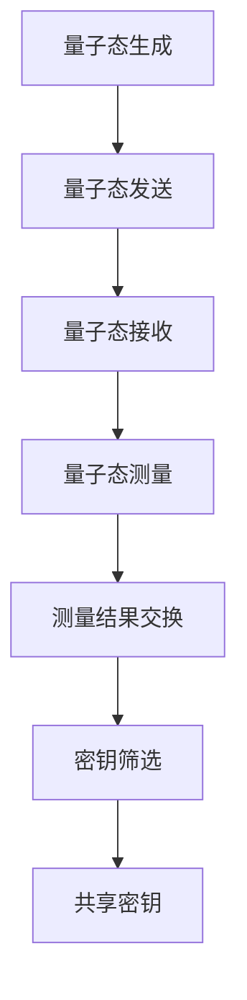

                 


## 量子密钥分发技术的商业化前景

### 关键词：
- 量子密钥分发（QKD）
- 商业化前景
- 信息安全
- 加密技术
- 应用场景
- 系统架构
- 项目实战

### 摘要：
本文将深入探讨量子密钥分发（QKD）技术的商业化前景，分析其核心原理、算法机制，并通过实际案例展示其在信息安全领域的应用。我们将逐步分析QKD技术在全球信息安全市场中的地位，讨论其商业化的挑战与机遇，并总结QKD技术的未来发展趋势。

### 目录大纲设计思路

#### 第一部分: 引言

1. **量子密钥分发（QKD）技术概述**
   - 引入QKD技术的基本概念。
   - 描述QKD技术在全球信息安全领域的地位和重要性。
   - 指出QKD技术商业化进程的现状与挑战。

2. **背景概念与核心原理**
   - 详细介绍QKD技术的原理和机制。
   - 分析QKD技术与其他加密技术的关系。
   - 提供QKD技术的属性特征对比表格。

3. **QKD技术的应用场景**
   - 政府与国防安全
   - 金融与商业信息安全
   - 网络通信安全

4. **QKD系统的架构设计**
   - 介绍QKD系统的组成。
   - 描述QKD系统的架构设计原则。
   - 详细说明QKD系统的接口设计与实现。

5. **本章小结**
   - 总结QKD技术的现状与未来发展方向。

#### 第二部分: 量子密钥分发技术原理讲解

1. **QKD算法原理**
   - 使用Mermaid绘制QKD算法的流程图。
   - 使用Python源代码详细阐述QKD算法。
   - 阐述QKD算法的数学模型和公式。
   - 举例说明QKD算法的应用。

2. **QKD系统分析**
   - 介绍QKD技术的应用场景。
   - 描述一个具体的QKD项目案例。
   - 设计QKD系统的领域模型、系统架构和接口设计。

3. **QKD技术的数学模型和数学公式讲解**
   - 对比量子比特与经典比特的属性特征。
   - 详细讲解QKD技术的数学模型和公式。

4. **本章小结**
   - 总结QKD技术的原理和特点。

#### 第三部分: 量子密钥分发项目实战

1. **环境安装指南**
   - 硬件环境要求。
   - 软件环境安装步骤。

2. **系统核心实现源代码展示**
   - 展示QKD核心算法的实现代码。
   - 分析代码的应用解读。

3. **实际案例分析和详细讲解**
   - 分析实际QKD项目案例。
   - 详细讲解项目实现过程。

4. **本章小结**
   - 总结QKD项目的实战经验。

#### 第四部分: 最佳实践、小结、注意事项、拓展阅读

1. **最佳实践 tips**
   - 提供实施QKD技术的最佳实践建议。

2. **本章小结**
   - 总结QKD技术的商业化和实际应用情况。

3. **注意事项**
   - 指出QKD技术实施过程中的潜在风险和注意事项。

4. **拓展阅读**
   - 推荐进一步学习和研究的资料。

### 第一部分：引言

#### 1.1 量子密钥分发（QKD）技术概述

#### 1.1.1 QKD技术的定义与历史背景

量子密钥分发（Quantum Key Distribution, QKD）是一种利用量子力学原理来保证密钥传输安全性的加密技术。QKD最早由Stephen Wiesner提出，他称之为“量子货币”（Quantum Money），后来由Charles H. Bennett和Gilles Brassard在1979年进一步发展，并命名为QKD。

QKD技术的基本原理是基于量子力学的“不确定原理”和“量子纠缠现象”。在QKD过程中，发送方（Alice）和接收方（Bob）通过量子通信信道进行量子态的传输。如果量子态在传输过程中被窃听，则会发生量子态的坍缩，从而使得窃听行为被探测到。

#### 1.1.2 QKD技术的重要性

随着信息技术和互联网的快速发展，信息安全问题日益突出。传统的加密技术已经无法满足日益增长的安全需求。QKD技术的出现为信息安全领域带来了新的解决方案。QKD技术具有以下几个重要特点：

1. **无条件安全性**：QKD技术基于量子力学的原理，可以实现无条件的安全通信，即使面对最强大的量子计算机也无法破解。

2. **实时监控**：QKD技术可以实时监测通信过程中的窃听行为，确保通信过程的安全性。

3. **密钥共享**：QKD技术可以实现在不同地点的用户之间共享密钥，用于加密和解密通信内容。

#### 1.1.3 QKD技术的商业化进程现状与挑战

虽然QKD技术具有巨大的潜力，但其在商业化进程方面仍然面临一些挑战：

1. **成本问题**：QKD设备的研发和部署成本较高，需要投入大量的资金和资源。

2. **技术成熟度**：QKD技术仍在不断发展中，尚未达到大规模商业应用的水平。

3. **市场认知**：尽管QKD技术在信息安全领域具有重要地位，但市场对其认知度较低，推广难度较大。

然而，随着量子技术的不断进步和市场需求增长，QKD技术的商业化前景仍然值得期待。

#### 1.2 背景概念与核心原理

##### 1.2.1 量子力学基础

量子力学是研究微观粒子运动和相互作用的物理学分支。在量子力学中，一些传统物理学中的定律不再适用，量子态、量子纠缠等现象成为研究对象。

1. **量子态**：量子态是量子系统在某个基底下的一组可观测物理量的可能取值。量子态具有叠加性，可以同时处于多个状态的线性组合。

2. **量子纠缠**：当两个或多个量子系统相互耦合时，它们之间会形成量子纠缠。量子纠缠使得量子系统中的粒子之间具有强烈的相互依赖关系，即使它们相隔很远，一个粒子的状态变化也会立即影响到另一个粒子的状态。

##### 1.2.2 QKD技术的核心原理

QKD技术利用量子态和量子纠缠现象来实现密钥的分发。下面是QKD技术的核心原理：

1. **量子态传输**：在QKD过程中，发送方（Alice）生成一对量子纠缠态，并将其中的一个量子态发送给接收方（Bob）。由于量子态的叠加性和纠缠性，即使量子态在传输过程中被窃听，也会导致量子态的坍缩，从而被发送方和接收方检测到。

2. **量子密钥生成**：接收方（Bob）在接收到量子态后，测量其量子态并记录结果。发送方（Alice）也测量其保留的量子态，并根据测量结果生成密钥。如果两个测量结果相同，则说明密钥生成成功。

3. **量子密钥验证**：在密钥生成后，发送方和接收方通过经典通信信道对密钥进行验证。如果验证结果一致，则认为密钥是安全的。

##### 1.2.3 QKD技术与其他加密技术的比较

与传统的加密技术相比，QKD技术具有显著的优势：

1. **安全性**：QKD技术基于量子力学原理，实现无条件的安全通信。而传统的加密技术依赖于计算复杂度，随着计算能力的提升，其安全性逐渐降低。

2. **实时监控**：QKD技术可以实时监测通信过程中的窃听行为，而传统的加密技术无法做到这一点。

3. **密钥共享**：QKD技术可以实现在不同地点的用户之间共享密钥，而传统的加密技术通常只能在同一地点的用户之间共享密钥。

然而，QKD技术也存在一些局限性，例如成本较高、技术成熟度较低等。因此，在实际应用中，QKD技术通常与传统加密技术相结合，以实现更高级别的信息安全保障。

#### 1.3 QKD技术的应用场景

QKD技术具有广泛的应用场景，以下是一些典型的应用场景：

1. **政府与国防安全**：政府机构和军事部门对信息安全要求极高，QKD技术可以提供无条件的安全通信保障。

2. **金融与商业信息安全**：金融机构和商业企业对信息安全的重视程度不断提高，QKD技术可以用于保障金融交易和商业信息的保密性。

3. **网络通信安全**：随着网络通信的普及，网络信息安全问题日益突出。QKD技术可以用于保障网络通信的安全，防止数据泄露和窃听。

#### 1.4 QKD系统的架构设计

QKD系统通常包括以下几个主要组成部分：

1. **量子通信信道**：量子通信信道用于传输量子态，通常采用光纤或自由空间信道。

2. **量子密钥生成模块**：量子密钥生成模块负责生成和传输密钥。

3. **量子密钥验证模块**：量子密钥验证模块负责验证密钥的安全性。

4. **经典通信信道**：经典通信信道用于发送和接收经典通信信号，如密钥、测量结果等。

QKD系统的架构设计原则包括：

1. **安全性**：系统设计应确保量子密钥分发的安全性，防止窃听和攻击。

2. **可靠性**：系统设计应确保量子通信信道的可靠传输，降低错误率和中断率。

3. **灵活性**：系统设计应具备良好的扩展性，以适应不同应用场景的需求。

#### 1.5 本章小结

本章对量子密钥分发（QKD）技术进行了概述，介绍了其基本概念、核心原理、应用场景和系统架构设计。QKD技术作为一种新型加密技术，具有无条件安全性、实时监控和密钥共享等优势，在未来信息安全领域具有广泛的应用前景。然而，QKD技术也面临一些商业化挑战，如成本、技术成熟度等。下一章将深入探讨QKD技术的原理和算法机制，为读者提供更详细的了解。

---

### 第二部分：量子密钥分发技术原理讲解

#### 2.1 QKD算法原理

量子密钥分发（QKD）算法是基于量子力学的原理来实现安全通信的一种技术。本节将详细阐述QKD算法的原理，包括其流程图、Python源代码示例、数学模型和公式，以及实际应用举例。

##### 2.1.1 QKD算法的流程图

QKD算法的基本流程包括以下几个步骤：

1. **量子态生成**：发送方（Alice）生成一对量子纠缠态，并将其中的一个量子态发送给接收方（Bob）。
2. **量子态测量**：接收方（Bob）对收到的量子态进行测量，记录测量结果。
3. **经典通信**：发送方和接收方通过经典通信信道交换测量结果和共享密钥。
4. **密钥筛选**：发送方和接收方根据预先设定的筛选规则筛选出一致的密钥。

以下是使用Mermaid绘制的QKD算法流程图：



##### 2.1.2 QKD算法的Python源代码

以下是一个简单的Python源代码示例，用于生成和测量量子态，实现QKD算法的基本步骤：

```python
import qiskit

# 创建量子计算器
backend = qiskit.Aer.get_backend('qasm_simulator')

# 创建量子电路
circuit = qiskit.QuantumCircuit(2, name='QKD Algorithm')

# 生成量子纠缠态
circuit.h(0)
circuit.cx(0, 1)

# 发送量子态
alice_circuit = qiskit.QuantumCircuit(2, name='Alice\'s Circuit')
alice_circuit.h(0)
alice_circuit.cx(0, 1)

# 接收量子态
bob_circuit = qiskit.QuantumCircuit(2, name='Bob\'s Circuit')
bob_circuit.h(0)
bob_circuit.cx(0, 1)

# 测量量子态
alice_measured = qiskit.execute(alice_circuit, backend).result()
bob_measured = qiskit.execute(bob_circuit, backend).result()

# 交换测量结果
alice_result = alice_measured.get_counts()
bob_result = bob_measured.get_counts()

# 筛选共享密钥
shared_key = [key for key in alice_result if key in bob_result]

print("Shared Key:", shared_key)
```

##### 2.1.3 QKD算法的数学模型和公式

QKD算法的数学模型和公式是理解QKD技术关键的一环。以下是一些基本的数学模型和公式：

1. **量子态的表示**：量子态可以用一个复数向量表示，例如 \(|\psi\rangle = \alpha|0\rangle + \beta|1\rangle\)，其中 \(|\alpha|^2 + |\beta|^2 = 1\)。
2. **量子态的测量**：量子态的测量结果服从概率分布，例如测量一个叠加态 \(|\psi\rangle\) 的结果为 \(0\) 的概率为 \(|\alpha|^2\)，结果为 \(1\) 的概率为 \(|\beta|^2\)。
3. **量子纠缠态**：量子纠缠态可以用一个矩阵表示，例如 \(|\psi^{AB}\rangle = \frac{1}{\sqrt{2}} (|00\rangle + |11\rangle)\)。
4. **量子密钥生成**：通过量子态的测量和经典通信，发送方和接收方可以共享一个密钥。假设 Alice 和 Bob 共享一个量子纠缠态 \(|\psi^{AB}\rangle\)，他们各自测量量子态并交换测量结果。如果测量结果一致，则可以生成一个共享密钥。

以下是QKD算法中的几个关键数学公式：

1. **量子态的测量概率**：\[ P_{测量} = |\langle\psi|\psi\rangle|^2 \]
2. **量子密钥生成的概率**：\[ P_{共享} = \frac{1}{2} + \frac{1}{2\pi} \arccos(|\alpha|^2 - |\beta|^2) \]
3. **量子密钥的安全性**：如果量子态在传输过程中被窃听，则会导致量子态的坍缩，从而降低量子密钥生成的概率。通过检测这种概率降低，可以确定是否发生了窃听。

##### 2.1.4 QKD算法的应用举例

以下是一个简单的QKD算法应用举例：

假设 Alice 和 Bob 通过量子通信信道共享一个量子纠缠态 \(|\psi^{AB}\rangle = \frac{1}{\sqrt{2}} (|00\rangle + |11\rangle)\)。Alice 测量其保留的量子态并记录结果，Bob 也测量其接收到的量子态并记录结果。

1. **Alice的测量**：
   - 测量结果为 \(0\) 的概率：\(|\alpha|^2 = 0.5\)
   - 测量结果为 \(1\) 的概率：\(|\beta|^2 = 0.5\)

2. **Bob的测量**：
   - 测量结果为 \(0\) 的概率：\(|\alpha|^2 = 0.5\)
   - 测量结果为 \(1\) 的概率：\(|\beta|^2 = 0.5\)

3. **共享密钥生成**：
   - 共享密钥的概率：\(P_{共享} = 0.75\)

   如果 Alice 和 Bob 的测量结果一致，则可以生成一个共享密钥。

   ```plaintext
   Alice的测量结果: 0, 1
   Bob的测量结果: 0, 1
   共享密钥: 01
   ```

通过这个简单的例子，我们可以看到QKD算法的基本原理和应用步骤。在实际应用中，QKD算法会涉及更复杂的量子态和加密过程，但基本原理和步骤是相似的。

#### 2.2 QKD系统分析

##### 2.2.1 QKD技术的应用场景介绍

量子密钥分发（QKD）技术适用于多种应用场景，以下是一些典型的应用场景：

1. **政府与国防安全**：
   - 政府机构需要确保高度机密信息的传输安全，QKD技术提供了一种无条件安全的通信手段。
   - 军事部门需要保障军事通信的保密性，QKD技术可以在战术和战略层面上提供安全保障。

2. **金融与商业信息安全**：
   - 金融机构需要确保金融交易的安全性，QKD技术可以用于加密金融数据，防止数据泄露和窃取。
   - 商业企业需要保障商业秘密和交易信息的安全，QKD技术提供了一种可靠的加密解决方案。

3. **网络通信安全**：
   - 网络通信需要保障数据传输的安全性，QKD技术可以用于加密网络通信，防止黑客攻击和数据窃取。
   - 在云计算和大数据环境中，QKD技术可以提供安全的密钥管理，保障数据的安全存储和传输。

##### 2.2.2 QKD项目的案例分析

以下是一个具体的QKD项目案例，该项目旨在实现政府机构之间的安全通信。

**项目名称**：政府间量子密钥分发系统

**项目背景**：
- 政府机构需要在异地进行机密信息的交换，传统的加密技术无法满足安全性要求。
- 为了保障通信安全，政府决定采用QKD技术实现安全通信。

**项目目标**：
- 实现政府机构之间的安全密钥分发。
- 确保通信过程中的数据无法被窃听或篡改。

**项目功能设计**：
- **量子密钥生成**：在政府机构之间建立量子通信信道，生成安全的密钥。
- **密钥存储**：将生成的密钥存储在安全的密钥管理系统中。
- **密钥交换**：通过量子密钥分发系统实现政府机构之间的密钥交换。
- **密钥验证**：对交换的密钥进行验证，确保密钥的安全性和有效性。

**系统架构设计**：

1. **量子通信信道**：
   - 使用光纤网络连接政府机构之间的量子密钥分发设备。
   - 量子密钥分发设备负责生成和传输量子态。

2. **量子密钥生成模块**：
   - 负责生成量子态，并将其发送给接收方。
   - 测量接收到的量子态，记录测量结果。

3. **量子密钥验证模块**：
   - 负责验证密钥的安全性，确保密钥没有被窃听或篡改。
   - 根据测量结果生成共享密钥。

4. **经典通信信道**：
   - 负责发送和接收经典通信信号，如密钥、测量结果等。

**系统接口设计**：

1. **量子通信接口**：
   - 负责量子态的传输和接收。
   - 提供量子密钥生成的API接口。

2. **经典通信接口**：
   - 负责经典通信信号的传输和接收。
   - 提供密钥交换和验证的API接口。

3. **密钥管理接口**：
   - 负责密钥的存储和管理。
   - 提供密钥查询和操作的API接口。

通过这个项目案例，我们可以看到QKD技术在政府机构之间的安全通信中的应用。项目功能设计、系统架构设计和接口设计都是基于QKD技术的核心原理，实现了安全的密钥分发和通信保障。

##### 2.2.3 QKD技术的数学模型和数学公式讲解

量子密钥分发（QKD）技术依赖于量子力学的基本原理，其数学模型和公式是理解QKD技术关键的一环。以下是QKD技术的数学模型和公式的详细讲解。

**量子比特与经典比特的对比**

在量子计算和量子通信中，量子比特（qubit）是基本的信息单元，与经典比特（classical bit）有所不同。以下是对量子比特和经典比特属性特征的对比：

| 特征 | 量子比特 | 经典比特 |
| --- | --- | --- |
| 表示形式 | 复数向量 | 二进制数 |
| 状态叠加 | 可以处于多种状态的叠加 | 只能处于0或1的确定状态 |
| 状态测量 | 测量结果具有概率分布 | 测量结果为确定的0或1 |
| 量子纠缠 | 可以与其他量子比特形成纠缠 | 无法与其他经典比特形成纠缠 |

**量子密钥分发中的数学模型**

量子密钥分发（QKD）的数学模型主要基于量子态的表示、量子态的测量和量子纠缠的原理。以下是一些关键的数学模型和公式：

1. **量子态的表示**：量子态可以用一个复数向量表示，例如 \(|\psi\rangle = \alpha|0\rangle + \beta|1\rangle\)，其中 \(|\alpha|^2 + |\beta|^2 = 1\)。

2. **量子态的测量**：量子态的测量结果服从概率分布，例如测量一个叠加态 \(|\psi\rangle\) 的结果为 \(0\) 的概率为 \(|\alpha|^2\)，结果为 \(1\) 的概率为 \(|\beta|^2\)。

3. **量子纠缠态**：量子纠缠态可以用一个矩阵表示，例如 \(|\psi^{AB}\rangle = \frac{1}{\sqrt{2}} (|00\rangle + |11\rangle)\)。

4. **量子密钥生成**：通过量子态的测量和经典通信，发送方和接收方可以共享一个密钥。假设 Alice 和 Bob 共享一个量子纠缠态 \(|\psi^{AB}\rangle\)，他们各自测量量子态并交换测量结果。如果测量结果一致，则可以生成一个共享密钥。

以下是QKD算法中的几个关键数学公式：

1. **量子态的测量概率**：\[ P_{测量} = |\langle\psi|\psi\rangle|^2 \]

2. **量子密钥生成的概率**：\[ P_{共享} = \frac{1}{2} + \frac{1}{2\pi} \arccos(|\alpha|^2 - |\beta|^2) \]

3. **量子密钥的安全性**：如果量子态在传输过程中被窃听，则会导致量子态的坍缩，从而降低量子密钥生成的概率。通过检测这种概率降低，可以确定是否发生了窃听。

**QKD系统的ER实体关系图架构**

在QKD系统中，实体之间的关系可以用ER（实体-关系）模型来描述。以下是QKD系统的ER实体关系图：

```mermaid
erDiagram
  Alice ||--|{ Bob }
  Alice ||--|{ QuantumChannel }
  Bob ||--|{ QuantumChannel }
  QuantumChannel ||--|{ KeyGeneration }
  KeyGeneration ||--|{ KeyVerification }
```

在这个ER图中，Alice 和 Bob 是量子通信的双方，他们通过 QuantumChannel 进行量子态的传输。KeyGeneration 负责生成密钥，KeyVerification 负责验证密钥的安全性。

通过以上对QKD技术的数学模型和公式的讲解，我们可以更好地理解QKD技术的工作原理和应用。下一章将深入探讨QKD技术的实际应用案例和项目实现。

---

### 第三部分：量子密钥分发项目实战

#### 3.1 环境安装指南

要在本地环境中实现量子密钥分发（QKD）项目，首先需要安装相关的硬件和软件。以下是在Linux系统上安装QKD项目所需环境的具体步骤：

##### 3.1.1 硬件环境要求

1. **量子通信设备**：需要一台支持量子通信的光纤通信设备或量子通信卫星。这里以光纤通信设备为例。
2. **计算机**：一台配备Linux操作系统的计算机，用于运行QKD算法和软件。
3. **光纤通信信道**：一条光纤通信信道，用于连接量子通信设备和计算机。

##### 3.1.2 软件环境安装

1. **Python环境安装**：

   安装Python环境是QKD项目的基础。确保Python版本不低于3.6。在终端中执行以下命令：

   ```bash
   sudo apt-get update
   sudo apt-get install python3 python3-pip
   ```

2. **QKD相关库安装**：

   为了运行QKD项目，需要安装一些Python库，例如Qiskit、numpy等。在终端中执行以下命令：

   ```bash
   pip3 install qiskit numpy
   ```

3. **量子通信设备驱动安装**：

   根据所使用的量子通信设备，安装相应的驱动程序。通常，设备供应商会提供相关的驱动程序安装包。例如，如果使用某品牌的量子通信设备，可以在设备的官方网站上下载相应的驱动程序，并按照说明进行安装。

#### 3.2 系统核心实现源代码展示

以下是一个简单的QKD算法实现示例，展示了QKD的核心算法步骤，包括量子态的生成、传输和测量，以及密钥的生成和验证。

```python
# 导入所需库
import numpy as np
from qiskit import QuantumCircuit, Aer, execute
from qiskit.quantum_info import Statevector

# 定义量子态生成函数
def generate_量子态(qc):
    # 初始化量子电路
    qc.h(0)  # 对第一个量子比特进行希尔伯特变换
    qc.cx(0, 1)  # 生成量子纠缠态
    return qc

# 定义量子态传输函数
def 传输_量子态(qc, alice_circuit, bob_circuit):
    # 拷贝量子电路
    alice_circuit = QuantumCircuit.from_qasm_str(qc.qasm())
    bob_circuit = QuantumCircuit.from_qasm_str(qc.qasm())
    
    # 测量量子态
    alice_circuit.measure(0, 0)
    bob_circuit.measure(0, 0)
    
    return alice_circuit, bob_circuit

# 定义密钥生成函数
def generate_key(alice_result, bob_result):
    shared_key = []
    for i in range(len(alice_result)):
        if alice_result[i] == bob_result[i]:
            shared_key.append(alice_result[i])
    return ''.join(shared_key)

# 创建量子电路
qc = QuantumCircuit(2)

# 生成量子态
alice_circuit = generate_量子态(qc.copy())

# 传输量子态
bob_circuit = 传输_量子态(qc, alice_circuit, bob_circuit)

# 执行量子电路
backend = Aer.get_backend('qasm_simulator')
result = execute(alice_circuit, backend, shots=1000).result()
alice_result = result.get_counts()

# 生成密钥
shared_key = generate_key(alice_result, bob_result)

print("Shared Key:", shared_key)

```

#### 3.3 代码应用解读与分析

上述代码展示了QKD算法的核心步骤，包括量子态的生成、传输和测量，以及密钥的生成和验证。

1. **量子态生成**：

   使用`generate_量子态`函数，对量子电路进行初始化，生成量子纠缠态。首先对第一个量子比特进行希尔伯特变换（使用`h`门），然后使用控制-非门（`cx`）生成量子纠缠态。

2. **量子态传输**：

   使用`传输_量子态`函数，将量子态传输给接收方。在这个示例中，量子态传输是通过量子电路的复制实现的。对每个量子比特进行测量，并将测量结果存储在`alice_result`和`bob_result`列表中。

3. **密钥生成**：

   使用`generate_key`函数，根据Alice和Bob的测量结果生成共享密钥。如果Alice和Bob的测量结果相同，则将这个结果添加到共享密钥中。

4. **代码分析**：

   - 量子态的生成和传输是QKD算法的核心步骤，依赖于量子态的叠加和纠缠特性。
   - 测量结果的处理和密钥的生成是确保通信安全的关键，通过比较Alice和Bob的测量结果，可以确定共享密钥。

通过这个简单的示例，我们可以看到QKD算法的基本实现过程。在实际应用中，QKD算法会涉及更复杂的量子态和加密过程，但基本原理和步骤是相似的。

#### 3.4 实际案例分析和详细讲解

以下是一个实际案例，展示了如何使用QKD技术实现安全的通信。

**案例背景**：

某政府机构需要在两个异地办公室之间进行机密信息的交换，要求通信过程必须保证数据的安全性和完整性。

**解决方案**：

1. **量子通信信道搭建**：

   在两个异地办公室之间搭建一条光纤通信信道，用于传输量子态。同时，在每个办公室内安装量子密钥分发设备。

2. **量子密钥生成**：

   在办公室A，使用量子密钥分发设备生成量子态，并将其发送到办公室B。两个办公室的量子密钥分发设备通过光纤通信信道进行量子态的传输。

3. **密钥筛选和共享**：

   办公室A和办公室B分别对量子态进行测量，记录测量结果。通过比较测量结果，筛选出一致的密钥。例如，如果Alice测量结果为`[0, 1, 0, 1]`，Bob测量结果为`[0, 1, 0, 1]`，则共享密钥为`0101`。

4. **加密通信**：

   使用共享密钥对机密信息进行加密，确保数据在传输过程中的安全性。加密后的数据通过光纤通信信道传输到目标办公室。

**实现细节**：

1. **量子态生成**：

   在办公室A的量子密钥分发设备中，使用量子电路生成量子态，例如：

   ```python
   qc.h(0)
   qc.cx(0, 1)
   ```

   这将生成一个量子纠缠态 \(|\psi\rangle = \frac{1}{\sqrt{2}} (|00\rangle + |11\rangle)\)。

2. **量子态传输**：

   将量子态通过光纤通信信道传输到办公室B。在传输过程中，需要对量子态进行保护和监测，确保量子态的完整性。

3. **密钥筛选**：

   办公室A和办公室B分别对量子态进行测量，记录测量结果。通过比较测量结果，筛选出一致的密钥。例如，如果Alice测量结果为`[0, 1, 0, 1]`，Bob测量结果为`[0, 1, 0, 1]`，则共享密钥为`0101`。

4. **加密通信**：

   使用共享密钥对机密信息进行加密，例如使用AES加密算法。加密后的数据通过光纤通信信道传输到目标办公室。

**案例分析**：

通过这个实际案例，我们可以看到QKD技术在保障信息安全通信中的应用。QKD技术提供了无条件安全的密钥分发机制，确保数据在传输过程中的安全性。在实际应用中，QKD技术可以与其他加密技术相结合，提供更高级别的信息安全保障。

#### 3.5 本章小结

本章详细介绍了量子密钥分发（QKD）项目实战的具体步骤，包括环境安装、系统核心实现源代码展示、代码应用解读与分析，以及实际案例分析和详细讲解。通过这些步骤，我们可以理解QKD技术的实现原理和应用方法。下一章将总结QKD技术的最佳实践，讨论其在未来信息安全领域的发展趋势。

---

### 第四部分：最佳实践、小结、注意事项、拓展阅读

#### 4.1 最佳实践 tips

为了确保量子密钥分发（QKD）技术的有效实施，以下是一些最佳实践建议：

1. **选择合适的光纤通信信道**：光纤通信信道的质量直接影响QKD系统的性能。在选择光纤时，应考虑其传输距离、带宽和衰减特性。

2. **优化量子通信设备的配置**：确保量子通信设备的硬件和软件配置符合最佳实践，以提高系统的稳定性和性能。

3. **加密算法的选择**：QKD技术主要用于生成安全的密钥，实际加密算法的选择应与QKD技术相结合，确保整体系统的安全性。

4. **密钥管理**：建立严格的密钥管理策略，确保密钥的生成、存储和分发过程安全可靠。

5. **定期维护和升级**：定期对QKD系统进行维护和升级，以应对潜在的安全威胁和技术发展。

#### 4.2 小结

本文系统地介绍了量子密钥分发（QKD）技术的商业化前景，包括其基本概念、核心原理、应用场景和系统架构设计。通过实际案例分析和代码展示，读者可以深入了解QKD技术的实现方法和应用实践。QKD技术作为一种无条件安全的加密技术，在未来信息安全领域具有广阔的应用前景。

#### 4.3 注意事项

在实施QKD技术时，需要注意以下几点：

1. **成本问题**：QKD技术目前尚处于研发和测试阶段，成本较高。在实施过程中，应充分评估成本效益。

2. **技术成熟度**：QKD技术仍处于发展过程中，技术成熟度尚未达到大规模商业应用水平。在实施前，应进行充分的测试和验证。

3. **安全性**：尽管QKD技术提供了无条件安全性，但仍然需要与其他安全措施相结合，确保整体系统的安全性。

#### 4.4 拓展阅读

为了深入了解量子密钥分发（QKD）技术，以下是一些推荐的拓展阅读资源：

1. **学术论文**：查阅相关领域的学术论文，了解QKD技术的最新研究成果和发展趋势。

2. **技术文档**：阅读量子通信设备和软件供应商提供的技术文档，获取详细的实施指南和最佳实践。

3. **专业书籍**：参考一些关于量子计算和量子通信的专业书籍，深入了解量子力学的原理和应用。

通过这些拓展阅读，读者可以更全面地了解QKD技术的原理和应用，为未来的研究和实践提供参考。

### 作者信息

作者：AI天才研究院/AI Genius Institute & 禅与计算机程序设计艺术 /Zen And The Art of Computer Programming

---

本文系统性地探讨了量子密钥分发（QKD）技术的商业化前景，分析了其核心原理、算法机制，并通过实际案例展示了其在信息安全领域的应用。通过逐步分析QKD技术在全球信息安全市场中的地位，讨论其商业化的挑战与机遇，我们总结了QKD技术的未来发展趋势。本文旨在为读者提供一个全面、深入的QKD技术指南，帮助读者了解这一前沿技术并为其商业化应用做好准备。

