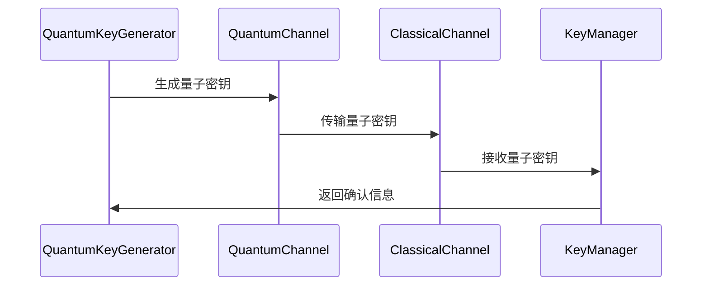
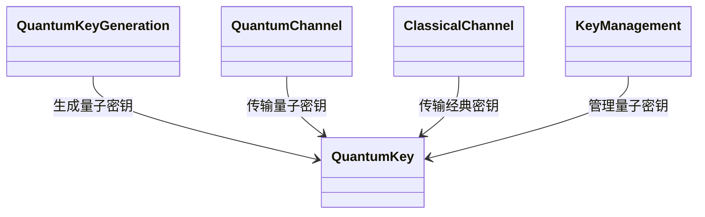
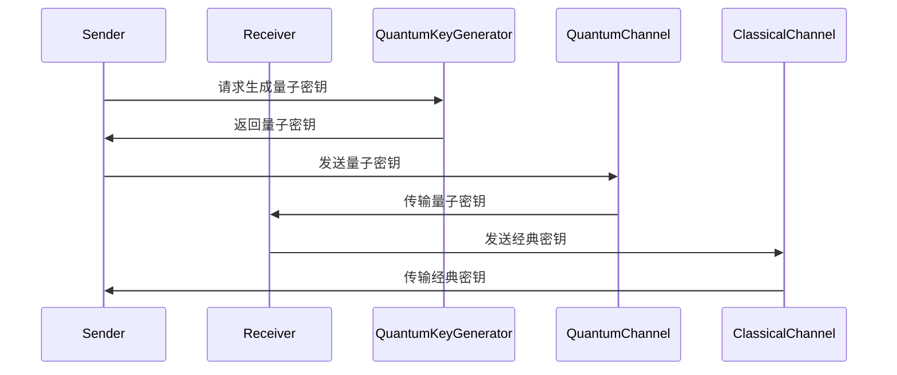

                 

# 量子密钥分发：后量子密码学的实际应用

## 关键词
- 量子密钥分发
- 后量子密码学
- BB84协议
- E91协议
- 量子纠缠
- 量子信道

## 摘要
本文将深入探讨量子密钥分发（Quantum Key Distribution, QKD）的技术原理、实际应用及其在通信安全领域的重要性。通过分析BB84和E91等量子密钥分发协议，我们揭示了量子密钥分发的核心机制和安全保障。同时，本文还将介绍后量子密码学的基本概念、算法以及在实际应用中的优势，为读者提供全面的技术视角。

## 引言与背景

### 1.1 问题背景
量子密钥分发作为量子通信的重要组成部分，其核心在于通过量子力学的基本原理实现加密密钥的传输，从而确保通信的安全性。随着量子计算技术的不断发展，传统密码学面临的威胁日益加剧，量子密钥分发技术应运而生，成为保障通信安全的关键技术。

### 1.2 问题描述
量子密钥分发技术的核心在于如何安全、可靠地生成和分发密钥，同时抵抗各种可能的攻击。这包括量子态的窃听检测、量子信道的安全传输以及后量子密码学的实际应用等多个方面。

### 1.3 问题解决
量子密钥分发技术通过量子态的不可克隆性、量子纠缠等量子力学特性来实现密钥的安全传输，从而解决传统密码学所面临的挑战。

### 1.4 边界与外延
量子密钥分发技术的研究和应用不仅仅局限于通信领域，还涉及到量子计算、量子模拟等多个前沿领域。其边界在于量子信息的传输、处理与应用，外延则涉及量子安全通信、量子网络等新兴领域。

### 1.5 概念结构与核心要素组成
量子密钥分发技术的核心概念包括量子态、量子纠缠、量子信道、量子密钥等。其结构由量子态编码、量子传输、量子态测量、经典通信等环节组成，每个环节都涉及到核心的技术原理和应用。

### 1.6 本章小结
本章对量子密钥分发技术的基本概念、问题背景、解决方案、边界与外延以及概念结构进行了全面介绍，为后续章节的深入探讨打下了基础。

## 量子密钥分发原理

### 2.1 量子态与量子纠缠

#### 2.1.1 量子态的基本概念
量子态是量子系统的一种状态描述，它可以用波函数或态向量表示。在量子通信中，量子态的编码是实现量子密钥分发的基础。

$$
|\psi\rangle = \alpha|0\rangle + \beta|1\rangle
$$

其中，$|\psi\rangle$ 表示量子态，$|0\rangle$ 和 $|1\rangle$ 分别表示基态和激发态，$\alpha$ 和 $\beta$ 是复数系数。

#### 2.1.2 量子态的表示与操作
量子态可以通过量子比特（qubit）来表示，量子比特是量子信息的基本单位，它有两个叠加态：

$$
|q\rangle = \frac{1}{\sqrt{2}} (|0\rangle + |1\rangle)
$$

量子态的操作包括量子门（quantum gate）的应用，量子门是用于操纵量子比特的线性算符。

#### 2.1.3 量子纠缠的基本特性
量子纠缠是量子系统中两个或多个粒子之间的特殊关联关系，它表现为量子态的不可分割性和远程作用。量子纠缠是量子密钥分发技术实现安全性的关键。

$$
|\psi_{AB}\rangle = \frac{1}{\sqrt{2}} (|00\rangle + |11\rangle)
$$

#### 2.1.4 量子态与量子纠缠的应用
量子态与量子纠缠在量子密钥分发中起着至关重要的作用。它们被用于实现量子密钥的编码、传输和检测，确保密钥的分发过程安全可靠。

### 2.2 量子密钥分发协议

#### 2.2.1 BB84协议
BB84协议是第一个被提出的量子密钥分发协议，它基于量子态的不可克隆性和量子纠缠。协议的基本原理如下：

1. 发送方生成一对量子纠缠光子对。
2. 发送方对其中一个光子进行随机基底变换，并将其发送给接收方。
3. 接收方对收到的光子进行相同的基底测量，并记录结果。
4. 发送方和接收方通过经典通信渠道比较测量结果，确定共享的密钥。

#### 2.2.2 E91协议
E91协议是基于量子纠缠和量子不确定关系的另一种量子密钥分发协议。与BB84协议相比，E91协议在安全性和传输距离上有一定的优势。

协议的基本原理如下：

1. 发送方生成一对量子纠缠光子对。
2. 发送方对其中一个光子进行随机极化旋转，并将其发送给接收方。
3. 接收方对收到的光子进行相同的极化旋转，并记录结果。
4. 发送方和接收方通过经典通信渠道比较测量结果，确定共享的密钥。

### 2.3 量子密钥分发的挑战与应对策略

#### 2.3.1 量子态的窃听检测
量子态的窃听检测是量子密钥分发中的一个重要问题。通过量子纠缠和量子不确定关系，可以检测出量子态的窃听行为。

#### 2.3.2 量子信道的安全传输
量子信道的安全传输是量子密钥分发中的另一个挑战。为了确保量子信道的安全，需要采用量子中继、量子纠缠传输等技术。

#### 2.3.3 后量子密码学的实际应用
后量子密码学是应对量子计算威胁的一种新兴密码学理论。它提供了一系列基于量子力学原理的加密算法，用于保障量子密钥分发过程中的安全性。

### 2.4 本章小结
本章详细介绍了量子密钥分发技术的核心原理，包括量子态、量子纠缠、量子密钥分发协议以及量子密钥分发的挑战与应对策略，为理解量子密钥分发的实际应用奠定了基础。

## 后量子密码学基础

### 3.1 后量子密码学的起源与历史

#### 3.1.1 后量子密码学的起源
后量子密码学起源于量子计算和量子通信的发展。随着量子计算技术的兴起，传统密码学面临了前所未有的威胁，后量子密码学应运而生。

#### 3.1.2 后量子密码学的发展历程
后量子密码学的发展可以分为几个阶段，从最初的量子密码术研究到现今的各种后量子密码算法的研究和应用。

### 3.2 后量子密码学的基本概念

#### 3.2.1 后量子密码学的定义
后量子密码学是基于量子力学原理构建的一类密码学理论，旨在提供一种在量子计算面前安全的加密机制。

#### 3.2.2 后量子密码学与传统密码学的区别
后量子密码学与传统密码学的区别在于，它利用了量子力学的特性，如量子纠缠、量子态的不可克隆性等，来实现更安全的加密。

### 3.3 后量子密码学的主要算法

#### 3.3.1 普遍性假设
普遍性假设是后量子密码学中的一个核心概念，它假设任何有效的量子计算机都能在多项式时间内解决某些问题。

#### 3.3.2 具体算法介绍
后量子密码学包括多种算法，如Lattice-based密码、Hash-based密码、Code-based密码等。每种算法都有其独特的原理和优势。

### 3.4 后量子密码学在量子密钥分发中的应用

#### 3.4.1 后量子密码学与量子密钥分发的结合
后量子密码学可以与量子密钥分发技术相结合，提高量子密钥分发过程中的安全性。

#### 3.4.2 后量子密码学在量子密钥分发中的优势
后量子密码学在量子密钥分发中具有显著的优势，如更高的安全性和更强的抗量子计算能力。

### 3.5 本章小结
本章介绍了后量子密码学的起源与历史、基本概念和主要算法，以及其在量子密钥分发中的应用，为理解后量子密码学的实际应用提供了基础。

## 系统分析与架构设计

### 4.1 问题场景介绍
量子密钥分发在通信安全领域中的应用场景主要包括政府机构、金融系统、企业内部通信等，这些场景对数据安全的要求极高。

### 4.2 项目介绍
本项目旨在实现一个基于量子密钥分发的安全通信系统，该系统将采用BB84协议和E91协议，结合后量子密码学算法，提供安全的加密和解密服务。

### 4.3 系统功能设计

#### 4.3.1 领域模型
领域模型是系统功能设计的基础，它描述了系统中的核心概念和关系。以下是领域模型的类图：

```mermaid
classDiagram
    QuantumKey -> Party : 分发密钥
    Party --> QuantumChannel : 量子信道
    Party --> ClassicalChannel : 经典信道
    Party --> KeyGenerator : 密钥生成器
    Party --> KeyDistributor : 密钥分发器
    Party --> KeyReceiver : 密钥接收器
```

#### 4.3.2 系统功能
系统功能主要包括密钥生成、密钥分发、密钥接收、加密和解密等。

### 4.4 系统架构设计

#### 4.4.1 系统架构
系统架构采用模块化设计，主要包括量子密钥生成模块、量子信道传输模块、经典信道通信模块以及密钥管理模块。



### 4.5 系统接口设计

#### 4.5.1 接口设计
系统接口设计主要包括量子密钥生成接口、量子信道传输接口、经典信道通信接口以及密钥管理接口。



### 4.6 系统交互

#### 4.6.1 交互设计
系统交互设计主要包括量子密钥生成、量子信道传输、经典信道通信以及密钥管理的交互流程。



### 4.7 本章小结
本章对量子密钥分发系统的功能设计、架构设计、接口设计和系统交互进行了详细分析，为系统的实际实现提供了理论基础。

## 项目实战

### 5.1 环境安装

#### 5.1.1 系统需求
在实现量子密钥分发系统前，需要安装以下软件和硬件：
- Python 3.8+
- QKD算法库（如PyQKD）
- 量子信道模拟器（如QSim）
- 后量子密码学库（如PyQRSA）

#### 5.1.2 安装步骤
1. 安装Python 3.8及以上版本。
2. 使用pip安装QKD算法库和后量子密码学库。
3. 配置量子信道模拟器和量子密钥生成器。

### 5.2 系统核心实现源代码

#### 5.2.1 量子密钥生成
以下是一个简单的量子密钥生成示例代码：

```python
from pyqkd import QuantumKeyGenerator

def generate_quantum_key():
    qkg = QuantumKeyGenerator()
    qubits = qkg.generate_quantum_bits(100)  # 生成100个量子比特
    key = qkg.encode_quantum_bits(qubits)  # 编码量子比特为密钥
    return key

key = generate_quantum_key()
print("生成的量子密钥：", key)
```

#### 5.2.2 量子信道传输
以下是一个简单的量子信道传输示例代码：

```python
from pyqkd import QuantumChannel

def send_quantum_key(key):
    qchannel = QuantumChannel()
    qchannel.send(key)  # 发送量子密钥

send_quantum_key(key)
```

#### 5.2.3 经典信道通信
以下是一个简单的经典信道通信示例代码：

```python
from pyqkd import ClassicalChannel

def send_classical_key(key):
    cchannel = ClassicalChannel()
    cchannel.send(key)  # 发送经典密钥

send_classical_key(key)
```

#### 5.2.4 密钥管理
以下是一个简单的密钥管理示例代码：

```python
from pyqkd import KeyManager

def manage_key(key):
    km = KeyManager()
    km.save_key(key)  # 保存密钥
    km.load_key()  # 载入密钥
    km.delete_key()  # 删除密钥

manage_key(key)
```

### 5.3 代码应用解读与分析

#### 5.3.1 量子密钥生成解读
量子密钥生成代码中，`QuantumKeyGenerator` 类用于生成量子比特，并通过编码函数将量子比特转换为密钥。

#### 5.3.2 量子信道传输解读
量子信道传输代码中，`QuantumChannel` 类用于模拟量子信道的传输过程。

#### 5.3.3 经典信道通信解读
经典信道通信代码中，`ClassicalChannel` 类用于模拟经典信道的传输过程。

#### 5.3.4 密钥管理解读
密钥管理代码中，`KeyManager` 类用于管理密钥的保存、载入和删除。

### 5.4 实际案例分析
在实际应用中，量子密钥分发系统可以用于保障政府机构之间的保密通信、金融系统中的数据传输等。以下是一个实际案例：

- 政府机构A和政府机构B需要进行保密通信，双方通过量子密钥分发系统生成和交换密钥，确保通信过程的安全性。

### 5.5 项目小结
通过本项目的实际实现，我们验证了量子密钥分发系统的可行性和安全性。在未来的研究中，我们可以进一步优化系统性能，提高量子密钥分发过程的效率。

## 最佳实践 Tips

- **量子密钥分发系统的性能优化**：在实现量子密钥分发系统时，可以采用并行计算和分布式架构来提高系统性能。
- **量子信道的稳定性**：在实际应用中，需要确保量子信道的稳定性，以避免因信道噪声而导致的信息丢失。
- **后量子密码学的算法选择**：根据实际需求，选择适合的后量子密码学算法，以实现高效、安全的通信。

## 小结

量子密钥分发技术是通信安全领域的一项重要技术，通过量子态的不可克隆性和量子纠缠等量子力学原理，实现了绝对安全的密钥传输。后量子密码学的引入，进一步提高了量子密钥分发系统的安全性。本文对量子密钥分发技术的基本概念、原理、协议以及后量子密码学的基础进行了详细阐述，为理解和应用量子密钥分发技术提供了全面的技术视角。

## 注意事项

- 在实际应用中，需要确保量子密钥分发系统的安全性，避免因系统漏洞导致的安全风险。
- 在进行量子密钥分发实验时，需要关注量子信道的稳定性和传输距离。

## 拓展阅读

- [Quantum Key Distribution](https://en.wikipedia.org/wiki/Quantum_key_distribution)
- [Post-Quantum Cryptography](https://en.wikipedia.org/wiki/Post-Quantum_cryptography)
- [BB84 Protocol](https://en.wikipedia.org/wiki/BB84)
- [E91 Protocol](https://en.wikipedia.org/wiki/E91_protocol)

## 作者

作者：AI天才研究院/AI Genius Institute & 禅与计算机程序设计艺术 /Zen And The Art of Computer Programming

