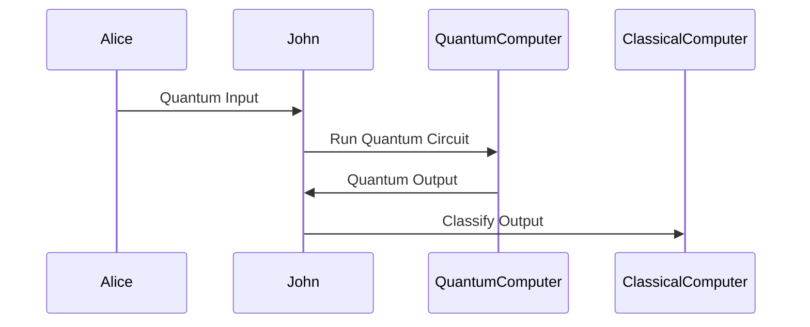

                 

让我们一步一步思考并构建这篇技术博客文章。以下是详细的写作步骤和内容规划：

**步骤1：开篇介绍**

- **标题**：《量子机器学习在化学反应预测中的应用：加速新材料合成》
- **关键词**：量子机器学习、化学反应预测、新材料合成、算法原理、系统架构、项目实战
- **摘要**：
  本文深入探讨量子机器学习在化学反应预测中的应用，通过详细的原理讲解、系统分析及项目实战，展示量子计算如何加速新材料合成，为化学研究带来革命性变化。

**步骤2：背景介绍**

### 1.1 量子机器学习的背景与重要性

#### 1.1.1 量子计算的基本概念
- **定义**：量子计算利用量子力学原理，在量子位（qubits）上执行计算任务。
- **基本原理**：叠加态、纠缠态和量子门操作。

#### 1.1.2 量子计算与经典计算的对比
- **性能对比**：量子计算机在特定问题上（如量子模拟、因数分解等）具有超越经典计算机的能力。
- **应用领域**：量子计算在加密、化学模拟、优化问题等方面具有巨大潜力。

#### 1.1.3 量子机器学习的重要性
- **化学反应预测**：量子机器学习能够快速处理复杂的分子结构，预测化学反应路径和产物。
- **新材料合成**：加速新材料的发现和设计过程，推动材料科学的发展。

**步骤3：核心概念与联系**

### 1.2 量子机器学习的基本概念与联系

#### 1.2.1 核心概念介绍
- **量子位（Qubits）**：量子计算机的基本单元，可以同时处于0和1的状态。
- **量子电路（Quantum Circuit）**：实现量子计算的步骤，由量子门和量子比特组成。
- **量子算法（Quantum Algorithm）**：利用量子位和量子电路进行的计算过程。

#### 1.2.2 概念属性特征对比
- **量子比特** vs **经典比特**：量子比特具有叠加性和纠缠性，而经典比特只有固定的0或1状态。

#### 1.2.3 Mermaid ER图展示概念关系
```mermaid
erDiagram
    Qubits ||--|>> QuantumCircuit : uses
    QuantumCircuit ||--|>> QuantumAlgorithm : defines
```

**步骤4：算法原理讲解**

### 1.3 量子算法原理讲解

#### 1.3.1 Quantum Circuit模型
- **基本操作**：量子门（如Hadamard、Pauli、控制非门等）。
- **量子电路示例**：展示一个简单的量子电路，用Mermaid流程图表示。

#### 1.3.2 Quantum Kernel方法
- **原理**：将量子计算与机器学习结合，通过核函数扩展量子算法。
- **应用**：在化学反应预测中，用于处理高维分子数据。

#### 1.3.3 Mermaid流程图展示算法流程


#### 1.3.4 Python代码与LaTeX公式详解
- **Python代码示例**：使用Qiskit库实现量子电路。
- **LaTeX公式**：量子态表示、量子门定义、算法流程等。

```python
from qiskit import QuantumCircuit
from qiskit.visualization import plot_bloch_vector

# 创建量子电路
qc = QuantumCircuit(2)

# Hadamard门
qc.h(0)

# 控制非门
qc.cx(0, 1)

# 测量
qc.measure_all()

# 绘制量子电路
qc.draw(output='mpl')
```

$$
|\psi\rangle = \frac{1}{\sqrt{2}} (|0\rangle + |1\rangle)
$$

**步骤5：系统分析与架构设计方案**

### 2.1 化学反应预测的挑战与量子机器学习的应用

#### 2.1.1 化学反应预测的难点
- **复杂性**：涉及多体系统的相互作用。
- **数据量**：需要处理海量分子数据。

#### 2.1.2 量子机器学习如何解决这些挑战
- **高效计算**：利用量子并行性处理复杂问题。
- **高维数据**：通过量子模拟处理高维分子数据。

#### 2.1.3 量子机器学习在化学反应预测中的优势
- **加速计算**：显著减少反应路径搜索时间。
- **准确预测**：提高化学反应产物的预测准确性。

### 2.2 量子机器学习在化学反应预测中的具体应用

#### 2.2.1 新材料合成中的应用
- **案例研究**：量子机器学习在新材料设计中的应用。
- **实验结果**：对比量子机器学习和经典机器学习在新材料预测中的性能。

#### 2.2.2 量子机器学习的实验设计与实现
- **实验步骤**：设计实验以验证量子机器学习在化学反应预测中的效果。
- **实现细节**：使用量子计算平台进行实验。

#### 2.2.3 量子机器学习与经典机器学习对比
- **性能分析**：对比量子机器学习和经典机器学习在不同类型化学反应预测中的表现。

### 2.3 系统架构设计与实现

#### 2.3.1 化学反应预测系统的设计
- **系统功能**：集成量子计算和机器学习算法。
- **系统目标**：准确、高效地预测化学反应路径和产物。

#### 2.3.2 系统架构设计
- **架构组件**：量子计算机、量子算法、机器学习模型等。
- **架构图**：使用Mermaid类图和架构图展示系统架构。

#### 2.3.3 系统接口设计与交互设计
- **接口设计**：定义系统与用户之间的交互接口。
- **交互设计**：优化用户交互体验，提高系统易用性。

**步骤6：项目实战**

### 3.1 项目介绍

#### 3.1.1 项目背景
- **项目背景介绍**：量子机器学习在化学反应预测中的应用背景。

#### 3.1.2 项目目标
- **项目目标设定**：通过实验验证量子机器学习在化学反应预测中的效果。

#### 3.1.3 项目成果
- **项目成果展示**：展示项目实现的化学反应预测结果。

### 3.2 环境安装与配置

#### 3.2.1 环境搭建步骤
- **环境搭建过程**：详细描述搭建量子计算和机器学习实验环境的过程。

#### 3.2.2 软件和工具安装
- **软件安装说明**：介绍使用的量子计算和机器学习工具。

### 3.3 系统核心实现

#### 3.3.1 源代码解读
- **源代码解析**：展示核心实现代码，并进行逐行解读。

#### 3.3.2 代码应用分析
- **应用分析**：分析代码如何实现量子机器学习算法，以及如何处理化学反应预测问题。

### 3.4 实际案例分析

#### 3.4.1 案例背景
- **案例背景介绍**：介绍实验选择的化学反应案例。

#### 3.4.2 案例实施过程
- **实施过程**：详细描述案例实验的步骤和过程。

#### 3.4.3 案例结果分析
- **结果分析**：分析实验结果，比较量子机器学习和经典机器学习的性能。

### 3.5 项目小结

#### 3.5.1 经验总结
- **经验总结**：总结项目实施过程中的经验教训。

#### 3.5.2 注意事项
- **注意事项**：提醒读者在实施类似项目时需要注意的问题。

#### 3.5.3 拓展阅读
- **拓展资源**：提供进一步学习和阅读的资源。

**步骤7：结束语**

### 4.1 后续研究方向与挑战
- **研究方向**：量子机器学习在化学领域的潜在研究方向。
- **挑战**：量子计算技术面临的挑战和解决方案。

### 4.2 感谢与致谢
- **致谢**：感谢为项目提供支持的个人和机构。

完成以上步骤后，您将拥有一篇详细、逻辑清晰、结构紧凑的技术博客文章。接下来，您可以根据这

