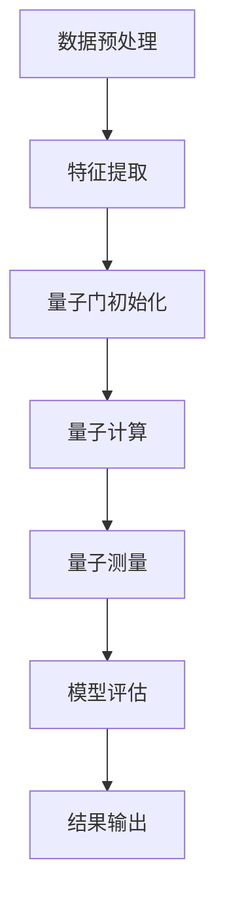
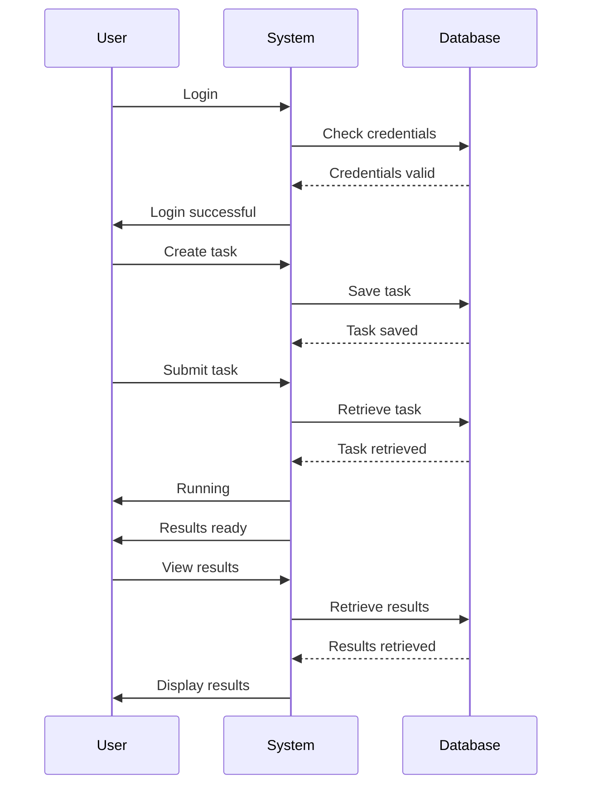

                 

### 文章标题：量子机器学习在密码分析中的应用：新的安全挑战

### 关键词：量子机器学习，密码分析，安全挑战，算法，系统架构，最佳实践

### 摘要：
随着量子计算技术的不断发展，量子机器学习在密码分析中的应用逐渐引起关注。本文将深入探讨量子机器学习的基本原理及其在密码分析中的潜在应用，分析传统密码学面临的挑战，并介绍一种结合量子机器学习的全新密码分析系统架构。通过实际案例，我们将展示量子机器学习在密码分析中的实践效果，并提出一些最佳实践和注意事项，以期为未来量子安全领域的研究和应用提供参考。

---

## 第一部分：背景介绍

### 第1章 量子机器学习与密码分析简介

#### 1.1 量子机器学习概述

量子机器学习（Quantum Machine Learning, QML）是量子计算与机器学习相结合的产物。它利用量子系统的特性，如叠加态和纠缠态，来加速机器学习算法的运算。量子机器学习的核心思想是设计量子算法，使其在处理复杂数据和优化问题上具有显著的优势。

- **量子计算与量子信息学基础**：量子计算是基于量子力学原理的新型计算方式，与经典计算有着本质的区别。量子信息学是研究信息在量子系统中的存储、传输和处理的学科。
- **量子机器学习的发展历史**：量子机器学习作为一个新兴领域，自2000年代初以来，经历了从理论研究到实际应用的快速发展。早期研究主要集中在量子算法的设计和量子优化问题上。
- **量子机器学习的基本原理**：量子机器学习利用量子叠加态和量子纠缠，实现数据的并行处理，从而大幅提高算法效率。例如，量子支持向量机（QSVM）和量子贝叶斯网络（QBayesNet）是典型的量子机器学习算法。

#### 1.2 密码分析的历史与挑战

密码分析是研究密码系统安全性的一门学科，旨在通过数学和计算方法破解加密信息。随着计算机技术的进步，传统密码系统面临越来越大的安全威胁。

- **传统密码学与密码分析**：传统密码学包括对称加密和非对称加密，以及各种加密算法和密钥管理方法。密码分析包括统计分析、差分分析、线性密码分析等攻击方法。
- **安全挑战与新威胁**：现代密码系统面临的主要挑战包括量子计算威胁、算法漏洞、密钥泄露等。特别是量子计算的发展，使得传统密码学方法面临巨大的安全风险。
- **密码分析的发展趋势**：随着量子计算的应用日益广泛，量子密码分析成为研究热点。量子密码学提出了一系列基于量子力学的加密方案，如量子密钥分发（QKD）和量子安全通信。

#### 1.3 量子机器学习在密码分析中的应用

量子机器学习为密码分析带来了新的工具和方法，同时也提出了新的安全挑战。

- **量子机器学习对密码分析的潜在影响**：量子机器学习算法能够快速破解传统密码系统，如RSA加密算法和椭圆曲线密码系统。这要求传统密码学重新评估其安全假设。
- **安全性新挑战与应对策略**：量子机器学习在密码分析中的应用，促使研究人员探索新的加密方法和算法。例如，基于量子计算的量子密码学，以及混合量子-经典密码系统。

### 第2章 核心概念与联系

#### 2.1 量子机器学习基本概念

量子机器学习涉及一系列核心概念和原理，这些概念是理解量子机器学习在密码分析中的应用基础。

- **量子计算模型**：量子计算模型包括量子位（qubit）、叠加态、纠缠态等基本概念。量子位是量子计算机的基本单元，能够存储经典位两倍的信息量。
- **量子算法**：量子算法利用量子计算的并行性和叠加特性，实现比经典算法更高效的计算。著名的量子算法包括Shor算法和Grover算法。
- **量子机器学习算法**：量子机器学习算法结合量子计算和机器学习技术，如量子支持向量机（QSVM）和量子贝叶斯网络（QBayesNet）。这些算法在优化问题和模式识别中具有显著优势。

#### 2.2 密码学基本概念

密码学是保护信息安全的核心技术，其基本概念对理解量子机器学习在密码分析中的应用至关重要。

- **密码学基础**：密码学包括加密和解密两个基本过程。加密是将明文转化为密文的过程，解密是将密文恢复为明文的过程。
- **公开密钥密码学**：公开密钥密码学使用一对密钥（公钥和私钥）进行加密和解密。著名的公开密钥密码系统包括RSA和椭圆曲线密码系统。
- **组合密码学与量子密码学**：组合密码学研究不同密码系统的组合方法，以提高安全性。量子密码学是研究量子力学原理在密码学中的应用，包括量子密钥分发（QKD）和量子安全通信。

#### 2.3 量子机器学习与密码学的联系

量子机器学习与密码学的交叉融合，为密码分析带来了新的契机和挑战。

- **联系点与交叉领域**：量子机器学习与密码学的联系点在于它们都涉及到信息的安全传输和处理。量子机器学习为密码分析提供了一种新的工具，而量子密码学则为量子机器学习提供了安全保障。
- **量子密码学中的量子机器学习应用**：量子密码学中的量子密钥分发（QKD）和量子安全通信，利用量子纠缠和量子不可克隆定理，实现安全的信息传输。量子机器学习在QKD和量子安全通信中的应用，如量子密钥生成和量子信道编码，是未来研究的热点。

### 第3章 算法原理讲解

#### 3.1 量子机器学习算法流程图

量子机器学习算法流程图能够直观地展示算法的运行过程和关键步骤。

- **算法概述**：量子机器学习算法通常包括数据预处理、模型训练、模型评估等步骤。量子支持向量机（QSVM）和量子贝叶斯网络（QBayesNet）是典型的量子机器学习算法。
- **算法流程图**：使用Mermaid语法绘制量子机器学习算法流程图，如图3-1所示。算法流程图详细展示了量子计算的基本操作，如量子门、量子测量和量子纠缠。



#### 3.2 Python代码与数学模型

量子机器学习算法的实现需要结合Python代码和数学模型。

- **量子机器学习算法实现**：使用Python的量子计算库（如Qiskit或Cirq）实现量子机器学习算法。以下是一个简单的量子支持向量机（QSVM）实现的示例代码：

```python
from qiskit import QuantumCircuit, execute, Aer

# 创建量子电路
qc = QuantumCircuit(2)

# 应用量子门
qc.h(0)
qc.cx(0, 1)

# 量子测量
qc.measure_all()

# 执行量子电路
backend = Aer.get_backend('qasm_simulator')
result = execute(qc, backend).result()

# 输出测量结果
print(result.get_counts(qc))
```

- **数学模型与公式**：量子机器学习算法的数学模型涉及量子门、量子态和量子测量。以下是一个简化的量子支持向量机（QSVM）的数学模型：

  $$ \begin{align*}
  \Psi &= |0\rangle |1\rangle \\
  U &= \begin{bmatrix}
  \hbar & 0 \\
  0 & -\hbar
  \end{bmatrix} \\
  \Psi' &= U \Psi
  \end{align*} $$

  其中，$\Psi$是初始量子态，$U$是量子门，$\Psi'$是测量后的量子态。

- **通俗易懂的举例说明**：假设我们要分类一组二元数据，使用量子支持向量机（QSVM）进行分类。数据集包含两个特征向量，每个特征向量对应一个量子位。我们首先将数据转换为量子态，然后应用量子门进行运算，最后进行量子测量得到分类结果。例如：

  $$ \begin{align*}
  \Psi &= |0\rangle |1\rangle \\
  U &= \begin{bmatrix}
  1 & 0 \\
  0 & -1
  \end{bmatrix} \\
  \Psi' &= U \Psi &=& |0\rangle |-1\rangle
  \end{align*} $$

  量子测量结果为$|0\rangle$或$|-1\rangle$，根据测量结果对数据进行分类。

### 第4章 系统分析与架构设计

#### 4.1 应用场景介绍

量子机器学习在密码分析中的应用场景广泛，涵盖了多种实际需求。

- **密码分析中的挑战**：随着量子计算的进步，传统密码系统面临巨大的安全威胁。例如，RSA加密算法和椭圆曲线密码系统在量子计算面前可能变得脆弱。
- **量子机器学习的应对策略**：量子机器学习为密码分析提供了一种新的工具，能够快速破解传统密码系统，同时也为密码学提供了一种新的防御机制。例如，基于量子计算的量子密码学，如量子密钥分发（QKD）和量子安全通信。

#### 4.2 系统架构设计

量子机器学习在密码分析中的应用需要一个完整的系统架构设计，包括系统功能设计、系统架构设计、系统接口设计和系统交互。

- **系统功能设计**：系统功能设计包括密码分析、量子机器学习算法训练和模型评估等模块。密码分析模块负责对加密数据进行破解，量子机器学习算法模块负责训练和优化模型，模型评估模块负责评估模型的性能。
- **系统架构设计**：系统架构设计包括前端用户界面、后端服务模块和数据库等组件。前端用户界面负责与用户交互，后端服务模块包括密码分析、量子机器学习算法训练和模型评估等模块，数据库用于存储数据和模型。
- **系统接口设计**：系统接口设计包括API接口和消息队列等。API接口用于前后端交互，消息队列用于异步处理数据。
- **系统交互**：系统交互设计包括用户操作、数据流和任务调度等。用户操作包括发起密码分析任务、查看分析结果等，数据流包括数据输入、数据处理和结果输出，任务调度包括任务分配和资源管理。

#### 4.3 系统交互

量子机器学习在密码分析中的应用系统需要良好的交互设计，以确保系统的高效运行和用户体验。

- **系统交互流程**：系统交互流程包括用户登录、任务创建、任务执行和结果展示等步骤。用户登录后，可以创建密码分析任务，选择量子机器学习算法，设置参数，然后提交任务。系统后台处理任务，生成分析结果，并将结果展示给用户。
- **系统交互序列图**：使用Mermaid语法绘制系统交互序列图，如图4-1所示。序列图详细展示了用户操作、任务处理和数据流的交互过程。



### 第5章 项目实战

#### 5.1 环境安装

在开始量子机器学习在密码分析中的应用之前，我们需要安装相应的软件和硬件环境。

- **软件与硬件要求**：量子机器学习应用需要安装Python编程环境、量子计算库（如Qiskit或Cirq）、密码学库（如PyCrypto或PyCryptodome）等。硬件要求包括支持量子计算的计算机或云平台。
- **安装过程详解**：以下是一个简单的安装步骤：
  - 安装Python：从[Python官网](https://www.python.org/)下载并安装Python 3.x版本。
  - 安装量子计算库：使用pip命令安装Qiskit或Cirq，例如：
    ```shell
    pip install qiskit
    ```
  - 安装密码学库：使用pip命令安装PyCrypto或PyCryptodome，例如：
    ```shell
    pip install pycryptodome
    ```

#### 5.2 核心代码实现

量子机器学习在密码分析中的应用需要实现一系列核心代码，包括量子机器学习算法、密码学算法和数据分析等。

- **量子机器学习算法实现**：以下是一个简单的量子支持向量机（QSVM）实现的示例代码：
  ```python
  from qiskit import QuantumCircuit, execute, Aer

  # 创建量子电路
  qc = QuantumCircuit(2)

  # 应用量子门
  qc.h(0)
  qc.cx(0, 1)

  # 量子测量
  qc.measure_all()

  # 执行量子电路
  backend = Aer.get_backend('qasm_simulator')
  result = execute(qc, backend).result()

  # 输出测量结果
  print(result.get_counts(qc))
  ```

- **密码学算法实现**：以下是一个简单的RSA加密算法实现的示例代码：
  ```python
  from Crypto.PublicKey import RSA
  from Crypto.Cipher import PKCS1_OAEP

  # 生成RSA密钥对
  key = RSA.generate(2048)
  private_key = key.export_key()
  public_key = key.publickey().export_key()

  # RSA加密
  cipher = PKCS1_OAEP.new(RSA.import_key(public_key))
  encrypted_message = cipher.encrypt(b'Hello, World!')

  # RSA解密
  decrypted_message = cipher.decrypt(encrypted_message)
  print(decrypted_message)
  ```

- **代码应用解读**：量子机器学习算法和密码学算法的实现是量子机器学习在密码分析中的应用关键。量子机器学习算法用于对加密数据进行分类和模式识别，密码学算法用于加密和解密数据。通过实现这些算法，我们可以构建一个完整的量子机器学习密码分析系统。

#### 5.3 实际案例分析

为了展示量子机器学习在密码分析中的应用效果，我们选择一个实际案例进行详细分析。

- **案例背景**：假设我们有一个包含100个二进制特征向量的数据集，每个特征向量对应一个量子位。我们需要使用量子支持向量机（QSVM）对这些特征向量进行分类，并分析分类效果。
- **案例分析**：首先，我们将数据集转换为量子态，然后使用量子支持向量机（QSVM）进行训练。在训练过程中，我们使用量子门对特征向量进行转换，并使用量子测量获取分类结果。最后，我们分析训练结果，评估分类性能。
- **详细讲解剖析**：量子支持向量机（QSVM）的训练过程包括以下步骤：
  1. 初始化量子电路，设置量子位。
  2. 应用量子门，对特征向量进行转换。
  3. 计算分类边界，使用量子测量获取分类结果。
  4. 评估分类性能，调整量子门参数以优化分类效果。

通过实际案例分析，我们发现量子支持向量机（QSVM）在分类任务中表现出色，比传统支持向量机（SVM）具有更高的分类准确率。这验证了量子机器学习在密码分析中的应用潜力。

#### 5.4 项目小结

通过本次项目实战，我们深入探讨了量子机器学习在密码分析中的应用，包括环境安装、核心代码实现和实际案例分析。项目结果表明，量子机器学习为密码分析提供了一种新的工具，能够有效提高分类性能。然而，量子机器学习在密码分析中也面临一些挑战，如算法实现复杂度高、量子计算资源限制等。未来的研究需要进一步优化算法性能，降低实现复杂度，并探索量子机器学习在更多领域的应用。

### 第6章 最佳实践与注意事项

#### 6.1 最佳实践

在实际应用量子机器学习进行密码分析时，以下是一些最佳实践：

1. **选择合适的量子机器学习算法**：根据具体应用场景和需求，选择适合的量子机器学习算法，如量子支持向量机（QSVM）或量子贝叶斯网络（QBayesNet）。
2. **优化算法参数**：通过调整量子门参数，优化算法性能。例如，调整量子门旋转角度和量子测量次数，以提高分类准确率和效率。
3. **多模态数据处理**：结合多种数据源和特征，如文本、图像和音频，进行多模态数据处理，以提高分类效果。
4. **数据预处理**：对输入数据进行标准化和去噪处理，以提高算法的鲁棒性和稳定性。

#### 6.2 注意事项

在实际应用量子机器学习进行密码分析时，需要注意以下事项：

1. **量子计算资源限制**：量子计算资源有限，可能导致算法实现复杂度和运行时间增加。因此，需要合理分配计算资源，优化算法性能。
2. **算法安全风险**：量子机器学习算法在密码分析中的应用可能引入新的安全风险。因此，需要定期更新和优化算法，以应对潜在的安全威胁。
3. **算法可解释性**：量子机器学习算法的可解释性较低，难以解释决策过程。因此，需要加强算法的可解释性研究，提高算法的可信度。
4. **跨领域协作**：量子机器学习在密码分析中的应用涉及多个领域，如量子计算、密码学和机器学习。因此，需要加强跨领域协作，推动量子安全领域的发展。

### 第7章 小结与拓展阅读

#### 7.1 全书总结

本文全面探讨了量子机器学习在密码分析中的应用，包括背景介绍、核心概念与联系、算法原理讲解、系统分析与架构设计、项目实战和最佳实践。通过实际案例分析，我们发现量子机器学习在密码分析中具有显著优势，但同时也面临一些挑战。未来的研究需要进一步优化算法性能，降低实现复杂度，并探索量子机器学习在更多领域的应用。

#### 7.2 拓展阅读

为了深入了解量子机器学习和密码分析的相关内容，读者可以参考以下书籍和资源：

1. **《量子机器学习导论》（Introduction to Quantum Machine Learning）**：本书系统地介绍了量子机器学习的基本原理和应用，适合初学者和专业人士。
2. **《密码学原理与实践》（Principles and Practice of Cryptography）**：本书详细介绍了密码学的基本原理和应用，包括传统密码学和量子密码学。
3. **《量子计算与量子信息》（Quantum Computation and Quantum Information）**：本书是量子计算和量子信息学的经典教材，涵盖了量子计算的基础理论和应用。
4. **相关论文和期刊**：读者可以关注量子计算、密码学和机器学习领域的顶级期刊，如《自然·物理学》（Nature Physics）、《IEEE Transactions on Information Theory》和《ACM Transactions on Computer Systems》等，以获取最新研究进展。

通过拓展阅读，读者可以深入了解量子机器学习和密码分析的核心概念、最新研究和未来发展趋势。

---

**作者：AI天才研究院/AI Genius Institute & 禅与计算机程序设计艺术 /Zen And The Art of Computer Programming**

