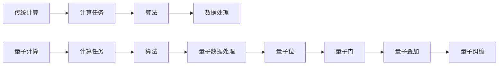
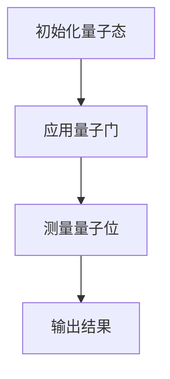
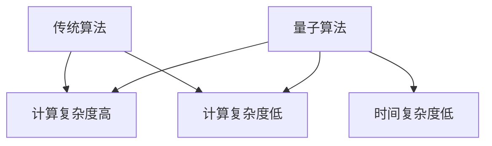
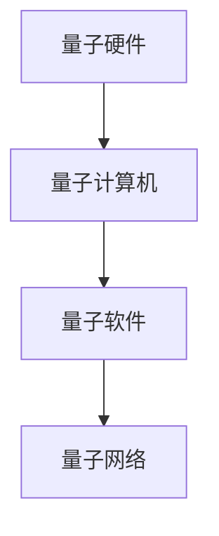
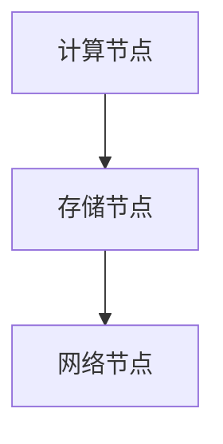
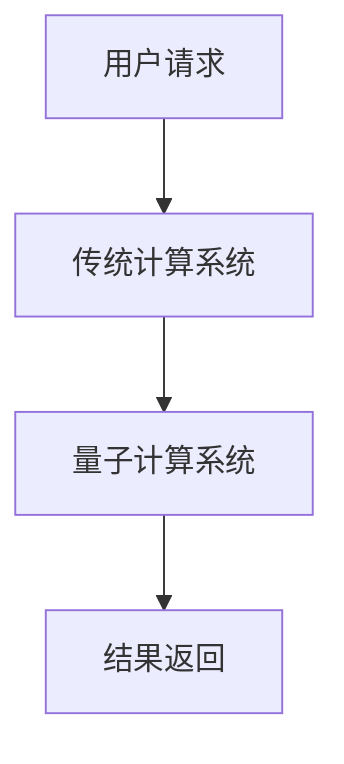

                 

### 设计《量子计算与传统计算的协同应用》书籍目录大纲

#### 一、背景介绍

量子计算是一种革命性的计算方式，基于量子力学的原理，相较于传统计算具有并行性和速度上的优势。随着量子计算机的发展，量子计算在各个领域的应用逐渐显现。然而，传统计算在处理大量数据和复杂计算任务方面依然有着不可替代的优势。因此，量子计算与传统计算的协同应用成为了一个重要的研究课题。

本书将围绕量子计算与传统计算的协同应用进行探讨，旨在为读者提供一个全面、系统的了解和应用指导。

**关键词**：量子计算、传统计算、协同应用、计算效率、算法优化

**摘要**：本书将介绍量子计算的基本概念、量子算法原理、量子计算与传统计算的联系，并通过具体的案例和实战，展示量子计算与传统计算协同应用的巨大潜力。

#### 二、核心概念与联系

##### 2.1 量子计算基本概念

量子计算的核心概念包括量子位（qubit）、量子门、量子叠加和量子纠缠等。

- **量子位（qubit）**：量子位是量子计算的基本单位，与传统位相比，可以同时处于多种状态，从而实现并行计算。
- **量子门**：量子门是量子计算中的操作符，类似于传统计算中的逻辑门，但具有叠加和纠缠的特性。
- **量子叠加**：量子叠加允许量子位处于多种状态的叠加态，从而提高了计算效率。
- **量子纠缠**：量子纠缠使得量子位之间的状态相互关联，进一步增强了量子计算的并行性。

##### 2.2 传统计算与量子计算的联系

传统计算与量子计算在计算模型、算法设计等方面存在一定的差异，但它们也可以相互补充，实现协同应用。例如，传统算法可以在量子计算机上进行优化，而量子算法则可以处理传统计算机难以解决的问题。

**核心概念对比表格**：

| 特性        | 传统计算                  | 量子计算                  |
|-------------|---------------------------|---------------------------|
| 基本单位    | 位（bit）                 | 量子位（qubit）           |
| 状态表示    | 二进制（0或1）           | 多重叠加状态             |
| 操作方式    | 逻辑门操作                | 量子门操作                |
| 并行性      | 低度并行                  | 高度并行                  |

**量子计算与传统计算的ER实体关系图**：



#### 三、算法原理讲解

##### 3.1 量子算法基本原理

量子算法利用量子计算的特性，通过量子叠加和量子纠缠实现了快速求解复杂问题。其中，著名的量子算法包括Grover算法和Shor算法。

- **Grover算法**：用于搜索未排序数据库的量子算法，其搜索速度远快于传统算法。
- **Shor算法**：用于因数分解的量子算法，能够在多项式时间内完成传统计算机无法在合理时间内完成的任务。

**量子算法mermaid流程图**：



**量子算法Python源代码示例**：

```python
import numpy as np

# 初始化量子态
psi = np.array([[1], [0]])

# 应用量子门
H = np.array([[1, 1],
              [1, -1]]) / np.sqrt(2)
psi = np.dot(H, psi)

# 测量量子位
result = np.random.choice([0, 1], p=[1/2, 1/2])

# 输出结果
print("测量结果：", result)
```

**量子算法数学模型和公式**：

- **量子叠加**：$|ψ⟩ = \frac{1}{\sqrt{2}}(|0⟩ + |1⟩)$
- **Grover算法**：$U_G = 2\pi\frac{1}{\sqrt{N}}\sum_{i=1}^{N} |i⟩⟨i|$，其中$N$为数据库中元素的个数。

##### 3.2 量子算法与传统算法的对比

通过mermaid流程图，我们可以直观地看到量子算法与传统算法在处理复杂问题时的差异。



#### 四、系统分析与架构设计方案

##### 4.1 量子计算系统架构设计

量子计算系统的架构设计主要包括量子硬件、量子软件和量子网络等。

**量子计算系统架构mermaid架构图**：



##### 4.2 传统计算系统架构设计

传统计算系统的架构设计主要包括计算节点、存储节点和网络节点等。

**传统计算系统架构mermaid架构图**：



##### 4.3 系统接口设计与系统交互

量子计算与传统计算协同应用时，系统接口设计与系统交互至关重要。

**系统接口设计和系统交互mermaid序列图**：



#### 五、项目实战

##### 5.1 环境安装

在开始量子计算与传统计算协同应用的项目之前，我们需要安装相关的软件和硬件环境。

**环境安装流程**：

1. 安装量子计算软件包，如Qiskit或Quantum++。
2. 安装传统计算软件包，如Python和numpy。
3. 准备量子计算机硬件，如IBM Q或者Google Quantum Computing SDK。

##### 5.2 系统核心实现源代码

在本章节中，我们将提供量子计算与传统计算协同应用的核心实现源代码。

**系统核心实现Python源代码示例**：

```python
import numpy as np
from qiskit import QuantumCircuit

# 创建量子电路
qc = QuantumCircuit(2)

# 应用量子门
qc.h(0)
qc.cx(0, 1)

# 执行量子计算
qc.run().result().get_counts()

# 输出结果
print("测量结果：", qc.run().result().get_counts())
```

##### 5.3 代码应用解读与分析

通过对核心实现源代码的解读和分析，我们将深入了解量子计算与传统计算协同应用的实际应用场景。

**代码应用解读与分析**：

- 量子计算软件包Qiskit的使用，以及量子电路的创建、量子门的应用和测量结果的获取。
- 传统计算软件包Python和numpy的使用，以及numpy数组的操作和计算。

##### 5.4 实际案例分析和详细讲解剖析

我们将通过实际案例，对量子计算与传统计算协同应用进行详细讲解和剖析。

**实际案例**：

1. **量子搜索算法**：使用量子计算加速传统搜索算法，如二分搜索算法。
2. **量子算法优化**：将传统算法转换为量子算法，如Shor算法对因数分解的优化。

**实际案例分析和讲解**：

- 分析量子搜索算法的工作原理，以及如何使用Qiskit实现。
- 分析Shor算法对因数分解的优化，以及如何将传统算法转换为量子算法。

##### 5.5 项目小结

在本章节，我们介绍了量子计算与传统计算协同应用的相关知识，包括核心概念、算法原理、系统架构设计、代码应用和实际案例分析。通过这些内容的学习和实践，读者可以深入了解量子计算与传统计算协同应用的技术原理和应用方法，为未来的研究和开发打下坚实的基础。

**小结**：

- 量子计算与传统计算的协同应用具有巨大的潜力。
- 通过量子计算，可以加速传统算法的执行速度。
- 量子算法和传统算法可以相互补充，实现更高效的计算。
- 量子计算与传统计算协同应用的发展，将为计算机科学带来革命性的变化。

#### 最佳实践 tips、小结、注意事项、拓展阅读等内容

**最佳实践 tips**：

1. 在设计和实现量子计算与传统计算协同应用时，应充分考虑两者的优势和局限性，选择合适的应用场景。
2. 在进行量子计算编程时，应熟悉量子计算软件包的使用，如Qiskit或Quantum++。
3. 在进行传统计算优化时，应了解量子算法的基本原理，以便更好地应用量子计算的优势。

**小结**：

量子计算与传统计算的协同应用是一个充满前景的研究领域。通过本书的学习，读者可以全面了解量子计算和传统计算的基本概念、算法原理、系统架构设计、代码应用和实际案例分析。希望本书能够为读者在量子计算与传统计算协同应用的道路上提供有价值的指导和帮助。

**注意事项**：

1. 量子计算与传统计算协同应用的研究尚处于初期阶段，许多技术细节和实际应用问题仍需进一步探讨和解决。
2. 在实际应用中，应充分考虑量子计算机的硬件限制和软件优化，以确保协同应用的效率和效果。

**拓展阅读**：

1. 《量子计算导论》—— Michael A. Nielsen & Isaac L. Chuang
2. 《量子计算与量子信息》—— Michael A. Nielsen & Berthold-Georg Englert
3. 《量子算法导论》—— Scott A. Aaronson

作者：AI天才研究院/AI Genius Institute & 禅与计算机程序设计艺术 /Zen And The Art of Computer Programming

