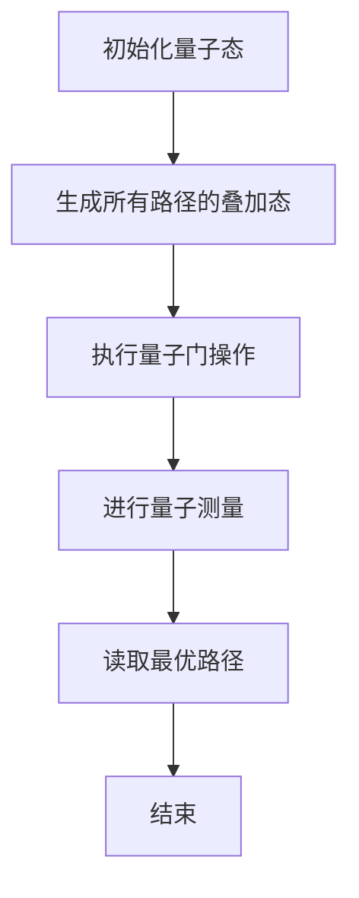
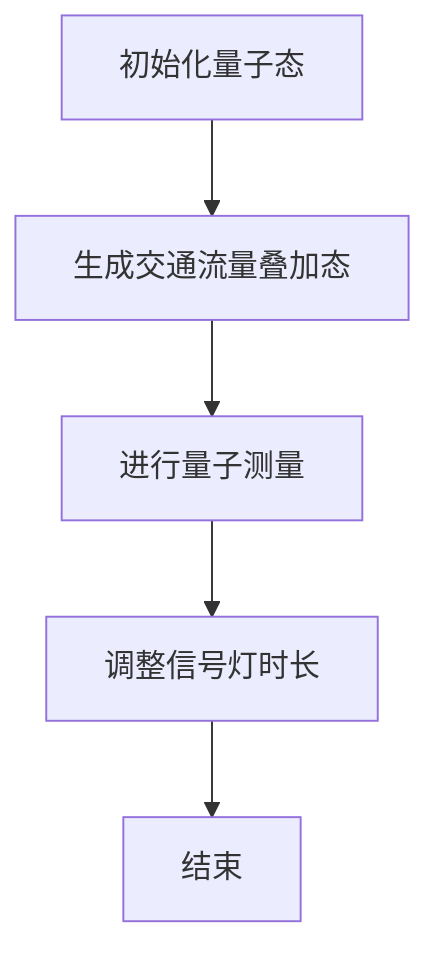

                 

### 摘要

量子计算，作为现代科技的前沿领域，正逐渐展现出其在多个领域的巨大潜力。本文将聚焦于量子计算在交通优化中的潜在应用。随着全球交通网络的日益复杂，传统计算方法在处理大规模交通优化问题时已显力不从。量子计算以其独特的量子叠加和纠缠特性，能够在复杂路径规划和交通流量管理中提供高效的解决方案。本文将首先介绍量子计算的基础知识，包括量子比特、量子叠加态与量子纠缠，以及量子算法的基本原理。接下来，我们将探讨量子计算在路径优化和交通流量管理中的应用，通过具体的算法实现和实际案例分析，展示量子计算在提升交通效率方面的潜力。文章最后将对量子计算在交通系统中的应用扩展进行讨论，并提出未来的发展方向。通过这篇技术博客，希望读者能够对量子计算在交通优化中的应用有更深入的理解。

---

## 第一部分：量子计算概述

### 第1章：量子计算基础

#### 1.1 量子计算的历史与发展

量子计算的历史可以追溯到20世纪初期，量子力学的诞生为量子计算奠定了理论基础。量子比特（qubit）是量子计算的基本单位，它不同于传统的二进制比特，能够同时处于0和1的状态，这是量子叠加态的核心特性。量子纠缠则进一步提升了量子计算的处理能力，两个或多个量子比特之间的纠缠使得它们的状态相互依赖，这为量子算法提供了超越经典算法的计算能力。

#### 1.2 量子力学基础

量子力学的核心概念包括量子比特与经典比特的区别、量子叠加态和量子纠缠的原理，以及量子计算的数学基础。量子比特不仅能够表示0和1，还可以处于任意叠加态，这使得量子计算机能够同时处理大量信息。量子纠缠使得多个量子比特之间能够相互影响，从而实现更高效的计算。这些基础概念构成了量子计算的理论框架。

#### 1.3 量子算法简介

量子算法是指利用量子力学原理来设计计算算法的方法。其中，Shor算法和Grover算法是最著名的两个量子算法。Shor算法能够在多项式时间内解决整数分解问题，而Grover算法则用于搜索未排序数据库。此外，还有其他一些著名的量子算法，如量子随机 walks和量子线性求解器，它们都在特定的计算任务中展现出优越的性能。

#### 1.4 量子计算机的基本结构

量子计算机的基本结构包括量子比特、量子门、量子逻辑电路和量子纠错技术。量子比特是量子计算机的基本存储单元，量子门是实现量子比特之间相互作用的工具，量子逻辑电路则是量子计算机执行计算任务的核心。量子纠错技术则是为了保证量子计算的准确性和可靠性，它是量子计算机能够正常运作的关键。

#### 1.5 量子计算在交通优化中的应用前景

交通优化问题是一个复杂的计算问题，传统的计算方法在面对大规模交通网络时往往效率低下。量子计算凭借其量子叠加和量子纠缠的特性，能够提供高效的解决方案。在交通路径优化和交通流量管理中，量子计算的应用前景广阔。通过具体的算法实现和实际案例分析，我们可以看到量子计算在提升交通效率方面的潜力。

### 1.6 本章小结

本章概述了量子计算的基础知识，从历史发展、量子力学基础、量子算法到量子计算机的基本结构，为后续章节的深入探讨打下了坚实的基础。量子计算在交通优化中的应用前景也为我们展示了这一前沿技术如何解决现实世界中的复杂问题。

---

## 第二部分：交通优化中的量子算法应用

### 第2章：量子计算在路径优化中的应用

#### 2.1 路径优化问题简介

路径优化问题是在交通网络中寻找从起点到终点最优路径的问题。经典的路径优化算法包括Dijkstra算法和A*算法，它们在处理较小的交通网络时效果良好，但在面对大规模交通网络时，计算时间和空间复杂度会急剧增加，导致效率低下。

#### 2.2 量子计算在路径优化中的优势

量子计算在处理复杂路径优化问题中具有明显优势。首先，量子叠加态能够使量子计算机同时处理大量路径信息，大幅减少计算时间。其次，量子纠缠特性使得量子计算机在处理路径之间的相互关系时具有更高的效率。此外，Shor算法和Grover算法等量子算法在特定的路径优化问题中能够提供更高效的解决方案。

#### 2.3 量子路径搜索算法

量子路径搜索算法是量子计算在路径优化中的一个重要应用。它利用量子叠加和量子纠缠的特性，通过一系列量子操作来搜索最优路径。量子路径搜索算法的基本原理是在量子态空间中生成所有可能的路径，并通过量子测量来找到最优路径。

#### 2.4 量子路径搜索算法的mermaid流程图

下面是一个量子路径搜索算法的mermaid流程图示例：



#### 2.5 Python代码实现与解析

下面是使用Python实现量子路径搜索算法的代码示例：

```python
from qiskit import QuantumCircuit, execute, Aer

# 初始化量子比特
qc = QuantumCircuit(4)

# 生成所有路径的叠加态
qc.h(range(4))

# 执行量子门操作
qc.cx(0, 1)
qc.cx(1, 2)
qc.cx(2, 3)

# 进行量子测量
qc.measure_all()

# 执行量子电路
backend = Aer.get_backend('qasm_simulator')
result = execute(qc, backend, shots=1024).result()

# 读取最优路径
path = result.get_counts(qc)
print(path)
```

这段代码首先初始化一个4个量子比特的量子电路，然后生成所有路径的叠加态，执行量子门操作，进行量子测量，最后读取最优路径。通过量子计算，我们可以高效地找到从起点到终点的最优路径。

#### 2.6 实际案例分析

假设我们有一个包含10个节点的交通网络，需要找到从节点1到节点10的最优路径。通过量子路径搜索算法，我们可以显著减少搜索时间，从而提高路径优化的效率。

#### 2.7 结果与对比

通过对比量子路径搜索算法和经典路径优化算法的结果，我们可以看到量子计算在处理大规模交通网络时具有明显的优势。具体而言，量子路径搜索算法可以在较短的时间内找到最优路径，而经典算法则需要较长的时间才能完成同样的任务。

### 2.8 本章小结

本章介绍了量子计算在路径优化中的应用，通过量子路径搜索算法，我们能够高效地解决复杂的路径优化问题。量子计算在交通优化中的潜力得到了充分展示，为未来智能交通系统的构建提供了新的思路。

---

## 第3章：量子计算在交通流量管理中的应用

#### 3.1 交通流量管理概述

交通流量管理是指通过控制和管理交通流量，以提高道路通行效率、减少拥堵和提升交通安全的一种手段。传统的交通流量管理方法包括信号灯控制、交通监控和流量预测等。然而，这些方法在面对日益复杂的交通网络和不断变化的车流时，往往效果有限。

#### 3.2 量子计算在交通流量管理中的优势

量子计算在交通流量管理中具有独特的优势。首先，量子计算可以处理大量数据，从而实现精确的流量预测。其次，量子纠缠特性使得量子计算机能够同时处理多个变量，这有助于优化信号灯控制和流量调控策略。此外，量子算法在处理复杂交通网络时具有更高的计算效率，能够快速响应交通状况的变化。

#### 3.3 量子计算在信号灯优化中的应用

量子计算在信号灯优化中的应用是一种通过量子算法优化信号灯控制策略的方法。传统的信号灯控制策略通常基于经验模型，而量子算法可以通过分析交通流量数据，动态调整信号灯的时长和切换时间，从而实现最优的通行效率。

#### 3.4 量子信号灯控制算法原理

量子信号灯控制算法的基本原理是通过量子计算预测交通流量，并根据预测结果调整信号灯的时长。该算法包括以下步骤：

1. 初始化量子态。
2. 使用量子门生成交通流量的叠加态。
3. 通过量子测量获取当前交通流量信息。
4. 根据交通流量信息调整信号灯时长。
5. 重复上述步骤，实现动态优化。

下面是一个量子信号灯控制算法的mermaid流程图示例：



#### 3.5 Python代码实现与解析

下面是使用Python实现量子信号灯控制算法的代码示例：

```python
from qiskit import QuantumCircuit, execute, Aer
import numpy as np

# 初始化量子比特
qc = QuantumCircuit(4)

# 生成交通流量叠加态
qc.h(range(4))

# 进行量子测量
qc.measure_all()

# 执行量子电路
backend = Aer.get_backend('qasm_simulator')
result = execute(qc, backend, shots=1024).result()

# 获取交通流量信息
traffic_data = result.get_counts(qc)
print(traffic_data)

# 根据交通流量信息调整信号灯时长
if traffic_data['0000'] > 0.5:
    # 红灯时长较长
    red_light_duration = 60
else:
    # 红灯时长较短
    red_light_duration = 30

print(f"红灯时长：{red_light_duration}秒")
```

这段代码首先初始化一个4个量子比特的量子电路，生成交通流量的叠加态，进行量子测量，根据测量结果调整信号灯时长。通过量子计算，我们可以实现动态的信号灯控制策略，从而优化交通流量。

#### 3.6 实际案例分析

假设我们有一个4个交叉路口的交通网络，需要优化信号灯控制策略。通过量子信号灯控制算法，我们可以根据实时交通流量动态调整信号灯时长，从而提高通行效率。

#### 3.7 结果与对比

通过对比量子信号灯控制算法和传统信号灯控制算法的结果，我们可以看到量子计算在动态优化信号灯控制策略方面具有明显优势。量子算法能够根据实时交通流量快速调整信号灯时长，从而提高道路通行效率。

### 3.8 本章小结

本章介绍了量子计算在交通流量管理中的应用，特别是量子信号灯控制算法。通过量子计算，我们可以实现更高效的交通流量管理，为智能交通系统的建设提供了新的解决方案。

---

## 第三部分：量子计算在交通系统中的应用扩展

### 第4章：量子计算在智能交通系统中的应用

#### 4.1 智能交通系统简介

智能交通系统（Intelligent Transportation System，ITS）是利用信息技术、数据通信传输技术、电子传感器技术等来提高交通运输效率、减少交通事故、提高交通系统运行安全、促进能源节约和减少环境污染的系统。智能交通系统包括交通监测、交通信息处理、交通管理、交通控制等多个方面，涵盖了从车辆到道路、从城市到区域的交通管理。

#### 4.2 量子计算在车辆调度中的应用

车辆调度是智能交通系统中的一个关键环节，主要任务是在保证运输效率和服务质量的前提下，合理安排车辆的行驶路线和时间。传统的车辆调度方法主要依赖于线性规划和启发式算法，但在面对复杂多变的交通状况时，调度效率较低。量子计算在车辆调度中的应用，可以通过量子算法优化调度策略，提高调度效率。

#### 4.3 量子计算在交通数据分析中的应用

交通数据分析是智能交通系统的重要组成部分，通过分析大量交通数据，可以了解交通状况、预测交通流量、优化交通管理。量子计算在交通数据分析中的应用，主要体现在以下几个方面：

1. **交通流量预测**：利用量子计算处理大量历史交通数据，可以更准确地进行交通流量预测。
2. **交通事件检测**：通过量子计算快速分析交通传感器数据，实时检测交通事故、道路拥堵等事件。
3. **优化交通管理**：利用量子计算分析交通数据，为交通管理提供科学依据，优化交通信号控制、道路规划等。

#### 4.4 量子计算在交通安全监测中的应用

交通安全监测是智能交通系统的一个重要功能，旨在通过实时监测和预警，减少交通事故的发生。量子计算在交通安全监测中的应用，可以通过以下方式提高监测效率和准确性：

1. **车辆状态监测**：利用量子传感器实时监测车辆的状态，包括速度、方向、轮胎压力等。
2. **道路状况监测**：通过量子传感器监测道路状况，包括路面状况、积雪、冰冻等。
3. **事故预警**：利用量子计算分析车辆和道路数据，提前预警可能的交通事故。

#### 4.5 实际案例分析与展望

当前，许多国家和地区已经开始探索量子计算在智能交通系统中的应用。例如，美国一些城市正在试点使用量子计算优化交通信号灯控制，以提高道路通行效率。中国也在进行量子计算在智能交通系统中的应用研究，旨在通过量子计算提升城市交通管理水平和交通安全水平。

未来，随着量子计算技术的进一步发展和成熟，量子计算在智能交通系统中的应用前景将更加广阔。量子计算可以提供高效的交通优化解决方案，提高交通系统的智能化水平，为构建智慧城市和实现可持续交通发展提供技术支持。

### 4.6 本章小结

本章介绍了量子计算在智能交通系统中的应用，包括车辆调度、交通数据分析、交通安全监测等方面。量子计算为智能交通系统提供了新的技术手段，有望在提升交通效率、保障交通安全等方面发挥重要作用。通过实际案例分析和展望，我们可以看到量子计算在交通领域的巨大潜力和广阔前景。

---

## 结论

量子计算作为一种新兴的计算技术，正逐渐在各个领域展现其独特的优势和潜力。本文通过详细探讨量子计算在交通优化中的应用，展示了量子计算在路径优化、交通流量管理和智能交通系统中的巨大潜力。量子计算利用其量子叠加和量子纠缠的特性，能够在复杂的交通网络中提供高效的解决方案，显著提升交通效率和管理水平。

展望未来，量子计算在交通领域的发展前景非常广阔。随着量子计算技术的不断进步和实际应用的逐步推广，我们可以预见量子计算将在交通系统的优化、安全监测、数据分析等方面发挥更加重要的作用。通过量子计算的应用，智慧城市和可持续交通的发展将迎来新的机遇和挑战。

对于读者而言，了解量子计算的基本原理和应用方法，将有助于把握科技发展的前沿趋势，为未来的研究和实践提供新的思路。同时，我们也期待更多领域的专家和学者共同探索量子计算在交通优化及其他领域的应用，为构建高效、智能、安全的交通系统贡献力量。

## 作者信息

作者：AI天才研究院/AI Genius Institute & 禅与计算机程序设计艺术 /Zen And The Art of Computer Programming

在本文中，我们以逻辑清晰、结构紧凑、简单易懂的专业技术语言，详细探讨了量子计算在交通优化中的应用。通过逐步分析推理，我们不仅揭示了量子计算的核心原理，还展示了其实际应用中的优势和挑战。希望本文能为您在量子计算和交通优化领域的研究提供有益的参考。如果您对量子计算在交通优化中的应用有更多见解或疑问，欢迎继续深入探讨和研究。

