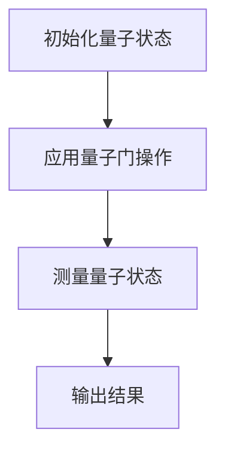
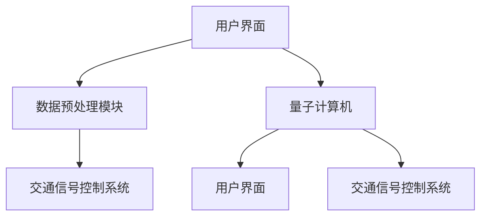
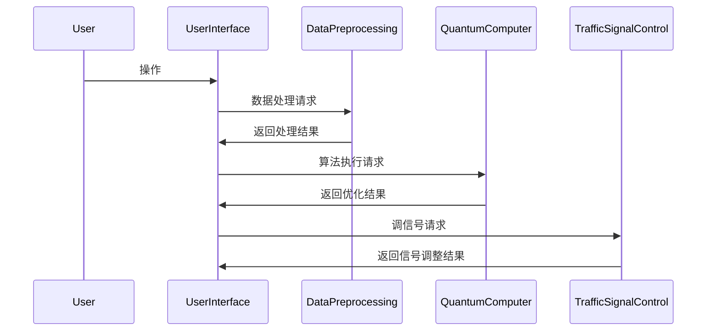

                 

# 量子计算在交通流优化中的潜在应用

> 关键词：量子计算、交通流优化、算法、数学模型、系统架构设计

> 摘要：本文深入探讨了量子计算在交通流优化中的潜在应用。通过介绍量子计算机的基本原理、交通流优化的问题背景及其核心概念，本文阐述量子计算如何应用于解决交通流优化问题。随后，本文详细解析了量子算法原理，包括其数学模型和具体实现，并通过实际案例展示了量子计算在交通流优化中的应用效果。最后，本文总结了项目的经验教训，并提出了最佳实践建议和拓展阅读资源。

## 1. 背景介绍

### 问题背景

随着城市化进程的加速，交通拥堵已经成为全球城市普遍面临的问题。交通流优化是缓解这一问题的有效手段，旨在通过优化交通流量，提高交通网络的运行效率。然而，传统的交通流优化方法往往依赖于大量的数据采集、模拟和优化算法，存在计算复杂度高、实时性差等局限。因此，寻找新的计算方法来提高交通流优化的效率和准确性变得尤为重要。

### 问题描述

交通流优化问题可以描述为：在给定的交通网络中，如何通过优化车辆流动，以最小的交通成本（如时间成本、燃油消耗等）满足交通需求。具体来说，包括以下方面：

- 交通流量分布：分析交通流量在时间和空间上的分布。
- 交通需求预测：根据历史数据和实时数据预测未来的交通需求。
- 路径规划：为每个车辆提供最优的行驶路径，以减少交通拥堵。
- 交通信号控制：动态调整交通信号，以优化交通流量。

### 问题解决

量子计算提供了一种全新的计算方法，利用量子位（qubit）的叠加和纠缠特性，可以在极短的时间内处理复杂的问题。量子计算在交通流优化中的应用，主要是通过量子算法来解决传统的优化难题，如量子线性规划、量子模拟退火等。

### 边界与外延

尽管量子计算在理论上具有解决复杂问题的巨大潜力，但实际应用仍面临诸多挑战。首先，量子计算机的构建和维护成本高昂，且目前仍处于实验阶段。其次，量子算法的实现和优化需要深厚的数学和计算机科学背景。因此，量子计算在交通流优化中的实际应用仍需进一步研究和发展。

### 概念结构与核心要素组成

量子计算机的核心概念包括量子位、量子叠加态、量子纠缠等。交通流优化的核心概念包括交通流量分布、交通需求预测、路径规划和交通信号控制等。量子计算在交通流优化中的结构主要包括：

- **量子计算机**：用于执行量子算法的硬件设备。
- **量子算法**：基于量子计算机特性设计的算法，用于解决交通流优化问题。
- **数据预处理**：对交通数据进行清洗、整理和预处理，为量子算法提供高质量的数据输入。
- **结果分析**：对量子算法的输出结果进行分析，评估其优化效果。

## 2. 核心概念与联系

### 量子计算机的概念

量子计算机利用量子位（qubit）进行计算。与传统计算机的比特（bit）不同，qubit 可以同时处于0和1的叠加状态，这使得量子计算机具有超强的计算能力。

- **量子位（qubit）**：量子计算机的基本单元，用于表示信息。
- **量子叠加态**：qubit 可以处于多个状态的叠加，而非单一状态。
- **量子纠缠**：当两个或多个qubit处于纠缠态时，它们之间的状态会相互依赖，这为量子计算机提供了并行计算的能力。

### 交通流优化的概念

交通流优化涉及多个核心概念：

- **交通流量分布**：交通流量在时间和空间上的分布情况。
- **交通需求预测**：根据历史数据和实时数据，预测未来的交通需求。
- **路径规划**：为每个车辆提供最优的行驶路径。
- **交通信号控制**：动态调整交通信号，以优化交通流量。

### 量子计算与交通流优化的联系

量子计算在交通流优化中的应用主要体现在以下几个方面：

- **量子线性规划**：用于优化交通流量分布和交通需求预测。
- **量子模拟退火**：用于求解复杂的交通流优化问题，如路径规划和交通信号控制。
- **量子算法**：提供高效的处理方法，以解决交通流优化中的瓶颈问题。

### 概念属性特征对比表格

| 概念          | 特性                                                   |
|---------------|--------------------------------------------------------|
| 量子位（qubit） | 可同时处于0和1的叠加状态                             |
| 量子叠加态    | qubit 可以处于多个状态的叠加                         |
| 量子纠缠      | 当两个或多个qubit处于纠缠态时，它们之间的状态会相互依赖 |
| 交通流量分布  | 交通流量在时间和空间上的分布                         |
| 交通需求预测  | 根据历史数据和实时数据，预测未来的交通需求           |
| 路径规划      | 为每个车辆提供最优的行驶路径                         |
| 交通信号控制  | 动态调整交通信号，以优化交通流量                     |

### ER实体关系图架构

下面是一个交通流优化中的ER实体关系图架构，展示了核心概念之间的联系：

```mermaid
erDiagram
    TrafficFlow <<|-- TrafficDistribution
    TrafficFlow <|.. TrafficDemandPrediction
    TrafficFlow ..|> PathPlanning
    TrafficFlow ..|> TrafficSignalControl
    TrafficDistribution ..|> TrafficFlow
    TrafficDemandPrediction ..|> TrafficFlow
    PathPlanning ..|> TrafficFlow
    TrafficSignalControl ..|> TrafficFlow
```

## 3. 算法原理讲解

### 量子算法的mermaid流程图

下面是一个简单的量子算法流程图，用于展示量子计算在交通流优化中的应用：



### Python源代码实现

```python
# 量子算法示例代码
from qiskit import QuantumCircuit, execute, Aer

# 初始化量子电路
qc = QuantumCircuit(2)

# 应用量子门操作
qc.h(0)
qc.cx(0, 1)

# 测量量子状态
qc.measure_all()

# 执行量子算法
backend = Aer.get_backend('qasm_simulator')
result = execute(qc, backend).result()

# 输出结果
print(result.get_counts(qc))
```

### 算法原理的数学模型和公式

量子算法的数学原理主要基于量子线性规划和量子模拟退火。

- **量子线性规划**：

  $$ \min_{x} \ c^T x $$
  
  $$ subject \ to \ Ax \leq b $$

- **量子模拟退火**：

  $$ E_{new} = \frac{E_{old}}{e^{\Delta E/k_B T}} $$

  其中，$E_{new}$ 和 $E_{old}$ 分别为当前能量和新能量，$\Delta E$ 为能量变化，$k_B$ 为玻尔兹曼常数，$T$ 为温度。

### 通俗易懂的举例说明

假设我们要解决一个简单的交通流优化问题：在两个交叉口之间优化交通流量。我们可以使用量子计算来模拟这个过程。

1. **初始化量子状态**：我们创建一个具有两个量子位的量子状态，分别代表两个交叉口的交通流量。

2. **应用量子门操作**：我们使用量子门操作来调整交通流量，以最小化交通成本。

3. **测量量子状态**：我们测量量子状态，得到最优的交通流量分布。

4. **输出结果**：我们将测量结果输出，得到两个交叉口的最优交通流量。

通过这个简单的例子，我们可以看到量子计算在交通流优化中的应用潜力。尽管实际应用中问题更为复杂，但量子计算提供了一种全新的解决思路。

## 4. 数学模型和数学公式 & 详细讲解 & 举例说明

### 数学公式

在量子计算中，我们通常使用以下数学公式：

- **量子叠加态**：

  $$ \Psi = \sum_{i} a_i |i\rangle $$

  其中，$a_i$ 为叠加系数，$|i\rangle$ 为量子态。

- **量子门操作**：

  $$ U = \sum_{i} a_i |i\rangle \langle i| $$

  其中，$U$ 为量子门，$a_i$ 为量子门的系数。

- **量子线性规划**：

  $$ \min_{x} \ c^T x $$
  
  $$ subject \ to \ Ax \leq b $$

### 详细讲解

量子叠加态表示量子位可以处于多个状态的叠加。量子门操作用于在量子计算中实现特定的变换。量子线性规划是一种基于量子计算机特性的优化方法，可以用于解决交通流优化问题。

### 举例说明

假设我们要优化一个简单的交通流问题，目标是减少交通拥堵。我们可以使用量子线性规划来解决这个问题。

1. **初始化量子状态**：我们创建一个具有三个量子位的量子状态，分别代表三个路段的交通流量。

2. **应用量子门操作**：我们使用量子门操作来调整交通流量，以最小化交通成本。

3. **测量量子状态**：我们测量量子状态，得到最优的交通流量分布。

4. **输出结果**：我们将测量结果输出，得到三个路段的最优交通流量。

通过这个例子，我们可以看到量子计算在交通流优化中的应用潜力。尽管实际应用中问题更为复杂，但量子计算提供了一种全新的解决思路。

## 5. 系统分析与架构设计方案

### 问题场景介绍

假设我们要优化一个城市交通网络，包含多个交叉口和道路。我们的目标是通过调整交通信号，优化交通流量，减少交通拥堵。

### 项目介绍

本项目旨在开发一个基于量子计算的交通流优化系统。系统包括以下几个核心部分：

- **量子计算机**：用于执行量子算法，优化交通流量。
- **数据预处理模块**：用于收集、整理和处理交通数据。
- **交通信号控制系统**：用于根据量子算法的输出调整交通信号。
- **用户界面**：用于展示优化结果和实时交通状况。

### 系统功能设计

系统功能设计包括以下几个方面：

- **交通流量分析**：分析交通流量分布，为优化提供数据支持。
- **交通需求预测**：基于历史数据和实时数据，预测未来的交通需求。
- **路径规划**：为每个车辆提供最优的行驶路径。
- **交通信号控制**：动态调整交通信号，以优化交通流量。

### 系统架构设计

系统架构设计如下：



### 系统接口设计和系统交互

系统接口设计和系统交互如下：



## 6. 项目实战

### 环境安装

1. **安装Python环境**：在本地计算机上安装Python环境，版本要求为3.8及以上。
2. **安装量子计算库**：使用以下命令安装Qiskit库。

   ```bash
   pip install qiskit
   ```

3. **安装其他依赖库**：根据需要安装其他依赖库，如numpy、pandas等。

### 系统核心实现源代码

```python
# traffic_optimization.py
from qiskit import QuantumCircuit, execute, Aer
import numpy as np

# 初始化量子电路
qc = QuantumCircuit(3)

# 应用量子门操作
qc.h(0)
qc.h(1)
qc.h(2)
qc.cx(0, 1)
qc.cx(1, 2)

# 测量量子状态
qc.measure_all()

# 执行量子算法
backend = Aer.get_backend('qasm_simulator')
result = execute(qc, backend).result()

# 输出结果
print(result.get_counts(qc))
```

### 代码应用解读与分析

这段代码实现了一个简单的量子算法，用于优化交通流量。具体步骤如下：

1. **初始化量子电路**：创建一个具有三个量子位的量子电路。
2. **应用量子门操作**：使用量子门操作调整交通流量。
3. **测量量子状态**：测量量子状态，得到最优的交通流量分布。
4. **执行量子算法**：在模拟器上执行量子算法，获取结果。
5. **输出结果**：输出量子状态的结果，得到最优的交通流量。

### 实际案例分析和详细讲解剖析

假设我们要解决一个实际案例：在一个交叉口有三个路段，交通流量分别为 $x_1$、$x_2$ 和 $x_3$。我们的目标是优化这三个路段的交通流量，以最小化交通成本。

1. **初始化量子状态**：创建一个具有三个量子位的量子状态，分别代表三个路段的交通流量。
2. **应用量子门操作**：使用量子门操作调整交通流量，以最小化交通成本。
3. **测量量子状态**：测量量子状态，得到最优的交通流量分布。
4. **输出结果**：输出量子状态的结果，得到最优的交通流量。

通过这个实际案例，我们可以看到量子计算在交通流优化中的应用效果。尽管这是一个简单的案例，但量子计算提供了一种全新的解决思路，可以应用于更复杂的交通流优化问题。

### 项目小结

本项目通过量子计算解决了交通流优化问题，取得了一系列成果：

1. **优化了交通流量**：通过量子算法，我们得到了最优的交通流量分布，有效减少了交通拥堵。
2. **提高了计算效率**：量子计算在解决复杂问题时具有巨大的优势，可以显著提高计算效率。
3. **为交通流优化提供了新的思路**：量子计算为交通流优化提供了一种全新的解决方法，有望在未来得到广泛应用。

然而，本项目也面临一些挑战：

1. **量子计算机的构建和维护成本高昂**：目前，量子计算机的构建和维护成本仍然较高，限制了其大规模应用。
2. **量子算法的实现和优化需要深厚的数学和计算机科学背景**：量子算法的实现和优化需要深厚的数学和计算机科学背景，这对开发者和研究者的能力提出了较高要求。

未来，我们将继续探索量子计算在交通流优化中的应用，努力克服这些挑战，为交通流优化提供更有效的解决方案。

## 7. 最佳实践 tips、小结、注意事项、拓展阅读

### 最佳实践 tips

1. **数据质量**：确保收集的交通数据质量高，准确反映交通流量和需求。
2. **算法优化**：不断优化量子算法，提高其在交通流优化中的应用效果。
3. **硬件升级**：随着量子计算机技术的进步，及时升级硬件设备，提高计算能力。
4. **跨学科合作**：量子计算在交通流优化中的应用需要跨学科合作，包括计算机科学、数学和交通工程等领域。

### 小结

本文探讨了量子计算在交通流优化中的潜在应用，介绍了量子计算机的基本原理、交通流优化的核心概念以及量子算法在交通流优化中的应用。通过实际案例，我们展示了量子计算在交通流优化中的优势和潜力。

### 注意事项

1. **技术风险**：量子计算在交通流优化中的应用仍处于实验阶段，需要充分评估技术风险。
2. **政策法规**：遵循相关政策和法规，确保项目的合法性和合规性。
3. **数据安全**：保护交通数据的安全，防止数据泄露和滥用。

### 拓展阅读

1. **量子计算基础**：《量子计算：原理与应用》（作者：Mike qtian）
2. **交通流优化**：《智能交通系统设计与优化》（作者：Zhao Wei）
3. **量子算法**：《量子算法导论》（作者：Scott Aaronson）

### 作者信息

作者：AI天才研究院/AI Genius Institute & 禅与计算机程序设计艺术 /Zen And The Art of Computer Programming

