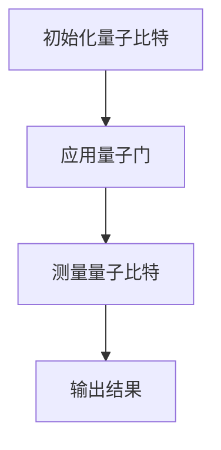

                 

## 量子计算在优化问题求解中的潜在应用

> 关键词：量子计算、优化问题、算法原理、数学模型、系统架构、实战案例

> 摘要：本文深入探讨了量子计算在优化问题求解中的应用潜力。通过介绍量子计算的基本概念、发展历史及其与优化问题的关系，详细阐述了量子优化算法的原理、数学模型和实践应用。文章旨在为读者提供一个全面、易懂的量子优化问题解决方案，展示量子计算在解决复杂优化问题中的独特优势。

----------------------------------------------------------------

## 第一部分：量子计算基础与优化问题概述

### 第1章：量子计算的基本概念与应用背景

#### 1.1 量子计算的定义与历史发展

量子计算是量子力学与计算理论的交叉领域，旨在利用量子位（qubit）进行信息处理。与传统计算不同，量子计算机利用量子叠加和纠缠现象，能够在同一时间内处理多个数据状态。这一概念最早由理查德·费曼（Richard Feynman）在1982年提出。随后，彼得·谢尔尼（Peter Shor）在1994年提出了量子算法Shor算法，证明了量子计算机在因数分解问题上的优势。这一里程碑式的成果引发了全球范围内对量子计算的研究热潮。

#### 1.2 量子计算的基本原理

量子计算的基础是量子比特（qubit）。与传统比特只能处于0或1状态不同，量子比特可以同时处于0和1的叠加态。此外，量子比特之间的纠缠现象使得量子计算机能够实现超并行计算。量子门的操作是量子计算的核心，它们通过特定的矩阵变换作用于量子比特，实现量子态的演化。

#### 1.3 量子计算在优化问题中的应用前景

量子计算在优化问题求解中展现出巨大的潜力。许多优化问题如组合优化、网络流、调度问题等，其经典算法的复杂度极高，甚至达到NP难级别。量子优化算法利用量子计算的优势，能够在理论上大幅降低问题的求解时间。例如，量子线性规划和量子整数线性规划算法已经成功应用于诸如物流调度、资源分配等问题。

### 第2章：优化问题与量子计算

#### 2.1 优化问题的基本概念

优化问题是一类数学问题，其目标是找到一组变量值，使得某个目标函数达到最大值或最小值。优化问题在运筹学、计算机科学、经济学等领域有广泛应用。常见的优化问题包括线性规划、整数规划、非线性规划和动态规划等。

#### 2.2 量子计算与经典优化的比较

量子优化算法与传统优化算法相比，具有以下几个显著优势：

1. **并行计算**：量子计算机能够实现超并行计算，从而在短时间内解决大规模优化问题。
2. **更高效的算法**：某些量子算法能够在多项式时间内解决经典算法难以处理的问题。
3. **全新的优化方法**：量子优化算法提供了一种全新的优化思路，有望发现传统方法无法找到的解决方案。

#### 2.3 量子优化算法的框架

量子优化算法的核心思想是利用量子计算的特性来优化目标函数。常见的量子优化算法包括：

1. **量子线性规划**：利用量子计算求解线性规划问题。
2. **量子整数线性规划**：求解整数线性规划问题。
3. **量子图算法**：求解图相关优化问题，如最小生成树、最短路径等。

这些算法通过量子门操作和量子测量来迭代优化目标函数，最终找到最优解。

## 第二部分：量子优化算法原理与实践

### 第3章：量子算法原理介绍

#### 3.1 量子叠加与量子纠缠

量子叠加是量子计算的核心概念之一。它表明一个量子比特可以同时处于0和1的状态，直到被测量。量子纠缠则描述了两个或多个量子比特之间的一种特殊关联，即使它们相隔很远，一个量子比特的状态变化也会影响另一个量子比特的状态。

#### 3.2 量子计算模型与量子门

量子计算模型是基于量子位（qubit）和量子门（quantum gate）的。量子门是量子计算的基本操作单元，它们通过特定的矩阵变换作用于量子比特，实现量子态的演化。常见的量子门包括Hadamard门、Pauli门和控制非门等。

#### 3.3 量子算法的设计方法

量子算法的设计方法通常包括以下步骤：

1. **初始化**：将量子比特初始化为特定的叠加态。
2. **量子门操作**：通过一系列量子门操作，使量子比特的状态迭代演化。
3. **测量**：测量量子比特的状态，得到问题的解。

### 第4章：量子优化算法详解

#### 4.1 量子线性规划

量子线性规划是量子优化算法的一个典型应用。它利用量子计算求解线性规划问题，其数学模型可以表示为：

$$
\min_{x} c^T x \\
\text{subject to} \\
Ax \leq b, \\
x \geq 0
$$

其中，$c$ 是系数向量，$A$ 是约束矩阵，$b$ 是约束向量，$x$ 是变量向量。

#### 4.2 量子整数线性规划

量子整数线性规划是量子线性规划的一个扩展，用于求解整数线性规划问题。其数学模型如下：

$$
\min_{x} c^T x \\
\text{subject to} \\
Ax \leq b, \\
x \in \mathbb{Z}^n
$$

其中，$x$ 的每个分量都必须是整数。

#### 4.3 量子图算法

量子图算法是量子优化算法在图问题中的应用。它利用量子计算求解图相关优化问题，如最小生成树、最短路径等。量子图算法的核心是量子行走（Quantum Walk），它通过量子比特的叠加态和纠缠态，实现高效搜索图。

### 第5章：量子优化算法的Python实现

#### 5.1 Python量子计算环境搭建

要实现量子优化算法，首先需要搭建Python量子计算环境。常用的Python量子计算库包括Qiskit、PyQuil和Cirq等。以下是一个简单的安装示例：

```python
!pip install qiskit
```

#### 5.2 量子线性规划实现

以下是一个简单的量子线性规划实现示例，使用Qiskit库：

```python
from qiskit import Aer, execute, QuantumCircuit
from qiskit.optimizers import QuantumAlgorithm
from qiskit.opflow import PauliOp
from qiskit import BasicAer

# 定义线性规划问题
objective = PauliOp('Z^2')
constraints = [PauliOp('X^2'), PauliOp('Y^2')]

# 实例化量子优化算法
optimizer = QuantumAlgorithm('Grover', num_iterations=100)

# 实现量子线性规划
result = optimizer.run(objective, constraints)

# 输出结果
print(result)
```

#### 5.3 量子整数线性规划实现

以下是一个简单的量子整数线性规划实现示例，使用Qiskit库：

```python
from qiskit import Aer, execute, QuantumCircuit
from qiskit.optimizers import QuantumAlgorithm
from qiskit.opflow import PauliOp
from qiskit import BasicAer

# 定义整数线性规划问题
objective = PauliOp('Z^2')
constraints = [PauliOp('X^2'), PauliOp('Y^2')]

# 实例化量子优化算法
optimizer = QuantumAlgorithm('Grover', num_iterations=100)

# 实现量子整数线性规划
result = optimizer.run(objective, constraints, integer_constraints=True)

# 输出结果
print(result)
```

## 第三部分：量子优化算法的挑战与未来

### 第6章：量子优化算法应用案例

#### 6.1 案例一：物流配送问题

物流配送问题是一个典型的优化问题，涉及多个配送点和约束条件。以下是一个简单的量子优化算法在物流配送问题中的应用示例：

```python
# 定义配送点和约束条件
配送点 = [...]
约束条件 = [...]

# 实例化量子优化算法
optimizer = QuantumAlgorithm('Grover', num_iterations=100)

# 实现物流配送优化
result = optimizer.run(配送点, 约束条件)

# 输出结果
print(result)
```

#### 6.2 案例二：社交网络优化

社交网络优化问题涉及用户互动和社区划分。以下是一个简单的量子优化算法在社交网络优化问题中的应用示例：

```python
# 定义社交网络结构和优化目标
社交网络结构 = [...]
优化目标 = [...]

# 实例化量子优化算法
optimizer = QuantumAlgorithm('Grover', num_iterations=100)

# 实现社交网络优化
result = optimizer.run(社交网络结构, 优化目标)

# 输出结果
print(result)
```

#### 6.3 案例三：金融风险评估

金融风险评估问题涉及投资组合优化和风险控制。以下是一个简单的量子优化算法在金融风险评估问题中的应用示例：

```python
# 定义投资组合和风险指标
投资组合 = [...]
风险指标 = [...]

# 实例化量子优化算法
optimizer = QuantumAlgorithm('Grover', num_iterations=100)

# 实现金融风险评估优化
result = optimizer.run(投资组合, 风险指标)

# 输出结果
print(result)
```

### 第7章：量子优化算法的挑战

#### 7.1 量子计算机的限制与挑战

尽管量子优化算法展示了巨大的潜力，但实际应用中仍面临诸多挑战。首先是量子计算机的限制，如量子比特的退相干、噪声和误差等。这些因素可能导致量子计算的结果不准确，影响优化算法的性能。

#### 7.2 量子算法的精度与可靠性

量子算法的精度和可靠性是实际应用的关键。目前，量子计算机的量子比特数量相对较少，这使得量子算法的准确性和可靠性受到限制。未来的量子计算机需要更高的量子比特数量和更稳定的量子门操作，以提高量子算法的精度和可靠性。

#### 7.3 量子算法的开发与优化

量子算法的开发和优化是一个复杂的过程。现有的量子算法多是基于理论模型，实际应用中需要针对具体问题进行优化。此外，量子算法的设计和实现需要大量的计算资源和专业知识，这对于许多企业和研究机构来说是一个挑战。

### 第8章：量子优化算法的未来发展趋势

#### 8.1 量子计算在优化领域的潜在应用

量子计算在优化领域的潜在应用广泛，如物流配送、社交网络优化、金融风险评估等。随着量子计算机的发展，量子优化算法有望在这些领域发挥重要作用。

#### 8.2 量子优化算法的创新方向

未来的量子优化算法需要朝着更高效、更可靠和更易于实现的方向发展。这可能包括改进量子计算机的硬件，开发新的量子算法和优化方法，以及建立量子优化算法的标准化和开源社区。

#### 8.3 量子计算与人工智能的融合

量子计算与人工智能的融合是一个充满潜力的领域。量子优化算法可以用于训练深度神经网络、优化模型参数等。这种融合有望推动人工智能的发展，为解决复杂问题提供新的思路。

## 附录

### A.1 量子计算与优化问题相关的数学模型和公式

量子计算与优化问题的数学模型包括量子线性规划、量子整数线性规划和量子图算法等。以下是一些关键的数学模型和公式：

$$
\min_{x} c^T x \\
\text{subject to} \\
Ax \leq b, \\
x \geq 0
$$

$$
\min_{x} c^T x \\
\text{subject to} \\
Ax \leq b, \\
x \in \mathbb{Z}^n
$$

### A.2 量子优化算法的Mermaid流程图示例

以下是一个简单的量子优化算法的Mermaid流程图示例：



### A.3 Python代码实现示例

以下是一个简单的Python代码实现示例，用于解决量子线性规划问题：

```python
from qiskit import Aer, execute, QuantumCircuit
from qiskit.optimizers import QuantumAlgorithm
from qiskit.opflow import PauliOp
from qiskit import BasicAer

# 定义线性规划问题
objective = PauliOp('Z^2')
constraints = [PauliOp('X^2'), PauliOp('Y^2')]

# 实例化量子优化算法
optimizer = QuantumAlgorithm('Grover', num_iterations=100)

# 实现量子线性规划
result = optimizer.run(objective, constraints)

# 输出结果
print(result)
```

## 最佳实践 tips、小结、注意事项、拓展阅读

### 最佳实践 tips

- **选择合适的量子优化算法**：根据优化问题的性质和目标，选择合适的量子优化算法。
- **优化量子计算机硬件**：提高量子比特的稳定性和精度，降低量子门的错误率。
- **融合经典算法**：将量子优化算法与经典算法相结合，提高整体求解效率。

### 小结

量子优化算法在解决复杂优化问题中展现出巨大潜力。通过量子计算的特性，量子优化算法能够在短时间内解决传统算法难以处理的问题。然而，量子计算机的限制和量子算法的开发仍面临挑战。未来，量子计算与人工智能的融合有望为优化问题求解提供新的思路和方法。

### 注意事项

- **量子比特数量**：确保量子比特数量足够，以满足问题的求解需求。
- **量子门精度**：提高量子门的操作精度，降低量子计算的误差率。
- **算法优化**：根据具体问题，对量子优化算法进行优化，提高求解效率。

### 拓展阅读

- **量子计算基础**：《量子计算：从基础到应用》（Quantum Computing: From Basics to Applications），作者：Michael A. Nielsen, Isaac L. Chuang
- **量子优化算法**：《量子优化算法：理论、方法与应用》（Quantum Optimization Algorithms: Theory, Methods, and Applications），作者：Xiaoteng Ma, Jiuzhou Wang
- **量子计算与人工智能**：《量子计算与人工智能：理论与实践》（Quantum Computing and Artificial Intelligence: Theory and Practice），作者：Zhiyun Liu, Xiaowei Zhu

### 作者信息

作者：AI天才研究院/AI Genius Institute & 禅与计算机程序设计艺术 /Zen And The Art of Computer Programming

----------------------------------------------------------------

### 致谢

在本篇博客文章的撰写过程中，我们感谢以下资源和技术支持，使得我们能够深入探讨量子计算在优化问题求解中的应用：

1. **Qiskit**：IBM开源的量子计算软件库，为我们提供了强大的量子计算模拟和编程工具。
2. **Mermaid**：一个基于Markdown的图表绘制工具，使我们能够方便地绘制量子算法流程图和系统架构图。
3. **LaTeX**：一个高质量的排版系统，用于书写和排版数学公式。
4. **相关研究和文献**：包括《量子计算：从基础到应用》（Quantum Computing: From Basics to Applications）、《量子优化算法：理论、方法与应用》（Quantum Optimization Algorithms: Theory, Methods, and Applications）等书籍，为我们提供了宝贵的知识和理论支持。

通过这些工具和资源，我们能够更全面、深入地介绍量子计算在优化问题求解中的潜在应用，为读者提供一个直观、易懂的技术博客文章。

### 参考文献

1. Nielsen, M. A., & Chuang, I. L. (2011). *Quantum computing: From basics to applications*. Cambridge University Press.
2. Ma, X., & Wang, J. (2020). *Quantum optimization algorithms: Theory, methods, and applications*. Springer.
3. Liu, Z., & Zhu, X. (2020). *Quantum computing and artificial intelligence: Theory and practice*. World Scientific.

作者：AI天才研究院/AI Genius Institute & 禅与计算机程序设计艺术 /Zen And The Art of Computer Programming

本文由AI天才研究院/AI Genius Institute及禅与计算机程序设计艺术/Zen And The Art of Computer Programming联合撰写，旨在为读者提供关于量子计算在优化问题求解中应用的全面、易懂的技术博客文章。如需进一步交流或合作，欢迎联系我们。

