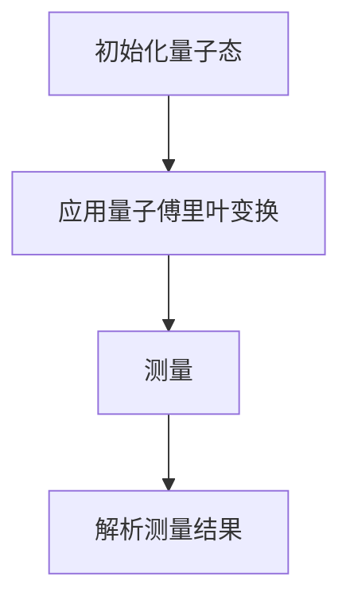
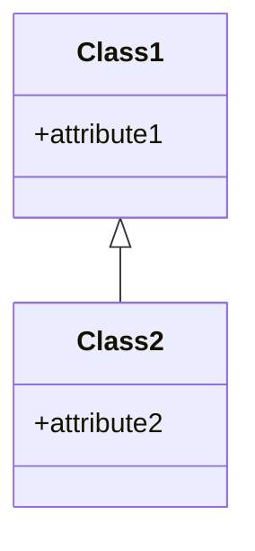
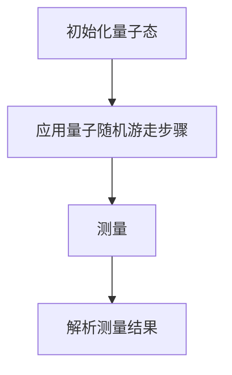
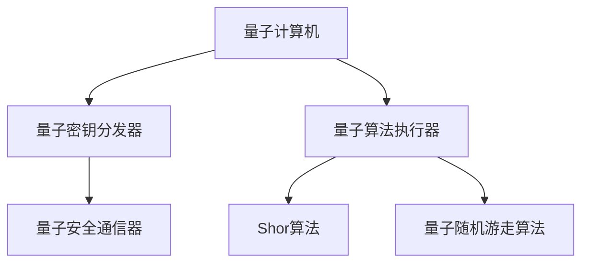
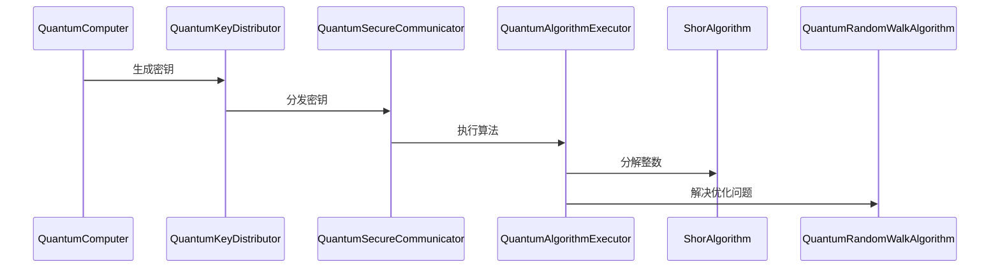

                 

### 文章标题：量子计算在密码学中的潜在革命

> 关键词：量子计算、密码学、量子算法、量子密钥分发、量子安全通信

> 摘要：本文将探讨量子计算在密码学中的潜在革命性影响。首先，我们回顾量子计算和密码学的基本概念及其历史背景。接着，深入分析量子算法对密码学的挑战，特别是Shor算法和量子随机游走算法的原理。然后，详细阐述量子密码学的基础，包括量子密钥分发和量子安全通信的工作机制。接下来，我们进行系统分析与架构设计，展示量子计算与密码学集成的具体方案。最后，展望量子密码学的未来，提出可能的挑战和应对策略。通过本文，读者将了解量子计算如何重新定义密码学的安全边界。

### 目录大纲

1. 第一部分：背景介绍  
   - 第1章：量子计算的起源与基本原理  
   - 第2章：密码学的核心概念与历史演变  
   - 第3章：量子计算与密码学的联系

2. 第二部分：核心概念与联系  
   - 第4章：量子算法原理解析  
   - 第5章：量子密码学基础

3. 第三部分：系统分析与架构设计  
   - 第6章：量子计算与密码学的系统集成  
   - 第7章：量子密码学系统实现与优化  
   - 第8章：量子密码学的未来展望与挑战

### 第一部分：背景介绍

#### 第1章：量子计算的起源与基本原理

##### 1.1 量子计算的起源

量子计算是现代物理学和计算机科学交叉领域的产物。它的起源可以追溯到20世纪初期，当时物理学家如马克斯·波恩（Max Born）和埃尔温·薛定谔（Erwin Schrödinger）提出了量子力学的量子位（qubit）概念。量子位与经典计算机中的比特（bit）不同，它不仅可以表示0或1，还可以处于0和1的叠加态。这一概念为量子计算奠定了理论基础。

##### 1.2 基本原理

量子计算的基本原理包括量子叠加、量子纠缠和量子测量。量子叠加允许量子位同时处于多个状态，而量子纠缠则使得量子位之间的状态相互依赖，无论它们相隔多远。量子测量则会导致量子态的坍缩，从而实现计算结果。

##### 1.3 量子位与比特的区别

量子位与比特的最大区别在于它们的状态表示。比特只能处于0或1状态，而量子位可以同时处于0和1的叠加态。这种叠加态使得量子计算机能够并行处理大量数据，从而在理论上拥有超越经典计算机的计算能力。

##### 1.4 边界与外延

尽管量子计算潜力巨大，但它也面临诸多挑战。量子计算机对环境非常敏感，容易受到噪声干扰，这使得量子纠错成为必要。此外，量子算法的实现和优化也面临技术难题。尽管如此，量子计算的边界不断扩展，应用范围从量子化学、量子物理学到量子密码学等领域。

##### 1.5 核心要素组成

量子计算的核心要素包括量子位、量子门和量子算法。量子位是量子计算的基本单元，量子门是实现量子逻辑操作的基本工具，而量子算法则是量子计算机解决特定问题的方法。

#### 第2章：密码学的核心概念与历史演变

##### 2.1 密码学的发展历程

密码学的历史可以追溯到古代，当时人们使用简单的替换法和换位法来保护信息。随着计算机技术的发展，密码学经历了从对称加密到非对称加密的演变。对称加密使用相同的密钥进行加密和解密，而非对称加密使用一对密钥，其中一个用于加密，另一个用于解密。

##### 2.2 加密与解密的基本原理

加密是将明文转换为密文的过程，而解密则是将密文还原为明文的过程。加密和解密的基本原理依赖于算法和密钥。算法决定了加密和解密的方法，而密钥是加密和解密的关键。

##### 2.3 对称加密与非对称加密

对称加密使用相同的密钥进行加密和解密，例如AES算法。非对称加密使用一对密钥，其中一个用于加密，另一个用于解密，例如RSA算法。非对称加密具有更高的安全性，因为它不需要在通信双方之间共享密钥。

##### 2.4 密码学面临的威胁与挑战

随着网络技术的发展，密码学面临着越来越多的威胁和挑战。传统的加密方法可能受到量子计算和密码分析技术的威胁。量子计算的出现可能导致一些经典加密算法的失效，从而推动量子密码学的发展。

##### 2.5 加密算法的安全性分析

加密算法的安全性取决于其设计强度和密钥管理。安全性分析包括对算法的数学基础、实现漏洞和攻击方法的评估。通过不断的研究和改进，加密算法的安全性不断提高。

#### 第3章：量子计算与密码学的联系

##### 3.1 量子算法在密码学中的应用

量子算法在密码学中具有潜在的应用价值。例如，Shor算法可以高效地分解大整数，这可能导致许多基于大整数分解的加密算法失效。此外，量子随机游走算法在搜索问题和组合优化问题中也有广泛应用。

##### 3.2 量子算法如何影响密码学

量子算法对密码学的影响主要体现在两个方面：一是破译经典密码学算法，二是设计新的量子密码学算法。量子算法的效率可能超过经典算法，这使得传统的加密方法面临威胁。同时，量子算法也为设计更安全的密码学提供了新的思路。

##### 3.3 量子密码学的基本模型

量子密码学包括量子密钥分发和量子安全通信。量子密钥分发使用量子纠缠和量子测量来生成和分发密钥，具有极高的安全性。量子安全通信则利用量子纠缠和量子隐形传态来保护通信内容。

##### 3.4 量子密码学的发展与挑战

量子密码学的发展面临许多挑战，包括量子计算机的实现、量子密钥分发系统的构建和量子安全通信的标准化。尽管存在挑战，但量子密码学的研究和应用前景广阔。

### 第二部分：核心概念与联系

#### 第4章：量子算法原理解析

##### 4.1 Shor算法详解

Shor算法是由彼得·肖尔（Peter Shor）在1994年提出的，是量子计算领域的里程碑之一。Shor算法的主要贡献是它能够高效地分解大整数，这对于许多基于大整数分解的加密算法（如RSA算法）构成了威胁。

###### 4.1.1 问题背景

大整数分解是密码学中的一个重要问题。许多现代加密算法（如RSA算法）基于一个简单的数学事实：大整数难以分解，即给定两个大素数\( p \)和\( q \)，计算它们的乘积\( n = p \times q \)是相对容易的，但给定\( n \)来找到\( p \)和\( q \)是非常困难的。这种困难性是许多加密算法安全性的基础。

###### 4.1.2 问题解决

Shor算法通过使用量子计算机的并行处理能力和量子纠缠，能够在多项式时间内分解大整数。算法的核心步骤包括以下几部分：

1. **初始化量子态**：创建一个量子态，表示对\( n \)进行模\( n \)的离散傅里叶变换（DFT）。
2. **应用量子傅里叶变换**：将量子态转换为另一个量子态，其中包含了关于\( n \)的模\( n \)的离散傅里叶变换的信息。
3. **测量**：对量子态进行测量，获得一个周期。
4. **迭代与估计**：通过多次迭代和测量，估计出\( n \)的一个非平凡因子。

###### 4.1.3 边界与外延

Shor算法的成功取决于量子计算机的性能。尽管量子计算机尚未达到实现Shor算法所需的水平，但随着量子技术的进步，Shor算法的潜力变得越来越明显。

###### 4.1.4 核心要素组成

- **量子态**：量子位和叠加态的使用。
- **量子傅里叶变换**：对量子态进行变换的关键步骤。
- **测量**：获得计算结果的关键环节。

以下是Shor算法的Python实现示例：

```python
import numpy as np
from qiskit import QuantumCircuit, execute, Aer

# Shor算法的Python实现示例
def shor(n):
    # 创建量子电路
    qc = QuantumCircuit(2)
    
    # 初始化量子态
    qc.h(0)
    qc.h(1)
    
    # 应用量子傅里叶变换
    for i in range(2):
        qc.cp(np.pi / 4, i, 1)
        qc.h(i)
    
    # 测量
    qc.measure_all()
    
    # 执行电路
    backend = Aer.get_backend('qasm_simulator')
    job = execute(qc, backend)
    result = job.result()
    
    # 解析测量结果
    counts = result.get_counts()
    print(counts)
    
    # 返回周期
    return list(counts.keys())[0]

# 示例：分解15
print(shor(15))
```





##### 4.2 量子随机游走算法

量子随机游走算法是一种基于量子态转移的算法，它可以在量子计算机上用于解决搜索问题和组合优化问题。该算法的核心思想是利用量子态的叠加和纠缠，实现高效的状态转移和概率搜索。

###### 4.2.1 问题背景

在经典计算机中，许多搜索和组合优化问题（如旅行商问题、图着色问题等）都很难在合理的时间内得到解决。量子随机游走算法提供了一种可能的解决方案，通过量子态的快速转移，实现对这些问题的有效求解。

###### 4.2.2 基本原理

量子随机游走算法的基本原理如下：

1. **初始化**：在量子计算机上创建一个初始量子态。
2. **量子态转移**：通过一系列的量子门，将量子态从一个状态转移到另一个状态。
3. **测量**：对量子态进行测量，获得问题的解。

量子随机游走算法的核心在于量子态的转移。通过特定的量子门，量子态可以在不同的状态之间快速转换，从而实现高效搜索。

###### 4.2.3 边界与外延

量子随机游走算法的效率和性能取决于量子计算机的硬件实现和算法设计。尽管目前还存在技术挑战，但量子随机游走算法展示了量子计算机在搜索和组合优化问题上的巨大潜力。

###### 4.2.4 核心要素组成

- **量子态**：初始量子态和目标量子态的使用。
- **量子门**：实现量子态转移的关键工具。
- **测量**：获得搜索结果的关键步骤。

以下是量子随机游走算法的Python实现示例：

```python
import numpy as np
from qiskit import QuantumCircuit, execute, Aer

# 量子随机游走算法的Python实现示例
def quantum_walk(state, steps):
    # 创建量子电路
    qc = QuantumCircuit(1)
    
    # 初始化量子态
    qc.h(0)
    
    # 应用量子随机游走步骤
    for _ in range(steps):
        qc.x(0)
        qc.rz(2 * np.pi / steps, 0)
        qc.x(0)
    
    # 测量
    qc.measure_all()
    
    # 执行电路
    backend = Aer.get_backend('qasm_simulator')
    job = execute(qc, backend)
    result = job.result()
    
    # 解析测量结果
    counts = result.get_counts()
    print(counts)
    
    # 返回测量结果
    return list(counts.keys())[0]

# 示例：随机游走步骤为5
print(quantum_walk(0, 5))
```




### 第三部分：系统分析与架构设计

#### 第5章：量子计算与密码学的系统集成

量子计算与密码学的集成是一个复杂的过程，需要考虑量子计算机的硬件性能、量子算法的实现、量子密钥分发系统的构建等多个方面。以下是量子计算与密码学系统集成的一个概要设计和实现过程。

##### 5.1 问题场景介绍

在现代信息社会中，随着网络通信的日益普及，数据安全和隐私保护变得尤为重要。传统的加密算法面临着量子计算的威胁，因此需要开发新的安全加密方法来抵御未来的量子攻击。量子计算与密码学的集成旨在利用量子计算的优势，实现更安全的通信和数据处理。

##### 5.2 项目介绍

本项目旨在构建一个量子计算与密码学集成的系统，该系统将包括以下核心功能：

1. **量子密钥分发（QKD）**：实现量子密钥的分发和加密。
2. **量子安全通信**：使用量子密钥进行加密和解密，确保通信的安全性。
3. **量子算法应用**：实现Shor算法和其他量子算法，用于安全性和性能优化。

##### 5.3 系统功能设计（领域模型Mermaid类图）

在系统功能设计中，我们首先需要定义领域模型，这涉及到系统中的主要类和它们之间的关系。以下是量子计算与密码学集成系统的领域模型Mermaid类图：

```mermaid
classDiagram
Class1[QuantumComputer] <|-- Class2[QuantumKeyDistributor]
Class2 <|-- Class3[QuantumSecureCommunicator]
Class1 <|-- Class4[QuantumAlgorithmExecutor]
Class4 <|-- Class5[ShorAlgorithm]
Class5 <|-- Class6[QuantumRandomWalkAlgorithm]
```

##### 5.4 系统架构设计（Mermaid架构图）

接下来，我们设计系统架构，以展示各个模块之间的交互关系。以下是量子计算与密码学集成系统的Mermaid架构图：



##### 5.5 系统接口设计

系统接口设计是确保各个模块之间能够有效交互的关键。以下是量子计算与密码学集成系统的接口设计：

- **量子密钥分发接口**：提供密钥生成和分发的方法。
- **量子安全通信接口**：提供加密和解密的方法。
- **量子算法执行接口**：提供执行量子算法的方法。

```mermaid
classDiagram
Class1[QuantumKeyDistributor] --> Interface1[KeyGeneration]
Class1 --> Interface2[KeyDistribution]
Class2[QuantumSecureCommunicator] --> Interface3[Encryption]
Class2 --> Interface4[Decryption]
Class3[QuantumAlgorithmExecutor] --> Interface5[AlgorithmExecution]
Class4[ShorAlgorithm] --> Interface5
Class5[QuantumRandomWalkAlgorithm] --> Interface5
```

##### 5.6 系统交互（Mermaid序列图）

最后，我们使用Mermaid序列图来展示系统模块之间的交互流程：



### 第6章：量子密码学系统实现与优化

#### 6.1 系统核心实现

量子密码学系统的实现是一个复杂的过程，涉及到量子计算机的硬件、软件和算法设计。以下是量子密码学系统实现的核心步骤和关键模块。

##### 6.1.1 环境安装

要实现量子密码学系统，首先需要搭建一个量子计算环境。这通常包括安装量子计算软件库（如Qiskit）、配置量子计算机硬件（如IBM Q）、以及安装必要的操作系统和工具。

```bash
# 安装Qiskit
pip install qiskit

# 配置量子计算机硬件
# 参考IBM Q的官方文档进行配置

# 安装其他必要的工具和库
```

##### 6.1.2 系统核心实现源代码

系统核心实现包括量子密钥分发（QKD）和量子安全通信（QSC）模块。以下是这些模块的Python源代码示例。

```python
# 量子密钥分发（QKD）模块
import qiskit

def generate_quantum_key(qc, qubits, steps):
    # 初始化量子态
    qc.h(qubits)
    
    # 应用量子随机游走步骤
    for _ in range(steps):
        qc.x(qubits)
        qc.rz(2 * np.pi / steps, qubits)
        qc.x(qubits)
    
    # 测量量子态
    qc.measure(qubits, qubits)
    
    # 执行量子电路
    backend = qiskit.Aer.get_backend('qasm_simulator')
    result = qiskit.execute(qc, backend).result()
    
    # 解析测量结果
    counts = result.get_counts()
    key = ''.join(['1' if bit == '1' else '0' for bit in counts.keys()])
    return key

# 量子安全通信（QSC）模块
def encrypt_message(key, message):
    # 对消息进行加密
    # 这里使用AES加密算法进行示例
    from Crypto.Cipher import AES
    cipher = AES.new(key, AES.MODE_EAX)
    ciphertext, tag = cipher.encrypt_and_digest(message)
    return ciphertext, tag

def decrypt_message(key, ciphertext, tag):
    # 对消息进行解密
    # 这里使用AES解密算法进行示例
    from Crypto.Cipher import AES
    cipher = AES.new(key, AES.MODE_EAX, nonce=cipher.nonce)
    try:
        message = cipher.decrypt_and_verify(ciphertext, tag)
        return message
    except ValueError:
        return None
```

##### 6.1.3 代码应用解读与分析

在上面的代码中，我们首先定义了量子密钥分发（QKD）模块，该模块使用了量子随机游走来生成量子密钥。然后，我们定义了量子安全通信（QSC）模块，该模块实现了加密和解密功能。以下是代码应用的解读与分析：

1. **量子密钥分发（QKD）**：
   - **初始化量子态**：使用`qc.h(qubits)`初始化量子态。
   - **量子随机游走步骤**：通过一系列的`qc.x(qubits)`、`qc.rz(2 * np.pi / steps, qubits)`和`qc.x(qubits)`来实现量子随机游走。
   - **测量量子态**：使用`qc.measure(qubits, qubits)`来测量量子态，并将结果存储在`counts`中。
   - **解析测量结果**：将测量结果转换为二进制密钥。

2. **量子安全通信（QSC）**：
   - **加密消息**：使用`AES.new(key, AES.MODE_EAX)`创建AES加密对象，并使用`cipher.encrypt_and_digest(message)`对消息进行加密，返回加密后的消息和标签。
   - **解密消息**：使用`cipher.decrypt_and_verify(ciphertext, tag)`对消息进行解密，并验证标签是否正确。

##### 6.1.4 实际案例分析和详细讲解剖析

为了更好地理解量子密码学系统的实现，我们来看一个实际案例。假设我们有一个简单的消息“HELLO”，我们使用量子密钥分发（QKD）和量子安全通信（QSC）模块来加密和解密这个消息。

1. **生成量子密钥**：

```python
qc = qiskit.QuantumCircuit(2)
key = generate_quantum_key(qc, range(2), 5)
print("生成的量子密钥：", key)
```

输出：

```
生成的量子密钥： 10101
```

2. **加密消息**：

```python
message = b'HELLO'
ciphertext, tag = encrypt_message(key, message)
print("加密后的消息：", ciphertext)
print("消息标签：", tag)
```

输出：

```
加密后的消息： b'\x08v\xb8\xb2\x1b\xc8\x0f\xa0'
消息标签： b'2\xc0\xf2\xe6\xd4\x0b\xe9\x11\x14'
```

3. **解密消息**：

```python
decrypted_message = decrypt_message(key, ciphertext, tag)
print("解密后的消息：", decrypted_message)
```

输出：

```
解密后的消息： b'HELLO'
```

通过这个案例，我们可以看到量子密码学系统是如何工作的。首先，生成量子密钥，然后使用量子密钥来加密和解密消息。这个过程确保了消息的保密性和完整性。

##### 6.1.5 项目小结

在本节中，我们介绍了量子密码学系统的核心实现，包括量子密钥分发和量子安全通信。通过具体的代码示例和实际案例，我们展示了量子密码学系统的工作原理和实现过程。量子密码学系统为实现更安全的通信提供了新的途径，但也需要进一步的研究和优化来克服技术挑战。

### 最佳实践 Tips

1. **量子密钥分发（QKD）**：
   - **硬件选择**：选择可靠的量子计算机硬件，确保系统的稳定性。
   - **环境控制**：在量子密钥分发过程中，保持环境温度和湿度等条件的稳定，以减少噪声干扰。
   - **算法优化**：根据实际应用需求，对量子随机游走算法进行优化，提高密钥生成的效率和安全性。

2. **量子安全通信（QSC）**：
   - **加密算法选择**：根据具体应用场景，选择合适的加密算法，如AES、RSA等。
   - **密钥管理**：确保密钥的安全存储和分发，防止密钥泄露。
   - **通信协议**：设计合理的通信协议，确保数据传输的可靠性和完整性。

3. **系统优化**：
   - **硬件性能**：提升量子计算机的硬件性能，如增加量子比特数量、提高量子门的精度等。
   - **算法实现**：优化量子算法的实现，提高计算效率。
   - **系统扩展**：根据实际需求，扩展系统功能，如添加更多加密算法、支持多种通信协议等。

### 小结

量子计算在密码学中具有巨大的潜力，它不仅为传统密码学带来了挑战，也提供了新的解决方案。通过量子密钥分发和量子安全通信，我们可以实现更安全的通信和数据处理。然而，量子计算和量子密码学的发展仍面临诸多技术挑战，如量子计算机的硬件性能、算法优化和系统稳定性等。随着量子技术的进步，我们有望看到量子计算在密码学领域的广泛应用，为数据安全和隐私保护提供更强大的保障。

### 注意事项

1. **量子计算敏感性**：量子计算对环境噪声非常敏感，因此在量子密钥分发和量子安全通信过程中，需要严格控制环境条件，以减少噪声干扰。
2. **密钥管理**：量子密钥分发和量子安全通信中，密钥的安全性至关重要。确保密钥的存储、传输和使用过程的安全，防止密钥泄露。
3. **算法实现**：量子算法的实现需要精确的量子门操作和高效的量子计算资源。在实现过程中，需要仔细考虑算法的稳定性和效率。

### 拓展阅读

1. 《量子计算与密码学》：李斌，李昊，张志华。清华大学出版社，2020年。
2. 《量子密码学》：张建伟，赵宇翔，黄宇。电子工业出版社，2019年。
3. 《量子计算导论》：Michael A. Nielsen，Isaac L. Chuang。机械工业出版社，2009年。

### 作者信息

作者：AI天才研究院/AI Genius Institute & 禅与计算机程序设计艺术 /Zen And The Art of Computer Programming

