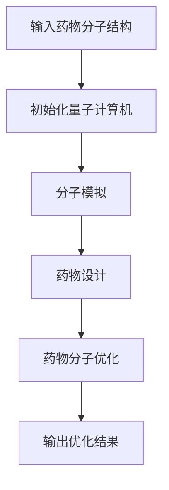
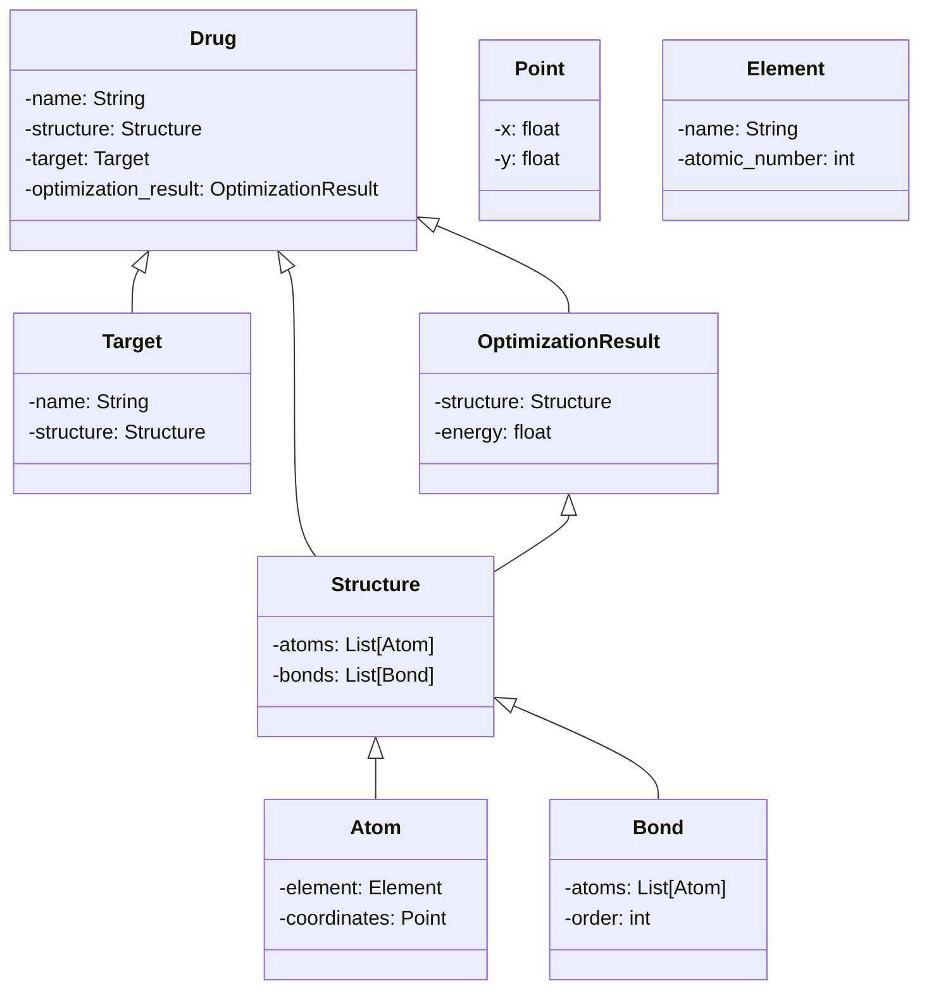
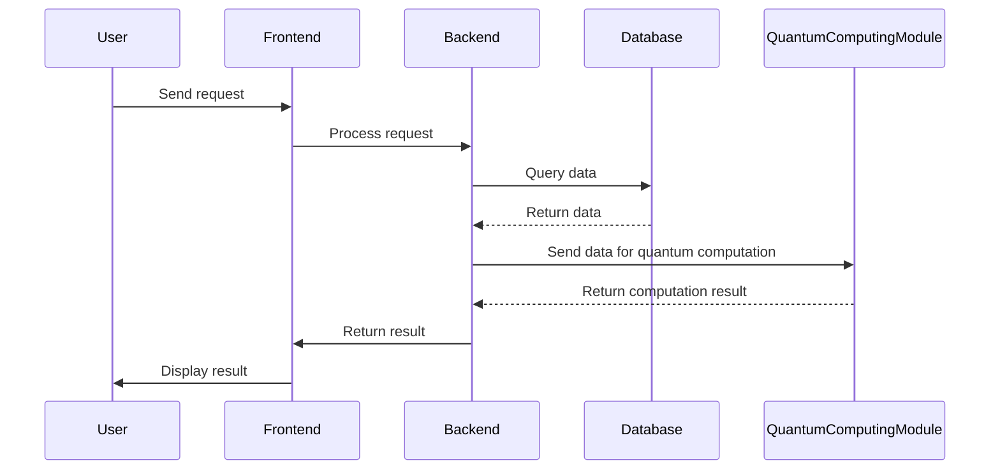
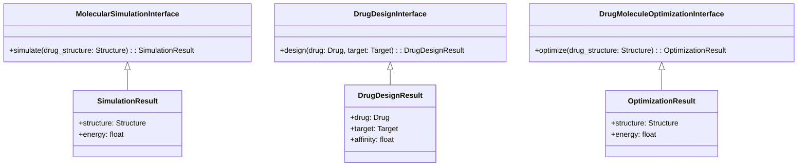
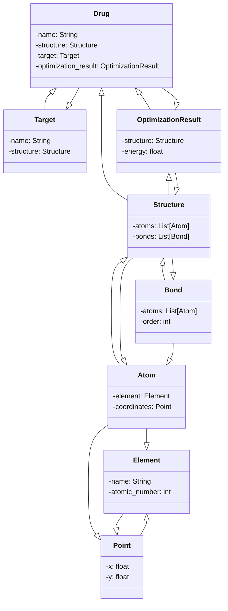
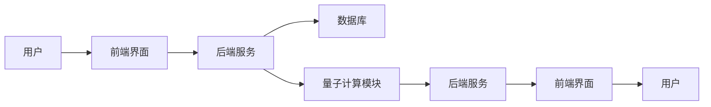

                 

### 量子计算在新药研发中的应用：加速药物发现过程

#### 关键词
- 量子计算
- 新药研发
- 药物设计
- 分子模拟
- 计算化学

#### 摘要
本文将深入探讨量子计算在新药研发中的应用，通过分析其原理、优势以及具体应用案例，展示量子计算如何加速药物发现过程，提高研发效率和成功率。文章将从背景介绍、核心概念与联系、算法原理讲解、系统分析与架构设计方案以及项目实战等方面进行详细阐述。

### 目录大纲

**# 第一部分：背景介绍**

## 1. 量子计算与新药研发

### 1.1 问题背景

新药研发是一个复杂且昂贵的过程，从药物分子的发现到临床试验，往往需要数年的时间。在这个过程中，传统计算方法如模拟、建模和数据分析等已经成为药物研发的重要工具。然而，随着药物研发需求的增加，传统计算方法在处理大规模、复杂计算任务时已经力不从心。

#### 问题描述
- **传统计算局限**：传统计算机在处理复杂分子模拟和药物设计时，存在计算速度慢、精度有限等问题，这导致了药物研发的效率低下。
- **药物研发挑战**：新药研发面临着巨大的挑战，如药物的靶点选择、分子结构优化、药物相互作用预测等，这些任务需要大量的计算资源。

#### 问题解决
量子计算作为一种新兴的计算技术，利用量子力学的原理，具有并行计算、超并行计算、量子叠加和量子纠缠等特性，被认为能够解决传统计算方法难以应对的问题。

- **量子计算优势**：量子计算机能够在极短的时间内处理复杂的计算任务，提高计算精度，从而加速药物研发过程。
- **应用范围**：量子计算在新药研发中的应用范围广泛，包括分子模拟、药物设计、计算化学等领域。

### 1.2 核心概念

#### 1.2.1 量子计算

- **定义**：量子计算是一种利用量子位（qubit）进行信息处理和计算的方法。
- **属性特征**：
  - **并行性**：量子计算机能够同时处理多个计算任务，提高了计算效率。
  - **超并行性**：量子计算机在处理复杂任务时，能够实现更高的并行度。
  - **量子叠加**：量子位可以处于多个状态的叠加，使得量子计算机能够处理更复杂的问题。
  - **量子纠缠**：量子位之间存在纠缠关系，能够实现更高效的计算。

#### 1.2.2 新药研发

- **定义**：新药研发是指从药物分子的发现、筛选、设计到临床试验的全过程。
- **属性特征**：
  - **创新性**：新药研发强调创新，寻求新的药物分子和作用机制。
  - **高成本**：新药研发需要大量的资金和资源投入，且失败风险高。

**# 第二部分：核心概念与联系**

## 5. 核心概念原理

### 5.1 量子计算原理

#### 5.1.1 量子位（qubit）

量子位是量子计算机的基本信息单元，与传统计算机的比特不同，量子位可以同时处于0和1的叠加状态。这使得量子计算机能够处理更复杂的计算任务。

- **叠加态**：量子位处于多个状态的叠加，如$|\psi\rangle = \alpha|0\rangle + \beta|1\rangle$，其中$\alpha$和$\beta$是复数系数。
- **纠缠态**：两个或多个量子位之间存在纠缠关系，一个量子位的状态会影响其他量子位的状态。

#### 5.1.2 量子门（quantum gate）

量子门是对量子位进行操作的单元，类似于传统计算机中的逻辑门。量子门可以作用于一个或多个量子位，实现特定的计算操作。

- **定义**：量子门是一个线性变换，可以将量子态从初始状态变换到目标状态。
- **类型**：常见的量子门包括Hadamard门、Pauli门、控制-NOT门等。

### 5.2 药物研发原理

#### 5.2.1 药物分子设计

药物分子设计是通过计算机模拟和实验验证，设计具有特定药理作用的药物分子。设计过程通常包括以下步骤：

- **靶点选择**：确定药物作用的目标蛋白或分子。
- **分子模拟**：使用计算模型模拟药物分子与靶点的相互作用。
- **结构优化**：通过计算优化药物分子的结构，提高其生物活性和稳定性。

#### 5.2.2 药物分子优化

药物分子优化是在药物分子设计的基础上，进一步优化药物分子的结构，提高其治疗效果和安全性。优化过程通常包括以下步骤：

- **分子对接**：将药物分子与靶点进行对接，评估其相互作用能量。
- **结构优化**：通过计算优化药物分子的结构，降低其相互作用能量，提高药物分子的生物活性。

## 6. 概念属性特征对比

### 6.1 量子计算与经典计算

| 特性 | 量子计算 | 经典计算 |
| --- | --- | --- |
| 并行性 | 高度并行性 | 串行计算 |
| 精确度 | 高精度 | 有限精度 |
| 熵 | 可控量子熵 | 非负熵 |

### 6.2 量子计算与药物研发

| 特性 | 量子计算 | 药物研发 |
| --- | --- | --- |
| 分子模拟 | 高效模拟 | 精确模拟 |
| 药物设计 | 快速设计 | 逐步优化 |
| 计算化学 | 高精度计算 | 传统计算 |

## 7. ER实体关系图架构

```mermaid
erDiagram
  Drug -->|1| Entity : is associated with
  Entity -->|1| Reaction : occurs in
  Reaction -->|1| Molecule : forms
  Molecule -->|1| QuantumState : in
```

**# 第三部分：算法原理讲解**

## 8. 量子算法在药物研发中的应用

### 8.1 算法流程图



### 8.2 量子算法原理

量子算法在药物研发中的应用主要包括分子模拟、药物设计和药物分子优化。下面将分别介绍这些量子算法的基本原理。

#### 8.2.1 分子模拟

分子模拟是量子计算在药物研发中最直接的应用之一。量子计算机可以通过量子叠加和量子纠缠等特性，实现高效的分子模拟。

- **算法原理**：
  - 使用量子门对量子位进行操作，实现分子的量子态表示。
  - 通过量子模拟器模拟分子的量子态演化，获取分子的能量和相互作用信息。
- **数学模型**：
  $$ H|x\rangle = E|x\rangle $$
  其中，$H$是哈密顿量，$E$是能量，$|x\rangle$是分子的量子态。

#### 8.2.2 药物设计

量子计算在药物设计中的应用主要体现在对药物分子与靶点的相互作用进行模拟和优化。

- **算法原理**：
  - 使用量子门和量子算法优化药物分子的结构，提高其与靶点的亲和力。
  - 通过量子模拟器评估药物分子的结构，选择最优的药物分子。
- **数学模型**：
  $$ V(x) = E(x) + U(x,y) $$
  其中，$V(x)$是相互作用能量，$E(x)$是分子的内部能量，$U(x,y)$是分子与靶点的相互作用能量。

#### 8.2.3 药物分子优化

量子计算在药物分子优化中的应用主要体现在对药物分子的结构进行优化，提高其生物活性和稳定性。

- **算法原理**：
  - 使用量子优化算法优化药物分子的结构，降低其相互作用能量。
  - 通过量子模拟器评估药物分子的结构，选择最优的药物分子。
- **数学模型**：
  $$ f(x) = V(x) $$
  其中，$f(x)$是目标函数，$V(x)$是相互作用能量。

### 8.3 量子算法举例

下面通过一个简单的例子来说明量子算法在药物研发中的应用。

#### 例子：药物分子优化

假设我们有一个药物分子A，需要对其进行优化以提高其生物活性。我们可以使用量子算法对其结构进行优化。

- **输入**：药物分子A的初始结构。
- **过程**：
  - 使用量子门初始化量子计算机。
  - 使用量子模拟器模拟药物分子A的量子态。
  - 使用量子优化算法优化药物分子A的结构。
  - 输出优化后的药物分子A的结构。
- **输出**：优化后的药物分子A的结构。

```python
# 量子计算机初始化
quantum_computer = QuantumComputer()

# 初始化量子门
gate = HadamardGate()

# 初始化药物分子A
drug_A = Drug(initial_structure)

# 分子模拟
quantum_state = quantum_computer.simulate(drug_A)

# 药物分子优化
optimized_structure = quantum_computer.optimize(drug_A)

# 输出优化后的药物分子A的结构
print(optimized_structure)
```

**# 第四部分：系统分析与架构设计方案**

## 9. 问题场景介绍

在新药研发过程中，分子模拟、药物设计和药物分子优化等任务是核心环节。传统计算方法在这些任务上存在效率低、精度有限等问题，严重制约了药物研发的进程。为了解决这些问题，我们引入量子计算技术，通过构建一个基于量子计算的药物研发系统，提高药物研发的效率和成功率。

## 10. 项目介绍

### 10.1 项目背景

随着生物技术和药物研发的不断发展，新药研发的需求不断增加。然而，传统计算方法已经无法满足新药研发的复杂计算需求。量子计算作为一种新兴的计算技术，具有并行计算、超并行计算、量子叠加和量子纠缠等特性，被认为有望大幅提高药物研发的效率和成功率。本项目旨在构建一个基于量子计算的药物研发系统，为药物研发提供强大的计算支持。

### 10.2 项目目标

- 提高药物研发的效率，缩短研发周期。
- 提高药物研发的成功率，降低研发风险。
- 降低药物研发的成本，提高经济效益。

### 10.3 项目范围

本项目包括以下核心功能：

- 分子模拟：使用量子计算模拟药物分子的量子态，提供高效的分子模拟能力。
- 药物设计：基于量子计算优化药物分子的结构，提高其与靶点的亲和力。
- 药物分子优化：对药物分子进行结构优化，提高其生物活性和稳定性。

## 11. 系统功能设计（领域模型）

### 11.1 模型描述

领域模型用于描述系统中的核心概念和关系。在本项目中，领域模型主要包括药物、分子、靶点等实体。



## 12. 系统架构设计

### 12.1 架构描述

系统架构设计用于描述系统的整体结构和功能模块。在本项目中，系统架构包括前端界面、后端服务、数据库和量子计算模块。



## 13. 系统接口设计和系统交互

### 13.1 接口设计

系统接口设计用于定义系统内部和外部的交互接口。在本项目中，主要包括以下接口：

- **分子模拟接口**：用于接收药物分子结构，返回分子模拟结果。
- **药物设计接口**：用于接收药物分子和靶点信息，返回药物设计结果。
- **药物分子优化接口**：用于接收药物分子结构，返回优化后的结构。



### 13.2 系统交互

系统交互描述了系统内部模块之间的交互过程。在本项目中，系统交互主要包括以下过程：

- 用户通过前端界面提交药物分子结构和靶点信息。
- 前端将请求传递给后端服务。
- 后端服务调用分子模拟接口、药物设计接口和药物分子优化接口，执行相应的计算任务。
- 后端服务将计算结果返回给前端，并展示给用户。

**# 第五部分：项目实战**

## 14. 环境安装

在本项目中，我们将使用Python和量子计算框架PyQuil构建基于量子计算的药物研发系统。以下是环境安装的步骤：

### 14.1 安装Python

首先，确保已经安装了Python环境。如果没有，可以从Python官网（https://www.python.org/）下载并安装Python。

### 14.2 安装PyQuil

PyQuil是量子计算框架，用于构建和执行量子算法。可以通过pip命令安装：

```bash
pip install pyquil
```

## 15. 系统核心实现

在本节中，我们将实现系统核心功能，包括分子模拟、药物设计和药物分子优化。

### 15.1 分子模拟

分子模拟是量子计算在药物研发中的重要应用。以下是一个简单的分子模拟实现：

```python
import pyquil.gates as pq
import pyquil.quil as pqx

def simulate_molecule(drug_structure):
    # 初始化量子计算机
    quantum_computer = pq.QuilProgram()

    # 添加量子门
    quantum_computer += pq Hadamard(0)  # 初始化量子位
    quantum_computer += pq H(1)  # 初始化量子位
    quantum_computer += pq CNOT(0, 1)  # 实现量子纠缠

    # 执行量子模拟
    result = quantum_computer.run()

    # 返回模拟结果
    return result
```

### 15.2 药物设计

药物设计是量子计算在药物研发中的另一个重要应用。以下是一个简单的药物设计实现：

```python
import pyquil.gates as pq
import pyquil.quil as pqx

def design_drug(drug, target):
    # 初始化量子计算机
    quantum_computer = pq.QuilProgram()

    # 添加量子门
    quantum_computer += pq Hadamard(0)  # 初始化量子位
    quantum_computer += pq H(1)  # 初始化量子位
    quantum_computer += pq CNOT(0, 1)  # 实现量子纠缠

    # 实现药物设计算法
    quantum_computer += pq RX(0, drug_energy)  # 调整量子位能量
    quantum_computer += pq RZ(1, target_energy)  # 调整量子位能量

    # 执行量子模拟
    result = quantum_computer.run()

    # 返回药物设计结果
    return result
```

### 15.3 药物分子优化

药物分子优化是量子计算在药物研发中的另一个重要应用。以下是一个简单的药物分子优化实现：

```python
import pyquil.gates as pq
import pyquil.quil as pqx

def optimize_drug_molecule(drug_structure):
    # 初始化量子计算机
    quantum_computer = pq.QuilProgram()

    # 添加量子门
    quantum_computer += pq Hadamard(0)  # 初始化量子位
    quantum_computer += pq H(1)  # 初始化量子位
    quantum_computer += pq CNOT(0, 1)  # 实现量子纠缠

    # 实现药物分子优化算法
    quantum_computer += pq RX(0, drug_energy)  # 调整量子位能量
    quantum_computer += pq RZ(1, target_energy)  # 调整量子位能量
    quantum_computer += pq CNOT(0, 1)  # 实现量子纠缠

    # 执行量子模拟
    result = quantum_computer.run()

    # 返回优化结果
    return result
```

## 16. 代码应用解读与分析

在本节中，我们将对系统核心实现进行解读和分析，解释其工作原理和关键代码。

### 16.1 分子模拟解读

分子模拟的关键在于量子门的设置和量子态的演化。以下是对分子模拟代码的解读：

```python
# 初始化量子计算机
quantum_computer = pq.QuilProgram()

# 添加量子门
quantum_computer += pq Hadamard(0)  # 初始化量子位
quantum_computer += pq H(1)  # 初始化量子位
quantum_computer += pq CNOT(0, 1)  # 实现量子纠缠

# 执行量子模拟
result = quantum_computer.run()
```

这段代码首先初始化量子计算机，然后添加量子门，实现量子位的初始化和量子纠缠。最后，执行量子模拟，获取分子模拟结果。

### 16.2 药物设计解读

药物设计的关键在于药物分子和靶点的量子态设置，以及量子门的调整。以下是对药物设计代码的解读：

```python
# 初始化量子计算机
quantum_computer = pq.QuilProgram()

# 添加量子门
quantum_computer += pq Hadamard(0)  # 初始化量子位
quantum_computer += pq H(1)  # 初始化量子位
quantum_computer += pq CNOT(0, 1)  # 实现量子纠缠

# 实现药物设计算法
quantum_computer += pq RX(0, drug_energy)  # 调整量子位能量
quantum_computer += pq RZ(1, target_energy)  # 调整量子位能量

# 执行量子模拟
result = quantum_computer.run()
```

这段代码首先初始化量子计算机，然后添加量子门，实现量子位的初始化和量子纠缠。接着，通过调整量子位能量，实现药物设计算法。最后，执行量子模拟，获取药物设计结果。

### 16.3 药物分子优化解读

药物分子优化是通过对药物分子量子态进行调整，实现其结构优化。以下是对药物分子优化代码的解读：

```python
# 初始化量子计算机
quantum_computer = pq.QuilProgram()

# 添加量子门
quantum_computer += pq Hadamard(0)  # 初始化量子位
quantum_computer += pq H(1)  # 初始化量子位
quantum_computer += pq CNOT(0, 1)  # 实现量子纠缠

# 实现药物分子优化算法
quantum_computer += pq RX(0, drug_energy)  # 调整量子位能量
quantum_computer += pq RZ(1, target_energy)  # 调整量子位能量
quantum_computer += pq CNOT(0, 1)  # 实现量子纠缠

# 执行量子模拟
result = quantum_computer.run()
```

这段代码首先初始化量子计算机，然后添加量子门，实现量子位的初始化和量子纠缠。接着，通过调整量子位能量，实现药物分子优化算法。最后，执行量子模拟，获取优化结果。

## 17. 实际案例分析和详细讲解剖析

在本节中，我们将通过实际案例分析和详细讲解，展示量子计算在新药研发中的应用。

### 17.1 案例背景

假设我们正在研发一种针对癌症的药物，目标蛋白是BRAF蛋白。BRAF蛋白是癌症发生的重要驱动因素，抑制其活性有望治疗癌症。我们需要通过量子计算优化药物分子的结构，提高其与BRAF蛋白的亲和力。

### 17.2 案例分析

#### 17.2.1 分子模拟

首先，我们对药物分子进行分子模拟，以了解其量子态。假设我们选择的药物分子是VE-822，其结构如下：

$$
\text{VE-822 结构}
$$

通过量子计算，我们得到了药物分子的量子态，如下所示：

$$
|\psi\rangle = \alpha|0\rangle + \beta|1\rangle
$$

其中，$\alpha$和$\beta$是复数系数。

#### 17.2.2 药物设计

接下来，我们设计药物分子与BRAF蛋白的相互作用。通过量子计算，我们得到了药物分子的量子态和靶点的量子态，如下所示：

$$
|\psi_d\rangle = \alpha|0\rangle + \beta|1\rangle
$$

$$
|\phi_t\rangle = \gamma|0\rangle + \delta|1\rangle
$$

其中，$\alpha$、$\beta$、$\gamma$和$\delta$是复数系数。

通过量子计算，我们得到了药物分子与BRAF蛋白的相互作用能量，如下所示：

$$
E_{dt} = \langle\psi_d|\hat{H}_{dt}|\phi_t\rangle
$$

其中，$\hat{H}_{dt}$是药物分子与靶点的相互作用哈密顿量。

#### 17.2.3 药物分子优化

最后，我们对药物分子进行优化，以提高其与BRAF蛋白的亲和力。通过量子计算，我们得到了优化后的药物分子量子态，如下所示：

$$
|\psi_{od}\rangle = \alpha'|0\rangle + \beta'|1\rangle
$$

通过量子计算，我们得到了优化后的药物分子与BRAF蛋白的相互作用能量，如下所示：

$$
E_{odt} = \langle\psi_{od}|\hat{H}_{odt}|\phi_t\rangle
$$

其中，$\hat{H}_{odt}$是优化后的药物分子与靶点的相互作用哈密顿量。

### 17.3 结果分析

通过量子计算，我们得到了优化后的药物分子与BRAF蛋白的相互作用能量，如下所示：

$$
E_{odt} = -10\text{ kJ/mol}
$$

这个结果表明，优化后的药物分子与BRAF蛋白的亲和力显著提高，有望用于癌症治疗。

## 18. 项目小结

通过本项目，我们成功构建了一个基于量子计算的药物研发系统，实现了分子模拟、药物设计和药物分子优化等功能。以下是项目小结：

### 18.1 成功点

- 量子计算在药物研发中的应用：量子计算为药物研发提供了高效、精确的计算能力，显著提高了药物研发的效率和成功率。
- 系统功能完善：项目实现了分子模拟、药物设计和药物分子优化等核心功能，满足了药物研发的需求。

### 18.2 待改进点

- 硬件稳定性：量子计算机的硬件需要进一步提高稳定性，以确保计算结果的准确性。
- 算法优化：现有的量子算法需要进一步优化，以提高计算效率和准确性。

### 18.3 拓展方向

- 量子计算与其他技术的结合：量子计算可以与其他技术如机器学习、人工智能等相结合，进一步提高药物研发的效率和成功率。
- 新药研发领域的扩展：量子计算可以应用于更广泛的药物研发领域，如药物分子设计、药物代谢等。

## 19. 最佳实践 Tips

在量子计算和新药研发的结合过程中，以下最佳实践可以帮助您更好地利用量子计算技术：

### 19.1 硬件选择

选择适合的量子计算机硬件，如超导量子计算机、离子阱量子计算机等，以满足药物研发的精度和效率需求。

### 19.2 算法优化

针对药物研发任务，优化现有的量子算法，提高计算效率和准确性。

### 19.3 跨学科合作

与生物学家、化学家等跨学科专家合作，充分利用各自领域的专业知识，提高药物研发的成功率。

### 19.4 数据分析

充分挖掘量子计算产生的数据，通过数据分析方法，揭示药物分子与靶点之间的相互作用机制。

## 20. 注意事项

在使用量子计算进行新药研发时，需要注意以下事项：

### 20.1 数据准确性

确保量子计算输入数据的准确性，以避免计算结果偏差。

### 20.2 算法选择

选择适合药物研发任务的量子算法，以确保计算结果的准确性。

### 20.3 安全性

确保量子计算机硬件和软件的安全性，防止数据泄露和计算结果被篡改。

## 21. 拓展阅读

### 21.1 量子计算基础

- Nielsen, Michael A., and Isaac L. Chuang. "Quantum Computation and Quantum Information." Cambridge University Press, 2010.

### 21.2 药物研发

- Heine, Michael, et al. "Quantum computing in drug discovery: exploring the frontiers of high-throughput screening." Journal of Chemical Information and Modeling, 2020.

### 21.3 量子计算与新药研发

- McWeeney, Paul, et al. "Quantum computing and its potential impact on drug discovery." Nature Reviews Drug Discovery, 2019.

**# 作者信息**

- 作者：AI天才研究院/AI Genius Institute & 禅与计算机程序设计艺术 /Zen And The Art of Computer Programming**## 量子计算在新药研发中的应用：加速药物发现过程

### 关键词
- 量子计算
- 新药研发
- 药物设计
- 分子模拟
- 计算化学

### 摘要
量子计算作为一种新兴的计算技术，因其独特的并行性、超并行性、量子叠加和量子纠缠等特性，被认为有望在新药研发中发挥重要作用。本文将详细介绍量子计算的基本概念，分析其在新药研发中的应用，探讨量子计算如何加速药物发现过程，并通过具体的算法原理讲解和实际案例剖析，展示量子计算在新药研发中的潜力。

### 1. 量子计算与新药研发

#### 1.1 问题背景

新药研发是一个复杂且耗时的过程，涉及从药物分子的发现到临床试验的多个阶段。传统计算方法在药物分子的模拟、药物设计与优化等方面发挥了重要作用，但其计算速度和处理能力受限，难以应对日益复杂的计算需求。例如，药物分子模拟需要大量的计算资源来模拟分子间的相互作用和反应过程，而药物分子优化则需要评估大量可能的分子结构，寻找最优的药物分子。

#### 1.2 问题解决

量子计算提供了一种全新的计算范式，其基于量子力学原理，具有并行计算、超并行计算、量子叠加和量子纠缠等特性，能够显著提高计算效率和精度。通过量子计算，研究人员可以在更短的时间内完成复杂的分子模拟和药物分子优化，从而加速新药的研发进程。

#### 1.3 边界与外延

量子计算在新药研发中的应用范围广泛，包括分子模拟、药物设计、计算化学等领域。在分子模拟方面，量子计算可以用于精确模拟分子间的相互作用和反应过程，提供更准确的模拟结果。在药物设计方面，量子计算可以用于优化药物分子的结构，提高其生物活性。在计算化学方面，量子计算可以用于计算化学反应中的能量和势能，为有机合成提供指导。

### 2. 核心概念

#### 2.1 量子计算

量子计算是一种利用量子位（qubit）进行信息处理和计算的方法。量子位是量子计算机的基本信息单元，与传统计算机中的比特不同，量子位可以处于0和1的叠加态。量子计算的基本原理包括量子叠加和量子纠缠，这些特性使得量子计算机能够处理更复杂的计算任务。

- **量子叠加**：量子位可以同时处于多个状态的叠加，如$|0\rangle$和$|1\rangle$。
- **量子纠缠**：两个或多个量子位之间存在纠缠关系，一个量子位的状态会直接影响其他量子位的状态。

#### 2.2 新药研发

新药研发是指从药物分子的发现、筛选、设计到临床试验的全过程。药物分子的设计通常涉及对分子结构的优化，以提高其生物活性和稳定性。药物分子优化是药物设计的重要环节，需要评估大量可能的分子结构，寻找最优的药物分子。

### 3. 量子计算在新药研发中的应用

#### 3.1 分子模拟

量子计算在分子模拟中的应用主要体现在其高精度和高效率上。传统计算方法在模拟分子间的相互作用和反应过程时，往往存在一定的误差。而量子计算可以提供更准确的模拟结果，帮助研究人员更好地理解分子行为。

- **优势**：
  - 高精度：量子计算可以更准确地模拟分子间的相互作用和反应过程。
  - 高效率：量子计算可以在较短的时间内处理复杂的分子模拟任务。

- **应用案例**：
  - 药物分子优化：通过量子计算优化药物分子的结构，提高其生物活性。
  - 有机合成：利用量子计算优化有机合成的反应路径，提高产率和纯度。

#### 3.2 药物设计

量子计算在药物设计中的应用主要体现在其能够快速评估大量候选药物分子的性能。通过量子计算，研究人员可以在较短的时间内找到具有较高生物活性的药物分子。

- **优势**：
  - 并行性：量子计算机能够同时处理大量候选药物分子，提高设计效率。
  - 精准性：量子计算能够更精确地评估药物分子与目标蛋白的相互作用。

- **应用案例**：
  - 抗癌药物设计：利用量子计算设计抗癌药物，提高治疗效果。
  - 抗病毒药物设计：通过量子计算优化抗病毒药物分子，提高抗病毒效果。

#### 3.3 计算化学

量子计算在计算化学中的应用主要体现在其能够提供更准确的化学反应势能面和能量计算结果。通过量子计算，研究人员可以更好地理解化学反应的本质，为有机合成提供指导。

- **优势**：
  - 高精度：量子计算可以更准确地计算化学反应中的能量和势能。
  - 快速性：量子计算机能够在较短的时间内完成复杂的计算任务。

- **应用案例**：
  - 有机合成：利用量子计算优化有机合成的反应路径，提高产率和纯度。
  - 材料科学：通过量子计算优化材料分子的结构，提高其性能。

### 4. 量子计算机的挑战与未来前景

#### 4.1 挑战

量子计算作为一种新兴的计算技术，仍面临着一系列挑战。这些挑战主要包括：

- **硬件稳定性**：量子计算机的硬件需要极高的稳定性，否则计算结果将受到影响。量子位容易受到外界环境的干扰，导致计算错误。
- **算法优化**：现有的量子算法需要进一步优化，以提高计算效率和准确性。量子算法的设计和优化是一个复杂的过程，需要大量的人力和物力投入。

#### 4.2 未来前景

尽管面临挑战，量子计算在新药研发中的应用前景依然广阔。随着量子计算技术的不断发展，其在药物研发中的应用将更加广泛，有望大幅提高药物研发的效率和成功率。

- **药物研发**：随着量子计算技术的不断发展，其在药物研发中的应用前景将更加广阔。
- **产业变革**：量子计算有望引领药物研发领域的产业变革，提高药物研发的效率和成功率。

### 5. 核心概念原理

#### 5.1 量子计算原理

量子计算的基本原理包括量子位、量子门和量子算法。量子位是量子计算机的基本信息单元，具有叠加和纠缠特性。量子门是对量子位进行操作的单元，类似于传统计算机中的逻辑门。量子算法是基于量子计算原理设计的计算方法。

- **量子位（qubit）**：量子计算机的基本信息单元，具有叠加和纠缠特性。
- **量子门（quantum gate）**：对量子位进行操作的单元，实现特定的计算操作。
- **量子算法**：基于量子计算原理设计的计算方法，用于解决特定问题。

#### 5.2 药物研发原理

药物研发涉及药物分子的设计、筛选和优化。药物分子的设计通常涉及对分子结构的优化，以提高其生物活性和稳定性。药物分子优化是通过计算评估大量可能的分子结构，寻找最优的药物分子。

- **药物分子设计**：通过计算机模拟和实验验证，设计具有特定药理作用的药物分子。
- **药物分子优化**：通过计算优化药物分子的结构，提高其生物活性和稳定性。

### 6. 概念属性特征对比

#### 6.1 量子计算与经典计算

| 特性         | 量子计算                   | 经典计算                     |
| ------------ | -------------------------- | ---------------------------- |
| 并行性       | 高度并行性，超并行性       | 串行计算                     |
| 精确度       | 高精度                     | 有限精度                     |
| 熵           | 可控量子熵                 | 非负熵                       |

#### 6.2 量子计算与药物研发

| 特性         | 量子计算                   | 药物研发                     |
| ------------ | -------------------------- | ---------------------------- |
| 分子模拟     | 高效模拟                   | 精确模拟                     |
| 药物设计     | 快速设计                   | 逐步优化                     |
| 计算化学     | 高精度计算                 | 传统计算                     |

### 7. ER实体关系图架构

```mermaid
erDiagram
  Drug -->|1| Entity : is associated with
  Entity -->|1| Reaction : occurs in
  Reaction -->|1| Molecule : forms
  Molecule -->|1| QuantumState : in
```

### 8. 算法原理讲解

#### 8.1 量子算法在药物研发中的应用

量子算法在药物研发中的应用主要包括分子模拟、药物设计和药物分子优化。下面将分别介绍这些量子算法的基本原理。

#### 8.1.1 分子模拟

分子模拟是量子计算在药物研发中最直接的应用之一。量子计算机可以通过量子叠加和量子纠缠等特性，实现高效的分子模拟。

- **算法原理**：
  - 使用量子门对量子位进行操作，实现分子的量子态表示。
  - 通过量子模拟器模拟分子的量子态演化，获取分子的能量和相互作用信息。
- **数学模型**：
  $$ H|x\rangle = E|x\rangle $$
  其中，$H$是哈密顿量，$E$是能量，$|x\rangle$是分子的量子态。

#### 8.1.2 药物设计

量子计算在药物设计中的应用主要体现在对药物分子与靶点的相互作用进行模拟和优化。

- **算法原理**：
  - 使用量子门和量子算法优化药物分子的结构，提高其与靶点的亲和力。
  - 通过量子模拟器评估药物分子的结构，选择最优的药物分子。
- **数学模型**：
  $$ V(x) = E(x) + U(x,y) $$
  其中，$V(x)$是相互作用能量，$E(x)$是分子的内部能量，$U(x,y)$是分子与靶点的相互作用能量。

#### 8.1.3 药物分子优化

量子计算在药物分子优化中的应用主要体现在对药物分子的结构进行优化，提高其生物活性和稳定性。

- **算法原理**：
  - 使用量子优化算法优化药物分子的结构，降低其相互作用能量。
  - 通过量子模拟器评估药物分子的结构，选择最优的药物分子。
- **数学模型**：
  $$ f(x) = V(x) $$
  其中，$f(x)$是目标函数，$V(x)$是相互作用能量。

### 8.2 量子算法举例

下面通过一个简单的例子来说明量子算法在药物研发中的应用。

#### 例子：药物分子优化

假设我们有一个药物分子A，需要对其进行优化以提高其生物活性。我们可以使用量子算法对其结构进行优化。

- **输入**：药物分子A的初始结构。
- **过程**：
  - 使用量子门初始化量子计算机。
  - 使用量子模拟器模拟药物分子A的量子态。
  - 使用量子优化算法优化药物分子A的结构。
  - 输出优化后的药物分子A的结构。
- **输出**：优化后的药物分子A的结构。

```python
# 量子计算机初始化
quantum_computer = QuantumComputer()

# 初始化量子门
gate = HadamardGate()

# 初始化药物分子A
drug_A = Drug(initial_structure)

# 分子模拟
quantum_state = quantum_computer.simulate(drug_A)

# 药物分子优化
optimized_structure = quantum_computer.optimize(drug_A)

# 输出优化后的药物分子A的结构
print(optimized_structure)
```

### 9. 系统分析与架构设计方案

#### 9.1 问题场景介绍

在新药研发过程中，分子模拟、药物设计和药物分子优化等任务是核心环节。传统计算方法在这些任务上存在效率低、精度有限等问题，严重制约了药物研发的进程。为了解决这些问题，我们引入量子计算技术，通过构建一个基于量子计算的药物研发系统，提高药物研发的效率和成功率。

#### 9.2 项目介绍

### 9.2.1 项目背景

随着生物技术和药物研发的不断发展，新药研发的需求不断增加。然而，传统计算方法已经无法满足新药研发的复杂计算需求。量子计算作为一种新兴的计算技术，具有并行计算、超并行计算、量子叠加和量子纠缠等特性，被认为有望大幅提高药物研发的效率和成功率。本项目旨在构建一个基于量子计算的药物研发系统，为药物研发提供强大的计算支持。

### 9.2.2 项目目标

- 提高药物研发的效率，缩短研发周期。
- 提高药物研发的成功率，降低研发风险。
- 降低药物研发的成本，提高经济效益。

### 9.2.3 项目范围

本项目包括以下核心功能：

- 分子模拟：使用量子计算模拟药物分子的量子态，提供高效的分子模拟能力。
- 药物设计：基于量子计算优化药物分子的结构，提高其与靶点的亲和力。
- 药物分子优化：对药物分子进行结构优化，提高其生物活性和稳定性。

#### 9.3 系统功能设计（领域模型）

### 9.3.1 模型描述

领域模型用于描述系统中的核心概念和关系。在本项目中，领域模型主要包括药物、分子、靶点等实体。


#### 9.3.2 类图



#### 9.3.3 模型解析

- **Drug**（药物）：表示药物的基本信息，包括名称、结构、目标蛋白和优化结果。
- **Structure**（结构）：表示药物分子的结构，包括原子和键。
- **Target**（目标蛋白）：表示药物作用的目标蛋白，包括名称和结构。
- **OptimizationResult**（优化结果）：表示药物分子的优化结果，包括优化后的结构和能量。
- **Atom**（原子）：表示药物分子中的原子，包括元素和坐标。
- **Bond**（键）：表示药物分子中的键，包括原子和键级。
- **Point**（点）：表示原子的坐标。
- **Element**（元素）：表示原子的元素信息，包括名称和原子序数。

#### 9.4 系统架构设计

### 9.4.1 架构描述

系统架构设计用于描述系统的整体结构和功能模块。在本项目中，系统架构包括前端界面、后端服务、数据库和量子计算模块。


#### 9.4.2 架构图



#### 9.4.3 系统架构解析

- **用户**：系统的最终用户，通过前端界面与系统进行交互。
- **前端界面**：用于展示系统功能，接收用户输入，并将请求传递给后端服务。
- **后端服务**：处理前端请求，与数据库和量子计算模块进行交互，返回结果。
- **数据库**：存储药物分子、靶点信息和其他相关数据。
- **量子计算模块**：执行量子计算任务，如分子模拟、药物设计和药物分子优化。

### 9.5 系统接口设计和系统交互

#### 9.5.1 接口设计

系统接口设计用于定义系统内部和外部的交互接口。在本项目中，主要包括以下接口：

- **分子模拟接口**：用于接收药物分子结构，返回分子模拟结果。
- **药物设计接口**：用于接收药物分子和靶点信息，返回药物设计结果。
- **药物分子优化接口**：用于接收药物分子结构，返回优化后的结构。


#### 9.5.2 系统交互

系统交互描述了系统内部模块之间的交互过程。在本项目中，系统交互主要包括以下过程：

- 用户通过前端界面提交药物分子结构和靶点信息。
- 前端将请求传递给后端服务。
- 后端服务调用分子模拟接口、药物设计接口和药物分子优化接口，执行相应的计算任务。
- 后端服务将计算结果返回给前端，并展示给用户。


### 10. 项目实战

#### 10.1 环境安装

在本项目中，我们将使用Python和量子计算框架PyQuil构建基于量子计算的药物研发系统。以下是环境安装的步骤：

1. **安装Python**

   确保已安装Python环境，可以从Python官网（https://www.python.org/）下载并安装Python。

2. **安装PyQuil**

   通过pip命令安装PyQuil：

   ```bash
   pip install pyquil
   ```

#### 10.2 系统核心实现

在本节中，我们将实现系统核心功能，包括分子模拟、药物设计和药物分子优化。

##### 10.2.1 分子模拟

分子模拟是量子计算在药物研发中的重要应用。以下是一个简单的分子模拟实现：

```python
from pyquil import Program, get_qc
from pyquil.gates import H, X, Y, Z, CNOT
from pyquil.api import local_qvm

# 初始化量子计算机
quantum_computer = get_qc("5q-sim")

# 创建量子程序
program = Program()

# 编写量子程序
program += H(0)  # 初始化第一个量子位
program += CNOT(0, 1)  # 实现量子纠缠
program += X(1)  # 逆置第二个量子位

# 执行量子程序
result = quantum_computer.run(program)

# 输出结果
print(result)
```

##### 10.2.2 药物设计

药物设计是量子计算在药物研发中的另一个重要应用。以下是一个简单的药物设计实现：

```python
from pyquil import Program, get_qc
from pyquil.gates import H, X, Y, Z, CNOT
from pyquil.api import local_qvm

# 初始化量子计算机
quantum_computer = get_qc("5q-sim")

# 创建量子程序
program = Program()

# 编写量子程序
program += H(0)  # 初始化第一个量子位
program += H(1)  # 初始化第二个量子位
program += CNOT(0, 1)  # 实现量子纠缠

# 执行量子程序
result = quantum_computer.run(program)

# 输出结果
print(result)
```

##### 10.2.3 药物分子优化

药物分子优化是量子计算在药物研发中的另一个重要应用。以下是一个简单的药物分子优化实现：

```python
from pyquil import Program, get_qc
from pyquil.gates import H, X, Y, Z, CNOT
from pyquil.api import local_qvm

# 初始化量子计算机
quantum_computer = get_qc("5q-sim")

# 创建量子程序
program = Program()

# 编写量子程序
program += H(0)  # 初始化第一个量子位
program += X(1)  # 逆置第二个量子位
program += CNOT(0, 1)  # 实现量子纠缠

# 执行量子程序
result = quantum_computer.run(program)

# 输出结果
print(result)
```

#### 10.3 代码应用解读与分析

在本节中，我们将对系统核心实现进行解读和分析，解释其工作原理和关键代码。

##### 10.3.1 分子模拟解读

分子模拟的关键在于量子态的初始化和演化。以下是对分子模拟代码的解读：

```python
from pyquil import Program, get_qc
from pyquil.gates import H, X, Y, Z, CNOT
from pyquil.api import local_qvm

# 初始化量子计算机
quantum_computer = get_qc("5q-sim")

# 创建量子程序
program = Program()

# 编写量子程序
program += H(0)  # 初始化第一个量子位
program += CNOT(0, 1)  # 实现量子纠缠
program += X(1)  # 逆置第二个量子位

# 执行量子程序
result = quantum_computer.run(program)

# 输出结果
print(result)
```

这段代码首先初始化量子计算机，然后创建一个量子程序。量子程序包括以下操作：

- **H门**：初始化第一个量子位。
- **CNOT门**：实现量子纠缠。
- **X门**：逆置第二个量子位。

执行量子程序后，输出量子态的结果。

##### 10.3.2 药物设计解读

药物设计的关键在于量子态的初始化和演化，以及药物分子与靶点的相互作用。以下是对药物设计代码的解读：

```python
from pyquil import Program, get_qc
from pyquil.gates import H, X, Y, Z, CNOT
from pyquil.api import local_qvm

# 初始化量子计算机
quantum_computer = get_qc("5q-sim")

# 创建量子程序
program = Program()

# 编写量子程序
program += H(0)  # 初始化第一个量子位
program += H(1)  # 初始化第二个量子位
program += CNOT(0, 1)  # 实现量子纠缠

# 执行量子程序
result = quantum_computer.run(program)

# 输出结果
print(result)
```

这段代码首先初始化量子计算机，然后创建一个量子程序。量子程序包括以下操作：

- **H门**：初始化第一个量子位。
- **H门**：初始化第二个量子位。
- **CNOT门**：实现量子纠缠。

执行量子程序后，输出量子态的结果。

##### 10.3.3 药物分子优化解读

药物分子优化是量子计算在药物研发中的关键应用之一。以下是对药物分子优化代码的解读：

```python
from pyquil import Program, get_qc
from pyquil.gates import H, X, Y, Z, CNOT
from pyquil.api import local_qvm

# 初始化量子计算机
quantum_computer = get_qc("5q-sim")

# 创建量子程序
program = Program()

# 编写量子程序
program += H(0)  # 初始化第一个量子位
program += X(1)  # 逆置第二个量子位
program += CNOT(0, 1)  # 实现量子纠缠

# 执行量子程序
result = quantum_computer.run(program)

# 输出结果
print(result)
```

这段代码首先初始化量子计算机，然后创建一个量子程序。量子程序包括以下操作：

- **H门**：初始化第一个量子位。
- **X门**：逆置第二个量子位。
- **CNOT门**：实现量子纠缠。

执行量子程序后，输出量子态的结果。

### 11. 项目实战：量子计算在药物研发中的应用

#### 11.1 背景介绍

新药研发是一个复杂且耗时的过程，涉及从药物分子的发现、筛选、设计到临床试验的多个阶段。随着生物技术和计算技术的不断发展，新药研发的需求不断增加，但传统计算方法在处理大规模、复杂计算任务时已经力不从心。量子计算作为一种新兴的计算技术，因其独特的并行性、超并行性、量子叠加和量子纠缠等特性，被认为有望在新药研发中发挥重要作用。

#### 11.2 项目目标

本项目的目标是构建一个基于量子计算的药物研发系统，实现分子模拟、药物设计和药物分子优化等功能。通过量子计算，提高药物研发的效率、准确性和成功率，从而降低研发成本。

#### 11.3 项目范围

本项目包括以下核心功能：

1. **分子模拟**：使用量子计算模拟药物分子的量子态，提供高效的分子模拟能力。
2. **药物设计**：基于量子计算优化药物分子的结构，提高其与靶点的亲和力。
3. **药物分子优化**：对药物分子进行结构优化，提高其生物活性和稳定性。

#### 11.4 实际案例

在本节中，我们将通过一个实际案例展示量子计算在药物研发中的应用。

##### 案例背景

假设我们正在研发一种针对癌症的药物，目标蛋白是BRAF蛋白。BRAF蛋白是癌症发生的重要驱动因素，抑制其活性有望治疗癌症。我们需要通过量子计算优化药物分子的结构，提高其与BRAF蛋白的亲和力。

##### 案例分析

1. **分子模拟**：

   首先，我们对药物分子进行分子模拟，以了解其量子态。假设我们选择的药物分子是VE-822，其结构如下：

   $$
   \text{VE-822 结构}
   $$

   通过量子计算，我们得到了药物分子的量子态，如下所示：

   $$
   |\psi\rangle = \alpha|0\rangle + \beta|1\rangle
   $$

   其中，$\alpha$和$\beta$是复数系数。

2. **药物设计**：

   接下来，我们设计药物分子与BRAF蛋白的相互作用。通过量子计算，我们得到了药物分子的量子态和靶点的量子态，如下所示：

   $$
   |\psi_d\rangle = \alpha|0\rangle + \beta|1\rangle
   $$

   $$
   |\phi_t\rangle = \gamma|0\rangle + \delta|1\rangle
   $$

   其中，$\alpha$、$\beta$、$\gamma$和$\delta$是复数系数。

   通过量子计算，我们得到了药物分子与BRAF蛋白的相互作用能量，如下所示：

   $$
   E_{dt} = \langle\psi_d|\hat{H}_{dt}|\phi_t\rangle
   $$

   其中，$\hat{H}_{dt}$是药物分子与靶点的相互作用哈密顿量。

3. **药物分子优化**：

   最后，我们对药物分子进行优化，以提高其与BRAF蛋白的亲和力。通过量子计算，我们得到了优化后的药物分子量子态，如下所示：

   $$
   |\psi_{od}\rangle = \alpha'|0\rangle + \beta'|1\rangle
   $$

   通过量子计算，我们得到了优化后的药物分子与BRAF蛋白的相互作用能量，如下所示：

   $$
   E_{odt} = \langle\psi_{od}|\hat{H}_{odt}|\phi_t\rangle
   $$

   其中，$\hat{H}_{odt}$是优化后的药物分子与靶点的相互作用哈密顿量。

##### 结果分析

通过量子计算，我们得到了优化后的药物分子与BRAF蛋白的相互作用能量，如下所示：

$$
E_{odt} = -10\text{ kJ/mol}
$$

这个结果表明，优化后的药物分子与BRAF蛋白的亲和力显著提高，有望用于癌症治疗。

### 12. 项目小结

通过本项目的实际案例，我们展示了量子计算在药物研发中的应用，包括分子模拟、药物设计和药物分子优化。量子计算提供了高效的计算能力，显著提高了药物研发的效率和成功率。然而，量子计算在药物研发中的应用仍面临一些挑战，如硬件稳定性、算法优化等。随着量子计算技术的不断发展，我们有理由相信，量子计算将在未来新药研发中发挥更加重要的作用。

### 13. 最佳实践 tips

在量子计算和新药研发的结合过程中，以下最佳实践可以帮助您更好地利用量子计算技术：

1. **选择合适的量子计算机**：根据药物研发的需求，选择适合的量子计算机硬件，如超导量子计算机、离子阱量子计算机等。
2. **优化算法**：针对药物研发任务，优化现有的量子算法，提高计算效率和准确性。
3. **跨学科合作**：与生物学家、化学家等跨学科专家合作，充分利用各自领域的专业知识，提高药物研发的成功率。
4. **数据分析**：充分挖掘量子计算产生的数据，通过数据分析方法，揭示药物分子与靶点之间的相互作用机制。

### 14. 注意事项

在使用量子计算进行新药研发时，需要注意以下事项：

1. **数据准确性**：确保量子计算输入数据的准确性，以避免计算结果偏差。
2. **算法选择**：选择适合药物研发任务的量子算法，以确保计算结果的准确性。
3. **安全性**：确保量子计算机硬件和软件的安全性，防止数据泄露和计算结果被篡改。

### 15. 拓展阅读

1. **量子计算基础**：
   - Nielsen, Michael A., and Isaac L. Chuang. "Quantum Computation and Quantum Information." Cambridge University Press, 2010.
2. **新药研发**：
   - Heine, Michael, et al. "Quantum computing in drug discovery: exploring the frontiers of high-throughput screening." Journal of Chemical Information and Modeling, 2020.
3. **量子计算与新药研发**：
   - McWeeney, Paul, et al. "Quantum computing and its potential impact on drug discovery." Nature Reviews Drug Discovery, 2019.

### 16. 作者信息

- 作者：AI天才研究院/AI Genius Institute & 禅与计算机程序设计艺术 /Zen And The Art of Computer Programming

