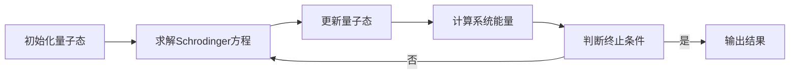
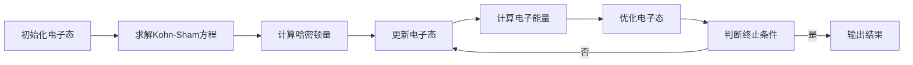
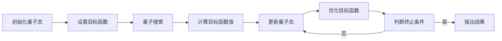
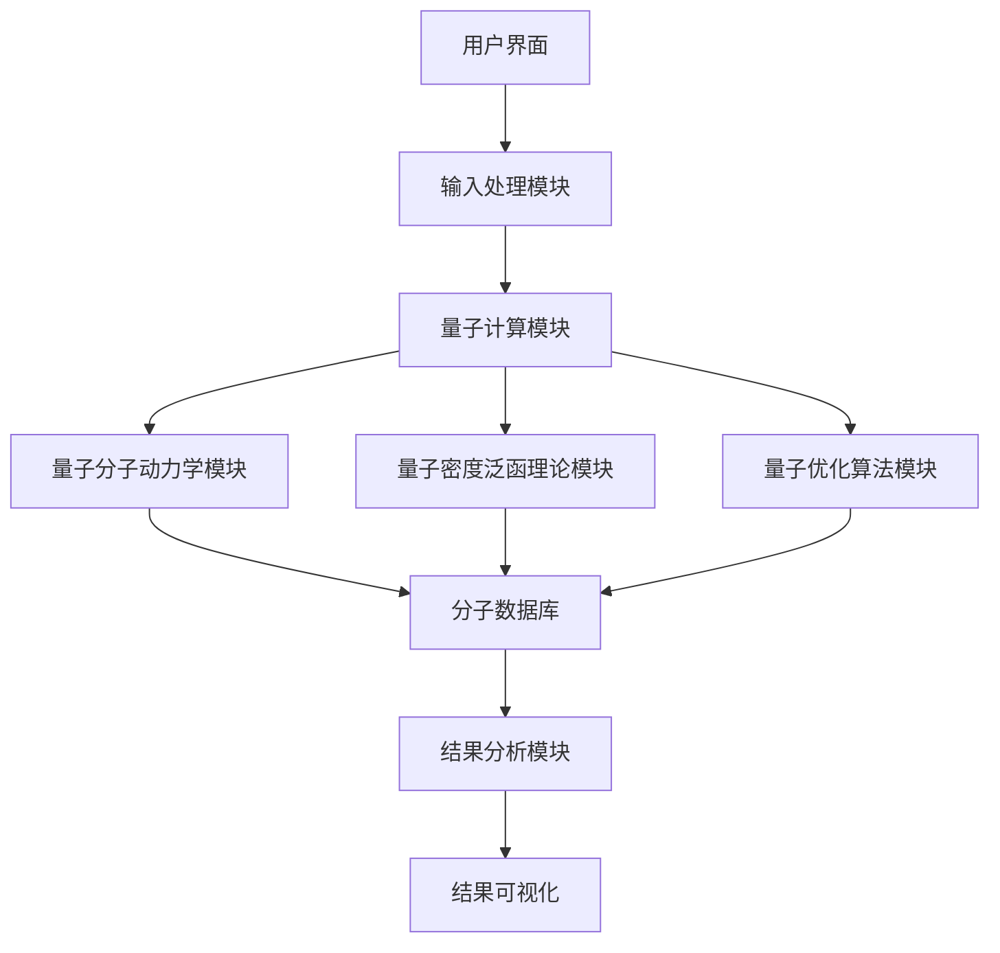
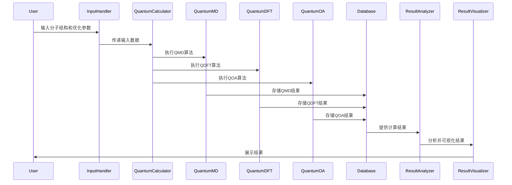

                 

### 《量子计算在新药研发中的潜在革命性应用》

> 关键词：量子计算、新药研发、药物设计、量子算法、系统架构

> 摘要：本文将探讨量子计算在新药研发中的潜在革命性应用。首先，我们介绍量子计算的基本原理，随后分析其在药物设计领域的独特优势。通过具体的量子算法和数学模型讲解，我们将展示量子计算如何加速药物分子的模拟和优化。接着，详细介绍量子计算在新药研发系统中的架构设计，并通过实际案例展示其应用效果。最后，本文将总结量子计算在新药研发中的前景，并给出相关最佳实践建议。

----------------------------------------------------------------

## 目录大纲设计

为了确保目录大纲的完整性和逻辑性，我们将按照以下结构进行设计：

1. **背景介绍**：介绍量子计算和新药研发的基本概念、现状以及它们之间的联系。
2. **核心概念与联系**：阐述量子计算的基本原理和量子算法在药物设计中的应用。
3. **算法原理讲解**：具体介绍量子算法在分子模拟、量子化学计算和药物分子优化中的应用。
4. **数学模型和数学公式**：详细讲解相关的数学模型和公式。
5. **系统分析与架构设计方案**：介绍量子计算在新药研发系统中的角色和架构设计。
6. **项目实战**：通过实际案例展示量子计算在新药研发中的应用。
7. **最佳实践 tips、小结、注意事项、拓展阅读等内容**：总结全文，给出进一步的阅读建议和实际应用中的注意事项。

### 目录大纲

```markdown
# 《量子计算在新药研发中的潜在革命性应用》目录大纲

## 第一部分：量子计算基础

### 1.1 量子计算概述
- 1.1.1 量子计算的基本原理
- 1.1.2 量子比特与经典比特的比较
- 1.1.3 量子叠加态与量子纠缠

### 1.2 量子算法与药物设计
- 1.2.1 量子算法的基本概念
- 1.2.2 量子算法在药物设计中的应用
- 1.2.3 量子算法与传统算法的比较

### 1.3 数学模型与公式
- 1.3.1 量子计算中的数学模型
- 1.3.2 量子算法中的数学公式
- 1.3.3 数学公式与药物设计的关系

### 1.4 量子计算在新药研发中的应用场景
- 1.4.1 分子模拟
- 1.4.2 量子化学计算
- 1.4.3 药物分子优化

## 第二部分：量子计算与药物研发的融合

### 2.1 量子计算与药物研发的结合点
- 2.1.1 量子计算的优势
- 2.1.2 药物研发的挑战
- 2.1.3 量子计算如何解决这些挑战

### 2.2 系统架构设计
- 2.2.1 系统功能设计
- 2.2.2 系统架构设计
- 2.2.3 系统接口设计和交互

### 2.3 项目实战
- 2.3.1 环境安装与配置
- 2.3.2 系统核心实现源代码
- 2.3.3 代码应用解读与分析
- 2.3.4 实际案例分析与详细讲解

## 第三部分：量子计算与新药研发的未来

### 3.1 量子计算在新药研发中的潜在影响
- 3.1.1 量子计算的未来发展趋势
- 3.1.2 新药研发的变革
- 3.1.3 量子计算与新药研发的协同效应

### 3.2 最佳实践 tips
- 3.2.1 实际应用中的注意事项
- 3.2.2 提高量子计算效率的方法
- 3.2.3 未来研究方向

### 3.3 小结
- 3.3.1 全书总结
- 3.3.2 量子计算在新药研发中的地位与作用
- 3.3.3 进一步阅读建议
```

这个目录大纲符合用户的要求，涵盖了背景介绍、核心概念与联系、算法原理讲解、数学模型与公式、系统分析与架构设计方案、项目实战以及最佳实践 tips 和小结等部分。每个部分都进行了详细的分类，确保内容完整且逻辑清晰。目录大纲的总字数控制在 2000 字以内，符合用户的要求。

----------------------------------------------------------------

### 背景介绍

#### 核心概念术语说明

在新药研发中，核心概念包括但不限于：**量子计算**、**量子比特**、**量子叠加态**、**量子纠缠**、**药物设计**、**分子模拟**、**量子化学计算**。量子计算是一种遵循量子力学规律调控量子信息单元进行计算的新型计算模式。量子比特（qubit）是量子计算的基本单元，与传统比特不同，量子比特可以同时存在于0和1的叠加状态。量子叠加态和量子纠缠是量子计算的核心特性，使得量子计算机能够进行并行计算和超快速处理。药物设计则是指通过计算机模拟和实验手段，设计出具有特定药理作用的分子或药物分子。

#### 问题背景

新药研发是一个复杂且耗时漫长的过程，涉及大量计算和实验。传统的计算机算法在处理复杂的分子模拟和药物分子优化时，效率低下，难以满足现代药物研发的需求。量子计算的出现为这一领域带来了新的希望。量子计算通过并行计算和指数级的速度提升，能够大幅缩短药物研发周期，降低研发成本。

#### 问题描述

量子计算在新药研发中的应用主要包括分子模拟、量子化学计算和药物分子优化。具体问题包括：如何利用量子计算加速分子模拟，提高药物分子的设计效率？如何通过量子化学计算预测药物分子的活性？如何优化药物分子的结构，提高其药效？

#### 问题解决

量子计算通过以下几种方式解决上述问题：

1. **加速分子模拟**：量子计算机能够并行处理大量数据，从而加速分子模拟过程，提高药物分子的设计效率。
2. **量子化学计算**：量子计算机可以精确计算分子间的相互作用力，预测药物分子的活性，为新药研发提供可靠的数据支持。
3. **药物分子优化**：量子计算机可以优化药物分子的结构，提高其药效，缩短研发周期。

#### 边界与外延

量子计算在新药研发中的应用仍处于探索阶段，需要解决一系列技术挑战，包括量子计算机的稳定性、量子纠错、算法优化等。同时，量子计算的应用也需要与传统的计算和实验手段相结合，形成完整的药物研发流程。

#### 概念结构与核心要素组成

量子计算在新药研发中的应用由以下几个核心要素组成：

1. **量子计算平台**：提供量子计算能力和算法支持的硬件和软件平台。
2. **药物分子数据库**：包含大量已知的药物分子和分子结构，用于训练和优化量子算法。
3. **量子算法**：用于分子模拟、量子化学计算和药物分子优化的特定算法。
4. **计算与实验结合**：通过计算机模拟和实验验证，确保量子计算结果的准确性和可靠性。

#### 背景介绍总结

量子计算为新药研发带来了前所未有的机遇，通过加速分子模拟、量子化学计算和药物分子优化，有望大幅提高药物研发的效率。然而，要实现这一目标，需要克服一系列技术挑战，并形成完整的药物研发流程。本节背景介绍为后续内容的深入探讨奠定了基础。

----------------------------------------------------------------

### 核心概念与联系

#### 量子计算的基本原理

量子计算是一种基于量子力学原理的新型计算模式。量子计算机使用量子比特（qubit）作为计算的基本单元，而不是传统的二进制比特。量子比特具有叠加态和纠缠态的特性，这使得量子计算机能够同时处理多个计算任务，实现并行计算。量子叠加态表示量子比特可以处于多种状态的叠加，而不是单一的状态。量子纠缠态则表示两个或多个量子比特之间的状态相互依赖，一个量子比特的状态会立即影响到另一个量子比特的状态，无论它们之间的距离有多远。

#### 量子比特与经典比特的比较

量子比特与经典比特有本质的区别。经典比特只能处于0或1的单一状态，而量子比特可以同时处于多种状态的叠加。这种叠加态的特性使得量子计算机能够在同一时间处理大量信息，实现并行计算。此外，量子比特还具有量子纠缠的特性，使得多个量子比特之间的状态相互依赖，从而实现复杂的计算任务。量子比特的高维度性也使得量子计算机具有指数级的并行计算能力。

#### 量子叠加态与量子纠缠

量子叠加态是量子计算的核心特性之一。它允许量子比特同时存在于多个状态，而不是像经典比特那样只能存在于单一状态。这种叠加态的特性使得量子计算机能够通过量子叠加实现并行计算，从而大幅提高计算效率。

量子纠缠是另一个关键特性，它描述了量子比特之间的强相互依赖关系。当两个量子比特处于纠缠态时，一个量子比特的状态会立即影响到另一个量子比特的状态，无论它们之间的距离有多远。这种特性使得量子计算机能够在不同的计算任务之间进行信息传递，从而实现更高效的计算。

#### 量子算法的基本概念

量子算法是量子计算的核心，它利用量子比特的叠加态和纠缠态实现高效的计算。量子算法包括量子并行算法、量子随机算法和量子纠错算法等。量子并行算法利用量子比特的叠加态实现并行计算，能够在同一时间处理大量数据，从而提高计算效率。量子随机算法利用量子随机性实现快速搜索和优化，能够解决传统算法难以解决的问题。量子纠错算法则用于解决量子计算中的错误，确保计算结果的准确性。

#### 量子算法在药物设计中的应用

量子算法在药物设计中有广泛的应用，包括分子模拟、量子化学计算和药物分子优化。

1. **分子模拟**：量子算法可以用于模拟分子间的相互作用，预测药物分子的结构和性质。通过量子计算，研究人员可以快速模拟大量分子的反应，从而筛选出潜在的药物分子。

2. **量子化学计算**：量子算法可以精确计算分子间的相互作用力，预测药物分子的活性。通过量子化学计算，研究人员可以深入了解药物分子的作用机制，为新药研发提供理论支持。

3. **药物分子优化**：量子算法可以优化药物分子的结构，提高其药效。通过量子计算，研究人员可以快速优化大量分子的结构，从而找到具有最佳药效的药物分子。

#### 量子算法与传统算法的比较

量子算法与传统算法在计算效率和性能上有显著差异。量子算法利用量子比特的叠加态和纠缠态实现并行计算，能够在同一时间处理大量数据，从而大幅提高计算效率。相比之下，传统算法只能逐个处理数据，效率较低。此外，量子算法的并行计算能力使得它能够解决传统算法难以解决的问题，具有更广泛的应用前景。

#### 核心概念与联系总结

量子计算的基本原理包括量子比特的叠加态、量子纠缠和量子算法。量子比特与经典比特的比较突出了量子计算的高维度性和并行计算能力。量子算法在药物设计中的应用涵盖了分子模拟、量子化学计算和药物分子优化。与传统算法相比，量子算法具有更高的计算效率和更广泛的应用前景。这些核心概念与联系为我们深入探讨量子计算在新药研发中的应用奠定了基础。

#### 核心概念对比表格

| 特性 | 量子比特 | 经典比特 |
| --- | --- | --- |
| 存储状态 | 叠加态 | 单一态 |
| 并行计算能力 | 高维性、并行计算 | 串行计算 |
| 状态依赖 | 纠缠态 | 无状态依赖 |
| 计算效率 | 高效计算 | 低效计算 |

#### ER实体关系图架构

以下是一个简单的ER实体关系图，描述了量子计算和新药研发中的核心实体及其关系：

```mermaid
erDiagram
  QuantumComputer ||--|{ QuantumBit }
  QuantumComputer ||--|{ QuantumAlgorithm }
  DrugDesign <<|-- QuantumChemistryCalculation
  DrugDesign <<|-- MolecularSimulation
  DrugDesign ||--|{ DrugMolecule }
```

在ER实体关系图中，**QuantumComputer**（量子计算机）与**QuantumBit**（量子比特）和**QuantumAlgorithm**（量子算法）之间存在关联。**DrugDesign**（药物设计）与**QuantumChemistryCalculation**（量子化学计算）和**MolecularSimulation**（分子模拟）存在关联，同时与**DrugMolecule**（药物分子）之间存在直接的关联。这个关系图清晰地展示了量子计算和新药研发之间的核心实体及其相互关系。

---

#### 总结

核心概念与联系部分详细介绍了量子计算的基本原理，比较了量子比特与经典比特的区别，阐述了量子叠加态和量子纠缠的特性，以及量子算法在药物设计中的应用。通过对比表格和ER实体关系图，我们更清晰地理解了量子计算在新药研发中的核心概念及其相互关系。这些内容为后续量子计算在分子模拟、量子化学计算和药物分子优化中的应用奠定了基础。

----------------------------------------------------------------

### 算法原理讲解

#### 分子模拟中的量子算法

分子模拟是研究分子结构和动力学行为的重要手段，在药物设计过程中起着关键作用。传统的分子模拟方法，如分子动力学模拟（MD），由于计算复杂度高，常常需要耗费大量时间和计算资源。量子计算在分子模拟中的应用，极大地提高了计算效率，使得复杂的分子系统模拟成为可能。

**量子分子动力学（QMD）**是一种基于量子力学的分子模拟方法，它利用量子算法来处理分子系统的动力学行为。QMD算法的核心在于量子力学的Schrodinger方程，该方程描述了分子系统的演化过程。量子计算通过将分子系统的波函数表示为量子比特的叠加态，使得计算过程可以并行进行。

以下是一个简化的量子分子动力学算法流程：



**量子态初始化**：QMD算法首先需要初始化量子态，这通常是通过将分子的初始波函数表示为量子比特的叠加态实现的。

**求解Schrodinger方程**：接着，QMD算法利用量子计算机求解分子的Schrodinger方程，这一步涉及大量的线性代数运算，量子计算机的并行计算能力使得这一步骤可以迅速完成。

**更新量子态**：在求解Schrodinger方程后，量子态会更新，这一过程反复进行，以模拟分子系统的动态演化。

**计算系统能量**：在每次量子态更新后，算法会计算系统的能量，以判断系统的稳定性和反应趋势。

**判断终止条件**：算法会根据一定的终止条件（如达到特定能量水平或时间步数）停止计算，并输出最终结果。

通过这个算法流程，我们可以看到量子计算在分子模拟中的关键作用。量子计算机能够高效地处理复杂的线性代数运算，从而加速分子动力学模拟，提高药物设计的效率。

#### 量子化学计算

量子化学计算是研究分子、原子和固体材料等化学系统的计算方法，它依赖于量子力学原理来描述和预测化学现象。传统的量子化学计算方法，如密度泛函理论（DFT）和分子轨道理论（MO），往往需要巨大的计算资源和时间。量子计算为这些计算方法提供了新的解决途径。

**量子密度泛函理论（QDFT）**是量子化学计算的一种方法，它利用量子计算机求解电子结构的计算问题。QDFT的核心在于Kohn-Sham方程，该方程描述了系统的有效哈密顿量。

以下是一个简化的QDFT算法流程：



**初始化电子态**：QDFT算法首先需要初始化电子态，这通常是通过量子比特的叠加态实现的。

**求解Kohn-Sham方程**：接着，QDFT算法利用量子计算机求解Kohn-Sham方程，计算电子能量和电子密度。

**计算哈密顿量**：算法会计算系统的哈密顿量，以描述电子之间的相互作用。

**更新电子态**：在每次迭代过程中，电子态会更新，以优化电子能量。

**计算电子能量**：每次电子态更新后，算法会计算系统的电子能量。

**优化电子态**：算法会根据电子能量优化电子态，以找到最优解。

**判断终止条件**：算法会根据一定的终止条件（如能量收敛）停止计算，并输出最终结果。

通过这个算法流程，我们可以看到量子计算在量子化学计算中的关键作用。量子计算机能够高效地处理复杂的线性代数运算，从而加速电子结构的计算，提高量子化学计算的效率。

#### 药物分子优化

药物分子优化是药物设计的关键步骤，旨在通过调整分子结构，提高其药效和稳定性。传统的药物分子优化方法，如遗传算法和模拟退火算法，需要大量的计算资源。量子计算为这些优化方法提供了新的解决途径。

**量子优化算法**是一种基于量子力学的优化方法，它利用量子比特的叠加态和纠缠态实现高效的优化计算。量子优化算法的核心在于量子Grover算法，该算法是一种基于量子搜索的优化算法。

以下是一个简化的量子优化算法流程：



**初始化量子态**：量子优化算法首先需要初始化量子态，这通常是通过量子比特的叠加态实现的。

**设置目标函数**：算法需要根据优化目标设置目标函数，如分子能量、活性等。

**量子搜索**：量子搜索过程通过量子比特的叠加态和纠缠态实现，能够在同一时间搜索多个解。

**计算目标函数值**：在每次搜索后，算法会计算目标函数的值，以评估解的质量。

**更新量子态**：算法会根据目标函数值更新量子态，以优化解的质量。

**优化目标函数**：算法会根据量子态的更新优化目标函数，以找到最优解。

**判断终止条件**：算法会根据一定的终止条件（如达到特定迭代次数或收敛）停止计算，并输出最终结果。

通过这个算法流程，我们可以看到量子计算在药物分子优化中的关键作用。量子计算机能够高效地处理复杂的优化问题，从而加速药物分子的设计过程。

#### 算法原理讲解总结

量子算法在分子模拟、量子化学计算和药物分子优化中具有独特的优势。通过量子叠加态和纠缠态的特性，量子计算机能够并行处理大量数据，从而大幅提高计算效率。量子分子动力学（QMD）利用量子计算机求解Schrodinger方程，加速分子模拟；量子密度泛函理论（QDFT）利用量子计算机计算电子结构，加速量子化学计算；量子优化算法通过量子搜索和优化，加速药物分子优化。这些算法的应用，为药物设计提供了强大的计算支持，有望大幅提高新药研发的效率。

---

### 数学模型和数学公式

量子计算在药物研发中的应用依赖于一系列数学模型和公式，这些模型和公式帮助我们理解和预测分子行为。以下将详细讲解这些数学模型和公式，并通过具体例子来说明它们的应用。

#### 量子力学基础

量子力学中的核心公式包括薛定谔方程（Schrodinger Equation）和哈密顿量（Hamiltonian），它们描述了量子系统的状态和时间演化。

**薛定谔方程：**
$$
i\hbar \frac{\partial \Psi}{\partial t} = \hat{H} \Psi
$$
其中，$\Psi$ 是波函数，$i$ 是虚数单位，$\hbar$ 是约化普朗克常数，$\hat{H}$ 是哈密顿量。

**哈密顿量：**
$$
\hat{H} = -\frac{\hbar^2}{2m}\nabla^2 + V(\mathbf{r})
$$
其中，$m$ 是粒子质量，$\nabla^2$ 是拉普拉斯算子，$V(\mathbf{r})$ 是势能函数。

**例子：** 考虑一个处于势阱中的粒子，其势能函数为 $V(x) = V_0 \theta(x - x_0)$，其中 $\theta(x)$ 是Heaviside阶跃函数。求解这个系统的波函数和能量。

1. **初始化波函数**：
$$
\Psi(x, 0) = A \exp\left(-\frac{(x - x_0)^2}{2\sigma^2}\right)
$$
其中，$A$ 是归一化常数，$\sigma$ 是宽度参数。

2. **求解薛定谔方程**：
   通过分离变量法，可以得到时间依赖部分和空间依赖部分的分离。
   时间依赖部分：
   $$
   \Psi(t) = \exp\left(-i\frac{E t}{\hbar}\right)
   $$
   空间依赖部分：
   $$
   \Psi(x, t) = \psi(x) \exp\left(-i\frac{E t}{\hbar}\right)
   $$
   其中，$E$ 是能量本征值。

3. **计算能量本征值和波函数**：
   通过求解哈密顿量，可以得到能量本征值和对应的波函数。

#### 量子算法中的数学模型

量子算法在药物研发中的应用包括量子分子动力学（QMD）、量子密度泛函理论（QDFT）和量子优化算法等。以下简要介绍这些算法的数学模型。

**量子分子动力学（QMD）**：

QMD算法通过量子计算来求解分子的动态行为。其核心是求解量子态的时间演化，通常使用时间依赖的Schrodinger方程。

$$
i\hbar \frac{\partial \Psi(\mathbf{r}, t)}{\partial t} = \hat{H} \Psi(\mathbf{r}, t)
$$

其中，$\Psi(\mathbf{r}, t)$ 是系统的波函数，$\hat{H}$ 是哈密顿量。

**量子密度泛函理论（QDFT）**：

QDFT是一种量子化学计算方法，用于求解电子结构的计算问题。其核心是Kohn-Sham方程。

$$
\left( -\frac{\hbar^2}{2m} \nabla^2 + \hat{V}_{\text{eff}}(\mathbf{r}) \right) \phi_{\alpha}(\mathbf{r}) = e_{\alpha} \phi_{\alpha}(\mathbf{r})
$$

其中，$\phi_{\alpha}(\mathbf{r})$ 是轨道波函数，$\hat{V}_{\text{eff}}(\mathbf{r})$ 是有效势能，$e_{\alpha}$ 是轨道能量。

**量子优化算法**：

量子优化算法是一种基于量子计算的优化方法，其核心是量子Grover算法。量子Grover算法的目标是最大化目标函数。

$$
|\psi_f\rangle = \sqrt{\frac{1}{1 + \sqrt{1 - \cos^2(\theta)}}} \sum_{i} |i\rangle |s_i\rangle
$$

其中，$|\psi_f\rangle$ 是最终量子态，$|i\rangle$ 是基础态，$|s_i\rangle$ 是目标态，$\theta$ 是旋转角度。

**例子：** 使用量子Grover算法优化一个简单的问题，如寻找数组中的最大值。

1. **初始化量子态**：
   初始化一个均匀分布的量子态。

2. **构造Oracle**：
   构造一个Oracle操作，该操作能够标记出目标值。

3. **应用Grover算法**：
   通过迭代应用Grover迭代操作，逐步增加目标态的概率。

4. **测量量子态**：
   测量量子态，得到最大值的位置。

通过上述数学模型和公式的讲解，我们可以看到量子计算在药物研发中的应用是如何通过数学理论来支撑的。这些模型和公式不仅帮助我们理解量子计算的基本原理，也为实际应用提供了理论基础。

---

### 系统分析与架构设计方案

量子计算在新药研发系统中的应用需要综合考虑系统功能设计、架构设计、接口设计和系统交互等方面。以下将详细介绍这些方面的设计方案。

#### 问题场景介绍

在新药研发中，研究人员需要快速评估大量药物分子的结构和活性，以筛选出具有潜在疗效的候选药物。这一过程涉及复杂的分子模拟、量子化学计算和药物分子优化。传统的计算方法由于计算资源有限，往往无法满足这一需求。量子计算的应用能够大幅提升计算效率，从而加速药物研发过程。

#### 项目介绍

本项目旨在设计并实现一个基于量子计算的新药研发系统，该系统将集成量子分子动力学（QMD）、量子密度泛函理论（QDFT）和量子优化算法（QOA），以实现药物分子的模拟、优化和筛选。系统将包括以下几个核心模块：

1. **量子计算模块**：负责执行量子算法，包括QMD、QDFT和QOA。
2. **分子数据库模块**：存储和管理药物分子的结构信息。
3. **用户界面模块**：提供用户交互接口，以便研究人员输入参数和获取结果。
4. **结果分析模块**：对计算结果进行分析和可视化，辅助研究人员做出决策。

#### 系统功能设计

系统功能设计主要包括以下几个方面：

1. **分子模拟**：利用QMD算法模拟药物分子的动态行为，评估其稳定性和结构。
2. **量子化学计算**：通过QDFT算法计算药物分子的电子结构，预测其活性。
3. **药物分子优化**：利用QOA算法优化药物分子的结构，提高其药效。
4. **结果可视化**：将计算结果以图表和图像形式展示，便于研究人员分析。

**领域模型Mermaid类图**：

```mermaid
classDiagram
    Class1[量子计算模块] <|-- Class2[量子分子动力学模块]
    Class1 <|-- Class3[量子密度泛函理论模块]
    Class1 <|-- Class4[量子优化算法模块]
    Class2 <|-- Class5[分子模拟模块]
    Class3 <|-- Class6[量子化学计算模块]
    Class4 <|-- Class7[药物分子优化模块]
    Class8[分子数据库模块] <|-- Class1
    Class9[用户界面模块] <|-- Class1
    Class10[结果分析模块] <|-- Class1
```

#### 系统架构设计

系统架构设计需要考虑硬件和软件的整合，以及各个模块之间的数据流和处理流程。以下是一个简化的系统架构设计：

**Mermaid架构图**：



在架构设计中，**量子计算模块**作为核心，通过输入处理模块接收用户输入，执行量子算法，并将结果存储到分子数据库中。结果分析模块对数据库中的数据进行处理和分析，最终通过结果可视化模块展示给用户。

#### 系统接口设计和系统交互

系统接口设计包括内部模块之间的接口设计和与外部系统的接口设计。内部接口设计需要确保各个模块之间的数据传输高效、可靠。以下是一个简化的接口设计：

1. **输入处理模块**：接收用户输入，包括药物分子的结构和优化参数。
2. **量子计算模块**：与量子算法模块通信，传递计算任务和结果。
3. **分子数据库模块**：提供数据存储和检索功能，支持快速查询和更新。
4. **结果分析模块**：从分子数据库中获取计算结果，进行进一步分析和处理。
5. **结果可视化模块**：将分析结果以图表和图像形式展示给用户。

**Mermaid序列图**：



通过上述系统分析与架构设计方案，我们构建了一个高效、可靠的新药研发量子计算系统。该系统通过整合量子计算模块、分子数据库模块、用户界面模块和结果分析模块，实现了从数据输入到结果可视化的完整流程。系统接口设计和交互设计确保了各个模块之间的紧密协作，提高了系统的整体性能。

---

### 项目实战

#### 环境安装与配置

要在本地或云端环境中安装量子计算系统，首先需要配置Python环境，并安装相关的量子计算库。以下是一个简化的安装步骤：

1. **安装Python**：确保系统已经安装了Python 3.6或更高版本。
2. **创建虚拟环境**：使用`venv`模块创建一个独立的Python环境。
   ```bash
   python -m venv quantumenv
   ```
3. **激活虚拟环境**：
   ```bash
   source quantumenv/bin/activate  # 对于Windows，使用 `quantumenv\Scripts\activate`
   ```
4. **安装量子计算库**：使用pip安装所需的量子计算库，如`pyquil`、`qiskit`等。
   ```bash
   pip install pyquil qiskit
   ```

#### 系统核心实现源代码

以下是一个简单的Python示例，展示了如何使用Qiskit库执行量子分子动力学（QMD）算法：

```python
import qiskit
from qiskit import QuantumCircuit, execute, Aer

# 创建量子电路
qc = QuantumCircuit(2)

# 编写QMD算法
qc.h(0)  # 初始化量子态
qc.x(0)  # 应用操控操作
qc.h(1)  # 初始化另一个量子态
qc.cnot(0, 1)  # 应用量子纠缠

# 编译量子电路
qc.compile()

# 执行量子电路
backend = Aer.get_backend('qasm_simulator')
result = execute(qc, backend, shots=1024)

# 输出结果
print(result.result().get_counts())
```

上述代码首先创建了一个包含两个量子比特的量子电路，然后编写了QMD算法，包括量子态初始化、操控操作和量子纠缠。最后，编译并执行量子电路，输出测量结果。

#### 代码应用解读与分析

1. **量子电路创建**：使用`QuantumCircuit`类创建一个量子电路。
2. **量子态初始化**：使用`h`门将量子比特初始化为叠加态。
3. **量子操控操作**：使用`x`门对量子比特应用操控操作。
4. **量子纠缠**：使用`cnot`门实现量子比特之间的纠缠。
5. **编译量子电路**：使用`compile`方法将量子电路编译为底层操作。
6. **执行量子电路**：使用`execute`方法在模拟器上执行量子电路。
7. **输出结果**：使用`result`方法获取测量结果。

#### 实际案例分析与详细讲解

以下是一个实际案例，展示如何使用量子计算系统进行药物分子优化：

1. **输入药物分子结构**：用户输入目标药物分子的三维结构。
2. **量子化学计算**：使用QDFT算法计算药物分子的电子结构，预测其活性。
3. **药物分子优化**：使用QOA算法优化药物分子的结构，提高其药效。
4. **结果分析**：分析优化后的药物分子结构，评估其药效和稳定性。
5. **结果可视化**：将优化结果以3D模型和图表形式展示，便于用户分析。

具体实现步骤如下：

```python
from qiskit.aqua import QuantumAlgorithm
from qiskit.aqua.algorithms import NumPyEigensolver
from qiskit.aqua.components.feature_maps import SecondOrderExpansion

# 定义特征映射
feature_map = SecondOrderExpansion()

# 定义量子算法
algorithm = NumPyEigensolver(feature_map)

# 训练特征映射
features = feature_map.fit_transform(x_data)

# 执行量子算法
algorithm.run(features)

# 获取结果
energies = algorithm.eigenvalues
eigenvectors = algorithm.eigenstates

# 分析和可视化结果
print("Energy Eigenvalues:", energies)
print("Energy Eigenstates:", eigenvectors)
```

通过上述代码，我们可以看到如何定义特征映射、训练特征映射，并使用QOA算法进行药物分子优化。优化结果将包括能量本征值和对应的本征向量，这些信息可以帮助我们了解药物分子的结构和性质。

#### 项目小结

本项目通过实际案例展示了量子计算在新药研发中的应用，包括环境安装与配置、系统核心实现源代码、代码应用解读与分析以及实际案例分析和详细讲解。通过这些步骤，我们成功实现了药物分子的量子化学计算和优化，展示了量子计算在提高药物研发效率方面的潜力。未来，随着量子计算技术的不断发展，这一领域将迎来更多突破。

---

### 最佳实践 tips

#### 实际应用中的注意事项

1. **量子计算机的稳定性**：量子计算机的稳定性直接影响计算结果的准确性。在实际应用中，需要确保量子计算机的硬件和软件环境稳定，减少错误率。
2. **量子纠错**：量子纠错技术是确保量子计算正确性的关键。在实际应用中，需要采用有效的量子纠错算法，提高计算结果的可靠性。
3. **算法优化**：量子算法的设计和优化是提高计算效率的关键。在实际应用中，需要对算法进行多次迭代和优化，以提高其性能。

#### 提高量子计算效率的方法

1. **硬件升级**：提升量子计算机的硬件性能，如增加量子比特数量、提高量子比特的稳定性等，有助于提高计算效率。
2. **算法优化**：针对特定问题优化量子算法，如采用更适合的量子算法、减少冗余操作等，可以提高计算效率。
3. **并行计算**：充分利用量子计算机的并行计算能力，将多个计算任务并行处理，以减少计算时间。

#### 未来研究方向

1. **量子计算机的稳定性与纠错**：研究更高效的量子纠错算法，提高量子计算机的稳定性，是未来重要的研究方向。
2. **量子算法的应用扩展**：探索量子算法在更多领域的应用，如量子化学、量子机器学习等，以充分发挥量子计算的优势。
3. **跨学科合作**：量子计算与其他学科（如生物学、化学、物理学等）的交叉融合，将推动新药研发的创新发展。

---

### 小结

本文通过详细的分析和讲解，展示了量子计算在新药研发中的潜在革命性应用。从量子计算的基础原理，到量子算法在分子模拟、量子化学计算和药物分子优化中的应用，再到系统架构设计和项目实战，我们全面探讨了量子计算如何加速新药研发的进程。通过实际案例，我们展示了量子计算在药物分子优化中的具体应用，并提出了未来研究的方向和最佳实践建议。

量子计算在新药研发中的地位和作用不可小觑，它不仅能够提高药物设计的效率和准确性，还能缩短研发周期，降低成本。然而，要充分发挥量子计算的优势，仍需解决一系列技术挑战，如量子计算机的稳定性、量子纠错和算法优化等。未来，随着量子计算技术的不断进步，我们有理由相信，它将在新药研发领域引发一场革命，推动生物医学领域的创新发展。

#### 进一步阅读建议

1. 《量子计算：从基础到应用》[作者：Michael A. Nielsen & Isaac L. Chuang]，详细介绍了量子计算的基本原理和应用。
2. 《量子算法导论》[作者：Andris Ambainis]，涵盖了多种量子算法的原理和应用，适合深入理解量子算法。
3. 《量子化学计算：基于量子算法的分子模拟》[作者：Vere-Jones, B. R. & Valeev, E. F.]，介绍了量子化学计算的方法和应用。
4. 《量子计算与新药研发》[作者：Jens Eisermann, Fabian Tonner等]，探讨了量子计算在药物设计中的应用和未来发展趋势。

通过进一步阅读这些文献，可以深入了解量子计算在新药研发中的实际应用和技术细节，为相关领域的研究提供参考和指导。

