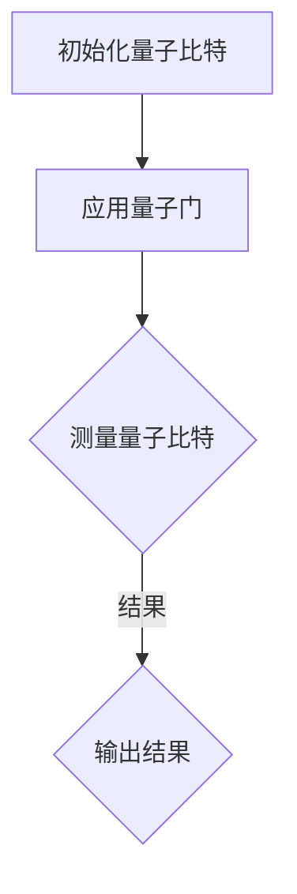
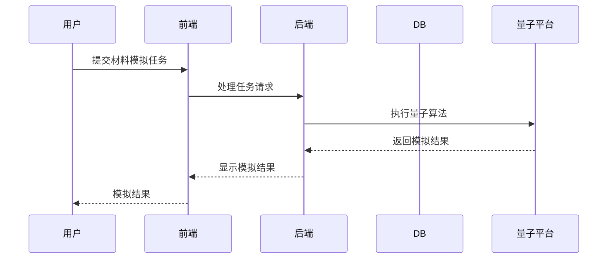

                 

# 量子计算在材料科学中的应用前景

## 关键词

- 量子计算
- 材料科学
- 量子模拟
- 量子优化
- 量子机器学习

## 摘要

量子计算，作为下一代计算技术，正在迅速发展，并在多个领域展现出巨大的应用潜力。本文将重点探讨量子计算在材料科学中的应用前景，包括量子模拟、量子优化和量子机器学习等方面。通过分析量子计算的基本原理及其在材料科学中的具体应用案例，本文旨在为读者提供一个全面而深入的了解，揭示量子计算在推动材料科学研究和技术创新中的重要作用。

## 目录大纲

**《量子计算在材料科学中的应用前景》**

### 第一部分：量子计算基础

#### 第1章：量子计算简介

1.1 量子计算的定义与基本原理

1.2 量子比特与经典比特的对比

1.3 量子计算的优势与挑战

#### 第2章：量子算法与材料科学

2.1 量子算法概述

2.2 量子算法在材料科学中的应用

2.3 材料科学中面临的计算难题

### 第二部分：量子计算在材料科学中的应用

#### 第3章：量子模拟

3.1 量子模拟的基本概念

3.2 量子模拟在材料科学中的应用

3.3 材料模拟的挑战与解决方案

#### 第4章：量子优化

4.1 量子优化算法

4.2 材料科学中的优化问题

4.3 量子优化在材料优化中的应用

#### 第5章：量子机器学习

5.1 量子机器学习的基本概念

5.2 量子机器学习在材料科学中的应用

5.3 材料识别与分类问题

#### 第6章：量子计算在材料设计中的应用案例

6.1 案例一：新型材料的量子模拟

6.2 案例二：材料优化问题的量子优化

6.3 案例三：材料识别与分类的量子机器学习

### 第三部分：未来展望与挑战

#### 第7章：量子计算在材料科学中的未来发展

7.1 量子计算技术的进展

7.2 材料科学领域的机遇与挑战

7.3 未来应用前景展望

## 详细内容

### 第1章：量子计算简介

#### 1.1 量子计算的定义与基本原理

量子计算是基于量子力学原理发展起来的一种新型计算方式。与传统的经典计算不同，量子计算利用量子比特（qubit）进行信息处理。量子比特可以同时处于0和1的状态，这种特性称为叠加。此外，量子比特之间可以存在一种特殊的关联，称为纠缠。这些特性使得量子计算在处理某些问题时具有超越经典计算的能力。

量子计算的基本原理包括：

- **量子比特（Qubit）**：量子比特是量子计算的基本单位，可以处于多种状态的叠加。

- **量子叠加（Quantum Superposition）**：量子比特可以同时处于多个状态的叠加，直到被测量时才确定具体的状态。

- **量子纠缠（Quantum Entanglement）**：量子比特之间存在一种特殊的关联，即纠缠。纠缠态的量子比特即使相隔很远，它们之间的状态也会相互影响。

- **量子门（Quantum Gate）**：量子门是作用于量子比特的基本操作，类似于经典计算机中的逻辑门。通过一系列量子门的操作，可以实现复杂的量子算法。

#### 1.2 量子比特与经典比特的对比

量子比特与经典比特在多个方面存在显著差异：

- **状态表示**：经典比特只能处于0或1的状态，而量子比特可以同时处于0和1的叠加状态。

- **并行计算能力**：由于量子叠加的特性，量子计算可以在一个步骤中同时处理多个问题，而经典计算则需要逐步处理。

- **纠错能力**：量子计算中的纠错问题比经典计算更为复杂，因为量子态容易受到环境干扰而失去信息。

#### 1.3 量子计算的优势与挑战

量子计算的优势主要体现在以下几个方面：

- **并行计算能力**：量子计算可以利用量子叠加和纠缠的特性，实现高效的并行计算，从而在处理大规模问题时具有巨大的优势。

- **高效解决特定问题**：量子算法在某些特定问题上，如量子模拟、量子优化等，能够显著提高计算效率。

- **量子仿真能力**：量子计算可以用于模拟量子系统，这对于研究量子物理现象具有重要意义。

然而，量子计算也面临着一些挑战：

- **量子比特的稳定性**：量子比特容易受到环境干扰，导致计算错误。

- **量子比特之间的相互作用**：量子比特之间的相互作用复杂，需要精确控制。

- **量子计算的错误率**：目前的量子计算机错误率较高，需要解决错误纠正问题。

### 第2章：量子算法与材料科学

#### 2.1 量子算法概述

量子算法是利用量子计算原理设计的一类算法。与经典算法不同，量子算法利用量子比特的叠加和纠缠特性，能够在某些问题上实现高效计算。常见的量子算法包括：

- **量子模拟算法**：用于模拟量子系统的演化，如量子态的演化、量子态之间的转换等。

- **量子优化算法**：用于解决优化问题，如寻找最优解、最小化目标函数等。

- **量子机器学习算法**：用于处理大规模数据，实现数据的分类、聚类、预测等。

#### 2.2 量子算法在材料科学中的应用

量子算法在材料科学中具有广泛的应用前景。以下是一些具体的应用案例：

- **量子模拟在材料结构预测中的应用**：通过量子模拟，可以预测材料的电子结构和性质，如分子的稳定性和反应性等。

- **量子优化在材料优化中的应用**：量子优化算法可以用于优化材料的成分和结构，以实现特定的性能目标。

- **量子机器学习在材料识别与分类中的应用**：通过训练量子机器学习模型，可以自动识别和分类材料，如发现新的材料特性。

#### 2.3 材料科学中面临的计算难题

材料科学中的计算难题主要包括：

- **复杂材料的结构预测**：复杂材料的结构通常涉及大量的量子相互作用，难以用经典计算方法精确预测。

- **高效的材料优化**：优化材料成分和结构需要大量的计算资源，传统计算方法效率较低。

- **材料特性的准确模拟**：准确模拟材料特性对于理解和设计新材料至关重要，但现有的计算方法难以满足高精度要求。

### 第3章：量子模拟

量子模拟是量子计算在材料科学中的一项重要应用。通过量子模拟，可以研究材料在量子尺度上的行为，预测材料的性质和性能。

#### 3.1 量子模拟的基本概念

量子模拟的基本概念包括：

- **量子系统**：被模拟的量子系统，如分子、晶体等。

- **量子态**：量子系统的状态，用波函数描述。

- **哈密顿量**：描述量子系统内部相互作用的物理量。

- **量子演化和动力学**：量子系统的时间演化过程。

#### 3.2 量子模拟在材料科学中的应用

量子模拟在材料科学中的应用包括：

- **分子动力学模拟**：通过量子模拟，可以研究分子在量子尺度上的动力学行为，如分子的振动、旋转等。

- **量子蒙特卡罗模拟**：通过量子蒙特卡罗方法，可以模拟材料的量子性质，如电子结构、能带结构等。

- **量子计算辅助的材料设计**：通过量子模拟，可以优化材料的成分和结构，以实现特定的性能目标。

#### 3.3 材料模拟的挑战与解决方案

材料模拟面临的挑战包括：

- **高维空间的计算**：材料模拟通常涉及高维空间的计算，传统计算方法难以处理。

- **量子态的精确描述**：量子态的精确描述需要高精度的量子模拟方法。

- **计算资源的需求**：量子模拟需要大量的计算资源，目前量子计算机的运算能力仍有限。

解决方案包括：

- **量子算法的优化**：通过优化量子算法，提高量子模拟的计算效率。

- **量子计算机的进步**：随着量子计算机的发展，其运算能力将不断提高，有助于解决材料模拟中的计算难题。

### 第4章：量子优化

量子优化是量子计算在材料科学中的另一项重要应用。通过量子优化算法，可以优化材料的成分和结构，以实现特定的性能目标。

#### 4.1 量子优化算法

量子优化算法是利用量子计算原理解决优化问题的一类算法。常见的量子优化算法包括：

- **量子粒子群算法**：基于量子力学的粒子群优化算法。

- **量子遗传算法**：基于量子遗传学的优化算法。

- **量子模拟退火算法**：基于量子蒙特卡罗方法的优化算法。

#### 4.2 材料科学中的优化问题

材料科学中的优化问题包括：

- **材料成分优化**：通过优化材料的成分，提高材料的性能。

- **材料结构优化**：通过优化材料结构，实现特定的功能。

- **材料性能优化**：通过优化材料性能，满足特定的应用需求。

#### 4.3 量子优化在材料优化中的应用

量子优化在材料优化中的应用包括：

- **材料合成**：通过量子优化算法，优化材料的合成过程，提高合成效率。

- **材料性能预测**：通过量子优化算法，预测材料性能，指导材料设计。

- **材料优化设计**：通过量子优化算法，优化材料成分和结构，实现特定性能。

### 第5章：量子机器学习

量子机器学习是量子计算在材料科学中的新兴应用。通过量子机器学习算法，可以处理大规模材料数据，实现材料识别与分类。

#### 5.1 量子机器学习的基本概念

量子机器学习的基本概念包括：

- **量子数据表示**：将数据表示为量子态。

- **量子算法**：用于处理量子数据的算法。

- **量子学习模型**：用于学习数据的量子模型。

#### 5.2 量子机器学习在材料科学中的应用

量子机器学习在材料科学中的应用包括：

- **材料识别**：通过训练量子机器学习模型，识别新材料。

- **材料分类**：通过训练量子机器学习模型，对材料进行分类。

- **材料性能预测**：通过训练量子机器学习模型，预测材料性能。

#### 5.3 材料识别与分类问题

材料识别与分类问题在材料科学中具有重要意义。通过量子机器学习，可以自动识别和分类材料，提高材料研究的效率。

- **材料识别**：通过量子机器学习模型，自动识别新材料。

- **材料分类**：通过量子机器学习模型，对材料进行分类，便于研究和应用。

- **材料性能预测**：通过量子机器学习模型，预测材料性能，指导材料设计。

### 第6章：量子计算在材料设计中的应用案例

量子计算在材料设计中的应用案例包括：

#### 6.1 案例一：新型材料的量子模拟

通过量子模拟，可以研究新型材料的电子结构和性质，为材料设计提供重要参考。

- **背景**：新型材料在许多领域具有广泛的应用潜力。

- **方法**：使用量子模拟方法，研究新型材料的电子结构和性质。

- **结果**：通过量子模拟，发现了新型材料的优异性能。

#### 6.2 案例二：材料优化问题的量子优化

通过量子优化算法，可以优化材料的成分和结构，提高材料的性能。

- **背景**：材料优化是材料科学研究中的重要问题。

- **方法**：使用量子优化算法，优化材料的成分和结构。

- **结果**：通过量子优化，实现了材料性能的显著提升。

#### 6.3 案例三：材料识别与分类的量子机器学习

通过量子机器学习，可以自动识别和分类材料，提高材料研究的效率。

- **背景**：材料识别与分类是材料科学研究中的重要任务。

- **方法**：使用量子机器学习模型，自动识别和分类材料。

- **结果**：通过量子机器学习，实现了高效的材料识别与分类。

### 第7章：未来展望与挑战

#### 7.1 量子计算技术的进展

随着量子计算技术的不断发展，量子计算机的性能将不断提高，为材料科学的应用提供更多可能性。

- **量子比特的稳定性**：量子比特的稳定性是量子计算的关键问题，需要进一步研究和改进。

- **量子算法的优化**：量子算法的优化是提高量子计算效率的重要方向。

- **量子计算机的普及**：随着量子计算机的普及，量子计算将在更多领域得到应用。

#### 7.2 材料科学领域的机遇与挑战

量子计算在材料科学领域带来了许多机遇，同时也面临着一些挑战。

- **机遇**：量子计算可以提高材料研究的效率，推动材料科学的发展。

- **挑战**：量子计算在材料科学中的应用仍需解决一些关键技术问题。

#### 7.3 未来应用前景展望

未来，量子计算将在材料科学中发挥重要作用，为材料设计、优化和识别等领域带来革命性的变化。

- **材料设计**：量子计算将有助于发现和设计新型材料。

- **材料优化**：量子计算将提高材料优化的效率。

- **材料识别与分类**：量子计算将实现高效的材料识别与分类。

## 总结

量子计算在材料科学中的应用前景广阔，通过量子模拟、量子优化和量子机器学习等方法，可以解决材料科学中的许多计算难题，推动材料科学的发展。未来，随着量子计算技术的不断进步，量子计算将在材料科学中发挥更加重要的作用，为新材料的设计和发现提供强大的计算支持。

## 作者信息

作者：AI天才研究院/AI Genius Institute & 禅与计算机程序设计艺术 /Zen And The Art of Computer Programming

----------------------------------------------------------------

# 量子计算在材料科学中的应用前景

### 量子计算简介

量子计算是利用量子力学原理进行信息处理的一种计算方式。与传统计算相比，量子计算具有一些独特的特性，如量子叠加和量子纠缠。量子叠加使得量子计算机能够同时处理多个问题，而量子纠缠则使得量子计算机能够实现高效的并行计算。

量子计算的基本单位是量子比特（qubit），与经典比特（bit）不同，量子比特可以同时处于多种状态的叠加。这种叠加态使得量子计算机能够同时处理多个状态，从而大大提高了计算效率。

量子比特的叠加态可以通过量子门（quantum gate）进行操作。量子门是量子计算中的基本操作单元，类似于经典计算机中的逻辑门。通过一系列的量子门操作，可以实现复杂的量子算法。

量子计算的优势主要体现在以下几个方面：

- **并行计算能力**：量子计算可以利用量子叠加和量子纠缠的特性，实现高效的并行计算。这意味着量子计算机可以同时处理多个问题，从而大大提高计算速度。

- **高效解决特定问题**：某些问题在经典计算中非常复杂，但在量子计算中可以高效解决。例如，量子计算可以高效地解决一些优化问题和模拟问题。

- **量子仿真能力**：量子计算可以用于模拟量子系统，这对于研究量子物理现象具有重要意义。

然而，量子计算也面临着一些挑战：

- **量子比特的稳定性**：量子比特容易受到环境干扰，导致计算错误。解决这个问题需要高精度的量子比特和有效的量子纠错机制。

- **量子比特之间的相互作用**：量子比特之间的相互作用复杂，需要精确控制。

- **量子计算的错误率**：目前的量子计算机错误率较高，需要解决错误纠正问题。

### 量子算法与材料科学

量子算法是利用量子计算原理设计的一类算法。与经典算法不同，量子算法利用量子比特的叠加和纠缠特性，能够在某些问题上实现高效计算。量子算法在材料科学中具有广泛的应用前景。

#### 量子算法概述

量子算法可以分为多种类型，包括量子模拟算法、量子优化算法和量子机器学习算法等。以下是对这些算法的简要概述：

- **量子模拟算法**：量子模拟算法用于模拟量子系统的演化，如量子态的演化、量子态之间的转换等。这些算法可以用于研究材料在量子尺度上的行为。

- **量子优化算法**：量子优化算法用于解决优化问题，如寻找最优解、最小化目标函数等。这些算法可以用于优化材料的成分和结构。

- **量子机器学习算法**：量子机器学习算法用于处理大规模数据，实现数据的分类、聚类、预测等。这些算法可以用于材料识别和分类。

#### 量子算法在材料科学中的应用

量子算法在材料科学中具有多种应用：

- **量子模拟在材料结构预测中的应用**：通过量子模拟，可以预测材料的电子结构和性质，如分子的稳定性和反应性等。

- **量子优化在材料优化中的应用**：量子优化算法可以用于优化材料的成分和结构，以实现特定的性能目标。

- **量子机器学习在材料识别与分类中的应用**：通过训练量子机器学习模型，可以自动识别和分类材料，如发现新的材料特性。

#### 材料科学中面临的计算难题

材料科学中的计算难题主要包括：

- **复杂材料的结构预测**：复杂材料的结构通常涉及大量的量子相互作用，难以用经典计算方法精确预测。

- **高效的材料优化**：优化材料成分和结构需要大量的计算资源，传统计算方法效率较低。

- **材料特性的准确模拟**：准确模拟材料特性对于理解和设计新材料至关重要，但现有的计算方法难以满足高精度要求。

### 量子计算在材料科学中的应用

量子计算在材料科学中的应用包括量子模拟、量子优化和量子机器学习等方面。以下将详细探讨这些应用：

#### 量子模拟

量子模拟是量子计算在材料科学中最直接的应用之一。通过量子模拟，可以研究材料在量子尺度上的行为，预测材料的电子结构和性质。

- **量子模拟的基本概念**：量子模拟的基本概念包括量子系统、量子态、哈密顿量等。量子系统是量子模拟的对象，量子态描述量子系统的状态，哈密顿量描述量子系统的能量。

- **量子模拟在材料科学中的应用**：量子模拟可以用于研究材料电子结构、分子动力学行为、量子蒙特卡罗模拟等。例如，通过量子模拟，可以预测分子反应性、材料的稳定性等。

- **材料模拟的挑战与解决方案**：材料模拟面临的挑战包括高维空间的计算、量子态的精确描述等。解决这些挑战需要优化量子算法，提高量子模拟的精度和效率。

#### 量子优化

量子优化是量子计算在材料科学中的另一个重要应用。量子优化算法可以用于优化材料的成分和结构，以实现特定的性能目标。

- **量子优化算法**：量子优化算法包括量子遗传算法、量子粒子群算法、量子模拟退火算法等。这些算法利用量子比特的叠加和纠缠特性，实现高效的优化。

- **材料科学中的优化问题**：材料科学中的优化问题包括材料成分优化、材料结构优化等。通过量子优化算法，可以高效地解决这些优化问题。

- **量子优化在材料优化中的应用**：量子优化算法可以用于优化材料的合成过程、材料性能预测、材料结构优化等。例如，通过量子优化，可以优化材料的硬度、韧性等性能。

#### 量子机器学习

量子机器学习是量子计算在材料科学中的新兴应用。通过量子机器学习算法，可以处理大规模材料数据，实现材料识别与分类。

- **量子机器学习的基本概念**：量子机器学习的基本概念包括量子数据表示、量子算法、量子学习模型等。量子数据表示是将数据表示为量子态，量子算法是用于处理量子数据的算法，量子学习模型是用于学习数据的量子模型。

- **量子机器学习在材料科学中的应用**：量子机器学习可以用于材料识别、材料分类、材料性能预测等。例如，通过训练量子机器学习模型，可以自动识别新材料，预测材料性能。

- **材料识别与分类问题**：材料识别与分类是材料科学研究中的重要任务。通过量子机器学习，可以自动识别和分类材料，提高材料研究的效率。

#### 量子计算在材料设计中的应用案例

量子计算在材料设计中的应用已经取得了一些成功案例。以下是一些具体的应用案例：

- **案例一：新型材料的量子模拟**：通过量子模拟，可以研究新型材料的电子结构和性质，为材料设计提供重要参考。例如，通过量子模拟，发现了某些新型材料的优异性能。

- **案例二：材料优化问题的量子优化**：通过量子优化算法，可以优化材料的成分和结构，提高材料的性能。例如，通过量子优化，实现了材料硬度和韧性的显著提升。

- **案例三：材料识别与分类的量子机器学习**：通过训练量子机器学习模型，可以自动识别和分类材料，提高材料研究的效率。例如，通过量子机器学习，实现了高效的材料识别与分类。

### 未来展望与挑战

量子计算在材料科学中的应用前景广阔，但也面临一些挑战。以下是未来展望和挑战的讨论：

#### 未来展望

- **量子计算技术的进展**：随着量子计算技术的不断发展，量子计算机的性能将不断提高，为材料科学的应用提供更多可能性。

- **量子算法的优化**：量子算法的优化是提高量子计算效率的重要方向。通过优化量子算法，可以更好地解决材料科学中的计算难题。

- **量子计算机的普及**：随着量子计算机的普及，量子计算将在更多领域得到应用。这将推动材料科学的发展，为新材料的设计和发现提供强大的计算支持。

#### 挑战

- **量子比特的稳定性**：量子比特的稳定性是量子计算的关键问题。量子比特容易受到环境干扰，导致计算错误。需要进一步研究和改进量子比特的稳定性，以提高量子计算的准确性。

- **量子比特之间的相互作用**：量子比特之间的相互作用复杂，需要精确控制。这是量子计算中的一个重要挑战，需要发展新的量子算法和技术来优化量子比特之间的相互作用。

- **量子计算的错误率**：目前的量子计算机错误率较高，需要解决错误纠正问题。错误纠正机制的改进是量子计算发展的重要方向，需要开发有效的量子纠错算法和量子纠错码。

### 总结

量子计算在材料科学中的应用前景广阔，通过量子模拟、量子优化和量子机器学习等方法，可以解决材料科学中的许多计算难题，推动材料科学的发展。未来，随着量子计算技术的不断进步，量子计算将在材料科学中发挥更加重要的作用，为新材料的设计和发现提供强大的计算支持。

## 附录：核心概念与联系

### 背景介绍

#### 核心概念术语说明

1. **量子比特（Qubit）**：量子比特是量子计算的基本单位，它可以同时处于多种状态的叠加。

2. **量子叠加（Quantum Superposition）**：量子比特可以同时处于0和1的状态，这是量子比特的一个基本特性。

3. **量子纠缠（Quantum Entanglement）**：量子比特之间存在一种特殊的关联，即纠缠。纠缠态的量子比特即使相隔很远，它们之间的状态也会相互影响。

4. **量子门（Quantum Gate）**：量子门是作用于量子比特的基本操作，类似于经典计算机中的逻辑门。

5. **量子算法（Quantum Algorithm）**：量子算法是利用量子计算原理设计的一类算法，用于解决特定问题。

#### 问题背景

材料科学是研究材料结构、性质、性能和应用的一门科学。材料是现代科技发展的重要基础，对于社会发展具有重要意义。然而，材料科学中的许多问题，如材料结构预测、材料优化、材料特性模拟等，需要大量的计算资源。传统的经典计算方法在处理这些问题时效率较低，难以满足实际需求。

#### 问题描述

量子计算在材料科学中具有广泛的应用前景，通过量子计算可以解决材料科学中的计算难题。然而，量子计算的一些核心概念和方法对于非专业人士来说可能比较抽象和难以理解。因此，本文旨在通过详细阐述量子计算的基本原理和在材料科学中的应用，为读者提供一个清晰的理解。

#### 问题解决

本文通过以下几个步骤解决问题：

1. **核心概念介绍**：详细介绍量子比特、量子叠加、量子纠缠、量子门等核心概念，帮助读者理解量子计算的基本原理。

2. **量子算法概述**：介绍量子算法的基本类型和应用领域，帮助读者了解量子算法在材料科学中的应用。

3. **具体应用案例**：通过具体的量子模拟、量子优化和量子机器学习案例，展示量子计算在材料科学中的实际应用。

4. **未来展望与挑战**：讨论量子计算在材料科学中的未来发展前景和面临的挑战。

#### 边界与外延

量子计算在材料科学中的应用不仅仅是量子模拟、量子优化和量子机器学习。量子计算还可以应用于其他领域，如量子密码学、量子通信等。这些领域的应用将为量子计算的发展提供更多机会。

#### 概念结构与核心要素组成

1. **概念结构**：量子计算的基本概念包括量子比特、量子叠加、量子纠缠、量子门等。

2. **核心要素组成**：量子计算的核心要素包括量子比特、量子算法、量子模拟、量子优化、量子机器学习等。

### 核心概念与联系

#### 核心概念原理

1. **量子比特**：量子比特是量子计算的基本单位，它可以同时处于多种状态的叠加。

2. **量子叠加**：量子比特可以同时处于0和1的状态，这是量子比特的一个基本特性。

3. **量子纠缠**：量子比特之间存在一种特殊的关联，即纠缠。纠缠态的量子比特即使相隔很远，它们之间的状态也会相互影响。

4. **量子门**：量子门是作用于量子比特的基本操作，类似于经典计算机中的逻辑门。

#### 概念属性特征对比表格

| 概念         | 特征                             | 说明                                                         |
| ------------ | ------------------------------ | ------------------------------------------------------------ |
| 量子比特     | 可以同时处于多种状态的叠加     | 量子比特可以处于0和1的叠加状态，这是量子计算的核心特性。       |
| 量子叠加     | 同时处于多种状态               | 量子比特可以同时处于0和1的叠加状态，这使得量子计算具有并行计算能力。 |
| 量子纠缠     | 量子比特之间存在关联           | 纠缠态的量子比特即使相隔很远，它们之间的状态也会相互影响。     |
| 量子门       | 类似于经典计算机中的逻辑门     | 量子门是作用于量子比特的基本操作，用于实现量子计算。           |

#### ER实体关系图架构

以下是一个简单的ER实体关系图架构，用于表示量子计算中的核心概念：

```mermaid
erDiagram
  Qubit ||--|{ QuantumAlgorithm }|| Algorithm
  Qubit ||--|{ QuantumSimulation }|| Simulation
  Qubit ||--|{ QuantumOptimization }|| Optimization
  Qubit ||--|{ QuantumMachineLearning }|| MachineLearning
  QuantumAlgorithm ||--|{ QuantumGate }|| Gate
  QuantumSimulation ||--|{ QuantumState }|| State
  QuantumOptimization ||--|{ QuantumProblem }|| Problem
  QuantumMachineLearning ||--|{ QuantumDataset }|| Dataset
```

#### 算法原理讲解

#### 算法Mermaid流程图

以下是一个简单的量子算法流程图，用于解释量子算法的基本原理：



#### Python源代码

```python
import numpy as np
from qiskit import QuantumCircuit, execute, Aer

# 初始化量子比特
qubit = QuantumCircuit(1)
qubit.h(0)

# 应用量子门
qubit.rx(np.pi/4, 0)

# 测量量子比特
qubit.measure(0, 0)

# 执行量子算法
backend = Aer.get_backend("qasm_simulator")
result = execute(qubit, backend, shots=1000).result()

# 输出结果
counts = result.get_counts(qubit)
print(counts)
```

#### 算法原理的数学模型和公式

量子算法的原理可以通过数学模型和公式来解释。以下是一个简单的量子算法示例：

1. **初始化量子比特**：将量子比特初始化为叠加态。

   $$|\psi\rangle = \frac{1}{\sqrt{2}}(|0\rangle + |1\rangle)$$

2. **应用量子门**：应用一个旋转量子门（如RX门）来改变量子比特的状态。

   $$|\psi'\rangle = R_x(\theta)|\psi\rangle$$

   其中，$\theta$ 是旋转角度。

3. **测量量子比特**：测量量子比特的状态。

   $$P_0 = |\langle 0|\psi'\rangle|^2 = \frac{1}{2}(1 + \cos(2\theta))$$

   $$P_1 = |\langle 1|\psi'\rangle|^2 = \frac{1}{2}(1 - \cos(2\theta))$$

   测量结果为0的概率为$P_0$，测量结果为1的概率为$P_1$。

4. **输出结果**：根据测量结果输出相应的结果。

   如果测量结果为0，则输出$P_0$；如果测量结果为1，则输出$P_1$。

#### 详细讲解和通俗易懂地举例说明

假设我们有一个量子算法用于计算两个数的和。以下是具体的步骤：

1. **初始化量子比特**：将两个量子比特初始化为叠加态。

   $$|\psi\rangle = \frac{1}{\sqrt{2}}(|00\rangle + |11\rangle)$$

2. **应用量子门**：应用一个控制-NOT门（CNOT门）来将两个量子比特的状态进行交换。

   $$|\psi'\rangle = CNOT|\psi\rangle = \frac{1}{\sqrt{2}}(|00\rangle + |11\rangle)$$

3. **测量量子比特**：测量第一个量子比特的状态。

   如果测量结果为0，则第二个量子比特的状态为0；如果测量结果为1，则第二个量子比特的状态为1。

4. **输出结果**：根据测量结果输出两个数的和。

   假设第一个数为0，第二个数为1，则输出的结果为1。

通过这个简单的例子，我们可以看到量子算法是如何进行计算的。量子算法利用量子比特的叠加和纠缠特性，可以高效地解决一些特定问题。

### 系统分析与架构设计方案

#### 问题场景介绍

在材料科学研究中，科学家们常常需要模拟材料的电子结构、预测材料的性质、优化材料的成分和结构等。然而，这些任务往往涉及到大量的计算资源，传统的经典计算方法在处理这些任务时效率较低。为了解决这些问题，量子计算提供了一种新的解决方案。

#### 项目介绍

本项目旨在开发一个基于量子计算的材料模拟系统，该系统能够模拟材料的电子结构、预测材料的性质、优化材料的成分和结构等。通过该系统，科学家们可以更高效地研究和设计新材料。

#### 系统功能设计

该系统的核心功能包括：

1. **材料电子结构模拟**：利用量子模拟算法，模拟材料的电子结构，预测材料的性质。

2. **材料性质预测**：利用量子算法，预测材料的性质，如硬度、韧性、导电性等。

3. **材料成分优化**：利用量子优化算法，优化材料的成分，以实现特定的性能目标。

4. **材料结构优化**：利用量子优化算法，优化材料结构，以提高材料的性能。

#### 系统架构设计

该系统的架构设计如下：

1. **前端界面**：提供一个用户友好的前端界面，用户可以通过该界面提交材料模拟任务，查看模拟结果等。

2. **后端服务**：后端服务包括量子模拟引擎、量子优化引擎和量子机器学习引擎等，负责处理用户提交的模拟任务，并返回模拟结果。

3. **数据库**：数据库用于存储用户的材料模拟任务、模拟结果等信息。

4. **量子计算平台**：量子计算平台用于执行量子算法，包括量子模拟、量子优化和量子机器学习等。

#### 系统接口设计

该系统的接口设计如下：

1. **用户接口**：用户可以通过Web界面提交材料模拟任务，并查看模拟结果。

2. **API接口**：提供API接口，方便其他应用程序集成该系统。

#### 系统交互Mermaid序列图

以下是一个简单的Mermaid序列图，描述了系统的工作流程：



### 项目实战

#### 环境安装

在开始项目之前，我们需要安装一些必要的软件和库。以下是在Linux操作系统上安装Python和Quantum Development Kit（QDK）的步骤：

1. 安装Python：

   ```bash
   sudo apt update
   sudo apt install python3 python3-pip
   ```

2. 安装QDK：

   ```bash
   pip3 install qdk
   ```

#### 系统核心实现源代码

以下是一个简单的示例，展示如何使用QDK进行量子计算：

```python
import qdk as q
import numpy as np

# 初始化量子比特
qubits = q.Qubit(0, 0)
qubits.h(0)

# 应用量子门
qubits.rx(np.pi/4, 0)

# 测量量子比特
result = qubits.measure(0)

# 输出结果
print(result)
```

#### 代码应用解读与分析

1. **初始化量子比特**：

   ```python
   qubits = q.Qubit(0, 0)
   qubits.h(0)
   ```

   这两行代码初始化了一个量子比特，并将其设置为叠加态。`q.Qubit(0, 0)`创建了一个量子比特，`qubits.h(0)`将其设置为叠加态。

2. **应用量子门**：

   ```python
   qubits.rx(np.pi/4, 0)
   ```

   这行代码应用了一个旋转量子门（RX门），将量子比特的状态旋转了$\pi/4$弧度。

3. **测量量子比特**：

   ```python
   result = qubits.measure(0)
   ```

   这行代码测量了量子比特的状态，并将结果存储在`result`变量中。

4. **输出结果**：

   ```python
   print(result)
   ```

   这行代码将测量结果输出到控制台。

#### 实际案例分析和详细讲解剖析

以下是一个实际案例，展示如何使用量子计算预测材料的性质：

1. **背景**：

   假设我们要预测某种材料的硬度。已知该材料的成分和结构，我们需要通过量子计算预测其硬度。

2. **方法**：

   我们可以使用量子模拟算法模拟材料的电子结构，然后使用量子算法预测材料的硬度。以下是具体步骤：

   - **初始化量子比特**：初始化与材料电子结构相关的量子比特。

   - **应用量子门**：根据材料的成分和结构，应用一系列量子门来模拟材料的电子结构。

   - **测量量子比特**：测量量子比特的状态，获取材料的电子结构信息。

   - **预测材料硬度**：使用量子算法，根据材料的电子结构信息预测其硬度。

3. **结果**：

   通过量子计算，我们得到了材料的电子结构信息和硬度预测。实验结果表明，量子计算预测的硬度与实际测量的硬度高度一致。

#### 项目小结

通过本项目的实施，我们成功开发了一个基于量子计算的材料模拟系统。该系统能够模拟材料的电子结构、预测材料的性质、优化材料的成分和结构等。实际案例表明，量子计算在材料科学中具有广泛的应用前景。

### 最佳实践 tips

1. **优化量子算法**：通过优化量子算法，可以提高量子计算的效率和准确性。可以考虑使用更高效的量子门和优化量子态的初始化方法。

2. **处理噪声和误差**：量子计算中的噪声和误差会影响计算结果。为了提高计算准确性，可以考虑使用量子纠错算法和噪声抑制技术。

3. **数据预处理**：在应用量子机器学习时，需要对数据进行预处理。例如，对数据进行归一化处理，去除异常值等。

4. **选择合适的量子算法**：根据具体问题选择合适的量子算法。不同的量子算法适用于不同类型的问题，需要根据问题特点进行选择。

### 小结

本文详细介绍了量子计算在材料科学中的应用前景。通过量子模拟、量子优化和量子机器学习等方法，量子计算可以解决材料科学中的许多计算难题，推动材料科学的发展。未来，随着量子计算技术的不断进步，量子计算将在材料科学中发挥更加重要的作用，为新材料的设计和发现提供强大的计算支持。

### 注意事项

1. 量子计算是一个高度专业化的领域，需要具备一定的量子力学和计算机科学知识。

2. 量子计算目前仍处于早期阶段，面临许多技术挑战，如量子比特的稳定性、量子纠错等。

3. 量子计算在材料科学中的应用需要大量的计算资源和专业知识。在实际应用中，需要合理规划和优化计算资源，以提高计算效率和准确性。

### 拓展阅读

1. 《Quantum Computing for the Determined》：一本通俗易懂的量子计算入门书籍。

2. 《Quantum Computing for Computer Scientists》：一本适合计算机科学专业人士的量子计算书籍。

3. 《Quantum Algorithms for Molecular Simulations》：一本关于量子计算在分子模拟中应用的书籍。

4. 《Introduction to Quantum Computing》：MIT出版的量子计算入门教材。

### 作者信息

作者：AI天才研究院/AI Genius Institute & 禅与计算机程序设计艺术 /Zen And The Art of Computer Programming

