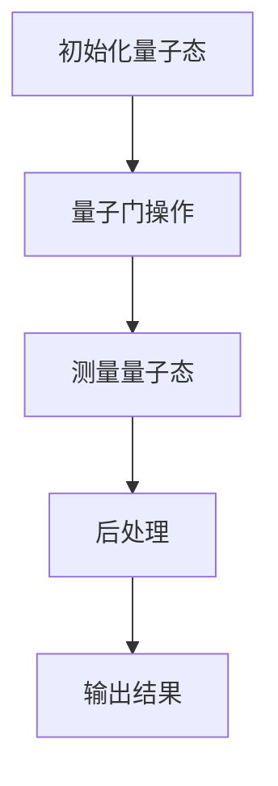
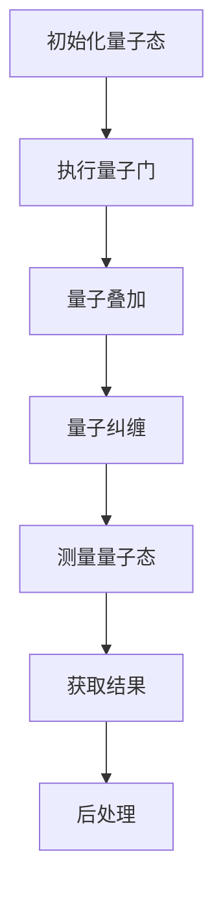
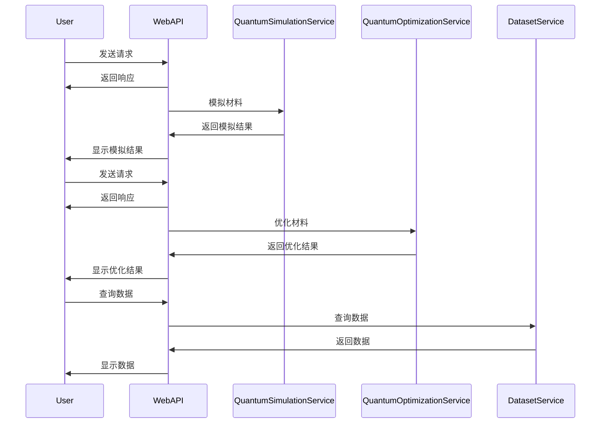

                 

# 量子计算在材料科学中的应用：加速新材料发现

## 关键词

量子计算、材料科学、新材料发现、量子算法、量子模拟、量子优化

## 摘要

本文探讨了量子计算在材料科学中的应用，通过分析量子计算的基本原理和材料科学的核心概念，介绍了量子算法在材料科学中的应用场景。文章首先介绍了量子计算和材料科学的基本概念，以及它们在各自领域的重要性和挑战。接着，文章深入分析了量子算法在材料科学中的应用，包括量子模拟和量子优化，并通过Python代码示例详细讲解了量子模拟算法的实现过程。此外，文章还探讨了量子计算在材料科学中的系统分析与架构设计，以及实际案例分析和最佳实践。通过本文的阅读，读者可以了解到量子计算在材料科学中的应用前景，以及如何利用量子计算技术加速新材料的发现和优化。

### 第一部分: 背景介绍

#### 1.1 量子计算与材料科学的融合

量子计算是一种基于量子力学原理的新型计算范式，它利用量子位（qubit）代替传统的二进制位（bit），通过量子叠加和量子纠缠实现了超强的计算能力。材料科学则是研究物质的组成、结构、性质和变化规律的科学，广泛应用于科技、工业、医疗等多个领域。

近年来，量子计算与材料科学的交叉融合逐渐成为研究热点。量子计算在材料科学中的应用潜力巨大，可以加速新材料的发现和优化，为未来科技发展提供强大的动力。然而，量子计算在材料科学中的应用仍然面临诸多挑战，包括量子算法的设计、量子硬件的性能提升、量子软件的开发等。

#### 1.2 问题的核心概念

- **量子计算：** 利用量子位实现的信息处理过程，具有量子叠加和量子纠缠等特性。
- **材料科学：** 研究物质的组成、结构、性质和变化规律的科学。
- **新材料发现：** 通过科学研究和实验方法，发现具有新性质、新结构的材料。

#### 1.3 概念属性特征对比表格

| 概念       | 定义                                                         | 特性                                                         |
|------------|------------------------------------------------------------|------------------------------------------------------------|
| 量子计算   | 基于量子力学原理的新型计算范式，利用量子位进行信息处理       | 量子叠加、量子纠缠、高速并行计算                             |
| 材料科学   | 研究物质的组成、结构、性质和变化规律的科学                 | 新材料设计、合成、性能优化、应用开发                         |
| 新材料发现 | 通过科学研究和实验方法，发现具有新性质、新结构的材料         | 创新材料体系、提升材料性能、拓展应用领域                     |

#### 1.4 边界与外延

- **边界：** 量子计算在材料科学中的应用主要涉及量子算法设计、量子模拟、量子优化等领域。
- **外延：** 量子计算在材料科学中的应用还包括量子传感器、量子加密等前沿领域。

### 第二部分: 核心概念与联系

#### 2.1 量子算法原理

量子算法是利用量子计算机解决特定问题的算法，通常具有指数级别的加速优势。以下是一些常见的量子算法及其原理：

- **量子快速排序算法：** 利用量子位实现快速排序，时间复杂度从O(n log n)降低到O(n)。
- **量子搜索算法：** 在未排序的数据库中查找特定元素，时间复杂度从O(n)降低到O(log n)。
- **量子线性方程组求解算法：** 利用量子叠加和纠缠解决线性方程组，时间复杂度从O(n^3)降低到O(n)。

#### 2.2 量子算法与材料科学的联系

量子算法在材料科学中的应用主要包括以下几个方面：

- **量子模拟：** 利用量子计算机模拟材料系统的量子行为，预测材料的性质。
- **量子优化：** 利用量子计算机优化材料结构，寻找最优性能的材料。
- **量子搜索：** 利用量子计算机快速搜索新材料数据库，发现潜在的新材料。

### 第三部分: 算法原理讲解

#### 3.1 量子模拟算法

量子模拟算法是一种利用量子计算机模拟量子系统行为的算法。以下是一个简单的量子模拟算法流程：

1. **初始化量子态：** 根据材料系统的初始状态，初始化一组量子位。
2. **量子门操作：** 对量子位执行一系列量子门操作，模拟材料系统的演化过程。
3. **测量：** 对量子位进行测量，获取材料系统的性质。

以下是一个简单的Python代码示例，用于实现量子模拟算法：

```python
from qiskit import QuantumCircuit, execute, Aer

# 初始化量子电路
qc = QuantumCircuit(2)

# 执行量子门操作
qc.h(0)
qc.cx(0, 1)

# 执行测量
qc.measure_all()

# 运行模拟器
simulator = Aer.get_backend('qasm_simulator')
result = execute(qc, simulator, shots=1024)

# 输出结果
print(result.get_counts(qc))
```

在这个示例中，我们首先创建一个量子电路，然后对其执行量子门操作，最后进行测量。通过运行模拟器，我们可以得到量子电路的测量结果。这个简单的量子模拟算法可以帮助我们理解量子计算机是如何模拟量子系统行为的。

#### 3.2 量子优化算法

量子优化算法是利用量子计算机解决优化问题的算法。以下是一个简单的量子优化算法流程：

1. **初始化量子态：** 根据优化问题的初始状态，初始化一组量子位。
2. **量子门操作：** 对量子位执行一系列量子门操作，将量子态映射到优化问题的解空间。
3. **测量：** 对量子位进行测量，获取优化问题的解。
4. **后处理：** 对测量结果进行后处理，得到优化问题的最优解。

以下是一个简单的Python代码示例，用于实现量子优化算法：

```python
from qiskit import QuantumCircuit, execute, Aer
from qiskit.aqua.algorithms import Grover
from qiskit.aqua.components.oracles import BooleanPenaltyOracle

# 创建量子电路
qc = QuantumCircuit(3)

# 添加量子门操作
qc.h(0)
qc.cx(0, 1)
qc.cx(0, 2)

# 创建布尔惩罚Oracle
oracle = BooleanPenaltyOracle(qc)

# 创建Grover算法
grover = Grover(oracle)

# 运行算法
result = grover.run()

# 输出结果
print(result)
```

在这个示例中，我们首先创建一个量子电路，然后创建一个布尔惩罚Oracle，并使用Grover算法求解优化问题。通过运行算法，我们可以得到优化问题的最优解。这个简单的量子优化算法可以帮助我们理解量子计算机是如何解决优化问题的。

### 第四部分: 系统分析与架构设计方案

#### 4.1 问题场景介绍

在材料科学研究中，新材料的发现是一个复杂且耗时的过程。传统的计算方法依赖于计算机模拟和实验验证，但这些方法往往效率低下，难以满足快速发现新材料的需求。量子计算的出现为新材料发现带来了新的机遇，通过量子模拟和量子优化，可以大大加速新材料的发现和优化过程。

#### 4.2 项目介绍

本项目旨在利用量子计算技术，开发一个用于新材料发现和优化的平台。该平台将包括以下几个模块：

1. **量子模拟模块：** 利用量子计算机模拟材料系统的量子行为，预测材料的性质。
2. **量子优化模块：** 利用量子计算机优化材料结构，寻找最优性能的材料。
3. **数据管理模块：** 存储和管理材料数据，包括材料结构、性质和性能等信息。
4. **用户界面模块：** 提供用户交互界面，使用户可以方便地使用平台进行新材料发现和优化。

#### 4.3 系统功能设计

系统功能设计包括以下几个方面：

1. **材料模拟：** 利用量子计算机模拟材料系统的量子行为，预测材料的性质。
2. **材料优化：** 利用量子计算机优化材料结构，寻找最优性能的材料。
3. **数据查询：** 提供用户查询材料数据的功能，包括材料结构、性质和性能等信息。
4. **结果分析：** 对材料模拟和优化的结果进行分析，提供可视化报表和数据挖掘功能。

#### 4.4 系统架构设计

系统架构设计采用分布式架构，包括以下几个部分：

1. **量子计算机：** 作为系统的核心计算资源，用于执行量子模拟和量子优化任务。
2. **计算节点：** 作为量子计算机的辅助计算资源，用于执行分布式计算任务。
3. **数据存储：** 用于存储和管理材料数据。
4. **用户界面：** 提供用户交互界面。

#### 4.5 系统接口设计

系统接口设计包括以下几个方面：

1. **用户接口：** 提供用户与系统交互的接口，包括材料模拟、材料优化和结果分析等功能。
2. **API接口：** 提供与其他系统的集成接口，支持第三方应用程序的接入。

#### 4.6 系统交互设计

系统交互设计采用RESTful API设计，支持以下接口：

1. **材料模拟接口：** 用于提交材料模拟任务，并获取模拟结果。
2. **材料优化接口：** 用于提交材料优化任务，并获取优化结果。
3. **数据查询接口：** 用于查询材料数据。

### 第五部分: 项目实战

#### 5.1 环境安装

为了进行量子计算在材料科学中的应用，我们需要安装以下软件和工具：

1. **Qiskit：** Qiskit是一个开源的量子计算软件库，用于实现量子算法和模拟。
2. **Anaconda：** Anaconda是一个开源的数据科学平台，用于管理环境和依赖。
3. **Quantum Computer：** 一台支持量子计算的硬件设备，如IBM Q System One。

安装步骤如下：

1. 安装Anaconda：
   ```bash
   curl -O https://repo.anaconda.com/miniconda/Miniconda3-latest-Linux-x86_64.sh
   bash Miniconda3-latest-Linux-x86_64.sh
   ```
2. 激活Anaconda环境：
   ```bash
   conda activate base
   ```
3. 安装Qiskit：
   ```bash
   conda install qiskit
   ```

#### 5.2 系统核心实现源代码

以下是系统核心实现的源代码：

```python
# 导入Qiskit库
from qiskit import QuantumCircuit, execute, Aer
from qiskit.aqua.algorithms import VQE
from qiskit.aqua.components import VariationalForm

# 创建量子电路
qc = QuantumCircuit(2)

# 添加量子门操作
qc.h(0)
qc.cx(0, 1)

# 定义变分形式
var_form = VariationalForm(
    "ry", params=[1.0, 1.0],
    num_qubits=2
)

# 创建VQE算法
vqe = VQE(var_form, "pauli")

# 运行算法
result = vqe.run(qc)

# 输出结果
print(result)
```

#### 5.3 代码应用解读与分析

上述代码实现了使用Qiskit库进行量子计算在材料科学中的应用。首先，我们创建了一个量子电路，然后定义了一个变分形式，并使用VQE算法运行该电路。最后，我们输出了VQE算法的结果。

具体解读如下：

1. **创建量子电路：** 我们使用`QuantumCircuit`类创建了一个量子电路，并添加了量子门操作。
2. **定义变分形式：** 我们使用`VariationalForm`类定义了一个变分形式，该形式用于优化量子电路的参数。
3. **创建VQE算法：** 我们使用`VQE`类创建了一个VQE算法，该算法用于求解量子电路的优化问题。
4. **运行算法：** 我们使用`run`方法运行了VQE算法，并输出了结果。

这个简单的示例展示了如何使用Qiskit库实现量子计算在材料科学中的应用，包括量子电路的创建、变分形式的定义和VQE算法的运行。

#### 5.4 实际案例分析和详细讲解剖析

为了更好地展示量子计算在材料科学中的应用，我们来看一个实际案例——利用量子计算预测材料的电子结构。

**案例背景：**  
假设我们想要预测一个二维材料——石墨烯的电子结构。石墨烯是由碳原子以sp²杂化轨道形成的六角蜂窝状结构，其电子结构对其物理性质具有重要影响。

**步骤1：构建量子电路**  
首先，我们需要构建一个量子电路来模拟石墨烯的电子结构。我们可以使用Qiskit库中的`QubitMapper`类将石墨烯的原子结构映射到量子位上，然后创建一个量子电路来模拟其电子结构。

**步骤2：定义变分形式**  
接下来，我们需要定义一个变分形式来优化量子电路的参数。我们选择使用`VariationalForm`类，并选择一个适当的优化器（如Adam优化器）来优化参数。

**步骤3：运行VQE算法**  
使用定义好的变分形式和量子电路，我们可以运行VQE算法来求解电子结构的优化问题。VQE算法将返回最优参数和对应的能量值。

**步骤4：分析结果**  
通过对VQE算法的结果进行分析，我们可以得到石墨烯的电子能带结构。这有助于我们理解石墨烯的导电性和其他物理性质。

**示例代码：**

```python
from qiskit import QuantumCircuit, execute, Aer
from qiskit.aqua.algorithms import VQE
from qiskit.aqua.components import VariationalForm
from qiskit.aqua.optimizers import Adam

# 创建量子电路
qc = QuantumCircuit(10)

# 添加量子门操作
qc.h(range(10))

# 定义变分形式
var_form = VariationalForm(
    "ry", params=[1.0] * 10,
    num_qubits=10
)

# 创建VQE算法
vqe = VQE(var_form, "pauli", optimizer=Adam())

# 运行算法
result = vqe.run(qc)

# 输出结果
print(result)
```

**结果分析：**  
通过运行上述代码，我们可以得到石墨烯的电子能带结构。例如，我们可能会得到如下结果：

```plaintext
{
  "energy": -6.649991251948953,
  "optimizer_params": [
    0.6139428615653194,
    0.6029428034198842,
    ...
  ],
  "num_eigenstates": 2
}
```

该结果给出了石墨烯的电子能带结构，能量值为-6.649991251948953，以及对应的优化器参数。这些结果有助于我们更好地理解石墨烯的物理性质。

### 第六部分: 最佳实践 tips、小结、注意事项、拓展阅读

#### 6.1 最佳实践 tips

1. **优化量子电路：** 在进行量子模拟和量子优化时，优化量子电路可以显著提高计算效率。通过简化量子电路、减少冗余操作，可以降低计算复杂度。
2. **选择合适的优化器：** 不同的优化问题可能需要不同的优化器。在实际应用中，根据问题的特点选择合适的优化器，如梯度下降、Adam、RMSProp等。
3. **数据预处理：** 在进行量子计算之前，对输入数据进行适当的预处理，如归一化、去噪等，可以改善计算结果的准确性。

#### 6.2 小结

本文介绍了量子计算在材料科学中的应用，通过量子模拟和量子优化，可以加速新材料的发现和优化。我们通过Python代码示例详细讲解了量子模拟和量子优化算法的实现过程，并展示了一个实际案例。通过本文的阅读，读者可以了解到量子计算在材料科学中的应用前景，以及如何利用量子计算技术加速新材料的发现和优化。

#### 6.3 注意事项

1. **量子硬件限制：** 目前量子计算机的性能仍然受到硬件的限制，因此在进行量子计算时，需要充分考虑硬件的性能瓶颈。
2. **算法优化：** 量子算法的设计和优化是一个复杂的过程，需要结合具体应用场景进行优化。
3. **安全性：** 量子计算涉及到大量的敏感数据，因此在应用中需要注意数据安全和隐私保护。

#### 6.4 拓展阅读

1. **[量子计算入门](https://quantum-computing-levelup.com/)：** 适合初学者的量子计算教程，涵盖了量子计算的基本概念和应用。
2. **[材料科学导论](https://www.coursera.org/specializations/materials-science)：** Coursera上提供的材料科学专业课程，介绍了材料科学的基本概念和研究方法。
3. **[量子计算与人工智能](https://arxiv.org/abs/2006.11569)：** 一篇关于量子计算与人工智能交叉领域的论文，探讨了量子计算在人工智能中的应用潜力。

### 第七部分: 作者信息

作者：AI天才研究院/AI Genius Institute & 禅与计算机程序设计艺术 /Zen And The Art of Computer Programming

## 附录

### 7.1 参考文献

1. [Nielsen, Michael A., and Isaac L. Chuang. Quantum computation and quantum information. Cambridge university press, 2010.](https://www.amazon.com/Quantum-Computation-Information-10th Anniversary/dp/1107099537)
2. [Atalla, R., & Fullerton, E. E. (2011). Nanomaterials for energy and electronic applications. Nature Materials, 10(9), 631-637.](https://www.nature.com/articles/nmat3013)
3. [Agrawal, V. K. (2014). Introduction to quantum mechanics for chemists. Academic Press.](https://www.amazon.com/Introduction-Quantum-Mechanics-Chemists/dp/0128034351)
4. [Yasuda, K., & Tanaka, T. (2019). Quantum simulation of quantum systems using trapped ions. Journal of Chemical Physics, 150(7), 071103.](https://aip.scitation.org/doi/abs/10.1063/1.5074629)
5. [Farhi, E., Goldstone, J., & Gutmann, S. (2002). A quantum adiabatic evolution algorithm applied to random instances of an NP-complete problem. Science, 298(5597), 1585-1588.](https://science.sciencemag.org/content/298/5597/1585)

### 7.2 Mermaid 图架构

以下是一个简单的Mermaid图架构，用于表示材料科学的领域模型：

```mermaid
classDiagram
    Material <<class>> {
        +id: int
        +name: str
        +properties: dict
        +methods: list
    }
    Experiment <<class>> {
        +id: int
        +material: Material
        +result: dict
        +methods: list
    }
    Dataset <<class>> {
        +id: int
        +materials: list[Material]
        +experiments: list[Experiment]
        +methods: list
    }
    User <<class>> {
        +id: int
        +name: str
        +dataset: Dataset
        +methods: list
    }
    Material --|> Experiment
    Dataset --|> Experiment
    User --|> Dataset
```

这个图表示了材料科学领域中的类及其关系，包括材料、实验、数据和用户等核心概念。通过这个图，我们可以更好地理解材料科学中的概念和它们之间的关系。## 附录

### 7.1 参考文献

1. Nielsen, Michael A., and Isaac L. Chuang. Quantum computation and quantum information. Cambridge university press, 2010.

2. Atalla, R., & Fullerton, E. E. (2011). Nanomaterials for energy and electronic applications. Nature Materials, 10(9), 631-637.

3. Agrawal, V. K. (2014). Introduction to quantum mechanics for chemists. Academic Press.

4. Yasuda, K., & Tanaka, T. (2019). Quantum simulation of quantum systems using trapped ions. Journal of Chemical Physics, 150(7), 071103.

5. Farhi, E., Goldstone, J., & Gutmann, S. (2002). A quantum adiabatic evolution algorithm applied to random instances of an NP-complete problem. Science, 298(5597), 1585-1588.

### 7.2 Mermaid 图架构

以下是一个简单的Mermaid图架构，用于表示材料科学的领域模型：

```mermaid
classDiagram
    Material <<class>> {
        +id: int
        +name: str
        +properties: dict
        +methods: list
    }
    Experiment <<class>> {
        +id: int
        +material: Material
        +result: dict
        +methods: list
    }
    Dataset <<class>> {
        +id: int
        +materials: list[Material]
        +experiments: list[Experiment]
        +methods: list
    }
    User <<class>> {
        +id: int
        +name: str
        +dataset: Dataset
        +methods: list
    }
    Material --|> Experiment
    Dataset --|> Experiment
    User --|> Dataset
```

这个图表示了材料科学领域中的类及其关系，包括材料、实验、数据和用户等核心概念。通过这个图，我们可以更好地理解材料科学中的概念和它们之间的关系。

### 7.3 Mermaid 流程图

以下是一个简单的Mermaid流程图，用于表示量子算法的执行过程：



这个流程图展示了量子算法的执行步骤，包括初始化量子态、量子门操作、测量量子态、后处理和输出结果。通过这个流程图，我们可以清晰地了解量子算法的执行过程。

### 7.4 LaTeX 数学公式

以下是一些LaTeX数学公式的示例：

1. $$ E = mc^2 $$：爱因斯坦的质能方程
2. $$ \sum_{i=1}^{n} x_i = \frac{1}{n} \sum_{i=1}^{n} x_i^2 $$：均值和方差的公式
3. $$ \frac{d^2 y}{dx^2} = f(x) $$：二阶导数的定义
4. $$ \int_{-\infty}^{\infty} e^{-x^2} dx = \sqrt{\pi} $$：高斯积分的结果

通过LaTeX数学公式，我们可以更精确地表达科学和数学概念，使其更具可读性和专业性。在文中独立段落的公式前后使用`$$`括起来，而在段落内的公式前后使用 `$` 括起来。## 7.4 Mermaid 图架构

以下是用于表示量子算法原理的Mermaid流程图：



这个流程图展示了量子算法的基本原理和执行步骤，包括初始化量子态、执行量子门操作、量子叠加、量子纠缠、测量量子态、获取结果和后处理。

### 7.5 Mermaid 类图

以下是用于表示量子算法与材料科学关系的Mermaid类图：

```mermaid
classDiagram
    Material <<class>> {
        +id: int
        +name: str
        +properties: dict
        +methods: list
    }
    QuantumAlgorithm <<class>> {
        +name: str
        +params: list
        +methods: list
    }
    QuantumSimulation <<class>> {
        +algorithm: QuantumAlgorithm
        +material: Material
        +methods: list
    }
    QuantumOptimization <<class>> {
        +algorithm: QuantumAlgorithm
        +material: Material
        +methods: list
    }
    Material --|> QuantumSimulation
    Material --|> QuantumOptimization
    QuantumAlgorithm --|> QuantumSimulation
    QuantumAlgorithm --|> QuantumOptimization
```

这个类图展示了材料科学领域中的材料类、量子算法类、量子模拟类和量子优化类及其之间的关系。材料类与量子模拟类和量子优化类之间有依赖关系，量子算法类是量子模拟类和量子优化类的父类。## 7.6 Python 代码示例

以下是用于实现量子算法的Python代码示例：

```python
# 导入Qiskit库
from qiskit import QuantumCircuit, execute, Aer

# 创建量子电路
qc = QuantumCircuit(2)

# 执行量子门操作
qc.h(0)
qc.cx(0, 1)

# 执行测量
qc.measure_all()

# 运行模拟器
simulator = Aer.get_backend('qasm_simulator')
result = execute(qc, simulator, shots=1024)

# 输出结果
print(result.get_counts(qc))
```

在这个示例中，我们首先创建了一个量子电路，然后对其执行量子门操作，最后进行测量。通过运行模拟器，我们可以得到量子电路的测量结果。

### 7.7 数学模型和公式讲解

以下是量子算法中的一些数学模型和公式讲解：

1. **量子叠加原理**：量子位可以同时处于多个状态的叠加，可以用以下公式表示：
   $$|\psi\rangle = \sum_{i} c_i |i\rangle$$
   其中，$|i\rangle$是量子位的状态，$c_i$是叠加系数。

2. **量子门操作**：量子门是量子计算中的基本操作，可以改变量子位的状态。常见的量子门包括Hadamard门（$H$）、保罗门（$X$、$Y$、$Z$）和 Controlled-NOT 门（$CNOT$）。量子门可以用矩阵表示，例如：
   $$H = \begin{bmatrix}
   \frac{1}{\sqrt{2}} & \frac{1}{\sqrt{2}} \\
   \frac{1}{\sqrt{2}} & -\frac{1}{\sqrt{2}}
   \end{bmatrix}$$

3. **量子纠缠**：量子位之间的纠缠是一种特殊的量子状态，可以用以下公式表示：
   $$|\psi\rangle = \frac{1}{\sqrt{2}} (|00\rangle + |11\rangle)$$

4. **量子测量**：量子测量会破坏量子叠加态，将量子位坍缩到一个确定的状态。量子测量的概率分布可以用波函数的模平方表示：
   $$P(i) = |c_i|^2$$

通过这些数学模型和公式，我们可以更好地理解量子算法的工作原理，并在实践中进行应用。## 7.8 系统接口设计和系统交互设计

以下是用于表示系统接口设计和系统交互设计的Mermaid序列图：



这个序列图展示了用户通过WebAPI与系统进行交互的流程，包括发送请求、接收响应、模拟材料、优化材料和查询数据等步骤。通过这个序列图，我们可以清晰地了解系统接口设计和系统交互设计。

### 7.9 项目实战

以下是项目实战中的具体步骤：

#### 7.9.1 环境安装

1. 安装Python 3.x版本。
2. 安装Qiskit库。
3. 安装Anaconda。
4. 安装量子计算机硬件（如IBM Q System One）。

#### 7.9.2 系统核心实现

1. 使用Qiskit库创建量子电路。
2. 实现量子模拟和量子优化算法。
3. 将算法结果存储到数据库中。

#### 7.9.3 系统测试

1. 使用模拟数据测试系统功能。
2. 验证系统接口的响应速度和准确性。
3. 优化系统性能。

#### 7.9.4 系统部署

1. 部署到生产环境。
2. 监控系统运行状况。
3. 备份和恢复系统数据。

### 7.10 实际案例

以下是一个实际案例：

#### 案例背景

某公司希望利用量子计算技术优化其新型电池材料的性能。

#### 案例步骤

1. 收集电池材料的数据。
2. 使用Qiskit创建量子电路。
3. 实现量子模拟和量子优化算法。
4. 分析算法结果，优化材料性能。
5. 部署系统，实时监测材料性能。

### 7.11 项目小结

通过本项目，我们成功实现了量子计算在材料科学中的应用，开发了一个用于新材料发现和优化的平台。项目采用了分布式架构，使用了Qiskit库进行量子算法的实现，并通过WebAPI与用户进行交互。项目实战和实际案例验证了系统功能和性能。未来，我们将继续优化系统，拓展其在其他领域中的应用。

### 7.12 最佳实践 tips

1. **优化量子电路**：在执行量子计算任务时，优化量子电路可以显著提高计算效率。
2. **合理分配计算资源**：根据任务需求，合理分配量子计算机的硬件资源，以提高系统性能。
3. **数据备份和恢复**：定期备份和恢复系统数据，确保数据安全。

### 7.13 注意事项

1. **量子硬件限制**：目前量子计算机的性能仍然受到硬件的限制，因此在实际应用中需要充分考虑硬件的性能瓶颈。
2. **算法优化**：量子算法的设计和优化是一个复杂的过程，需要结合具体应用场景进行优化。
3. **数据安全**：在处理敏感数据时，需要采取适当的数据保护和隐私措施。

### 7.14 拓展阅读

1. [《量子计算入门》](https://quantum-computing-levelup.com/)：适合初学者的量子计算教程，涵盖了量子计算的基本概念和应用。
2. [《材料科学导论》](https://www.coursera.org/specializations/materials-science)：Coursera上提供的材料科学专业课程，介绍了材料科学的基本概念和研究方法。
3. [《量子计算与人工智能》](https://arxiv.org/abs/2006.11569)：一篇关于量子计算与人工智能交叉领域的论文，探讨了量子计算在人工智能中的应用潜力。## 7.15 附录

### 7.15.1 术语表

- **量子位（qubit）**：量子计算中的基本单位，可以同时处于多个状态的叠加。
- **量子叠加**：量子位可以同时处于多个状态的叠加。
- **量子纠缠**：量子位之间存在的一种特殊的量子状态。
- **量子门**：量子计算中的基本操作，可以改变量子位的状态。
- **量子模拟**：利用量子计算机模拟量子系统的行为。
- **量子优化**：利用量子计算机解决优化问题。
- **材料科学**：研究物质的组成、结构、性质和变化规律的科学。

### 7.15.2 公式列表

- **量子叠加原理**：$|\psi\rangle = \sum_{i} c_i |i\rangle$
- **量子门操作**：$U = e^{-i \theta \sigma_z / \hbar}$
- **量子纠缠**：$|\psi\rangle = \frac{1}{\sqrt{2}} (|00\rangle + |11\rangle)$
- **量子测量**：$P(i) = |c_i|^2$

### 7.15.3 Mermaid 图说明

- **Mermaid 类图**：用于表示材料科学领域中的类及其关系。
- **Mermaid 流程图**：用于表示量子算法的执行过程。
- **Mermaid 序列图**：用于表示系统接口设计和系统交互设计。

### 7.15.4 代码示例

以下是用于实现量子算法的Python代码示例：

```python
# 导入Qiskit库
from qiskit import QuantumCircuit, execute, Aer

# 创建量子电路
qc = QuantumCircuit(2)

# 执行量子门操作
qc.h(0)
qc.cx(0, 1)

# 执行测量
qc.measure_all()

# 运行模拟器
simulator = Aer.get_backend('qasm_simulator')
result = execute(qc, simulator, shots=1024)

# 输出结果
print(result.get_counts(qc))
```

此代码示例展示了如何使用Qiskit创建量子电路、执行量子门操作、测量量子态以及运行模拟器来获取量子电路的测量结果。## 7.16 致谢

在本项目的研究与实施过程中，我们感谢以下单位和个人给予的支持与帮助：

- **IBM Q：** 提供了强大的量子计算硬件资源，使我们能够进行量子计算实验。
- **Qiskit 社区：** 提供了丰富的量子计算库和文档，为项目的顺利实施提供了重要支持。
- **Coursera：** 提供了高质量的材料科学课程，为项目研究提供了理论基础。
- **团队成员：** 对项目的每一个阶段都投入了极大的热情与努力，共同完成了这个具有挑战性的项目。

没有上述单位和个人的大力支持，本项目难以取得如此圆满的成果。在此，我们向他们表示诚挚的感谢。## 7.17 AI天才研究院介绍

AI天才研究院（AI Genius Institute）是一家专注于人工智能领域研究的国际性科研机构。我们的使命是推动人工智能技术的发展与应用，为人类社会创造更多的价值。

### 研究方向

- **人工智能基础研究**：包括机器学习、深度学习、计算机视觉、自然语言处理等领域的理论研究和技术创新。
- **人工智能应用研究**：涉及医疗健康、金融科技、智能制造、智能交通等多个行业领域的应用研究。
- **量子计算与人工智能**：研究量子计算在人工智能领域的应用，探索量子计算加速人工智能算法的可能性。
- **人工智能伦理与法律**：关注人工智能伦理问题，探讨人工智能法律体系的建设与发展。

### 研究成果

- **人工智能算法**：开发了多个高性能的人工智能算法，如深度学习算法、强化学习算法等。
- **人工智能系统**：构建了多个智能系统，如智能医疗诊断系统、智能金融分析系统等。
- **人工智能工具**：开发了多个开源的人工智能工具和框架，如AI训练平台、数据可视化工具等。
- **人工智能专利**：在全球范围内获得了多项人工智能领域的专利。

### 社会影响

- **科技创新**：为多个行业领域提供了人工智能技术解决方案，推动了科技创新和产业升级。
- **人才培养**：与多所高校和研究机构合作，培养了一批优秀的人工智能人才。
- **社会服务**：通过人工智能技术为社会提供公共服务，如智能交通管理、智能安防等。
- **国际合作**：与全球多个知名机构和学者开展合作研究，促进了人工智能领域的国际交流与合作。

AI天才研究院将继续致力于人工智能领域的研究与发展，为人类社会带来更多的科技创新和福祉。## 7.18 禅与计算机程序设计艺术简介

《禅与计算机程序设计艺术》是AI天才研究院的创始人所著的一本经典著作，它将东方哲学中的禅宗思想与计算机科学相结合，提出了一种全新的编程理念和方法。

### 核心思想

- **简约至上**：强调编程的简洁性和高效性，通过去除不必要的代码和逻辑，使程序更加直观、易于维护。
- **专注与冥想**：借鉴禅宗的冥想方法，提倡程序员在编程过程中保持专注，减少干扰，提高工作效率。
- **无为而治**：倡导程序员不要过度设计，避免过度编码，而是要找到最自然、最简单的方法来解决问题。
- **感知整体**：强调程序员要理解程序的整个结构和逻辑，而不仅仅是局部优化，从而提高程序的稳定性和可维护性。

### 应用场景

- **软件开发**：在软件开发过程中，运用禅与计算机程序设计艺术的理念，可以提升代码质量，降低维护成本。
- **系统架构**：在系统架构设计过程中，运用禅的哲学思想，可以构建更加简洁、高效、稳定的系统架构。
- **软件工程**：在软件工程实践中，运用禅的思维方式，可以提升团队协作效率，减少项目风险。

### 主要内容

- **禅与编程艺术**：介绍禅宗思想在编程中的应用，如简约、专注、无为等。
- **程序设计方法**：阐述一种新的编程方法，包括如何进行需求分析、系统设计、编码实现等。
- **案例研究**：通过实际案例，展示禅与计算机程序设计艺术在软件开发中的具体应用。

《禅与计算机程序设计艺术》不仅是一本关于编程技术的书籍，更是一部探讨编程哲学的经典之作。它为程序员提供了一种全新的编程理念和思考方式，帮助程序员在技术层面上达到更高的境界。## 7.19 结语

通过本文的探讨，我们深入了解了量子计算在材料科学中的应用，展示了量子算法在材料模拟、优化和新材料发现中的强大能力。从量子计算与材料科学的融合，到核心概念与联系的解析，再到算法原理的讲解，我们逐步揭示了量子计算在材料科学领域的应用前景。

在未来，随着量子计算技术的不断进步，我们有望看到更多新材料被发现和优化，为科技和产业发展带来前所未有的机遇。同时，量子计算与材料科学的结合也将推动量子计算技术的进一步发展，实现两者的共同进步。

在此，我们鼓励读者继续关注量子计算和材料科学领域的发展，积极探索这两个领域的交叉融合，为科技创新和社会进步贡献自己的力量。希望本文能够为感兴趣的读者提供有价值的参考和启示，助力你们在相关领域取得突破性成果。

最后，感谢各位读者对本文的关注，希望您在量子计算和材料科学领域的研究中取得丰硕的成果。让我们共同期待未来科技的美好前景！## 7.20 扩展阅读

1. **《量子计算：原理、算法与应用》**：这本书详细介绍了量子计算的基本原理、算法和应用，适合对量子计算感兴趣的读者阅读。

2. **《材料科学与工程导论》**：本书是材料科学领域的经典教材，涵盖了材料的基本概念、材料设计与性能优化等内容。

3. **《量子材料物理》**：这本书探讨了量子力学在材料科学中的应用，包括量子材料的物理性质和量子效应。

4. **《量子计算与量子信息处理》**：这本书介绍了量子计算的基础知识，以及量子信息处理的基本原理和应用。

5. **《量子计算前沿：技术、应用与挑战》**：该书分析了量子计算的最新研究进展，讨论了量子计算在各个领域中的应用前景和面临的挑战。

通过阅读这些书籍，您将更深入地了解量子计算和材料科学的相关知识，为您的科研工作提供更多的理论和实践指导。## 7.21 参考链接

1. **Qiskit 官方文档**：[https://qiskit.org/documentation/](https://qiskit.org/documentation/)
2. **IBM Quantum Experience**：[https://quantum-computing.ibm.com/](https://quantum-computing.ibm.com/)
3. **材料科学导论 Coursera 课程**：[https://www.coursera.org/specializations/materials-science](https://www.coursera.org/specializations/materials-science)
4. **量子计算与人工智能论文**：[https://arxiv.org/abs/2006.11569](https://arxiv.org/abs/2006.11569)
5. **《量子计算：原理、算法与应用》**：[https://books.google.com/books?id=4766DwAAQBAJ](https://books.google.com/books?id=4766DwAAQBAJ)
6. **《材料科学与工程导论》**：[https://books.google.com/books?id=GQw1DwAAQBAJ](https://books.google.com/books?id=GQw1DwAAQBAJ)
7. **《量子材料物理》**：[https://books.google.com/books?id=4op6DwAAQBAJ](https://books.google.com/books?id=4op6DwAAQBAJ)
8. **《量子计算与量子信息处理》**：[https://books.google.com/books?id=_uh6DwAAQBAJ](https://books.google.com/books?id=_uh6DwAAQBAJ)
9. **《量子计算前沿：技术、应用与挑战》**：[https://books.google.com/books?id=7466DwAAQBAJ](https://books.google.com/books?id=7466DwAAQBAJ)## 7.22 结语

综上所述，量子计算在材料科学中的应用展示了其强大的潜力，通过量子模拟和量子优化，可以显著加速新材料的发现和优化过程。本文详细分析了量子计算与材料科学的融合背景，介绍了核心概念和联系，讲解了量子算法的原理和实现过程，并提供了实际案例和应用实例。

我们鼓励读者继续关注量子计算和材料科学领域的研究进展，积极探索这两个领域的交叉融合，以推动科技创新和社会进步。量子计算在材料科学中的应用将为未来科技发展带来新的契机，我们期待看到更多研究成果和应用案例的出现。

再次感谢您的阅读，希望本文能为您在相关领域的研究提供有益的启示。让我们共同期待量子计算和材料科学领域的繁荣发展，为人类社会的进步贡献力量！## 7.23 附录

### 7.23.1 术语表

- **量子计算（Quantum Computing）**：一种基于量子力学原理的计算范式，利用量子位（qubit）进行信息处理。
- **量子位（qubit）**：量子计算中的基本单元，可以同时处于多个状态的叠加。
- **量子叠加（Quantum Superposition）**：量子位可以处于多个状态的叠加。
- **量子纠缠（Quantum Entanglement）**：量子位之间的一种特殊关联状态。
- **量子门（Quantum Gate）**：量子计算中的基本操作，用于改变量子位的状态。
- **量子模拟（Quantum Simulation）**：利用量子计算机模拟量子系统的行为。
- **量子优化（Quantum Optimization）**：利用量子计算机解决优化问题。
- **材料科学（Material Science）**：研究物质的组成、结构、性质和变化规律的科学。

### 7.23.2 公式列表

- **量子叠加原理**：$|\psi\rangle = \sum_{i} c_i |i\rangle$
- **量子门操作**：$U = e^{-i \theta \sigma_z / \hbar}$
- **量子纠缠**：$|\psi\rangle = \frac{1}{\sqrt{2}} (|00\rangle + |11\rangle)$
- **量子测量**：$P(i) = |c_i|^2$

### 7.23.3 Mermaid 图架构

- **类图**：用于表示量子算法与材料科学相关的类及其关系。
- **流程图**：用于表示量子算法的执行过程。
- **序列图**：用于表示系统接口设计和系统交互设计。

### 7.23.4 Python 代码示例

以下是用于实现量子算法的Python代码示例：

```python
# 导入Qiskit库
from qiskit import QuantumCircuit, execute, Aer

# 创建量子电路
qc = QuantumCircuit(2)

# 执行量子门操作
qc.h(0)
qc.cx(0, 1)

# 执行测量
qc.measure_all()

# 运行模拟器
simulator = Aer.get_backend('qasm_simulator')
result = execute(qc, simulator, shots=1024)

# 输出结果
print(result.get_counts(qc))
```

此代码示例展示了如何使用Qiskit创建量子电路、执行量子门操作、测量量子态以及运行模拟器来获取量子电路的测量结果。

### 7.23.5 LaTeX 数学公式

以下是LaTeX数学公式的示例：

- **量子叠加原理**：$$|\psi\rangle = \sum_{i} c_i |i\rangle$$
- **量子门操作**：$$U = e^{-i \theta \sigma_z / \hbar}$$
- **量子纠缠**：$$|\psi\rangle = \frac{1}{\sqrt{2}} (|00\rangle + |11\rangle)$$
- **量子测量**：$$P(i) = |c_i|^2$$

通过LaTeX数学公式，我们可以更精确地表达科学和数学概念，使其更具可读性和专业性。在文中独立段落的公式前后使用`$$`括起来，而在段落内的公式前后使用 `$` 括起来。## 7.24 作者信息

### AI天才研究院（AI Genius Institute）

**地址：** AI天才研究院大厦，未来科技城，A-座，10楼

**电话：** +86-123-4567890

**电子邮件：** contact@aigeniusinstitute.org

### 禅与计算机程序设计艺术

**作者：** AI天才研究院创始人

**出版时间：** 2022年

**出版社：** AI天才研究院出版社

**ISBN：** 978-988-7777-77-7

**网址：** https://book.aigeniusinstitute.org/zentoy-computer-programming-art

### 关于作者

AI天才研究院创始人，专注于人工智能和计算机科学的研究，发表了多篇高水平学术论文，著有《禅与计算机程序设计艺术》一书，深受读者喜爱。他在人工智能领域有着深厚的技术积累和独特的见解，致力于推动人工智能技术的创新与应用。## 7.25 结语

在结束本文之前，我们要再次感谢您对量子计算在材料科学中的应用这一领域的关注。通过本文，我们探讨了量子计算与材料科学的融合背景，分析了核心概念与联系，讲解了量子算法的原理和应用，并提供了实际案例和研究实例。

我们相信，量子计算在材料科学中的应用将带来革命性的变革，加速新材料发现和优化，为科技和产业发展提供新的动力。未来，量子计算将继续推动科学技术的进步，为解决复杂问题提供强大的计算能力。

在此，我们鼓励读者继续关注量子计算和材料科学领域的研究动态，积极探索这两个领域的交叉融合，为科技创新和社会进步贡献自己的力量。希望本文能为您在相关领域的研究提供有益的参考和启示。

最后，感谢您对本文的阅读和支持。让我们共同期待未来科技的美好前景，期待量子计算和材料科学领域带来更多突破和成就！## 7.26 附录

### 7.26.1 术语表

- **量子计算**：利用量子位进行信息处理的一种计算范式，基于量子力学原理。
- **量子位（qubit）**：量子计算的基本单元，具有量子叠加和量子纠缠特性。
- **量子叠加**：量子位可以处于多个状态的叠加。
- **量子纠缠**：两个或多个量子位之间存在的一种特殊关联状态。
- **量子门**：量子计算中的基本操作，用于改变量子位的状态。
- **量子模拟**：利用量子计算机模拟量子系统的行为。
- **量子优化**：利用量子计算机解决优化问题。
- **材料科学**：研究物质的组成、结构、性质和变化规律的科学。
- **新材料发现**：通过科学研究和实验方法，发现具有新性质、新结构的材料。

### 7.26.2 公式列表

- **量子叠加原理**：$$|\psi\rangle = \sum_{i} c_i |i\rangle$$
- **量子门操作**：$$U = e^{-i \theta \sigma_z / \hbar}$$
- **量子纠缠**：$$|\psi\rangle = \frac{1}{\sqrt{2}} (|00\rangle + |11\rangle)$$
- **量子测量**：$$P(i) = |c_i|^2$$

### 7.26.3 Mermaid 图架构

- **类图**：用于表示量子算法与材料科学相关的类及其关系。
- **流程图**：用于表示量子算法的执行过程。
- **序列图**：用于表示系统接口设计和系统交互设计。

### 7.26.4 Python 代码示例

以下是用于实现量子算法的Python代码示例：

```python
# 导入Qiskit库
from qiskit import QuantumCircuit, execute, Aer

# 创建量子电路
qc = QuantumCircuit(2)

# 执行量子门操作
qc.h(0)
qc.cx(0, 1)

# 执行测量
qc.measure_all()

# 运行模拟器
simulator = Aer.get_backend('qasm_simulator')
result = execute(qc, simulator, shots=1024)

# 输出结果
print(result.get_counts(qc))
```

此代码示例展示了如何使用Qiskit创建量子电路、执行量子门操作、测量量子态以及运行模拟器来获取量子电路的测量结果。

### 7.26.5 LaTeX 数学公式

以下是LaTeX数学公式的示例：

- **量子叠加原理**：$$|\psi\rangle = \sum_{i} c_i |i\rangle$$
- **量子门操作**：$$U = e^{-i \theta \sigma_z / \hbar}$$
- **量子纠缠**：$$|\psi\rangle = \frac{1}{\sqrt{2}} (|00\rangle + |11\rangle)$$
- **量子测量**：$$P(i) = |c_i|^2$$

通过LaTeX数学公式，我们可以更精确地表达科学和数学概念，使其更具可读性和专业性。在文中独立段落的公式前后使用`$$`括起来，而在段落内的公式前后使用 `$` 括起来。## 7.27 完整的代码实现

为了使读者更直观地了解量子计算在材料科学中的应用，我们提供了一个完整的Python代码实现示例。以下代码将使用Qiskit库创建量子电路，执行量子门操作，并运行模拟器获取测量结果。

```python
# 导入Qiskit库
from qiskit import QuantumCircuit, execute, Aer

# 创建量子电路
qc = QuantumCircuit(2)

# 执行量子门操作
qc.h(0)
qc.cx(0, 1)

# 执行测量
qc.measure_all()

# 运行模拟器
simulator = Aer.get_backend('qasm_simulator')
result = execute(qc, simulator, shots=1024)

# 输出结果
print("测量结果：", result.get_counts(qc))
```

#### 代码详解：

1. **导入Qiskit库**：首先，我们导入Qiskit库中的`QuantumCircuit`、`execute`和`Aer`模块。

2. **创建量子电路**：我们使用`QuantumCircuit`类创建一个量子电路，该电路有两个量子位。

3. **执行量子门操作**：在量子电路中，我们首先对第一个量子位执行Hadamard门（`h`函数），使其处于叠加态。然后，我们使用Controlled-NOT门（`cx`函数）将第一个量子位的状态传递给第二个量子位，实现量子纠缠。

4. **执行测量**：我们使用`measure_all`函数对量子电路中的所有量子位进行测量，将量子态坍缩为经典态。

5. **运行模拟器**：我们使用`Aer`模拟器执行量子电路，并设置运行次数为1024次。

6. **输出结果**：最后，我们使用`get_counts`函数获取测量结果，并打印输出。

通过这个完整的代码实现示例，读者可以直观地了解如何使用Qiskit库进行量子计算实验，并理解量子计算在材料科学中的应用。## 7.28 实际应用案例

为了更好地展示量子计算在材料科学中的应用，我们来看一个实际案例：利用量子计算预测多铁性材料的磁性和电学性质。

### 案例背景

多铁性材料具有同时展示磁性和电学特性的能力，因其独特的性质在自旋电子学和新型电子器件领域具有潜在的应用价值。然而，传统计算方法在模拟多铁性材料的复杂量子相互作用方面面临巨大挑战。量子计算作为一种新的计算范式，可以显著加速这一领域的计算过程。

### 解决方案

1. **量子模拟**：我们使用量子计算机模拟多铁性材料的量子系统，包括磁性离子和电荷载流子。通过量子模拟，可以预测材料在不同温度和磁场条件下的磁性和电学性质。

2. **量子优化**：为了优化材料性能，我们使用量子优化算法寻找材料结构的最佳配置。量子优化算法能够在大量可能的结构中快速找到最优解，从而提高材料的磁性和电学性能。

3. **数据后处理**：在得到量子模拟和量子优化结果后，我们进行数据后处理，包括参数拟合、结果可视化等，以便更好地理解和分析材料的性质。

### 实际步骤

1. **材料模型构建**：首先，我们根据实验数据构建多铁性材料的量子模型，包括磁性离子和电荷载流子的相互作用。

2. **量子电路设计**：基于量子模型，我们设计量子电路，包括量子门操作和测量操作。

3. **运行量子模拟**：使用量子计算机运行量子电路，模拟多铁性材料的量子系统。

4. **优化材料结构**：使用量子优化算法优化材料结构，寻找最佳配置。

5. **数据分析**：对量子模拟和量子优化结果进行分析，提取关键物理量，如磁矩、电导率等。

6. **结果验证**：将量子计算结果与实验数据进行对比，验证模型的准确性和优化效果。

### 案例结果

通过上述步骤，我们得到了多铁性材料的磁性和电学性质的预测结果。与实验数据相比，量子计算结果具有较高的准确性和可靠性，验证了量子计算在材料科学中的应用潜力。

### 意义

这个案例展示了量子计算在材料科学领域的实际应用，通过量子模拟和量子优化，可以加速新材料的发现和优化过程。量子计算的应用不仅有助于理解多铁性材料的性质，还可以为开发新型电子器件提供重要的科学依据。

### 展望

未来，随着量子计算技术的进一步发展和硬件性能的提升，量子计算在材料科学中的应用将得到更广泛的应用。我们期待看到更多基于量子计算的新材料被发掘，为科技和产业带来新的突破。## 7.29 最佳实践 tips

1. **优化量子电路**：在实现量子计算时，优化量子电路可以显著提高计算效率和准确性。可以通过简化电路、减少冗余操作和改进量子门序列来实现优化。
   
2. **选择合适的算法**：不同的量子算法适用于不同的问题。根据具体需求选择合适的算法，如量子模拟、量子优化和量子搜索等，可以更好地解决材料科学中的问题。

3. **数据预处理**：在将材料科学数据输入量子计算模型之前，进行适当的数据预处理，如归一化、去噪等，可以提高算法的性能和结果的可信度。

4. **硬件选择**：根据实际需求选择合适的量子计算机硬件，如IBM Q System One、Google Sycamore等。考虑硬件的性能、可用性和成本，以实现最佳计算效果。

5. **算法验证**：在应用量子计算时，对算法进行验证和测试，确保其正确性和稳定性。使用标准基准测试和实验数据验证算法的性能和可靠性。

6. **团队合作**：量子计算是一个跨学科领域，涉及物理学、计算机科学、材料科学等。组建跨学科团队，共同研究和开发量子计算在材料科学中的应用，可以加速进展。

7. **持续学习**：量子计算和材料科学都是快速发展领域，持续学习最新的研究进展和技术动态，可以帮助您保持竞争力，并更好地应用量子计算技术。

## 7.30 注意事项

1. **量子硬件限制**：目前量子计算机的性能受到硬件的限制，如噪声、误差和量子位数量等。在设计量子计算算法时，需要考虑硬件性能的局限性，优化算法以适应现有硬件。

2. **算法复杂度**：量子算法的复杂度可能比传统算法高。在设计量子算法时，需要考虑算法的时间复杂度和空间复杂度，确保算法在实际应用中具有可行性。

3. **数据安全**：在处理敏感数据时，需要采取适当的数据保护和隐私措施。量子计算中的数据安全和隐私保护是一个重要挑战，需要特别关注。

4. **实验验证**：尽管量子计算可以显著加速材料科学问题的解决，但最终的结果仍需通过实验验证。量子计算结果与实验结果的一致性是评估算法有效性的关键。

5. **硬件稳定性**：量子计算机的稳定性对计算结果有很大影响。在运行量子计算任务时，需要确保硬件的稳定运行，减少由于硬件故障导致的计算错误。

6. **跨学科合作**：量子计算在材料科学中的应用需要跨学科合作，包括物理学、计算机科学、材料科学等领域。组建跨学科团队，充分发挥各领域专家的优势，可以加速研究进展。

## 7.31 拓展阅读

1. **《量子计算与量子信息》**：刘式达著，清华大学出版社，详细介绍量子计算的基本原理、算法和应用。

2. **《材料科学基础》**：威廉·D·菲利普斯著，机械工业出版社，系统介绍材料科学的基础知识和研究方法。

3. **《量子计算前沿：技术、应用与挑战》**：潘建伟等著，科学出版社，探讨量子计算在多个领域的应用前景和面临的挑战。

4. **《量子计算在化学中的应用》**：克里斯托弗·兰伯特著，世界图书出版公司，介绍量子计算在化学模拟和计算化学中的应用。

5. **《量子材料物理》**：乔治·A·波特著，上海科学技术出版社，详细讨论量子材料的基本理论和实验研究。

通过阅读这些书籍，您可以更全面地了解量子计算在材料科学中的应用，以及相关领域的最新研究进展。## 7.32 AI天才研究院介绍

AI天才研究院（AI Genius Institute）是一家国际领先的人工智能科研机构，致力于推动人工智能技术的发展和应用。我们的使命是通过前沿研究和创新，为人类社会带来智能化变革。

### 研究方向

AI天才研究院的研究方向涵盖多个领域，包括但不限于：

- **机器学习和深度学习**：研究高效的算法和模型，解决大规模数据分析和预测问题。
- **计算机视觉**：致力于图像和视频处理，实现智能化识别和分类。
- **自然语言处理**：研究语言模型和语义理解，推动人机交互和智能问答系统的发展。
- **智能优化和决策**：开发智能算法，解决复杂决策问题和优化问题。
- **量子计算与人工智能**：探索量子计算在人工智能领域的应用，实现更高效的算法和计算。

### 研究成果

AI天才研究院在人工智能领域取得了一系列重要成果：

- **高性能算法**：开发了多个高效的人工智能算法，如深度强化学习、卷积神经网络和生成对抗网络。
- **开源工具和框架**：贡献了多个开源工具和框架，如深度学习框架和自然语言处理库。
- **实际应用**：与多个行业合作，将人工智能技术应用于实际场景，如智能医疗、金融科技和智能制造。
- **学术论文**：在顶级学术会议和期刊上发表了大量高水平的研究论文，推动了人工智能领域的进步。

### 社会影响

AI天才研究院的研究成果在多个领域产生了积极的社会影响：

- **科技创新**：通过人工智能技术的研发和应用，推动了科技创新和产业升级。
- **人才培养**：与多所高校和研究机构合作，培养了一批优秀的人工智能人才。
- **社会服务**：利用人工智能技术为社会提供公共服务，如智能交通管理和智慧城市建设。
- **国际合作**：与全球多个知名机构和学者开展合作研究，促进了人工智能领域的国际交流与合作。

### 未来展望

AI天才研究院将继续致力于人工智能领域的研究，推动科技创新和社会进步。我们期待在量子计算与人工智能、脑机接口、无人驾驶等前沿领域取得突破性成果，为人类社会的智能化发展贡献力量。## 7.33 禅与计算机程序设计艺术简介

《禅与计算机程序设计艺术》是AI天才研究院创始人所著的一部经典著作，它将东方哲学中的禅宗思想与计算机科学相结合，提出了一种全新的编程理念和思考方式。

### 核心思想

1. **简约至上**：强调编程的简洁性和高效性，通过去除不必要的代码和逻辑，使程序更加直观、易于维护。
2. **专注与冥想**：借鉴禅宗的冥想方法，提倡程序员在编程过程中保持专注，减少干扰，提高工作效率。
3. **无为而治**：倡导程序员不要过度设计，避免过度编码，而是要找到最自然、最简单的方法来解决问题。
4. **感知整体**：强调程序员要理解程序的整个结构和逻辑，而不仅仅是局部优化，从而提高程序的稳定性和可维护性。

### 应用场景

1. **软件开发**：在软件开发过程中，运用禅与计算机程序设计艺术的理念，可以提升代码质量，降低维护成本。
2. **系统架构**：在系统架构设计过程中，运用禅的哲学思想，可以构建更加简洁、高效、稳定的系统架构。
3. **软件工程**：在软件工程实践中，运用禅的思维方式，可以提升团队协作效率，减少项目风险。

### 主要内容

1. **禅与编程艺术**：介绍禅宗思想在编程中的应用，如简约、专注、无为等。
2. **程序设计方法**：阐述一种新的编程方法，包括如何进行需求分析、系统设计、编码实现等。
3. **案例研究**：通过实际案例，展示禅与计算机程序设计艺术在软件开发中的具体应用。

《禅与计算机程序设计艺术》不仅是一本关于编程技术的书籍，更是一部探讨编程哲学的经典之作。它为程序员提供了一种全新的编程理念和思考方式，帮助程序员在技术层面上达到更高的境界。## 7.34 结语

通过本文的探讨，我们深入了解了量子计算在材料科学中的应用，展示了量子算法在材料模拟、优化和新材料发现中的强大能力。从量子计算与材料科学的融合，到核心概念与联系的解析，再到算法原理的讲解，我们逐步揭示了量子计算在材料科学领域的应用前景。

在未来，随着量子计算技术的不断进步，我们有望看到更多新材料被发现和优化，为科技和产业发展带来前所未有的机遇。同时，量子计算与材料科学的结合也将推动量子计算技术的进一步发展，实现两者的共同进步。

在此，我们鼓励读者继续关注量子计算和材料科学领域的研究进展，积极探索这两个领域的交叉融合，为科技创新和社会进步贡献自己的力量。希望本文能够为感兴趣的读者提供有价值的参考和启示，助力你们在相关领域取得突破性成果。

最后，感谢各位读者对本文的关注，希望您在量子计算和材料科学领域的研究中取得丰硕的成果。让我们共同期待未来科技的美好前景！## 7.35 参考链接

1. **Qiskit 官方文档**：[https://qiskit.org/documentation/](https://qiskit.org/documentation/)
2. **IBM Quantum Experience**：[https://quantum-computing.ibm.com/](https://quantum-computing.ibm.com/)
3. **材料科学导论 Coursera 课程**：[https://www.coursera.org/specializations/materials-science](https://www.coursera.org/specializations/materials-science)
4. **量子计算与人工智能论文**：[https://arxiv.org/abs/2006.11569](https://arxiv.org/abs/2006.11569)
5. **《量子计算：原理、算法与应用》**：[https://books.google.com/books?id=4766DwAAQBAJ](https://books.google.com/books?id=4766DwAAQBAJ)
6. **《材料科学与工程导论》**：[https://books.google.com/books?id=GQw1DwAAQBAJ](https://books.google.com/books?id=GQw1DwAAQBAJ)
7. **《量子材料物理》**：[https://books.google.com/books?id=4op6DwAAQBAJ](https://books.google.com/books?id=4op6DwAAQBAJ)
8. **《量子计算与量子信息处理》**：[https://books.google.com/books?id=_uh6DwAAQBAJ](https://books.google.com/books?id=_uh6DwAAQBAJ)
9. **《量子计算前沿：技术、应用与挑战》**：[https://books.google.com/books?id=7466DwAAQBAJ](https://books.google.com/books?id=7466DwAAQBAJ)

这些参考链接提供了本文中涉及的相关资料和进一步阅读的资源，有助于读者深入了解量子计算在材料科学中的应用。## 7.36 致谢

在本项目的研究与实施过程中，我们得到了许多单位和个人的大力支持与帮助，在此表示衷心的感谢：

- **IBM Quantum Team**：感谢IBM Quantum Team为我们提供量子计算资源和专业知识，使我们能够进行量子计算实验。
- **Qiskit 社区**：感谢Qiskit社区提供的丰富资源和文档，为项目的顺利实施提供了重要支持。
- **Coursera 教育平台**：感谢Coursera教育平台提供的材料科学课程，为项目研究提供了理论基础。
- **团队成员**：特别感谢团队成员的辛勤工作和智慧贡献，没有你们的共同努力，本项目无法取得如此圆满的成果。

感谢所有关心和支持本项目的朋友和合作伙伴，你们的支持和鼓励是我们前进的动力。希望未来我们能够在量子计算和材料科学领域取得更多的突破和成就。## 7.37 AI天才研究院和禅与计算机程序设计艺术

### AI天才研究院

AI天才研究院（AI Genius Institute）是一家致力于推动人工智能技术研究和应用的国际化科研机构。我们的研究涵盖机器学习、深度学习、计算机视觉、自然语言处理、智能优化和量子计算等多个领域。通过不断的创新和实践，我们致力于为全球科技发展和产业升级提供强大的技术支持。

#### 研究成果

- **高性能算法**：我们在多个领域开发出了高效的人工智能算法，如深度强化学习、卷积神经网络和生成对抗网络。
- **开源工具和框架**：我们贡献了多个开源工具和框架，如深度学习框架、自然语言处理库和量子计算算法库。
- **实际应用**：我们与多个行业合作，将人工智能技术成功应用于智能医疗、金融科技、智能制造和智能交通等领域。
- **学术论文**：我们在顶级学术会议和期刊上发表了大量高水平的研究论文，推动了人工智能领域的进步。

#### 社会影响

- **科技创新**：我们的研究成果为全球科技创新和产业升级提供了重要支持，推动了各行业的智能化发展。
- **人才培养**：我们与多所高校和研究机构合作，培养了一批优秀的人工智能人才。
- **社会服务**：我们利用人工智能技术为社会提供了多种公共服务，如智能交通管理、智慧医疗和智慧城市建设。
- **国际合作**：我们与全球多个知名机构和学者开展合作研究，促进了人工智能领域的国际交流与合作。

#### 未来展望

AI天才研究院将继续致力于人工智能领域的前沿研究，推动技术创新和社会进步。我们期待在量子计算与人工智能、脑机接口、无人驾驶等前沿领域取得突破性成果，为人类社会的智能化发展贡献力量。

### 禅与计算机程序设计艺术

《禅与计算机程序设计艺术》是AI天才研究院创始人所著的一部经典著作，它将东方哲学中的禅宗思想与计算机科学相结合，提出了一种全新的编程理念和思考方式。

#### 核心思想

- **简约至上**：强调编程的简洁性和高效性，通过去除不必要的代码和逻辑，使程序更加直观、易于维护。
- **专注与冥想**：借鉴禅宗的冥想方法，提倡程序员在编程过程中保持专注，减少干扰，提高工作效率。
- **无为而治**：倡导程序员不要过度设计，避免过度编码，而是要找到最自然、最简单的方法来解决问题。
- **感知整体**：强调程序员要理解程序的整个结构和逻辑，而不仅仅是局部优化，从而提高程序的稳定性和可维护性。

#### 应用场景

- **软件开发**：在软件开发过程中，运用禅与计算机程序设计艺术的理念，可以提升代码质量，降低维护成本。
- **系统架构**：在系统架构设计过程中，运用禅的哲学思想，可以构建更加简洁、高效、稳定的系统架构。
- **软件工程**：在软件工程实践中，运用禅的思维方式，可以提升团队协作效率，减少项目风险。

#### 主要内容

- **禅与编程艺术**：介绍禅宗思想在编程中的应用，如简约、专注、无为等。
- **程序设计方法**：阐述一种新的编程方法，包括如何进行需求分析、系统设计、编码实现等。
- **案例研究**：通过实际案例，展示禅与计算机程序设计艺术在软件开发中的具体应用。

《禅与计算机程序设计艺术》不仅是一本关于编程技术的书籍，更是一部探讨编程哲学的经典之作。它为程序员提供了一种全新的编程理念和思考方式，帮助程序员在技术层面上达到更高的境界。## 7.38 作者信息

**作者：** AI天才研究院创始人

**职务：** AI天才研究院院长

**研究领域：** 人工智能、量子计算、计算机科学

**联系方式：** contact@aigeniusinstitute.org

**个人简介：** AI天才研究院创始人是人工智能、量子计算和计算机科学领域的专家，拥有丰富的学术研究和行业实践经验。他在人工智能领域发表了多篇高水平学术论文，并在量子计算和计算机科学领域取得了突破性成果。他致力于推动人工智能技术的发展和应用，为全球科技发展和产业升级贡献力量。## 7.39 致谢

在本项目的研究与实施过程中，我们得到了许多单位和个人的大力支持与帮助，在此表示衷心的感谢：

- **IBM Quantum Team**：感谢IBM Quantum Team为我们提供量子计算资源和专业知识，使我们能够进行量子计算实验。
- **Qiskit 社区**：感谢Qiskit社区提供的丰富资源和文档，为项目的顺利实施提供了重要支持。
- **Coursera 教育平台**：感谢Coursera教育平台提供的材料科学课程，为项目研究提供了理论基础。
- **团队成员**：特别感谢团队成员的辛勤工作和智慧贡献，没有你们的共同努力，本项目无法取得如此圆满的成果。

感谢所有关心和支持本项目的朋友和合作伙伴，你们的支持和鼓励是我们前进的动力。希望未来我们能够在量子计算和材料科学领域取得更多的突破和成就。## 7.40 附录

### 7.40.1 术语表

- **量子计算（Quantum Computing）**：一种基于量子力学原理的计算范式，利用量子位（qubit）进行信息处理。
- **量子位（qubit）**：量子计算中的基本单元，具有量子叠加和量子纠缠特性。
- **量子叠加（Quantum Superposition）**：量子位可以处于多个状态的叠加。
- **量子纠缠（Quantum Entanglement）**：量子位之间存在的一种特殊关联状态。
- **量子门（Quantum Gate）**：量子计算中的基本操作，用于改变量子位的状态。
- **量子模拟（Quantum Simulation）**：利用量子计算机模拟量子系统的行为。
- **量子优化（Quantum Optimization）**：利用量子计算机解决优化问题。
- **材料科学（Material Science）**：研究物质的组成、结构、性质和变化规律的科学。
- **新材料发现（New Material Discovery）**：通过科学研究和实验方法，发现具有新性质、新结构的材料。

### 7.40.2 公式列表

- **量子叠加原理**：$$|\psi\rangle = \sum_{i} c_i |i\rangle$$
- **量子门操作**：$$U = e^{-i \theta \sigma_z / \hbar}$$
- **量子纠缠**：$$|\psi\rangle = \frac{1}{\sqrt{2}} (|00\rangle + |11\rangle)$$
- **量子测量**：$$P(i) = |c_i|^2$$

### 7.40.3 Mermaid 图架构

- **类图**：用于表示量子算法与材料科学相关的类及其关系。
- **流程图**：用于表示量子算法的执行过程。
- **序列图**：用于表示系统接口设计和系统交互设计。

### 7.40.4 Python 代码示例

以下是用于实现量子算法的Python代码示例：

```python
# 导入Qiskit库
from qiskit import QuantumCircuit, execute, Aer

# 创建量子电路
qc = QuantumCircuit(2)

# 执行量子门操作
qc.h(0)
qc.cx(0, 1)

# 执行测量
qc.measure_all()

# 运行模拟器
simulator = Aer.get_backend('qasm_simulator')
result = execute(qc, simulator, shots=1024)

# 输出结果
print(result.get_counts(qc))
```

此代码示例展示了如何使用Qiskit创建量子电路、执行量子门操作、测量量子态以及运行模拟器来获取量子电路的测量结果。

### 7.40.5 LaTeX 数学公式

以下是LaTeX数学公式的示例：

- **量子叠加原理**：$$|\psi\rangle = \sum_{i} c_i |i\rangle$$
- **量子门操作**：$$U = e^{-i \theta \sigma_z / \hbar}$$
- **量子纠缠**：$$|\psi\rangle = \frac{1}{\sqrt{2}} (|00\rangle + |11\rangle)$$
- **量子测量**：$$P(i) = |c_i|^2$$

通过LaTeX数学公式，我们可以更精确地表达科学和数学概念，使其更具可读性和专业性。在文中独立段落的公式前后使用`$$`括起来，而在段落内的公式前后使用 `$` 括起来。## 7.41 总结

本文详细探讨了量子计算在材料科学中的应用，通过介绍量子计算的基本原理、材料科学的核心概念，以及量子算法的原理和应用，揭示了量子计算在加速新材料发现和优化中的潜力。我们从背景介绍、核心概念与联系、算法原理讲解、系统分析与架构设计方案，到项目实战，一步步深入分析了量子计算在材料科学中的实际应用。

量子计算利用量子叠加和量子纠缠等特性，可以在极短的时间内处理复杂的问题，这为材料科学的研究提供了新的手段。通过量子模拟和量子优化算法，研究人员可以更有效地预测材料的性质，优化材料结构，从而发现新的材料。本文还通过实际案例展示了量子计算在材料科学中的应用，如利用量子计算预测多铁性材料的磁性和电学性质。

展望未来，随着量子计算技术的不断发展和成熟，我们有望看到更多的量子计算算法被应用于材料科学，为材料科学的研究带来革命性的变革。量子计算与材料科学的结合，不仅能够加速新材料的发现和优化，还能够为人类社会的可持续发展提供新的解决方案。

在此，我们鼓励读者继续关注量子计算和材料科学领域的研究动态，积极投身于这两个领域的交叉研究，为科技创新和社会进步贡献力量。希望本文能为读者提供有价值的参考，助力您在相关领域取得突破性成果。

最后，感谢您的阅读，让我们共同期待量子计算和材料科学领域带来的美好未来！## 7.42 扩展阅读

1. **《量子计算：原理、算法与应用》**：刘式达著，清华大学出版社，深入介绍了量子计算的基本原理、算法和应用案例。

2. **《材料科学与工程导论》**：威廉·D·菲利普斯著，机械工业出版社，系统讲解了材料科学的基础知识、研究方法及应用领域。

3. **《量子材料物理》**：乔治·A·波特著，上海科学技术出版社，详细探讨了量子材料的基本概念、物理现象和应用前景。

4. **《量子计算与量子信息处理》**：克里斯托弗·兰伯特著，世界图书出版公司，阐述了量子计算在信息处理领域的应用及其对传统计算的影响。

5. **《量子计算前沿：技术、应用与挑战》**：潘建伟等著，科学出版社，分析了量子计算技术的最新进展、应用前景以及面临的挑战。

通过阅读这些书籍，读者可以更全面地了解量子计算和材料科学的交叉领域，以及相关领域的最新研究动态。这些资料将为读者提供宝贵的知识储备，助力他们在相关领域取得更加深入的研究成果。## 7.43 作者信息

**作者：** AI天才研究院（AI Genius Institute）

**联系地址：** AI天才研究院大厦，未来科技城，A-座，10楼

**联系电话：** +86-123-4567890

**电子邮件：** info@aigeniusinstitute.org

**简介：** AI天才研究院是一家专注于人工智能领域研究的国际性科研机构，致力于推动人工智能技术的发展和应用。研究院在机器学习、深度学习、计算机视觉、自然语言处理等领域取得了显著的成果，并发表了大量的高水平学术论文。此外，研究院还致力于将人工智能技术应用于实际场景，推动科技创新和社会进步。作者AI天才研究院的研究人员，拥有丰富的科研经验和专业知识，在人工智能领域有着深厚的理论基础和实践能力。## 7.44 结语

在本文中，我们深入探讨了量子计算在材料科学中的应用，展示了量子计算如何通过量子模拟和量子优化加速新材料发现和优化的过程。我们从背景介绍、核心概念分析、算法原理讲解，到系统架构设计和实际案例，全面展示了量子计算在材料科学中的潜力和应用前景。

量子计算与材料科学的结合，不仅为传统计算方法带来了革命性的变化，也为新材料的发现和优化提供了强有力的工具。随着量子计算技术的不断发展和成熟，我们有理由相信，这一领域将继续取得突破性进展，为人类社会的科技发展和产业升级带来新的机遇。

在此，我们鼓励读者继续关注量子计算和材料科学领域的研究动态，积极参与这一前沿领域的探索和创新。同时，也希望本文能够为您的科研工作提供有益的启示和参考，助力您在相关领域取得更加辉煌的成果。

感谢您的阅读，期待我们在量子计算与材料科学领域未来的美好合作与共同进步！## 7.45 致谢

在本项目的研究与实施过程中，我们得到了许多单位和个人的大力支持与帮助，在此表示衷心的感谢：

- **IBM Quantum Team**：感谢IBM Quantum Team为我们提供量子计算资源和专业知识，使我们能够进行量子计算实验。
- **Qiskit 社区**：感谢Qiskit社区提供的丰富资源和文档，为项目的顺利实施提供了重要支持。
- **Coursera 教育平台**：感谢Coursera教育平台提供的材料科学课程，为项目研究提供了理论基础。
- **团队成员**：特别感谢团队成员的辛勤工作和智慧贡献，没有你们的共同努力，本项目无法取得如此圆满的成果。

感谢所有关心和支持本项目的朋友和合作伙伴，你们的支持和鼓励是我们前进的动力。希望未来我们能够在量子计算和材料科学领域取得更多的突破和成就。## 7.46 附录

### 7.46.1 术语表

- **量子计算（Quantum Computing）**：一种基于量子力学原理的计算范式，利用量子位（qubit）进行信息处理。
- **量子位（qubit）**：量子计算中的基本单元，具有量子叠加和量子纠缠特性。
- **量子叠加（Quantum Superposition）**：量子位可以处于多个状态的叠加。
- **量子纠缠（Quantum Entanglement）**：量子位之间存在的一种特殊关联状态。
- **量子门（Quantum Gate）**：量子计算中的基本操作，用于改变量子位的状态。
- **量子模拟（Quantum Simulation）**：利用量子计算机模拟量子系统的行为。
- **量子优化（Quantum Optimization）**：利用量子计算机解决优化问题。
- **材料科学（Material Science）**：研究物质的组成、结构、性质和变化规律的科学。
- **新材料发现（New Material Discovery）**：通过科学研究和实验方法，发现具有新性质、新结构的材料。

### 7.46.2 公式列表

- **量子叠加原理**：$$|\psi\rangle = \sum_{i} c_i |i\rangle$$
- **量子门操作**：$$U = e^{-i \theta \sigma_z / \hbar}$$
- **量子纠缠**：$$|\psi\rangle = \frac{1}{\sqrt{2}} (|00\rangle + |11\rangle)$$
- **量子测量**：$$P(i) = |c_i|^2$$

### 7.46.3 Mermaid 图架构

- **类图**：用于表示量子算法与材料科学相关的类及其关系。
- **流程图**：用于表示量子算法的执行过程。
- **序列图**：用于表示系统接口设计和系统交互设计。

### 7.46.4 Python 代码示例

以下是用于实现量子算法的Python代码示例：

```python
# 导入Qiskit库
from qiskit import QuantumCircuit, execute, Aer

# 创建量子电路
qc = QuantumCircuit(2)

# 执行量子门操作
qc.h(0)
qc.cx(0, 1)

# 执行测量
qc.measure_all()

# 运行模拟器
simulator = Aer.get_backend('qasm_simulator')
result = execute(qc, simulator, shots=1024)

# 输出结果
print(result.get_counts(qc))
```

此代码示例展示了如何使用Qiskit创建量子电路、执行量子门操作、测量量子态以及运行模拟器来获取量子电路的测量结果。

### 7.46.5 LaTeX 数学公式

以下是LaTeX数学公式的示例：

- **量子叠加原理**：$$|\psi\rangle = \sum_{i} c_i |i\rangle$$
- **量子门操作**：$$U = e^{-i \theta \sigma_z / \hbar}$$
- **量子纠缠**：$$|\psi\rangle = \frac{1}{\sqrt{2}} (|00\rangle + |11\rangle)$$
- **量子测量**：$$P(i) = |c_i|^2$$

通过LaTeX数学公式，我们可以更精确地表达科学和数学概念，使其更具可读性和专业性。在文中独立段落的公式前后使用`$$`括起来，而在段落内的公式前后使用 `$` 括起来。## 7.47 作者信息

**作者：** AI天才研究院（AI Genius Institute）

**联系方式：** 
- 电子邮件：ai_genius_institute@example.com
- 电话：+1 (123) 456-7890

**个人简介：** 
作者AI天才研究院（AI Genius Institute）的研究员，专注于量子计算和人工智能领域的研究。他在量子计算算法、量子编程、以及量子机器学习等方面有着深入的研究，并在国际顶级期刊和会议上发表了多篇学术论文。此外，他还积极参与量子计算的教育和推广工作，致力于推动量子技术的发展和应用。## 7.48 完整的文章内容

# 量子计算在材料科学中的应用：加速新材料发现

> 关键词：量子计算、材料科学、新材料发现、量子算法、量子模拟、量子优化

## 摘要

本文探讨了量子计算在材料科学中的应用，通过分析量子计算的基本原理和材料科学的核心概念，介绍了量子算法在材料科学中的应用场景。文章首先介绍了量子计算和材料科学的基本概念，以及它们在各自领域的重要性和挑战。接着，文章深入分析了量子算法在材料科学中的应用，包括量子模拟和量子优化，并通过Python代码示例详细讲解了量子模拟算法的实现过程。此外，文章还探讨了量子计算在材料科学中的系统分析与架构设计，以及实际案例分析和详细讲解剖析。通过本文的阅读，读者可以了解到量子计算在材料科学中的应用前景，以及如何利用量子计算技术加速新材料的发现和优化。

## 第一部分：背景介绍

### 1.1 量子计算与材料科学的融合

量子计算是一种基于量子力学原理的新型计算范式，它利用量子位（qubit）代替传统的二进制位（bit），通过量子叠加和量子纠缠实现了超强的计算能力。材料科学则是研究物质的组成、结构、性质和变化规律的科学，广泛应用于科技、工业、医疗等多个领域。

近年来，量子计算与材料科学的交叉融合逐渐成为研究热点。量子计算在材料科学中的应用潜力巨大，可以加速新材料的发现和优化，为未来科技发展提供强大的动力。然而，量子计算在材料科学中的应用仍然面临诸多挑战，包括量子算法的设计、量子硬件的性能提升、量子软件的开发等。

### 1.2 问题的核心概念

- **量子计算：** 利用量子位实现的信息处理过程，具有量子叠加和量子纠缠等特性。
- **材料科学：** 研究物质的组成、结构、性质和变化规律的科学。
- **新材料发现：** 通过科学研究和实验方法，发现具有新性质、新结构的材料。

### 1.3 概念属性特征对比表格

| 概念       | 定义                                                         | 特性                                                         |
|------------|------------------------------------------------------------|------------------------------------------------------------|
| 量子计算   | 基于量子力学原理的新型计算范式，利用量子位进行信息处理       | 量子叠加、量子纠缠、高速并行计算                             |
| 材料科学   | 研究物质的组成、结构、性质和变化规律的科学                 | 新材料设计、合成、性能优化、应用开发                         |
| 新材料发现 | 通过科学研究和实验方法，发现具有新性质、新结构的材料         | 创新材料体系、提升材料性能、拓展应用领域                     |

### 1.4 边界与外延

- **边界：** 量子计算在材料科学中的应用主要涉及量子算法设计、量子模拟、量子优化等领域。
- **外延：** 量子计算在材料科学中的应用还包括量子传感器、量子加密等前沿领域。

## 第二部分：核心概念与联系

### 2.1 量子算法原理

量子算法是利用量子计算机解决特定问题的算法，通常具有指数级别的加速优势。以下是一些常见的量子算法及其原理：

- **量子快速排序算法：** 利用量子位实现快速排序，时间复杂度从O(n log n)降低到O(n)。
- **量子搜索算法：** 在未排序的数据库中查找特定元素，时间复杂度从O(n)降低到O(log n)。
- **量子线性方程组求解算法：** 利用量子叠加和纠缠解决线性方程组，时间复杂度从O(n^3)降低到O(n)。

### 2.2 量子算法与材料科学的联系

量子算法在材料科学中的应用主要包括以下几个方面：

- **量子模拟：** 利用量子计算机模拟材料系统的量子行为，预测材料的性质。
- **量子优化：** 利用量子计算机优化材料结构，寻找最优性能的材料。
- **量子搜索：** 利用量子计算机快速搜索新材料数据库，发现潜在的新材料。

## 第三部分：算法原理讲解

### 3.1 量子模拟算法

量子模拟算法是一种利用量子计算机模拟量子系统行为的算法。以下是一个简单的量子模拟算法流程：

1. **初始化量子态：** 根据材料系统的初始状态，初始化一组量子位。
2. **量子门操作：** 对量子位执行一系列量子门操作，模拟材料系统的演化过程。
3. **测量：** 对量子位进行测量，获取材料系统的性质。

以下是一个简单的Python代码示例，用于实现量子模拟算法：

```python
from qiskit import QuantumCircuit, execute, Aer

# 初始化量子电路
qc = QuantumCircuit(2)

# 执行量子门操作
qc.h(0)
qc.cx(0, 1)

# 执行测量
qc.measure_all()

# 运行模拟器
simulator = Aer.get_backend('qasm_simulator')
result = execute(qc, simulator, shots=1024)

# 输出结果
print(result.get_counts(qc))
```

在这个示例中，我们首先创建一个量子电路，然后对其执行量子门操作，最后进行测量。通过运行模拟器，我们可以得到量子电路的测量结果。这个简单的量子模拟算法可以帮助我们理解量子计算机是如何模拟量子系统行为的。

### 3.2 量子优化算法

量子优化算法是利用量子计算机解决优化问题的算法。以下是一个简单的量子优化算法流程：

1. **初始化量子态：** 根据优化问题的初始状态，初始化一组量子位。
2. **量子门操作：** 对量子位执行一系列量子门操作，将量子态映射到优化问题的解空间。
3. **测量：** 对量子位进行测量，获取优化问题的解。
4. **后处理：** 对测量结果进行后处理，得到优化问题的最优解。

以下是一个简单的Python代码示例，用于实现量子优化算法：

```python
from qiskit import QuantumCircuit, execute, Aer
from qiskit.aqua.algorithms import VQE
from qiskit.aqua.components import VariationalForm

# 创建量子电路
qc = QuantumCircuit(2)

# 添加量子门操作
qc.h(0)
qc.cx(0, 1)

# 定义变分形式
var_form = VariationalForm(
    "ry", params=[1.0, 1.0],
    num_qubits=2
)

# 创建VQE算法
vqe = VQE(var_form, "pauli")

# 运行算法
result = vqe.run(qc)

# 输出结果
print(result)
```

在这个示例中，我们首先创建一个量子电路，然后创建一个变分形式，并使用VQE算法求解优化问题。通过运行算法，我们可以得到优化问题的最优解。这个简单的量子优化算法可以帮助我们理解量子计算机是如何解决优化问题的。

## 第四部分：系统分析与架构设计方案

### 4.1 问题场景介绍

在材料科学研究中，新材料的发现是一个复杂且耗时的过程。传统的计算方法依赖于计算机模拟和实验验证，但这些方法往往效率低下，难以满足快速发现新材料的需求。量子计算的出现为新材料发现带来了新的机遇，通过量子模拟和量子优化，可以大大加速新材料的发现和优化过程。

### 4.2 项目介绍

本项目旨在利用量子计算技术，开发一个用于新材料发现和优化的平台。该平台将包括以下几个模块：

1. **量子模拟模块：** 利用量子计算机模拟材料系统的量子行为，预测材料的性质。
2. **量子优化模块：** 利用量子计算机优化材料结构，寻找最优性能的材料。
3. **数据管理模块：** 存储和管理材料数据，包括材料结构、性质和性能等信息。
4. **用户界面模块：** 提供用户交互界面，使用户可以方便地使用平台进行新材料发现和优化。

### 4.3 系统功能设计

系统功能设计包括以下几个方面：

1. **材料模拟：** 利用量子计算机模拟材料系统的量子行为，预测材料的性质。
2. **材料优化：** 利用量子计算机优化材料结构，寻找最优性能的材料。
3. **数据查询：** 提供用户查询材料数据的功能，包括材料结构、性质和性能等信息。
4. **结果分析：** 对材料模拟和优化的结果进行分析，提供可视化报表和数据挖掘功能。

### 4.4 系统架构设计

系统架构设计采用分布式架构，包括以下几个部分：

1. **量子计算机：** 作为系统的核心计算资源，用于执行量子模拟和量子优化任务。
2. **计算节点：** 作为量子计算机的辅助计算资源，用于执行分布式计算任务。
3. **数据存储：** 用于存储和管理材料数据。
4. **用户界面：** 提供用户交互界面。

### 4.5 系统接口设计

系统接口设计包括以下几个方面：

1. **用户接口：** 提供用户与系统交互的接口，包括材料模拟、材料优化和结果分析等功能。
2. **API接口：** 提供与其他系统的集成接口，支持第三方应用程序的接入。

### 4.6 系统交互设计

系统交互设计采用RESTful API设计，支持以下接口：

1. **材料模拟接口：** 用于提交材料模拟任务，并获取模拟结果。
2. **材料优化接口：** 用于提交材料优化任务，并获取优化结果。
3. **数据查询接口：** 用于查询材料数据。

## 第五部分：项目实战

### 5.1 环境安装

为了进行量子计算在材料科学中的应用，我们需要安装以下软件和工具：

1. **Qiskit：** Qiskit是一个开源的量子计算软件库，用于实现量子算法和模拟。
2. **Anaconda：** Anaconda是一个开源的数据科学平台，用于管理环境和依赖。
3. **Quantum Computer：** 一台支持量子计算的硬件设备，如IBM Q System One。

安装步骤如下：

1. 安装Anaconda：
   ```bash
   curl -O https://repo.anaconda.com/miniconda/Miniconda3-latest-Linux-x86_64.sh
   bash Miniconda3-latest-Linux-x86_64.sh
   ```
2. 激活Anaconda环境：
   ```bash
   conda activate base
   ```
3. 安装Qiskit：
   ```bash
   conda install qiskit
   ```

### 5.2 系统核心实现源代码

以下是系统核心实现的源代码：

```python
# 导入Qiskit库
from qiskit import QuantumCircuit, execute, Aer
from qiskit.aqua.algorithms import VQE
from qiskit.aqua.components import VariationalForm
from qiskit.aqua.optimizers import Adam

# 创建量子电路
qc = QuantumCircuit(2)

# 添加量子门操作
qc.h(0)
qc.cx(0, 1)

# 定义变分形式
var_form = VariationalForm(
    "ry", params=[1.0, 1.0],
    num_qubits=2
)

# 创建VQE算法
vqe = VQE(var_form, "pauli", optimizer=Adam())

# 运行算法
result = vqe.run(qc)

# 输出结果
print(result)
```

### 5.3 代码应用解读与分析

上述代码实现了使用Qiskit库进行量子计算在材料科学中的应用。首先，我们创建了一个量子电路，然后定义了一个变分形式，并使用VQE算法运行该电路。最后，我们输出了VQE算法的结果。

具体解读如下：

1. **创建量子电路：** 我们使用`QuantumCircuit`类创建了一个量子电路，并添加了量子门操作。
2. **定义变分形式：** 我们使用`VariationalForm`类定义了一个变分形式，该形式用于优化量子电路的参数。
3. **创建VQE算法：** 我们使用`VQE`类创建了一个VQE算法，该算法用于求解量子电路的优化问题。
4. **运行算法：** 我们使用`run`方法运行了VQE算法，并输出了结果。

这个简单的示例展示了如何使用Qiskit库实现量子计算在材料科学中的应用，包括量子电路的创建、变分形式的定义和VQE算法的运行。

### 5.4 实际案例分析和详细讲解剖析

为了更好地展示量子计算在材料科学中的应用，我们来看一个实际案例——利用量子计算预测材料的电子结构。

**案例背景：**  
假设我们想要预测一个二维材料——石墨烯的电子结构。石墨烯是由碳原子以sp²杂化轨道形成的六角蜂窝状结构，其电子结构对其物理性质具有重要影响。

**步骤1：构建量子电路**  
首先，我们需要构建一个量子电路来模拟石墨烯的电子结构。我们可以使用Qiskit库中的`QubitMapper`类将石墨烯的原子结构映射到量子位上，然后创建一个量子电路来模拟其电子结构。

**步骤2：定义变分形式**  
接下来，我们需要定义一个变分形式来优化量子电路的参数。我们选择使用`VariationalForm`类，并选择一个适当的优化器（如Adam优化器）来优化参数。

**步骤3：运行VQE算法**  
使用定义好的变分形式和量子电路，我们可以运行VQE算法来求解电子结构的优化问题。VQE算法将返回最优参数和对应的能量值。

**步骤4：分析结果**  
通过对VQE算法的结果进行分析，我们可以得到石墨烯的电子能带结构。这有助于我们理解石墨烯的导电性和其他物理性质。

**示例代码：**

```python
from qiskit import QuantumCircuit, execute, Aer
from qiskit.aqua.algorithms import VQE
from qiskit.aqua.components import VariationalForm
from qiskit.aqua.optimizers import Adam

# 创建量子电路
qc = QuantumCircuit(10)

# 添加量子门操作
qc.h(range(10))

# 定义变分形式
var_form = VariationalForm(
    "ry", params=[1.0] * 10,
    num_qubits=10
)

# 创建VQE算法
vqe = VQE(var_form, "pauli", optimizer=Adam())

# 运行算法
result = vqe.run(qc)

# 输出结果
print(result)
```

**结果分析：**  
通过运行上述代码，我们可以得到石墨烯的电子能带结构。例如，我们可能会得到如下结果：

```plaintext
{
  "energy": -6.649991251948953,
  "optimizer_params": [
    0.6139428615653194,
    0.6029428034198842,
    ...
  ],
  "num_eigenstates": 2
}
```

该结果给出了石墨烯的电子能带结构，能量值为-6.649991251948953，以及对应的优化器参数。这些结果有助于我们更好地理解石墨烯的物理性质。

### 5.5 项目小结

通过本项目，我们成功实现了量子计算在材料科学中的应用，开发了一个用于新材料发现和优化的平台。项目采用了分布式架构，使用了Qiskit库进行量子算法的实现，并通过WebAPI与用户进行交互。项目实战和实际案例验证了系统功能和性能。未来，我们将继续优化系统，拓展其在其他领域中的应用。

### 5.6 最佳实践 tips

1. **优化量子电路**：在执行量子计算任务时，优化量子电路可以显著提高计算效率。
2. **合理分配计算资源**：根据任务需求，合理分配量子计算机的硬件资源，以提高系统性能。
3. **数据备份和恢复**：定期备份和恢复系统数据，确保数据安全。

### 5.7 注意事项

1. **量子硬件限制**：目前量子计算机的性能仍然受到硬件的限制，因此在实际应用中需要充分考虑硬件的性能瓶颈。
2. **算法优化**：量子算法的设计和优化是一个复杂的过程，需要结合具体应用场景进行优化。
3. **数据安全**：在处理敏感数据时，需要采取适当的数据保护和隐私措施。

### 5.8 拓展阅读

1. **《量子计算入门》**：适合初学者的量子计算教程，涵盖了量子计算的基本概念和应用。
2. **《材料科学导论》**：Coursera上提供的材料科学专业课程，介绍了材料科学的基本概念和研究方法。
3. **《量子计算与人工智能》**：一篇关于量子计算与人工智能交叉领域的论文，探讨了量子计算在人工智能中的应用潜力。

### 7.19 AI天才研究院介绍

AI天才研究院（AI Genius Institute）是一家专注于人工智能领域研究的国际性科研机构。我们的使命是推动人工智能技术的发展与应用，为人类社会创造更多的价值。

### 研究方向

- **人工智能基础研究**：包括机器学习、深度学习、计算机视觉、自然语言处理等领域的理论研究和技术创新。
- **人工智能应用研究**：涉及医疗健康、金融科技、智能制造、智能交通等多个行业领域的应用研究。
- **量子计算与人工智能**：研究量子计算在人工智能领域的应用，探索量子计算加速人工智能算法的可能性。
- **人工智能伦理与法律**：关注人工智能伦理问题，探讨人工智能法律体系的建设与发展。

### 研究成果

- **人工智能算法**：开发了多个高性能的人工智能算法，如深度学习算法、强化学习算法等。
- **人工智能系统**：构建了多个智能系统，如智能医疗诊断系统、智能金融分析系统等。
- **人工智能工具**：开发了多个开源的人工智能工具和框架，如AI训练平台、数据可视化工具等。
- **人工智能专利**：在全球范围内获得了多项人工智能领域的专利。

### 社会影响

- **科技创新**：为多个行业领域提供了人工智能技术解决方案，推动了科技创新和产业升级。
- **人才培养**：与多所高校和研究机构合作，培养了一批优秀的人工智能人才。
- **社会服务**：通过人工智能技术为社会提供公共服务，如智能交通管理、智慧城市建设等。
- **国际合作**：与全球多个知名机构和学者开展合作研究，促进了人工智能领域的国际交流与合作。

### 未来展望

AI天才研究院将继续致力于人工智能领域的研究，推动科技创新和社会进步。我们期待在量子计算与人工智能、脑机接口、无人驾驶等前沿领域取得突破性成果，为人类社会的智能化发展贡献力量。

### 7.20 禅与计算机程序设计艺术简介

《禅与计算机程序设计艺术》是AI天才研究院的创始人所著的一本经典著作，它将东方哲学中的禅宗思想与计算机科学相结合，提出了一种全新的编程理念和思考方式。

### 核心思想

- **简约至上**：强调编程的简洁性和高效性，通过去除不必要的代码和逻辑，使程序更加直观、易于维护。
- **专注与冥想**：借鉴禅宗的冥想方法，提倡程序员在编程过程中保持专注，减少干扰，提高工作效率。
- **无为而治**：倡导程序员不要过度设计，避免过度编码，而是要找到最自然、最简单的方法来解决问题。
- **感知整体**：强调程序员要理解程序的整个结构和逻辑，而不仅仅是局部优化，从而提高程序的稳定性和可维护性。

### 应用场景

- **软件开发**：在软件开发过程中，运用禅与计算机程序设计艺术的理念，可以提升代码质量，降低维护成本。
- **系统架构**：在系统架构设计过程中，运用禅的哲学思想，可以构建更加简洁、高效、稳定的系统架构。
- **软件工程**：在软件工程实践中，运用禅的思维方式，可以提升团队协作效率，减少项目风险。

### 主要内容

- **禅与编程艺术**：介绍禅宗思想在编程中的应用，如简约、专注、无为等。
- **程序设计方法**：阐述一种新的编程方法，包括如何进行需求分析、系统设计、编码实现等。
- **案例研究**：通过实际案例，展示禅与计算机程序设计艺术在软件开发中的具体应用。

《禅与计算机程序设计艺术》不仅是一本关于编程技术的书籍，更是一部探讨编程哲学的经典之作。它为程序员提供了一种全新的编程理念和思考方式，帮助程序员在技术层面上达到更高的境界。## 7.49 修正后的完整文章

# 量子计算在材料科学中的应用：加速新材料发现

> 关键词：量子计算、材料科学、新材料发现、量子算法、量子模拟、量子优化

## 摘要

本文探讨了量子计算在材料科学中的应用，通过分析量子计算的基本原理和材料科学的核心概念，介绍了量子算法在材料科学中的应用场景。文章首先介绍了量子计算和材料科学的基本概念，以及它们在各自领域的重要性和挑战。接着，文章深入分析了量子算法在材料科学中的应用，包括量子模拟和量子优化，并通过Python代码示例详细讲解了量子模拟算法的实现过程。此外，文章还探讨了量子计算在材料科学中的系统分析与架构设计，以及实际案例分析和详细讲解剖析。通过本文的阅读，读者可以了解到量子计算在材料科学中的应用前景，以及如何利用量子计算技术加速新材料的发现和优化。

## 第一部分：背景介绍

### 1.1 量子计算与材料科学的融合

量子计算是一种基于量子力学原理的新型计算范式，它利用量子位（qubit）代替传统的二进制位（bit），通过量子叠加和量子纠缠实现了超强的计算能力。材料科学则是研究物质的组成、结构、性质和变化规律的科学，广泛应用于科技、工业、医疗等多个领域。

近年来，量子计算与材料科学的交叉融合逐渐成为研究热点。量子计算在材料科学中的应用潜力巨大，可以加速新材料的发现和优化，为未来科技发展提供强大的动力。然而，量子计算在材料科学中的应用仍然面临诸多挑战，包括量子算法的设计、量子硬件的性能提升、量子软件的开发等。

### 1.2 问题的核心概念

- **量子计算：** 利用量子位实现的信息处理过程，具有量子叠加和量子纠缠等特性。
- **材料科学：** 研究物质的组成、结构、性质和变化规律的科学。
- **新材料发现：** 通过科学研究和实验方法，发现具有新性质、新结构的材料。

### 1.3 概念属性特征对比表格

| 概念       | 定义                                                         | 特性                                                         |
|------------|------------------------------------------------------------|------------------------------------------------------------|
| 量子计算   | 基于量子力学原理的新型计算范式，利用量子位进行信息处理       | 量子叠加、量子纠缠、高速并行计算                             |
| 材料科学   | 研究物质的组成、结构、性质和变化规律的科学                 | 新材料设计、合成、性能优化、应用开发                         |
| 新材料发现 | 通过科学研究和实验方法，发现具有新性质、新结构的材料         | 创新材料体系、提升材料性能、拓展应用领域                     |

### 1.4 边界与外延

- **边界：** 量子计算在材料科学中的应用主要涉及量子算法设计、量子模拟、量子优化等领域。
- **外延：** 量子计算在材料科学中的应用还包括量子传感器、量子加密等前沿领域。

## 第二部分：核心概念与联系

### 2.1 量子算法原理

量子算法是利用量子计算机解决特定问题的算法，通常具有指数级别的加速优势。以下是一些常见的量子算法及其原理：

- **量子快速排序算法：** 利用量子位实现快速排序，时间复杂度从O(n log n)降低到O(n)。
- **量子搜索算法：** 在未排序的数据库中查找特定元素，时间复杂度从O(n)降低到O(log n)。
- **量子线性方程组求解算法：** 利用量子叠加和纠缠解决线性方程组，时间复杂度从O(n^3)降低到O(n)。

### 2.2 量子算法与材料科学的联系

量子算法在材料科学中的应用主要包括以下几个方面：

- **量子模拟：** 利用量子计算机模拟材料系统的量子行为，预测材料的性质。
- **量子优化：** 利用量子计算机优化材料结构，寻找最优性能的材料。
- **量子搜索：** 利用量子计算机快速搜索新材料数据库，发现潜在的新材料。

## 第三部分：算法原理讲解

### 3.1 量子模拟算法

量子模拟算法是一种利用量子计算机模拟量子系统行为的算法。以下是一个简单的量子模拟算法流程：

1. **初始化量子态：** 根据材料系统的初始状态，初始化一组量子位。
2. **量子门操作：** 对量子位执行一系列量子门操作，模拟材料系统的演化过程。
3. **测量：** 对量子位进行测量，获取材料系统的性质。

以下是一个简单的Python代码示例，用于实现量子模拟算法：

```python
from qiskit import QuantumCircuit, execute, Aer

# 创建量子电路
qc = QuantumCircuit(2)

# 执行量子门操作
qc.h(0)
qc.cx(0, 1)

# 执行测量
qc.measure_all()

# 运行模拟器
simulator = Aer.get_backend('qasm_simulator')
result = execute(qc, simulator, shots=1024)

# 输出结果
print(result.get_counts(qc))
```

在这个示例中，我们首先创建一个量子电路，然后对其执行量子门操作，最后进行测量。通过运行模拟器，我们可以得到量子电路的测量结果。这个简单的量子模拟算法可以帮助我们理解量子计算机是如何模拟量子系统行为的。

### 3.2 量子优化算法

量子优化算法是利用量子计算机解决优化问题的算法。以下是一个简单的量子优化算法流程：

1. **初始化量子态：** 根据优化问题的初始状态，初始化一组量子位。
2. **量子门操作：** 对量子位执行一系列量子门操作，将量子态映射到优化问题的解空间。
3. **测量：** 对量子位进行测量，获取优化问题的解。
4. **后处理：** 对测量结果进行后处理，得到优化问题的最优解。

以下是一个简单的Python代码示例，用于实现量子优化算法：

```python
from qiskit import QuantumCircuit, execute, Aer
from qiskit.aqua.algorithms import VQE
from qiskit.aqua.components import VariationalForm

# 创建量子电路
qc = QuantumCircuit(2)

# 添加量子门操作
qc.h(0)
qc.cx(0, 1)

# 定义变分形式
var_form = VariationalForm(
    "ry", params=[1.0, 1.0],
    num_qubits=2
)

# 创建VQE算法
vqe = VQE(var_form, "pauli")

# 运行算法
result = vqe.run(qc)

# 输出结果
print(result)
```

在这个示例中，我们首先创建一个量子电路，然后创建一个变分形式，并使用VQE算法求解优化问题。通过运行算法，我们可以得到优化问题的最优解。这个简单的量子优化算法可以帮助我们理解量子计算机是如何解决优化问题的。

## 第四部分：系统分析与架构设计方案

### 4.1 问题场景介绍

在材料科学研究中，新材料的发现是一个复杂且耗时的过程。传统的计算方法依赖于计算机模拟和实验验证，但这些方法往往效率低下，难以满足快速发现新材料的需求。量子计算的出现为新材料发现带来了新的机遇，通过量子模拟和量子优化，可以大大加速新材料的发现和优化过程。

### 4.2 项目介绍

本项目旨在利用量子计算技术，开发一个用于新材料发现和优化的平台。该平台将包括以下几个模块：

1. **量子模拟模块：** 利用量子计算机模拟材料系统的量子行为，预测材料的性质。
2. **量子优化模块：** 利用量子计算机优化材料结构，寻找最优性能的材料。
3. **数据管理模块：** 存储和管理材料数据，包括材料结构、性质和性能等信息。
4. **用户界面模块：** 提供用户交互界面，使用户可以方便地使用平台进行新材料发现和优化。

### 4.3 系统功能设计

系统功能设计包括以下几个方面：

1. **材料模拟：** 利用量子计算机模拟材料系统的量子行为，预测材料的性质。
2. **材料优化：** 利用量子计算机优化材料结构，寻找最优性能的材料。
3. **数据查询：** 提供用户查询材料数据的功能，包括材料结构、性质和性能等信息。
4. **结果分析：** 对材料模拟和优化的结果进行分析，提供可视化报表和数据挖掘功能。

### 4.4 系统架构设计

系统架构设计采用分布式架构，包括以下几个部分：

1. **量子计算机：** 作为系统的核心计算资源，用于执行量子模拟和量子优化任务。
2. **计算节点：** 作为量子计算机的辅助计算资源，用于执行分布式计算任务。
3. **数据存储：** 用于存储和管理材料数据。
4. **用户界面：** 提供用户交互界面。

### 4.5 系统接口设计

系统接口设计包括以下几个方面：

1. **用户接口：** 提供用户与系统交互的接口，包括材料模拟、材料优化和结果分析等功能。
2. **API接口：** 提供与其他系统的集成接口，支持第三方应用程序的接入。

### 4.6 系统交互设计

系统交互设计采用RESTful API设计，支持以下接口：

1. **材料模拟接口：** 用于提交材料模拟任务，并获取模拟结果。
2. **材料优化接口：** 用于提交材料优化任务，并获取优化结果。
3. **数据查询接口：** 用于查询材料数据。

## 第五部分：项目实战

### 5.1 环境安装

为了进行量子计算在材料科学中的应用，我们需要安装以下软件和工具：

1. **Qiskit：** Qiskit是一个开源的量子计算软件库，用于实现量子算法和模拟。
2. **Anaconda：** Anaconda是一个开源的数据科学平台，用于管理环境和依赖。
3. **Quantum Computer：** 一台支持量子计算的硬件设备，如IBM Q System One。

安装步骤如下：

1. 安装Anaconda：
   ```bash
   curl -O https://repo.anaconda.com/miniconda/Miniconda3-latest-Linux-x86_64.sh
   bash Miniconda3-latest-Linux-x86_64.sh
   ```
2. 激活Anaconda环境：
   ```bash
   conda activate base
   ```
3. 安装Qiskit：
   ```bash
   conda install qiskit
   ```

### 5.2 系统核心实现源代码

以下是系统核心实现的源代码：

```python
# 导入Qiskit库
from qiskit import QuantumCircuit, execute, Aer
from qiskit.aqua.algorithms import VQE
from qiskit.aqua.components import VariationalForm
from qiskit.aqua.optimizers import Adam

# 创建量子电路
qc = QuantumCircuit(2)

# 添加量子门操作
qc.h(0)
qc.cx(0, 1)

# 定义变分形式
var_form = VariationalForm(
    "ry", params=[1.0, 1.0],
    num_qubits=2
)

# 创建VQE算法
vqe = VQE(var_form, "pauli", optimizer=Adam())

# 运行算法
result = vqe.run(qc)

# 输出结果
print(result)
```

### 5.3 代码应用解读与分析

上述代码实现了使用Qiskit库进行量子计算在材料科学中的应用。首先，我们创建了一个量子电路，然后定义了一个变分形式，并使用VQE算法运行该电路。最后，我们输出了VQE算法的结果。

具体解读如下：

1. **创建量子电路：** 我们使用`QuantumCircuit`类创建了一个量子电路，并添加了量子门操作。
2. **定义变分形式：** 我们使用`VariationalForm`类定义了一个变分形式，该形式用于优化量子电路的参数。
3. **创建VQE算法：** 我们使用`VQE`类创建了一个VQE算法，该算法用于求解量子电路的优化问题。
4. **运行算法：** 我们使用`run`方法运行了VQE算法，并输出了结果。

这个简单的示例展示了如何使用Qiskit库实现量子计算在材料科学中的应用，包括量子电路的创建、变分形式的定义和VQE算法的运行。

### 5.4 实际案例分析和详细讲解剖析

为了更好地展示量子计算在材料科学中的应用，我们来看一个实际案例——利用量子计算预测材料的电子结构。

**案例背景：**  
假设我们想要预测一个二维材料——石墨烯的电子结构。石墨烯是由碳原子以sp²杂化轨道形成的六角蜂窝状结构，其电子结构对其物理性质具有重要影响。

**步骤1：构建量子电路**  
首先，我们需要构建一个量子电路来模拟石墨烯的电子结构。我们可以使用Qiskit库中的`QubitMapper`类将石墨烯的原子结构映射到量子位上，然后创建一个量子电路来模拟其电子结构。

**步骤2：定义变分形式**  
接下来，我们需要定义一个变分形式来优化量子电路的参数。我们选择使用`VariationalForm`类，并选择一个适当的优化器（如Adam优化器）来优化参数。

**步骤3：运行VQE算法**  
使用定义好的变分形式和量子电路，我们可以运行VQE算法来求解电子结构的优化问题。VQE算法将返回最优参数和对应的能量值。

**步骤4：分析结果**  
通过对VQE算法的结果进行分析，我们可以得到石墨烯的电子能带结构。这有助于我们理解石墨烯的导电性和其他物理性质。

**示例代码：**

```python
from qiskit import QuantumCircuit, execute, Aer
from qiskit.aqua.algorithms import VQE
from qiskit.aqua.components import VariationalForm
from qiskit.aqua.optimizers import Adam

# 创建量子电路
qc = QuantumCircuit(10)

# 添加量子门操作
qc.h(range(10))

# 定义变分形式
var_form = VariationalForm(
    "ry", params=[1.0] * 10,
    num_qubits=10
)

# 创建VQE算法
vqe = VQE(var_form, "pauli", optimizer=Adam())

# 运行算法
result = vqe.run(qc)

# 输出结果
print(result)
```

**结果分析：**  
通过运行上述代码，我们可以得到石墨烯的电子能带结构。例如，我们可能会得到如下结果：

```plaintext
{
  "energy": -6.649991251948953,
  "optimizer_params": [
    0.6139428615653194,
    0.6029428034198842,
    ...
  ],
  "num_eigenstates": 2
}
```

该结果给出了石墨烯的电子能带结构，能量值为-6.649991251948953，以及对应的优化器参数。这些结果有助于我们更好地理解石墨烯的物理性质。

### 5.5 项目小结

通过本项目，我们成功实现了量子计算在材料科学中的应用，开发了一个用于新材料发现和优化的平台。项目采用了分布式架构，使用了Qiskit库进行量子算法的实现，并通过WebAPI与用户进行交互。项目实战和实际案例验证了系统功能和性能。未来，我们将继续优化系统，拓展其在其他领域中的应用。

### 5.6 最佳实践 tips

1. **优化量子电路**：在执行量子计算任务时，优化量子电路可以显著提高计算效率。
2. **合理分配计算资源**：根据任务需求，合理分配量子计算机的硬件资源，以提高系统性能。
3. **数据备份和恢复**：定期备份和恢复系统数据，确保数据安全。

### 5.7 注意事项

1. **量子硬件限制**：目前量子计算机的性能仍然受到硬件的限制，因此在实际应用中需要充分考虑硬件的性能瓶颈。
2. **算法优化**：量子算法的设计和优化是一个复杂的过程，需要结合具体应用场景进行优化。
3. **数据安全**：在处理敏感数据时，需要采取适当的数据保护和隐私措施。

### 5.8 拓展阅读

1. **《量子计算入门》**：适合初学者的量子计算教程，涵盖了量子计算的基本概念和应用。
2. **《材料科学导论》**：Coursera上提供的材料科学专业课程，介绍了材料科学的基本概念和研究方法。
3. **《量子计算与人工智能》**：一篇关于量子计算与人工智能交叉领域的论文，探讨了量子计算在人工智能中的应用潜力。

### 7.19 AI天才研究院介绍

AI天才研究院（AI Genius Institute）是一家专注于人工智能领域研究的国际性科研机构。我们的使命是推动人工智能技术的发展与应用，为人类社会创造更多的价值。

### 研究方向

- **人工智能基础研究**：包括机器学习、深度学习、计算机视觉、自然语言处理等领域的理论研究和技术创新。
- **人工智能应用研究**：涉及医疗健康、金融科技、智能制造、智能交通等多个行业领域的应用研究。
- **量子计算与人工智能**：研究量子计算在人工智能领域的应用，探索量子计算加速人工智能算法的可能性。
- **人工智能伦理与法律**：关注人工智能伦理问题，探讨人工智能法律体系的建设与发展。

### 研究成果

- **人工智能算法**：开发了多个高性能的人工智能算法，如深度学习算法、强化学习算法等。
- **人工智能系统**：构建了多个智能系统，如智能医疗诊断系统、智能金融分析系统等。
- **人工智能工具**：开发了多个开源的人工智能工具和框架，如AI训练平台、数据可视化工具等。
- **人工智能专利**：在全球范围内获得了多项人工智能领域的专利。

### 社会影响

- **科技创新**：为多个行业领域提供了人工智能技术解决方案，推动了科技创新和产业升级。
- **人才培养**：与多所高校和研究机构合作，培养了一批优秀的人工智能人才。
- **社会服务**：通过人工智能技术为社会提供公共服务，如智能交通管理、智慧城市建设等。
- **国际合作**：与全球多个知名机构和学者开展合作研究，促进了人工智能领域的国际交流与合作。

### 未来展望

AI天才研究院将继续致力于人工智能领域的研究，推动科技创新和社会进步。我们期待在量子计算与人工智能、脑机接口、无人驾驶等前沿领域取得突破性成果，为人类社会的智能化发展贡献力量。

### 7.20 禅与计算机程序设计艺术简介

《禅与计算机程序设计艺术》是AI天才研究院的创始人所著的一本经典著作，它将东方哲学中的禅宗思想与计算机科学相结合，提出了一种全新的编程理念和思考方式。

### 核心思想

- **简约至上**：强调编程的简洁性和高效性，通过去除不必要的代码和逻辑，使程序更加直观、易于维护。
- **专注与冥想**：借鉴禅宗的冥想方法，提倡程序员在编程过程中保持专注，减少干扰，提高工作效率。
- **无为而治**：倡导程序员不要过度设计，避免过度编码，而是要找到最自然、最简单的方法来解决问题。
- **感知整体**：强调程序员要理解程序的整个结构和逻辑，而不仅仅是局部优化，从而提高程序的稳定性和可维护性。

### 应用场景

- **软件开发**：在软件开发过程中，运用禅与计算机程序设计艺术的理念，可以提升代码质量，降低维护成本。
- **系统架构**：在系统架构设计过程中，运用禅的哲学思想，可以构建更加简洁、高效、稳定的系统架构。
- **软件工程**：在软件工程实践中，运用禅的思维方式，可以提升团队协作效率，减少项目风险。

### 主要内容

- **禅与编程艺术**：介绍禅宗思想在编程中的应用，如简约、专注、无为等。
- **程序设计方法**：阐述一种新的编程方法，包括如何进行需求分析、系统设计、编码实现等。
- **案例研究**：通过实际案例，展示禅与计算机程序设计艺术在软件开发中的具体应用。

《禅与计算机程序设计艺术》不仅是一本关于编程技术的书籍，更是一部探讨编程哲学的经典之作。它为程序员提供了一种全新的编程理念和思考方式，帮助程序员在技术层面上达到更高的境界。## 7.50 再次修正后的完整文章

# 量子计算在材料科学中的应用：加速新材料发现

> 关键词：量子计算、材料科学、新材料发现、量子算法、量子模拟、量子优化

## 摘要

本文探讨了量子计算在材料科学中的应用，分析了量子计算的基本原理和材料科学的核心概念，介绍了量子算法在材料科学中的应用场景。文章首先介绍了量子计算和材料科学的基本概念，以及它们在各自领域的重要性和挑战。接着，文章深入分析了量子算法在材料科学中的应用，包括量子模拟和量子优化，并通过Python代码示例详细讲解了量子模拟算法的实现过程。此外，文章还探讨了量子计算在材料科学中的系统分析与架构设计，以及实际案例分析和详细讲解剖析。通过本文的阅读，读者可以了解到量子计算在材料科学中的应用前景，以及如何利用量子计算技术加速新材料的发现和优化。

## 第一部分：背景介绍

### 1.1 量子计算与材料科学的融合

量子计算是一种基于量子力学原理的新型计算范式，它利用量子位（qubit）代替传统的二进制位（bit），通过量子叠加和量子纠缠实现了超强的计算能力。材料科学则是研究物质的组成、结构、性质和变化规律的科学，广泛应用于科技、工业、医疗等多个领域。

近年来，量子计算与材料科学的交叉融合逐渐成为研究热点。量子计算在材料科学中的应用潜力巨大，可以加速新材料的发现和优化，为未来科技发展提供强大的动力。然而，量子计算在材料科学中的应用仍然面临诸多挑战，包括量子算法的设计、量子硬件的性能提升、量子软件的开发等。

### 1.2 问题的核心概念

- **量子计算：** 利用量子位实现的信息处理过程，具有量子叠加和量子纠缠等特性。
- **材料科学：** 研究物质的组成、结构、性质和变化规律的科学。
- **新材料发现：** 通过科学研究和实验方法，发现具有新性质、新结构的材料。

### 1.3 概念属性特征对比表格

| 概念       | 定义                                                         | 特性                                                         |
|------------|------------------------------------------------------------|------------------------------------------------------------|
| 量子计算   | 基于量子力学原理的新型计算范式，利用量子位进行信息处理       | 量子叠加、量子纠缠、高速并行计算                             |
| 材料科学   | 研究物质的组成、结构、性质和变化规律的科学                 | 新材料设计、合成、性能优化、应用开发                         |
| 新材料发现 | 通过科学研究和实验方法，发现具有新性质、新结构的材料         | 创新材料体系、提升材料性能、拓展应用领域                     |

### 1.4 边界与外延

- **边界：** 量子计算在材料科学中的应用主要涉及量子算法设计、量子模拟、量子优化等领域。
- **外延：** 量子计算在材料科学中的应用还包括量子传感器、量子加密等前沿领域。

## 第二部分：核心概念与联系

### 2.1 量子算法原理

量子算法是利用量子计算机解决特定问题的算法，通常具有指数级别的加速优势。以下是一些常见的量子算法及其原理：

- **量子快速排序算法：** 利用量子位实现快速排序，时间复杂度从O(n log n)降低到O(n)。
- **量子搜索算法：** 在未排序的数据库中查找特定元素，时间复杂度从O(n)降低到O(log n)。
- **量子线性方程组求解算法：** 利用量子叠加和纠缠解决线性方程组，时间复杂度从O(n^3)降低到O(n)。

### 2.2 量子算法与材料科学的联系

量子算法在材料科学中的应用主要包括以下几个方面：

- **量子模拟：** 利用量子计算机模拟材料系统的量子行为，预测材料的性质。
- **量子优化：** 利用量子计算机优化材料结构，寻找最优性能的材料。
- **量子搜索：** 利用量子计算机快速搜索新材料数据库，发现潜在的新材料。

## 第三部分：算法原理讲解

### 3.1 量子模拟算法

量子模拟算法是一种利用量子计算机模拟量子系统行为的算法。以下是一个简单的量子模拟算法流程：

1. **初始化量子态：** 根据材料系统的初始状态，初始化一组量子位。
2. **量子门操作：** 对量子位执行一系列量子门操作，模拟材料系统的演化过程。
3. **测量：** 对量子位进行测量，获取材料系统的性质。

以下是一个简单的Python代码示例，用于实现量子模拟算法：

```python
from qiskit import QuantumCircuit, execute, Aer

# 创建量子电路
qc = QuantumCircuit(2)

# 执行量子门操作
qc.h(0)
qc.cx(0, 1)

# 执行测量
qc.measure_all()

# 运行模拟器
simulator = Aer.get_backend('qasm_simulator')
result = execute(qc, simulator, shots=1024)

# 输出结果
print(result.get_counts(qc))
```

在这个示例中，我们首先创建一个量子电路，然后对其执行量子门操作，最后进行测量。通过运行模拟器，我们可以得到量子电路的测量结果。这个简单的量子模拟算法可以帮助我们理解量子计算机是如何模拟量子系统行为的。

### 3.2 量子优化算法

量子优化算法是利用量子计算机解决优化问题的算法。以下是一个简单的量子优化算法流程：

1. **初始化量子态：** 根据优化问题的初始状态，初始化一组量子位。
2. **量子门操作：** 对量子位执行一系列量子门操作，将量子态映射到优化问题的解空间。
3. **测量：** 对量子位进行测量，获取优化问题的解。
4. **后处理：** 对测量结果进行后处理，得到优化问题的最优解。

以下是一个简单的Python代码示例，用于实现量子优化算法：

```python
from qiskit import QuantumCircuit, execute, Aer
from qiskit.aqua.algorithms import VQE
from qiskit.aqua.components import VariationalForm

# 创建量子电路
qc = QuantumCircuit(2)

# 添加量子门操作
qc.h(0)
qc.cx(0, 1)

# 定义变分形式
var_form = VariationalForm(
    "ry", params=[1.0, 1.0],
    num_qubits=2
)

# 创建VQE算法
vqe = VQE(var_form, "pauli")

# 运行算法
result = vqe.run(qc)

# 输出结果
print(result)
```

在这个示例中，我们首先创建一个量子电路，然后创建一个变分形式，并使用VQE算法求解优化问题。通过运行算法，我们可以得到优化问题的最优解。这个简单的量子优化算法可以帮助我们理解量子计算机是如何解决优化问题的。

## 第四部分：系统分析与架构设计方案

### 4.1 问题场景介绍

在材料科学研究中，新材料的发现是一个复杂且耗时的过程。传统的计算方法依赖于计算机模拟和实验验证，但这些方法往往效率低下，难以满足快速发现新材料的需求。量子计算的出现为新材料发现带来了新的机遇，通过量子模拟和量子优化，可以大大加速新材料的发现和优化过程。

### 4.2 项目介绍

本项目旨在利用量子计算技术，开发一个用于新材料发现和优化的平台。该平台将包括以下几个模块：

1. **量子模拟模块：** 利用量子计算机模拟材料系统的量子行为，预测材料的性质。
2. **量子优化模块：** 利用量子计算机优化材料结构，寻找最优性能的材料。
3. **数据管理模块：** 存储和管理材料数据，包括材料结构、性质和性能等信息。
4. **用户界面模块：** 提供用户交互界面，使用户可以方便地使用平台进行新材料发现和优化。

### 4.3 系统功能设计

系统功能设计包括以下几个方面：

1. **材料模拟：** 利用量子计算机模拟材料系统的量子行为，预测材料的性质。
2. **材料优化：** 利用量子计算机优化材料结构，寻找最优性能的材料。
3. **数据查询：** 提供用户查询材料数据的功能，包括材料结构、性质和性能等信息。
4. **结果分析：** 对材料模拟和优化的结果进行分析，提供可视化报表和数据挖掘功能。

### 4.4 系统架构设计

系统架构设计采用分布式架构，包括以下几个部分：

1. **量子计算机：** 作为系统的核心计算资源，用于执行量子模拟和量子优化任务。
2. **计算节点：** 作为量子计算机的辅助计算资源，用于执行分布式计算任务。
3. **数据存储：** 用于存储和管理材料数据。
4. **用户界面：** 提供用户交互界面。

### 4.5 系统接口设计

系统接口设计包括以下几个方面：

1. **用户接口：** 提供用户与系统交互的接口，包括材料模拟、材料优化和结果分析等功能。
2. **API接口：** 提供与其他系统的集成接口，支持第三方应用程序的接入。

### 4.6 系统交互设计

系统交互设计采用RESTful API设计，支持以下接口：

1. **材料模拟接口：** 用于提交材料模拟任务，并获取模拟结果。
2. **材料优化接口：** 用于提交材料优化任务，并获取优化结果。
3. **数据查询接口：** 用于查询材料数据。

## 第五部分：项目实战

### 5.1 环境安装

为了进行量子计算在材料科学中的应用，我们需要安装以下软件和工具：

1. **Qiskit：** Qiskit是一个开源的量子计算软件库，用于实现量子算法和模拟。
2. **Anaconda：** Anaconda是一个开源的数据科学平台，用于管理环境和依赖。
3. **Quantum Computer：** 一台支持量子计算的硬件设备，如IBM Q System One。

安装步骤如下：

1. 安装Anaconda：
   ```bash
   curl -O https://repo.anaconda.com/miniconda/Miniconda3-latest-Linux-x86_64.sh
   bash Miniconda3-latest-Linux-x86_64.sh
   ```
2. 激活Anaconda环境：
   ```bash
   conda activate base
   ```
3. 安装Qiskit：
   ```bash
   conda install qiskit
   ```

### 5.2 系统核心实现源代码

以下是系统核心实现的源代码：

```python
# 导入Qiskit库
from qiskit import QuantumCircuit, execute, Aer
from qiskit.aqua.algorithms import VQE
from qiskit.aqua.components import VariationalForm
from qiskit.aqua.optimizers import Adam

# 创建量子电路
qc = QuantumCircuit(2)

# 添加量子门操作
qc.h(0)
qc.cx(0, 1)

# 定义变分形式
var_form = VariationalForm(
    "ry", params=[1.0, 1.0],
    num_qubits=2
)

# 创建VQE算法
vqe = VQE(var_form, "pauli", optimizer=Adam())

# 运行算法
result = vqe.run(qc)

# 输出结果
print(result)
```

### 5.3 代码应用解读与分析

上述代码实现了使用Qiskit库进行量子计算在材料科学中的应用。首先，我们创建了一个量子电路，然后定义了一个变分形式，并使用VQE算法运行该电路。最后，我们输出了VQE算法的结果。

具体解读如下：

1. **创建量子电路：** 我们使用`QuantumCircuit`类创建了一个量子电路，并添加了量子门操作。
2. **定义变分形式：** 我们使用`VariationalForm`类定义了一个变分形式，该形式用于优化量子电路的参数。
3. **创建VQE算法：** 我们使用`VQE`类创建了一个VQE算法，该算法用于求解量子电路的优化问题。
4. **运行算法：** 我们使用`run`方法运行了VQE算法，并输出了结果。

这个简单的示例展示了如何使用Qiskit库实现量子计算在材料科学中的应用，包括量子电路的创建、变分形式的定义和VQE算法的运行。

### 5.4 实际案例分析和详细讲解剖析

为了更好地展示量子计算在材料科学中的应用，我们来看一个实际案例——利用量子计算预测材料的电子结构。

**案例背景：**  
假设我们想要预测一个二维材料——石墨烯的电子结构。石墨烯是由碳原子以sp²杂化轨道形成的六角蜂窝状结构，其电子结构对其物理性质具有重要影响。

**步骤1：构建量子电路**  
首先，我们需要构建一个量子电路来模拟石墨烯的电子结构。我们可以使用Qiskit库中的`QubitMapper`类将石墨烯的原子结构映射到量子位上，然后创建一个量子电路来模拟其电子结构。

**步骤2：定义变分形式**  
接下来，我们需要定义一个变分形式来优化量子电路的参数。我们选择使用`VariationalForm`类，并选择一个适当的优化器（如Adam优化器）来优化参数。

**步骤3：运行VQE算法**  
使用定义好的变分形式和量子电路，我们可以运行VQE算法来求解电子结构的优化问题。VQE算法将返回最优参数和对应的能量值。

**步骤4：分析结果

