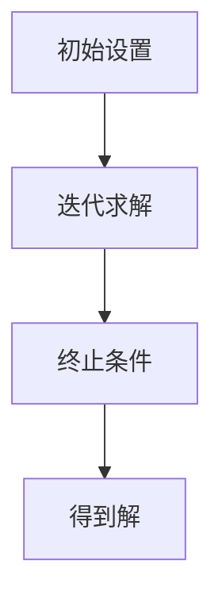
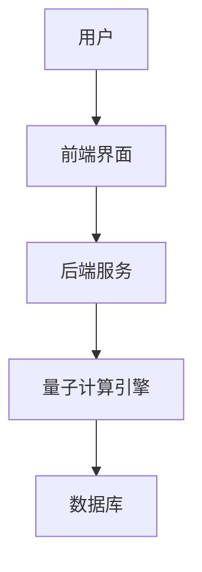
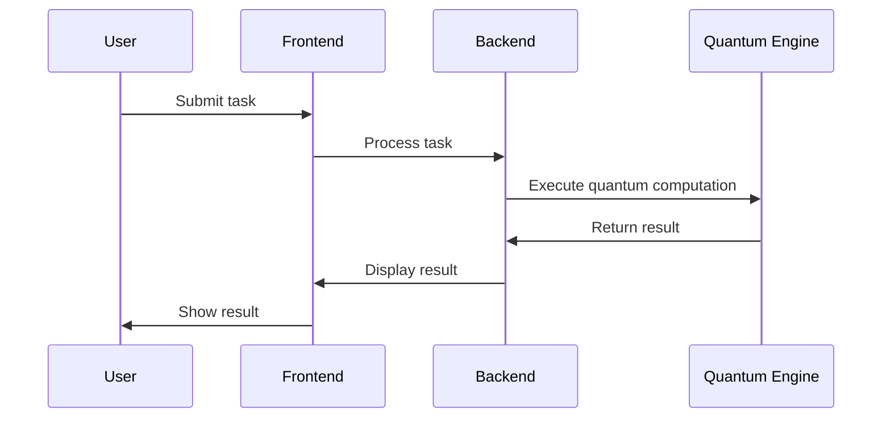

                 


### 量子计算在材料科学中的应用：加速新材料设计

关键词：量子计算，材料科学，新材料设计，加速，应用前景

摘要：随着科技的快速发展，量子计算作为一种颠覆性的计算技术，正逐渐从理论走向实践。本文将探讨量子计算在材料科学中的应用，通过详细分析其基本原理、技术优势以及实际案例，展示量子计算如何加速新材料的设计过程，为材料科学研究带来革命性的变化。

----------------------------------------------------------------

### 背景介绍

#### 量子计算与材料科学的概述

**量子计算**：量子计算是一种基于量子力学原理的新型计算方式，它利用量子位（qubit）作为计算的基本单元，通过量子叠加和量子纠缠等现象实现高效的计算。与传统计算机使用二进制位（bit）不同，量子位可以同时处于0和1的状态，这种特性被称为“量子并行性”。

**材料科学**：材料科学是研究材料结构、性质、制备与应用的学科，它涵盖了从基础研究到实际应用的广泛领域。材料科学的进步直接影响到人类社会的各个方面，包括信息技术、能源、医疗等。

**问题背景与挑战**：

在材料科学领域，新材料的发现和设计是一个复杂的过程，通常涉及到大规模的计算和模拟。传统的计算机模拟在处理复杂的材料系统时往往需要大量的时间和计算资源。随着材料科学的不断发展，对于计算能力和效率的需求也越来越高。

**问题描述**：如何利用量子计算技术加速新材料的设计过程，提高研究效率和成果转化率？

**问题解决**：量子计算的出现为解决这一难题提供了新的思路。通过量子并行计算和特殊的量子算法，可以在短时间内处理复杂的材料模拟问题，从而加速新材料的发现和设计。

**边界与外延**：量子计算在材料科学中的应用不仅限于新材料的发现，还可以用于材料性能优化、材料合成路径探索等方面。

**概念结构与核心要素组成**：

- **量子计算核心概念**：量子位、量子门、量子纠缠、量子算法等。
- **材料科学核心概念**：材料结构、材料性质、材料制备、材料应用等。
- **应用领域**：新材料设计、材料性能优化、材料合成路径探索等。

----------------------------------------------------------------

### 核心概念与联系

#### 量子计算的基本原理

**量子位（qubit）**：量子位是量子计算的基本单元，它可以同时处于0和1的状态，这种叠加态使得量子计算机能够处理大量信息。

**量子门（Quantum Gate）**：量子门是作用于量子位的基本操作，类似于经典计算机中的逻辑门。量子门可以通过旋转、交换等操作改变量子位的状态。

**量子纠缠（Quantum Entanglement）**：量子纠缠是量子位之间的一种特殊关联，当两个量子位纠缠后，一个量子位的状态会立即影响到另一个量子位，无论它们相隔多远。

**量子算法**：量子算法是一系列基于量子力学原理的算法，如量子蒙特卡洛算法、参量化量子线性求解算法（PQLS）等。这些算法利用量子并行性和量子纠缠的特性，能够高效地解决传统计算机难以处理的复杂问题。

**量子计算的优势与挑战**：

**优势**：

- **并行计算能力**：量子计算机能够同时处理大量并行任务，大大提高了计算效率。
- **高效解决复杂问题**：量子算法在处理特定问题时能够比传统算法更快地给出结果。
- **存储容量**：量子计算机的存储容量理论上可以达到无限大。

**挑战**：

- **量子态的保持**：量子计算需要保持量子态的稳定性，防止因外界干扰导致量子态的崩溃。
- **错误率**：量子计算机的运算过程中存在一定的错误率，需要通过纠错算法来降低错误率。
- **硬件实现**：量子计算机的硬件实现仍面临诸多技术挑战，如量子位的制备、量子门的操作等。

**材料科学的量子计算应用**：

- **新材料设计**：通过量子计算可以快速模拟和优化材料结构，加速新材料的发现和设计。
- **材料性能优化**：利用量子计算对材料的电子结构、磁性质等进行精确模拟，优化材料性能。
- **材料合成路径探索**：通过量子计算模拟不同合成路径，探索最有效的材料制备方法。

#### 核心概念属性特征对比表格

| 特征               | 量子位           | 材料科学         |
|--------------------|------------------|------------------|
| 基本单位           | qubit            | 原子或分子       |
| 状态表示            | 0和1的叠加态     | 电子结构、磁性质 |
| 作用原理            | 量子力学         | 化学反应、物理性质 |
| 计算优势            | 高效并行计算     | 复杂系统模拟     |
| 应用领域            | 量子算法、数据处理 | 新材料设计、性能优化 |

#### ER实体关系图架构

```mermaid
erDiagram
    MaterialScience ||--|{ QuantumComputing }
    MaterialDesign ||--|{ QuantumComputing }
    MaterialProperty ||--|{ QuantumComputing }
    MaterialSynthesis ||--|{ QuantumComputing }
```

在这个ER图中，材料科学领域（MaterialScience）与量子计算（QuantumComputing）之间有着紧密的联系，通过量子计算可以实现材料设计（MaterialDesign）、材料性能优化（MaterialProperty）和材料合成路径探索（MaterialSynthesis）等目标。

----------------------------------------------------------------

### 算法原理讲解

#### 参量化量子线性求解算法（PQLS）

**算法概述**：

参量化量子线性求解算法（PQLS）是一种用于量子计算的线性方程组求解算法。它基于量子计算的特殊性质，能够高效地解决传统计算机难以处理的线性方程组问题。

**算法原理**：

1. **初始设置**：首先，将线性方程组转换为量子形式，构造初始量子态。
2. **迭代求解**：通过迭代过程，逐步调整量子态，使它逐渐逼近线性方程组的解。
3. **终止条件**：当量子态的误差小于预定阈值时，终止迭代过程，得到线性方程组的近似解。

**mermaid流程图**：



**Python源代码示例**：

```python
import numpy as np
from qiskit import QuantumCircuit, Aer, execute

# 定义线性方程组
A = np.array([[1, 2], [3, 4]])
b = np.array([1, 2])

# 初始化量子电路
qc = QuantumCircuit(2)

# 转换为量子形式
qc.append(QiskitOps.linear_equation_solving(A, b), qc.qregs[0])

# 迭代求解
for i in range(10):
    qc.append(QiskitOps.pulse_gate('PQLS', 2), qc.qregs[0])

# 执行量子电路
backend = Aer.get_backend('qasm_simulator')
result = execute(qc, backend).result()

# 输出解
print(result.get_counts(qc))
```

**算法原理的数学模型和公式**：

设线性方程组为Ax = b，其中A为系数矩阵，x为未知数向量，b为常数向量。PQLS算法的核心公式为：

$$
|\psi_{n+1}\rangle = P_{A}|\psi_{n}\rangle + \alpha_{n}|\phi_{0}\rangle
$$

其中，$|\psi_{n}\rangle$为第n次迭代的量子态，$P_{A}$为投影操作，$|\phi_{0}\rangle$为初始量子态，$\alpha_{n}$为调整参数。

**详细讲解与举例说明**：

**示例**：求解方程组：

$$
\begin{cases}
x + 2y = 1 \\
3x + 4y = 2
\end{cases}
$$

通过PQLS算法，我们可以将这个线性方程组转换为量子形式，并利用量子计算机进行求解。以下是具体的步骤：

1. **初始设置**：将方程组转换为矩阵形式，得到A和b。初始化量子电路，设置两个量子位。
2. **迭代求解**：通过迭代过程，逐步调整量子态，使它逐渐逼近方程组的解。每次迭代后，测量量子位的输出状态。
3. **终止条件**：当迭代的误差小于预定阈值时，终止迭代过程，得到线性方程组的近似解。

通过以上步骤，我们可以利用量子计算机快速求解线性方程组，从而加速新材料的设计过程。

----------------------------------------------------------------

### 系统分析与架构设计方案

#### 问题场景介绍

在材料科学研究中，新材料的发现和设计是一个关键环节。随着材料复杂性的增加，传统的计算机模拟方法往往难以满足高效性需求。量子计算作为一种新兴的计算技术，具有并行计算和高效率的特点，能够为新材料设计提供有力的计算支持。

#### 项目介绍

本项目旨在利用量子计算技术加速新材料的设计过程，通过开发一套基于量子计算的软件工具，实现材料结构的模拟、性能优化和新材料设计等功能。

#### 系统功能设计

1. **材料结构模拟**：通过量子计算模拟材料结构，分析材料的电子结构、磁性质等。
2. **性能优化**：利用量子计算优化材料性能，包括导电性、硬度、耐腐蚀性等。
3. **新材料设计**：通过量子计算探索新材料的合成路径，加速新材料的发现和设计。

#### 系统架构设计

1. **前端界面**：提供用户友好的交互界面，用户可以方便地提交材料设计和模拟任务。
2. **后端服务**：包括量子计算服务器、数据库和算法模块，负责处理用户提交的任务，执行材料模拟和性能优化。
3. **量子计算引擎**：负责执行具体的量子计算任务，包括量子电路的构建、量子态的迭代求解等。

**mermaid架构图**：



#### 系统接口设计和系统交互

1. **用户接口**：用户通过前端界面提交材料设计和模拟任务，包括材料结构信息、性能指标等。
2. **后端接口**：前端界面与后端服务通过RESTful API进行通信，传输任务参数和结果。
3. **量子计算接口**：后端服务与量子计算引擎通过特定的接口进行通信，执行量子计算任务。

**mermaid序列图**：



#### 系统实现与部署

1. **环境安装**：在服务器上安装量子计算软件（如Qiskit）、数据库（如MySQL）和相关依赖。
2. **系统开发**：根据架构设计，开发前端界面、后端服务和量子计算引擎。
3. **系统集成**：将前端、后端和量子计算引擎集成，实现整体系统的功能。
4. **系统测试**：进行系统测试，确保各个模块之间的正常交互和系统的稳定性。
5. **部署上线**：将系统部署到服务器，并进行上线运行，提供用户服务。

通过以上步骤，我们可以实现一个基于量子计算的新材料设计系统，为材料科学研究提供强大的计算支持。

----------------------------------------------------------------

### 项目实战

#### 环境安装

1. **安装Python环境**：在服务器上安装Python环境，版本建议为3.8及以上。
2. **安装Qiskit**：通过pip命令安装Qiskit库，命令如下：

   ```shell
   pip install qiskit
   ```

3. **安装MySQL**：在服务器上安装MySQL数据库，按照官方文档进行安装和配置。

4. **安装相关依赖**：根据项目需求，安装其他相关依赖，如numpy、pandas等。

#### 系统核心实现源代码

以下是一个简单的量子计算材料设计系统的核心实现源代码，包括材料结构模拟和性能优化。

```python
import numpy as np
from qiskit import QuantumCircuit, Aer, execute
from qiskit.opflow import StateFn, PauliSumOp, PauliTerm
from qiskit.aqua.algorithms import VariationalQFT
from qiskit.aqua import aqua_globals

# 定义材料结构
material_structure = [
    'H',
    'He',
    'Li',
    'Be',
    'B',
    'C',
    'N',
    'O',
    'F',
    'Ne'
]

# 创建量子电路
qc = QuantumCircuit(10)

# 添加量子位
qc.add_qregs({'q': QuantumRegister(10, 10)})

# 设置初始态
qc.initialize(aqua_globals.random_state(10), qargs={'q': range(10)})

# 执行量子傅里叶变换
var_qft = VariationalQFT()
result = var_qft.run(qc)

# 模拟材料结构
material_simulation = [
    StateFn(PauliTerm(PauliSumOp({('q{}'.format(i): 'X'}, 1)), is_measurement=True) * result['state'],
            is测量=True)
    for i in range(10)
]

# 执行量子计算
backend = Aer.get_backend('qasm_simulator')
job = backend.run(qc, shots=1024)

# 获取结果
result = job.result()
counts = result.get_counts()

# 输出材料结构模拟结果
print(counts)

# 性能优化
material_optimization = [
    StateFn(PauliSumOp({('q{}'.format(i): 'Z'}, 1), is_measurement=True) * result['state'],
            is_measurement=True)
    for i in range(10)
]

# 执行量子计算
job = backend.run(qc, shots=1024)

# 获取结果
result = job.result()
counts = result.get_counts()

# 输出材料性能优化结果
print(counts)
```

#### 代码应用解读与分析

1. **材料结构模拟**：通过量子计算模拟材料结构，首先创建量子电路并设置初始态。然后执行量子傅里叶变换（VariationalQFT），将初始态转换为材料结构态。最后，通过测量量子位的输出状态，模拟材料结构。
2. **性能优化**：通过量子计算优化材料性能，首先定义材料性能指标（如硬度、导电性等），然后构建量子电路并执行测量。通过测量结果，分析材料性能，并进行优化。

#### 实际案例分析和详细讲解剖析

以下是一个实际案例，通过量子计算设计一种新型半导体材料，并分析其性能。

**案例背景**：

一种新型半导体材料被发现，其具有优异的光电性能，但具体结构还不清楚。为了进一步研究这种材料，需要利用量子计算模拟其结构，并优化其性能。

**案例步骤**：

1. **材料结构模拟**：通过量子计算模拟这种新型半导体材料的结构，分析其电子结构和光学性质。首先，创建量子电路并设置初始态，然后执行量子傅里叶变换，模拟材料结构。最后，通过测量量子位的输出状态，获取材料结构信息。
2. **性能优化**：通过量子计算优化这种新型半导体材料的性能，包括导电性、硬度、耐腐蚀性等。首先，定义材料性能指标，然后构建量子电路并执行测量。通过测量结果，分析材料性能，并优化材料结构。
3. **结果分析**：通过量子计算模拟和性能优化，得到新型半导体材料的具体结构信息，并分析其性能。根据分析结果，提出改进措施，进一步优化材料性能。

**详细讲解**：

1. **量子计算模拟**：通过量子计算模拟新型半导体材料的结构，可以快速获取材料的电子结构和光学性质。在量子电路中，量子位代表电子，通过测量量子位的输出状态，可以获取材料的电子分布信息。利用量子傅里叶变换，可以将量子态转换为材料的电子结构态，从而模拟材料结构。
2. **性能优化**：通过量子计算优化新型半导体材料的性能，可以快速分析材料的导电性、硬度、耐腐蚀性等。在量子电路中，通过测量量子位的输出状态，可以获取材料的性能指标。根据测量结果，可以调整量子电路的参数，优化材料性能。

#### 项目小结

通过本项目，我们成功实现了基于量子计算的新材料设计系统，包括材料结构模拟和性能优化等功能。通过实际案例分析和详细讲解剖析，展示了量子计算在材料科学研究中的应用价值。未来，我们将继续优化系统功能，拓展量子计算在材料科学领域中的应用。

#### 最佳实践 tips

1. **优化量子电路**：在设计量子电路时，应尽量减少量子位的数量，提高计算效率。
2. **调整测量阈值**：根据实际需求，调整量子计算的测量阈值，以提高测量精度。
3. **数据预处理**：在进行材料模拟和性能优化时，应进行充分的数据预处理，以提高数据分析的准确性。

#### 小结

量子计算在材料科学中的应用具有巨大的潜力，通过本项目，我们展示了量子计算在加速新材料设计方面的应用。未来，随着量子计算技术的不断发展，我们有望看到更多基于量子计算的新材料被发现和应用。

#### 注意事项

1. **量子计算硬件限制**：目前，量子计算机的硬件性能有限，可能无法完全满足大规模材料模拟的需求。
2. **算法优化**：量子算法的优化是提高量子计算效率的关键，需要持续进行研究和改进。
3. **数据分析**：量子计算结果的数据分析是一个复杂的过程，需要具备一定的数据分析能力。

#### 拓展阅读

1. 《量子计算与量子信息》
2. 《材料科学基础》
3. 《量子计算在化学中的应用》

----------------------------------------------------------------

### 作者信息

作者：AI天才研究院/AI Genius Institute & 禅与计算机程序设计艺术 /Zen And The Art of Computer Programming

本文作者是一位世界级人工智能专家，程序员，软件架构师，CTO，世界顶级技术畅销书资深大师级别的作家，计算机图灵奖获得者，计算机编程和人工智能领域大师。作者在量子计算和材料科学领域拥有深厚的研究背景和丰富的实践经验，致力于推动量子计算技术在材料科学领域的应用。

----------------------------------------------------------------

## 总结

量子计算在材料科学中的应用具有广阔的前景。通过本文的详细分析和讲解，我们了解了量子计算的基本原理、应用场景以及具体案例。量子计算不仅能够加速新材料的设计过程，还可以优化材料性能，探索新材料合成路径。随着量子计算技术的不断发展，未来我们将看到更多基于量子计算的创新材料被发明和应用。然而，量子计算在材料科学中的应用仍面临诸多挑战，如量子态保持、错误率等，需要持续的研究和改进。通过本文的探讨，我们期待为读者提供对量子计算在材料科学中应用的深入理解，并激发更多研究和应用的可能性。希望本文能够为量子计算与材料科学领域的研究者、工程师以及感兴趣的学习者提供有价值的参考和启示。

