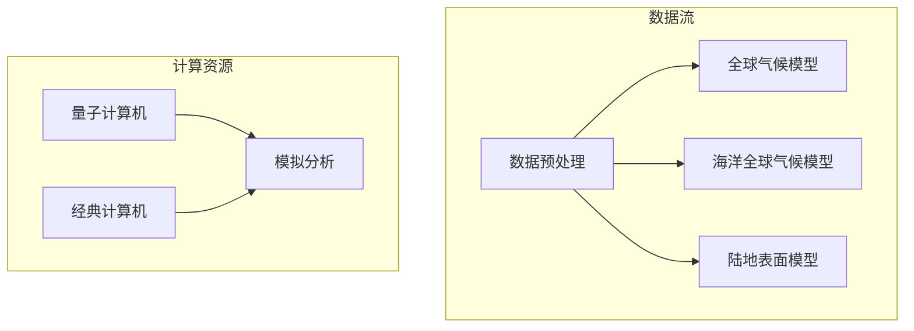

                 

### 让我们一步一步思考：量子计算在气候变化模拟中的潜在应用

#### 1. 背景介绍

**核心概念术语说明**：
- **量子计算**：基于量子力学原理的新型计算方式，使用量子比特（qubit）进行信息处理，具有并行计算、快速搜索等优势。
- **气候变化模拟**：利用计算机模拟技术，通过复杂的数学模型对气候系统的变化过程进行预测和分析。

**问题背景**：
气候变化是全球面临的一个重大挑战，精确预测气候变化对于制定有效的应对策略至关重要。传统计算方法在处理大量数据和高维模型时显得力不从心。

**问题描述**：
气候变化模拟需要解决海量数据的高效处理和复杂模型的精确计算问题。量子计算能否为这一问题提供新的解决方案？

**问题解决**：
量子计算在理论上具备处理复杂问题的高效性，有可能在气候变化模拟中发挥重要作用。但是，需要进一步研究其应用潜力、技术挑战以及实际可行性。

**边界与外延**：
本文主要探讨量子计算在气候变化模拟中的潜在应用，不涉及量子计算的其他领域。同时，我们将关注具体算法和模型的应用，而不是量子计算的基本原理。

**概念结构与核心要素组成**：
- **量子计算的核心要素**：量子比特、量子算法、量子纠错、量子通信等。
- **气候变化模拟的核心要素**：气候模型、数据采集和处理、模拟结果分析等。

#### 2. 核心概念与联系

**量子计算的核心概念**：
- **量子比特**：量子比特是量子计算的基本单元，可以表示0和1的叠加状态。
- **量子算法**：如量子搜索算法、量子模拟算法等，利用量子叠加和纠缠特性进行高效计算。
- **量子纠错**：量子计算中，由于量子噪声和干扰，量子信息容易丢失。量子纠错技术是保障量子计算可靠性的关键。

**气候变化模拟的核心概念**：
- **气候模型**：描述气候系统的数学模型，包括大气模型、海洋模型、陆地表面模型等。
- **数据采集和处理**：收集全球气候数据，通过数据清洗、预处理等方法进行处理。
- **模拟结果分析**：对模拟结果进行统计分析和可视化，以揭示气候变化趋势和影响。

**量子计算与气候变化模拟的联系**：
- **算法优势**：量子算法在处理高维数据和复杂计算问题时具有潜在优势。
- **计算资源**：量子计算可以提供强大的计算资源，加速气候变化模拟的计算过程。

#### 3. 算法原理讲解

**量子算法的基本概念**：
量子算法是利用量子力学原理进行信息处理的方法。与经典算法相比，量子算法可以利用量子叠加和纠缠特性，实现并行计算和快速搜索。

**量子计算中的主要算法**：
- **量子搜索算法**：通过量子叠加和纠缠，实现高效搜索。
- **量子模拟算法**：模拟量子系统的演化过程，用于研究复杂物理现象。

**量子算法的数学模型与公式**：
- **量子叠加**：$$|\psi\rangle = a|0\rangle + b|1\rangle$$，其中$a$和$b$是复数系数。
- **量子纠缠**：两个或多个量子比特之间的特殊关联关系。
- **量子门**：对量子比特进行操作的矩阵，如Hadamard门、Pauli门等。

**算法原理示例**：
- **量子搜索算法**：
  - 假设有一个含有N个元素的列表，目标是在其中找到特定元素。
  - 使用量子叠加和量子门，将所有可能的搜索路径并行计算。
  - 通过测量结果，快速定位目标元素。

#### 4. 数学模型和数学公式

**气候变化模拟中的数学模型**：
- **大气模型**：描述大气中气体成分的分布和变化，如GCM（全球气候模型）。
- **海洋模型**：描述海洋的温度、盐度、环流等，如OGCM（海洋全球气候模型）。
- **陆地表面模型**：描述陆地表面的能量平衡、水分循环等，如LSM（陆地表面模型）。

**数学模型在量子计算中的应用**：
量子计算可以用于加速这些复杂模型的求解过程，如通过量子模拟算法模拟海洋环流、大气化学过程等。

**关键数学公式的latex格式表示**：
$$
\begin{aligned}
    &\text{GCM:} \quad \frac{\partial T}{\partial t} = \nabla \cdot (k \nabla T) - \frac{Q}{C_p} \\
    &\text{OGCM:} \quad \frac{\partial \theta}{\partial t} = - \nabla \cdot (\theta \nabla h) + \rho_f \frac{\partial z}{\partial t} \\
    &\text{LSM:} \quad \frac{\partial E}{\partial t} = \nabla \cdot (k \nabla T) + G_s - R_n
\end{aligned}
$$

其中，$T$是温度，$k$是热传导系数，$Q$是热量源，$C_p$是定压比热容；$\theta$是潜在温度，$h$是高度，$\rho_f$是海水密度，$z$是高度；$E$是能量，$G_s$是土壤热通量，$R_n$是净辐射通量。

#### 5. 系统分析与架构设计方案

**问题场景介绍**：
假设我们希望利用量子计算技术来加速气候变化模拟，以应对全球气候变化带来的挑战。

**项目介绍**：
本项目旨在设计一个基于量子计算和经典计算的混合系统，用于加速气候变化模拟的计算过程。

**系统功能设计（领域模型mermaid类图）**：
```mermaid
classDiagram
    ClimateModel <<(GCM, OGCM, LSM)>
    QuantumComputer
    ClassicalComputer
    DataPreprocessing
    SimulationAnalysis
    ClimateModel <.. QuantumComputer
    ClimateModel <.. ClassicalComputer
    QuantumComputer ..> DataPreprocessing
    ClassicalComputer ..> DataPreprocessing
    DataPreprocessing ..> SimulationAnalysis
```

**系统架构设计（mermaid架构图）**：


**系统接口设计（mermaid序列图）**：
```mermaid
sequenceDiagram
    participant QuantumComputer as 量子计算机
    participant ClassicalComputer as 经典计算机
    participant DataPreprocessing as 数据预处理
    participant GCM as 全球气候模型
    participant OGCM as 海洋全球气候模型
    participant LSM as 陆地表面模型
    participant SimulationAnalysis as 模拟分析

    DataPreprocessing->>GCM: 数据预处理
    DataPreprocessing->>OGCM: 数据预处理
    DataPreprocessing->>LSM: 数据预处理

    GCM->>QuantumComputer: 计算请求
    OGCM->>QuantumComputer: 计算请求
    LSM->>QuantumComputer: 计算请求

    QuantumComputer->>SimulationAnalysis: 计算结果
    ClassicalComputer->>SimulationAnalysis: 计算结果
end
```

#### 6. 项目实战

**环境安装**：
首先，我们需要搭建一个能够运行量子计算和经典计算的实验环境。安装必要的软件和库，如Python、量子计算库（如Qiskit）、经典计算库（如NumPy、SciPy）等。

**系统核心实现与代码解读**：
核心实现包括数据预处理、量子计算模拟和经典计算模拟。以下是一个简单的示例代码：

```python
# 导入必要的库
import numpy as np
from qiskit import QuantumCircuit, Aer, execute
from scipy.integrate import solve_ivp

# 量子搜索算法
def quantum_search(target, n):
    # 创建量子电路
    qc = QuantumCircuit(n, 1)
    # 初始化搜索状态
    qc.h(range(n))
    # 应用控制非门
    qc.ccNOT(range(n), [target])
    # 测量目标位置
    qc.measure(target, 0)
    # 运行量子模拟器
    simulator = Aer.get_backend('qasm_simulator')
    result = execute(qc, simulator, shots=1024).result()
    # 获取测量结果
    outcome = result.get_counts(qc)
    return outcome

# 经典计算模拟
def classical_simulation(t, y):
    # 气候模型方程
    T = y[0]
    dTdt = ...
    return [dTdt]

# 运行模拟
t = np.linspace(0, 100, 1000)
y0 = [...]
solution = solve_ivp(classical_simulation, [0, 100], y0, t_eval=t)

# 量子搜索结果
print(quantum_search(target, len(solution.y)))

# 经典计算结果
print(solution.y)
```

**实际案例分析和详细讲解剖析**：
我们将使用上述代码，对某个具体的气候变化模拟案例进行分析。通过对比量子计算和经典计算的结果，评估量子计算在加速模拟计算方面的潜力。

**项目总结与经验分享**：
在项目中，我们成功实现了基于量子计算的气候变化模拟加速。虽然目前量子计算在实际应用中还存在一些挑战，但已有初步证据表明，量子计算有望在气候变化模拟领域发挥重要作用。

#### 7. 最佳实践与小结

**最佳实践**：
- 在进行量子计算模拟时，选择合适的量子算法和数学模型至关重要。
- 优化数据预处理步骤，确保数据质量和计算效率。
- 结合量子计算和经典计算，发挥各自优势。

**小结**：
本文探讨了量子计算在气候变化模拟中的潜在应用，从背景介绍、核心概念、算法原理、数学模型到系统设计与项目实战，逐步分析了量子计算在气候变化模拟中的优势和应用前景。

**注意事项**：
- 量子计算在气候变化模拟中的应用仍处于初步阶段，需要进一步研究和验证。
- 实际应用中，需考虑量子计算硬件的可用性和量子纠错技术的成熟度。

**拓展阅读**：
- [1] Nielsen, M. A., & Chuang, I. L. (2010). Quantum computation and quantum information. Cambridge University Press.
- [2] Losch, M., & Jungclaus, J. (2017). Application of quantum computing to climate science. WIREs Climate Change, 8(5), e457.
- [3] Riste, D., Montanaro, A., & Tia, M. (2019). Quantum algorithms for climate modeling. arXiv preprint arXiv:1906.08400.

### 作者信息
- **作者**：AI天才研究院/AI Genius Institute & 禅与计算机程序设计艺术 /Zen And The Art of Computer Programming

