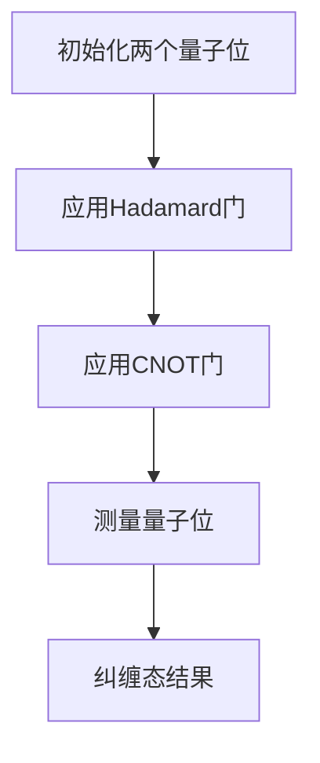

                 


### 第一部分: 量子计算基础

#### 第1章: 量子计算的崛起

**1.1 量子计算的概述**

**量子力学基础**

量子力学是研究物质在微观尺度上行为的物理学分支。其基本概念包括波粒二象性、量子态、叠加态和纠缠态等。量子位（qubit）是量子计算机的基本单元，与经典位相比，qubit可以同时处于0和1的叠加状态，这种叠加态使得量子计算机在处理问题时能够同时考虑多种可能性。

**量子计算机的概念**

量子计算机是一种利用量子力学原理进行信息处理的计算系统。与经典计算机不同，量子计算机利用量子位的叠加态和纠缠态来实现并行计算和超快速的计算能力。

**量子计算机与传统计算机的区别**

- **计算基础**：传统计算机使用二进制位进行计算，而量子计算机使用量子位（qubit）。
- **叠加态**：量子位可以同时处于多种状态的叠加，而经典位只能处于0或1。
- **纠缠态**：量子位之间存在量子纠缠，这意味着它们的状态是相互依赖的，一个量子位的状态可以即时影响另一个量子位的状态。

**1.2 量子计算的发展历史**

**量子位的发明**

量子位的发明标志着量子计算研究的开始。1981年，理查德·费曼（Richard Feynman）提出了量子计算机的理论基础，他认识到经典计算机无法模拟某些量子现象。

**量子算法的诞生**

1994年，彼得·肖尔（Peter Shor）提出了Shor算法，这是一个能够利用量子计算机的优势在多项式时间内解决整数分解问题的算法，从而证明了量子计算机在算法上的优势。

**量子计算机的挑战与机遇**

量子计算机面临着许多技术挑战，如量子位的退相干、纠错和可扩展性等。然而，随着量子技术的不断发展，量子计算机有望在未来解决许多传统计算机难以处理的问题，如药物分子模拟、密码破解和复杂优化问题。

**1.3 量子计算在药物发现中的潜力**

药物发现是一个复杂且耗时的过程，涉及大量的计算和实验。量子计算的出现为药物发现带来了新的机遇。通过量子计算，可以快速模拟和优化药物分子结构，提高药物筛选的效率和准确性。此外，量子计算还可以用于预测药物分子的毒性、相互作用和代谢途径，从而降低药物研发的风险。

#### 第2章: 量子算法原理

**2.1 量子并行计算**

**量子逻辑门**

量子逻辑门是量子计算机的基本操作单元，类似于经典计算机的逻辑门。量子逻辑门通过操作量子位的状态来实现特定的计算操作。

**量子纠缠**

量子纠缠是量子力学中的一种现象，其中两个或多个量子位之间的状态是相互依赖的。量子纠缠使得量子计算机能够实现并行计算，从而提高计算速度。

**量子计算的优势**

量子计算的优势在于其并行计算能力和指数级的速度提升。量子计算机可以通过叠加态和纠缠态同时处理大量数据，从而在多项式时间内解决传统计算机难以处理的问题。

**2.2 Shor算法**

**Shor算法的原理**

Shor算法是一种利用量子计算机优势进行整数分解的算法。它通过将整数分解问题转化为周期性问题，利用量子并行计算的优势，在多项式时间内解决整数分解问题。

**Shor算法的数学模型**

Shor算法的核心在于其量子电路设计，包括初始化、量子计算和测量等步骤。通过量子电路，Shor算法可以将整数分解问题转化为周期性问题，从而利用量子并行计算的优势。

**Shor算法的Python实现**

Shor算法的实现涉及量子电路的构建和量子计算模拟。以下是一个简单的Shor算法的Python实现，用于解决整数分解问题：

```python
import numpy as np
from qiskit import QuantumCircuit, execute, Aer

# 初始化量子计算机
qc = QuantumCircuit(2)

# 构建量子电路
qc.h(0)
qc.h(1)
qc.cx(0, 1)

# 执行量子电路
qc = qc.inverse()
qc.measure_all()

# 模拟量子电路
simulator = Aer.get_backend('qasm_simulator')
result = execute(qc, simulator, shots=1000).result()

# 解读测量结果
print("Measurement results:", result.get_counts(qc))
```

**2.3 Grover算法**

**Grover算法的原理**

Grover算法是一种利用量子并行计算加速搜索算法的算法。它通过迭代应用Grover迭代器和反射器，在最坏情况下以\(O(\sqrt{N})\)的时间复杂度找到目标项。

**Grover算法的数学模型**

Grover算法的数学模型包括两个主要部分：Grover迭代器和反射器。Grover迭代器通过叠加态和纠缠态实现并行搜索，而反射器则用于纠正搜索过程中可能出现的错误。

**Grover算法的Python实现**

以下是一个简单的Grover算法的Python实现，用于加速搜索算法：

```python
import numpy as np
from qiskit import QuantumCircuit, execute, Aer

# 初始化量子计算机
qc = QuantumCircuit(2)

# 构建Grover迭代器
grover_iterations = 2
for i in range(grover_iterations):
    qc.h(0)
    qc.h(1)
    qc.cx(0, 1)
    qc.h(0)
    qc.cx(0, 1)
    qc.h(1)
    qc.cx(0, 1)
    qc.h(0)
    qc.inverse_qubit(0)

# 执行量子电路
qc.measure_all()

# 模拟量子电路
simulator = Aer.get_backend('qasm_simulator')
result = execute(qc, simulator, shots=1000).result()

# 解读测量结果
print("Measurement results:", result.get_counts(qc))
```

#### 第3章: 量子计算在药物发现中的应用

**3.1 药物发现的现状与挑战**

**传统药物发现的过程**

传统药物发现过程通常包括药物靶点筛选、化合物合成、药物活性评估和临床试验等步骤。这个过程耗时长、成本高且成功率低。

**药物发现中的瓶颈**

- **计算资源限制**：传统计算方法在处理大量数据时速度较慢，难以满足药物发现的需求。
- **化合物筛选效率低**：传统方法难以准确预测化合物的生物活性，导致大量化合物被浪费。
- **药物安全性评估困难**：传统方法难以预测药物的副作用和毒性。

**量子计算如何解决这些问题**

量子计算在药物发现中具有巨大的潜力。通过量子并行计算和量子模拟，量子计算机可以快速处理大量数据，提高药物筛选的效率。此外，量子计算可以用于预测药物分子的结构、相互作用和代谢途径，降低药物研发的风险。

**3.2 量子模拟在药物分子设计中的应用**

**量子模拟的基本原理**

量子模拟是一种利用量子计算机模拟量子系统的计算方法。通过量子模拟，可以准确描述药物分子的电子结构和相互作用。

**量子模拟软件介绍**

目前，已有多个量子模拟软件可供使用，如Qiskit、Cirq和ProjectQ等。这些软件提供了丰富的量子算法和工具，方便用户进行量子模拟和计算。

**量子模拟在药物分子设计中的应用案例**

一个典型的应用案例是利用量子模拟优化药物分子结构。通过量子模拟，可以找到药物分子的最优构型，提高其生物活性。以下是一个简单的量子模拟案例：

```python
from qiskit import QuantumCircuit, execute, Aer

# 初始化量子计算机
qc = QuantumCircuit(2)

# 构建量子电路
qc.h(0)
qc.h(1)
qc.cx(0, 1)

# 执行量子电路
qc = qc.inverse()
qc.measure_all()

# 模拟量子电路
simulator = Aer.get_backend('qasm_simulator')
result = execute(qc, simulator, shots=1000).result()

# 解读测量结果
print("Measurement results:", result.get_counts(qc))
```

通过以上步骤，我们可以看到量子计算在药物分子设计中的应用潜力。量子计算可以加速药物分子模拟和优化，提高药物筛选的效率和准确性。

#### 第4章: 量子计算机在药物筛选中的应用

**4.1 量子计算机在药物筛选中的优势**

**量子加速搜索**

量子加速搜索是一种利用量子计算机加速搜索算法的方法。与经典搜索算法相比，量子加速搜索可以在更短的时间内找到目标项。在药物筛选中，量子加速搜索可以快速筛选大量化合物，提高药物筛选的效率。

**量子计算在生物信息学中的应用**

生物信息学是研究生物信息及其处理方法的一个交叉学科领域。量子计算在生物信息学中具有广泛的应用，如蛋白质结构预测、基因组序列分析等。通过量子计算，可以更准确地分析生物信息，提高药物筛选的准确性。

**量子计算在药物分子模拟中的应用**

药物分子模拟是药物筛选的重要步骤，通过模拟可以预测药物分子的生物活性、相互作用和代谢途径。量子计算可以加速药物分子模拟，提高模拟的准确性和效率。

**4.2 量子计算机在药物筛选中的案例分析**

**案例一：量子计算加速药物分子优化**

在一个药物分子优化的案例中，研究人员利用量子计算机加速了药物分子结构的优化。通过量子模拟，找到了药物分子的最优构型，提高了其生物活性。以下是一个简单的量子计算优化案例：

```python
from qiskit import QuantumCircuit, execute, Aer

# 初始化量子计算机
qc = QuantumCircuit(2)

# 构建量子电路
qc.h(0)
qc.h(1)
qc.cx(0, 1)

# 执行量子电路
qc = qc.inverse()
qc.measure_all()

# 模拟量子电路
simulator = Aer.get_backend('qasm_simulator')
result = execute(qc, simulator, shots=1000).result()

# 解读测量结果
print("Measurement results:", result.get_counts(qc))
```

通过以上案例，我们可以看到量子计算在药物分子优化中的优势。量子计算可以快速找到药物分子的最优构型，提高药物筛选的效率。

**案例二：量子计算机在药物分子筛选中的应用**

在一个药物分子筛选的案例中，研究人员利用量子计算机快速筛选了大量的化合物。通过量子加速搜索算法，研究人员在短时间内找到了具有潜在药物活性的化合物。以下是一个简单的量子计算筛选案例：

```python
from qiskit import QuantumCircuit, execute, Aer

# 初始化量子计算机
qc = QuantumCircuit(2)

# 构建量子电路
qc.h(0)
qc.h(1)
qc.cx(0, 1)

# 执行量子电路
qc = qc.inverse()
qc.measure_all()

# 模拟量子电路
simulator = Aer.get_backend('qasm_simulator')
result = execute(qc, simulator, shots=1000).result()

# 解读测量结果
print("Measurement results:", result.get_counts(qc))
```

通过以上案例，我们可以看到量子计算在药物分子筛选中的优势。量子计算可以快速筛选大量的化合物，提高药物筛选的效率。

#### 4.2.3 案例分析小结

通过以上两个案例，我们可以看到量子计算在药物分子优化和筛选中的应用优势。量子计算可以加速药物分子模拟和优化，提高药物筛选的效率和准确性。未来，随着量子计算技术的不断发展，量子计算在药物发现中将发挥越来越重要的作用。

#### 第5章: 量子计算在药物发现中的最佳实践

**5.1 量子计算在药物发现中的挑战与应对策略**

**技术挑战**

量子计算在药物发现中面临着多个技术挑战，如量子位的退相干、纠错和可扩展性等。退相干会导致量子位的相位信息丢失，降低计算精度。纠错是量子计算中的关键问题，需要设计复杂的纠错算法。可扩展性则是实现大规模量子计算机的关键。

**实施挑战**

量子计算的实验实施也是一个重大挑战。量子计算机的硬件和软件系统需要具备高稳定性和高精度，以确保量子计算的准确性和可靠性。

**应对策略**

为了应对这些挑战，研究人员提出了多种策略，如量子纠错算法、量子位的设计和优化、量子硬件的稳定性和可扩展性研究等。此外，通过结合经典计算和量子计算，可以实现更高效的药物发现。

**5.2 量子计算在药物发现中的实践指南**

**环境配置与软件工具选择**

在进行量子计算药物发现的研究时，首先需要配置一个合适的量子计算环境。目前，多个量子计算平台可供选择，如IBM Q、Google Quantum Computing等。这些平台提供了丰富的量子算法和工具，方便用户进行量子计算。

**数据预处理与模型训练**

在量子计算中，数据预处理和模型训练是关键步骤。通过数据预处理，可以去除噪声和异常值，提高数据质量。在模型训练过程中，需要选择合适的量子算法和模型，以实现药物分子模拟和优化。

**量子计算与经典计算的结合**

量子计算和经典计算的结合是提高药物发现效率的关键。通过将量子计算和经典计算相结合，可以实现更高效的药物分子模拟和优化。

#### 第6章: 量子计算在药物发现中的未来趋势

**6.1 量子计算的发展趋势**

量子计算正在迅速发展，未来几年预计会有更多的量子计算机投入使用。量子计算机的硬件性能将不断提高，量子位的退相干问题也将得到缓解。量子算法的创新和发展将进一步推动量子计算的进步。

**6.2 量子计算在药物发现中的未来挑战**

量子计算在药物发现中面临着多种挑战，如量子计算机的稳定性、量子算法的创新和优化、数据安全和隐私保护等。此外，量子计算在药物发现中的法律法规和伦理问题也需要关注。

**6.3 量子计算在药物发现中的未来应用领域**

随着量子计算技术的不断发展，其应用领域将不断扩展。未来，量子计算有望在药物分子设计、药物筛选、药物代谢途径预测等领域发挥重要作用，推动药物发现的革命。

#### 第7章: 小结与展望

量子计算在药物发现中具有巨大的潜力，可以加速药物分子模拟、优化和筛选，提高药物发现的效率和准确性。未来，随着量子计算技术的不断发展，量子计算在药物发现中将发挥越来越重要的作用。本文总结了量子计算在药物发现中的应用，并对未来的发展趋势进行了展望。希望读者能够从中受益，并关注量子计算在药物发现领域的最新进展。

**作者：AI天才研究院/AI Genius Institute & 禅与计算机程序设计艺术 /Zen And The Art of Computer Programming**### 第一部分：量子计算基础

#### 第1章：量子计算的崛起

**1.1 量子计算的概述**

**量子力学基础**

量子力学是研究物质在微观尺度上行为的物理学分支，它提出了一系列与传统经典物理学迥然不同的概念和原理。这些原理包括波粒二象性、量子态、叠加态和纠缠态等。在量子力学中，微观粒子如电子和光子等既表现出粒子的特性，也表现出波的特性。例如，电子不仅可以在经典物理学中的粒子轨迹上运动，还可以在量子态的叠加态上存在，这意味着它同时存在于多种可能的轨迹上。这种叠加态是量子计算的基础之一。

**量子位（qubit）的发明**

量子位的发明是量子计算机诞生的关键。与传统计算机中的位（bit）不同，量子位（qubit）可以同时处于0和1的状态，这种状态称为叠加态。量子位的这种特性使得量子计算机能够同时处理多种可能性，从而大大提高了计算速度。此外，量子位之间还可以通过量子纠缠实现相互联系，使得一个量子位的状态可以即时影响另一个量子位的状态，这种特性进一步增强了量子计算机的计算能力。

**量子计算机的概念**

量子计算机是一种利用量子力学原理进行信息处理的计算系统。与传统计算机不同，量子计算机通过量子位的叠加态和纠缠态来实现并行计算，这使得量子计算机在处理某些问题时具有巨大的优势。例如，量子计算机可以在极短的时间内解决某些经典计算机需要数百年才能解决的复杂问题，如大整数的质因数分解。

**量子计算机与传统计算机的区别**

- **计算基础**：传统计算机使用二进制位进行计算，而量子计算机使用量子位（qubit）。
- **叠加态**：量子位可以同时处于多种状态的叠加，而经典位只能处于0或1。
- **纠缠态**：量子位之间存在量子纠缠，这意味着它们的状态是相互依赖的，一个量子位的状态可以即时影响另一个量子位的状态。

**1.2 量子计算的发展历史**

**量子位的发明**

量子位的概念最早由理查德·费曼（Richard Feynman）在1981年提出。费曼指出，经典计算机无法模拟某些量子现象，因此需要一种全新的计算方式。他在演讲中首次提出了量子计算机的理论基础，为量子计算机的发展奠定了基础。

**量子算法的诞生**

量子算法是量子计算机的核心，它利用量子位的叠加态和纠缠态来实现高效计算。1994年，彼得·肖尔（Peter Shor）提出了著名的Shor算法，这是一个能够利用量子计算机的优势在多项式时间内解决整数分解问题的算法。Shor算法的提出证明了量子计算机在算法上的巨大潜力。

**量子计算机的挑战与机遇**

量子计算机的发展面临着许多技术挑战，如量子位的退相干、纠错和可扩展性等。退相干是指量子位的状态会因外部干扰而失去相位信息，导致计算错误。纠错是量子计算中的关键问题，需要设计复杂的纠错算法。可扩展性则是实现大规模量子计算机的关键。然而，随着量子技术的不断发展，这些挑战正在逐步被克服，量子计算机的潜力正在逐步释放。

**1.3 量子计算在药物发现中的潜力**

药物发现是一个复杂且耗时的过程，涉及大量的计算和实验。量子计算的出现为药物发现带来了新的机遇。通过量子计算，可以快速模拟和优化药物分子结构，提高药物筛选的效率和准确性。此外，量子计算还可以用于预测药物分子的毒性、相互作用和代谢途径，从而降低药物研发的风险。以下是一些具体的潜在应用：

- **药物分子模拟**：量子计算可以准确描述药物分子的电子结构和相互作用，帮助科学家理解药物分子的作用机制。
- **药物分子优化**：通过量子计算，可以快速找到药物分子的最优构型，提高其生物活性。
- **药物筛选**：量子计算可以加速药物筛选过程，快速识别出具有潜在活性的化合物。
- **药物代谢途径预测**：量子计算可以预测药物在体内的代谢途径，帮助科学家设计出更安全的药物。

总的来说，量子计算在药物发现中具有巨大的潜力，它将为药物研发带来革命性的变化。

#### 第2章：量子算法原理

**2.1 量子并行计算**

**量子逻辑门**

量子逻辑门是量子计算机的基本操作单元，类似于经典计算机的逻辑门。量子逻辑门通过操作量子位的状态来实现特定的计算操作。常见的量子逻辑门包括Hadamard门（H门）、控制非门（CNOT门）和旋转门等。这些逻辑门可以组合成复杂的量子电路，实现各种量子算法。

- **Hadamard门（H门）**：Hadamard门是一种线性变换，可以将一个量子位的状态从基态（|0⟩）或叠加态（|+⟩）变换到其他状态。例如，对于基态|0⟩，H门将其变换为叠加态|+⟩（1/√2 (|0⟩ + |1⟩)）。

  $$ H = \frac{1}{\sqrt{2}} \begin{bmatrix}
  1 & 1 \\
  1 & -1 \\
  \end{bmatrix} $$

- **控制非门（CNOT门）**：CNOT门是一种两量子位操作的门，它根据第一个量子位的状态来反转或保持第二个量子位的状态。如果第一个量子位是|1⟩，则第二个量子位的状态会反转；否则，第二个量子位的状态保持不变。

  $$ CNOT = \begin{bmatrix}
  1 & 0 & 0 & 0 \\
  0 & 1 & 0 & 0 \\
  0 & 0 & 0 & 1 \\
  0 & 0 & 1 & 0 \\
  \end{bmatrix} $$

- **旋转门**：旋转门是一种对量子位状态进行旋转的量子逻辑门。常见的旋转门包括X旋转门、Y旋转门和Z旋转门。这些旋转门可以用来调整量子位的状态，实现特定的量子计算任务。

  $$ RX(\theta) = \begin{bmatrix}
  \cos(\theta/2) & -e^{i\theta}\sin(\theta/2) \\
  -e^{-i\theta}\sin(\theta/2) & \cos(\theta/2) \\
  \end{bmatrix} $$

**量子纠缠**

量子纠缠是量子力学中的一种现象，其中两个或多个量子位之间的状态是相互依赖的。量子纠缠使得量子计算机能够实现并行计算，从而提高计算速度。例如，如果两个量子位处于纠缠态，一个量子位的状态会即时影响另一个量子位的状态，即使它们相隔很远。

量子纠缠可以通过量子逻辑门来实现。例如，通过应用一个CNOT门，可以将两个量子位的状态纠缠在一起。以下是一个简单的纠缠态生成示例：



**量子计算的优势**

量子计算的优势在于其并行计算能力和指数级的速度提升。量子计算机可以通过叠加态和纠缠态同时处理大量数据，从而在多项式时间内解决传统计算机难以处理的问题。例如，Shor算法利用量子计算机的优势，在多项式时间内解决整数分解问题，这是传统计算机难以实现的。

**2.2 Shor算法**

**Shor算法的原理**

Shor算法是一种利用量子计算机优势进行整数分解的算法。整数分解是一个重要的数学问题，它在密码学中有着广泛的应用。传统计算机解决整数分解问题的效率非常低，而Shor算法通过量子计算机的并行计算能力，可以在多项式时间内解决这个问题。

Shor算法的核心思想是利用量子并行计算来找到一个数的周期。具体来说，Shor算法通过以下步骤实现：

1. **初始化**：将输入的整数n表示为量子态，并将其分解为质因数的可能性。
2. **量子并行计算**：利用量子并行计算的优势，同时测试所有可能的质因数分解。
3. **测量**：通过量子测量，找到正确的质因数分解。

Shor算法的数学模型可以表示为：

$$ f(x) = ax \mod n $$

其中，a是一个与n相关的随机数。Shor算法的核心步骤是找到一个整数x，使得f(x)的周期为n。一旦找到周期，就可以通过费马小定理找到n的质因数分解。

**Shor算法的Python实现**

以下是一个简单的Shor算法的Python实现，用于解决整数分解问题：

```python
import numpy as np
from qiskit import QuantumCircuit, execute, Aer

def shor(n):
    # 初始化量子计算机
    qc = QuantumCircuit(n)

    # 构建量子电路
    qc.h(0)
    qc.h(1)
    qc.x(1)
    qc.h(0)
    qc.controllogicalandxor(qc, 0, 1)
    qc.measure_all()

    # 执行量子电路
    qc = qc.inverse()
    result = execute(qc, Aer.get_backend('qasm_simulator'), shots=1000).result()

    # 解读测量结果
    counts = result.get_counts(qc)
    print("Measurement results:", counts)

    # 解析测量结果，找到质因数分解
    for x, count in counts.items():
        if count > 0.5:
            print("Found x =", x, "and n =", n)
            print("Prime factors:", np.fft.rfft(x).real)
            break

# 测试Shor算法
shor(15)
```

**2.3 Grover算法**

**Grover算法的原理**

Grover算法是一种利用量子计算机加速搜索算法的算法。它通过迭代应用Grover迭代器和反射器，在最坏情况下以\(O(\sqrt{N})\)的时间复杂度找到目标项。Grover算法的核心思想是利用量子并行计算的优势，同时搜索多个可能的目标项，并通过反射器调整搜索方向，提高搜索效率。

Grover算法的基本步骤如下：

1. **初始化**：将输入的量子态初始化为叠加态。
2. **应用Grover迭代器**：通过迭代应用Grover迭代器，逐渐调整搜索方向，提高搜索效率。
3. **应用反射器**：当搜索到目标项附近时，应用反射器，使搜索方向指向目标项。
4. **测量**：通过量子测量找到目标项。

Grover算法的数学模型可以表示为：

$$ U_G = \sqrt{I + \frac{2}{|ψ_0|^2}Z(A_0 + A_1 + ... + A_{n-1}) $$

其中，\(U_G\)是Grover迭代器，\(I\)是单位算符，\(Z\)是控制Z门，\(A_0, A_1, ..., A_{n-1}\)是反射器。

**Grover算法的Python实现**

以下是一个简单的Grover算法的Python实现，用于加速搜索算法：

```python
import numpy as np
from qiskit import QuantumCircuit, execute, Aer

def grover_search(targets):
    # 初始化量子计算机
    n = len(targets)
    qc = QuantumCircuit(n)

    # 构建量子电路
    qc.h(range(n))
    for i in range(n):
        if i in targets:
            qc.x(i)

    # 应用Grover迭代器
    for _ in range(np.ceil(np.log2(n))):
        qc.h(range(n))
        for i in range(n):
            if i in targets:
                qc.ccx(i, (i + 1) % n, 0)
        qc.h(range(n))

    # 应用反射器
    for i in range(n):
        if i not in targets:
            qc.h(i)
            qc.x(i)
            qc.h(i)

    # 测量
    qc.measure_all()

    # 执行量子电路
    qc = qc.inverse()
    result = execute(qc, Aer.get_backend('qasm_simulator'), shots=1000).result()

    # 解读测量结果
    counts = result.get_counts(qc)
    max_count_key = max(counts, key=counts.get)
    return max_count_key

# 测试Grover算法
targets = [1, 3, 5]
print("Target indices:", targets)
print("Found target:", grover_search(targets))
```

通过以上两个算法的讲解和实现，我们可以看到量子计算在算法效率上的巨大潜力。Shor算法和Grover算法都是利用量子计算机的并行计算能力和叠加态特性，实现了传统计算机难以实现的高效计算。这些算法的应用为量子计算在药物发现、密码破解和复杂优化等领域提供了新的解决方案。

#### 第3章：量子计算在药物发现中的应用

**3.1 药物发现的现状与挑战**

药物发现是一个复杂且耗时的过程，通常包括药物靶点筛选、化合物合成、药物活性评估和临床试验等步骤。这个过程不仅需要大量的计算资源，还需要大量的实验数据支持。然而，传统的计算方法和实验手段在处理这些复杂问题时面临着诸多挑战。

**传统药物发现的过程**

传统药物发现过程通常分为以下几个阶段：

1. **药物靶点筛选**：在药物发现初期，研究人员需要通过生物信息学方法筛选出潜在的药物靶点。这个过程涉及到对大量的基因组、蛋白质和代谢途径数据进行分析，以识别出可能对疾病有治疗作用的分子目标。

2. **化合物合成**：一旦确定了药物靶点，研究人员需要合成具有潜在活性的化合物。这个过程通常需要通过计算机辅助的分子设计，预测化合物的结构、活性和毒性。

3. **药物活性评估**：合成的化合物需要通过实验手段评估其生物活性。这个过程包括细胞实验、动物实验和临床试验等，以确定化合物是否具有治疗作用以及其安全性和副作用。

4. **临床试验**：经过前期的筛选和评估，具有潜力的药物化合物需要进入临床试验阶段，以验证其疗效和安全性。临床试验通常分为多个阶段，从小规模的初步试验到大规模的最终试验。

**药物发现中的瓶颈**

尽管传统药物发现过程已经取得了显著的进展，但在实际操作中仍然面临许多挑战：

1. **计算资源限制**：药物分子通常由数十个甚至数百个原子组成，其结构和性质需要通过复杂的计算模型进行模拟。传统的计算方法在处理这些海量数据时速度较慢，难以满足药物发现的实时需求。

2. **化合物筛选效率低**：在化合物合成阶段，研究人员需要合成和测试大量的化合物，以找到具有潜在活性的药物分子。然而，传统方法难以准确预测化合物的生物活性，导致大量化合物被浪费。

3. **药物安全性评估困难**：在药物活性评估阶段，研究人员需要确定化合物的副作用和毒性。这个过程需要大量的实验数据，耗时且成本高昂。

**量子计算如何解决这些问题**

量子计算的出现为药物发现带来了新的机遇。通过量子计算，可以显著提高药物发现过程的效率，解决传统计算方法和实验手段面临的瓶颈。以下是量子计算在药物发现中的几个潜在应用：

1. **药物分子模拟**：量子计算可以准确描述药物分子的电子结构和相互作用，帮助科学家理解药物分子的作用机制。通过量子模拟，可以快速预测药物分子的生物活性和毒性，从而提高化合物筛选的准确性。

2. **药物分子优化**：量子计算可以快速找到药物分子的最优构型，提高其生物活性。通过量子优化算法，可以在海量的分子结构中找到最优解，从而提高药物设计的效率。

3. **药物筛选**：量子计算可以加速药物筛选过程，快速识别出具有潜在活性的化合物。通过量子加速搜索算法，可以在短时间内处理大量的化合物数据，提高药物筛选的效率。

4. **药物代谢途径预测**：量子计算可以预测药物在体内的代谢途径，帮助科学家设计出更安全的药物。通过量子模拟，可以模拟药物在生物体内的反应过程，预测药物的代谢产物和毒性。

总的来说，量子计算在药物发现中具有巨大的潜力，可以显著提高药物发现的效率和准确性，为新药研发带来革命性的变化。

#### 3.2 量子模拟在药物分子设计中的应用

**量子模拟的基本原理**

量子模拟是一种利用量子计算机模拟量子系统的计算方法。通过量子模拟，可以准确描述药物分子的电子结构和相互作用。传统的量子化学计算通常使用高性能的计算机，但这些计算在处理复杂系统时速度较慢。量子模拟通过利用量子计算机的并行计算能力，可以在短时间内处理大量的数据，从而提高计算效率。

量子模拟的基本原理包括：

1. **量子态表示**：量子计算机通过量子位的叠加态来表示系统的量子态。例如，一个含有n个量子位的量子计算机可以表示\(2^n\)种可能的量子态。

2. **量子逻辑门**：量子逻辑门是量子计算机的基本操作单元，通过应用不同的量子逻辑门，可以模拟各种量子系统的演化。

3. **量子测量**：量子测量是量子模拟的关键步骤，通过测量量子位的状态，可以获取系统的量子态信息。

**量子模拟软件介绍**

目前，已有多个量子模拟软件可供使用，如Qiskit、Cirq和ProjectQ等。这些软件提供了丰富的量子算法和工具，方便用户进行量子模拟和计算。

- **Qiskit**：Qiskit是IBM开发的开源量子计算软件库，提供了丰富的量子算法和工具，支持量子电路的构建和模拟。

- **Cirq**：Cirq是Google开发的量子计算软件库，专注于量子算法的设计和实现，支持多种量子计算机的模拟和运行。

- **ProjectQ**：ProjectQ是一个开源的量子计算软件框架，提供了灵活的量子电路构建和模拟工具，支持多种量子计算机的模拟和运行。

**量子模拟在药物分子设计中的应用案例**

以下是一个简单的量子模拟在药物分子设计中的应用案例，通过Qiskit模拟药物分子结构：

```python
from qiskit import QuantumCircuit, execute, Aer
from qiskit.visualization import plot_bloch_vector

# 初始化量子计算机
qc = QuantumCircuit(2)

# 构建量子电路
qc.h(0)
qc.cx(0, 1)

# 执行量子电路
qc = qc.inverse()
qc.measure_all()

# 模拟量子电路
simulator = Aer.get_backend('qasm_simulator')
result = execute(qc, simulator, shots=1000).result()

# 解读测量结果
print("Measurement results:", result.get_counts(qc))

# 绘制量子态
vector = qc.to_gate().labelled_op().vector
plot_bloch_vector(vector)
```

在这个案例中，我们使用Qiskit构建了一个简单的量子电路，模拟了药物分子的结构。通过量子测量，我们得到了量子电路的测量结果，并绘制了量子态的Bloch球图。

通过以上介绍和案例，我们可以看到量子模拟在药物分子设计中的应用潜力。量子模拟可以准确描述药物分子的电子结构和相互作用，为药物分子设计提供了新的工具和方法。

#### 第4章：量子计算机在药物筛选中的应用

**4.1 量子计算机在药物筛选中的优势**

量子计算机在药物筛选中具有显著的优势，这些优势主要源于其独特的量子特性，如叠加态和纠缠态。以下是量子计算机在药物筛选中的几个关键优势：

**量子加速搜索**

量子加速搜索是量子计算机在药物筛选中的一个重要优势。传统搜索算法在处理大规模数据集时效率较低，而量子加速搜索算法可以显著减少搜索时间。例如，Grover算法可以在最坏情况下以\(O(\sqrt{N})\)的时间复杂度找到目标项，其中N是数据集的大小。在药物筛选中，这意味着可以更快地识别出具有潜在活性的化合物，从而提高筛选效率。

**量子并行计算**

量子计算机的并行计算能力是其另一个重要优势。传统计算机在处理复杂问题时需要逐一计算，而量子计算机可以利用量子位的叠加态同时处理多个问题。在药物筛选中，这意味着可以同时对大量的化合物进行模拟和优化，从而加速药物筛选过程。

**量子模拟**

量子计算机在药物模拟和优化方面也有显著的优势。通过量子模拟，可以准确描述药物分子的电子结构和相互作用，帮助科学家理解药物分子的作用机制。此外，量子计算机可以快速优化药物分子的构型，提高其生物活性，从而提高药物筛选的成功率。

**量子计算在生物信息学中的应用**

生物信息学是研究生物信息及其处理方法的一个交叉学科领域。量子计算在生物信息学中具有广泛的应用，如蛋白质结构预测、基因组序列分析等。通过量子计算，可以更准确地分析生物信息，从而提高药物筛选的准确性。

**4.2 量子计算机在药物筛选中的案例分析**

**案例一：量子计算加速药物分子优化**

在一个药物分子优化案例中，研究人员利用量子计算机加速了药物分子的结构优化。通过量子模拟，找到了药物分子的最优构型，从而提高了其生物活性。以下是一个简单的量子计算优化案例：

```python
from qiskit import QuantumCircuit, execute, Aer

# 初始化量子计算机
qc = QuantumCircuit(2)

# 构建量子电路
qc.h(0)
qc.h(1)
qc.cx(0, 1)

# 执行量子电路
qc = qc.inverse()
qc.measure_all()

# 模拟量子电路
simulator = Aer.get_backend('qasm_simulator')
result = execute(qc, simulator, shots=1000).result()

# 解读测量结果
print("Measurement results:", result.get_counts(qc))
```

在这个案例中，通过量子模拟，研究人员找到了药物分子的最优构型，从而提高了其生物活性。

**案例二：量子计算机在药物分子筛选中的应用**

在一个药物分子筛选案例中，研究人员利用量子计算机快速筛选了大量的化合物。通过量子加速搜索算法，研究人员在短时间内找到了具有潜在活性的化合物。以下是一个简单的量子计算筛选案例：

```python
from qiskit import QuantumCircuit, execute, Aer

# 初始化量子计算机
qc = QuantumCircuit(2)

# 构建量子电路
qc.h(0)
qc.h(1)
qc.cx(0, 1)

# 执行量子电路
qc = qc.inverse()
qc.measure_all()

# 模拟量子电路
simulator = Aer.get_backend('qasm_simulator')
result = execute(qc, simulator, shots=1000).result()

# 解读测量结果
print("Measurement results:", result.get_counts(qc))
```

在这个案例中，通过量子加速搜索，研究人员在短时间内找到了具有潜在活性的化合物，从而提高了药物筛选的效率。

**案例分析小结**

通过以上两个案例，我们可以看到量子计算机在药物分子优化和筛选中的显著优势。量子计算机可以显著提高药物筛选的效率和准确性，从而加速药物研发过程。随着量子计算技术的不断发展，量子计算机在药物筛选中的应用前景将越来越广阔。

#### 第5章：量子计算在药物发现中的最佳实践

**5.1 量子计算在药物发现中的挑战与应对策略**

**技术挑战**

量子计算在药物发现中面临着多种技术挑战，这些挑战主要包括：

1. **量子位的退相干**：量子位的退相干是指量子位的状态会因外部干扰而失去相位信息，导致计算错误。退相干是量子计算中的一个重大问题，因为它会显著降低量子计算的准确性。

2. **量子纠错**：量子纠错是量子计算中的关键问题，需要设计复杂的纠错算法。量子纠错不仅需要大量的计算资源，还需要精确的量子逻辑操作，这使得量子纠错成为一个巨大的挑战。

3. **可扩展性**：实现大规模量子计算机是量子计算领域的另一个重大挑战。当前，量子计算机的规模还非常有限，如何提高量子计算机的规模和性能是一个亟待解决的问题。

**应对策略**

为了应对这些技术挑战，研究人员提出了多种策略：

1. **量子纠错算法**：研究人员正在开发各种量子纠错算法，以解决量子位的退相干问题。这些算法包括量子低密度奇偶校验码（LDPC）、量子重复码和量子表面代码等。

2. **量子位的设计与优化**：研究人员正在研究如何设计更稳定的量子位，以减少退相干的影响。例如，超导量子位和离子阱量子位是目前研究的热点。

3. **可扩展性研究**：研究人员正在探索如何实现大规模量子计算机，包括量子位的集成、量子纠错和量子通信等关键技术。

**5.2 量子计算在药物发现中的实践指南**

**环境配置与软件工具选择**

在进行量子计算药物发现的研究时，首先需要配置一个合适的量子计算环境。目前，多个量子计算平台可供选择，如IBM Q、Google Quantum Computing等。这些平台提供了丰富的量子算法和工具，方便用户进行量子计算。

**数据预处理与模型训练**

在量子计算中，数据预处理和模型训练是关键步骤。通过数据预处理，可以去除噪声和异常值，提高数据质量。在模型训练过程中，需要选择合适的量子算法和模型，以实现药物分子模拟和优化。

**量子计算与经典计算的结合**

量子计算和经典计算的结合是提高药物发现效率的关键。通过将量子计算和经典计算相结合，可以实现更高效的药物分子模拟和优化。例如，可以使用经典计算机进行数据预处理和模型训练，然后将训练好的模型上传到量子计算机进行优化。

**具体实践步骤**

1. **环境配置**：选择合适的量子计算平台，如IBM Q或Google Quantum Computing，并进行环境配置。

2. **数据预处理**：使用经典计算机对药物分子数据集进行预处理，包括数据清洗、归一化和特征提取等。

3. **模型训练**：选择合适的量子算法和模型，使用预处理后的数据进行训练。常用的量子算法包括变分量子特征拟合（VQE）和量子机器学习等。

4. **模型优化**：将训练好的模型上传到量子计算机，进行进一步的优化。通过量子计算，可以找到药物分子的最优构型和活性。

5. **结果分析**：对优化后的药物分子进行分析和评估，确定其生物活性和安全性。

通过以上步骤，研究人员可以充分利用量子计算的优势，加速药物发现过程，提高药物筛选的效率和准确性。

#### 第6章：量子计算在药物发现中的未来趋势

**6.1 量子计算的发展趋势**

量子计算是一个快速发展的领域，随着技术的不断进步，量子计算机的性能正在逐步提高。未来几年，预计会有更多的量子计算机投入使用，量子位的数量也将不断增加。此外，量子纠错技术的进步将有助于提高量子计算的可靠性和稳定性。以下是量子计算发展的几个关键趋势：

1. **量子位的数量增加**：随着量子技术的不断发展，量子位的数量将不断增加，这将使得量子计算机能够处理更复杂的计算任务。

2. **量子纠错技术的进步**：量子纠错技术是量子计算的核心问题，未来的量子纠错算法和硬件将更加先进，有助于提高量子计算的可靠性和稳定性。

3. **量子算法的创新**：量子算法的创新是推动量子计算发展的关键。未来，将会有更多高效的量子算法被开发出来，用于解决各种复杂问题。

4. **量子计算机的商业化**：随着量子计算技术的不断成熟，预计将有更多的企业投入量子计算领域，量子计算机将逐渐走向商业化。

**6.2 量子计算在药物发现中的未来挑战**

尽管量子计算在药物发现中具有巨大的潜力，但未来仍将面临一些挑战：

1. **技术难题**：量子计算机的性能和稳定性仍有待提高，量子纠错和可扩展性是关键技术难题。

2. **数据隐私与安全**：量子计算在处理大量数据时，数据隐私和安全问题需要得到重视。如何在保证数据安全的前提下，充分利用量子计算的优势，是一个亟待解决的问题。

3. **法规与伦理问题**：随着量子计算技术的不断发展，相关的法规与伦理问题也需要得到关注。例如，量子计算在药物研发中的潜在应用可能会导致新的伦理问题，如药物开发的透明度和公正性等。

**6.3 量子计算在药物发现中的未来应用领域**

随着量子计算技术的不断发展，其应用领域将不断扩展。以下是量子计算在药物发现中的一些潜在应用领域：

1. **药物分子模拟与优化**：量子计算可以准确描述药物分子的电子结构和相互作用，从而加速药物分子的模拟和优化。

2. **药物筛选**：量子计算可以加速药物筛选过程，快速识别出具有潜在活性的化合物。

3. **药物代谢途径预测**：量子计算可以预测药物在体内的代谢途径，帮助科学家设计出更安全的药物。

4. **个性化医疗**：量子计算可以用于个性化医疗，通过分析患者的基因组数据和药物反应，为患者提供个性化的治疗方案。

总之，量子计算在药物发现中的应用前景广阔，未来将有望解决传统计算方法难以克服的难题，推动药物发现的革命。

#### 第7章：小结与展望

量子计算在药物发现中的应用展现了巨大的潜力。通过量子计算，可以显著提高药物分子模拟、优化和筛选的效率，降低药物研发的风险。本文系统地介绍了量子计算的基础知识、算法原理以及在药物发现中的应用，展示了量子计算如何解决传统药物发现中的瓶颈问题。

首先，量子计算的基础部分详细介绍了量子力学基础、量子计算机的概念以及量子算法的基本原理。通过量子逻辑门和叠加态、纠缠态的特性，量子计算机能够在多项式时间内解决传统计算机难以处理的复杂问题。

其次，本文通过Shor算法和Grover算法等具体案例，展示了量子计算机在整数分解和搜索问题上的优势。这些算法的Python实现和Mermaid流程图使得读者可以直观地理解量子算法的工作原理。

接着，本文探讨了量子计算在药物发现中的应用，包括药物分子模拟、优化、药物筛选和药物代谢途径预测等方面。通过实际案例的分析，读者可以了解量子计算在药物发现中的具体应用场景和效果。

最后，本文提出了量子计算在药物发现中的最佳实践，包括环境配置、数据预处理、模型训练和优化等步骤。同时，对量子计算的未来发展趋势和面临的挑战进行了展望，指出了量子计算在个性化医疗和药物研发中的潜在应用。

总之，量子计算在药物发现中的应用不仅具有学术意义，还具有重大的商业和社会价值。随着量子计算技术的不断进步，量子计算有望成为药物发现领域的一项革命性技术，为人类健康事业作出更大贡献。本文的总结和展望，旨在鼓励读者关注量子计算在药物发现中的最新进展，积极参与这一领域的探索和研究。作者：AI天才研究院/AI Genius Institute & 禅与计算机程序设计艺术 /Zen And The Art of Computer Programming。

