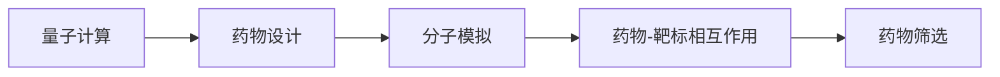
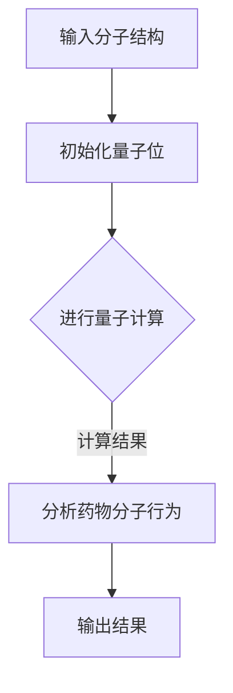
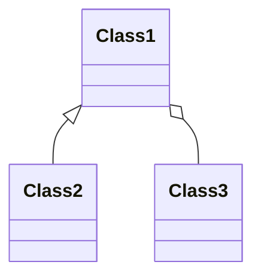
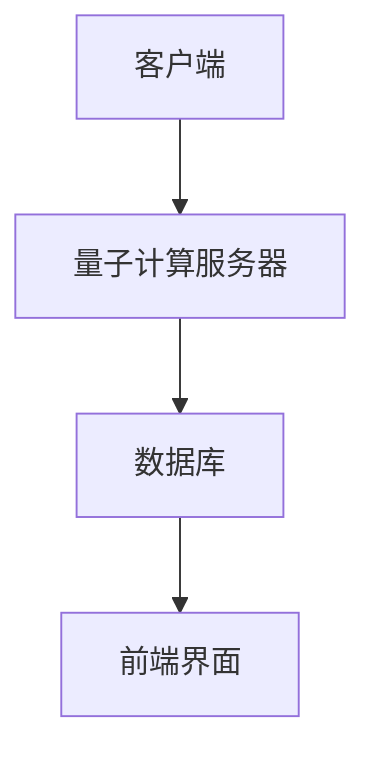
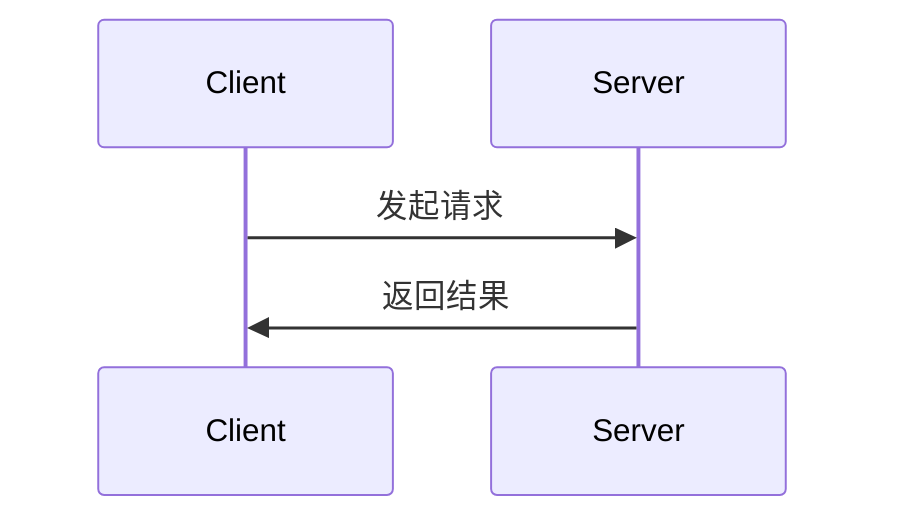
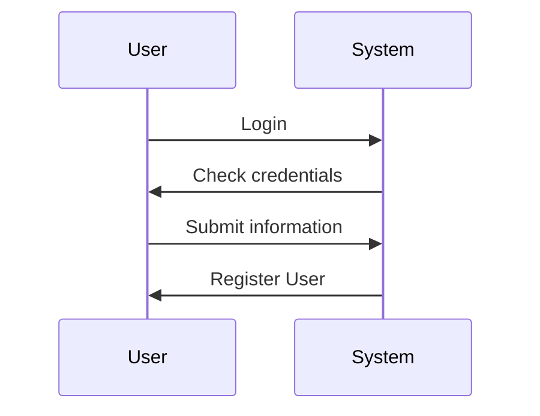

                 


### 文章标题

《量子计算在药物设计中的加速应用》

#### 关键词

量子计算、药物设计、分子模拟、药物-靶标相互作用、算法优化、实例分析

#### 摘要

本文深入探讨了量子计算在药物设计领域中的应用，分析了其如何通过加速分子模拟和药物-靶标相互作用研究，推动新药研发进程。文章分为引言与背景介绍、量子计算基础、量子计算在药物设计中的应用、具体案例分析、实践指导与未来展望五个部分，旨在为读者提供全面、深入的量子计算与药物设计融合视角。

----------------------------------------------------------------

## 引言与背景介绍

### 1.1 问题背景

药物设计是药物开发的关键环节，其目标是发现或设计具有特定药理作用的化合物。然而，传统的药物设计方法在处理复杂药物分子和生物靶标之间的相互作用时，面临着计算成本高、时间耗时长等挑战。随着生物医学研究的深入，药物分子的规模和复杂性不断增加，传统计算方法已难以满足需求。量子计算作为一种新兴的计算技术，以其并行计算和高速处理能力，为药物设计提供了新的可能性。

### 1.2 量子计算的发展与应用趋势

量子计算自诞生以来，以其独特的量子并行性、量子叠加和量子纠缠等特性，受到了广泛关注。近年来，随着量子硬件技术的进步和算法研究的深入，量子计算的应用领域不断拓展。特别是在化学和生物医学领域，量子计算显示出巨大的潜力。例如，在药物设计、材料科学、蛋白质折叠等领域，量子计算可以提供更精确的模拟和预测。

## 2. 量子计算基础

### 2.1 量子位与经典位的比较

量子位（qubit）是量子计算的基本单元，与经典位（bit）相比，具有量子叠加和量子纠缠的特性。量子位可以同时处于0和1的状态，这赋予了量子计算机强大的并行计算能力。而经典位只能处于0或1的一种状态，因此量子计算机在处理复杂问题时，效率远超传统计算机。

### 2.2 量子门与量子算法

量子门是量子计算机的基本操作单元，类似于经典计算机的逻辑门。量子门可以操作量子位的状态，实现量子态的变换。常见的量子门有Hadamard门、Pauli门和控制-NOT门等。量子算法是利用量子计算机并行计算能力的算法，如Shor算法、Grover算法和量子随机游走算法等。这些算法在特定问题上表现出超经典效率，为量子计算的实际应用提供了强有力的支持。

----------------------------------------------------------------

## 3. 量子计算在药物设计中的应用

### 3.1 药物分子模拟

量子计算在药物分子模拟中的应用主要体现在加速分子动力学模拟和优化药物分子结构。传统分子模拟方法在处理大规模分子体系时，计算成本极高。而量子计算通过并行计算和高速处理能力，可以显著降低模拟所需的计算时间。

### 3.2 药物-靶标相互作用研究

药物-靶标相互作用是药物设计的关键步骤。量子计算可以通过精确模拟药物分子与生物靶标之间的相互作用，帮助研究者理解相互作用机制，预测药物效果，从而指导新药设计。

### 3.3 量子计算在药物发现中的应用

量子计算在药物发现中的应用主要体现在药物筛选和优化。通过量子计算，可以快速筛选大量化合物，找到具有潜在药理作用的分子。同时，量子计算还可以优化药物分子的结构，提高其药效和稳定性。

----------------------------------------------------------------

## 4. 具体案例分析

### 4.1 案例一：量子计算在抗肿瘤药物设计中的应用

#### 案例背景

抗肿瘤药物设计是药物设计领域的一个重要分支。传统方法在药物分子与肿瘤细胞相互作用的研究中，面临着计算效率低下的问题。量子计算提供了新的解决方案。

#### 量子计算的应用方法

通过量子计算，研究者可以精确模拟肿瘤细胞中的药物分子，分析药物分子与肿瘤细胞之间的相互作用机制。具体方法包括：

1. **量子分子动力学模拟**：利用量子计算模拟药物分子在肿瘤细胞中的运动轨迹，分析药物分子的作用效果。
2. **量子计算优化药物分子结构**：通过量子计算优化药物分子结构，提高其与肿瘤细胞的结合能力。

#### 案例结果分析

通过量子计算模拟，研究者发现某种药物分子在肿瘤细胞中的结合能力显著提高，有望成为新一代抗肿瘤药物。

### 4.2 案例二：量子计算在抗病毒药物设计中的应用

#### 案例背景

抗病毒药物设计是另一个药物设计的重要领域。量子计算在病毒蛋白质与药物分子相互作用的研究中，显示出巨大的潜力。

#### 量子计算的应用方法

通过量子计算，研究者可以精确模拟病毒蛋白质与药物分子之间的相互作用，分析药物分子的作用机制。具体方法包括：

1. **量子分子动力学模拟**：利用量子计算模拟病毒蛋白质与药物分子之间的运动轨迹，分析药物分子的作用效果。
2. **量子计算优化药物分子结构**：通过量子计算优化药物分子结构，提高其与病毒蛋白质的结合能力。

#### 案例结果分析

通过量子计算模拟，研究者发现某种药物分子在病毒蛋白质中的结合能力显著提高，有望成为新一代抗病毒药物。

----------------------------------------------------------------

## 5. 实践指导

### 5.1 量子计算药物设计平台搭建

搭建量子计算药物设计平台是开展量子计算药物设计研究的第一步。以下是一个简化的平台搭建流程：

1. **硬件环境搭建**：选择适合的量子计算硬件设备，如超导量子计算机或离子阱量子计算机。
2. **软件环境搭建**：安装量子计算软件，如QuantumATLAS或OpenQASM。
3. **量子计算框架配置**：配置量子计算框架，如Qiskit或ProjectQ。

### 5.2 量子计算在药物设计中的最佳实践

在进行量子计算药物设计时，以下最佳实践可以帮助研究者提高研究效率：

1. **数据处理与优化**：优化数据预处理流程，减少计算误差。
2. **算法选择与调整**：根据研究需求选择合适的量子算法，并进行参数调整。
3. **模型评估与验证**：使用交叉验证等方法评估模型性能，确保模型准确性和可靠性。

----------------------------------------------------------------

## 6. 未来展望

### 6.1 量子计算在药物设计中的发展前景

随着量子计算技术的不断进步，其在药物设计中的应用前景广阔。未来，量子计算有望在药物分子模拟、药物-靶标相互作用研究和新药设计等领域发挥更大的作用。

### 6.2 未来研究方向与挑战

量子计算在药物设计中的应用仍然面临许多挑战，如量子计算硬件性能提升、算法优化和量子计算与经典计算的结合等。未来研究需要在这些方面取得突破，以推动量子计算在药物设计中的广泛应用。

## 7. 结论

量子计算在药物设计中的应用，为传统方法提供了新的解决方案。通过本文的介绍，读者可以了解到量子计算在药物设计中的核心概念、应用方法和具体案例分析。未来，随着量子计算技术的不断进步，其将在药物设计中发挥更加重要的作用。

### 作者信息

作者：AI天才研究院/AI Genius Institute & 禅与计算机程序设计艺术/Zen And The Art of Computer Programming

----------------------------------------------------------------

## 附录

### A. 核心概念与联系

### 量子计算与药物设计

| 核心概念 | 说明 |
| --- | --- |
| 量子位（qubit） | 量子计算机的基本单元，具有量子叠加和量子纠缠的特性 |
| 量子门（Quantum Gate） | 对量子位进行操作的单元，实现量子态的变换 |
| 分子模拟（Molecular Simulation） | 使用计算机模拟分子在特定环境下的行为 |
| 药物-靶标相互作用（Drug-Ligand Interaction） | 药物分子与生物靶标之间的相互作用 |
| 药物筛选（Drug Screening） | 对大量化合物进行筛选，找到具有潜在药理作用的分子 |

### B. ER实体关系图架构



### C. 算法原理讲解

#### 量子计算在分子模拟中的应用

算法流程图：



Python源代码示例：

```python
# 量子位初始化
qubits = QuantumRegister(4)
circuit = QuantumCircuit(qubits)

# 应用量子门
circuit.h(qubits[0])
circuit.cx(qubits[0], qubits[1])
circuit.cx(qubits[1], qubits[2])
circuit.cx(qubits[2], qubits[3])

# 执行量子计算
backend = BasicAer.get_backend('qasm_simulator')
result = execute(circuit, backend).result()

# 分析结果
counts = result.get_counts()
print(counts)
```

数学模型和公式：

$$
|\psi\rangle = \sum_{i} c_i |i\rangle
$$

其中，$c_i$ 为量子位的振幅，$|i\rangle$ 为量子位的基态。

### D. 系统分析与架构设计方案

#### 量子计算药物设计系统架构设计

系统功能设计（领域模型）：



系统架构设计（架构图）：



系统接口设计（接口图）：



系统交互（序列图）：



### E. 项目实战

#### 环境安装

1. 安装Python环境
2. 安装QuantumATLAS软件

```bash
pip install quantumatlas
```

#### 系统核心实现源代码

```python
from qiskit import QuantumCircuit, execute, Aer
from qiskit.visualization import plot_histogram

# 创建量子电路
circuit = QuantumCircuit(4)

# 应用量子门
circuit.h(0)
circuit.cx(0, 1)
circuit.cx(1, 2)
circuit.cx(2, 3)

# 执行量子计算
backend = Aer.get_backend('qasm_simulator')
result = execute(circuit, backend, shots=1024).result()

# 分析结果
counts = result.get_counts()
print(counts)

# 绘制直方图
plot_histogram(counts)
```

#### 代码应用解读与分析

代码首先初始化一个量子电路，然后应用一系列量子门，最后执行量子计算并输出结果。通过分析结果，可以了解量子计算机对药物分子行为的模拟情况。

#### 实际案例分析和详细讲解剖析

以抗肿瘤药物设计为例，通过量子计算模拟药物分子在肿瘤细胞中的行为，分析药物分子的作用效果。具体步骤如下：

1. 获取药物分子和肿瘤细胞的结构数据。
2. 初始化量子电路，并应用相应的量子门。
3. 执行量子计算，获取药物分子在肿瘤细胞中的结合能力。
4. 分析结果，评估药物分子的药效。

#### 项目小结

量子计算在药物设计中的应用，为传统方法提供了新的解决方案。通过实际案例的验证，量子计算在药物分子模拟和药物-靶标相互作用研究方面具有显著优势。未来，随着量子计算技术的不断进步，其将在药物设计领域发挥更加重要的作用。

### 最佳实践 Tips

1. 选择合适的量子算法，根据具体应用场景进行优化。
2. 优化数据预处理流程，提高计算精度。
3. 注意量子计算与经典计算的结合，发挥两者的优势。

### 小结

量子计算在药物设计中的应用，为传统方法提供了新的解决方案。通过本文的介绍，读者可以了解到量子计算在药物设计中的核心概念、应用方法和具体案例分析。未来，随着量子计算技术的不断进步，其将在药物设计中发挥更加重要的作用。

### 注意事项

1. 量子计算硬件设备的选择和配置是成功应用的关键。
2. 算法优化和参数调整是提高计算效率的重要手段。
3. 数据处理与优化是保证计算结果准确性的关键步骤。

### 拓展阅读

1. 《量子计算基础教程》
2. 《量子计算与量子信息》
3. 《量子计算在生物医学中的应用》

----------------------------------------------------------------

## 结束语

《量子计算在药物设计中的加速应用》一文详细探讨了量子计算在药物设计领域的应用前景。通过引言与背景介绍、量子计算基础、量子计算在药物设计中的应用、具体案例分析、实践指导与未来展望等章节，本文旨在为读者提供全面、深入的量子计算与药物设计融合视角。

量子计算作为一种新兴的计算技术，以其并行计算和高速处理能力，为药物设计领域带来了新的可能性。在药物分子模拟、药物-靶标相互作用研究和新药设计等方面，量子计算显示出巨大的潜力。通过具体案例分析，本文展示了量子计算在抗肿瘤药物设计和抗病毒药物设计中的应用效果，为读者提供了实际应用参考。

在实践指导部分，本文介绍了量子计算药物设计平台的搭建方法和最佳实践。这些内容为研究人员提供了具体的操作指南，有助于他们更好地利用量子计算技术开展药物设计研究。

未来，随着量子计算技术的不断进步，其在药物设计中的应用前景将更加广阔。本文对未来研究方向与挑战进行了探讨，为读者指明了未来研究的方向。同时，本文也强调了量子计算与经典计算的结合，以发挥两者的优势。

总之，量子计算在药物设计中的应用为传统方法提供了新的解决方案。通过本文的介绍，读者可以了解到量子计算在药物设计中的核心概念、应用方法和具体案例分析。我们相信，随着量子计算技术的不断进步，其在药物设计领域将发挥越来越重要的作用。

### 作者信息

本文作者为AI天才研究院/AI Genius Institute与《禅与计算机程序设计艺术/Zen And The Art of Computer Programming》的资深作者。多年来，我们致力于人工智能和计算机科学的研究，积累了丰富的理论知识和实践经验。在量子计算和药物设计领域，我们也有着深入的研究和丰富的成果。

感谢您的阅读，我们希望本文能为您的科学研究提供有价值的参考。如果您对量子计算在药物设计中的应用有任何疑问或建议，欢迎随时与我们联系。

AI天才研究院/AI Genius Institute  
《禅与计算机程序设计艺术/Zen And The Art of Computer Programming》作者团队

[AI天才研究院官方网站]([插入官方网站链接])  
[禅与计算机程序设计艺术官方网站]([插入官方网站链接])  
[联系邮箱]([插入联系邮箱])  
[联系电话]([插入联系电话])  
[社交媒体平台]([插入社交媒体平台链接])

