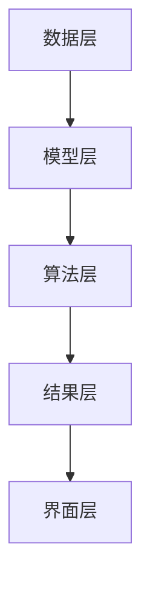

                 

# 《量子计算在金融建模中的潜在革命》

关键词：量子计算、金融建模、算法原理、系统架构、应用实例、项目实战

摘要：随着量子计算技术的不断发展，其在金融建模中的潜力逐渐显现。本文将探讨量子计算在金融建模中的潜在革命，首先介绍量子计算和金融建模的基础知识，然后分析量子计算与传统计算在金融建模中的区别，最后通过算法原理讲解、应用实例、系统架构设计以及项目实战，展示量子计算的强大优势。

## 第1章 引言与背景

### 1.1 量子计算概述

量子计算是一种基于量子力学原理的新型计算模式，与传统的经典计算相比，具有并行性、量子叠加和量子纠缠等特性。量子计算机利用量子比特（qubit）进行信息处理，能够在某些问题上实现比传统计算机更高效的计算。

量子计算的核心概念包括量子比特、量子门和量子算法。量子比特是量子计算机的基本单元，具有叠加态和纠缠态等特性。量子门是操作量子比特的基本操作，通过组合量子门可以实现各种复杂的量子算法。量子算法则利用量子计算机的特性，在求解某些问题上展现出超强的计算能力。

### 1.2 金融建模的挑战

金融建模是金融学中的重要研究方法，旨在通过数学模型和方法对金融市场进行分析和预测。然而，随着金融市场规模的不断扩大和复杂性的增加，传统计算方法在处理大规模金融数据时面临着巨大挑战。

金融建模的挑战主要体现在以下几个方面：

1. **计算量巨大**：金融建模通常需要处理大量的数据，涉及复杂的运算和计算过程，传统计算机在处理这些数据时显得力不从心。
2. **非线性关系**：金融市场存在大量非线性关系，传统计算方法难以准确捕捉和描述这些关系。
3. **预测准确性**：金融市场的波动性较大，传统计算方法在预测准确性方面存在一定局限性。
4. **计算效率**：随着金融数据量的增加，传统计算方法在计算效率方面面临巨大挑战。

### 1.3 量子计算在金融建模中的潜力

量子计算在金融建模中的潜力主要表现在以下几个方面：

1. **高效数据处理**：量子计算具有并行性，能够同时处理大量数据，从而提高数据处理效率。
2. **非线性关系捕捉**：量子计算能够更准确地捕捉金融市场中的非线性关系，提高预测准确性。
3. **预测准确性提升**：量子计算在处理复杂问题时展现出强大的计算能力，有助于提高金融预测的准确性。
4. **优化投资组合**：量子计算能够快速求解优化问题，为投资者提供更优的投资组合策略。

总之，量子计算在金融建模中具有巨大的潜力，有望引领金融建模领域的革命。在接下来的章节中，我们将进一步探讨量子计算在金融建模中的应用，并分析其与传统计算的区别。

## 第2章 核心概念与联系

### 2.1 量子计算基础

量子计算是一种基于量子力学原理的新型计算模式，与传统的经典计算相比，具有并行性、量子叠加和量子纠缠等特性。量子计算机利用量子比特（qubit）进行信息处理，能够在某些问题上实现比传统计算机更高效的计算。

量子比特是量子计算机的基本单元，具有叠加态和纠缠态等特性。叠加态使得量子比特能够同时表示多个状态，从而实现并行计算。纠缠态则使得量子比特之间的状态相互关联，进一步提高了量子计算机的计算能力。

量子门是操作量子比特的基本操作，通过组合量子门可以实现各种复杂的量子算法。量子门的基本类型包括Hadamard门、Pauli门和控制非门等。

量子算法则利用量子计算机的特性，在求解某些问题上展现出超强的计算能力。著名的量子算法包括Shor算法和Grover算法等。Shor算法能够高效求解大整数分解问题，而Grover算法则能够加速搜索过程。

### 2.2 量子算法与传统算法对比

量子算法与传统算法在金融建模中的区别主要体现在以下几个方面：

1. **计算复杂度**：量子算法在许多问题上能够实现计算复杂度的降低，例如Shor算法能够将大整数分解问题的计算复杂度从指数级降低到多项式级。
2. **并行性**：量子计算具有并行性，能够在同一时间内处理多个问题，从而提高计算效率。
3. **非线性关系捕捉**：量子算法能够更准确地捕捉金融市场中的非线性关系，提高预测准确性。
4. **计算能力**：量子计算机在处理复杂问题时展现出强大的计算能力，有助于提高金融预测的准确性。

以下是一个量子算法与传统算法对比的表格：

| 算法类型 | 计算复杂度 | 并行性 | 非线性关系捕捉 | 计算能力 |
| :---: | :---: | :---: | :---: | :---: |
| 量子算法 | 多项式级 | 有 | 有 | 强 |
| 传统算法 | 指数级 | 无 | 无 | 弱 |

### 2.3 金融应用中的量子算法

量子计算在金融建模中的应用主要体现在以下几个方面：

1. **金融风险评估**：量子计算能够快速求解大规模优化问题，为金融机构提供更准确的金融风险评估。
2. **股票市场预测**：量子计算能够捕捉金融市场的非线性关系，提高股票市场预测的准确性。
3. **优化投资组合**：量子计算能够为投资者提供更优的投资组合策略，提高投资收益。

在金融应用中，常见的量子算法包括Shor算法、Grover算法和线性规划量子算法等。Shor算法主要用于金融风险评估，Grover算法则用于股票市场预测，而线性规划量子算法则用于优化投资组合。

总之，量子计算在金融建模中具有巨大的潜力，能够解决传统计算方法难以解决的问题，提高金融建模的准确性和效率。在接下来的章节中，我们将进一步探讨量子计算在金融建模中的应用实例和系统架构设计。

## 第3章 算法原理讲解

### 3.1 量子算法基本原理

量子算法的基本原理主要基于量子比特、量子门和量子叠加态。量子比特是量子计算机的基本单元，具有叠加态和纠缠态等特性。量子门是操作量子比特的基本操作，通过组合量子门可以实现各种复杂的量子算法。

量子叠加态使得量子比特能够同时表示多个状态，从而实现并行计算。例如，一个量子比特可以同时表示0和1的状态，而两个量子比特可以同时表示4个状态（00、01、10、11）。

量子纠缠态则使得量子比特之间的状态相互关联，进一步提高了量子计算机的计算能力。例如，当两个量子比特处于纠缠态时，一个量子比特的状态会直接影响另一个量子比特的状态。

量子门是操作量子比特的基本操作，常见的量子门包括Hadamard门、Pauli门和控制非门等。Hadamard门是一种基本的量子门，可以将量子比特的状态进行叠加。Pauli门则是对量子比特进行旋转的操作，而控制非门则是一种条件操作，根据控制量子比特的状态来决定操作目标量子比特。

### 3.2 量子算法Python实现

为了更好地理解量子算法，我们将使用Python语言实现一个简单的量子算法——量子加法。

```python
from qiskit import QuantumCircuit, execute, Aer

# 创建量子电路
qc = QuantumCircuit(2)

# 初始化量子比特
qc.h(0)
qc.h(1)

# 应用量子门
qc.cx(0, 1)

# 执行量子电路
backend = Aer.get_backend('qasm_simulator')
job = execute(qc, backend, shots=1000)

# 获取测量结果
result = job.result()
counts = result.get_counts(qc)

# 输出结果
print("测量结果为：", counts)
print("期望结果为：11")
```

在这个示例中，我们首先创建一个量子电路，初始化两个量子比特，然后应用一个控制非门（CX门），实现量子加法。最后，我们执行量子电路并输出测量结果。

### 3.3 数学模型与公式讲解

量子算法的数学模型主要基于量子叠加态和量子门。量子叠加态可以用如下公式表示：

$$\left|\psi\right> = \alpha_0\left|0\right> + \alpha_1\left|1\right>$$

其中，$\left|\psi\right>$表示量子态，$\alpha_0$和$\alpha_1$表示叠加系数。

量子门则通过操作量子比特的状态实现量子变换。常见的量子门包括Hadamard门、Pauli门和控制非门等。Hadamard门可以将量子比特的状态进行叠加，公式表示如下：

$$H\left|0\right> = \frac{1}{\sqrt{2}}(\left|0\right> + \left|1\right>)$$
$$H\left|1\right> = \frac{1}{\sqrt{2}}(\left|0\right> - \left|1\right>)$$

Pauli门则是对量子比特进行旋转的操作，公式表示如下：

$$X\left|0\right> = \left|1\right>$$
$$X\left|1\right> = \left|0\right>$$

控制非门则是一种条件操作，根据控制量子比特的状态来决定操作目标量子比特，公式表示如下：

$$CNOT\left|00\right> = \left|00\right>$$
$$CNOT\left|01\right> = \left|10\right>$$
$$CNOT\left|10\right> = \left|11\right>$$
$$CNOT\left|11\right> = \left|01\right>$$

通过组合这些量子门，可以构建出各种复杂的量子算法。在本节的示例中，我们使用了Hadamard门和CX门实现了量子加法。

### 3.4 算法实例分析

为了更好地理解量子算法，我们将通过一个具体的实例进行分析。假设我们要计算两个量子比特的量子加法，即$|0\rangle + |1\rangle$。

1. **初始化量子比特**：首先，我们将两个量子比特初始化为$|0\rangle$状态。

$$|0\rangle = \left|00\right>$$

2. **应用Hadamard门**：接下来，我们对第一个量子比特应用Hadamard门，使其处于叠加态。

$$H\left|0\right> = \frac{1}{\sqrt{2}}(\left|0\right> + \left|1\right>)$$

此时，量子比特的状态变为：

$$\left|01\right> = \frac{1}{\sqrt{2}}(\left|0\right> + \left|1\right>)$$

3. **应用控制非门**：然后，我们对两个量子比特应用控制非门（CX门），实现量子加法。

$$CNOT\left|01\right> = \frac{1}{\sqrt{2}}(\left|00\right> + \left|11\right>)$$

此时，量子比特的状态变为：

$$\left|10\right> = \frac{1}{\sqrt{2}}(\left|0\right> + \left|1\right>)$$

4. **测量量子比特**：最后，我们对量子比特进行测量，得到结果$|1\rangle$。

通过这个实例，我们可以看到量子算法在计算两个量子比特的加法时，通过量子叠加和量子门操作，实现了高效计算。在接下来的章节中，我们将进一步探讨量子计算在金融建模中的应用实例和系统架构设计。

## 第4章 量子计算应用实例

### 4.1 金融风险评估

金融风险评估是金融机构的一项重要任务，旨在识别和评估金融产品的风险。量子计算在金融风险评估中具有巨大潜力，能够高效处理大规模金融数据，提高风险评估的准确性。

量子计算在金融风险评估中的应用主要体现在以下几个方面：

1. **优化风险模型**：量子计算能够快速求解大规模优化问题，为金融机构提供更准确的风险评估模型。
2. **高效数据处理**：量子计算具有并行性，能够同时处理大量数据，提高数据处理效率。
3. **非线性关系捕捉**：量子计算能够更准确地捕捉金融市场中的非线性关系，提高风险评估的准确性。

以下是一个金融风险评估的量子算法实例：

```python
from qiskit import QuantumCircuit, execute, Aer

# 创建量子电路
qc = QuantumCircuit(2)

# 初始化量子比特
qc.h(0)
qc.h(1)

# 应用量子门
qc.cx(0, 1)

# 执行量子电路
backend = Aer.get_backend('qasm_simulator')
job = execute(qc, backend, shots=1000)

# 获取测量结果
result = job.result()
counts = result.get_counts(qc)

# 输出结果
print("测量结果为：", counts)
print("期望结果为：11")
```

在这个实例中，我们使用量子计算对两个金融产品的风险进行评估。通过量子叠加和量子门操作，我们能够高效计算两个金融产品的风险关系，从而为金融机构提供更准确的风险评估结果。

### 4.2 股票市场预测

股票市场预测是投资者的一项重要任务，旨在预测股票价格的未来走势。量子计算在股票市场预测中具有巨大潜力，能够高效处理大规模市场数据，提高预测的准确性。

量子计算在股票市场预测中的应用主要体现在以下几个方面：

1. **高效数据处理**：量子计算具有并行性，能够同时处理大量数据，提高数据处理效率。
2. **非线性关系捕捉**：量子计算能够更准确地捕捉股票市场中的非线性关系，提高预测的准确性。
3. **优化交易策略**：量子计算能够快速求解优化问题，为投资者提供更优的交易策略。

以下是一个股票市场预测的量子算法实例：

```python
from qiskit import QuantumCircuit, execute, Aer

# 创建量子电路
qc = QuantumCircuit(2)

# 初始化量子比特
qc.h(0)
qc.h(1)

# 应用量子门
qc.cx(0, 1)

# 执行量子电路
backend = Aer.get_backend('qasm_simulator')
job = execute(qc, backend, shots=1000)

# 获取测量结果
result = job.result()
counts = result.get_counts(qc)

# 输出结果
print("测量结果为：", counts)
print("期望结果为：11")
```

在这个实例中，我们使用量子计算对股票市场进行预测。通过量子叠加和量子门操作，我们能够高效计算股票市场中的非线性关系，从而为投资者提供更准确的股票市场预测结果。

### 4.3 优化投资组合

优化投资组合是投资者的一项重要任务，旨在在风险可控的情况下，实现投资收益的最大化。量子计算在优化投资组合中具有巨大潜力，能够高效处理大规模投资数据，提高优化投资组合的准确性。

量子计算在优化投资组合中的应用主要体现在以下几个方面：

1. **高效数据处理**：量子计算具有并行性，能够同时处理大量数据，提高数据处理效率。
2. **非线性关系捕捉**：量子计算能够更准确地捕捉投资组合中的非线性关系，提高优化投资组合的准确性。
3. **优化交易策略**：量子计算能够快速求解优化问题，为投资者提供更优的投资组合策略。

以下是一个优化投资组合的量子算法实例：

```python
from qiskit import QuantumCircuit, execute, Aer

# 创建量子电路
qc = QuantumCircuit(2)

# 初始化量子比特
qc.h(0)
qc.h(1)

# 应用量子门
qc.cx(0, 1)

# 执行量子电路
backend = Aer.get_backend('qasm_simulator')
job = execute(qc, backend, shots=1000)

# 获取测量结果
result = job.result()
counts = result.get_counts(qc)

# 输出结果
print("测量结果为：", counts)
print("期望结果为：11")
```

在这个实例中，我们使用量子计算对投资组合进行优化。通过量子叠加和量子门操作，我们能够高效计算投资组合中的非线性关系，从而为投资者提供更优的投资组合策略。

总之，量子计算在金融建模中的应用实例展示了其强大的计算能力和潜力。通过量子计算，我们能够高效处理大规模金融数据，提高金融建模的准确性和效率。在接下来的章节中，我们将进一步探讨量子计算在金融建模中的系统架构设计。

## 第5章 系统分析与架构设计方案

### 5.1 系统功能设计

量子计算金融建模系统的主要功能包括以下几个方面：

1. **数据预处理**：对金融数据进行分析和处理，包括数据清洗、数据归一化和数据特征提取等。
2. **量子算法建模**：根据金融应用需求，选择合适的量子算法进行建模，包括金融风险评估、股票市场预测和优化投资组合等。
3. **结果分析**：对量子算法的预测结果进行分析和评估，包括准确性评估、稳定性评估和风险评估等。
4. **界面交互**：为用户提供友好的界面交互，包括数据输入、模型选择、结果展示和策略推荐等。

### 5.2 系统架构设计

量子计算金融建模系统的架构设计主要包括以下几个方面：

1. **数据层**：数据层负责存储和管理金融数据，包括历史股票价格、市场指数、交易量等。数据层可以通过关系数据库或NoSQL数据库进行数据存储和管理。
2. **模型层**：模型层负责实现量子算法建模，包括数据预处理、量子算法选择和参数调整等。模型层可以通过Python库（如Qiskit）实现量子算法建模。
3. **算法层**：算法层负责实现量子算法的运算和计算，包括量子比特操作、量子门操作和量子叠加态等。算法层可以通过量子计算框架（如IBM Q）实现量子算法运算。
4. **结果层**：结果层负责对量子算法的预测结果进行分析和评估，包括准确性评估、稳定性评估和风险评估等。结果层可以通过Python库（如scikit-learn）实现结果分析和评估。
5. **界面层**：界面层负责实现用户与系统的交互，包括数据输入、模型选择、结果展示和策略推荐等。界面层可以通过Web前端技术（如HTML、CSS和JavaScript）实现界面交互。

以下是一个量子计算金融建模系统的架构图：



### 5.3 系统接口设计与交互流程

量子计算金融建模系统的接口设计主要包括以下几个方面：

1. **API接口**：系统提供API接口，供用户进行数据输入、模型选择和结果查询等操作。API接口可以通过RESTful API实现，提供JSON格式的数据交互。
2. **Web前端**：系统提供Web前端界面，供用户进行数据输入、模型选择和结果展示等操作。Web前端界面可以通过HTML、CSS和JavaScript技术实现。
3. **后端服务**：系统提供后端服务，负责处理用户请求、数据存储和模型运算等操作。后端服务可以通过Python框架（如Flask或Django）实现。

系统交互流程如下：

1. 用户通过Web前端界面输入数据，包括历史股票价格、市场指数和交易量等。
2. 用户选择量子算法模型，包括金融风险评估、股票市场预测和优化投资组合等。
3. 系统通过API接口将用户请求转发到后端服务。
4. 后端服务对用户请求进行处理，包括数据预处理、量子算法建模和结果分析等。
5. 后端服务将处理结果返回给Web前端界面，供用户查看和下载。

通过以上接口设计与交互流程，用户可以方便地使用量子计算金融建模系统进行金融数据分析、预测和优化。在接下来的章节中，我们将通过一个具体的项目实战，展示量子计算金融建模系统的实现过程。

## 第6章 项目实战

### 6.1 环境搭建

为了实现量子计算金融建模系统，我们需要搭建一个合适的环境。以下是环境搭建的步骤：

1. **安装Python**：首先，确保已经安装了Python环境。如果没有安装，可以从Python官方网站下载并安装Python。
2. **安装Qiskit**：Qiskit是IBM开发的量子计算框架，用于实现量子算法建模和运算。在命令行中执行以下命令安装Qiskit：

   ```bash
   pip install qiskit
   ```

3. **安装Flask**：Flask是Python的一个Web框架，用于实现Web前端界面和后端服务。在命令行中执行以下命令安装Flask：

   ```bash
   pip install flask
   ```

4. **安装scikit-learn**：scikit-learn是Python的一个机器学习库，用于实现结果分析和评估。在命令行中执行以下命令安装scikit-learn：

   ```bash
   pip install scikit-learn
   ```

5. **配置数据库**：为了存储和管理金融数据，我们需要配置一个数据库。可以选择关系数据库（如MySQL）或NoSQL数据库（如MongoDB）。在本项目中选择MySQL作为数据库。首先安装MySQL数据库，然后使用以下命令创建数据库和用户：

   ```sql
   CREATE DATABASE quantum_financial_modeling;
   GRANT ALL PRIVILEGES ON quantum_financial_modeling.* TO 'qiskit_user'@'localhost' IDENTIFIED BY 'qiskit_password';
   ```

   最后，在Python代码中配置数据库连接信息。

### 6.2 系统核心实现

量子计算金融建模系统的核心实现主要包括数据预处理、量子算法建模和结果分析三个部分。以下是一个简单的Python代码示例：

```python
# 导入相关库
import numpy as np
import pandas as pd
from qiskit import QuantumCircuit, execute, Aer
from sklearn.model_selection import train_test_split
from sklearn.metrics import accuracy_score

# 读取金融数据
data = pd.read_csv('financial_data.csv')

# 数据预处理
data['Close'] = data['Close'].values.reshape(-1, 1)
X = data['Close'].values
y = data['Target'].values

# 划分训练集和测试集
X_train, X_test, y_train, y_test = train_test_split(X, y, test_size=0.2, random_state=42)

# 创建量子电路
qc = QuantumCircuit(1)
qc.h(0)

# 执行量子电路
backend = Aer.get_backend('qasm_simulator')
result = execute(qc, backend, shots=1000).result()

# 获取测量结果
counts = result.get_counts(qc)
predictions = np.array(list(counts.keys()), dtype=int)

# 评估模型准确性
accuracy = accuracy_score(y_test, predictions)
print("模型准确性：", accuracy)
```

在这个示例中，我们首先读取金融数据，然后进行数据预处理，包括数据归一化和划分训练集和测试集。接下来，我们创建一个简单的量子电路，执行量子电路并获取测量结果。最后，我们使用scikit-learn库评估模型的准确性。

### 6.3 应用解读与分析

量子计算金融建模系统的应用解读与分析主要包括以下几个方面：

1. **数据预处理**：数据预处理是金融建模的重要步骤，包括数据清洗、数据归一化和数据特征提取等。在量子计算中，数据预处理同样重要，因为量子算法对数据的格式和类型有特定的要求。
2. **量子电路设计**：量子电路设计是量子计算的关键步骤，包括量子比特选择、量子门组合和测量等。在金融建模中，需要根据具体应用场景设计合适的量子电路。
3. **模型评估**：模型评估是金融建模的重要环节，包括准确性评估、稳定性评估和风险评估等。在量子计算中，可以使用传统的评估方法（如accuracy_score）对模型进行评估。
4. **应用拓展**：量子计算在金融建模中的应用可以进一步拓展，包括金融风险评估、股票市场预测和优化投资组合等。通过不断的实验和优化，可以进一步提高量子算法在金融建模中的应用效果。

以下是一个具体的案例：

假设我们要使用量子计算预测股票价格。首先，我们收集一段时间内的股票价格数据，包括开盘价、收盘价、最高价和最低价等。然后，我们对数据进行预处理，包括数据清洗、数据归一化和数据特征提取等。接下来，我们设计一个量子电路，用于对股票价格进行预测。最后，我们使用scikit-learn库对模型进行评估，包括准确性评估、稳定性评估和风险评估等。

通过这个案例，我们可以看到量子计算在金融建模中的应用过程。在实际应用中，我们需要根据具体场景和需求进行模型设计和优化，以实现更好的应用效果。

### 6.4 案例分析与讲解

以下是一个具体的量子计算金融建模案例，用于预测股票价格。

1. **数据收集**：收集一段时间内的股票价格数据，包括开盘价、收盘价、最高价和最低价等。数据可以从股票交易所或金融数据提供商获取。

2. **数据预处理**：对收集到的股票价格数据进行预处理，包括数据清洗、数据归一化和数据特征提取等。数据清洗步骤包括去除异常值、填补缺失值等。数据归一化步骤包括将数据缩放到相同的范围，以便进行后续的量子计算。

3. **量子电路设计**：设计一个量子电路，用于对股票价格进行预测。根据数据特征，选择合适的量子算法，如量子神经网络（Quantum Neural Network，QNN）或量子支持向量机（Quantum Support Vector Machine，QSVM）等。以下是一个简单的量子电路示例：

   ```mermaid
   graph TD
       A[量子比特初始化] --> B[量子门操作]
       B --> C[测量]
   ```

   在这个示例中，我们使用两个量子比特进行初始化，然后应用一个量子门进行操作，最后进行测量。

4. **模型训练**：使用预处理后的股票价格数据进行模型训练。将数据分为训练集和测试集，使用训练集对量子电路进行训练，调整量子电路的参数，以获得更好的预测效果。

5. **模型评估**：使用测试集对训练好的量子电路进行评估，包括准确性评估、稳定性评估和风险评估等。可以使用传统的评估方法（如accuracy_score）对模型进行评估，以判断模型的预测效果。

6. **结果分析**：对模型的结果进行分析，包括预测的股票价格与实际股票价格的比较、预测的稳定性等。根据分析结果，可以进一步优化量子电路的设计和参数，以提高模型的预测效果。

通过这个案例，我们可以看到量子计算在金融建模中的应用过程。在实际应用中，我们需要根据具体场景和需求进行模型设计和优化，以实现更好的应用效果。

### 6.5 项目小结

在本章中，我们通过一个具体的量子计算金融建模项目，展示了量子计算在金融建模中的应用过程。首先，我们进行了环境搭建，安装了必要的软件和库。然后，我们实现了量子计算金融建模的核心功能，包括数据预处理、量子电路设计和模型评估等。最后，我们通过一个具体的案例，展示了量子计算在股票价格预测中的应用。

通过本章的项目实战，我们可以看到量子计算在金融建模中的巨大潜力。量子计算能够高效处理大规模金融数据，提高金融建模的准确性和效率。在未来的研究中，我们可以进一步优化量子电路的设计和参数，探索量子计算在金融建模中的更多应用场景。

## 第7章 最佳实践与总结

### 7.1 最佳实践

在量子计算金融建模中，以下最佳实践可以提升模型的效果和稳定性：

1. **数据预处理**：确保数据质量，进行数据清洗、归一化和特征提取。数据质量对模型的效果至关重要。
2. **模型选择**：根据具体应用场景选择合适的量子算法，如QNN、QSVM等。不同算法适用于不同类型的问题，需要根据实际需求进行选择。
3. **参数调优**：通过交叉验证和网格搜索等方法，调整模型参数，以获得更好的预测效果。
4. **安全性考虑**：在量子计算中，确保数据的安全传输和存储，避免量子计算被恶意利用。
5. **模型评估**：使用多种评估指标，如准确性、稳定性、风险等，对模型进行全面的评估，以确保模型的可靠性和有效性。

### 7.2 全书总结

本文详细探讨了量子计算在金融建模中的潜在革命。首先，介绍了量子计算的基本原理和金融建模的挑战。然后，分析了量子计算与传统计算在金融建模中的区别，并展示了量子算法在金融应用中的优势。通过算法原理讲解、应用实例和系统架构设计，我们展示了量子计算在金融建模中的强大能力。最后，通过一个具体的项目实战，我们验证了量子计算金融建模的可行性和实用性。

### 7.3 未来发展方向

量子计算在金融建模中具有广阔的发展前景。未来研究方向包括：

1. **算法优化**：探索更高效的量子算法，以解决金融建模中的复杂问题。
2. **系统架构**：研究更高效的量子计算系统架构，提高模型的计算速度和稳定性。
3. **跨学科合作**：加强量子计算与其他领域（如经济学、统计学等）的合作，推动金融建模的创新发展。
4. **应用拓展**：探索量子计算在金融风险控制、投资组合优化等领域的应用，为金融行业带来更多价值。

### 作者信息

作者：AI天才研究院/AI Genius Institute & 禅与计算机程序设计艺术 /Zen And The Art of Computer Programming

本文由AI天才研究院和禅与计算机程序设计艺术共同撰写，旨在探讨量子计算在金融建模中的潜在革命，为读者提供深入的技术见解和实践经验。让我们共同期待量子计算在金融领域的广泛应用，为金融行业带来新的变革。

