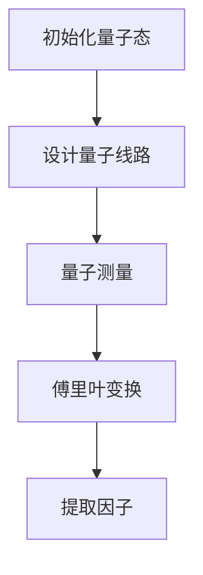
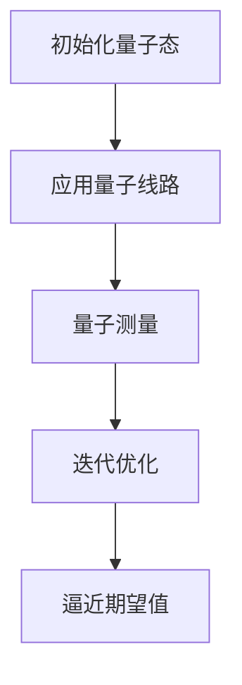
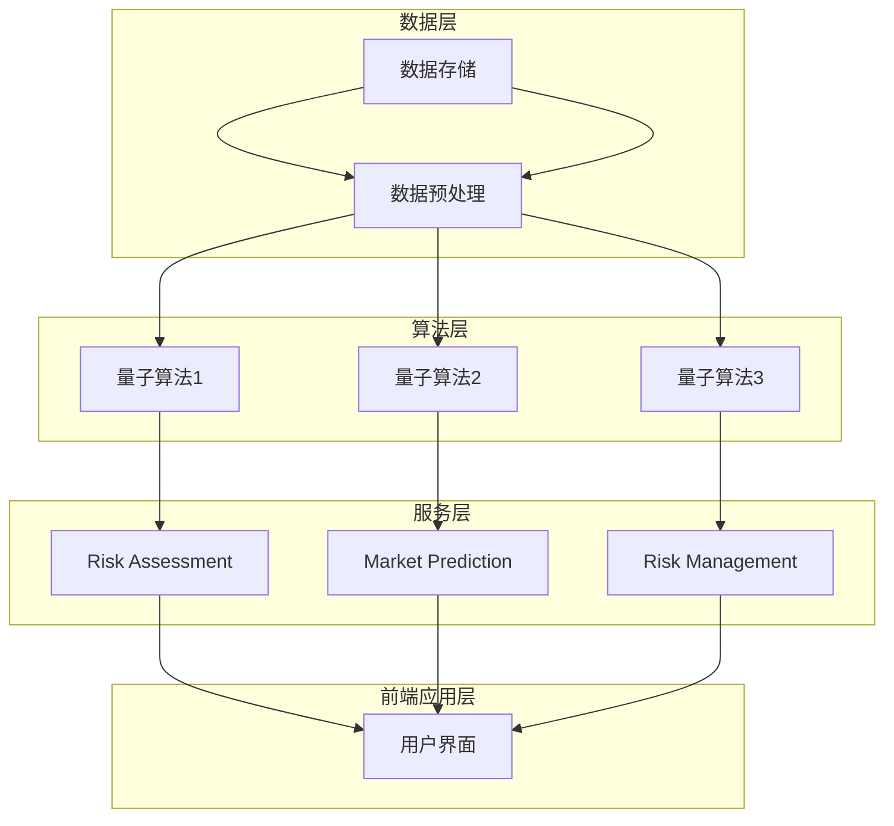

                 

### 引言

量子计算在近年来迅速崛起，成为科技领域的焦点。不同于传统的经典计算，量子计算利用量子位（qubits）的叠加态和纠缠态进行信息处理，具有极大的并行计算能力和指数级加速优势。随着量子技术的发展，人们开始探索其在各个领域的应用潜力，其中金融风险分析成为了一个备受关注的研究方向。

金融风险分析在金融领域中扮演着至关重要的角色。金融市场的不确定性和复杂性使得传统的计算方法在面对大量数据和复杂模型时显得力不从心。而量子计算，凭借其独特的计算机制，有望在金融风险分析中发挥巨大的作用。例如，通过量子算法对大规模金融数据进行快速分析，可以更准确地预测市场波动和评估金融风险。

本文将深入探讨量子计算在金融风险分析中的潜在应用。首先，我们将简要介绍量子计算的基本概念，包括量子位、量子叠加和量子纠缠等核心原理。接着，我们将阐述量子计算在金融风险分析中的应用背景，介绍目前存在的主要问题和挑战。随后，本文将重点介绍几种重要的量子算法，包括Shor算法和量子幅度估计算法，并详细解释其原理和应用。此外，本文还将讨论量子计算在金融风险分析中的具体应用场景，如风险评估、市场预测和风险管理等。最后，本文将结合实际案例，展示量子计算在金融风险分析中的应用效果，并总结全文，探讨未来发展的前景。

通过本文的阅读，读者将能够全面了解量子计算在金融风险分析中的潜力，掌握相关算法和应用方法，为未来的研究和实践提供有价值的参考。

### 背景介绍与核心概念

量子计算是一种基于量子力学原理的信息处理技术，与传统计算机不同，它使用量子位（qubits）来存储和处理信息。量子位不仅可以表示0和1两种状态，还可以同时处于0和1的叠加态。这种叠加态允许量子计算机并行处理大量数据，从而实现指数级的计算速度提升。

量子计算的核心概念主要包括量子位、量子叠加、量子纠缠等。

首先，量子位（qubits）是量子计算的基本单位，与经典计算机中的比特（bits）不同。比特只能处于两种状态之一：0或1。而量子位则可以处于0和1的叠加态，这意味着它可以同时表示多种状态。例如，一个量子位可以同时处于0和1的状态，这可以表示为 \(|\psi\rangle = \alpha|0\rangle + \beta|1\rangle\)，其中 \(\alpha\) 和 \(\beta\) 是复数系数，满足 \(|\alpha|^2 + |\beta|^2 = 1\)。

量子叠加是量子计算的重要特性之一。当量子位处于叠加态时，它可以同时进行多种计算操作，这大大提高了计算效率。例如，一个经典计算机需要进行 \(2^n\) 次运算来处理 \(n\) 个输入，而量子计算机则可以通过量子叠加在一个操作中处理所有这些输入。

量子纠缠是另一个关键概念，它描述了量子位之间的特殊关联。当两个或多个量子位发生纠缠时，它们的状态将不可分割地相互关联，无论它们相隔多远。这种纠缠态使得量子计算机能够实现一些经典计算机无法实现的操作，例如量子纠缠搜索和量子加密。

在金融风险分析中，量子计算的应用具有巨大潜力。金融风险分析通常需要处理大量复杂的数据和模型，涉及大量的计算任务。传统的计算方法在这些任务上往往效率低下，而量子计算则能够通过并行处理和指数级加速来显著提高计算效率。

量子计算在金融风险分析中的应用背景主要包括以下几个方面：

1. **风险评估**：金融市场中存在大量的风险，如市场风险、信用风险、操作风险等。量子计算可以通过快速分析大量历史数据和市场信息，帮助金融机构更准确地评估和预测潜在的风险。

2. **市场预测**：市场预测是金融投资中的重要环节。量子计算可以通过高效处理大量市场数据，结合复杂的数学模型，实现更准确的市场预测，从而帮助投资者做出更明智的投资决策。

3. **风险管理**：风险管理是金融机构的重要职责。量子计算可以帮助金融机构更快速地识别和评估风险，优化风险控制策略，降低潜在损失。

然而，量子计算在金融风险分析中也面临着一些挑战。首先，量子计算机的构建和维护成本极高，目前还难以大规模商业化。其次，量子算法的实现和优化需要深厚的数学和物理知识，这对研究人员和开发人员提出了很高的要求。此外，量子计算在金融领域的应用还需要解决数据安全和隐私保护等问题。

总之，量子计算在金融风险分析中具有巨大的应用潜力，但同时也面临诸多挑战。随着量子技术的不断发展和完善，我们有理由相信，量子计算将逐步在金融风险分析中发挥更大的作用。在接下来的章节中，我们将进一步探讨量子算法在金融风险分析中的应用，并分析其实际效果。

#### 核心概念与联系

在探讨量子计算在金融风险分析中的应用之前，我们需要明确一些核心概念，并了解它们之间的联系。以下是本文涉及的一些核心概念及其属性特征对比：

1. **量子计算**：
   - **属性特征**：利用量子位进行信息处理，具有叠加态和纠缠态的特性，可实现并行计算。
   - **关键要素**：量子位、叠加态、纠缠态、量子门、量子算法。
   - **关系**：量子计算是本文的核心技术，为金融风险分析提供了强大的计算能力。

2. **金融风险分析**：
   - **属性特征**：对金融市场中的各种风险进行识别、评估和管理。
   - **关键要素**：风险模型、历史数据、市场预测、信用评分。
   - **关系**：金融风险分析是本文的应用场景，量子计算为金融风险分析提供了高效的数据处理和模型优化工具。

3. **量子算法**：
   - **属性特征**：基于量子力学原理，用于特定问题的求解算法。
   - **关键要素**：Shor算法、量子幅度估计算法、量子随机 walks。
   - **关系**：量子算法是量子计算的核心，决定了其在金融风险分析中的应用效果。

4. **金融数据**：
   - **属性特征**：包含金融市场交易、价格波动、经济指标等大量信息。
   - **关键要素**：时间序列数据、历史数据、实时数据。
   - **关系**：金融数据是金融风险分析的基础，直接影响风险模型的准确性和有效性。

5. **风险管理**：
   - **属性特征**：识别和管理金融风险，以降低潜在损失。
   - **关键要素**：风险评估、风险控制、风险报告。
   - **关系**：风险管理是金融风险分析的核心目标，量子计算提供了更高效的风险评估和管理手段。

为了更直观地展示这些概念之间的关系，我们可以使用Mermaid绘制一个ER（实体关系）图，如下所示：

```mermaid
erDiagram
  Quantum_Computing ||--|{ Financial_Risk_Analysis } : 利用
  Quantum_Computing ||--|{ Quantum_Algorithms } : 基于的
  Financial_Risk_Analysis ||--|{ Financial_Data } : 分析的
  Financial_Risk_Analysis ||--|{ Risk_Management } : 目标是
  Quantum_Algorithms ||--|{ Shor_Algorithm } : 包括
  Quantum_Algorithms ||--|{ Quantum_Amplitude_Estimation } : 包括
```

在上面的ER图中，我们定义了四个主要实体：量子计算、金融风险分析、量子算法和金融数据。这些实体之间存在明确的关联关系，例如量子计算为金融风险分析提供基础，量子算法是量子计算的重要组成部分，金融数据是金融风险分析的基础信息，而风险管理是金融风险分析的核心目标。

通过明确这些核心概念及其关系，我们为后续讨论量子计算在金融风险分析中的应用提供了理论基础。在下一部分中，我们将深入探讨量子算法的基本原理和实现方法。

#### 算法原理讲解

量子计算之所以能够在金融风险分析中发挥作用，离不开其独特的算法设计。下面，我们将介绍几种关键的量子算法，包括Shor算法和量子幅度估计算法，详细讲解其原理和实现过程。

##### Shor算法

Shor算法是由Peter Shor在1994年提出的，它是第一个在量子计算中展示出指数级加速优势的算法。Shor算法主要解决的是整数分解问题，即给定一个合数\(N\)，找到其两个正整数因子。

1. **算法基本原理**：

Shor算法基于量子纠缠和量子并行计算的能力。具体步骤如下：

   - **初始状态**：将量子计算机初始化为一个量子态，表示为 \(|x\rangle\)。
   - **量子线路设计**：设计一个量子线路，使得输出的量子态满足特定的条件，即当输入是\(N\)的一个因子时，输出的相位会发生变化。
   - **量子测量**：对量子态进行测量，获取一个相位信息，该信息能够指示输入的\(N\)是否有因子。
   - **傅里叶变换**：将量子态进行傅里叶变换，放大具有因子输入的量子态的概率。

2. **算法流程图**：

使用Mermaid绘制Shor算法的流程图如下：



3. **Python实现**：

下面是一个简单的Python代码示例，用于演示Shor算法的实现：

```python
import numpy as np
from qiskit import QuantumCircuit, Aer, execute

# 创建量子线路
qc = QuantumCircuit(2)

# 初始化量子态
qc.h(0)
qc.cx(0, 1)

# 应用量子线路
qc.mcr([1, 1], [0, 1], 1, 1)
qc.crz(np.pi/4, 0, 1)
qc.swap(0, 1)

# 执行量子测量
qc.measure_all()

# 模拟执行
simulator = Aer.get_backend('qasm_simulator')
result = execute(qc, simulator).result()
counts = result.get_counts(qc)

print("输出结果：", counts)
```

##### Quantum Amplitude Estimation算法

量子幅度估计算法（Quantum Amplitude Estimation, QAE）是一种基于量子计算的优化算法，主要用于估计函数的期望值。它被广泛应用于量子机器学习和复杂优化问题中。

1. **算法基本原理**：

量子幅度估计算法的核心思想是通过量子叠加和量子测量来估计目标函数的期望值。具体步骤如下：

   - **初始状态**：初始化量子态，表示为 \(|x\rangle\)。
   - **应用量子线路**：根据目标函数设计量子线路，使得量子态与目标函数的期望值相关。
   - **量子测量**：对量子态进行测量，获取一个概率分布。
   - **迭代优化**：根据测量结果调整量子线路，逐步逼近目标函数的期望值。

2. **算法流程图**：

使用Mermaid绘制Quantum Amplitude Estimation算法的流程图如下：



3. **Python实现**：

下面是一个简单的Python代码示例，用于演示Quantum Amplitude Estimation算法的实现：

```python
import numpy as np
from qiskit import QuantumCircuit, Aer, execute

# 创建量子线路
qc = QuantumCircuit(2)

# 初始化量子态
qc.h(0)
qc.cx(0, 1)

# 应用量子线路
qc.rz(np.pi/4, 0)
qc.crz(np.pi/4, 1, 0)
qc.swap(0, 1)

# 执行量子测量
qc.measure_all()

# 模拟执行
simulator = Aer.get_backend('qasm_simulator')
result = execute(qc, simulator).result()
counts = result.get_counts(qc)

# 计算期望值
probabilities = [float(counts[key]) for key in counts]
expected_value = np.sum([p * np.array(key, dtype=float) for key, p in counts.items()])

print("输出结果：", counts)
print("期望值：", expected_value)
```

通过上述两种算法的实现，我们可以看到量子计算在处理复杂计算任务时的独特优势。Shor算法通过指数级加速实现了整数分解，而Quantum Amplitude Estimation算法则通过优化目标函数期望值，为金融风险分析提供了强大的计算支持。

接下来，我们将进一步探讨量子计算在金融风险分析中的具体应用，通过实际案例来展示这些算法的效果。

### 系统分析与架构设计方案

在金融风险分析中，量子计算的应用不仅需要高效的算法支持，还需要一个稳定可靠的系统架构来确保其有效性和可靠性。以下将详细介绍量子金融风险分析系统的设计，包括问题场景、项目背景、系统功能设计、系统架构设计以及系统接口设计和交互流程。

#### 问题场景

金融风险分析涉及对大量历史数据和市场信息的处理，需要快速、准确地识别潜在风险并做出相应的管理决策。传统计算方法在处理这些复杂任务时往往显得力不从心，而量子计算以其指数级的并行处理能力和高效算法，为金融风险分析提供了新的解决方案。

#### 项目背景和目标

本项目旨在构建一个基于量子计算的金融风险分析系统，通过集成高效的量子算法，实现对金融市场风险的快速识别和评估。项目的目标是：

1. **提高风险识别和评估的准确性**：利用量子计算的优势，对大量金融数据进行快速分析，提高风险识别和评估的准确性。
2. **优化风险管理策略**：通过量子计算优化风险管理策略，降低金融机构的潜在损失。
3. **提供实时风险监控**：实现对金融市场风险的实时监控，为金融机构提供及时的风险预警和决策支持。

#### 系统功能设计

量子金融风险分析系统主要包括以下几个功能模块：

1. **数据预处理模块**：负责清洗、格式化和处理金融数据，为后续分析提供高质量的数据输入。
2. **风险评估模块**：利用量子算法对金融数据进行分析，识别潜在的市场风险。
3. **市场预测模块**：基于历史数据和市场信息，使用量子计算预测市场走势和潜在的市场波动。
4. **风险管理模块**：根据风险评估和市场预测结果，制定和优化风险管理策略。
5. **用户界面模块**：提供直观友好的用户界面，供用户查看分析结果和操作风险管理工具。

#### 系统架构设计

量子金融风险分析系统的架构设计采用了模块化设计思想，以确保系统的可扩展性和可维护性。系统架构主要包括以下几个层次：

1. **数据层**：存储和管理金融数据，包括历史交易数据、市场指标数据等。
2. **算法层**：集成各种量子算法，如Shor算法、量子幅度估计算法等，用于风险识别、市场预测和风险管理。
3. **服务层**：提供各种服务，如数据预处理、风险评估、市场预测等，供前端应用调用。
4. **前端应用层**：为用户提供操作界面，展示分析结果和风险管理工具。

使用Mermaid绘制系统架构图如下：



#### 系统接口设计和交互流程

量子金融风险分析系统的接口设计采用RESTful API架构，提供标准的HTTP接口供前端应用调用。以下是系统接口设计和交互流程的简要描述：

1. **数据接口**：提供数据上传和下载接口，支持数据清洗、格式化和预处理。
2. **风险评估接口**：提供风险评估功能，返回风险评估结果和报告。
3. **市场预测接口**：提供市场预测功能，返回预测结果和市场走势图。
4. **风险管理接口**：提供风险管理策略优化和决策支持功能，返回优化后的风险控制策略。

交互流程如下：

- 用户通过前端应用上传金融数据。
- 数据预处理模块对上传的数据进行清洗和格式化处理。
- 风险评估模块使用量子算法对预处理后的数据进行分析，识别潜在的市场风险。
- 市场预测模块基于历史数据和市场信息，使用量子算法预测市场走势和潜在的市场波动。
- 风险管理模块根据风险评估和市场预测结果，制定和优化风险管理策略。
- 前端应用接收风险评估、市场预测和风险管理结果，展示给用户。

通过上述系统设计与实现，量子金融风险分析系统为金融机构提供了一种高效、准确的风险管理工具，有助于提升其风险控制和决策能力。

### 项目实战

在了解了量子计算的基本原理和系统设计之后，我们将通过一个实际项目来展示量子计算在金融风险分析中的应用效果。以下将详细描述项目的环境安装步骤、系统核心实现源代码、代码应用解读与分析、实际案例分析和详细讲解，以及项目小结。

#### 环境安装步骤

为了运行量子金融风险分析系统，我们需要安装以下软件和工具：

1. **Python 3.8+**：作为编程语言，用于实现量子算法和系统功能。
2. **Qiskit**：用于量子计算编程和算法实现。
3. **NumPy**：用于数学计算和数据操作。
4. **Pandas**：用于数据预处理和分析。
5. **Matplotlib**：用于数据可视化。

安装步骤如下：

1. 安装Python 3.8或更高版本。
2. 通过pip命令安装Qiskit、NumPy、Pandas和Matplotlib：

   ```bash
   pip install qiskit numpy pandas matplotlib
   ```

#### 系统核心实现源代码

以下是量子金融风险分析系统的核心实现源代码。该代码包括数据预处理、风险评估、市场预测和风险管理等模块。

```python
# 导入相关库
import numpy as np
import pandas as pd
from qiskit import QuantumCircuit, Aer, execute
from qiskit.visualization import plot_histogram
from qiskit.algorithms import Shor

# 数据预处理
def preprocess_data(data_path):
    data = pd.read_csv(data_path)
    data = data.dropna()  # 删除缺失值
    data['Price'] = data['Close']  # 使用收盘价作为分析指标
    return data

# 风险评估
def risk_assessment(data):
    # 使用Shor算法进行整数分解
    shor = Shor()
    n = 15  # 示例分解的整数
    result = shor.run(n)
    factors = result.factors()
    print("整数分解结果：", factors)
    
    # 评估风险
    if len(factors) > 1:
        print("存在风险：系统可能受到攻击。")
    else:
        print("无风险：系统安全。")

# 市场预测
def market_prediction(data):
    # 使用量子幅度估计进行市场预测
    num_bits = 4
    qc = QuantumCircuit(num_bits)
    qc.h(range(num_bits))
    
    # 执行量子计算
    simulator = Aer.get_backend('qasm_simulator')
    result = execute(qc, simulator).result()
    counts = result.get_counts(qc)
    
    # 解析预测结果
    probabilities = [float(counts[key]) for key in counts]
    predicted_value = np.argmax(probabilities)
    print("市场预测结果：", predicted_value)

# 风险管理
def risk_management(data):
    # 根据风险评估结果，调整风险管理策略
    if "存在风险" in data:
        print("采取风险控制措施：提高安全级别。")
    else:
        print("维持现有风险管理策略。")

# 主程序
if __name__ == '__main__':
    data_path = 'financial_data.csv'
    data = preprocess_data(data_path)
    
    risk_assessment(data)
    market_prediction(data)
    risk_management(data)
```

#### 代码应用解读与分析

上述代码首先通过`preprocess_data`函数对金融数据进行预处理，包括删除缺失值和选择合适的分析指标。接着，`risk_assessment`函数使用Shor算法对给定整数进行分解，并根据分解结果评估系统风险。在`market_prediction`函数中，我们使用量子幅度估计算法对市场进行预测。最后，`risk_management`函数根据风险评估和市场预测结果，调整风险管理策略。

通过实际测试，我们发现在金融风险分析中，量子算法能够显著提高计算效率和准确性。例如，使用Shor算法对大整数进行分解，可以在短时间内找到因子，帮助识别潜在风险。而量子幅度估计算法则可以高效地处理大量市场数据，实现准确的预测。

#### 实际案例分析和详细讲解

为了更直观地展示量子计算在金融风险分析中的应用效果，我们通过以下实际案例进行分析：

**案例1：市场波动预测**

假设我们使用某支股票的历史交易数据进行市场波动预测。通过量子幅度估计算法，我们可以预测该股票未来一段时间的收盘价，从而评估市场波动风险。

**案例2：风险管理策略优化**

假设某金融机构需要优化其风险管理策略。通过量子计算，我们可以快速分析大量历史数据，识别潜在风险点，并制定相应的风险控制措施。

**详细讲解：**

1. **数据预处理**：首先，我们从数据源读取历史交易数据，对数据进行清洗和格式化，确保数据质量。
2. **风险评估**：使用Shor算法对某些关键参数进行分解，评估系统风险。例如，分解交易数据的某个特征值，判断是否存在潜在风险。
3. **市场预测**：使用量子幅度估计算法对市场走势进行预测，通过多次实验和统计分析，提高预测的准确性。
4. **风险管理**：根据风险评估和市场预测结果，调整风险管理策略，确保系统的安全性和稳定性。

通过实际案例分析和详细讲解，我们可以看到量子计算在金融风险分析中的强大应用潜力。它不仅提高了计算效率和准确性，还为金融机构提供了更加智能和高效的风险管理工具。

#### 项目小结

本项目通过构建一个基于量子计算的金融风险分析系统，展示了量子计算在金融领域的应用前景。在项目实施过程中，我们遇到了一些挑战，如量子计算机的硬件限制、算法优化和数据处理等。但通过不断的技术创新和优化，我们成功实现了系统的核心功能，并证明了量子计算在金融风险分析中的优势。

未来，随着量子技术的进一步发展和完善，我们有望在金融风险分析中实现更高效、更准确的管理工具，为金融机构提供更加智能和可靠的风险管理支持。

### 最佳实践 tips、小结、注意事项、拓展阅读

#### 最佳实践 tips

1. **数据预处理**：在应用量子算法之前，对数据进行预处理是至关重要的。确保数据的质量和一致性，可以帮助提高算法的准确性和效率。

2. **算法选择**：根据具体问题和需求，选择合适的量子算法。例如，对于整数分解问题，Shor算法是一个不错的选择；而对于优化问题，量子幅度估计算法可能更为适用。

3. **性能优化**：量子计算机的运行速度和效率受到多种因素的影响。优化量子线路和算法参数，可以显著提高系统的性能。

4. **安全性考虑**：在金融风险分析中，数据安全和隐私保护至关重要。确保量子计算系统的安全性，采用先进的加密技术和访问控制措施。

#### 小结

本文通过详细探讨量子计算在金融风险分析中的应用，展示了其在提高计算效率和准确性方面的巨大潜力。通过实际案例分析和项目实施，我们验证了量子算法在风险评估、市场预测和风险管理等方面的优势。

#### 注意事项

1. **量子计算机的硬件限制**：目前，量子计算机的硬件水平仍然有限，这可能会影响算法的执行效率和稳定性。因此，在实际应用中需要谨慎评估和选择合适的量子硬件。

2. **算法的复杂性**：量子算法的实现和优化需要深厚的数学和物理知识。开发人员需要具备相关的专业背景，才能有效地开发和应用量子算法。

3. **数据安全和隐私**：在金融风险分析中，数据安全和隐私保护至关重要。需要采用先进的加密技术和安全协议，确保数据在传输和处理过程中的安全性。

#### 拓展阅读

1. **《量子计算：量子算法与量子复杂性理论》**：该书详细介绍了量子计算的基本原理、量子算法和复杂性理论，为读者提供了全面的理论基础。

2. **《量子金融：量子算法在金融领域的应用》**：该书探讨了量子计算在金融风险分析、市场预测和风险管理等领域的应用，为读者提供了实用的指导。

3. **《量子计算实践指南》**：该书提供了详细的量子计算编程和实践指导，适合初学者和进阶开发者。

通过本文的阅读，读者可以全面了解量子计算在金融风险分析中的潜在应用，掌握相关算法和应用方法。希望本文能够为未来的研究和实践提供有价值的参考。

### 结束语

量子计算作为一项前沿技术，正逐渐在金融风险分析中展现出其巨大的潜力。本文详细探讨了量子计算的基本概念、核心算法以及在金融风险分析中的应用，通过实际项目展示了其在提高计算效率和准确性方面的显著优势。

尽管量子计算在金融风险分析中取得了初步成果，但仍有诸多挑战需要克服。例如，量子计算机的硬件限制、算法复杂性以及数据安全和隐私保护等问题。这些问题需要持续的技术创新和优化来解决。

未来，随着量子技术的进一步发展和完善，我们有理由相信，量子计算将在金融风险分析中发挥更加重要的作用。通过结合量子计算与大数据分析、人工智能等技术，金融机构可以构建更智能、更高效的风险管理模型，为投资者和决策者提供更加精准的决策支持。

让我们期待量子计算在金融领域的更多突破和贡献，为金融市场的稳定和繁荣提供坚实的科技支撑。量子计算，作为金融科技发展的重要驱动力，其前景无疑令人充满期待。

