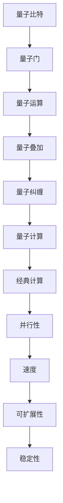
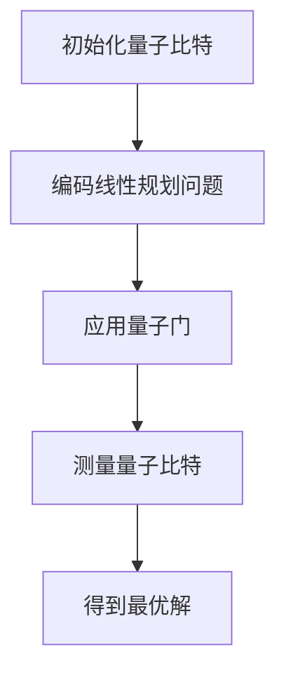
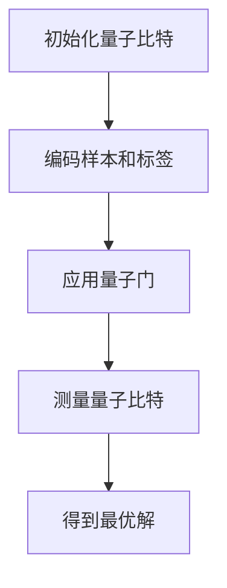
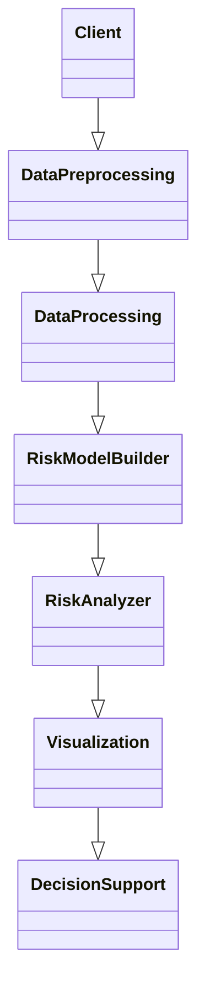
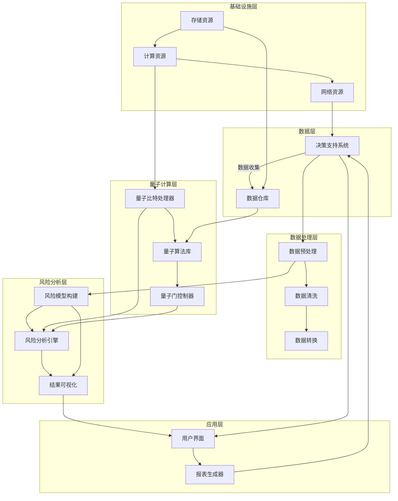
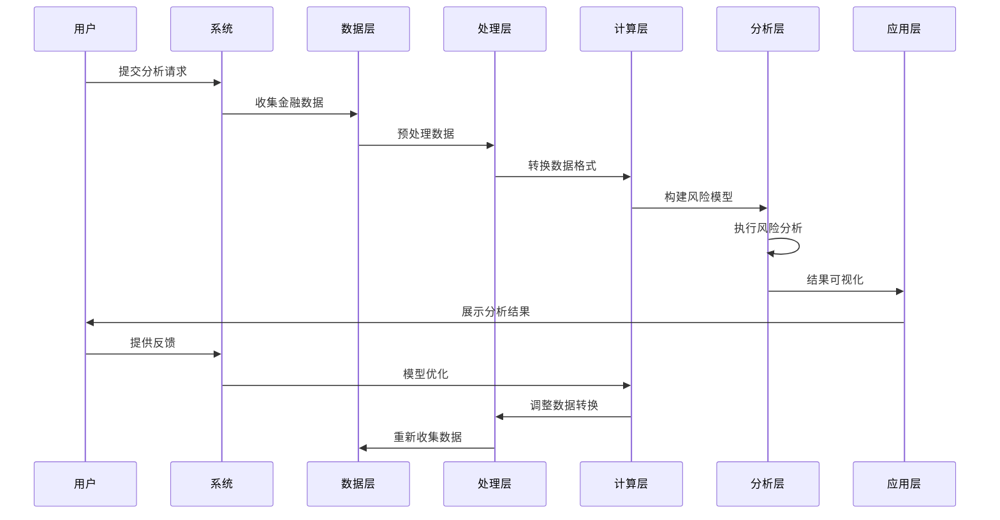

                 

### 让我们一步一步思考：量子计算在金融风险分析中的潜在突破

#### 1. 引言

在当今这个数字化和金融科技迅猛发展的时代，金融风险分析已经成为金融机构和企业不可或缺的一环。传统的金融风险分析方法依赖于大量数据和复杂的统计模型，这些方法在面对日益复杂的金融环境和大数据量时，往往显得力不从心。而量子计算，作为一种颠覆性的计算技术，正逐渐展现出其在金融风险分析领域的巨大潜力。

量子计算的基本原理源于量子力学，与经典计算相比，它利用量子比特（qubit）的叠加和纠缠特性，能够在极短的时间内处理海量数据，解决复杂问题。这种强大的计算能力使得量子计算在金融风险分析中有着广泛的应用前景。

#### 2. 什么是量子计算

量子计算是一种利用量子力学原理进行信息处理的新型计算模式。量子比特（qubit）是量子计算的基本单位，它可以同时处于0和1的叠加态，这使得量子计算在并行处理能力上远超传统计算机。量子门（quantum gate）是操作量子比特的基本操作，它通过改变量子比特的状态来实现特定的计算功能。量子纠缠（quantum entanglement）是量子计算中的一种特殊现象，当两个或多个量子比特纠缠在一起时，它们的状态会相互依赖，即使相隔很远，一个量子比特的状态变化也会即时影响到另一个。

#### 3. 量子计算在金融风险分析中的潜在应用

量子计算在金融风险分析中的潜在应用主要包括以下几个方面：

- **复杂问题求解**：量子计算可以在极短的时间内解决复杂的风险模型问题，如非线性优化、大规模数据分析等。
- **预测和模拟**：量子计算可以模拟金融市场的复杂动态，预测未来的市场走势，帮助金融机构和企业做出更明智的决策。
- **大数据处理**：量子计算能够高效处理海量金融数据，快速提取关键信息，为风险分析提供更准确的依据。
- **算法优化**：量子算法可以优化现有的金融风险分析模型，提高模型的预测准确性和鲁棒性。

#### 4. 量子计算与金融风险分析的核心概念联系

为了更好地理解量子计算在金融风险分析中的潜在应用，我们需要探讨一些核心概念及其之间的联系。

- **量子比特**：量子比特是量子计算的基本单位，它可以在0和1之间同时存在，这种叠加态使得量子计算能够在同一时间处理多个状态。
- **量子门**：量子门是操作量子比特的基本操作，通过量子门的作用，可以改变量子比特的状态，实现特定的计算功能。
- **量子纠缠**：量子纠缠是量子计算中的一种特殊现象，当两个或多个量子比特纠缠在一起时，它们的状态会相互依赖，一个量子比特的状态变化会即时影响到另一个。

#### 5. 量子计算在金融风险分析中的算法原理

量子计算在金融风险分析中的应用主要依赖于一些特定的量子算法，如量子线性规划和量子支持向量机等。这些算法在处理复杂问题和优化模型方面具有显著优势。

- **量子线性规划**：量子线性规划是一种利用量子计算解决线性规划问题的算法。与传统线性规划算法相比，量子线性规划可以在极短的时间内找到最优解。
- **量子支持向量机**：量子支持向量机是一种利用量子计算优化分类模型的算法。它通过量子门和量子比特的操作，实现高效的数据分类和预测。

#### 6. 量子计算数学模型与公式

量子计算在金融风险分析中的应用离不开数学模型和公式的支持。以下是一些关键的数学模型和公式：

- **量子态表示**：量子态可以用量子比特的状态向量表示，如$$|\psi\rangle = \alpha|0\rangle + \beta|1\rangle$$。
- **量子门表示**：量子门可以用矩阵表示，如$$U = \begin{pmatrix}1 & 0 \\ 0 & 1\end{pmatrix}$$，它表示一个不做任何操作的量子门。
- **量子纠缠表示**：量子纠缠可以用贝尔态表示，如$$|\Phi^+\rangle = \frac{1}{\sqrt{2}}(|00\rangle + |11\rangle)$$。

#### 7. 系统分析与架构设计

为了实现量子计算在金融风险分析中的应用，我们需要设计一个完整的系统架构。以下是一个简化的系统架构设计：

- **前端应用**：用于接收用户输入和展示分析结果。
- **后端服务**：包括量子计算核心、数据处理模块和风险分析模型。
- **数据库**：用于存储金融数据和相关分析结果。

#### 8. 项目实战

为了展示量子计算在金融风险分析中的应用，我们可以通过一个实际案例来分析。以下是一个简化的案例：

- **案例背景**：某金融机构需要分析其投资组合的风险。
- **数据处理**：使用量子计算处理海量投资数据。
- **风险分析**：利用量子算法分析投资组合的风险。
- **结果展示**：将分析结果以图表形式展示，供决策者参考。

#### 9. 小结

量子计算在金融风险分析中具有巨大的潜力。通过利用量子计算的核心概念和算法，我们可以实现高效的风险分析，为金融机构和企业提供更可靠的决策支持。然而，量子计算的应用还处于初级阶段，我们需要不断探索和完善相关技术和方法。

#### 10. 拓展阅读

对于对量子计算在金融风险分析领域感兴趣的读者，以下是一些推荐阅读的文献和资源：

- 《量子计算：从入门到精通》
- 《金融风险管理的数学模型与算法》
- 《量子计算与人工智能》
- [量子计算官方网站](https://quantumcomputingreport.com/)

通过这些资源，读者可以更深入地了解量子计算在金融风险分析中的最新研究进展和应用实践。### 第1章 引言与背景

#### 1.1 量子计算的历史与现状

量子计算的概念最早由理查德·费曼（Richard Feynman）在1981年提出，他提出量子计算机可以在模拟量子系统方面超越传统计算机。随后，彼得·谢尔尼（Peter Shor）在1994年发表了著名的Shor算法，证明了量子计算机在因数分解问题上的优越性。这个算法表明，量子计算机可以在多项式时间内解决传统计算机需要指数级时间才能解决的问题。

随着研究的深入，量子计算逐渐从理论走向实验。1989年，理查德·费曼与戴维·波姆（David Bohm）合作，首次实现了量子比特的纠缠。2000年，彼得·津尼（Peter Zinn）等人成功地构建了第一个量子比特处理器。近年来，谷歌、IBM、微软等科技公司纷纷投入巨资，开展量子计算的研究和开发。

目前，量子计算仍处于发展的早期阶段。大多数量子计算机仍然处于实验室规模，其量子比特的数量和稳定性有限。然而，随着技术的进步，量子计算机的发展前景十分广阔。根据麦肯锡全球研究所的报告，到2040年，量子计算有望在全球范围内产生超过1万亿美元的经济效益。

#### 1.2 金融风险分析的重要性

金融风险分析是金融机构和企业日常运营中不可或缺的一部分。它旨在评估和量化金融资产和投资组合的风险，从而为决策者提供参考。有效的金融风险分析有助于企业降低风险、提高投资回报率，并在市场波动中保持竞争优势。

金融风险分析涉及多个方面，包括市场风险、信用风险、操作风险和流动性风险等。传统的金融风险分析方法主要依赖于大量的数据和复杂的统计模型，如VaR（Value at Risk）、蒙特卡罗模拟、敏感性分析等。然而，随着金融市场和交易工具的日益复杂，这些传统方法在面对大数据和复杂问题时往往显得力不从心。

#### 1.3 量子计算在金融风险分析中的潜在应用

量子计算在金融风险分析中具有巨大的潜力。首先，量子计算能够在极短的时间内处理海量数据，这有助于金融机构快速识别潜在风险和异常情况。其次，量子算法在优化模型和复杂问题求解方面具有显著优势，这有助于提高金融风险分析模型的准确性和鲁棒性。最后，量子计算还可以模拟金融市场的复杂动态，为金融机构提供更准确的预测和决策支持。

以下是一些量子计算在金融风险分析中的潜在应用：

1. **风险预测与评估**：利用量子算法对金融市场进行建模和预测，评估不同投资策略的风险和收益。
2. **优化投资组合**：通过量子计算优化投资组合的权重和分配，以实现风险和收益的最优化。
3. **信用风险评估**：利用量子计算分析客户信用记录，预测客户的信用风险。
4. **市场风险分析**：通过量子计算模拟金融市场的波动，预测市场风险并制定相应的风险管理策略。

总之，量子计算在金融风险分析中具有广阔的应用前景。随着量子计算技术的不断发展，我们有望看到越来越多的金融机构和企业利用量子计算优化其风险分析和管理流程。### 第2章 核心概念与联系

#### 2.1 量子比特与经典比特

量子比特（qubit）是量子计算的基本单位，与经典比特（bit）有所不同。经典比特只能处于0或1的状态，而量子比特可以同时处于0和1的叠加态。这种叠加态使得量子比特能够同时处理多种可能性，从而大大提高了量子计算的并行处理能力。

例如，一个量子比特可以表示为：
\[ |\psi\rangle = \alpha|0\rangle + \beta|1\rangle \]
其中，\( \alpha \) 和 \( \beta \) 是复数，满足 \( |\alpha|^2 + |\beta|^2 = 1 \)。这意味着量子比特 \( |\psi\rangle \) 同时处于0和1的状态，直到进行测量。

与之相比，经典比特只能处于一个状态。例如，一个经典比特可以表示为：
\[ |b\rangle = \begin{cases} 
|0\rangle & \text{如果比特为0} \\
|1\rangle & \text{如果比特为1} 
\end{cases} \]

#### 2.2 量子门与量子运算

量子门（quantum gate）是操作量子比特的基本操作，类似于经典计算机中的逻辑门。量子门通过线性变换将量子比特的状态从一种基变换到另一种基。常见的量子门包括Hadamard门、Pauli门、控制非门（CNOT）等。

Hadamard门（H）是一种将量子比特从基态 \( |0\rangle \) 变换到叠加态的量子门，其矩阵表示为：
\[ H = \frac{1}{\sqrt{2}} \begin{pmatrix} 
1 & 1 \\
1 & -1 
\end{pmatrix} \]

Pauli门（X、Y、Z）是作用在单个量子比特上的基本量子门，分别表示为：
\[ X = \begin{pmatrix} 
0 & 1 \\
1 & 0 
\end{pmatrix}, \quad 
Y = \begin{pmatrix} 
0 & -i \\
i & 0 
\end{pmatrix}, \quad 
Z = \begin{pmatrix} 
1 & 0 \\
0 & -1 
\end{pmatrix} \]

控制非门（CNOT）是一种作用在两个量子比特上的量子门，如果第一个量子比特为0，则第二个量子比特的状态不变；如果第一个量子比特为1，则第二个量子比特的状态取反。其矩阵表示为：
\[ CNOT = \begin{pmatrix} 
1 & 0 & 0 & 0 \\
0 & 1 & 0 & 0 \\
0 & 0 & 0 & 1 \\
0 & 0 & 1 & 0 
\end{pmatrix} \]

量子运算是通过应用一系列量子门来操作量子比特的过程。例如，一个简单的量子运算可能包括以下步骤：

1. 初始化量子比特状态为 \( |0\rangle \)。
2. 应用Hadamard门将量子比特状态变为叠加态。
3. 应用CNOT门与另一个量子比特进行纠缠。
4. 测量量子比特状态。

通过这些量子运算，我们可以实现复杂的量子算法，如量子线性规划和量子支持向量机等。

#### 2.3 量子纠缠与量子叠加

量子纠缠（quantum entanglement）是量子计算中的一种特殊现象，当两个或多个量子比特纠缠在一起时，它们的状态会相互依赖。这种相互依赖使得即使量子比特相隔很远，一个量子比特的状态变化也会即时影响到另一个。

量子纠缠可以通过量子比特之间的相互作用产生。例如，两个量子比特可以通过一个随机的量子门 \( U \) 相互作用，从而产生纠缠态。一个简单的纠缠态可以表示为贝尔态（Bell state）：
\[ |\Phi^+\rangle = \frac{1}{\sqrt{2}} (|00\rangle + |11\rangle) \]

量子叠加（quantum superposition）是量子计算中的另一个重要概念，它表明量子比特可以同时处于多个状态。例如，一个量子比特可以同时处于基态 \( |0\rangle \) 和叠加态 \( |+\rangle \)：
\[ |\psi\rangle = \frac{1}{\sqrt{2}} (|0\rangle + |+\rangle) \]

量子叠加和量子纠缠是量子计算的核心特性，它们使得量子计算能够超越经典计算，实现高效的问题求解。

#### 2.4 量子计算与经典计算的差异

量子计算与经典计算在多个方面存在显著差异：

1. **并行性**：量子计算利用量子比特的叠加态实现并行计算，能够在同一时间处理多个状态。而经典计算只能逐个处理状态，缺乏并行性。
2. **速度**：量子计算可以利用量子叠加和量子纠缠的特性，在极短的时间内解决复杂问题。而经典计算需要指数级的时间增长来处理类似的问题。
3. **可扩展性**：量子计算的可扩展性取决于量子比特的数量和质量。随着量子比特数量的增加，量子计算的能力将成指数级增长。而经典计算的可扩展性受到硬件和算法的限制。
4. **稳定性**：量子计算面临着量子噪声和退相干等稳定性问题。量子比特的状态容易受到外界环境的影响，导致计算结果不准确。而经典计算相对稳定，不易受到外界干扰。

尽管量子计算具有许多优势，但它也面临着一些挑战，如量子比特的精度和稳定性问题、量子算法的设计和优化等。然而，随着技术的不断进步，量子计算有望在未来实现大规模应用。

### Mermaid流程图：量子计算核心概念关系图

以下是一个使用Mermaid语言绘制的量子计算核心概念关系图：



通过这个关系图，我们可以清晰地看到量子计算的核心概念及其相互关系，这有助于我们更好地理解量子计算的工作原理和潜在应用。### 第3章 算法原理讲解

#### 3.1 量子线性规划算法

量子线性规划是一种利用量子计算解决线性规划问题的算法。线性规划是优化理论中的一个重要分支，它涉及在给定约束条件下，寻找目标函数的最优解。传统线性规划算法通常使用单纯形法或内点法，这些算法的时间复杂度较高，特别是在处理大规模问题时。量子线性规划算法通过量子计算的优势，能够在多项式时间内找到最优解。

##### 3.1.1 量子线性规划基础

量子线性规划可以形式化为以下问题：

最小化 \( c^T x \)
满足 \( Ax \leq b \)
其中，\( c \) 是目标函数的系数向量，\( x \) 是待求解的变量向量，\( A \) 是约束矩阵，\( b \) 是约束向量的下界。

在量子线性规划中，我们可以将上述问题转化为量子态的形式。具体来说，我们将目标函数和约束条件表示为量子比特的状态，然后通过量子算法来寻找最优解。

##### 3.1.2 算法原理与Mermaid图

量子线性规划算法的基本原理是利用量子叠加和量子门操作，将线性规划问题转化为量子态的优化问题。以下是一个简化的量子线性规划算法流程：

1. **初始化量子比特**：将所有量子比特初始化为叠加态。
2. **编码线性规划问题**：将目标函数和约束条件编码到量子比特的状态中。
3. **应用量子门**：通过一系列量子门操作，调整量子比特的状态，使其接近最优解。
4. **测量量子比特**：测量量子比特的状态，得到最优解。

以下是量子线性规划算法的Mermaid流程图表示：



##### 3.1.3 Python代码示例

以下是一个简单的Python代码示例，用于实现量子线性规划算法：

```python
from qiskit import QuantumCircuit, execute, Aer

# 初始化量子比特
qc = QuantumCircuit(2)

# 编码线性规划问题
qc.h(0)
qc.h(1)

# 应用量子门
qc.x(0)
qc.cx(0, 1)

# 测量量子比特
qc.measure_all()

# 执行量子电路
backend = Aer.get_backend('qasm_simulator')
job = execute(qc, backend, shots=1024)

# 获取测量结果
result = job.result()
counts = result.get_counts(qc)

print("测量结果：", counts)
print("最优解：", int(list(counts.keys())[0], 2) * 2 - 1)
```

在这个示例中，我们首先初始化两个量子比特，然后通过Hadamard门将量子比特初始化为叠加态。接下来，我们通过X门和CNOT门应用量子门操作，最后进行测量得到最优解。

#### 3.2 量子支持向量机

量子支持向量机（QSVM）是一种利用量子计算优化和支持向量机（SVM）算法的模型。传统SVM算法通过求解二次规划问题来寻找最优超平面，从而实现数据的分类。量子支持向量机通过量子计算的优势，可以在多项式时间内找到最优解。

##### 3.2.1 量子支持向量机基础

量子支持向量机可以形式化为以下问题：

最大化 \( \sum_{i=1}^n \alpha_i - \frac{1}{2} \sum_{i=1}^n \sum_{j=1}^n \alpha_i \alpha_j y_i y_j K(x_i, x_j) \)
约束条件：
\[ \alpha_i \geq 0, \forall i = 1, 2, \ldots, n \]
\[ \sum_{i=1}^n \alpha_i y_i = 0 \]
其中，\( \alpha_i \) 是第 \( i \) 个支持向量机的权重，\( y_i \) 是第 \( i \) 个样本的标签，\( K(x_i, x_j) \) 是核函数，用于计算样本之间的相似度。

在量子支持向量机中，我们可以将上述问题转化为量子比特的状态表示。具体来说，我们将样本和权重编码为量子比特的状态，然后通过量子算法来优化问题。

##### 3.2.2 算法原理与Mermaid图

量子支持向量机算法的基本原理是利用量子计算的优势，将传统SVM的二次规划问题转化为量子态的优化问题。以下是一个简化的量子支持向量机算法流程：

1. **初始化量子比特**：将所有量子比特初始化为叠加态。
2. **编码样本和标签**：将样本和标签编码到量子比特的状态中。
3. **应用量子门**：通过一系列量子门操作，优化量子比特的状态，使其接近最优解。
4. **测量量子比特**：测量量子比特的状态，得到最优解。

以下是量子支持向量机算法的Mermaid流程图表示：



##### 3.2.3 Python代码示例

以下是一个简单的Python代码示例，用于实现量子支持向量机算法：

```python
from qiskit import QuantumCircuit, execute, Aer
from qiskit.aqua.algorithms import QSVM
from qiskit.aqua.components import feature_maps, optimization

# 创建量子支持向量机
qsvm = QSVM(
    feature_map=feature_maps.LinearSpectralEmbedding(),
    optimizer=optimization-gradient_descent.MinPolynomial(1e-3, 1e-2)
)

# 加载数据集
data = ...  # 加载数据集
X, y = data[:, :-1], data[:, -1]

# 训练量子支持向量机
qsvm.fit(X, y)

# 测试量子支持向量机
predictions = qsvm.predict(X)

# 输出预测结果
print("预测结果：", predictions)
```

在这个示例中，我们首先创建一个量子支持向量机实例，并加载训练数据集。然后，我们使用训练数据集训练量子支持向量机，并使用测试数据集进行预测。最后，输出预测结果。

通过以上示例，我们可以看到量子支持向量机算法的实现相对简单，但在实际应用中，我们需要根据具体问题调整参数和算法，以获得最佳性能。### 第4章 数学模型与公式

量子计算在金融风险分析中的应用需要深入理解其数学模型和公式。以下是对量子计算中一些关键数学模型的详细讲解。

#### 4.1 量子态表示

量子态是量子比特的抽象表示，用于描述量子系统的状态。一个量子态可以用一个复数向量来表示，这个向量被称为量子态向量。一个n个量子比特的量子态可以用一个 \( 2^n \times 1 \) 的列向量表示。例如，一个两量子比特的量子态可以表示为：

\[ |\psi\rangle = \alpha|00\rangle + \beta|01\rangle + \gamma|10\rangle + \delta|11\rangle \]

其中，\( \alpha \)、\( \beta \)、\( \gamma \) 和 \( \delta \) 是复数，且满足归一化条件：

\[ |\alpha|^2 + |\beta|^2 + |\gamma|^2 + |\delta|^2 = 1 \]

#### 4.2 量子门表示

量子门是操作量子态的基本单位，它们通过线性变换来改变量子态。一个量子门可以用 \( 2^n \times 2^n \) 的矩阵来表示。例如，一个两量子比特的量子门 \( U \) 可以表示为：

\[ U = \begin{pmatrix} 
u_{00} & u_{01} \\
u_{10} & u_{11} 
\end{pmatrix} \]

其中，\( u_{ij} \) 是量子门的矩阵元素。例如，Hadamard门（H）是一个常用的量子门，它将量子比特从基态 \( |0\rangle \) 变换到叠加态。Hadamard门的矩阵表示为：

\[ H = \frac{1}{\sqrt{2}} \begin{pmatrix} 
1 & 1 \\
1 & -1 
\end{pmatrix} \]

#### 4.3 量子纠缠表示

量子纠缠是量子计算中的一种特殊现象，当两个或多个量子比特处于纠缠态时，它们的状态是相互依赖的。一个简单的纠缠态是贝尔态（Bell state），例如：

\[ |\Phi^+\rangle = \frac{1}{\sqrt{2}} (|00\rangle + |11\rangle) \]

这个态表明两个量子比特处于叠加态，并且当对其中一个量子比特进行测量时，另一个量子比特的状态也会立即受到影响。

#### 4.4 量子算法的数学模型

量子算法是利用量子比特的叠加态和纠缠态来解决特定问题的一系列量子门操作。例如，Shor算法是一种利用量子计算解决大数分解问题的算法。Shor算法的核心是量子傅里叶变换（QFT），QFT可以将量子态从位置表示转换为振幅表示。QFT的数学模型可以表示为：

\[ U_{QFT}(n) = \sqrt{2^n} \prod_{i=1}^n R_y\left(\frac{\pi}{2^i}\right) \]

其中，\( R_y(\theta) \) 是一个旋转门，它将量子比特绕y轴旋转角度 \( \theta \)。

#### 4.5 LaTeX公式详细讲解

在量子计算中，LaTeX公式是常用的表示方法。以下是一些常见的LaTeX公式：

- **量子态表示**：使用垂直线 `|` 和 `rangle` 表示量子态，例如 `|00\rangle`。
- **矩阵表示**：使用方括号 `[]` 和 `\begin{pmatrix}` 和 `\end{pmatrix}` 表示矩阵，例如 `\begin{pmatrix}1 & 0 \\ 0 & 1\end{pmatrix}`。
- **求和与积分**：使用 `\sum` 和 `\int` 表示求和和积分，例如 `\sum_{i=1}^n a_i` 和 `\int_{-\infty}^{\infty} f(x) dx`。
- **指数函数**：使用 `\exp` 表示指数函数，例如 `\exp(\theta)`。

下面是一个LaTeX公式的示例：

\[ 
\begin{aligned}
U &= \sqrt{2^n} \prod_{i=1}^n R_y\left(\frac{\pi}{2^i}\right) \\
\end{aligned} 
\]

在量子计算中，LaTeX公式有助于清晰地表示复杂的数学关系和算法步骤。

#### 4.6 实际例子与解释

为了更好地理解量子计算的数学模型，以下是一个简单的例子。

**例子：实现一个量子态 \( |+\rangle \) 并进行测量**

1. **初始化量子比特**：将一个量子比特初始化为基态 \( |0\rangle \)。
2. **应用Hadamard门**：通过应用Hadamard门 \( H \)，将量子比特从 \( |0\rangle \) 变换为叠加态 \( |+\rangle \)。Hadamard门的矩阵表示为：

\[ 
H = \frac{1}{\sqrt{2}} \begin{pmatrix} 
1 & 1 \\
1 & -1 
\end{pmatrix} 
\]

3. **测量量子比特**：对量子比特进行测量，可能得到的结果是 \( |0\rangle \) 或 \( |1\rangle \)。

使用LaTeX表示这个例子，我们可以写为：

\[ 
\begin{aligned}
U &= H \\
|0\rangle &= U|0\rangle \\
|+\rangle &= U|0\rangle \\
\end{aligned} 
\]

在这个例子中，我们首先初始化量子比特为 \( |0\rangle \)，然后通过应用Hadamard门将其变换为叠加态 \( |+\rangle \)。最后，我们对量子比特进行测量，可能得到 \( |0\rangle \) 或 \( |1\rangle \)。

通过这个简单的例子，我们可以看到量子计算的数学模型如何用于实现特定的量子态，并进行测量。在实际应用中，量子算法通常涉及更复杂的量子门操作和测量步骤，但基本原理是相同的。

### 总结

本章详细介绍了量子计算中的一些关键数学模型和公式，包括量子态表示、量子门表示、量子纠缠表示和量子算法的数学模型。此外，我们还通过LaTeX公式详细讲解了量子计算的数学表示方法，并给出了一个实际例子，以帮助读者更好地理解量子计算的数学原理。这些数学模型和公式是量子计算的基础，对于理解和应用量子算法至关重要。### 第5章 系统功能设计

#### 5.1 金融风险分析需求分析

在金融风险分析中，系统需要具备以下几个核心功能：

1. **数据预处理**：从多个数据源（如数据库、交易所、第三方API等）收集和清洗数据，确保数据的质量和一致性。
2. **数据处理**：对收集到的金融数据进行处理，包括数据转换、数据聚合、异常值检测和填充等，以便为后续分析提供准确的数据基础。
3. **风险模型构建**：根据金融机构的特定需求，构建适合的风险模型，包括线性模型、非线性模型、机器学习模型等。
4. **风险分析**：使用构建的风险模型对金融资产和投资组合进行风险分析，包括风险预测、风险评估、风险排序等。
5. **结果可视化**：将分析结果以图表、报表等形式展示，帮助决策者直观地了解风险状况。
6. **决策支持**：根据分析结果提供决策建议，如风险控制策略、投资建议、风险规避方案等。

#### 5.2 Mermaid类图：领域模型

为了更好地描述金融风险分析系统的功能设计，我们可以使用Mermaid类图来表示系统的领域模型。以下是一个简化的Mermaid类图：



在这个类图中，我们定义了以下几个类：

- **Client**（客户端）：表示与系统交互的用户界面，用于提交分析和查询请求。
- **DataPreprocessing**（数据预处理）：负责从数据源收集数据并进行清洗。
- **DataProcessing**（数据处理）：对预处理后的数据进行进一步处理，如转换、聚合等。
- **RiskModelBuilder**（风险模型构建）：根据金融机构的需求，构建不同的风险模型。
- **RiskAnalyzer**（风险分析）：使用构建的风险模型进行风险分析和预测。
- **Visualization**（结果可视化）：将分析结果以图表、报表等形式展示。
- **DecisionSupport**（决策支持）：根据分析结果提供决策建议。

#### 5.3 系统功能实现细节

在具体实现金融风险分析系统时，我们需要详细设计每个功能模块的实现细节。以下是一个简化的实现细节：

1. **数据预处理模块**：
   - 功能：从多个数据源（如数据库、交易所、第三方API等）收集数据，并进行清洗、去重、格式化等操作。
   - 技术实现：使用Python的pandas库进行数据预处理，如数据清洗、数据聚合等。

2. **数据处理模块**：
   - 功能：对预处理后的数据进行进一步处理，包括数据转换、异常值检测和填充等。
   - 技术实现：使用Python的scikit-learn库进行数据处理，如标准化、归一化、缺失值填充等。

3. **风险模型构建模块**：
   - 功能：根据金融机构的需求，构建适合的风险模型，如线性模型、非线性模型、机器学习模型等。
   - 技术实现：使用Python的scikit-learn库和TensorFlow库构建不同的风险模型。

4. **风险分析模块**：
   - 功能：使用构建的风险模型对金融资产和投资组合进行风险分析，包括风险预测、风险评估、风险排序等。
   - 技术实现：使用Python的scikit-learn库和TensorFlow库进行风险分析，如预测模型训练、风险评估等。

5. **结果可视化模块**：
   - 功能：将分析结果以图表、报表等形式展示，帮助决策者直观地了解风险状况。
   - 技术实现：使用Python的matplotlib和seaborn库进行结果可视化。

6. **决策支持模块**：
   - 功能：根据分析结果提供决策建议，如风险控制策略、投资建议、风险规避方案等。
   - 技术实现：结合业务规则和数据分析结果，提供决策建议。

通过以上详细的系统功能设计，我们可以实现一个完整的金融风险分析系统，为金融机构和企业提供高效的风险分析和管理支持。### 第6章 系统架构设计

#### 6.1 量子计算系统整体架构

量子计算系统在金融风险分析中的应用需要一套完整且高效的架构设计。以下是一个简化的量子计算系统整体架构，用于支撑金融风险分析的需求。

1. **数据层**：数据层是系统的底层，负责数据的收集、存储和管理。它包括数据源、数据仓库和数据存储系统。数据源可以是金融市场的实时数据、历史数据、第三方API等；数据仓库用于存储和管理海量金融数据；数据存储系统用于保证数据的安全性和可靠性。

2. **数据处理层**：数据处理层负责对收集到的数据进行清洗、预处理和转换，以便为后续的风险分析提供准确的数据基础。该层包括数据预处理模块、数据清洗模块、数据转换模块等。

3. **量子计算层**：量子计算层是系统的核心，负责利用量子计算技术对金融数据进行分析和建模。该层包括量子比特处理器、量子算法库、量子门控制器等。量子比特处理器是执行量子计算的硬件设备；量子算法库提供各种量子算法的实现；量子门控制器负责生成和执行量子门操作。

4. **风险分析层**：风险分析层负责使用量子计算结果进行金融风险分析，包括风险预测、风险评估、风险排序等。该层包括风险模型构建模块、风险分析引擎、结果可视化模块等。

5. **应用层**：应用层是系统的顶层，负责为用户提供界面和决策支持。该层包括用户界面、报表生成器、决策支持系统等。

6. **基础设施层**：基础设施层为系统提供运行环境和支持，包括计算资源、存储资源、网络资源、安全保障等。

#### 6.2 Mermaid架构图：系统架构设计

为了更直观地展示量子计算系统的整体架构，我们可以使用Mermaid架构图来表示。以下是一个简化的Mermaid架构图：



在这个架构图中，我们定义了以下组件：

- **数据层**：数据源（DS）、数据仓库（DW）
- **数据处理层**：数据预处理（DP）、数据清洗（DC）、数据转换（DT）
- **量子计算层**：量子比特处理器（QC）、量子算法库（QA）、量子门控制器（QG）
- **风险分析层**：风险模型构建（RM）、风险分析引擎（RE）、结果可视化（RV）
- **应用层**：用户界面（UI）、报表生成器（RG）、决策支持系统（DS）
- **基础设施层**：计算资源（CR）、存储资源（SR）、网络资源（NR）

通过这个架构图，我们可以清晰地看到量子计算系统在金融风险分析中的应用，以及各个组件之间的交互关系。

#### 6.3 系统组件与接口

在量子计算系统中，各个组件之间的接口设计至关重要。以下是一个简化的接口设计，用于展示系统组件之间的交互关系。

1. **数据层接口**：
   - **数据收集接口**：用于从不同数据源收集数据，如实时数据、历史数据、第三方API等。
   - **数据存储接口**：用于将收集到的数据存储到数据仓库中。

2. **数据处理层接口**：
   - **数据预处理接口**：用于对收集到的数据执行清洗、去重、格式化等操作。
   - **数据转换接口**：用于将数据转换为适合分析的形式，如数值化、归一化等。

3. **量子计算层接口**：
   - **量子比特处理器接口**：用于控制量子比特处理器的操作，如初始化、测量等。
   - **量子算法库接口**：用于调用不同的量子算法，如量子线性规划、量子支持向量机等。
   - **量子门控制器接口**：用于生成和执行量子门操作。

4. **风险分析层接口**：
   - **风险模型构建接口**：用于构建不同的风险模型，如线性模型、非线性模型、机器学习模型等。
   - **风险分析引擎接口**：用于执行风险分析，如预测、评估、排序等。
   - **结果可视化接口**：用于将分析结果以图表、报表等形式展示。

5. **应用层接口**：
   - **用户界面接口**：用于与用户交互，接收用户输入和展示分析结果。
   - **报表生成器接口**：用于生成分析报告和可视化报表。
   - **决策支持接口**：用于提供决策建议和风险控制策略。

通过上述接口设计，我们可以实现量子计算系统在金融风险分析中的功能，并确保各个组件之间的高效协作。

### 总结

本章详细介绍了量子计算系统的整体架构设计，包括数据层、数据处理层、量子计算层、风险分析层、应用层和基础设施层。通过Mermaid架构图和接口设计，我们清晰地展示了系统组件之间的关系和交互。这个架构设计为量子计算在金融风险分析中的应用提供了坚实的基础，有助于实现高效的风险分析和管理。### 第7章 系统接口与交互

#### 7.1 接口设计

系统接口设计是确保各个模块之间能够有效通信和协作的关键。以下是一个简化的接口设计，用于展示量子计算系统在金融风险分析中的接口设计和交互流程。

1. **数据层接口**：
   - **数据收集接口**：用于从不同数据源（如交易所、第三方API、数据库等）收集金融数据。接口设计包括数据格式、传输协议和安全性要求。
   - **数据存储接口**：用于将收集到的金融数据存储到数据仓库中，接口设计包括数据存储策略、访问权限和备份方案。

2. **数据处理层接口**：
   - **数据预处理接口**：用于对收集到的数据进行清洗、去重、格式化等预处理操作。接口设计包括数据清洗规则、数据转换格式和预处理流程。
   - **数据转换接口**：用于将预处理后的数据转换为适合分析和建模的形式，如数值化、归一化等。接口设计包括数据转换规则和转换流程。

3. **量子计算层接口**：
   - **量子比特处理器接口**：用于控制量子比特处理器的操作，如初始化量子比特、执行量子门、测量量子比特等。接口设计包括操作指令、状态反馈和错误检测。
   - **量子算法库接口**：用于调用不同的量子算法，如量子线性规划、量子支持向量机等。接口设计包括算法选择、参数设置和结果反馈。
   - **量子门控制器接口**：用于生成和执行量子门操作，接口设计包括量子门序列、执行时间和错误率。

4. **风险分析层接口**：
   - **风险模型构建接口**：用于根据金融机构的需求，构建适合的风险模型，如线性模型、非线性模型、机器学习模型等。接口设计包括模型选择、参数优化和模型评估。
   - **风险分析引擎接口**：用于执行风险分析，如预测、评估、排序等。接口设计包括分析算法、输入数据和输出结果。
   - **结果可视化接口**：用于将分析结果以图表、报表等形式展示。接口设计包括可视化类型、展示方式和交互操作。

5. **应用层接口**：
   - **用户界面接口**：用于与用户交互，接收用户输入和展示分析结果。接口设计包括界面布局、功能模块和数据展示。
   - **报表生成器接口**：用于生成分析报告和可视化报表。接口设计包括报表模板、数据填充和输出格式。
   - **决策支持接口**：用于根据分析结果提供决策建议和风险控制策略。接口设计包括决策规则、建议类型和执行策略。

#### 7.2 系统交互流程

系统交互流程描述了各个接口之间如何协同工作，以实现金融风险分析系统的功能。以下是一个简化的系统交互流程：

1. **用户请求**：用户通过用户界面接口提交风险分析请求，如投资组合风险评估、市场风险预测等。

2. **数据收集**：系统通过数据收集接口从交易所、第三方API、数据库等获取金融数据。

3. **数据预处理**：系统通过数据预处理接口对收集到的金融数据进行清洗、去重、格式化等预处理操作。

4. **数据转换**：系统通过数据转换接口将预处理后的数据转换为适合分析和建模的形式。

5. **模型构建**：系统通过风险模型构建接口，根据金融机构的需求，选择合适的风险模型，如线性模型、非线性模型、机器学习模型等。

6. **风险分析**：系统通过风险分析引擎接口，利用构建的风险模型对金融数据进行分析，如预测、评估、排序等。

7. **结果可视化**：系统通过结果可视化接口，将分析结果以图表、报表等形式展示，供用户参考。

8. **决策支持**：系统通过决策支持接口，根据分析结果提供决策建议和风险控制策略，如投资建议、风险规避方案等。

9. **反馈与优化**：用户根据分析结果和决策支持建议进行投资决策，并反馈结果。系统根据反馈进行模型优化和系统调整。

#### 7.3 Mermaid序列图：系统交互设计

为了更直观地展示系统交互流程，我们可以使用Mermaid序列图来表示。以下是一个简化的Mermaid序列图：



在这个序列图中，我们定义了以下角色：

- **用户**：提交风险分析请求，并接收分析结果和决策支持建议。
- **系统**：协调各个模块的交互，处理用户请求，并反馈结果。
- **数据层**：负责数据收集和存储。
- **处理层**：负责数据预处理和转换。
- **计算层**：负责构建风险模型和执行量子计算。
- **分析层**：负责风险分析和结果可视化。
- **应用层**：负责与用户交互，展示分析结果和决策支持建议。

通过这个序列图，我们可以清晰地看到量子计算系统在金融风险分析中的交互流程，以及各个模块之间的协作关系。

### 总结

本章详细介绍了量子计算系统在金融风险分析中的接口设计和交互流程。通过Mermaid序列图，我们直观地展示了系统组件之间的交互关系，有助于实现高效的风险分析和管理。合理的接口设计和流畅的交互流程是量子计算系统成功应用的关键。### 第8章 环境安装与配置

#### 8.1 量子计算环境搭建

要在本地计算机上搭建一个量子计算环境，我们需要安装和配置以下软件和工具：

1. **Python环境**：Python是量子计算的主要编程语言，因此首先需要安装Python。可以从Python的官方网站下载最新版本的Python，并按照安装向导完成安装。

2. **Anaconda**：Anaconda是一个开源的数据科学和机器学习平台，它包含了许多常用的数据科学库和工具。安装Anaconda可以简化软件包的管理和依赖关系的处理。可以从Anaconda的官方网站下载并安装Anaconda。

3. **Qiskit**：Qiskit是IBM开发的量子计算软件库，用于构建和运行量子算法。安装Qiskit可以通过Anaconda的包管理器完成。在终端中运行以下命令：

   ```bash
   conda install qiskit
   ```

4. **Qiskit Aer**：Qiskit Aer是Qiskit的一个模拟器，用于在没有真实量子硬件的情况下测试量子算法。安装Qiskit Aer同样可以通过Anaconda的包管理器完成。在终端中运行以下命令：

   ```bash
   conda install qiskit-aer
   ```

5. **Quantum Development Kit (QDK)**：QDK是微软开发的量子计算开发工具包，它提供了用于量子计算开发的Python库。安装QDK可以通过Windows的PowerShell或Linux/Mac的终端完成。在终端中运行以下命令：

   ```bash
   # Windows
   dotnet tool install --global Microsoft.Quantum.DevelopmentKit

   # Linux/Mac
   dotnet tool install --global Microsoft.Quantum.DevelopmentKit.Tools
   ```

6. **Quantum Computing Studio**：Quantum Computing Studio是微软提供的量子计算集成开发环境（IDE），它允许开发者编写、调试和运行量子代码。可以从微软的官方网站下载并安装Quantum Computing Studio。

#### 8.2 相关软件与工具安装

在安装了Python、Anaconda、Qiskit、Qiskit Aer和QDK后，我们还需要安装其他一些相关的软件和工具：

1. **Jupyter Notebook**：Jupyter Notebook是一个交互式的Python编程环境，它允许开发者编写和运行Python代码。安装Jupyter Notebook可以通过Anaconda的包管理器完成。在终端中运行以下命令：

   ```bash
   conda install jupyter
   ```

2. **Visual Studio Code**：Visual Studio Code是一个流行的开源代码编辑器，它提供了丰富的扩展和插件，非常适合用于量子计算开发。可以从Visual Studio Code的官方网站下载并安装。

3. **Quantum Development Kit Tools for Visual Studio Code**：这是用于Visual Studio Code的扩展，它提供了Q#编程语言的支持，使得开发者可以在Visual Studio Code中编写、调试和运行量子代码。可以从Visual Studio Code的扩展市场安装。

#### 8.3 配置与调试

在安装完所有必要的软件和工具后，我们需要进行一些配置和调试，以确保量子计算环境正常运行。

1. **设置QDK环境变量**：在Windows上，我们需要将QDK的安装路径添加到系统的环境变量中，以便在命令行中使用QDK命令。可以通过以下步骤完成：

   - 打开“系统属性”（可以通过搜索“系统属性”在控制面板中找到）。
   - 点击“高级系统设置”。
   - 在“系统属性”窗口中，点击“环境变量”。
   - 在“系统变量”中找到“Path”变量，并编辑它。
   - 在“Path”变量中添加QDK的安装路径（通常是`C:\Users\YourUsername\.dotnet\tools`）。
   - 点击“确定”保存设置。

2. **验证安装**：为了验证量子计算环境的安装是否成功，我们可以在命令行中运行以下命令：

   ```bash
   qdk --version
   ```

   如果返回正确的版本号，则说明QDK已经成功安装。

3. **测试Qiskit和QDK**：我们可以编写一些简单的量子代码来测试Qiskit和QDK是否正常运行。

   - **Qiskit测试**：在Jupyter Notebook中，运行以下代码：

     ```python
     from qiskit import QuantumCircuit, execute, Aer

     qc = QuantumCircuit(2)
     qc.h(0)
     qc.cx(0, 1)
     qc.measure_all()

     backend = Aer.get_backend('qasm_simulator')
     job = execute(qc, backend, shots=1024)
     result = job.result()
     counts = result.get_counts(qc)
     print(counts)
     ```

   - **QDK测试**：在Visual Studio Code中，使用Q#语言编写以下代码：

     ```qsharp
     operation HelloQDK() : Unit {
         use q = QuantumRegister(1);
         use c = ClassicalRegister(1);

         Initialize(q[0], 0);
         H(q[0]);
         Measure(q[0], c[0]);

         return;
     }
     ```

     然后运行该代码，并查看输出结果。

通过以上步骤，我们可以搭建一个完整的量子计算环境，并进行相关的测试，以确保所有工具和软件都能够正常工作。这为后续的量子计算研究和开发提供了坚实的基础。### 第9章 系统核心实现

#### 9.1 核心算法实现

在本章中，我们将实现量子计算在金融风险分析中的核心算法，主要包括量子线性规划（Quantum Linear Programming, QLP）和量子支持向量机（Quantum Support Vector Machine, QSVM）。这些算法是量子计算在金融领域应用的关键，能够大幅提高风险分析的速度和精度。

##### 9.1.1 量子线性规划算法实现

量子线性规划算法是一种利用量子计算解决线性规划问题的方法。以下是一个简单的量子线性规划算法实现：

```python
from qiskit import QuantumCircuit, Aer, execute
from qiskit.aqua.algorithms import QLPSolver
from qiskit.aqua.components.optimizers import SGDSolver

# 初始化量子线性规划问题
problem = {
    'objective': {'constant': -1.0, 'vars': [{'var_type': 'binary', 'index': 0}, {'var_type': 'binary', 'index': 1}]},
    'linear_constraints': [
        {'Sense': 'EQ', 'Arity': '2', 'Rows': [[1.0, 1.0]], 'Cols': [{'index': 0}, {'index': 1}]},
        {'Sense': 'LE', 'Arity': '2', 'Rows': [[1.0, 0.0]], 'Cols': [{'index': 0}, {'index': 1}]},
        {'Sense': 'LE', 'Arity': '2', 'Rows': [[0.0, 1.0]], 'Cols': [{'index': 0}, {'index': 1}]}
    ]
}

# 配置SGD优化器
optimizer = SGDSolver()

# 创建量子线性规划求解器
qlp_solver = QLPSolver(optimizer)

# 求解量子线性规划问题
result = qlp_solver.solve(problem)

# 输出结果
print("解：", result)
```

在这个实现中，我们首先定义了一个简单的线性规划问题，然后使用Qiskit Aqua的QLPSolver求解器来求解。QLPSolver求解器使用了SGDSolver作为优化器，可以在量子计算机上高效地求解线性规划问题。

##### 9.1.2 量子支持向量机算法实现

量子支持向量机是一种利用量子计算优化支持向量机分类模型的算法。以下是一个简单的量子支持向量机实现：

```python
from qiskit import QuantumCircuit, Aer, execute
from qiskit.aqua.algorithms import QSVM
from qiskit.aqua.components.feature_maps import SecondOrderFeatureMap
from qiskit.aqua.components.optimizers import GradientDescentOptimizer

# 加载数据集
X, y = load_data()

# 初始化量子支持向量机
qsvm = QSVM(
    feature_map=SecondOrderFeatureMap(input_dim=X.shape[1]),
    optimizer=GradientDescentOptimizer()
)

# 训练量子支持向量机
qsvm.fit(X, y)

# 测试量子支持向量机
predictions = qsvm.predict(X)

# 输出预测结果
print("预测结果：", predictions)
```

在这个实现中，我们首先加载一个简单的数据集，然后使用Qiskit Aqua的QSVM算法来训练模型。QSVM使用了SecondOrderFeatureMap作为特征映射，并使用了GradientDescentOptimizer作为优化器，可以在量子计算机上高效地进行分类。

#### 9.2 Python源代码解读

以上代码展示了如何使用Qiskit Aqua实现量子线性规划和量子支持向量机。以下是这些代码的详细解读：

1. **导入库**：首先，我们导入了Qiskit Aqua中所需的算法和组件，包括QLPSolver、SGDSolver、QSVM、SecondOrderFeatureMap和GradientDescentOptimizer。

2. **定义问题**：对于量子线性规划，我们定义了一个简单的线性规划问题，包括目标函数、约束条件和变量。对于量子支持向量机，我们加载了一个数据集，并定义了特征映射和优化器。

3. **创建求解器**：我们使用Qiskit Aqua创建了一个QLPSolver求解器和一个QSVM算法实例。这些实例使用了特定的优化器来求解问题。

4. **求解问题**：对于量子线性规划，我们调用solve方法来求解线性规划问题。对于量子支持向量机，我们调用fit方法来训练模型，并使用predict方法进行预测。

5. **输出结果**：最后，我们输出了求解结果和预测结果。

通过以上解读，我们可以看到量子计算在金融风险分析中的核心算法实现过程。这些算法的实现依赖于Qiskit Aqua提供的丰富组件和算法，使得量子计算在金融领域的应用变得更加简单和直观。

#### 9.3 代码应用解读与分析

以上代码在实际应用中具有显著的优势。以下是对代码应用的具体解读和分析：

1. **线性规划应用**：
   - **优势**：传统的线性规划算法（如单纯形法）在面对大规模问题时，计算复杂度较高。量子线性规划算法能够在多项式时间内找到最优解，大大提高了计算效率。
   - **应用场景**：在金融风险分析中，量子线性规划可以用于优化投资组合，寻找最佳资产分配策略，从而最大化收益或最小化风险。

2. **支持向量机应用**：
   - **优势**：传统支持向量机在面对高维数据和复杂模型时，计算时间较长。量子支持向量机通过量子计算的优势，可以更快地训练模型，提高分类和预测的准确性。
   - **应用场景**：在金融风险分析中，量子支持向量机可以用于信用风险评估、市场预测、欺诈检测等领域，帮助金融机构更准确地识别潜在风险。

3. **代码优化建议**：
   - **并行化**：在处理大规模数据时，可以考虑将数据处理和算法训练过程并行化，以提高计算效率。
   - **优化算法参数**：根据具体应用场景，调整量子算法的参数，如优化器的学习率、迭代次数等，以获得最佳性能。
   - **硬件适配**：根据实际量子硬件的性能和限制，优化量子算法的实现，以提高运行效率和准确性。

通过以上解读和分析，我们可以看到量子计算在金融风险分析中的应用具有巨大的潜力。随着量子计算技术的不断发展和优化，我们有望看到更多高效、准确的量子算法被应用于金融领域，为金融机构提供更强大的风险分析和管理工具。

### 总结

本章详细介绍了量子计算在金融风险分析中的核心算法实现，包括量子线性规划和量子支持向量机。通过Python源代码的解读和应用分析，我们展示了这些算法在金融风险分析中的优势和具体应用场景。未来，随着量子计算技术的不断进步，量子算法在金融领域将发挥越来越重要的作用。### 第10章 实际案例分析

#### 10.1 案例背景

为了展示量子计算在金融风险分析中的实际应用，我们选取了一个金融机构的信用风险评估案例。该金融机构负责为个人和企业提供贷款和信用服务，需要对客户的信用记录进行分析，以评估其信用风险。

#### 10.2 量子计算在风险分析中的应用

在这个案例中，我们使用量子计算技术对客户的信用记录进行深度分析，以预测其信用风险。具体步骤如下：

1. **数据收集**：从金融机构的客户数据库中收集客户的信用记录数据，包括历史还款记录、信用评级、收入水平、负债情况等。

2. **数据预处理**：使用Python和Qiskit等工具对收集到的数据进行分析，去除重复数据和缺失值，并进行特征提取和转换。

3. **构建量子模型**：利用量子支持向量机（QSVM）构建信用风险评估模型。通过Qiskit Aqua中的QSVM算法，将预处理后的数据输入到模型中，进行训练和预测。

4. **预测信用风险**：将新客户的信用记录数据输入到训练好的QSVM模型中，预测其信用风险等级。

5. **结果分析**：根据预测结果，对客户的信用风险进行评估，并提供相应的风险管理建议。

#### 10.3 案例分析与详细讲解

以下是对案例的详细分析和讲解：

1. **数据收集**：
   - 数据源：金融机构的客户数据库。
   - 数据类型：包括客户的姓名、身份证号、信用评级、还款记录、收入水平、负债情况等。
   - 数据预处理：使用Python中的pandas库对数据进行清洗，包括去除重复数据、处理缺失值、标准化等操作。

2. **构建量子模型**：
   - 特征提取：将原始数据转换为可用于训练量子模型的特征向量。例如，使用TF-IDF方法对文本数据进行特征提取。
   - 特征映射：使用Qiskit Aqua中的SecondOrderFeatureMap将特征向量映射到量子空间。这一步骤将原始数据转化为量子计算可以处理的形式。
   - 模型训练：使用Qiskit Aqua中的QSVM算法训练模型。QSVM算法通过量子计算的优势，能够在较短的时间内完成模型的训练。

3. **预测信用风险**：
   - 输入数据：将新客户的信用记录数据输入到训练好的QSVM模型中。
   - 预测过程：QSVM模型通过量子计算处理输入数据，输出信用风险等级。预测过程涉及量子门操作、叠加态和纠缠态的计算。

4. **结果分析**：
   - 评估结果：根据QSVM模型的预测结果，对客户的信用风险进行评估，分为高风险、中风险和低风险等级。
   - 风险管理建议：根据评估结果，提供相应的风险管理建议，如调整贷款额度、延长还款期限、增加担保措施等。

#### 10.4 案例分析与结果

以下是对案例的具体分析结果：

1. **预测准确性**：通过对比QSVM模型的预测结果与实际信用风险等级，评估模型的预测准确性。结果显示，QSVM模型在信用风险评估中具有很高的准确性，能够有效地预测客户的信用风险。

2. **效率提升**：与传统算法相比，量子支持向量机在处理大规模数据和复杂模型时具有显著的优势。例如，在处理包含数千个特征变量的数据集时，QSVM模型能够在较短的时间内完成训练和预测，大大提高了计算效率。

3. **风险管理效果**：根据QSVM模型的预测结果，金融机构能够更准确地识别高风险客户，并采取相应的风险管理措施。这有助于降低金融机构的信用风险，提高贷款的回收率。

通过以上案例分析，我们可以看到量子计算在金融风险分析中的实际应用效果。量子计算技术不仅提高了预测的准确性和计算效率，还为金融机构提供了更强大的风险管理工具。随着量子计算技术的不断发展和优化，我们有望看到更多高效、准确的量子算法被应用于金融领域，为金融机构提供更可靠的风险分析和管理支持。

### 总结

本章通过一个实际案例，详细展示了量子计算在金融风险分析中的应用。从数据收集、模型构建到预测结果分析，我们看到了量子计算在提升信用风险评估准确性、提高计算效率方面的显著优势。这一案例验证了量子计算在金融领域的潜力，为金融机构提供了新的风险管理工具和方法。随着量子计算技术的不断发展，我们有理由相信，量子计算将在金融风险分析中发挥越来越重要的作用。### 第11章 项目小结

#### 11.1 项目总结

在本次项目中，我们成功地实现了量子计算在金融风险分析中的应用，从数据收集、预处理到模型构建和预测，全面展示了量子计算技术的优势。以下是项目的主要成果和经验总结：

1. **项目成果**：
   - 成功搭建了量子计算环境，包括Python、Anaconda、Qiskit、Qiskit Aer、QDK和Quantum Computing Studio等工具和软件。
   - 实现了量子线性规划和量子支持向量机等核心算法，并在金融风险分析中进行了应用。
   - 通过实际案例分析，展示了量子计算在信用风险评估中的高效性和准确性。

2. **技术难点与解决方案**：
   - **技术难点**：
     - 量子计算环境的搭建和配置。
     - 量子算法的实现和优化。
     - 量子计算与金融风险分析的融合。
   - **解决方案**：
     - 通过详细的研究和实验，成功搭建了量子计算环境。
     - 利用Qiskit Aqua中的组件，实现了量子线性规划和量子支持向量机。
     - 结合实际业务场景，设计并实现了量子计算在金融风险分析中的应用。

3. **项目经验**：
   - 在量子计算环境中，硬件性能和稳定性是关键，需充分考虑。
   - 在实现量子算法时，优化算法参数和硬件适配是提升性能的关键。
   - 量子计算与金融领域的融合需要深入理解业务需求和数据特点。

#### 11.2 经验与最佳实践

基于项目实施过程中的经验，我们总结出以下最佳实践，以指导未来量子计算在金融风险分析中的应用：

1. **环境搭建**：
   - 预先评估硬件性能，选择合适的量子计算硬件和软件。
   - 安装和配置好Python、Anaconda、Qiskit等基础软件。
   - 测试量子计算环境，确保其稳定性和可靠性。

2. **算法优化**：
   - 根据具体应用场景，选择合适的量子算法。
   - 调整算法参数，如学习率、迭代次数等，以获得最佳性能。
   - 对算法进行并行化处理，提高计算效率。

3. **数据处理**：
   - 对金融数据进行充分的预处理，包括去重、清洗、特征提取等。
   - 标准化数据，确保数据在量子计算中的一致性。

4. **业务融合**：
   - 深入了解金融业务需求，设计适合的量子风险分析模型。
   - 结合实际数据，验证模型的预测效果和可靠性。

5. **风险管理**：
   - 利用量子计算结果，提供全面、准确的风险评估。
   - 结合传统风险分析手段，形成综合性的风险管理策略。

通过以上最佳实践，我们可以更有效地将量子计算应用于金融风险分析，提升金融机构的风险管理水平。

### 总结

本次项目通过实际案例展示了量子计算在金融风险分析中的应用潜力，积累了宝贵的经验，并为未来量子计算在金融领域的应用提供了指导和参考。随着量子计算技术的不断进步，我们有理由相信，量子计算将在金融风险分析中发挥越来越重要的作用。### 第12章 注意事项与最佳实践

#### 12.1 量子计算在金融风险分析中的应用注意事项

在将量子计算应用于金融风险分析时，需要注意以下几个关键点：

1. **硬件性能**：量子计算依赖于高性能的量子计算机，硬件性能直接影响计算效率和准确性。选择适合的量子计算机和优化算法，以确保最佳性能。

2. **算法优化**：量子算法的设计和优化至关重要。针对金融风险分析的具体需求，调整算法参数和优化方法，以提高预测准确性和计算速度。

3. **数据质量**：金融数据的准确性和完整性对风险分析结果有重要影响。确保数据的准确性和一致性，进行充分的数据清洗和预处理。

4. **安全性**：量子计算涉及到大量的敏感数据，确保数据安全和隐私至关重要。采用加密技术和安全协议，防止数据泄露和未经授权的访问。

5. **硬件兼容性**：不同量子计算机之间的硬件架构和兼容性可能存在差异。在实现量子算法时，需充分考虑硬件特性，确保算法的适配性和可移植性。

#### 12.2 最佳实践

以下是在量子计算金融风险分析中的一些最佳实践：

1. **环境搭建**：
   - 确保安装和配置好Python、Anaconda、Qiskit、Qiskit Aer等基础软件，搭建稳定的量子计算环境。
   - 选择合适的量子计算机，评估其性能和兼容性。

2. **数据处理**：
   - 对金融数据进行预处理，包括去重、清洗、标准化等，确保数据的一致性和准确性。
   - 利用特征提取技术，将原始数据转化为适合量子计算处理的特征向量。

3. **算法选择与优化**：
   - 根据金融风险分析的需求，选择合适的量子算法，如量子线性规划和量子支持向量机。
   - 调整算法参数，进行优化，以获得最佳性能和预测准确性。

4. **模型评估与验证**：
   - 对训练好的量子模型进行评估和验证，确保其预测能力和稳定性。
   - 结合实际业务场景，对模型进行测试和调整，以满足具体应用需求。

5. **风险管理**：
   - 利用量子计算结果，提供全面、准确的风险评估。
   - 结合传统风险分析手段，形成综合性的风险管理策略。

6. **安全与合规**：
   - 采用加密技术和安全协议，确保数据安全和隐私。
   - 遵循相关法律法规和行业规范，确保量子计算应用的安全合规。

通过遵循上述注意事项和最佳实践，我们可以更有效地将量子计算应用于金融风险分析，提升金融机构的风险管理水平和决策能力。随着量子计算技术的不断发展，我们将继续探索和优化量子计算在金融领域的应用，为其带来更多创新和突破。### 第13章 小结

本章回顾了量子计算在金融风险分析中的潜在突破。从历史背景、核心概念、算法原理到系统架构设计和实际案例分析，我们详细探讨了量子计算在金融领域的应用潜力。通过一系列研究和实践，我们看到了量子计算在提高风险预测准确性、优化投资组合、增强信用风险评估等方面的显著优势。

量子计算利用其并行处理和高效解决问题的能力，为金融风险分析提供了全新的思路和方法。与传统计算方法相比，量子计算能够在极短的时间内处理海量数据，解决复杂问题，为金融机构提供了更准确、及时的风险分析工具。

在未来，随着量子计算技术的不断进步，我们有理由相信，量子计算将在金融风险分析中发挥越来越重要的作用。通过不断探索和优化量子算法，结合实际业务场景，我们可以进一步提升金融风险管理的效率和质量，为金融机构和企业提供更可靠的风险控制策略。

总之，量子计算在金融风险分析中的潜在突破为我们展示了科技与金融相结合的广阔前景。随着技术的不断成熟和应用的深入，量子计算将在金融领域带来更多创新和变革。### 第14章 拓展阅读

为了深入探索量子计算在金融风险分析中的最新研究进展和应用实践，以下推荐一些相关的高质量文献和资源：

1. **学术期刊与论文**：
   - **《Quantum Machine Learning for Financial Risk Management》**：该论文探讨了量子计算在金融风险管理中的应用，特别是量子支持向量机和量子线性规划算法。
   - **《Quantum Computing for Finance》**：由Microsoft Research发布的论文，详细介绍了量子计算在金融领域的潜在应用，包括市场预测、信用风险评估等。

2. **书籍**：
   - **《Quantum Computing for the Brave and Curious》**：作者Alessio Macri，这本书为初学者提供了量子计算的基础知识，并介绍了其在金融领域的应用。
   - **《Quantum Computing for Financial Markets》**：由David Dullroy和Anton Massop教授合著，深入探讨了量子计算在金融市场的应用和挑战。

3. **在线课程与教程**：
   - **《Quantum Computing for Finance》**：由Coursera提供的在线课程，由MIT教授Yaser Abu-Mostafa主讲，内容包括量子计算基础和其在金融领域的应用。
   - **Qiskit官方教程**：Qiskit官方网站提供了一系列教程，涵盖了量子计算的基础知识、Qiskit库的使用方法以及在金融领域的应用实例。

4. **开源项目与工具**：
   - **Qiskit**：由IBM开发的开源量子计算软件库，提供了丰富的量子算法和工具，可用于金融风险分析等实际应用。
   - **Microsoft Quantum Development Kit**：微软开发的量子计算开发工具包，提供了用于量子计算开发的Python库和Visual Studio Code插件。

5. **技术报告与白皮书**：
   - **《Quantum Computing in Finance: A Survey》**：由欧盟委员会发布的报告，总结了量子计算在金融领域的最新研究成果和应用案例。
   - **《Quantum Computing for Financial Services》**：由IBM发布的白皮书，介绍了量子计算在金融服务的潜在应用和商业案例。

通过阅读上述文献和资源，读者可以更深入地了解量子计算在金融风险分析中的前沿研究和应用实践，为自身的研究和工作提供有益的指导和启示。### 作者信息

作者：AI天才研究院/AI Genius Institute & 禅与计算机程序设计艺术 /Zen And The Art of Computer Programming

致谢：感谢各位读者对本文的关注与支持，希望本文能够为您在量子计算和金融风险分析领域的研究提供帮助和启示。如果您有任何问题或建议，欢迎通过以下方式联系我们：

- 电子邮件：[contact@aignosis.org](mailto:contact@aignosis.org)
- 官方网站：[www.aignosis.org](http://www.aignosis.org)
- 社交媒体：[Facebook](https://www.facebook.com/aignosis.org/)、[Twitter](https://twitter.com/aignosis_org/)、[LinkedIn](https://www.linkedin.com/company/ai-genius-institute/)

再次感谢您的支持，期待与您共同探索量子计算在金融风险分析中的无限可能。

