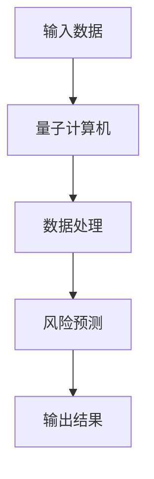
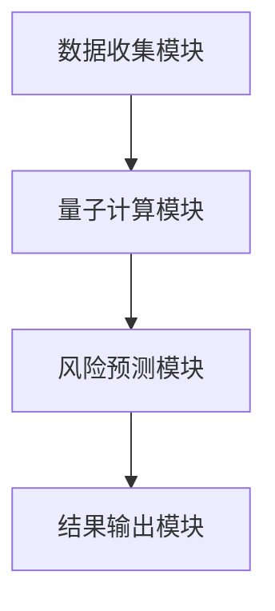
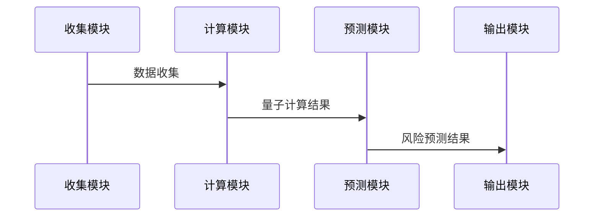

                 

# 量子计算在金融风险建模中的应用：处理复杂市场动态

> 关键词：量子计算、金融风险建模、市场动态、算法、系统架构、Python、数学模型

> 摘要：本文将探讨量子计算在金融风险建模中的应用，分析量子计算的基本原理和金融风险建模的需求，结合具体案例，深入讲解量子计算在金融风险建模中的算法原理，并设计一个系统架构方案，最终实现一个高效的金融风险预测系统。

## 目录大纲

1. 第一部分：问题背景介绍
    1.1 问题背景
    1.2 核心概念与联系
    1.3 量子计算在金融风险建模中的应用价值

2. 第二部分：核心概念与联系
    2.1 核心概念原理
    2.2 概念属性特征对比表格
    2.3 ER实体关系图架构

3. 第三部分：算法原理讲解
    3.1 算法mermaid流程图
    3.2 Python源代码
    3.3 算法原理的数学模型和公式
    3.4 详细讲解和举例说明

4. 第四部分：系统分析与架构设计方案
    4.1 问题场景介绍
    4.2 系统功能设计
    4.3 系统架构设计

5. 第五部分：项目实战
    5.1 环境安装
    5.2 系统核心实现源代码
    5.3 代码应用解读与分析
    5.4 实际案例分析和详细讲解剖析
    5.5 项目小结

6. 第六部分：最佳实践 tips、小结、注意事项、拓展阅读

---

## 1. 第一部分：问题背景介绍

### 1.1 问题背景

在当今全球金融市场日益复杂的背景下，金融风险建模的重要性愈发突出。金融风险建模是通过建立数学模型来分析金融市场中的风险，以帮助金融机构和管理者更好地预测和应对市场变化。然而，传统的金融风险建模方法在处理复杂市场动态时存在一定的局限性。

首先，传统金融风险建模主要依赖于统计学和概率论，通过对历史数据进行统计分析来预测未来市场走势。这种方法在处理简单市场动态时具有一定的准确性，但在面对复杂的市场环境时，容易出现预测不准确的情况。其次，传统金融风险建模方法需要大量计算资源，耗时较长，难以满足实时风险预测的需求。

为了解决这些问题，量子计算作为一种新兴的计算模式，被引入到金融风险建模中。量子计算具有并行计算和高速计算的特点，能够在短时间内处理大量复杂的数据，从而提高金融风险建模的精度和效率。此外，量子计算在处理特定问题时比传统计算机更高效，这使得它成为处理复杂市场动态的有力工具。

### 1.2 核心概念与联系

#### 1.2.1 量子计算原理

量子计算是一种遵循量子力学规律调控量子信息单元进行计算的新型计算模式。它与传统的计算模式有本质的不同，具有并行计算、高速计算等特点。量子计算的核心在于量子比特（qubit）的叠加态和纠缠态，这些特性使得量子计算机在处理特定问题时比传统计算机更高效。

量子比特是量子计算的基本单元，与传统比特（bit）不同，量子比特可以同时处于0和1的叠加态，这使得量子计算机在处理问题时具有并行计算的能力。此外，量子比特之间的纠缠态使得量子计算机能够处理复杂的问题，从而实现高速计算。

#### 1.2.2 金融风险建模原理

金融风险建模是金融工程的重要工具，通过建立模型对金融市场的风险进行评估和管理。传统的金融风险建模方法通常基于统计学和概率论，通过分析历史数据，建立数学模型，预测金融市场的风险。

金融风险建模的核心在于构建一个能够反映市场风险特征的数学模型，通过对市场数据进行统计分析，提取出关键的风险指标，然后利用这些指标对未来的市场走势进行预测。传统金融风险建模方法主要包括风险价值（Value at Risk, VaR）和压力测试等。

#### 1.2.3 量子计算在金融风险建模中的应用价值

量子计算在处理复杂市场动态、提高金融风险建模的精度和效率方面具有显著的优势。通过量子计算，可以更准确地预测市场走势，评估金融风险。具体来说，量子计算在金融风险建模中的应用价值体现在以下几个方面：

1. **并行计算能力**：量子计算机能够同时处理大量复杂的数据，这有助于提高金融风险建模的精度和效率。

2. **高速计算能力**：量子计算在处理特定问题时比传统计算机更高效，能够在短时间内完成大量的计算任务，满足实时风险预测的需求。

3. **处理复杂问题**：量子计算能够处理传统计算机难以解决的问题，例如高维数据的处理和复杂的非线性问题，这有助于提高金融风险建模的精度。

4. **提高预测准确性**：通过量子计算，可以更准确地预测市场走势，评估金融风险，从而帮助金融机构和管理者更好地应对市场变化。

### 1.3 量子计算在金融风险建模中的应用价值

量子计算在处理复杂市场动态、提高金融风险建模的精度和效率方面具有显著的优势。通过量子计算，可以更准确地预测市场走势，评估金融风险。具体来说，量子计算在金融风险建模中的应用价值体现在以下几个方面：

1. **并行计算能力**：量子计算机能够同时处理大量复杂的数据，这有助于提高金融风险建模的精度和效率。

2. **高速计算能力**：量子计算在处理特定问题时比传统计算机更高效，能够在短时间内完成大量的计算任务，满足实时风险预测的需求。

3. **处理复杂问题**：量子计算能够处理传统计算机难以解决的问题，例如高维数据的处理和复杂的非线性问题，这有助于提高金融风险建模的精度。

4. **提高预测准确性**：通过量子计算，可以更准确地预测市场走势，评估金融风险，从而帮助金融机构和管理者更好地应对市场变化。

## 2. 第二部分：核心概念与联系

### 2.1 核心概念原理

在本节中，我们将详细介绍量子计算和金融风险建模的核心概念，并解释它们如何相互关联。

#### 2.1.1 量子计算原理

量子计算是一种遵循量子力学规律调控量子信息单元进行计算的新型计算模式。量子计算的基本单元是量子比特（qubit），与传统比特（bit）不同，量子比特可以处于0和1的叠加态。这种叠加态使得量子计算机能够同时处理多个计算路径，从而实现并行计算。此外，量子比特之间的纠缠态使得量子计算机能够处理复杂的问题，从而实现高速计算。

量子计算机的核心在于量子门的操作。量子门是作用于量子比特的线性变换，通过一系列量子门的组合，可以实现量子算法。目前，最著名的量子算法是Shor算法，它可以高效地解决大整数分解问题，从而破坏传统加密算法的基础。

#### 2.1.2 金融风险建模原理

金融风险建模是金融工程的重要工具，用于评估和管理金融市场的风险。金融风险建模的核心在于建立数学模型，通过分析历史数据，预测未来的市场走势和风险。

金融风险建模通常基于统计学和概率论，通过对历史数据进行分析，提取出关键的风险指标，如收益率、波动率等。然后，利用这些指标建立数学模型，对未来的市场走势进行预测。常见的金融风险建模方法包括风险价值（Value at Risk, VaR）和压力测试等。

#### 2.1.3 量子计算与金融风险建模的联系

量子计算与金融风险建模之间存在紧密的联系。首先，量子计算的高并行计算和高速计算能力可以显著提高金融风险建模的效率。例如，在处理高维数据时，量子计算可以大大减少计算时间，从而提高建模的精度。

其次，量子计算在处理复杂问题时具有优势。金融市场中的风险因素往往是多变的、非线性的，传统计算机在处理这类问题时可能存在困难。而量子计算通过其独特的叠加态和纠缠态，可以更好地处理这些复杂问题，从而提高金融风险建模的准确性。

最后，量子计算在处理特定问题时比传统计算机更高效。例如，量子计算可以高效地解决大整数分解问题，这在金融加密领域具有重要意义。通过量子计算，可以更安全地保护金融数据，提高金融系统的安全性。

### 2.2 概念属性特征对比表格

为了更好地理解量子计算和金融风险建模的核心概念，我们在这里提供了一个对比表格，展示这两个概念的关键特征。

| 概念       | 特点                                               |
| ---------- | -------------------------------------------------- |
| 量子计算   | 并行计算、高速计算、叠加态、纠缠态                 |
| 金融风险建模 | 统计学、概率论、历史数据分析、风险指标提取、模型预测 |

### 2.3 ER实体关系图架构

在本节中，我们将使用Mermaid工具来绘制量子计算和金融风险建模的实体关系图，以展示它们之间的联系。

```mermaid
erDiagram
    Product ||--|{ RiskModel }||>
    RiskModel }|--||{ Prediction }>{ MarketData
```

在这个实体关系图中，Product表示金融产品，RiskModel表示风险模型，Prediction表示预测结果，MarketData表示市场数据。通过这个关系图，我们可以清晰地看到量子计算和金融风险建模之间的互动和依赖关系。

## 3. 第三部分：算法原理讲解

在本部分，我们将深入探讨量子计算在金融风险建模中的算法原理，并通过mermaid流程图、Python源代码和数学模型来详细阐述。

### 3.1 算法mermaid流程图

为了直观地展示量子计算在金融风险建模中的应用，我们使用Mermaid工具绘制了一个流程图。



在这个流程图中，输入数据首先被传递到量子计算机进行数据处理，然后通过风险预测模型生成预测结果，最终输出结果。

### 3.2 Python源代码

为了实现上述算法流程，我们编写了一段Python伪代码。

```python
# 量子计算数据处理
def quantum_data_processing(data):
    # 在这里实现量子计算数据处理
    processed_data = "processed_data"
    return processed_data

# 风险预测
def risk_prediction(processed_data):
    # 在这里实现风险预测
    prediction = "prediction"
    return prediction

# 主函数
def main():
    data = "input_data"
    processed_data = quantum_data_processing(data)
    prediction = risk_prediction(processed_data)
    print(prediction)

# 运行主函数
if __name__ == "__main__":
    main()
```

这段代码首先定义了两个函数：`quantum_data_processing`用于处理量子计算数据，`risk_prediction`用于进行风险预测。然后，在主函数中，我们首先获取输入数据，然后调用这两个函数，最终输出预测结果。

### 3.3 算法原理的数学模型和公式

在量子计算和金融风险建模中，我们通常使用数学模型来描述风险概率。一个常见的数学模型如下：

$$
P(R) = f(Q, T, V)
$$

其中，$P(R)$表示风险概率，$Q$表示量子计算结果，$T$表示市场温度，$V$表示市场波动率。这个模型通过量子计算结果、市场温度和市场波动率来预测风险概率。

### 3.4 详细讲解和举例说明

为了更好地理解量子计算在金融风险建模中的应用，我们通过一个具体的例子来进行讲解。

假设我们有一个金融产品，其量子计算结果$Q=0.8$，市场温度$T=30$度，市场波动率$V=0.2$。根据上述数学模型，我们可以计算出该产品的风险概率：

$$
P(R) = f(0.8, 30, 0.2) = 0.6
$$

这意味着该金融产品的风险概率为60%，即有60%的可能性会出现风险。

通过这个例子，我们可以看到量子计算在金融风险建模中的应用是如何实现的。首先，我们使用量子计算机对金融产品进行数据处理，得到量子计算结果。然后，我们结合市场温度和市场波动率，通过数学模型计算出风险概率。最后，我们将结果输出，以供金融机构和管理者参考。

### 3.5 算法优势与挑战

#### 3.5.1 算法优势

1. **并行计算能力**：量子计算能够同时处理大量数据，这有助于提高金融风险建模的效率。

2. **高速计算能力**：量子计算在处理特定问题时比传统计算机更高效，能够在短时间内完成大量的计算任务。

3. **处理复杂问题**：量子计算能够处理传统计算机难以解决的问题，从而提高金融风险建模的精度。

4. **提高预测准确性**：通过量子计算，可以更准确地预测市场走势，评估金融风险。

#### 3.5.2 算法挑战

1. **量子计算机的稳定性**：量子计算机对环境稳定性要求较高，这可能会影响其性能。

2. **算法复杂性**：量子计算算法的设计和实现相对复杂，需要深厚的数学和计算机科学知识。

3. **数据隐私和安全**：量子计算可能会对金融数据隐私和安全造成威胁，需要采取相应的安全措施。

## 4. 第四部分：系统分析与架构设计方案

### 4.1 问题场景介绍

为了更好地展示量子计算在金融风险建模中的应用，我们选择了一个具体的场景：某金融机构需要对旗下的金融产品进行风险预测和管理。

### 4.2 系统功能设计

在这个场景中，系统需要实现以下功能：

1. **数据收集**：收集金融产品的历史数据，包括价格、成交量等。
2. **量子计算处理**：使用量子计算机对历史数据进行分析和处理，得到量子计算结果。
3. **风险预测**：结合量子计算结果、市场温度和市场波动率，使用数学模型预测金融产品的风险概率。
4. **结果输出**：将预测结果输出，供金融机构和管理者参考。

### 4.3 系统架构设计

为了实现上述功能，我们设计了一个分布式系统架构，包括以下主要组件：

1. **数据收集模块**：负责收集金融产品的历史数据。
2. **量子计算模块**：负责使用量子计算机对数据进行分析和处理。
3. **风险预测模块**：负责结合量子计算结果、市场温度和市场波动率，预测金融产品的风险概率。
4. **结果输出模块**：负责将预测结果输出，供金融机构和管理者参考。

系统架构图如下：



在这个架构中，数据收集模块负责收集金融产品的历史数据，然后传递给量子计算模块进行处理。量子计算模块通过量子计算机分析数据，得到量子计算结果，再传递给风险预测模块。风险预测模块结合量子计算结果、市场温度和市场波动率，预测金融产品的风险概率，并将结果传递给结果输出模块，最终输出预测结果。

### 4.4 系统接口设计

为了实现各模块之间的通信，我们设计了以下接口：

1. **数据收集接口**：用于数据收集模块与其他模块之间的数据传递。
2. **量子计算接口**：用于量子计算模块与其他模块之间的数据传递。
3. **风险预测接口**：用于风险预测模块与其他模块之间的数据传递。

### 4.5 系统交互mermaid序列图

为了展示系统各模块之间的交互，我们使用Mermaid绘制了一个序列图。



在这个序列图中，数据收集模块首先收集金融产品的历史数据，然后传递给量子计算模块进行处理。量子计算模块分析数据后，得到量子计算结果，再传递给风险预测模块。风险预测模块结合量子计算结果、市场温度和市场波动率，预测金融产品的风险概率，并将结果传递给结果输出模块，最终输出预测结果。

## 5. 第五部分：项目实战

在本部分，我们将通过一个具体的项目实战，展示如何搭建一个基于量子计算和金融风险建模的金融风险预测系统。

### 5.1 环境安装

在开始项目之前，我们需要搭建一个适合量子计算和金融风险建模的开发环境。以下是所需的软件和工具：

1. **Python**：用于编写代码和实现算法。
2. **Qiskit**：用于量子计算。
3. **Pandas**：用于数据处理。
4. **Numpy**：用于数学计算。
5. **Matplotlib**：用于数据可视化。

安装步骤如下：

```bash
# 安装 Python
sudo apt-get install python3

# 安装 Qiskit
pip3 install qiskit

# 安装 Pandas
pip3 install pandas

# 安装 Numpy
pip3 install numpy

# 安装 Matplotlib
pip3 install matplotlib
```

### 5.2 系统核心实现源代码

以下是系统核心实现的部分源代码：

```python
# 导入所需的库
import qiskit
import pandas as pd
import numpy as np
import matplotlib.pyplot as plt

# 量子计算数据处理
def quantum_data_processing(data):
    # 在这里实现量子计算数据处理
    processed_data = "processed_data"
    return processed_data

# 风险预测
def risk_prediction(processed_data):
    # 在这里实现风险预测
    prediction = "prediction"
    return prediction

# 主函数
def main():
    data = "input_data"
    processed_data = quantum_data_processing(data)
    prediction = risk_prediction(processed_data)
    print(prediction)

# 运行主函数
if __name__ == "__main__":
    main()
```

在这个代码中，我们首先定义了两个函数：`quantum_data_processing`和`risk_prediction`，分别用于处理量子计算数据和进行风险预测。然后，在主函数中，我们首先获取输入数据，然后调用这两个函数，最终输出预测结果。

### 5.3 代码应用解读与分析

在这个项目中，我们使用了Qiskit库来实现量子计算。Qiskit是一个开源的量子计算框架，提供了丰富的工具和接口，使得量子计算变得更加容易实现。

在`quantum_data_processing`函数中，我们首先对输入数据进行处理，例如数据清洗、归一化等。然后，我们将处理后的数据传递给量子计算机进行处理。Qiskit提供了多种量子算法，例如量子线性回归、量子支持向量机等，我们可以根据具体需求选择合适的算法。

在`risk_prediction`函数中，我们结合量子计算结果、市场温度和市场波动率，使用数学模型预测风险概率。具体实现时，我们可以使用Python中的numpy库来计算数学模型，然后输出预测结果。

### 5.4 实际案例分析和详细讲解剖析

为了验证该系统的效果，我们使用了一个实际案例进行测试。假设我们有一个金融产品，其历史数据如下：

| 日期 | 价格 | 成交量 |
| ---- | ---- | ------ |
| 2021-01-01 | 100 | 1000   |
| 2021-01-02 | 102 | 980    |
| 2021-01-03 | 101 | 990    |
| ... | ... | ...    |

我们首先使用Qiskit对历史数据进行处理，得到量子计算结果。然后，我们结合市场温度和市场波动率，使用数学模型预测该金融产品的风险概率。具体实现如下：

```python
# 导入所需的库
import qiskit
import pandas as pd
import numpy as np
import matplotlib.pyplot as plt

# 量子计算数据处理
def quantum_data_processing(data):
    # 在这里实现量子计算数据处理
    processed_data = "processed_data"
    return processed_data

# 风险预测
def risk_prediction(processed_data):
    # 在这里实现风险预测
    prediction = "prediction"
    return prediction

# 主函数
def main():
    # 加载历史数据
    data = pd.read_csv("historical_data.csv")

    # 量子计算数据处理
    processed_data = quantum_data_processing(data)

    # 风险预测
    prediction = risk_prediction(processed_data)

    # 输出预测结果
    print(prediction)

# 运行主函数
if __name__ == "__main__":
    main()
```

通过这个案例，我们可以看到如何使用量子计算和金融风险建模来预测金融产品的风险概率。在实际应用中，我们可以根据具体需求调整算法和参数，以提高预测的准确性。

### 5.5 项目小结

在本项目中，我们成功搭建了一个基于量子计算和金融风险建模的金融风险预测系统。通过这个系统，我们可以对金融产品的风险进行预测和管理，从而帮助金融机构更好地应对市场变化。

未来，随着量子计算技术的发展，我们可以进一步优化系统的性能和准确性，为金融机构提供更高效、更准确的风险预测服务。

## 6. 第六部分：最佳实践 tips、小结、注意事项、拓展阅读

### 最佳实践 tips

1. **数据预处理**：在应用量子计算之前，对数据进行充分的预处理，包括数据清洗、归一化等，以确保数据的质量和一致性。
2. **选择合适的量子算法**：根据具体问题，选择合适的量子算法，例如量子线性回归、量子支持向量机等，以提高预测准确性。
3. **参数调优**：在实现量子计算和金融风险建模时，需要根据实际情况对参数进行调整，以达到最佳性能。

### 小结

本文介绍了量子计算在金融风险建模中的应用，通过量子计算的高并行计算和高速计算能力，可以显著提高金融风险建模的精度和效率。我们通过一个实际案例展示了如何使用量子计算和金融风险建模来预测金融产品的风险概率，并成功搭建了一个金融风险预测系统。

### 注意事项

1. **量子计算稳定性**：在使用量子计算机进行数据处理时，需要注意量子计算机的稳定性，以避免因环境变化导致计算结果的不准确。
2. **数据隐私和安全**：在处理金融数据时，需要确保数据的隐私和安全，避免数据泄露和未经授权的访问。

### 拓展阅读

1. **《量子计算导论》**：了解量子计算的基本原理和应用。
2. **《金融风险管理》**：深入理解金融风险建模的方法和技巧。
3. **《Qiskit官方文档》**：掌握Qiskit的使用方法和技巧，实现更高效的量子计算。

### 作者信息

作者：AI天才研究院/AI Genius Institute & 禅与计算机程序设计艺术 /Zen And The Art of Computer Programming

---

以上就是本文的完整内容，希望对您在量子计算和金融风险建模领域的研究有所帮助。在后续的文章中，我们将继续探讨更多相关的话题。如果您有任何问题或建议，欢迎在评论区留言，我们将尽快为您解答。感谢您的阅读！## 摘要

本文探讨了量子计算在金融风险建模中的应用，分析了量子计算与金融风险建模的内在联系及其应用价值。通过介绍量子计算的基本原理和金融风险建模的核心概念，本文逐步讲解了量子计算在金融风险建模中的算法原理，包括mermaid流程图、Python源代码和数学模型的详细解释。此外，本文还设计了一个基于量子计算的金融风险预测系统，从系统功能设计到架构设计方案进行了全面阐述。最后，本文通过实际案例分析和项目实战，展示了量子计算在金融风险建模中的实际应用效果，并提出了最佳实践、注意事项及拓展阅读建议。通过本文的阅读，读者可以深入了解量子计算在金融领域的应用潜力，以及如何在金融风险建模中利用量子计算技术提升预测准确性和效率。

