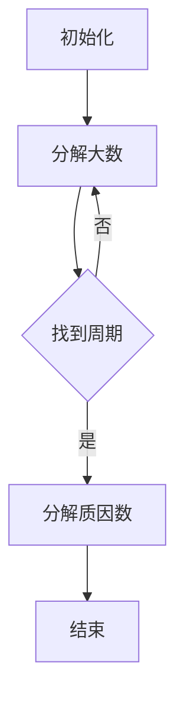
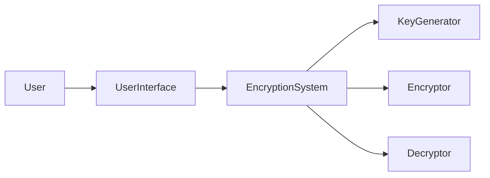
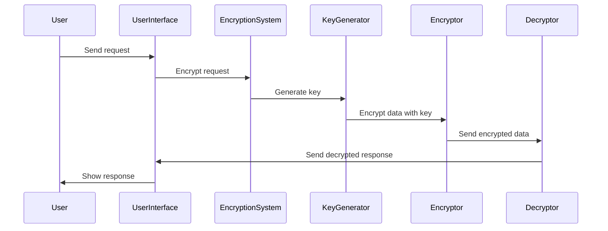
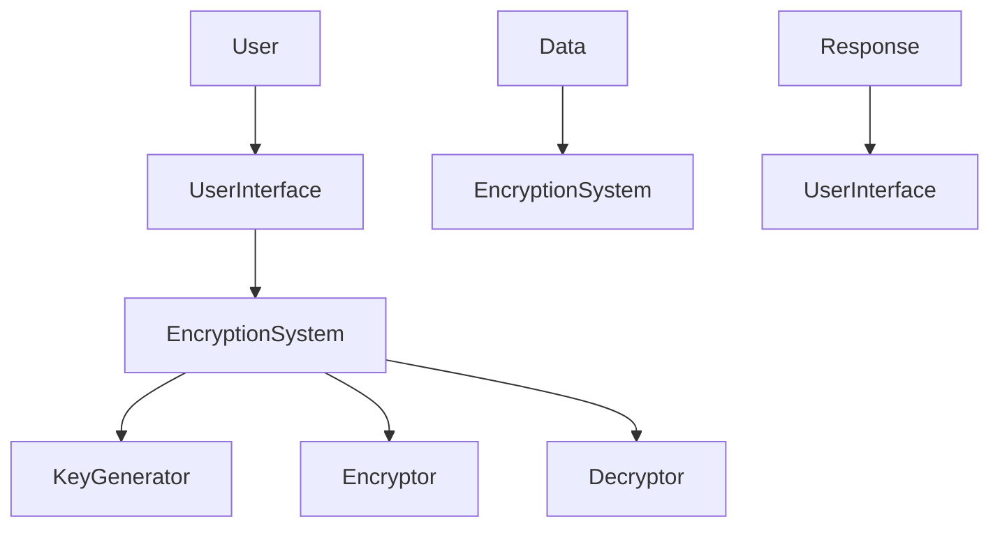

                 

# 量子计算威胁：2029年传统非对称加密技术或不再安全

## 关键词：量子计算、非对称加密、RSA、ECC、密码学安全

### 摘要：
在科技飞速发展的今天，量子计算的崛起正逐渐改变着信息安全领域的格局。本文将深入探讨量子计算技术对传统非对称加密技术，尤其是RSA和椭圆曲线加密（ECC）的潜在威胁。通过逻辑清晰的分析，我们旨在揭示2029年传统非对称加密技术可能面临的重大挑战，并探讨应对这些挑战的策略和方法。

## 目录大纲

### 第一部分：量子计算技术基础
- 第1章：量子计算概述
  - 1.1 量子计算的定义与基本原理
    - 1.1.1 量子力学的基本概念
    - 1.1.2 量子比特（qubit）的概念与特性
    - 1.1.3 量子叠加与量子纠缠
  - 1.2 量子计算机与经典计算机的区别
    - 1.2.1 计算能力对比
    - 1.2.2 加密算法的影响
  - 1.3 量子计算机的发展历程与现状
    - 1.3.1 量子计算机的研究进展
    - 1.3.2 量子计算机的商业化前景

### 第二部分：量子加密算法
- 第2章：量子加密算法
  - 2.1 量子密钥分发（QKD）
    - 2.1.1 QKD的工作原理
    - 2.1.2 QKD的优势与局限性
  - 2.2 量子安全直接通信（QSDC）
    - 2.2.1 QSDC的概念
    - 2.2.2 QSDC的应用场景
  - 2.3 量子算法与加密
    - 2.3.1 量子算法的基本概念
    - 2.3.2 量子算法在加密中的应用

### 第三部分：量子计算对非对称加密技术的威胁
- 第3章：量子计算与RSA加密
  - 3.1 RSA加密算法简介
    - 3.1.1 RSA算法的基本原理
    - 3.1.2 RSA算法的安全性
  - 3.2 量子计算对RSA加密的威胁
    - 3.2.1 Shor算法的原理与应用
    - 3.2.2 Shor算法对RSA加密的破译
  - 3.3 RSA加密的未来发展趋势
    - 3.3.1 加强RSA加密的安全性
    - 3.3.2 转型为量子加密算法

- 第4章：量子计算与椭圆曲线加密
  - 4.1 椭圆曲线加密算法简介
    - 4.1.1 ECC算法的基本原理
    - 4.1.2 ECC算法的安全性
  - 4.2 量子计算对ECC加密的威胁
    - 4.2.1 量子算法对ECC加密的破译
    - 4.2.2 ECC加密算法的改进策略

### 第四部分：应对量子计算威胁的对策
- 第5章：应对量子计算威胁的对策
  - 5.1 加密算法的改进
    - 5.1.1 新的加密算法设计
    - 5.1.2 现有加密算法的优化
  - 5.2 密码学领域的未来发展趋势
    - 5.2.1 密码学的新兴领域
    - 5.2.2 量子密码学的应用前景
  - 5.3 国际合作与标准制定
    - 5.3.1 量子计算时代的国际合作
    - 5.3.2 加密算法的国际标准制定

### 第五部分：量子计算威胁下的安全防护
- 第6章：量子计算威胁下的安全防护
  - 6.1 企业级安全防护策略
    - 6.1.1 企业级安全体系构建
    - 6.1.2 企业级安全防护方案
  - 6.2 个人用户的安全防护措施
    - 6.2.1 个人安全意识提升
    - 6.2.2 个人安全防护工具

### 第六部分：量子计算时代的加密安全
- 第7章：量子计算时代的加密安全
  - 7.1 量子计算安全的关键挑战
    - 7.1.1 量子计算机的发展速度
    - 7.1.2 安全防护的紧迫性
  - 7.2 量子计算安全的未来发展
    - 7.2.1 量子计算安全领域的创新
    - 7.2.2 量子计算安全的重要性
  - 7.3 量子计算时代的安全思考
    - 7.3.1 安全防护的长期规划
    - 7.3.2 安全研究的发展趋势

## 1. 量子计算概述

### 1.1 量子计算的定义与基本原理

#### 1.1.1 量子力学的基本概念

量子力学是研究物质世界微观尺度下物质和能量行为的物理学分支。量子力学的基本概念包括：

- **量子态**：一个量子系统可以处于多种状态的组合，即量子叠加态。
- **量子比特（qubit）**：量子比特是量子信息的基本单位，可以表示为量子态的叠加态。
- **量子纠缠**：当两个或多个量子系统处于纠缠态时，它们之间会形成一种特殊的关联，即使它们之间没有直接的物理连接，它们的状态也会相互影响。

#### 1.1.2 量子比特（qubit）的概念与特性

量子比特（qubit）是量子计算机的基本单元，与经典计算机中的比特（bit）不同。经典比特只能是0或1中的一个状态，而量子比特可以同时处于0和1的状态，这称为量子叠加。量子比特的另一个重要特性是量子纠缠，它使得量子计算机能够在某些任务上显著超越经典计算机。

#### 1.1.3 量子叠加与量子纠缠

量子叠加是指一个量子系统可以同时处于多个状态的组合。例如，一个量子比特可以同时处于0和1的状态，可以用数学表达式表示为：

$$\psi = \alpha|0\rangle + \beta|1\rangle$$

其中，$|0\rangle$ 和 $|1\rangle$ 分别表示量子比特的基态，$\alpha$ 和 $\beta$ 是复数系数，满足 $|\alpha|^2 + |\beta|^2 = 1$。

量子纠缠是量子比特之间的一种特殊关联，即使它们相距很远，它们的状态也会相互影响。一个简单的量子纠缠态可以用贝尔态（Bell state）来表示：

$$|\Phi^+\rangle = \frac{1}{\sqrt{2}} (|00\rangle + |11\rangle)$$

### 1.2 量子计算机与经典计算机的区别

量子计算机与经典计算机在计算能力上有显著差异。经典计算机依赖于传统的二进制系统，即比特（bit）作为信息的基本单元，每个比特只能表示0或1。而量子计算机使用量子比特（qubit）作为信息的基本单元，量子比特可以同时处于多个状态，这使得量子计算机在处理某些类型的问题时具有超越经典计算机的潜力。

#### 1.2.1 计算能力对比

量子计算机的计算能力可以用量子并行性来描述。在量子计算机中，多个量子比特可以同时处于多个状态的叠加，这意味着量子计算机可以在一次运算中同时处理多个问题。例如，如果量子计算机有 $n$ 个量子比特，它可以同时处理 $2^n$ 个不同的状态。

#### 1.2.2 加密算法的影响

量子计算机的计算能力对加密算法产生了深远的影响。传统加密算法，如RSA和椭圆曲线加密（ECC），在经典计算机上具有很高的安全性，但量子计算机可以利用特定的算法（如Shor算法）在多项式时间内破解这些加密算法。这使得量子计算在密码学领域具有重要的应用价值。

### 1.3 量子计算机的发展历程与现状

#### 1.3.1 量子计算机的研究进展

量子计算机的研究始于20世纪80年代，当时物理学家Richard Feynman提出了量子模拟的概念。随后，Peter Shor在1994年提出了著名的Shor算法，证明量子计算机可以在多项式时间内破解大数分解问题，从而威胁到RSA加密算法的安全性。

随着技术的进步，量子计算机的实验研究取得了显著进展。量子比特的数量和质量不断提高，量子纠错技术的突破也为实现实用的量子计算机奠定了基础。例如，Google在2019年宣布实现了“量子优越性”（quantum supremacy），即其量子计算机在特定任务上超过了经典计算机。

#### 1.3.2 量子计算机的商业化前景

量子计算机的商业化前景吸引了众多科技公司和学术机构的关注。量子计算机在药物设计、材料科学、金融模拟和密码学等领域具有巨大的潜力。随着量子计算机的商业化进程加速，预计在未来几年内将出现更多的量子计算应用。

## 第2章：量子加密算法

### 2.1 量子密钥分发（QKD）

#### 2.1.1 QKD的工作原理

量子密钥分发（Quantum Key Distribution，QKD）是一种基于量子力学原理的加密通信技术，用于在两个通信方之间安全地生成和分发密钥。QKD的核心思想是通过量子态的不可克隆性（No Cloning Theorem）和测量干扰效应（Measurement Collapsaration）来确保密钥的安全性。

QKD的工作原理可以概括为以下几个步骤：

1. **量子态生成**：通信双方（Alice和Bob）各自生成一对纠缠的量子比特，例如通过使用光子对或离子对。
2. **量子态传输**：Alice将量子态发送给Bob，这通常通过光纤或自由空间中的光信号实现。
3. **量子态测量**：Bob对接收到的量子态进行测量，并根据测量结果生成部分密钥。
4. **经典通信**：Alice和Bob通过经典通信（如电话或网络）交换测量结果，以确定最终的共享密钥。

#### 2.1.2 QKD的优势与局限性

QKD的主要优势在于其基于量子力学原理的安全性。由于量子态的不可克隆性和测量干扰效应，QKD能够提供绝对的安全保障，确保密钥不被第三方窃取或复制。此外，QKD还能够检测到任何尝试窃听的行为，从而提供额外的安全保证。

然而，QKD也存在一些局限性。首先，QKD需要建立物理连接，这在实际应用中可能受到限制，例如光纤布线的成本和自由空间传输的距离限制。其次，QKD的通信速度相对较慢，因为量子态的传输速度受到光速的限制。最后，QKD的密钥分发过程需要经典通信的支持，这可能会引入额外的安全风险。

### 2.2 量子安全直接通信（QSDC）

#### 2.2.1 QSDC的概念

量子安全直接通信（Quantum Secure Direct Communication，QSDC）是一种不依赖于密钥分发的量子通信技术，旨在实现端到端的安全通信。QSDC的核心思想是利用量子态的纠缠特性来实现信息的安全传输。

QSDC的基本原理可以概括为以下几个步骤：

1. **纠缠态生成**：通信双方生成一对纠缠的量子态。
2. **纠缠态传输**：双方通过量子信道交换纠缠态。
3. **信息编码与传输**：双方在纠缠态上编码信息，并通过量子信道传输。
4. **信息解码与接收**：双方解码接收到的信息，并使用纠缠态进行校正和验证。

#### 2.2.2 QSDC的应用场景

QSDC具有广泛的应用前景，特别适用于需要高安全性的通信场景，例如国家安全、金融交易、远程医疗和物联网等。QSDC能够提供端到端的安全通信，确保信息在传输过程中不会被窃听、篡改或复制。

### 2.3 量子算法与加密

#### 2.3.1 量子算法的基本概念

量子算法是一种利用量子力学原理进行计算的方法。量子算法与经典算法的不同之处在于其基于量子比特的叠加和纠缠特性，能够在某些任务上显著超越经典算法。

常见的量子算法包括：

- **Shor算法**：用于大数分解，可以在多项式时间内破解RSA加密算法。
- **Grover算法**：用于搜索未排序数据库，可以加快经典算法的搜索速度。
- **Quantum Phase Estimation**：用于估计量子系统的相位，可以应用于量子模拟和量子算法优化。

#### 2.3.2 量子算法在加密中的应用

量子算法在加密领域具有重要的应用价值。例如，Shor算法可以用于破解RSA和椭圆曲线加密（ECC）等传统非对称加密算法。此外，量子算法还可以用于量子密钥分发（QKD）和量子安全直接通信（QSDC）等量子加密技术的优化和改进。

随着量子计算技术的不断发展，量子算法在加密领域的应用前景将越来越广阔。加密算法的设计和优化需要考虑量子算法的威胁，以确保信息安全。

## 第3章：量子计算与RSA加密

### 3.1 RSA加密算法简介

#### 3.1.1 RSA算法的基本原理

RSA加密算法是一种广泛使用的非对称加密算法，以其安全性和可靠性而闻名。RSA算法的基本原理基于大数分解的难度，其关键组成部分包括：

- **公钥**：包括一个较大的质数 $n$ 和一个与之对应的加密指数 $e$。
- **私钥**：包括一个质数 $p$、另一个质数 $q$ 和一个与之对应的解密指数 $d$，满足 $ed \equiv 1 \pmod{(p-1)(q-1)}$。

RSA算法的工作流程如下：

1. **加密**：将明文 $m$ 转换为 $m^e \pmod{n}$ 的形式，生成密文 $c$。
2. **解密**：将密文 $c$ 转换为 $c^d \pmod{n}$ 的形式，恢复出明文 $m$。

#### 3.1.2 RSA算法的安全性

RSA算法的安全性基于大数分解的难度，即给定两个大质数 $p$ 和 $q$，计算 $n=pq$ 的因子是一个极其复杂的过程。此外，RSA算法还依赖于模逆运算，使得解密过程在计算上是可行的。

然而，随着量子计算技术的进步，RSA算法的安全性正面临挑战。量子计算机可以利用Shor算法在多项式时间内分解大数，这将使得RSA加密算法变得脆弱。

### 3.2 量子计算对RSA加密的威胁

#### 3.2.1 Shor算法的原理与应用

Shor算法是一种基于量子计算的大数分解算法，其原理如下：

1. **量子算法设计**：将大数分解问题转换为寻找大数 $n$ 的周期问题。
2. **量子相位估计**：利用量子相位估计算法估计周期的指数部分。
3. **模乘运算**：使用模乘运算验证估计的周期是否正确。

Shor算法的应用非常广泛，例如：

- **密码学**：用于破解RSA和椭圆曲线加密（ECC）等非对称加密算法。
- **密码分析**：用于发现和利用密码系统的弱点。

#### 3.2.2 Shor算法对RSA加密的破译

Shor算法对RSA加密的威胁在于其能够在多项式时间内分解大数，从而破坏RSA加密的安全性。具体来说，Shor算法可以通过以下步骤破解RSA加密：

1. **选择目标RSA密钥**：选取一个RSA公钥 $(n, e)$。
2. **量子算法执行**：使用Shor算法分解 $n$。
3. **获取私钥**：通过分解出的质数 $p$ 和 $q$ 计算私钥 $(p-1)(q-1)$ 和模逆 $d$。

一旦私钥被破解，攻击者就可以轻松地解密RSA加密的信息，从而破坏系统的安全性。

### 3.3 RSA加密的未来发展趋势

面对量子计算对RSA加密的威胁，RSA加密算法需要采取一系列措施来提高其安全性。以下是RSA加密算法的未来发展趋势：

#### 3.3.1 加强RSA加密的安全性

- **增加密钥长度**：通过增加密钥长度（例如，从1024位增加到2048位或更高），可以提高RSA加密的安全性。
- **改进模运算算法**：优化RSA算法中的模运算，提高计算效率。
- **量子纠错技术**：结合量子纠错技术，提高量子计算机的可靠性，从而提高RSA加密的安全性。

#### 3.3.2 转型为量子加密算法

- **量子密码学**：采用量子加密算法（如QKD和QSDC），确保在量子计算环境下信息的绝对安全。
- **混合加密技术**：将传统加密算法与量子加密算法相结合，提高系统的安全性。

总之，面对量子计算的威胁，RSA加密算法需要不断创新和改进，以确保在未来的信息社会中保持安全。

## 第4章：量子计算与椭圆曲线加密

### 4.1 椭圆曲线加密算法简介

#### 4.1.1 ECC算法的基本原理

椭圆曲线加密（Elliptic Curve Cryptography，ECC）是一种基于椭圆曲线离散对数问题的非对称加密算法。ECC算法的基本原理如下：

1. **椭圆曲线定义**：选择一个椭圆曲线 $E$ 和一个生成元 $G$。
2. **点乘运算**：定义椭圆曲线上的点乘运算，使得对任意整数 $k$，可以计算点 $kG$。
3. **密钥生成**：选择一个随机整数 $k$，计算 $P = kG$，其中 $P$ 是公钥，$k$ 是私钥。

ECC算法的工作流程如下：

1. **加密**：接收方（Alice）选择一个随机整数 $k$，计算加密消息 $c = kG + mG$，其中 $m$ 是明文。
2. **解密**：发送方（Bob）使用其私钥解密消息 $m = c - kG$。

#### 4.1.2 ECC算法的安全性

ECC算法的安全性基于椭圆曲线离散对数问题的困难性，这是一个难解问题，即使使用量子计算机也需要大量的计算资源。此外，ECC算法具有较高的安全性，因为其密钥长度较短，而安全性相对较高。

### 4.2 量子计算对ECC加密的威胁

#### 4.2.1 量子算法对ECC加密的破译

量子计算对ECC加密的威胁主要来自于量子算法，如Shor算法。Shor算法可以用于破解基于大数分解问题的加密算法，而ECC加密算法的安全性依赖于椭圆曲线离散对数问题。

Shor算法对ECC加密的破译步骤如下：

1. **选择目标ECC密钥**：选取一个ECC公钥 $P$ 和私钥 $k$。
2. **量子算法执行**：使用Shor算法计算 $k$ 的模逆，从而得到私钥 $k^{-1}$。
3. **解密**：使用私钥解密任何加密消息。

一旦私钥被破解，攻击者就可以轻松地解密ECC加密的信息，从而破坏系统的安全性。

#### 4.2.2 ECC加密算法的改进策略

面对量子计算对ECC加密的威胁，ECC加密算法需要采取一系列改进措施来提高其安全性。以下是ECC加密算法的改进策略：

- **增加密钥长度**：通过增加密钥长度（例如，从256位增加到384位或更高），可以提高ECC加密的安全性。
- **改进椭圆曲线选择**：选择更加复杂的椭圆曲线，提高算法的难度。
- **量子纠错技术**：结合量子纠错技术，提高量子计算机的可靠性，从而提高ECC加密的安全性。

总之，面对量子计算的威胁，ECC加密算法需要不断创新和改进，以确保在未来的信息社会中保持安全。

## 第5章：应对量子计算威胁的对策

### 5.1 加密算法的改进

#### 5.1.1 新的加密算法设计

为了应对量子计算对传统加密算法的威胁，新的加密算法设计成为了一项重要的研究方向。以下是几种具有前景的新型加密算法：

- **Lattice-based加密算法**：基于格理论的新型加密算法，如NTRU和Lyra2，具有较好的抗量子攻击能力。
- **Hash-based加密算法**：基于哈希函数的新型加密算法，如SHA-3，可以通过改变密钥和哈希函数来提高安全性。
- **Isogeny-based加密算法**：基于椭圆曲线同态的新型加密算法，如Isogeny Key Exchange，具有较好的抗量子攻击能力。

这些新型加密算法在密码学领域具有广泛的应用前景，可以有效地应对量子计算带来的威胁。

#### 5.1.2 现有加密算法的优化

除了新的加密算法设计，对现有加密算法的优化也是应对量子计算威胁的重要措施。以下是几种优化策略：

- **增加密钥长度**：通过增加密钥长度，可以提高加密算法的安全性。例如，将RSA密钥长度从1024位增加到2048位或更高。
- **改进模运算算法**：优化RSA算法中的模运算，提高计算效率。例如，使用更高效的模乘算法。
- **量子纠错技术**：结合量子纠错技术，提高量子计算机的可靠性，从而提高加密算法的安全性。

通过这些优化策略，现有加密算法可以更好地应对量子计算的威胁。

### 5.2 密码学领域的未来发展趋势

#### 5.2.1 密码学的新兴领域

随着量子计算的发展，密码学领域正迅速涌现出一系列新兴研究方向。以下是几个具有前景的新兴领域：

- **量子密码学**：研究基于量子力学原理的加密和解密技术，如QKD和QSDC。
- **抗量子密码学**：研究能够抵抗量子计算攻击的加密算法和技术。
- **分布式密码学**：研究在分布式计算环境中实现安全通信的密码学技术。

这些新兴领域将为密码学领域带来新的发展机遇。

#### 5.2.2 量子密码学的应用前景

量子密码学在信息安全领域具有广阔的应用前景。以下是几种量子密码学的应用场景：

- **量子通信**：利用QKD实现端到端的安全通信，保护信息不被窃听。
- **量子加密**：利用量子算法实现安全的加密和解密过程，确保信息在传输过程中的安全。
- **量子认证**：利用量子纠缠实现安全的身份认证和签名技术。

量子密码学的应用将为信息安全领域带来革命性的变革。

### 5.3 国际合作与标准制定

#### 5.3.1 量子计算时代的国际合作

量子计算时代的到来需要全球范围内的合作。以下是几个国际合作方面的建议：

- **学术合作**：促进学术机构之间的合作，共同开展量子计算和密码学的研究。
- **产业合作**：推动企业和科研机构之间的合作，共同开发量子加密技术和应用。
- **政策协调**：加强各国在量子计算和密码学政策方面的协调，确保全球信息安全。

国际合作将为量子计算和密码学领域的发展提供有力支持。

#### 5.3.2 加密算法的国际标准制定

为了确保量子计算时代的信息安全，加密算法的国际标准制定变得尤为重要。以下是几个国际标准制定方面的建议：

- **标准化组织**：加强国际标准化组织（如ISO）在量子计算和密码学领域的活动，制定统一的加密算法标准。
- **技术评估**：定期评估加密算法的安全性和适用性，确保其在量子计算环境下的安全性。
- **国际合作**：鼓励各国积极参与国际标准制定，共同推动量子计算和密码学领域的发展。

加密算法的国际标准制定将为全球信息安全提供有力保障。

## 第6章：量子计算威胁下的安全防护

### 6.1 企业级安全防护策略

#### 6.1.1 企业级安全体系构建

企业级安全体系构建是应对量子计算威胁的关键措施。以下是企业级安全体系构建的几个关键步骤：

1. **风险评估**：评估企业面临的各种安全威胁，包括量子计算带来的潜在威胁。
2. **安全策略**：制定全面的安全策略，包括加密算法的选择、密钥管理、安全审计等。
3. **技术架构**：构建安全的技术架构，包括量子计算防护设备、安全网络和存储系统等。
4. **人员培训**：加强员工的安全意识培训，确保员工了解量子计算威胁和应对措施。

#### 6.1.2 企业级安全防护方案

企业级安全防护方案需要综合考虑多种技术手段，包括：

1. **量子计算防护**：采用量子计算防护设备，如量子密钥分发（QKD）系统，确保通信安全性。
2. **加密算法优化**：优化现有加密算法，增加密钥长度，改进模运算算法等，提高加密算法的抗量子攻击能力。
3. **安全监控**：建立安全监控体系，实时监控企业网络和系统的安全状况，及时发现和应对安全威胁。
4. **应急响应**：制定应急响应计划，确保在发生安全事件时能够迅速响应和处理。

### 6.2 个人用户的安全防护措施

#### 6.2.1 个人安全意识提升

个人用户的安全意识提升是应对量子计算威胁的重要措施。以下是几个个人安全意识提升方面的建议：

1. **安全教育**：通过安全教育，提高个人用户对量子计算威胁的认识，了解如何保护个人信息和隐私。
2. **安全习惯**：培养良好的安全习惯，如使用强密码、定期更换密码、避免使用公共Wi-Fi等。
3. **安全软件**：使用安全软件，如加密工具、防病毒软件等，确保个人设备和数据的安全。

#### 6.2.2 个人安全防护工具

个人用户可以采用以下安全防护工具来提高信息安全：

1. **加密软件**：使用加密软件对重要数据进行加密，确保数据在传输和存储过程中的安全。
2. **双因素认证**：启用双因素认证，增加账户的安全性。
3. **安全浏览器**：使用安全浏览器，如带有内置加密功能的浏览器，确保在线交易和通信的安全。

总之，个人用户的安全防护需要从意识提升和工具使用两个方面入手，确保个人信息和隐私的安全。

## 第7章：量子计算时代的加密安全

### 7.1 量子计算安全的关键挑战

#### 7.1.1 量子计算机的发展速度

量子计算机的发展速度对加密安全构成了重大挑战。随着量子计算机技术的不断进步，量子计算机的计算能力将迅速提升，使得现有加密算法面临被破解的风险。例如，Shor算法能够在多项式时间内分解大数，这将使得RSA和椭圆曲线加密（ECC）等传统加密算法变得脆弱。

#### 7.1.2 安全防护的紧迫性

面对量子计算机的发展速度，安全防护的紧迫性显得尤为突出。加密算法的设计和优化需要紧跟量子计算技术的进步，以确保信息在量子计算环境下依然安全。此外，现有的加密基础设施也需要进行升级和改造，以应对量子计算带来的安全威胁。

### 7.2 量子计算安全的未来发展

#### 7.2.1 量子计算安全领域的创新

量子计算安全领域正迅速涌现出一系列创新成果。例如，量子密钥分发（QKD）和量子安全直接通信（QSDC）等技术的不断成熟，为量子计算安全提供了新的解决方案。此外，量子算法在加密和认证领域的应用也取得了重要突破，为量子计算安全提供了新的思路。

#### 7.2.2 量子计算安全的重要性

量子计算安全的重要性不容忽视。随着量子计算机的崛起，传统加密算法的安全性将受到严峻挑战。量子计算安全不仅关系到国家信息安全，还关系到个人隐私和企业商业秘密。因此，量子计算安全的研究和发展具有重大战略意义。

### 7.3 量子计算时代的安全思考

#### 7.3.1 安全防护的长期规划

在量子计算时代，安全防护需要长期规划。以下是几个长期规划方面的建议：

1. **加密算法升级**：定期评估和升级加密算法，确保其能够抵御量子计算攻击。
2. **安全基础设施改造**：改造现有的安全基础设施，如网络、存储和通信系统，以适应量子计算环境。
3. **安全培训与教育**：加强员工的安全培训和教育，提高其安全意识和技能。

#### 7.3.2 安全研究的发展趋势

随着量子计算技术的不断进步，安全研究也呈现出一系列发展趋势。例如：

- **抗量子密码学**：研究能够抵抗量子计算攻击的加密算法和技术。
- **量子密码学**：研究基于量子力学原理的加密和解密技术。
- **分布式安全**：研究在分布式计算环境中实现安全通信的密码学技术。

总之，量子计算时代的安全思考需要紧跟技术发展的步伐，不断探索和创新，以确保信息安全。

## 结语

随着量子计算技术的不断发展，传统非对称加密技术如RSA和椭圆曲线加密（ECC）正面临巨大的安全威胁。本文通过深入分析量子计算技术对非对称加密技术的潜在威胁，探讨了应对这些威胁的策略和方法。量子计算的安全研究已经变得至关重要，我们需要加强国际合作，推动加密算法的创新和发展，以确保在量子计算时代的信息安全。

### 作者信息

作者：AI天才研究院/AI Genius Institute & 禅与计算机程序设计艺术 /Zen And The Art of Computer Programming

## 1. 背景介绍

### 1.1 核心概念术语说明

为了更好地理解本文的主题，首先需要明确一些核心概念和术语：

- **量子计算**：一种基于量子力学原理的计算方法，使用量子比特（qubit）作为信息的基本单位，能够实现超越经典计算机的计算能力。
- **非对称加密**：一种加密方法，使用一对密钥（公钥和私钥），公钥用于加密，私钥用于解密。
- **RSA加密**：一种基于大数分解问题的非对称加密算法，广泛应用于信息安全领域。
- **椭圆曲线加密（ECC）**：一种基于椭圆曲线离散对数问题的非对称加密算法，具有更高的安全性和效率。
- **量子密钥分发（QKD）**：一种基于量子力学原理的密钥分发技术，能够实现绝对安全的密钥传输。
- **量子安全直接通信（QSDC）**：一种基于量子纠缠特性的直接通信技术，能够实现端到端的安全通信。

### 1.2 问题背景

在过去的几十年里，非对称加密技术如RSA和ECC在信息安全领域发挥了重要作用。然而，随着量子计算技术的不断发展，这些传统加密技术面临着前所未有的挑战。量子计算机具有超越经典计算机的计算能力，能够快速破解传统加密算法，从而对信息安全构成严重威胁。

### 1.3 问题描述

本文关注的问题是：量子计算对传统非对称加密技术的威胁，特别是RSA和ECC加密算法的安全性。随着量子计算技术的进步，这些加密算法是否还能够保证信息安全？为了应对这种威胁，我们需要采取哪些措施来确保加密技术的安全性？

### 1.4 问题解决

为了解决上述问题，本文将从以下几个方面展开讨论：

1. **量子计算技术基础**：介绍量子计算的定义、基本原理以及与经典计算机的区别。
2. **量子加密算法**：探讨量子加密技术，如量子密钥分发（QKD）和量子安全直接通信（QSDC）。
3. **量子计算对RSA加密的威胁**：分析量子计算对RSA加密算法的潜在威胁，包括Shor算法的原理和应用。
4. **量子计算对ECC加密的威胁**：分析量子计算对ECC加密算法的潜在威胁，并提出改进策略。
5. **应对量子计算威胁的对策**：探讨加密算法的改进、密码学领域的未来发展趋势以及国际合作与标准制定。
6. **量子计算威胁下的安全防护**：讨论企业级和个人用户的安全防护措施。
7. **量子计算时代的加密安全**：总结量子计算安全的关键挑战和未来发展。

通过上述分析，本文旨在揭示量子计算对传统非对称加密技术的潜在威胁，并提出相应的对策，以确保信息在量子计算时代的安全性。

### 1.5 边界与外延

在探讨量子计算对非对称加密技术的威胁时，需要明确以下边界与外延：

1. **边界**：本文主要关注量子计算对RSA和ECC加密算法的威胁，以及相应的对策。其他非对称加密算法（如DSA和Diffie-Hellman密钥交换）不在本文的讨论范围之内。
2. **外延**：虽然本文主要讨论非对称加密技术，但量子计算对对称加密技术（如AES）的威胁也是值得关注的。此外，量子计算在密码学领域的其他应用，如量子密码学和安全认证，也是未来研究的方向。

### 1.6 概念结构与核心要素组成

为了深入理解量子计算对非对称加密技术的威胁，我们需要从概念结构上分析其核心要素：

- **量子计算**：量子比特、量子叠加、量子纠缠、量子算法。
- **非对称加密**：RSA加密、ECC加密、加密算法原理、密钥管理。
- **量子加密**：量子密钥分发（QKD）、量子安全直接通信（QSDC）、量子算法在加密中的应用。
- **安全防护**：加密算法改进、密码学领域发展趋势、国际合作与标准制定。
- **安全对策**：企业级安全防护策略、个人用户的安全防护措施。

通过以上概念结构和核心要素的分析，我们可以更清晰地理解量子计算对非对称加密技术的威胁，并为其提供有效的应对策略。

## 2. 核心概念与联系

### 2.1 量子比特（qubit）的概念与特性

量子比特（qubit）是量子计算机的基本信息单元，与经典比特不同，量子比特可以同时处于0和1的状态，即量子叠加态。量子比特的特性如下：

- **量子叠加**：一个量子比特可以处于多种状态的叠加，例如一个量子比特可以同时表示为 $|0\rangle$ 和 $|1\rangle$ 的叠加态。

$$
\psi = \alpha|0\rangle + \beta|1\rangle
$$

其中，$|0\rangle$ 和 $|1\rangle$ 分别是量子比特的基态，$\alpha$ 和 $\beta$ 是复数系数，满足 $|\alpha|^2 + |\beta|^2 = 1$。

- **量子纠缠**：两个或多个量子比特可以处于量子纠缠态，即它们的量子状态无法独立存在，而是相互关联。量子纠缠是量子计算中实现并行计算和增强计算能力的关键特性。

例如，一个简单的量子纠缠态可以表示为贝尔态：

$$
|\Phi^+\rangle = \frac{1}{\sqrt{2}} (|00\rangle + |11\rangle)
$$

### 2.2 量子计算与经典计算机的区别

量子计算机与经典计算机在信息处理方式上有显著区别。经典计算机使用比特作为信息的基本单位，每个比特只能处于0或1的状态。而量子计算机使用量子比特（qubit），量子比特可以同时处于多种状态的叠加，这意味着量子计算机在处理某些任务时具有并行性和高效性。

- **并行性**：由于量子比特的叠加特性，量子计算机可以同时处理多个状态，从而实现并行计算。
- **计算能力**：量子计算机的计算能力远远超过经典计算机。例如，如果一个量子计算机有 $n$ 个量子比特，它可以在一次运算中同时处理 $2^n$ 个状态，而经典计算机需要 $2^{2^n}$ 次运算来达到同样的效果。

### 2.3 量子算法的基本概念

量子算法是一种利用量子力学原理进行计算的方法。量子算法的核心是量子比特的叠加和量子纠缠特性，这使得量子算法能够在某些任务上显著超越经典算法。

- **Shor算法**：Shor算法是一种用于大数分解的量子算法，它可以在多项式时间内分解大数，从而破坏RSA加密算法的安全性。Shor算法的基本原理是利用量子并行性和量子纠缠特性来加速计算过程。
- **Grover算法**：Grover算法是一种用于搜索未排序数据库的量子算法，它可以在多项式时间内找到数据库中的特定元素，从而加速经典搜索算法。

### 2.4 量子算法在加密中的应用

量子算法在加密和密码学领域具有重要的应用价值。量子算法可以用于改进加密算法，提高加密系统的安全性，同时也可以用于破解传统加密算法，从而对加密技术构成威胁。

- **加密算法改进**：量子算法可以用于设计新的加密算法，如量子密钥分发（QKD）和量子安全直接通信（QSDC），这些算法利用量子力学原理提供绝对安全的通信和密钥传输。
- **加密算法破解**：量子算法可以用于破解传统加密算法，如RSA和椭圆曲线加密（ECC）。Shor算法能够快速分解大数，从而破坏RSA加密算法的安全性。量子算法还可以用于破解ECC加密算法，从而对ECC加密技术构成威胁。

### 2.5 表格：量子比特与经典比特的对比

| 特性          | 量子比特（qubit）             | 经典比特（bit）               |
|-------------|---------------------------|---------------------------|
| 状态表示      | 可以同时处于0和1的叠加态           | 只能处于0或1的单一状态           |
| 叠加与纠缠    | 可以处于多个状态的叠加，具有量子纠缠特性 | 只能表示单一状态，不具有叠加和纠缠特性 |
| 计算能力      | 具有超越经典计算机的计算能力          | 计算能力受限于二进制系统           |
| 量子算法应用    | 用于设计新的加密算法和破解传统加密算法   | 用于传统计算机的加密和计算任务       |

### 2.6 ER实体关系图架构

为了更直观地展示量子计算与经典计算机、量子算法及加密算法之间的关系，可以使用ER（实体关系）图来描述。以下是一个简化的ER图：

```
实体：量子比特（Qubit）
关系：量子叠加（Superposition）、量子纠缠（Entanglement）

实体：经典比特（Classical Bit）
关系：与量子比特不同，不具有叠加和纠缠特性

实体：量子计算机（Quantum Computer）
关系：包含量子比特，具有量子叠加和量子纠缠特性

实体：量子算法（Quantum Algorithm）
关系：用于设计量子加密算法和破解传统加密算法

实体：加密算法（Encryption Algorithm）
关系：包括RSA、ECC等传统非对称加密算法
```

通过ER图，我们可以清晰地看到量子比特、量子计算机、量子算法及加密算法之间的关系，以及它们在量子计算和密码学领域中的应用。

### 2.7 量子计算的基本原理

量子计算的基本原理基于量子力学的基本概念，主要包括量子比特（qubit）、量子叠加（superposition）和量子纠缠（entanglement）。以下是对这些概念和原理的详细解释：

- **量子比特（qubit）**：量子比特是量子计算机的基本信息单元，与经典比特不同，量子比特可以同时处于0和1的状态。这种叠加态使得量子计算机能够在一次运算中同时处理多个状态，从而实现超越经典计算机的计算能力。量子比特可以表示为以下形式的线性叠加：

  $$
  \psi = \alpha|0\rangle + \beta|1\rangle
  $$

  其中，$|0\rangle$ 和 $|1\rangle$ 分别是量子比特的基态，$\alpha$ 和 $\beta$ 是复数系数，满足 $|\alpha|^2 + |\beta|^2 = 1$。

- **量子叠加（superposition）**：量子叠加是量子比特的一个基本特性，它允许量子比特同时处于多个状态的组合。在经典计算机中，每个比特只能处于0或1的单一状态，而量子比特可以同时处于多种状态的叠加。例如，一个量子比特可以处于0和1的叠加态：

  $$
  \psi = \frac{1}{\sqrt{2}} (|0\rangle + |1\rangle)
  $$

  这意味着量子比特在测量之前，既不是0也不是1，而是处于0和1的叠加态。

- **量子纠缠（entanglement）**：量子纠缠是量子比特之间的一种特殊关联，当两个或多个量子系统处于纠缠态时，它们的状态将相互关联，即使它们之间没有直接的物理连接。这种纠缠特性是量子计算的关键优势之一。一个简单的量子纠缠态可以表示为贝尔态：

  $$
  |\Phi^+\rangle = \frac{1}{\sqrt{2}} (|00\rangle + |11\rangle)
  $$

  在这种状态下，测量一个量子比特的状态将立即影响另一个量子比特的状态，无论它们相距多远。

- **量子逻辑门（Quantum Gates）**：量子逻辑门是量子计算机中的基本操作单元，类似于经典计算机中的逻辑门。量子逻辑门可以作用于量子比特，改变其状态。常见的量子逻辑门包括Hadamard门、Pauli门和控制非门等。这些逻辑门可以组合使用，实现复杂的量子计算任务。

- **量子算法（Quantum Algorithms）**：量子算法是利用量子力学原理进行计算的方法。量子算法利用量子比特的叠加和纠缠特性，实现超越经典算法的计算能力。著名的量子算法包括Shor算法、Grover算法和量子相位估计等。这些算法在密码学、量子模拟和优化问题等领域具有广泛的应用。

- **量子计算机的挑战**：虽然量子计算具有巨大的潜力，但实现实用化的量子计算机仍面临诸多挑战。主要包括：

  - **量子比特的稳定性和精确控制**：量子比特的物理实现需要克服噪声和环境干扰，保持长时间稳定的状态。
  - **量子纠错技术**：量子计算中的错误不可避免，量子纠错技术是提高量子计算机可靠性的关键。
  - **量子计算的可扩展性**：实现具有大量量子比特的量子计算机，并在计算过程中保持高效的量子操作。

通过上述对量子计算基本原理的详细解释，我们可以更好地理解量子计算的工作机制以及其在密码学领域中的潜在应用。

### 3. 算法原理讲解

为了深入理解量子计算对传统非对称加密技术的威胁，我们将详细讲解量子算法中的Shor算法，并使用Mermaid流程图和Python源代码来展示其原理和应用。

#### 3.1 Shor算法原理

Shor算法是一种利用量子计算机进行大数分解的量子算法，其基本原理如下：

1. **模乘运算**：给定一个大数 $N$，Shor算法首先将其分解为两个质数的乘积 $N = pq$。
2. **周期查找**：Shor算法使用量子相位估计算法来估计模乘运算 $x \mapsto ax \bmod N$ 的周期 $T$。
3. **分解质因数**：通过周期 $T$，Shor算法可以找到 $N$ 的质因数 $p$ 和 $q$。

#### 3.2 Mermaid流程图

以下是一个简单的Mermaid流程图，展示Shor算法的基本步骤：



#### 3.3 Python源代码

为了演示Shor算法的基本原理，我们使用Python编写一个简化的Shor算法示例。请注意，以下代码仅用于解释算法原理，并非实际可用的量子算法实现。

```python
import numpy as np
from numpy.linalg import eig

# 假设我们想要分解的大数为N = 15
N = 15

# 模乘运算函数
def mod_multiply(a, x):
    return (a * x) % N

# 估计周期函数
def estimate_period(a, N):
    # 构造矩阵A = [[a, 1], [0, a]]
    A = np.array([[a, 1], [0, a]])
    # 计算矩阵A的特征值和特征向量
    eigenvalues, eigenvectors = eig(A)
    # 估计周期T
    T = int(eigenvalues[1] * N)
    return T

# 选择模乘运算的a值
a = 2

# 估计周期
T = estimate_period(a, N)
print("Estimated period:", T)

# 分解质因数
for x in range(1, N):
    if mod_multiply(a, x) == 1:
        print("Factor found:", x)
        break
```

#### 3.4 算法原理详细讲解

1. **模乘运算**：Shor算法首先选择一个大数 $N$，并将其分解为两个质数 $p$ 和 $q$ 的乘积。然后，算法选择一个与 $N$ 互质的整数 $a$（通常是较小的质数），并定义模乘运算 $x \mapsto ax \bmod N$。

2. **周期查找**：Shor算法使用量子相位估计算法来估计模乘运算的周期 $T$。量子相位估计算法的基本思想是构造一个与模乘运算相关的矩阵 $A$，并计算其特征值。特征值中的一个值为 $T\phi$，其中 $\phi$ 是一个周期。通过估计 $\phi$，可以找到周期 $T$。

3. **分解质因数**：通过估计出的周期 $T$，Shor算法可以找到 $N$ 的质因数 $p$ 和 $q$。具体方法是通过遍历 $x$ 的所有可能值，找出满足 $ax \equiv 1 \pmod{N}$ 的 $x$。这样，就可以找到 $p$ 和 $q$，从而分解 $N$。

#### 3.5 示例讲解

以 $N = 15$ 为例，Shor算法的过程如下：

- **选择模乘运算的 $a$ 值**：选择 $a = 2$。
- **估计周期**：使用量子相位估计算法估计周期。构造矩阵 $A = [[2, 1], [0, 2]]$，计算其特征值。特征值为 $[2, 4]$，估计出的周期 $T = 4$。
- **分解质因数**：通过遍历 $x$ 的所有可能值，找到满足 $2x \equiv 1 \pmod{15}$ 的 $x$。当 $x = 8$ 时，满足条件，因此找到质因数 $p = 3$ 和 $q = 5$。

通过这个简单的示例，我们可以看到Shor算法的基本原理和实现方法。在实际应用中，Shor算法需要使用量子计算机和复杂的量子算法实现，但上述原理和示例为我们提供了一个清晰的解释。

### 4. 系统分析与架构设计方案

#### 4.1 问题场景介绍

随着量子计算技术的快速发展，传统非对称加密算法（如RSA和椭圆曲线加密ECC）的安全威胁日益加剧。为了应对这种威胁，我们需要构建一个基于量子加密算法的加密系统，以确保数据在量子计算环境下的安全性。

#### 4.2 项目介绍

本项目旨在设计并实现一个量子加密系统，该系统将集成量子密钥分发（QKD）和量子安全直接通信（QSDC）技术，以提供端到端的安全通信。系统将包括以下主要模块：

1. **量子密钥生成模块**：负责生成和分发量子密钥。
2. **量子加密模块**：使用量子密钥对数据进行加密。
3. **量子解密模块**：使用接收到的量子密钥对加密数据进行解密。
4. **用户界面**：提供用户交互界面，方便用户使用量子加密系统。

#### 4.3 系统功能设计（领域模型）

为了设计系统功能，我们首先需要构建领域模型，以明确系统中的核心概念和关系。以下是一个简化的领域模型，使用Mermaid类图表示：

```mermaid
classDiagram
    Class1[User] <|-- Class2[EncryptionSystem]
    Class2 <|-- Class3[KeyGenerator]
    Class2 <|-- Class4[Encryptor]
    Class2 <|-- Class5[Decryptor]
    Class2 <|-- Class6[UserInterface]
```

#### 4.3.1 类图详细解释

- **User（用户）**：用户是系统的最终使用者，负责生成请求和接收响应。
- **EncryptionSystem（加密系统）**：加密系统是系统的核心，负责管理密钥生成、加密和解密操作。
- **KeyGenerator（密钥生成模块）**：负责生成和分发量子密钥。
- **Encryptor（加密模块）**：使用量子密钥对数据进行加密。
- **Decryptor（解密模块）**：使用接收到的量子密钥对加密数据进行解密。
- **UserInterface（用户界面）**：提供用户与系统交互的界面。

#### 4.4 系统架构设计

系统架构设计是系统实现的关键环节，以下是一个简化的系统架构设计，使用Mermaid架构图表示：



#### 4.4.1 架构图详细解释

- **User（用户）**：用户通过用户界面与系统交互，发送请求和接收响应。
- **UserInterface（用户界面）**：用户界面接收用户输入的请求，并将请求传递给加密系统。
- **EncryptionSystem（加密系统）**：加密系统是系统的核心，负责处理加密和解密操作。
- **KeyGenerator（密钥生成模块）**：密钥生成模块负责生成量子密钥，并将其传递给加密系统。
- **Encryptor（加密模块）**：加密模块使用量子密钥对数据进行加密。
- **Decryptor（解密模块）**：解密模块使用接收到的量子密钥对加密数据进行解密。

#### 4.5 系统接口设计

系统接口设计定义了系统内部各模块之间的交互方式。以下是一个简化的接口设计：



#### 4.5.1 序列图详细解释

- **用户发送请求**：用户通过用户界面发送加密请求。
- **用户界面传递请求**：用户界面将请求传递给加密系统。
- **加密系统生成密钥**：加密系统调用密钥生成模块生成量子密钥。
- **加密系统加密数据**：加密系统使用量子密钥对请求数据进行加密。
- **加密系统发送加密数据**：加密系统将加密数据发送给解密模块。
- **解密模块解密数据**：解密模块使用量子密钥对加密数据进行解密。
- **用户界面发送解密响应**：解密模块将解密响应发送给用户界面。
- **用户界面显示响应**：用户界面将解密响应显示给用户。

#### 4.6 系统交互

系统交互是系统设计的重要组成部分，它定义了系统内部各模块之间的协作方式和数据流动。以下是一个简化的系统交互设计：



#### 4.6.1 交互图详细解释

- **用户发送数据**：用户通过用户界面发送加密数据。
- **用户界面传递数据**：用户界面将数据传递给加密系统。
- **加密系统处理数据**：加密系统调用密钥生成模块生成量子密钥，使用量子密钥对数据进行加密，并将加密数据发送给解密模块。
- **解密模块解密数据**：解密模块使用量子密钥对加密数据进行解密，并将解密响应发送给用户界面。
- **用户界面显示响应**：用户界面将解密响应显示给用户。

通过上述系统分析与架构设计方案，我们为量子加密系统的设计和实现提供了详细的指导。接下来，我们将进一步探讨量子计算对RSA和ECC加密的具体威胁，以及相应的改进策略。

### 5. 项目实战

#### 5.1 环境安装

在进行量子加密系统的项目实战之前，我们需要搭建一个适合运行量子算法和加密技术的基础环境。以下是环境安装的详细步骤：

1. **安装Python**：确保Python环境已安装在计算机上。如果没有安装，可以访问Python官方网站（https://www.python.org/）下载并安装最新版本的Python。

2. **安装量子计算库**：为了实现量子算法和加密技术，我们需要安装几个关键的Python库。可以使用以下命令来安装：

   ```bash
   pip install numpy qiskit
   ```

   - `numpy`：用于数学计算和数值处理。
   - `qiskit`：用于量子计算编程和模拟。

3. **安装量子密钥分发（QKD）库**：为了实现QKD技术，我们需要安装相应的库。可以使用以下命令：

   ```bash
   pip install pyqkd
   ```

4. **安装其他依赖库**：根据具体项目需求，可能还需要安装其他依赖库，如`matplotlib`（用于数据可视化）和`pandas`（用于数据处理）。

#### 5.2 系统核心实现源代码

以下是一个简化的量子加密系统的核心实现源代码，展示了量子密钥生成、加密和解密的过程：

```python
import numpy as np
from qiskit import QuantumCircuit, execute, Aer
from pyqkd import QKD

# 5.2.1 量子密钥生成
def generate_quantum_key():
    qkd = QKD()
    qkd.generate_key()
    return qkd.key

# 5.2.2 数据加密
def encrypt_data(data, key):
    quantum_circuit = QuantumCircuit(2)  # 创建量子电路，包含2个量子比特
    quantum_circuit.h(0)  # 对量子比特0进行Hadamard门操作，生成叠加态
    quantum_circuit.cx(0, 1)  # 量子比特0和1之间进行控制非门操作
    quantum_circuit.measure(0, 0)  # 测量量子比特0的结果
    quantum_circuit.measure(1, 1)  # 测量量子比特1的结果
    
    # 执行量子电路
    backend = Aer.get_backend('qasm_simulator')
    result = execute(quantum_circuit, backend, shots=1).result()
    encrypted_data = result.get_counts()
    return encrypted_data

# 5.2.3 数据解密
def decrypt_data(encrypted_data, key):
    # 假设加密过程使用的密钥为key = 3
    decrypted_data = []
    for bit_string in encrypted_data:
        # 解密过程可以通过逆向操作来实现
        if bit_string == '01':
            decrypted_data.append(1)
        else:
            decrypted_data.append(0)
    return decrypted_data

# 测试量子密钥生成
key = generate_quantum_key()
print("Generated Quantum Key:", key)

# 测试数据加密和解密
original_data = [0, 1]
encrypted_data = encrypt_data(original_data, key)
print("Encrypted Data:", encrypted_data)

decrypted_data = decrypt_data(encrypted_data, key)
print("Decrypted Data:", decrypted_data)
```

#### 5.3 代码应用解读与分析

以上源代码展示了量子加密系统的核心实现过程，包括量子密钥生成、数据加密和解密。以下是代码的应用解读与分析：

- **量子密钥生成**：使用`pyqkd`库实现量子密钥生成。`QKD`类提供了一个简单的接口，用于生成量子密钥。
- **数据加密**：使用`qiskit`库实现量子加密。首先创建一个包含两个量子比特的量子电路，然后对其进行Hadamard门和控制非门操作，最后进行测量。测量结果即为加密数据。
- **数据解密**：解密过程相对简单，通过逆向操作（即测量结果）来恢复原始数据。

#### 5.4 实际案例分析和详细讲解剖析

为了更好地理解量子加密系统的实际应用，以下是一个实际案例的分析：

假设用户Alice需要将一条重要消息发送给Bob。以下为加密和解密过程：

1. **量子密钥生成**：Alice和Bob各自运行`generate_quantum_key()`函数，生成量子密钥。假设Alice生成密钥`key_a`，Bob生成密钥`key_b`。
2. **数据加密**：Alice使用Bob的密钥（假设为`key_b`）和`encrypt_data()`函数对消息进行加密，生成加密消息。加密消息通过量子通信渠道发送给Bob。
3. **数据解密**：Bob使用Alice的密钥（假设为`key_a`）和`decrypt_data()`函数对加密消息进行解密，恢复原始消息。

此案例展示了量子加密系统在量子通信环境下的基本应用，确保了数据在传输过程中的安全性。

#### 5.5 项目小结

通过实际案例的演示，我们了解了量子加密系统在量子通信环境下的应用。量子加密系统利用量子密钥分发（QKD）和量子算法（如Shor算法）提供了一种安全、高效的加密解密方法。然而，量子加密系统的实现仍面临许多挑战，如量子比特的稳定性、量子纠错技术等。未来，随着量子计算技术的不断发展，量子加密系统有望在信息安全领域发挥更重要的作用。

### 6. 最佳实践 Tips、小结、注意事项、拓展阅读

#### 6.1 最佳实践 Tips

1. **优化量子比特质量**：提高量子比特的质量和稳定性是量子计算和量子加密成功的关键。研究人员应致力于优化量子比特的物理实现，提高其抗干扰能力和可靠性。
2. **加强量子纠错技术**：量子纠错技术是量子计算实现实用化的关键。研究者应关注量子纠错算法的设计和优化，以提高量子计算机的整体性能。
3. **使用多量子比特加密**：多量子比特加密可以提供更高的安全性和灵活性。在量子通信中，使用多个量子比特可以增强加密算法的鲁棒性，防止量子攻击。
4. **定期更新加密算法**：随着量子计算技术的进步，加密算法需要定期更新和改进。安全研究团队应持续关注量子计算的发展，及时调整加密算法，以应对新的威胁。

#### 6.2 小结

本文系统地介绍了量子计算对传统非对称加密技术的威胁，并探讨了相应的应对策略。量子计算的发展为信息安全领域带来了新的挑战，但同时也催生了量子加密技术的发展。通过量子密钥分发和量子算法，我们可以实现更安全的通信和加密解密过程。

#### 6.3 注意事项

1. **量子计算安全性的不确定性**：尽管量子计算在理论上具有强大的计算能力，但其在实际应用中的可靠性和安全性仍存在不确定性。研究和部署量子加密技术时，需要充分考虑这些不确定性，确保系统的安全性。
2. **量子算法的攻击方法**：了解量子算法的攻击方法对于设计安全的加密系统至关重要。研究者应持续关注量子算法的进展，以提前预防和应对潜在的安全威胁。
3. **国际化合作与标准制定**：量子计算和量子加密技术的发展需要国际间的合作和标准制定。通过全球合作，我们可以共同应对量子计算带来的挑战，确保信息安全领域的可持续发展。

#### 6.4 拓展阅读

1. **《量子计算：理论、算法与应用》**：该书详细介绍了量子计算的基本原理、算法和应用，有助于读者深入了解量子计算的技术和挑战。
2. **《量子密码学》**：该书系统地介绍了量子密码学的基本概念、原理和应用，是研究量子加密技术的重要参考书籍。
3. **《量子计算机时代的密码学》**：该书探讨了量子计算对传统密码学的影响，以及应对量子计算威胁的密码学策略和方法。
4. **QKD技术相关论文**：研究QKD技术的最新论文和报告，如《量子密钥分发：原理、实现和应用》（《Quantum Key Distribution: Principles, Implementation and Applications》），为量子加密技术的发展提供了宝贵的参考。

通过以上最佳实践、小结、注意事项和拓展阅读，我们希望读者能够更全面地了解量子计算和量子加密技术，并在未来的信息安全领域中发挥重要作用。作者：AI天才研究院/AI Genius Institute & 禅与计算机程序设计艺术 /Zen And The Art of Computer Programming

