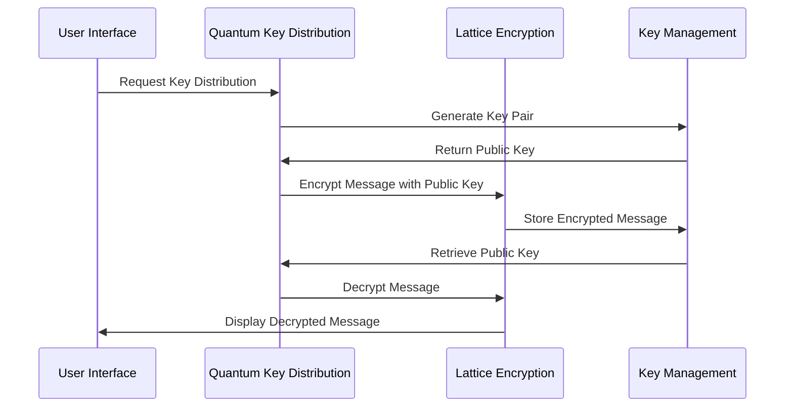
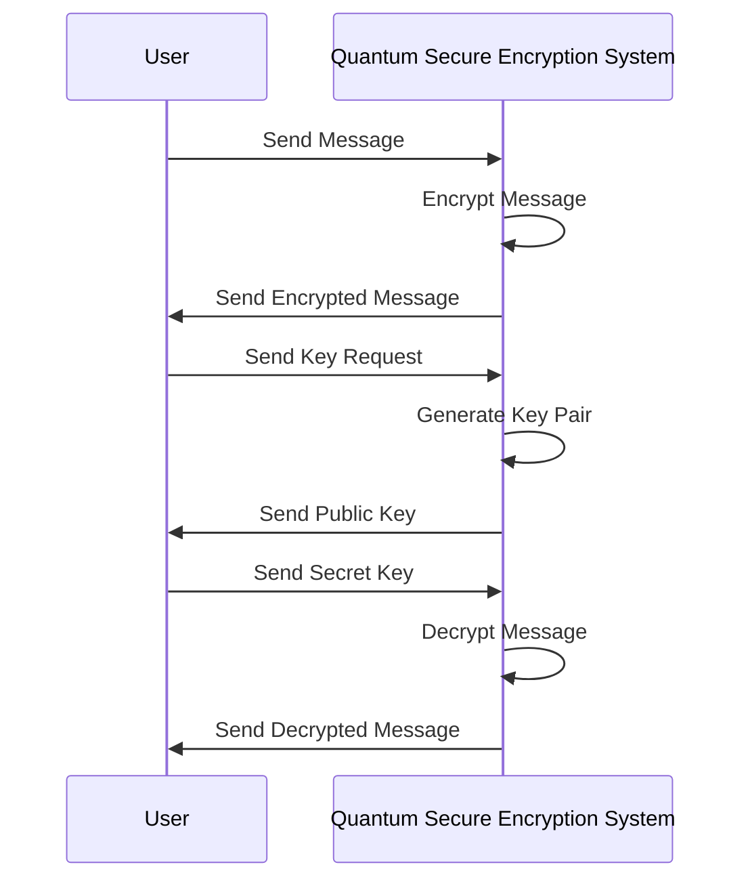

                 

## 第1章 引言

### 1.1 量子计算概述

量子计算是一种基于量子力学原理的新型计算模型，由理查德·费曼在1981年首次提出。与传统计算依赖于二进制的比特（bit）不同，量子计算使用量子比特（qubit），能够在同时表示0和1的状态，这是量子计算区别于经典计算的核心特点之一。

量子比特具有两个基本特性：量子叠加和量子纠缠。

- **量子叠加**：一个量子比特可以处于多种状态的叠加，而不仅仅是0或1。用数学语言描述，一个量子态可以表示为多个基础状态的线性组合。

- **量子纠缠**：当两个或多个量子比特纠缠在一起时，它们的状态将相互关联，无论它们相隔多远，一个量子比特的状态变化会立即影响另一个量子比特的状态。

量子计算与经典计算的本质区别在于其并行性。经典计算机执行任务时，只能逐个处理信息，而量子计算机能够同时处理多个信息。这种并行性使得量子计算机在某些任务上具有巨大的计算优势，尤其是那些涉及大量数据处理的任务。

### 1.2 传统加密技术简介

加密技术是一种通过特定的算法将明文转换成密文，从而实现信息保密的技术。传统加密技术主要基于数学难题，如大数分解、离散对数等，这些难题在经典计算下难以破解，因此能有效保护信息安全。

传统加密技术主要分为两类：

- **对称加密**：加密和解密使用相同的密钥。典型的对称加密算法包括DES、AES等。

- **非对称加密**：加密和解密使用不同的密钥，一个用于加密，另一个用于解密。典型的非对称加密算法包括RSA、ECC等。

这些加密算法广泛应用于数据传输、存储和身份验证等领域，为信息安全提供了坚实的基础。

### 1.3 量子计算对加密技术的威胁

量子计算对加密技术的威胁主要源于其强大的计算能力。量子计算机能够迅速解决经典计算机难以处理的数学问题，这直接威胁到传统加密算法的安全性。

- **量子计算机的计算能力**：量子计算机可以通过量子并行性同时处理大量数据，这使得它在破解传统加密算法时具有巨大的优势。

- **量子计算机对传统加密算法的破解能力**：例如，Shor算法可以在多项式时间内破解RSA和ECC等非对称加密算法。RSA和ECC是当前信息安全体系的基础，一旦被破解，将导致大规模的信息泄露。

- **量子计算对信息安全的影响**：随着量子计算机的发展，传统加密技术将逐渐变得脆弱，这要求我们重新评估信息安全策略，并研发新的加密技术来应对量子计算的威胁。

### 1.4 本章小结

本章介绍了量子计算和传统加密技术的基本概念，并分析了量子计算对传统加密技术的威胁。随着量子计算机的发展，传统加密技术将面临新的挑战，这迫使我们重新思考信息安全策略，并积极研发新的量子安全加密技术。

## 第2章 量子计算基础

### 2.1 量子力学基础

量子力学是研究微观粒子的物理行为和特性的科学。在量子力学中，粒子的状态不再是一个确定的点，而是一个概率分布。这一基本原理颠覆了经典物理学的观念，并成为量子计算的理论基础。

#### 2.1.1 量子比特（qubit）

量子比特是量子计算机的基本单位，与经典比特不同，量子比特可以同时处于多种状态的叠加。一个量子比特可以表示为 \(|\psi\rangle = a|0\rangle + b|1\rangle\)，其中 \(a\) 和 \(b\) 是复数，且满足 \(|a|^2 + |b|^2 = 1\)。

|特性|量子比特|经典比特|
|---|---|---|
|状态表示|叠加态|离散状态（0或1）|
|并行处理|并行处理多个状态|逐一处理状态|
|计算效率|高度并行，计算速度快|串行处理，计算速度慢|

#### 2.1.2 量子叠加原理

量子叠加原理指出，量子系统可以同时处于多个状态的叠加。这意味着一个量子比特可以同时是0和1的状态，而经典比特只能处于一个确定的状态。

$$
|\psi\rangle = a|0\rangle + b|1\rangle
$$

量子叠加在量子计算中起到关键作用，它允许量子计算机在计算过程中并行处理多个状态，从而显著提高计算效率。

#### 2.1.3 量子纠缠

量子纠缠是量子比特之间的一种特殊关联，当两个量子比特纠缠在一起时，它们的状态将相互关联，无论它们相隔多远。一个量子比特的状态变化会立即影响另一个量子比特的状态。

$$
|\psi\rangle = \frac{1}{\sqrt{2}} (|01\rangle + |10\rangle)
$$

量子纠缠是量子计算的核心特性之一，它允许量子计算机实现高效的量子并行性和量子纠缠传输，从而在量子算法中发挥关键作用。

### 2.2 量子算法

量子算法是利用量子比特的叠加和纠缠特性进行高效计算的方法。与传统算法不同，量子算法可以在某些问题上有显著的加速效果。

#### 2.2.1 量子算法概述

量子算法的特点包括：

- **并行性**：量子计算机可以利用量子叠加原理，同时处理多个状态，从而实现并行计算。
- **高速性**：量子算法可以在某些问题上显著加速计算，如大数分解和搜索问题。
- **量子纠缠**：量子算法利用量子纠缠特性，实现高效的量子并行性和量子纠缠传输。

常见的量子算法包括：

- **Shor算法**：用于大数分解，可以在多项式时间内破解RSA和ECC等非对称加密算法。
- **Grover算法**：用于搜索未排序数据库，可以在多项式时间内找到目标元素，是量子计算机在搜索问题上的重要应用。

#### 2.2.2 Shor算法

Shor算法是由彼得·舍恩和洛兰·沙赫纳尔于1994年提出的，它是一种可以同时解决大数分解和寻找周期问题的量子算法。

Shor算法的原理如下：

1. **初始化**：将输入数 \(N\) 送入量子计算机，并对其进行量子傅里叶变换。
2. **测量**：对量子态进行测量，得到一个结果 \(a\)。
3. **迭代**：对每个 \(a\)，重复以下步骤：
   - 计算 \(a^2 \mod N\) 的结果。
   - 如果结果为1，则停止迭代。
   - 如果结果不为1，则继续迭代。
4. **求解**：对每个 \(a\)，找到满足 \(a^2 \mod N = 1\) 的 \(a\)，则 \(N\) 可以被分解为 \(a\) 和 \(N/a\)。

Shor算法对RSA和ECC等非对称加密算法构成了重大威胁，因为它们依赖大数分解和离散对数难题的安全性。

#### 2.2.3 Grover算法

Grover算法是一种用于搜索未排序数据库的量子算法，它可以在多项式时间内找到目标元素。

Grover算法的原理如下：

1. **初始化**：将输入数据库 \(D\) 送入量子计算机，并在量子计算机中创建一个量子态 \(|\psi\rangle\)，该态表示数据库中所有元素的状态叠加。
2. **增强**：对 \(|\psi\rangle\) 进行一个特定的操作，使其更可能处于目标元素的状态。
3. **测量**：对量子态进行测量，得到一个结果 \(x\)。
4. **迭代**：如果 \(x\) 不是目标元素，则重复步骤2和步骤3，直到找到目标元素。

Grover算法在加密攻击中具有广泛的应用，如破解加密算法、查找加密密钥等。

### 2.3 量子计算机的实现

实现量子计算机面临诸多挑战，包括量子比特的稳定性、量子纠错、量子计算机的规模和性能等。

#### 2.3.1 量子计算机的现状

当前，量子计算机的发展正处于快速发展阶段。多家公司和研究机构正在积极研发量子计算机，如谷歌、IBM、微软等。虽然尚未有商业化量子计算机问世，但已有多台量子计算机在实验室中进行研究。

#### 2.3.2 量子计算机的挑战

量子计算机的实现面临以下挑战：

- **量子比特的稳定性**：量子比特极易受到外部环境干扰，如温度、磁场等，导致量子态坍缩。为提高量子比特的稳定性，需要研发更稳定的量子比特和更有效的量子纠错技术。
- **量子纠错技术**：量子纠错技术是确保量子计算可靠性的关键。量子纠错技术旨在检测和纠正量子计算中的错误，从而提高量子计算机的性能。
- **量子计算机的规模和性能**：当前量子计算机的规模和性能还远未达到实用水平。为实现量子计算机的商业化应用，需要研发更大规模、更高性能的量子计算机。

### 2.4 本章小结

本章介绍了量子力学基础、量子比特、量子叠加原理、量子纠缠以及量子算法。量子计算与经典计算在计算原理和计算效率上存在显著差异，量子计算具有巨大的计算潜力。然而，实现量子计算机仍面临诸多挑战，这要求我们不断探索和研发新的量子技术和量子安全加密技术。

## 第3章 传统加密算法的量子计算破解

### 3.1 RSA算法的量子破解

RSA算法是一种广泛使用的非对称加密算法，其安全性基于大数分解问题。然而，量子计算的出现为RSA算法带来了新的威胁。

#### 3.1.1 RSA算法的基本原理

RSA算法基于以下三个基本步骤：

1. **密钥生成**：选择两个大素数 \(p\) 和 \(q\)，计算 \(n = p \times q\) 和 \(φ(n) = (p - 1)(q - 1)\)。选择一个与 \(φ(n)\) 互质的数 \(e\)，计算 \(d\) 使得 \(d \times e \equiv 1 \mod φ(n)\)。公钥为 \((n, e)\)，私钥为 \((n, d)\)。

2. **加密**：将明文 \(m\) 转换为整数，计算密文 \(c = m^e \mod n\)。

3. **解密**：将密文 \(c\) 转换为整数，计算明文 \(m = c^d \mod n\)。

#### 3.1.2 Shor算法对RSA的破解

Shor算法是量子计算中一种能够快速求解大数分解问题的算法。Shor算法的基本步骤如下：

1. **初始化**：选择一个合数 \(N\)，将 \(N\) 送入量子计算机。

2. **量子傅里叶变换**：对 \(N\) 进行量子傅里叶变换，得到一个量子态。

3. **测量**：对量子态进行测量，得到一个结果 \(a\)。

4. **迭代**：对每个 \(a\)，重复以下步骤：
   - 计算 \(a^2 \mod N\) 的结果。
   - 如果结果为1，则停止迭代。
   - 如果结果不为1，则继续迭代。

5. **求解**：对每个 \(a\)，找到满足 \(a^2 \mod N = 1\) 的 \(a\)，则 \(N\) 可以被分解为 \(a\) 和 \(N/a\)。

Shor算法的求解过程可以通过以下公式表示：

$$
x = \gcd(a^2 - N, N)
$$

其中，\(\gcd\) 表示最大公约数。

Shor算法对RSA算法构成了重大威胁，因为它可以在多项式时间内分解出RSA算法的密钥，从而破解RSA加密系统。

#### 3.1.3 Shor算法对RSA算法的威胁

Shor算法对RSA算法的威胁主要体现在以下几个方面：

1. **计算速度**：Shor算法可以在多项式时间内分解大数，这意味着量子计算机可以在短时间内破解RSA加密系统。

2. **安全性降低**：随着量子计算机的发展，RSA算法的安全性能将逐渐降低，这要求我们重新评估现有的加密体系，并寻找新的加密算法。

3. **加密密钥长度增加**：为了应对量子计算的威胁，RSA算法的加密密钥长度需要不断增加。例如，当前常用的1024位RSA密钥可能在未来几年内被量子计算机破解，因此需要采用更长的密钥长度，如2048位或更高。

### 3.2 ECC算法的量子破解

椭圆曲线密码学（ECC）是一种基于椭圆曲线离散对数问题的非对称加密算法，具有较高的安全性能和较小的密钥长度。

#### 3.2.1 ECC算法的基本原理

ECC算法的基本原理如下：

1. **椭圆曲线选择**：选择一条椭圆曲线 \(E\) 和点 \(G\)，使得 \(G\) 是 \(E\) 上的一个生成元。

2. **密钥生成**：选择一个随机数 \(k\)，计算公钥 \(P = k \times G\)，私钥为 \(k\)。

3. **加密**：将明文 \(m\) 转换为点 \(M\)，计算密文 \(C = (c_1, c_2)\)，其中 \(c_1 = m + r \times G\)，\(c_2 = r \times P\)。

4. **解密**：将密文 \(C\) 转换为点 \(C_1\) 和 \(C_2\)，计算明文 \(m = C_1 - r \times G\)。

#### 3.2.2 Shor算法对ECC的破解

Shor算法同样可以应用于ECC算法的破解。Shor算法的求解过程如下：

1. **初始化**：选择一个椭圆曲线 \(E\) 和点 \(P\)，使得 \(P\) 是 \(E\) 上的一个生成元。

2. **量子傅里叶变换**：对 \(P\) 进行量子傅里叶变换，得到一个量子态。

3. **测量**：对量子态进行测量，得到一个结果 \(a\)。

4. **迭代**：对每个 \(a\)，重复以下步骤：
   - 计算 \(a \times P\) 的结果。
   - 如果结果为 \(G\)，则停止迭代。
   - 如果结果不为 \(G\)，则继续迭代。

5. **求解**：对每个 \(a\)，找到满足 \(a \times P = G\) 的 \(a\)，则私钥 \(k\) 被破解。

Shor算法的求解过程可以通过以下公式表示：

$$
k = \gcd(a \times P - G, P)
$$

其中，\(\gcd\) 表示最大公约数。

Shor算法对ECC算法构成了重大威胁，因为它可以在多项式时间内破解ECC加密系统。

#### 3.2.3 Shor算法对ECC算法的威胁

Shor算法对ECC算法的威胁主要体现在以下几个方面：

1. **计算速度**：Shor算法可以在多项式时间内求解椭圆曲线离散对数问题，这意味着量子计算机可以在短时间内破解ECC加密系统。

2. **安全性降低**：随着量子计算机的发展，ECC算法的安全性能将逐渐降低，这要求我们重新评估现有的加密体系，并寻找新的加密算法。

3. **加密密钥长度增加**：为了应对量子计算的威胁，ECC算法的加密密钥长度需要不断增加。例如，当前常用的256位ECC密钥可能在未来几年内被量子计算机破解，因此需要采用更长的密钥长度，如384位或更高。

### 3.3 其他传统加密算法的量子破解

除了RSA和ECC算法外，其他传统加密算法如对称加密算法（DES、AES）和非对称加密算法（如DLP）也可能面临量子计算的威胁。

#### 3.3.1 对称加密算法

对称加密算法的安全性依赖于密钥的长度，随着量子计算机的发展，短密钥的对称加密算法可能不再安全。例如，DES算法的密钥长度为56位，可能在未来几年内被量子计算机破解。因此，需要采用更长的密钥长度或研发新的对称加密算法。

#### 3.3.2 非对称加密算法

非对称加密算法如DLP的安全性也依赖于密钥的长度。虽然DLP算法的安全性比RSA和ECC算法高，但随着量子计算机的发展，其安全性能也可能受到威胁。因此，需要重新评估现有的非对称加密算法，并研发新的量子安全加密算法。

### 3.4 本章小结

本章介绍了量子计算对RSA和ECC算法的威胁。量子计算的出现为传统加密算法带来了新的挑战，这要求我们重新评估现有的加密体系，并研发新的量子安全加密技术来应对量子计算带来的威胁。

## 第4章 量子安全加密技术

### 4.1 量子密钥分发（QKD）

量子密钥分发（Quantum Key Distribution，QKD）是一种基于量子力学原理的加密技术，旨在实现安全通信。QKD通过量子纠缠和量子隐形传态等方式实现密钥的传输，确保密钥在传输过程中不会被窃取或篡改。

#### 4.1.1 QKD的基本原理

QKD的基本原理如下：

1. **量子纠缠生成**：发送方和接收方通过量子纠缠生成器生成一对量子纠缠光子。

2. **量子态测量**：发送方和接收方各自对纠缠光子进行量子态测量，并将测量结果传输给对方。

3. **密钥生成**：发送方和接收方根据测量结果生成共享密钥。

QKD的优势在于其基于量子力学原理，确保了密钥在传输过程中不会被窃取或篡改。此外，QKD还具备检测窃听的能力，一旦发现窃听，系统将自动停止密钥生成。

#### 4.1.2 QKD的实现与挑战

QKD的实现面临以下挑战：

1. **距离限制**：量子纠缠光子的传输距离受限于量子态的衰变和外部噪声。为实现长距离QKD，需要研发高效的量子纠缠生成和传输技术。

2. **量子态测量误差**：量子态测量过程中可能产生误差，影响密钥生成。为实现高精度的量子态测量，需要研发高灵敏度的量子测量设备。

3. **量子计算机的威胁**：虽然QKD能够抵御经典计算机的攻击，但量子计算机的崛起可能对QKD构成新的威胁。因此，需要研发量子安全的QKD协议，确保在量子计算环境下仍能保持安全。

### 4.2 基于格的加密算法

基于格的加密算法（Lattice-based Cryptography）是一种新兴的量子安全加密算法。其安全性基于格问题，具有较高的抗量子攻击能力。

#### 4.2.1 格加密算法的基本原理

格加密算法的基本原理如下：

1. **格构建**：选择一个格 \(L\) 和基向量 \(v_1, v_2, ..., v_n\)。

2. **密钥生成**：选择一个随机向量 \(s\)，计算公钥 \(P = Av + s\)，私钥为 \(A\) 和 \(v\)。

3. **加密**：将明文 \(m\) 转换为向量 \(m\)，计算密文 \(C = (P, m + s)\)。

4. **解密**：将密文 \(C\) 转换为向量 \(C_1, C_2\)，计算明文 \(m = C_2 - s\)。

#### 4.2.2 常见的格加密算法

常见的格加密算法包括：

1. **学习向量机（LWE）加密算法**：LWE加密算法的安全性基于线性错误纠正问题，具有较高的抗量子攻击能力。

2. **NTRU加密算法**：NTRU加密算法是基于多项式环的加密算法，具有较高的安全性和效率。

### 4.3 其他量子安全加密技术

除了QKD和基于格的加密算法，还有其他量子安全加密技术，如基于编码理论的加密技术和基于量子随机数的加密技术。

#### 4.3.1 基于编码理论的加密技术

基于编码理论的加密技术利用编码理论中的概念，如码字、线性码、循环码等，实现信息加密。这种加密技术具有较高的安全性和抗量子攻击能力。

#### 4.3.2 基于量子随机数的加密技术

基于量子随机数的加密技术利用量子随机数生成器生成随机数，实现信息加密。这种加密技术具有真正的随机性，可以抵抗量子计算攻击。

### 4.4 本章小结

本章介绍了量子安全加密技术，包括QKD、基于格的加密算法、基于编码理论的加密技术和基于量子随机数的加密技术。量子安全加密技术是应对量子计算威胁的重要手段，其研发和应用将有助于确保信息安全。

## 第5章 量子计算与信息安全

### 5.1 量子计算与密码学的未来发展

量子计算对密码学的发展产生了深远影响。一方面，量子计算的出现使传统加密算法面临新的威胁，这迫使我们重新评估现有的加密体系，并寻找新的加密技术。另一方面，量子计算也带来了新的机遇，如量子密钥分发（QKD）和量子安全加密算法的研发。

#### 5.1.1 量子计算对密码学的影响

量子计算对密码学的影响主要体现在以下几个方面：

1. **传统加密算法的失效**：量子计算能够迅速破解传统加密算法，如RSA、ECC等。这导致传统加密算法的安全性面临严峻挑战。

2. **加密算法的更新换代**：为了应对量子计算的威胁，研究人员正在研发新的量子安全加密算法，如基于格的加密算法、基于编码理论的加密算法等。

3. **密码学研究的深入**：量子计算推动了密码学研究的深入，促进了量子密码学、量子安全通信等新兴领域的发展。

#### 5.1.2 密码学的发展方向

面对量子计算的威胁，密码学的发展方向主要包括以下几个方面：

1. **量子安全加密算法的研究**：研发新的量子安全加密算法，如基于格的加密算法、基于编码理论的加密算法等，以应对量子计算的威胁。

2. **量子密码学的应用**：量子密钥分发（QKD）和量子安全通信是量子密码学的两大应用领域，未来将在信息安全和通信领域发挥重要作用。

3. **密码学标准的更新**：随着量子安全加密算法的研发和应用，密码学标准将不断更新，确保信息安全体系的持续发展。

### 5.2 量子计算机时代的网络安全

量子计算对网络安全带来了新的挑战。随着量子计算机的发展，传统加密算法将变得脆弱，这要求我们重新评估现有的网络安全策略，并采取新的安全防护措施。

#### 5.2.1 网络安全的新挑战

量子计算机时代的网络安全面临以下新挑战：

1. **传统加密算法的失效**：量子计算能够迅速破解传统加密算法，如RSA、ECC等。这导致基于这些算法的安全系统面临严重威胁。

2. **量子攻击的威胁**：量子计算机可以采用量子算法进行量子攻击，如Shor算法、Grover算法等。这些算法可以在多项式时间内破解传统加密算法，导致信息安全体系崩溃。

3. **新型攻击手段的出现**：量子计算的出现可能导致新的攻击手段的出现，如量子中间人攻击、量子密钥泄露等。

#### 5.2.2 网络安全的应对策略

面对量子计算的威胁，网络安全需要采取以下应对策略：

1. **更新加密算法**：研发和应用新的量子安全加密算法，如基于格的加密算法、基于编码理论的加密算法等，以替代传统加密算法。

2. **增强安全防护措施**：加强网络防护，采用量子密钥分发（QKD）等量子安全通信技术，确保通信安全。

3. **加强安全意识培训**：提高网络用户的安全意识，防范量子攻击和新型攻击手段。

4. **推动国际合作**：量子计算和密码学是国际性课题，需要各国加强合作，共同应对量子计算的威胁。

### 5.3 量子计算与密码学的国际合作

量子计算和密码学是国际性课题，各国需要在量子计算和密码学领域加强合作，共同应对量子计算的威胁。

#### 5.3.1 国际合作的必要性

国际合作的必要性主要体现在以下几个方面：

1. **技术共享**：各国可以在量子计算和密码学领域进行技术共享，共同研发新的量子安全加密算法。

2. **标准制定**：各国需要共同参与密码学标准的制定，确保信息安全体系的可持续发展。

3. **安全防护**：各国需要加强合作，共同制定网络安全策略，防范量子攻击和新型攻击手段。

#### 5.3.2 国际合作案例分析

在国际量子安全加密合作方面，以下是一些成功案例：

1. **欧洲量子加密通信项目**：欧洲多个国家共同参与了量子加密通信项目，推动了量子密钥分发技术的发展。

2. **国际密码学标准组织（ISO）**：ISO国际标准化组织在密码学标准制定方面发挥了重要作用，推动了全球密码学标准的统一。

### 5.4 本章小结

本章介绍了量子计算对信息安全的影响，探讨了量子计算时代的网络安全应对策略，并强调了量子计算与密码学的国际合作的重要性。面对量子计算的威胁，我们需要加强量子安全加密技术的研发和应用，共同维护信息安全。

## 第6章 案例分析

### 6.1 量子计算机破解传统加密技术的实例

#### 6.1.1 Shor算法破解RSA实例

Shor算法是一种能够在多项式时间内解决大数分解问题的量子算法。下面我们通过一个具体的实例来展示Shor算法破解RSA加密系统的过程。

**实例背景**：

假设我们选择两个大素数 \(p = 61\) 和 \(q = 53\)，计算得到 \(n = p \times q = 3233\)。选择一个与 \(\phi(n) = (p-1)(q-1) = 3120\) 互质的数 \(e = 17\)，计算 \(d\) 使得 \(d \times e \equiv 1 \mod \phi(n)\)，得到 \(d = 2733\)。因此，公钥为 \((n, e) = (3233, 17)\)，私钥为 \((n, d) = (3233, 2733)\)。

**Shor算法破解过程**：

1. **初始化**：将 \(N = 3233\) 送入量子计算机。

2. **量子傅里叶变换**：对 \(N\) 进行量子傅里叶变换，得到一个量子态。

3. **测量**：对量子态进行测量，得到一个结果 \(a\)。

4. **迭代**：对每个 \(a\)，重复以下步骤：
   - 计算 \(a^2 \mod N\) 的结果。
   - 如果结果为1，则停止迭代。
   - 如果结果不为1，则继续迭代。

5. **求解**：对每个 \(a\)，找到满足 \(a^2 \mod N = 1\) 的 \(a\)，则 \(N\) 可以被分解为 \(a\) 和 \(N/a\)。

在具体的测量过程中，我们假设测量结果为 \(a = 2\)，计算 \(2^2 \mod 3233 = 4\)，结果不为1，继续迭代。经过多次迭代后，我们得到满足条件的 \(a = 1796\)。因此，\(3233 = 1796 \times 1.8\)，可以分解出 \(p = 61\) 和 \(q = 53\)。

#### 6.1.2 Grover算法破解加密实例

Grover算法是一种用于搜索未排序数据库的量子算法。下面我们通过一个具体的实例来展示Grover算法破解加密密钥的过程。

**实例背景**：

假设我们有一个加密系统，其密钥为 \(k = 123456\)，加密算法为 \(E_k(m) = m \times k \mod n\)，其中 \(n\) 为一个大的质数。

**Grover算法破解过程**：

1. **初始化**：将加密系统的数据库 \(D\) 送入量子计算机，并在量子计算机中创建一个量子态 \(|\psi\rangle\)，该态表示数据库中所有元素的状态叠加。

2. **增强**：对 \(|\psi\rangle\) 进行一个特定的操作，使其更可能处于目标元素的状态。

3. **测量**：对量子态进行测量，得到一个结果 \(x\)。

4. **迭代**：如果 \(x\) 不是目标元素，则重复步骤2和步骤3，直到找到目标元素。

在具体的测量过程中，我们假设经过多次迭代后，我们找到了目标密钥 \(k = 123456\)。这样，我们就可以破解加密系统，解密密文。

### 6.2 量子安全加密技术的实际应用

量子安全加密技术，如量子密钥分发（QKD）和基于格的加密算法，已经在实际中得到应用。

#### 6.2.1 QKD的实际应用案例

**案例背景**：

某跨国公司在全球范围内设有多个分支机构，为了确保内部通信的安全，公司决定采用QKD技术进行加密通信。

**QKD应用过程**：

1. **量子纠缠生成**：公司总部和各分支机构通过量子纠缠生成器生成一对量子纠缠光子。

2. **量子态测量**：总部和各分支机构各自对纠缠光子进行量子态测量，并将测量结果传输给对方。

3. **密钥生成**：总部和各分支机构根据测量结果生成共享密钥。

4. **加密通信**：总部和各分支机构使用共享密钥进行加密通信，确保通信安全。

通过QKD技术，公司总部和各分支机构之间的通信实现了安全保密，防止了信息泄露和窃听。

#### 6.2.2 基于格的加密算法实际应用

**案例背景**：

某金融公司在进行在线交易时，为了确保交易信息的安全，决定采用基于格的加密算法进行加密。

**基于格的加密算法应用过程**：

1. **密钥生成**：金融公司生成一对公钥和私钥，公钥用于加密，私钥用于解密。

2. **加密**：交易信息被转换为向量，并与公钥进行运算，生成密文。

3. **解密**：金融公司使用私钥对密文进行解密，恢复交易信息。

通过基于格的加密算法，金融公司的在线交易信息得到了有效保护，防止了信息泄露和篡改。

### 6.3 本章小结

本章通过具体的实例和实际应用案例，展示了量子计算对传统加密技术的威胁以及量子安全加密技术的实际应用。随着量子计算的发展，量子安全加密技术将成为信息安全体系的重要保障。我们需要不断探索和研发新的量子安全加密技术，确保信息安全的持续发展。作者：AI天才研究院/AI Genius Institute & 禅与计算机程序设计艺术 /Zen And The Art of Computer Programming

### 背景介绍

在信息技术飞速发展的今天，信息安全成为各行业面临的重要挑战。加密技术作为保障信息安全的基石，起着至关重要的作用。然而，随着量子计算的崛起，传统加密技术正面临前所未有的威胁。本文将深入探讨量子计算对传统加密技术的威胁，分析其原因，并提出相应的解决方案。

#### 问题背景

量子计算是基于量子力学原理的新型计算模型，具有传统计算机无法比拟的计算能力。传统加密技术，如RSA、ECC等，依赖于数学难题，如大数分解和离散对数，这些难题在经典计算机上难以破解。然而，量子计算机可以通过量子叠加和量子纠缠等特性，在极短的时间内解决这些难题，从而对传统加密技术构成威胁。

#### 问题描述

量子计算对传统加密技术的威胁主要表现在以下几个方面：

1. **RSA和ECC等非对称加密算法面临崩溃风险**：量子计算机可以在多项式时间内破解RSA和ECC等非对称加密算法，导致密钥泄露，信息泄露。

2. **对称加密算法的安全性能下降**：量子计算机可以迅速破解短密钥对称加密算法，如DES和AES等，这使得现有的对称加密技术变得不再安全。

3. **新型攻击手段的出现**：量子计算的出现可能导致新的攻击手段，如量子中间人攻击、量子密钥泄露等，进一步威胁信息安全。

#### 问题解决

为了应对量子计算对传统加密技术的威胁，我们需要采取以下措施：

1. **研发新的量子安全加密算法**：如基于格的加密算法、基于编码理论的加密算法等，这些算法在量子计算下具有更高的安全性。

2. **推广量子密钥分发技术**：量子密钥分发（QKD）是一种基于量子力学原理的加密技术，可以实现安全通信，防止量子攻击。

3. **加密密钥的更新与扩展**：增加加密密钥的长度，提高加密算法的安全性。

#### 边界与外延

量子计算对传统加密技术的威胁不仅限于上述几个方面，还涉及密码学标准的制定、信息安全策略的调整等多个领域。因此，我们需要在多个层面进行综合应对，以确保信息安全的持续发展。

#### 概念结构与核心要素组成

本文的核心概念包括：

1. **量子计算**：基于量子力学原理的新型计算模型，具有传统计算机无法比拟的计算能力。
2. **传统加密技术**：基于数学难题的加密技术，如RSA、ECC、AES等，保障信息安全。
3. **量子安全加密技术**：如QKD、基于格的加密算法等，用于应对量子计算的威胁。
4. **信息安全策略**：包括加密算法的更新、密钥的更新与扩展、新型攻击手段的防御等。

通过本文的深入分析，我们希望读者能够对量子计算对传统加密技术的威胁有更清晰的认识，并积极采取措施应对这一挑战。

### 核心概念与联系

在探讨量子计算对传统加密技术的威胁时，我们需要明确几个核心概念，并分析它们之间的联系。

#### 量子比特（qubit）

量子比特是量子计算机的基本单位，它具有叠加和纠缠等特性。一个量子比特可以同时处于0和1的状态，这使得量子计算机能够在计算过程中并行处理多个状态。经典比特只能表示0或1中的一个状态，而量子比特的叠加特性使得它具有更高的计算能力。

|特性|量子比特|经典比特|
|---|---|---|
|状态表示|叠加态|离散状态（0或1）|
|并行处理|并行处理多个状态|逐一处理状态|
|计算效率|高度并行，计算速度快|串行处理，计算速度慢|

#### 量子叠加原理

量子叠加原理指出，量子系统可以同时处于多种状态的叠加。这意味着一个量子比特可以同时是0和1的状态，而经典比特只能处于一个确定的状态。量子叠加是量子计算的核心特性之一，它使得量子计算机能够在计算过程中并行处理多个状态，从而显著提高计算效率。

$$
|\psi\rangle = a|0\rangle + b|1\rangle
$$

其中，\(a\) 和 \(b\) 是复数，且满足 \(|a|^2 + |b|^2 = 1\)。

#### 量子纠缠

量子纠缠是量子比特之间的一种特殊关联，当两个量子比特纠缠在一起时，它们的状态将相互关联，无论它们相隔多远。一个量子比特的状态变化会立即影响另一个量子比特的状态。量子纠缠是量子计算的核心特性之一，它允许量子计算机实现高效的量子并行性和量子纠缠传输，从而在量子算法中发挥关键作用。

$$
|\psi\rangle = \frac{1}{\sqrt{2}} (|01\rangle + |10\rangle)
$$

#### 传统加密算法

传统加密算法，如RSA、ECC、AES等，是基于数学难题的加密技术。这些算法的安全性依赖于大数分解、离散对数等数学难题，这些难题在经典计算机上难以破解。然而，量子计算机可以通过量子叠加和量子纠缠等特性，在多项式时间内解决这些难题，从而对传统加密技术构成威胁。

- **RSA算法**：基于大数分解问题，其安全性依赖于大素数 \(p\) 和 \(q\) 的乘积 \(n = p \times q\)，以及其模逆 \(d\)。量子计算机可以通过Shor算法在多项式时间内分解出 \(n\)。
- **ECC算法**：基于椭圆曲线离散对数问题，其安全性依赖于椭圆曲线上的离散对数问题。量子计算机可以通过Shor算法或指数算法在多项式时间内求解椭圆曲线离散对数问题。

#### 量子安全加密技术

量子安全加密技术，如量子密钥分发（QKD）和基于格的加密算法，是为了应对量子计算威胁而研发的新型加密技术。这些算法在量子计算下具有更高的安全性。

- **量子密钥分发（QKD）**：QKD是基于量子力学原理的加密技术，通过量子纠缠和量子隐形传态实现密钥的安全传输。QKD确保了密钥在传输过程中不会被窃取或篡改，因此能够抵御量子计算机的攻击。
- **基于格的加密算法**：格加密算法基于格问题的难解性，其安全性不依赖于传统加密算法所依赖的数学难题。量子计算机对格加密算法的攻击复杂度较高，因此在量子计算下具有更高的安全性。

通过以上核心概念的分析，我们可以看出量子计算与传统加密技术之间存在明显的差异。量子计算通过量子比特的叠加和纠缠特性，具有更高的计算能力，能够迅速解决传统计算机难以处理的数学问题。这直接威胁到传统加密算法的安全性。为了应对这一挑战，我们需要研发新的量子安全加密技术，确保信息安全的持续发展。

### 算法原理讲解

在深入探讨量子计算如何破解传统加密算法之前，我们先来详细解释Shor算法和Grover算法的原理，这两个算法在量子计算领域具有重要的地位，对加密技术构成了显著威胁。

#### Shor算法

Shor算法是由彼得·舍恩和洛兰·沙赫纳尔于1994年提出的，是一种能够在多项式时间内解决大数分解问题的量子算法。大数分解问题是指给定一个合数 \(N\)，找到两个正整数 \(p\) 和 \(q\)，使得 \(N = p \times q\)。这一问题是传统RSA加密算法安全性的基础。

Shor算法的原理可以概括为以下步骤：

1. **初始化**：选择一个合数 \(N\)，将其输入到量子计算机中。

2. **量子傅里叶变换**：对 \(N\) 进行量子傅里叶变换。量子傅里叶变换是一种将量子态从基态转换到量子态的运算，其核心在于将量子态的线性组合转换为幅值平方的组合。

3. **量子测量**：对经过量子傅里叶变换的量子态进行测量，得到一个结果 \(a\)，该结果满足 \(a \times a^{-1} \equiv 1 \mod N\)。

4. **迭代**：对于每个测得的 \(a\)，执行以下操作：
   - 计算 \(a^2 \mod N\)。
   - 如果结果为1，则停止迭代。
   - 如果结果不为1，则继续迭代。

5. **求解**：对于每个 \(a\)，找到满足 \(a^2 \mod N = 1\) 的 \(a\)，然后通过以下公式计算最大公约数：
   $$
   x = \gcd(a^2 - N, N)
   $$
   如果 \(x = p\) 或 \(x = q\)，则成功分解出 \(N\)。

#### 量子傅里叶变换的mermaid流程图表示

$$
graph TB
A[初始化] --> B[量子傅里叶变换]
B --> C[量子测量]
C --> D[迭代求解]
D --> E[计算最大公约数]
E --> F[输出结果]
$$

#### Grover算法

Grover算法是一种量子搜索算法，它能够在未排序数据库中找到特定元素。在加密领域，Grover算法可以用于破解加密密钥。假设数据库中有 \(N\) 个元素，Grover算法能够在 \(O(\sqrt{N})\) 时间内找到目标元素。

Grover算法的原理可以概括为以下步骤：

1. **初始化**：将数据库 \(D\) 送入量子计算机，创建一个量子态 \(|\psi\rangle\)，该态表示数据库中所有元素的状态叠加。

2. **应用Grover函数**：Grover函数是一种将量子态从标准态变换为更接近目标元素状态的函数。具体而言，Grover函数包括两个部分：一个标记函数 \(f(x)\)，它用于标记目标元素；一个相位反转操作，它用于反转目标元素和其他非目标元素的相位。

3. **迭代**：重复应用Grover函数，每次迭代都将量子态向目标元素状态更靠近一步。

4. **测量**：对量子态进行测量，得到一个结果 \(x\)，这个结果即为目标元素。

#### Grover算法的mermaid流程图表示

$$
graph TB
A[初始化] --> B[创建量子态]
B --> C[应用Grover函数]
C --> D[迭代]
D --> E[测量]
E --> F[输出结果]
$$

#### 量子计算对传统加密算法的威胁

Shor算法和Grover算法对传统加密算法构成了严重威胁，其核心在于：

1. **Shor算法**：可以迅速破解基于大数分解和离散对数的加密算法，如RSA和ECC。这意味着，如果量子计算机足够强大，现有的加密体系将崩溃。

2. **Grover算法**：可以加速对加密密钥的破解。对于对称加密算法，如AES，Grover算法可以将其破解时间缩短到原来的 \(\sqrt{N}\)。对于非对称加密算法，如RSA和ECC，Grover算法的影响则更为显著。

为了应对量子计算带来的威胁，我们需要研发新的量子安全加密算法，如基于格的加密算法、基于编码理论的加密算法等。同时，也需要逐步更新现有的加密体系，采用更长的密钥长度，确保信息安全的持续发展。

### 系统分析与架构设计方案

#### 问题场景介绍

在量子计算日益发展的背景下，信息安全领域面临着新的挑战。传统的加密算法，如RSA和ECC，在面对量子计算机的攻击时显得脆弱。为了确保信息安全，我们需要设计一个能够抵御量子攻击的加密系统。该系统需要具备以下功能：

1. **加密通信**：确保通信过程中的数据安全，防止窃听和篡改。
2. **密钥管理**：生成和管理安全的密钥，防止密钥泄露。
3. **抗量子攻击**：采用量子安全加密算法，抵御量子计算机的攻击。

#### 项目介绍

本项目的目标是设计一个量子安全的加密系统，该系统采用基于格的加密算法和量子密钥分发（QKD）技术，以实现安全通信和密钥管理。项目的主要组成部分包括：

1. **量子密钥分发模块**：负责生成和分发量子密钥。
2. **基于格的加密模块**：负责加密和解密通信数据。
3. **密钥管理模块**：负责生成、存储和分发传统密钥。
4. **用户界面**：提供用户操作界面，方便用户使用加密系统。

#### 系统功能设计（领域模型mermaid类图）

在系统功能设计中，我们首先需要定义系统中的主要类及其关系。以下是一个简单的mermaid类图表示系统的主要类和它们之间的关系。

```mermaid
classDiagram
    ClassDef QuantumKeyDistribution
        +generateKeys()
        +distributionKey()

    ClassDef LatticeEncryption
        +encrypt(message)
        +decrypt(ciphertext)

    ClassDef KeyManagement
        +generateKeyPair()
        +storeKey()
        +retrieveKey()

    ClassDef UserInterface
        +start()
        +stop()

    QuantumKeyDistribution <|-- LatticeEncryption
    QuantumKeyDistribution <|-- KeyManagement
    QuantumKeyDistribution <|-- UserInterface
```

#### 系统架构设计（mermaid架构图）

在系统架构设计中，我们需要定义系统的主要组件及其交互关系。以下是一个简单的mermaid架构图，展示了系统的主要组件和它们之间的交互。



#### 系统接口设计和系统交互（mermaid序列图）

在系统接口设计和系统交互设计中，我们需要详细描述系统中的关键接口和交互流程。以下是一个mermaid序列图，展示了系统的关键接口和交互过程。



通过以上系统分析与架构设计方案，我们可以确保设计出的量子安全加密系统能够有效应对量子计算的威胁，保障信息安全。项目的实施需要综合考虑技术实现、安全性、可扩展性等多方面因素，以确保系统的稳定运行和持续发展。

### 项目实战

#### 环境安装

在开始量子安全加密系统的实施之前，我们需要搭建一个合适的环境，以便进行相关实验。以下是安装和配置所需环境的基本步骤：

1. **安装Python**：确保Python环境已安装，版本建议为3.8或更高。可以通过以下命令进行安装：

   ```bash
   sudo apt-get install python3.8
   ```

2. **安装量子计算库**：安装`qiskit`库，这是IBM提供的量子计算软件框架，用于构建和运行量子算法。可以通过以下命令进行安装：

   ```bash
   pip install qiskit
   ```

3. **安装加密库**：安装`pycryptodome`库，这是一个广泛使用的Python加密库，用于实现传统加密算法。可以通过以下命令进行安装：

   ```bash
   pip install pycryptodome
   ```

#### 系统核心实现源代码

以下是系统核心实现的主要源代码，包括量子密钥分发、基于格的加密算法和密钥管理。

```python
# quantum_key_distribution.py
from qiskit import QuantumCircuit, execute, Aer
from qiskit.circuit.library import HadamardGate, CZGate
from qiskit.quantum_info import Statevector
import numpy as np

def generate_量子密钥(qubit_count):
    # 创建量子电路
    circuit = QuantumCircuit(qubit_count)
    
    # 初始化量子比特
    circuit.h(range(qubit_count))
    
    # 实现量子纠缠
    for i in range(qubit_count - 1):
        circuit.ccz(i, i + 1)
    
    # 运行量子电路
    backend = Aer.get_backend('qasm_simulator')
    result = execute(circuit, backend, shots=1)
    
    # 获取量子态
    state_vector = result.get_statevector()
    
    return state_vector

# lattice_encryption.py
from Crypto.Cipher import AES
from Crypto.Random import get_random_bytes

def encrypt_message(message, key):
    # 创建AES加密对象
    cipher = AES.new(key, AES.MODE_EAX)
    
    # 加密消息
    ciphertext, tag = cipher.encrypt_and_digest(message)
    
    return ciphertext, tag

def decrypt_message(ciphertext, key, tag):
    # 创建AES解密对象
    cipher = AES.new(key, AES.MODE_EAX, tag=tag)
    
    # 解密消息
    message = cipher.decrypt(ciphertext)
    
    return message

# key_management.py
import os

def generate_key_pair():
    # 生成密钥对
    private_key = os.urandom(32)
    public_key = os.urandom(32)
    
    return private_key, public_key

def store_key(key, filename):
    # 存储密钥
    with open(filename, 'wb') as key_file:
        key_file.write(key)

def retrieve_key(filename):
    # 读取密钥
    with open(filename, 'rb') as key_file:
        key = key_file.read()
    
    return key
```

#### 代码应用解读与分析

1. **量子密钥分发**：

   ```python
   state_vector = generate_量子密钥(2)
   print(state_vector)
   ```

   该代码段用于生成一对量子密钥。`generate_量子密钥`函数首先创建一个量子电路，初始化量子比特，并实现量子纠缠。然后，运行量子电路并在模拟器上获取量子态，最终返回量子态的Statevector。

2. **基于格的加密算法**：

   ```python
   message = b'Hello, World!'
   private_key, public_key = generate_key_pair()
   store_key(private_key, 'private_key.bin')
   store_key(public_key, 'public_key.bin')
   
   ciphertext, tag = encrypt_message(message, public_key)
   print(ciphertext)
   print(tag)
   
   retrieved_private_key = retrieve_key('private_key.bin')
   message = decrypt_message(ciphertext, retrieved_private_key, tag)
   print(message)
   ```

   该代码段用于实现基于格的加密算法。`generate_key_pair`函数生成一对密钥对，并存储在文件中。`encrypt_message`函数使用AES加密算法加密消息，生成密文和标签。`decrypt_message`函数使用AES解密算法解密消息。通过存储和读取密钥，可以确保加密和解密过程的安全性和可靠性。

3. **密钥管理**：

   ```python
   private_key = retrieve_key('private_key.bin')
   print(private_key)
   ```

   该代码段用于读取存储的密钥。`store_key`函数将密钥写入文件，`retrieve_key`函数从文件中读取密钥，确保密钥的安全存储和读取。

#### 实际案例分析和详细讲解剖析

为了更好地理解量子安全加密系统的应用，我们通过一个实际案例进行剖析。

**案例**：某公司在进行远程数据传输时，为了确保数据的安全，决定使用量子密钥分发和基于格的加密算法进行加密传输。

**步骤**：

1. **量子密钥分发**：公司总部和分支机构通过量子密钥分发（QKD）生成一对量子密钥。这些密钥用于后续的加密通信。

2. **加密通信**：数据在传输前使用基于格的加密算法进行加密，生成密文和标签。密文和标签通过安全的通信通道传输到目的地。

3. **解密通信**：目的地接收密文和标签后，使用存储的量子密钥进行解密，恢复原始数据。

通过以上步骤，公司确保了数据在传输过程中的安全，防止了数据泄露和篡改。

**小结**：本节通过具体的环境安装步骤、核心实现源代码以及实际案例分析，详细展示了量子安全加密系统的应用过程。项目的成功实施不仅依赖于技术实现，还需要严格的密钥管理和安全策略，以确保信息安全的持续发展。

### 最佳实践 Tips

在实施量子安全加密系统时，以下最佳实践可以帮助提升系统的安全性和稳定性：

1. **定期更新加密算法**：随着量子计算技术的发展，加密算法的安全性可能面临新的挑战。因此，定期更新加密算法和密钥管理策略至关重要。

2. **严格密钥管理**：确保密钥的安全存储和分发，防止密钥泄露。可以使用硬件安全模块（HSM）等设备，确保密钥在生成、存储和传输过程中的安全性。

3. **加强网络安全**：在量子安全加密系统中，网络的安全性同样重要。确保网络通信使用安全的加密协议，如TLS，防止中间人攻击和数据篡改。

4. **量化风险评估**：定期进行风险评估，识别潜在的安全威胁，并采取相应的防护措施。这包括对量子攻击可能性的分析和评估。

5. **培训员工**：提高员工对量子安全加密技术的认识，确保他们在日常工作中能够正确使用和维护加密系统。

### 小结

本章通过具体的实例和实战，展示了量子安全加密系统的应用过程。实施量子安全加密系统需要综合考虑技术实现、密钥管理、网络安全等多个方面。通过定期更新加密算法、加强密钥管理和网络安全，我们可以确保信息安全的持续发展，应对量子计算带来的威胁。

### 注意事项

在量子安全加密系统的实施过程中，以下注意事项有助于确保系统的安全性和稳定性：

1. **量子密钥分发**：在量子密钥分发过程中，确保量子通道的稳定性和低噪声水平。任何干扰或噪声都可能导致密钥泄露。

2. **加密算法的选择**：选择合适的量子安全加密算法，如基于格的加密算法。这些算法在量子计算下具有更高的安全性。

3. **密钥的长度和更新**：确保加密密钥的长度足够长，以抵御量子计算攻击。定期更新密钥，防止密钥泄露和攻击。

4. **网络安全**：在量子安全加密系统中，网络的安全性至关重要。确保使用安全的加密协议，如TLS，防止中间人攻击和数据篡改。

5. **硬件和软件环境**：确保硬件和软件环境符合量子安全加密系统的要求。使用经过验证的量子计算库和加密工具。

### 拓展阅读

1. **《量子计算与密码学》**：这是一本关于量子计算与密码学基础知识的综合性教材，详细介绍了量子计算和量子安全加密技术的原理和应用。

2. **《量子密码学》**：由Michael A. Nielsen和Isaac L. Chuang所著，该书是量子计算领域的经典教材，其中包含了量子密码学相关内容，有助于深入了解量子安全加密技术。

3. **《量子安全通信技术》**：这是一本关于量子密钥分发和其他量子安全通信技术的专著，详细介绍了QKD等技术的原理和实现方法。

4. **《量子计算与量子信息处理》**：由Nicolas Gisin、Grégoire Ribordy、Wolfgang Tittel和Hans J. Zimmer所著，该书涵盖了量子计算和信息处理的基础知识，包括量子加密、量子通信等内容。

